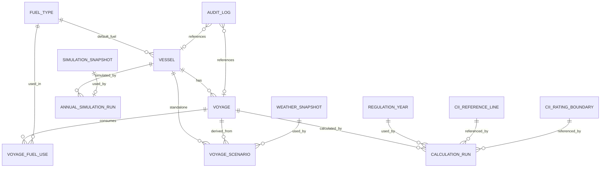

# DB_SCHEMA — CII 예측 및 운항 의사결정 보조 플랫폼

| 항목 | 내용 |
|---|---|
| 문서명 | DB_SCHEMA.md |
| 버전 | v1.2 |
| 상태 | Oracle Review + 외부 리뷰 반영 |
| 최종 수정일 | 2026-07-04 |
| 상위 문서 | `PRD.md` v3.1, `TECH_SPEC.md` v1.2, `API_SPEC.md` v1.2 |
| 후속 문서 | `TEST_PLAN.md` |
| DB 엔진 | PostgreSQL 16 (권장) |

---

## 0. 범위 및 목적

본 문서는 PRD §7 데이터 모델, TECH_SPEC의 기술 명세, API_SPEC의 응답 스키마를 기반으로 데이터베이스 스키마를 정의한다.

### 0.1 설계 원칙

| 원칙 | 설명 |
|---|---|
| 정밀도 우선 | CII 계산 관련 수치는 `NUMERIC(30,6)`. `FLOAT`/`DOUBLE` 사용 금지 (TECH_SPEC §1) |
| 스냅샷 보존 | 계산 결과는 변경 불가 snapshot으로 저장. 원본 데이터 변경 후에도 재현 가능 |
| 감사 추적 | 파라미터 변경, 항차 확정, 계산 실행 로그 저장 (TECH_SPEC §13.1) |
| 논리 삭제 | 비즈니스 데이터는 soft delete. 물리 삭제는 관리자 전용 |
| UUID PK | 모든 테이블 PK는 UUID v4. 자동 증분 정수 사용 안 함 |
| **타임존 정책 [X-6]** | 모든 `TIMESTAMPTZ` 값은 UTC 기준으로 저장된다. 서버 `timezone = UTC` 설정 필수. 클라이언트는 UTC로 전송하고 표시 시 로컬 변환을 수행한다 |

### 0.2 기준 문서 참조

| 문서 | 참조 내용 |
|---|---|
| PRD §7 | 핵심 엔티티 (Vessel, Voyage, VoyageFuelUse, VoyageScenario, CalculationRun) |
| PRD §7.6 | RegulationParameter 테이블 구조 |
| PRD §8.1 | 항차 상태 모델, status × policy 제약 |
| TECH_SPEC §2.2.2 | `rng_metadata` JSON 구조 |
| TECH_SPEC §5.2.1 | `parameters_used` JSON 스키마 |
| TECH_SPEC §9.1 | `a_raw` VARCHAR + `a_decimal` NUMERIC(30,6) 이중 저장 |
| TECH_SPEC §10.1 | `model_version` structured JSON |
| TECH_SPEC §11 | 스냅샷 격리 (`SimulationSnapshot`) |
| TECH_SPEC §13.1 | 감사 로그 필드 |
| API_SPEC §1.7 | 수치 직렬화 정책 (Layer 1 = 문자열) |

---

## 1. ER 다이어그램



> **[S-6 수정]** `SIMULATION_SNAPSHOT ||--o| ANNUAL_SIMULATION_RUN` (1:1 또는 1:0..1)으로 변경. 시뮬레이션 실행 1건당 스냅샷 1건이 생성되며, 스냅샷이 부모이다. `AUDIT_LOG`의 카디널리티도 `}o--o|`로 수정 (entity_id가 NULL 허용).

---

## 2. 테이블 정의

> **[C-3 전역 정책]** 모든 FK에 명시적 `ON DELETE` 동작을 지정한다. 상세는 §7.1 "FK ON DELETE 정책" 참조.

### 2.1 `vessel` — 선박

| 컬럼 | 타입 | 제약 | 설명 |
|---|---|---|---|
| `id` | UUID | PK, NOT NULL | 내부 ID |
| `imo_number` | VARCHAR(7) | NOT NULL | IMO 번호 (7자리 숫자). 유일성은 partial unique index로만 보장 (soft delete 호환) |
| `name` | VARCHAR(100) | NOT NULL | 선박명 |
| `ship_type` | VARCHAR(50) | NOT NULL | CII 선종 enum. `cii_reference_line.ship_type`에 존재해야 함 |
| `gross_tonnage` | NUMERIC(12,2) | NULL | GT |
| `deadweight` | NUMERIC(12,2) | NULL | DWT |
| `default_fuel_type` | VARCHAR(30) | NULL, **FK → fuel_type(code) ON UPDATE CASCADE** [S-1] | 기본 연료 코드 |
| `reference_speed_kn` | NUMERIC(6,2) | NULL | 기준 속도 (kn) |
| `reference_daily_foc_ton` | NUMERIC(8,2) | NULL | 기준 일일 연료소모량 (ton/day) |
| `is_cii_applicable_hint` | BOOLEAN | NOT NULL DEFAULT false | GT ≥ 5000 및 선종 기준 자동 산정 |
| `is_deleted` | BOOLEAN | NOT NULL DEFAULT false | Soft delete 플래그 |
| `created_at` | TIMESTAMPTZ | NOT NULL DEFAULT now() | 생성일 |
| `updated_at` | TIMESTAMPTZ | NOT NULL DEFAULT now() | 수정일 (§7.2 trigger로 자동 갱신) |

**인덱스:**

```sql
-- pg_trgm extension (GIN trigram index에 필요)
CREATE EXTENSION IF NOT EXISTS pg_trgm;
CREATE UNIQUE INDEX idx_vessel_imo ON vessel (imo_number) WHERE is_deleted = false;
CREATE INDEX idx_vessel_ship_type ON vessel (ship_type) WHERE is_deleted = false;
CREATE INDEX idx_vessel_name ON vessel USING gin (name gin_trgm_ops) WHERE is_deleted = false;
```

**검증 제약:**

```sql
ALTER TABLE vessel ADD CONSTRAINT chk_imo_format CHECK (imo_number ~ '^\d{7}$');
ALTER TABLE vessel ADD CONSTRAINT chk_gt_positive CHECK (gross_tonnage IS NULL OR gross_tonnage > 0);
ALTER TABLE vessel ADD CONSTRAINT chk_dwt_positive CHECK (deadweight IS NULL OR deadweight > 0);
ALTER TABLE vessel ADD CONSTRAINT chk_speed_positive CHECK (reference_speed_kn IS NULL OR reference_speed_kn > 0);
```

> `gross_tonnage`와 `deadweight`는 PRD §7.2에서 "조건부 필수"이다. CII 계산 시점에 VAL-010으로 검증한다.
>
> **[S-1]** `default_fuel_type`에 FK 제약 추가. `fuel_type.code`를 참조하며 `ON UPDATE CASCADE`로 코드 변경 시 자동 전파.

---

### 2.2 `voyage` — 항차

| 컬럼 | 타입 | 제약 | 설명 |
|---|---|---|---|
| `id` | UUID | PK | 항차 ID |
| `vessel_id` | UUID | NOT NULL, FK → vessel(id) **ON DELETE RESTRICT** [DB-C-3] | 선박 ID |
| `voyage_no` | VARCHAR(100) | NULL | 사용자 입력 항차 번호 |
| `status` | VARCHAR(20) | NOT NULL | DRAFT, PLANNED, IN_PROGRESS, COMPLETED, CONFIRMED, CANCELLED, ARCHIVED |
| `regulation_year` | INTEGER | NULL **[C-1 추가]** | 해당 항차가 포함될 규정연도. `annual_inclusion_policy ≠ EXCLUDE`인 경우 NOT NULL 필수 |
| `departure_port_name` | VARCHAR(200) | NOT NULL | 출발항 |
| `departure_lat` | NUMERIC(9,6) | NULL | 출발항 위도 |
| `departure_lon` | NUMERIC(9,6) | NULL | 출발항 경도 |
| `arrival_port_name` | VARCHAR(200) | NOT NULL | 도착항 |
| `arrival_lat` | NUMERIC(9,6) | NULL | 도착항 위도 |
| `arrival_lon` | NUMERIC(9,6) | NULL | 도착항 경도 |
| `planned_distance_nm` | NUMERIC(12,2) | NOT NULL | 계획 거리 |
| `actual_distance_nm` | NUMERIC(12,2) | NULL | 실제 거리 |
| `planned_speed_kn` | NUMERIC(6,2) | NOT NULL | 예정 평균 속도 |
| `actual_avg_speed_kn` | NUMERIC(6,2) | NULL | 실제 평균 속도 |
| `planned_departure_at` | TIMESTAMPTZ | NULL | 예정 출항 |
| `planned_arrival_at` | TIMESTAMPTZ | NULL | 예정 도착 |
| `actual_departure_at` | TIMESTAMPTZ | NULL | 실제 출항 |
| `actual_arrival_at` | TIMESTAMPTZ | NULL | 실제 도착 |
| `annual_inclusion_policy` | VARCHAR(30) | NOT NULL DEFAULT 'EXCLUDE' | EXCLUDE, INCLUDE_AS_PLAN, INCLUDE_AS_ACTUAL |
| `created_from` | VARCHAR(30) | NOT NULL DEFAULT 'MANUAL' | MANUAL, FEATURE_1, FEATURE_2_ADOPTED, IMPORT, SAMPLE |
| `notes` | TEXT | NULL | 메모 |
| `is_deleted` | BOOLEAN | NOT NULL DEFAULT false | Soft delete |
| `created_at` | TIMESTAMPTZ | NOT NULL DEFAULT now() | 생성일 |
| `updated_at` | TIMESTAMPTZ | NOT NULL DEFAULT now() | 수정일 (§7.2 trigger로 자동 갱신) |

**인덱스:**

```sql
CREATE INDEX idx_voyage_vessel ON voyage (vessel_id, created_at DESC) WHERE is_deleted = false;
CREATE INDEX idx_voyage_status ON voyage (vessel_id, status) WHERE is_deleted = false;
CREATE INDEX idx_voyage_year ON voyage (vessel_id, regulation_year) WHERE is_deleted = false;
```

**검증 제약:**

```sql
ALTER TABLE voyage ADD CONSTRAINT chk_voyage_status
    CHECK (status IN ('DRAFT','PLANNED','IN_PROGRESS','COMPLETED','CONFIRMED','CANCELLED','ARCHIVED'));

ALTER TABLE voyage ADD CONSTRAINT chk_voyage_policy
    CHECK (annual_inclusion_policy IN ('EXCLUDE','INCLUDE_AS_PLAN','INCLUDE_AS_ACTUAL'));

-- status × annual_inclusion_policy 제약 (PRD §8.1.2 ORACLE-R-1)
ALTER TABLE voyage ADD CONSTRAINT chk_status_policy CHECK (
    (status = 'DRAFT' AND annual_inclusion_policy = 'EXCLUDE')
    OR (status IN ('PLANNED','IN_PROGRESS') AND annual_inclusion_policy IN ('EXCLUDE','INCLUDE_AS_PLAN'))
    OR (status IN ('COMPLETED','CONFIRMED') AND annual_inclusion_policy IN ('EXCLUDE','INCLUDE_AS_ACTUAL'))
    OR (status IN ('CANCELLED','ARCHIVED') AND annual_inclusion_policy = 'EXCLUDE')
);

-- regulation_year 범위 및 policy 연관 제약 [DB-C-1]
ALTER TABLE voyage ADD CONSTRAINT chk_regulation_year_range
    CHECK (regulation_year IS NULL OR regulation_year BETWEEN 2019 AND 2050);
ALTER TABLE voyage ADD CONSTRAINT chk_year_policy
    CHECK (annual_inclusion_policy = 'EXCLUDE' OR regulation_year IS NOT NULL);

ALTER TABLE voyage ADD CONSTRAINT chk_distance_positive CHECK (planned_distance_nm > 0);
ALTER TABLE voyage ADD CONSTRAINT chk_speed_positive CHECK (planned_speed_kn >= 1.0);
ALTER TABLE voyage ADD CONSTRAINT chk_actual_dist_positive
    CHECK (actual_distance_nm IS NULL OR actual_distance_nm > 0);  -- [M-6]
ALTER TABLE voyage ADD CONSTRAINT chk_actual_speed_positive
    CHECK (actual_avg_speed_kn IS NULL OR actual_avg_speed_kn >= 1.0);  -- [M-6]
ALTER TABLE voyage ADD CONSTRAINT chk_dep_lat_range
    CHECK (departure_lat IS NULL OR departure_lat BETWEEN -90 AND 90);
ALTER TABLE voyage ADD CONSTRAINT chk_dep_lon_range
    CHECK (departure_lon IS NULL OR departure_lon BETWEEN -180 AND 180);
ALTER TABLE voyage ADD CONSTRAINT chk_arr_lat_range
    CHECK (arrival_lat IS NULL OR arrival_lat BETWEEN -90 AND 90);  -- [S-3]
ALTER TABLE voyage ADD CONSTRAINT chk_arr_lon_range
    CHECK (arrival_lon IS NULL OR arrival_lon BETWEEN -180 AND 180);  -- [S-3]
```

> **[DB-C-1]** `regulation_year` 컬럼이 누락되어 있었다. 인덱스 `idx_voyage_year`가 이 컬럼을 참조하므로 DDL 실행이 실패했다. 컬럼을 추가하고, `annual_inclusion_policy ≠ EXCLUDE`인 경우 NOT NULL을 강제하는 CHECK 제약도 추가했다.

---

### 2.3 `voyage_fuel_use` — 항차 연료 사용량

| 컬럼 | 타입 | 제약 | 설명 |
|---|---|---|---|
| `id` | UUID | PK | ID |
| `voyage_id` | UUID | NOT NULL, FK → voyage(id) **ON DELETE CASCADE** [DB-C-3] | 항차 ID |
| `fuel_type` | VARCHAR(30) | NOT NULL, **FK → fuel_type(code) ON UPDATE CASCADE** [S-1] | 연료 종류 |
| `planned_fuel_ton` | NUMERIC(12,4) | NULL | 계획 연료 사용량 |
| `actual_fuel_ton` | NUMERIC(12,4) | NULL | 실제 연료 사용량 |
| `cf_used` | NUMERIC(10,6) | NOT NULL | 계산 시점 CF snapshot |
| `source` | VARCHAR(30) | NOT NULL | USER_INPUT, MODEL_ESTIMATE, IMPORT, SAMPLE |
| `created_at` | TIMESTAMPTZ | NOT NULL DEFAULT now() | 생성일 |
| `updated_at` | TIMESTAMPTZ | NOT NULL DEFAULT now() | 수정일 (§7.2 trigger로 자동 갱신) |

**인덱스:**

```sql
-- [S-2] 동일 항차+연료 타입 중복 방지
CREATE UNIQUE INDEX idx_fuel_use_unique ON voyage_fuel_use (voyage_id, fuel_type);
```

**검증 제약:**

```sql
ALTER TABLE voyage_fuel_use ADD CONSTRAINT chk_fuel_source
    CHECK (source IN ('USER_INPUT','MODEL_ESTIMATE','IMPORT','SAMPLE'));

ALTER TABLE voyage_fuel_use ADD CONSTRAINT chk_fuel_positive
    CHECK (planned_fuel_ton IS NULL OR planned_fuel_ton > 0);
ALTER TABLE voyage_fuel_use ADD CONSTRAINT chk_actual_fuel_positive
    CHECK (actual_fuel_ton IS NULL OR actual_fuel_ton > 0);


-- ORACLE-C-4: COMPLETED 상태에서는 최소 1개 actual_fuel_ton > 0 필요
-- 애플리케이션 레벨에서 검증 (DB 트리거 또는 서비스 계층)
```

> **[ORACLE-C-4 제약]** `voyage.status = COMPLETED` 전환 시 최소 1개 `voyage_fuel_use.actual_fuel_ton > 0`이 필요하다. 이는 DB 제약보다 애플리케이션 서비스 계층에서 검증한다. DB 트리거 대안도 가능하나 복잡도가 높다.
>
> **[S-1]** `fuel_type`에 FK 제약 추가. `ON UPDATE CASCADE`로 연료 코드 변경 시 자동 전파.
>
> **[S-2]** `(voyage_id, fuel_type)` UNIQUE 제약 추가. 동일 항차에 동일 연료 타입 레코드가 중복 삽입되는 것을 방지한다. 중복 시 CII 계산에서 CO₂ 배출량이 이중 산정되는 치명적 버그가 발생한다.

---

### 2.4 `voyage_scenario` — 운항 시나리오

| 컬럼 | 타입 | 제약 | 설명 |
|---|---|---|---|
| `id` | UUID | PK | 시나리오 ID |
| `vessel_id` | UUID | NOT NULL, FK → vessel(id) **ON DELETE CASCADE** **[S-8 추가]** | 대상 선박 |
| `voyage_id` | UUID | NULL, FK → voyage(id) **ON DELETE SET NULL** [DB-C-3] | 기존 항차에서 생성된 경우 |
| `scenario_type` | VARCHAR(20) | NOT NULL | DIRECT, DETOUR, SLOW_STEAMING |
| `scenario_name` | VARCHAR(100) | NOT NULL | 표시명 |
| `distance_nm` | NUMERIC(12,2) | NOT NULL | 시나리오 거리 |
| `speed_kn` | NUMERIC(6,2) | NOT NULL | 평균 속도 |
| `duration_hours` | NUMERIC(10,2) | NOT NULL | 예상 소요 시간 |
| `fuel_ton` | NUMERIC(12,4) | NOT NULL | 예상 연료 |
| `weather_factor` | NUMERIC(8,4) | NULL | 기상 보정 계수 |
| `cii_value` | NUMERIC(15,8) | NOT NULL | 항차 CII 추정값. **[M-8]** 목록 조회·정렬용 denormalized numeric cache. canonical Layer 1 값은 반드시 `calculation_run.result_json.attained_cii`를 사용 |
| `estimated_rating` | VARCHAR(1) | NOT NULL | A~E |
| `risk_level` | VARCHAR(10) | NOT NULL | LOW, MEDIUM, HIGH, CRITICAL |
| `is_adopted` | BOOLEAN | NOT NULL DEFAULT false | 사용자 반영 여부 |
| `is_deleted` | BOOLEAN | NOT NULL DEFAULT false | Soft delete **[M-1 추가]** |
| `weather_snapshot_id` | UUID | NULL, FK → weather_snapshot(id) **ON DELETE SET NULL** [DB-C-3] | 사용된 기상 스냅샷 |
| `created_at` | TIMESTAMPTZ | NOT NULL DEFAULT now() | 생성일 |
| `updated_at` | TIMESTAMPTZ | NOT NULL DEFAULT now() | 수정일 (§7.2 trigger로 자동 갱신) |

**검증 제약 [S-4]:**

```sql
ALTER TABLE voyage_scenario ADD CONSTRAINT chk_scenario_type
    CHECK (scenario_type IN ('DIRECT','DETOUR','SLOW_STEAMING'));
ALTER TABLE voyage_scenario ADD CONSTRAINT chk_scenario_rating
    CHECK (estimated_rating IN ('A','B','C','D','E'));
ALTER TABLE voyage_scenario ADD CONSTRAINT chk_scenario_risk
    CHECK (risk_level IN ('LOW','MEDIUM','HIGH','CRITICAL'));
```

> **[S-8]** `vessel_id` 컬럼 추가. 기존 항차에서 생성되지 않은 독립 시나리오의 경우 `voyage_id`가 NULL이 되므로, 선박 단위 조회 및 권한 검사를 위해 `vessel_id`가 필수이다.
>
> **[M-1]** `is_deleted` 컬럼 추가. 다른 비즈니스 테이블과 삭제 정책을 통일한다.

---

### 2.5 `calculation_run` — 계산 실행 결과

> **[X-2]** 이 테이블은 immutable이다. §7.3의 `prevent_mutation` 트리거로 UPDATE/DELETE를 차단한다.

| 컬럼 | 타입 | 제약 | 설명 |
|---|---|---|---|
| `id` | UUID | PK | 계산 실행 ID |
| `calculation_type` | VARCHAR(30) | NOT NULL | VOYAGE_ESTIMATE, SCENARIO, ANNUAL_DETERMINISTIC, ANNUAL_MONTE_CARLO |
| `vessel_id` | UUID | NOT NULL, FK → vessel(id) **ON DELETE RESTRICT** [DB-C-3] | 대상 선박 |
| `voyage_id` | UUID | NULL, FK → voyage(id) **ON DELETE RESTRICT** [DB-C-3, #28 정정] | 관련 항차 (있으면). 계산 이력 보존을 위해 항차 물리 삭제를 차단 |
| `input_hash` | VARCHAR(71) | NOT NULL | `sha256:` + 64 hex chars |
| `parameter_hash` | VARCHAR(71) | NOT NULL | `sha256:` + 64 hex chars |
| `model_version` | JSONB | NOT NULL | TECH_SPEC §10.1 structured JSON |
| `result_json` | JSONB | NOT NULL | 결과 snapshot (모든 출력값 포함) |
| `parameters_used` | JSONB | NOT NULL | TECH_SPEC §5.2.1 스키마 |
| `warnings_json` | JSONB | NULL | 경고 목록 배열 |
| `duration_ms` | INTEGER | NULL | 계산 소요 시간 (ms) |
| `created_at` | TIMESTAMPTZ | NOT NULL DEFAULT now() | 생성일 |

**인덱스:**

```sql
CREATE INDEX idx_calc_vessel ON calculation_run (vessel_id, created_at DESC);
CREATE INDEX idx_calc_input_hash ON calculation_run (input_hash, parameter_hash);
CREATE INDEX idx_calc_type ON calculation_run (calculation_type, created_at DESC);
```

**검증 제약 [S-7]:**

```sql
ALTER TABLE calculation_run ADD CONSTRAINT chk_input_hash_format
    CHECK (input_hash ~ '^sha256:[0-9a-f]{64}$');
ALTER TABLE calculation_run ADD CONSTRAINT chk_param_hash_format
    CHECK (parameter_hash ~ '^sha256:[0-9a-f]{64}$');
```

**`result_json` 구조 (계산 타입별):**

```json
// VOYAGE_ESTIMATE
{
  "attained_cii": "4.982400",
  "required_cii": "5.045066",
  "rating": "C",
  "co2_ton": "249.12",
  "risk_level": "MEDIUM"
}

// ANNUAL_MONTE_CARLO
{
  "deterministic": { "projected_attained_cii": "5.02", "projected_rating": "C" },
  "monte_carlo": {
    "rng_metadata": {
      "seed_entropy": "0x000000000000000000000000003039",
      "bit_generator": "PCG64DXSM",
      "numpy_version": "2.1.0",
      "python_version": "3.12.4",
      "platform": "Linux-6.5.0-x86_64"
    },
    "runs": 5000,
    "rating_probabilities": { "A": 0.02, "B": 0.28, "C": 0.55, "D": 0.13, "E": 0.02 }
  }
}
```

**`model_version` JSONB 구조:**

```json
{
  "engine": "dual-precision-v1",
  "decimal_precision": 30,
  "decimal_rounding": "ROUND_HALF_UP",
  "rng_algorithm": "PCG64DXSM",
  "numpy_version": "2.1.0",
  "python_version": "3.12.4"
}
```

> **[S-7]** hash 형식 CHECK 제약 추가. `sha256:` prefix + 64 hex chars 형식이 아닌 값의 삽입을 차단한다.
>
> **검증 책임 (parameter_hash vs parameters_used):** `SHA256(canonical_json(parameters_used)) == parameter_hash` 검증은 애플리케이션 서비스 계층 또는 테스트 단계에서 수행한다 (Oracle 추가 관찰 #9).
>
> **[#28 정정]** `voyage_id`의 ON DELETE 정책을 `SET NULL` → `RESTRICT`로 정정했다 (이슈 #28). 근거: `calculation_run`은 immutable(§7.3, `BEFORE UPDATE OR DELETE` 트리거)이다. `SET NULL`은 PostgreSQL 내부적으로 자식 행 UPDATE로 실행되는데, immutable 트리거가 이 UPDATE를 차단하여 부모 `voyage` 삭제 트랜잭션 전체가 롤백된다. 즉 `SET NULL`은 원리적으로 달성 불가능하고 실효 동작이 `RESTRICT`다. 실효 동작에 문서를 맞추고, §7.1의 "immutable 테이블 참조는 RESTRICT" 관례와 대칭을 회복한다. (평소에는 voyage가 soft-delete(§2.2 `is_deleted`)만 되므로 이 경로가 드물어 잠복해 있던 모순이다.)

---

### 2.6 `annual_simulation_run` — 연간 시뮬레이션 실행

| 컬럼 | 타입 | 제약 | 설명 |
|---|---|---|---|
| `id` | UUID | PK | 시뮬레이션 실행 ID |
| `calculation_run_id` | UUID | NOT NULL, FK → calculation_run(id) **ON DELETE RESTRICT** [DB-C-3] | 계산 실행 참조 |
| `vessel_id` | UUID | NOT NULL, FK → vessel(id) **ON DELETE RESTRICT** [DB-C-3] | 대상 선박 |
| `regulation_year` | INTEGER | NOT NULL | 기준연도 |
| `target_rating` | VARCHAR(1) | NOT NULL | 목표 등급 (A~D, E 불가) |
| `simulation_runs` | INTEGER | NOT NULL | Monte Carlo 반복 횟수 |
| `snapshot_id` | UUID | NOT NULL, FK → simulation_snapshot(id) **ON DELETE RESTRICT** [DB-C-3] | 스냅샷 참조. UNIQUE (1:1) |
| `created_at` | TIMESTAMPTZ | NOT NULL DEFAULT now() | 생성일 |

**검증 제약 [M-4, M-5]:**

```sql
ALTER TABLE annual_simulation_run ADD CONSTRAINT chk_target_rating
    CHECK (target_rating IN ('A','B','C','D'));  -- [M-4] E 불가
ALTER TABLE annual_simulation_run ADD CONSTRAINT chk_sim_runs_positive
    CHECK (simulation_runs > 0);  -- [M-5]

-- [S-6] 1:1 관계 보장
CREATE UNIQUE INDEX idx_sim_snapshot_unique ON annual_simulation_run (snapshot_id);
```

---

### 2.7 `simulation_snapshot` — 시뮬레이션 스냅샷

> TECH_SPEC §11 구현. 시뮬레이션 시작 시점의 항차 데이터 사본.
>
> **[X-2]** 이 테이블은 immutable이다. §7.3의 `prevent_mutation` 트리거로 UPDATE/DELETE를 차단한다.

| 컬럼 | 타입 | 제약 | 설명 |
|---|---|---|---|
| `id` | UUID | PK | 스냅샷 ID |
| `vessel_id` | UUID | NOT NULL, FK → vessel(id) **ON DELETE RESTRICT** [DB-C-3] | 대상 선박 |
| `regulation_year` | INTEGER | NOT NULL | 기준연도 |
| `voyages_json` | JSONB | NOT NULL | 항차별 완전한 데이터 사본 배열 |
| `input_hash` | VARCHAR(71) | NOT NULL | 스냅샷 시점 input_hash |
| `parameter_hash` | VARCHAR(71) | NOT NULL | 스냅샷 시점 parameter_hash |
| `created_at` | TIMESTAMPTZ | NOT NULL DEFAULT now() | 스냅샷 생성일 |

**검증 제약 [S-7]:**

```sql
ALTER TABLE simulation_snapshot ADD CONSTRAINT chk_snap_input_hash_format
    CHECK (input_hash ~ '^sha256:[0-9a-f]{64}$');
ALTER TABLE simulation_snapshot ADD CONSTRAINT chk_snap_param_hash_format
    CHECK (parameter_hash ~ '^sha256:[0-9a-f]{64}$');
```

**`voyages_json` 구조:**

```json
[
  {
    "snapshot_voyage_id": "uuid",
    "original_voyage_id": "uuid",
    "voyage_no": "V-2026-001",
    "status_at_snapshot": "CONFIRMED",
    "distance_nm": "11200.00",
    "speed_kn": "13.50",
    "fuel_uses": [
      { "fuel_type": "HFO", "fuel_ton": "850.0000", "cf_used": "3.114000" }
    ],
    "annual_inclusion_policy": "INCLUDE_AS_ACTUAL"
  }
]
```

> 스냅샷은 변경 불가(immutable)이다. 한 번 생성되면 수정되지 않는다.

---

### 2.8 `regulation_year` — 규정 연도 Z-factor

| 컬럼 | 타입 | 제약 | 설명 |
|---|---|---|---|
| `id` | UUID | PK | ID |
| `year` | INTEGER | NOT NULL, UNIQUE | 연도 |
| `z_factor_percent` | NUMERIC(8,4) | NOT NULL | Z factor (%) |
| `effective_from` | DATE | NOT NULL | 적용 시작일 |
| `source_ref` | VARCHAR(200) | NOT NULL | 출처 (예: MEPC.400(83)) |
| `version` | VARCHAR(50) | NOT NULL | 파라미터 세트 버전 |
| `is_active` | BOOLEAN | NOT NULL DEFAULT true | 활성 여부 |
| `created_at` | TIMESTAMPTZ | NOT NULL DEFAULT now() | 생성일 |

---

### 2.9 `fuel_type` — 연료 종류

| 컬럼 | 타입 | 제약 | 설명 |
|---|---|---|---|
| `id` | UUID | PK | ID |
| `code` | VARCHAR(30) | NOT NULL, UNIQUE | 연료 코드 (예: HFO, LNG) |
| `display_name` | VARCHAR(100) | NOT NULL | 표시명 |
| `cf` | NUMERIC(10,6) | NOT NULL | tCO₂/tFuel 변환계수 |
| `unit` | VARCHAR(30) | NOT NULL DEFAULT 'tCO₂/tFuel' | 단위 |
| `source_ref` | VARCHAR(200) | NOT NULL | 출처 |
| `version` | VARCHAR(50) | NOT NULL DEFAULT '1.0' **[X-3 추가]** | 파라미터 세트 버전 |
| `content_hash` | VARCHAR(71) | NULL **[X-3 추가]** | seed/update 시 산출된 content hash |
| `is_active` | BOOLEAN | NOT NULL DEFAULT true | 활성 여부 |
| `effective_from` | DATE | NULL | 적용 시작일 (OTHER 연료용) |
| `created_at` | TIMESTAMPTZ | NOT NULL DEFAULT now() | 생성일 |
| `updated_at` | TIMESTAMPTZ | NOT NULL DEFAULT now() | 수정일 (§7.2 trigger로 자동 갱신) |

> **[X-3]** `version` 및 `content_hash` 컬럼 추가. TECH_SPEC §5.2의 `parameter_hash = SHA256(canonical_json(all_parameters))` 요구사항을 충족하기 위해, CF 값 변경 시 버전 및 content_hash를 갱신하여 파라미터 세트 변경을 추적 가능하게 한다.

---

### 2.10 `cii_reference_line` — 선종별 CII Reference Line

> TECH_SPEC §9: `a_raw` VARCHAR + `a_decimal` NUMERIC(30,6) 이중 저장.
>
> **[EXT-P0-1]** `capacity_rule`은 **reference CII 공식(CII_ref = a × Capacity^(-c))에만 적용**된다. attained CII의 transport work(W = transport_capacity × Distance)에는 선박의 실제 DWT/GT를 사용한다 (IMO G1 vs G2 분리). `capacity_rule` 컬럼은 reference line 테이블에 속하므로 올바르게 스코프된다.

| 컬럼 | 타입 | 제약 | 설명 |
|---|---|---|---|
| `id` | UUID | PK | ID |
| `ship_type` | VARCHAR(50) | NOT NULL | CII 선종 |
| `condition_expr` | VARCHAR(200) | NOT NULL | 조건식 (예: `DWT >= 279000`, `all`) |
| `capacity_rule` | VARCHAR(50) | NOT NULL | `DWT`, `GT`, `fixed 279000` |
| `a_raw` | VARCHAR(50) | NOT NULL | IMO 원문 표기 (예: `14405E7`) |
| `a_decimal` | NUMERIC(30,6) | NOT NULL | Decimal 변환값 |
| `c` | NUMERIC(10,6) | NOT NULL | 지수 (예: 0.622). LNG_CARRIER DWT ≥ 100000의 경우 0.000000 (고정 CII_ref) |
| `source_ref` | VARCHAR(200) | NOT NULL | 출처 |
| `created_at` | TIMESTAMPTZ | NOT NULL DEFAULT now() | 생성일 |

**인덱스:**

```sql
CREATE UNIQUE INDEX idx_refline_unique ON cii_reference_line (ship_type, condition_expr);
CREATE INDEX idx_refline_ship_type ON cii_reference_line (ship_type);
```

**검증 제약:**

```sql
-- [M-7] 'fixed' 뒤에 숫자만 허용하도록 강화
ALTER TABLE cii_reference_line ADD CONSTRAINT chk_capacity_rule
    CHECK (capacity_rule IN ('DWT','GT') OR capacity_rule ~ '^fixed \d+$');

ALTER TABLE cii_reference_line ADD CONSTRAINT chk_a_decimal_positive CHECK (a_decimal > 0);
ALTER TABLE cii_reference_line ADD CONSTRAINT chk_c_positive CHECK (c >= 0);
```

> 애플리케이션 시작 시 `parse_imo_scientific(a_raw) == a_decimal` 검증을 수행한다 (TECH_SPEC §9.3).
>
> **[Oracle 관찰]** `c = 0.000000` for LNG_CARRIER DWT ≥ 100000은 **정상**이다. MEPC.353(78) Table 1에 따라 대형 LNG 캐리어는 고정 CII_ref 값을 사용하며 `CII_ref = 9.827 × Capacity^0 = 9.827`이다.

---

### 2.11 `cii_rating_boundary` — 등급 경계 d-vector

| 컬럼 | 타입 | 제약 | 설명 |
|---|---|---|---|
| `id` | UUID | PK | ID |
| `ship_type` | VARCHAR(50) | NOT NULL | CII 선종 |
| `condition_expr` | VARCHAR(200) | NOT NULL | 조건식 |
| `capacity_basis` | VARCHAR(10) | NOT NULL | DWT 또는 GT |
| `d1` | NUMERIC(6,4) | NOT NULL | superior boundary 계수 |
| `d2` | NUMERIC(6,4) | NOT NULL | lower boundary 계수 |
| `d3` | NUMERIC(6,4) | NOT NULL | upper boundary 계수 |
| `d4` | NUMERIC(6,4) | NOT NULL | inferior boundary 계수 |
| `source_ref` | VARCHAR(200) | NOT NULL | 출처 |
| `created_at` | TIMESTAMPTZ | NOT NULL DEFAULT now() | 생성일 |

**인덱스:**

```sql
CREATE UNIQUE INDEX idx_boundary_unique ON cii_rating_boundary (ship_type, condition_expr);
```

**검증 제약 [M-3]:**

```sql
-- d-vector 순서 보장: d1 < d2 < d3 < d4
-- d1/d2는 1.0 미만(양호 등급 경계), d3/d4는 1.0 초과(불량 등급 경계)
ALTER TABLE cii_rating_boundary ADD CONSTRAINT chk_d_order
    CHECK (d1 < d2 AND d2 < d3 AND d3 < d4);
```

---

### 2.12 `weather_model_parameter` — 기상 모델 파라미터

| 컬럼 | 타입 | 제약 | 설명 |
|---|---|---|---|
| `id` | UUID | PK | ID |
| `model_version` | VARCHAR(50) | NOT NULL | NONE, SIMPLE_RULE, TOWNSIN_KWON_ALPHA |
| `key` | VARCHAR(100) | NOT NULL | 파라미터 키 |
| `value` | VARCHAR(200) | NOT NULL | 파라미터 값 |
| `unit` | VARCHAR(30) | NULL | 단위 |
| `source_ref` | VARCHAR(200) | NULL | 출처 |
| `created_at` | TIMESTAMPTZ | NOT NULL DEFAULT now() | 생성일 |

**인덱스 [S-5]:**

```sql
-- (model_version, key) 조합의 유일성 보장
CREATE UNIQUE INDEX idx_weather_param_unique ON weather_model_parameter (model_version, key);
```

---

### 2.13 `weather_snapshot` — 기상 스냅샷

| 컬럼 | 타입 | 제약 | 설명 |
|---|---|---|---|
| `id` | UUID | PK | ID |
| `lat` | NUMERIC(9,6) | NOT NULL | 위도 |
| `lon` | NUMERIC(9,6) | NOT NULL | 경도 |
| `lat_rounded` | NUMERIC(4,1) | NOT NULL | 반올림 위도 (캐시 key용) |
| `lon_rounded` | NUMERIC(5,1) | NOT NULL | 반올림 경도 (캐시 key용) |
| `fetched_at` | TIMESTAMPTZ | NOT NULL | 조회 시각 |
| `wave_height_m` | NUMERIC(6,2) | NULL | 유의파고 |
| `wave_direction_deg` | NUMERIC(6,2) | NULL | 파향 |
| `wave_period_s` | NUMERIC(6,2) | NULL | 파 주기 |
| `wind_speed_ms` | NUMERIC(6,2) | NULL | 풍속 |
| `wind_direction_deg` | NUMERIC(6,2) | NULL | 풍향 |
| `source` | VARCHAR(50) | NOT NULL | open_meteo_marine, open_meteo_forecast, sample |
| `created_at` | TIMESTAMPTZ | NOT NULL DEFAULT now() | 생성일 |

**인덱스:**

```sql
CREATE INDEX idx_weather_cache ON weather_snapshot (lat_rounded, lon_rounded, fetched_at DESC);
```

> 캐시 TTL 24시간. 24시간 초과 스냅샷은 PRD §11.6 기상 API 장애 정책에 따라 fallback 처리된다.

---

### 2.14 `audit_log` — 감사 로그

> TECH_SPEC §13.1 요구사항.

| 컬럼 | 타입 | 제약 | 설명 |
|---|---|---|---|
| `id` | UUID | PK | ID |
| `timestamp` | TIMESTAMPTZ | NOT NULL DEFAULT now() | 이벤트 시각 |
| `user_id` | VARCHAR(100) | NULL | 실행 사용자 ID |
| `action` | VARCHAR(50) | NOT NULL | PARAMETER_CHANGE, VOYAGE_CONFIRM, CALCULATION_RUN, VOYAGE_TRANSITION, IMPORT, EXPORT |
| `entity_type` | VARCHAR(30) | NULL | `vessel`, `voyage`, `calculation_run`, **`regulation_year`**, **`fuel_type`**, **`reference_line`** **[Oracle 관찰 #4]** |
| `entity_id` | UUID | NULL | 대상 엔티티 ID. 모든 파라미터 테이블이 UUID PK를 가지므로 정상 동작 |
| `details_json` | JSONB | NULL | 상세 정보 (변경 전후 값 등) |
| `ip_address` | VARCHAR(45) | NULL | 요청 IP |

**인덱스:**

```sql
CREATE INDEX idx_audit_timestamp ON audit_log (timestamp DESC);
CREATE INDEX idx_audit_entity ON audit_log (entity_type, entity_id);
CREATE INDEX idx_audit_action ON audit_log (action, timestamp DESC);
```

> **[Oracle 관찰 #4]** `entity_type = 'parameter'` 대신 구체적인 테이블명(`regulation_year`, `fuel_type`, `reference_line`)을 사용하여 조회성을 향상시킨다. 모든 파라미터 테이블이 UUID PK를 가지므로 `entity_id` 호환성에 문제가 없다.

---

## 3. 시드 데이터

### 3.1 규정 연도 Z-factor

> PRD §3.4.1 기준.

| year | z_factor_percent | source_ref |
|---|---|---|
| 2023 | 5.0000 | MEPC.400(83) |
| 2024 | 7.0000 | MEPC.400(83) |
| 2025 | 9.0000 | MEPC.400(83) |
| 2026 | 11.0000 | MEPC.400(83) |
| 2027 | 13.6250 | MEPC.400(83) |
| 2028 | 16.2500 | MEPC.400(83) |
| 2029 | 18.8750 | MEPC.400(83) |
| 2030 | 21.5000 | MEPC.400(83) |

### 3.2 연료 CF 기본값

> PRD §3.4.2 기준.

| code | display_name | cf | source_ref |
|---|---|---|---|
| DIESEL_GAS_OIL | Diesel/Gas Oil | 3.206000 | MEPC.352(78) |
| LFO | Light Fuel Oil | 3.151000 | MEPC.352(78) |
| HFO | Heavy Fuel Oil | 3.114000 | MEPC.352(78) |
| LPG_PROPANE | LPG Propane | 3.000000 | MEPC.352(78) |
| LPG_BUTANE | LPG Butane | 3.030000 | MEPC.352(78) |
| LNG | Liquefied Natural Gas | 2.750000 | MEPC.352(78) |
| METHANOL | Methanol | 1.375000 | MEPC.352(78) |
| ETHANOL | Ethanol | 1.913000 | MEPC.352(78) |

### 3.3 선종별 Reference Line

> PRD §3.4.3 기준. `a_raw`는 IMO 원문 표기 그대로 저장.

| ship_type | condition_expr | capacity_rule | a_raw | c |
|---|---|---|---|---|
| BULK_CARRIER | DWT >= 279000 | fixed 279000 | 4745 | 0.622000 |
| BULK_CARRIER | DWT < 279000 | DWT | 4745 | 0.622000 |
| GAS_CARRIER | DWT >= 65000 | DWT | 14405E7 | 2.071000 |
| GAS_CARRIER | DWT < 65000 | DWT | 8104 | 0.639000 |
| TANKER | all | DWT | 5247 | 0.610000 |
| CONTAINER_SHIP | all | DWT | 1984 | 0.489000 |
| GENERAL_CARGO_SHIP | DWT >= 20000 | DWT | 31948 | 0.792000 |
| GENERAL_CARGO_SHIP | DWT < 20000 | DWT | 588 | 0.388500 |
| REFRIGERATED_CARGO_CARRIER | all | DWT | 4600 | 0.557000 |
| COMBINATION_CARRIER | all | DWT | 5119 | 0.622000 |
| LNG_CARRIER | DWT >= 100000 | DWT | 9.827 | 0.000000 |
| LNG_CARRIER | 65000 <= DWT < 100000 | DWT | 14479E10 | 2.673000 |
| LNG_CARRIER | DWT < 65000 | fixed 65000 | **14779E10** | 2.673000 |
| RO_RO_CARGO_VEHICLE | GT >= 57700 | fixed 57700 | 3627 | 0.590000 |
| RO_RO_CARGO_VEHICLE | 30000 <= GT < 57700 | GT | 3627 | 0.590000 |
| RO_RO_CARGO_VEHICLE | GT < 30000 | GT | 330 | 0.329000 |
| RO_RO_CARGO | all | GT | 1967 | 0.485000 |
| RO_RO_PASSENGER | all | GT | 2023 | 0.460000 |
| RO_RO_PASSENGER_HSC | all | GT | 4196 | 0.460000 |
| CRUISE_PASSENGER | all | GT | 930 | 0.383000 |

> **[C-2 정정 철회]** 이전 Oracle 리뷰(C-2)에서 `14779E10`을 `14479E10`의 전치 오류로 보고 정정했으나, MEPC.353(78) Table 1 원문 교차 검증 결과 `14479E10`(65k≤DWT<100k 구간)과 `14779E10`(DWT<65k 구간)은 **서로 다른 구간의 서로 다른 유효한 값**이었다. 따라서 원래 값 `14779E10`으로 복원한다. (AGENTS.md §2.3 참조)

### 3.4 등급 경계 d-vector

> PRD §3.4.4 기준.

| ship_type | condition_expr | d1 | d2 | d3 | d4 |
|---|---|---|---|---|---|
| BULK_CARRIER | all | 0.8600 | 0.9400 | 1.0600 | 1.1800 |
| GAS_CARRIER | DWT >= 65000 | 0.8100 | 0.9100 | 1.1200 | 1.4400 |
| GAS_CARRIER | DWT < 65000 | 0.8500 | 0.9500 | 1.0600 | 1.2500 |
| TANKER | all | 0.8200 | 0.9300 | 1.0800 | 1.2800 |
| CONTAINER_SHIP | all | 0.8300 | 0.9400 | 1.0700 | 1.1900 |
| GENERAL_CARGO_SHIP | all | 0.8300 | 0.9400 | 1.0600 | 1.1900 |
| ... | ... | ... | ... | ... | ... |

> 전체 d-vector 테이블은 PRD §3.4.4 참조.

---

## 4. 성능 및 인덱스 전략

### 4.1 주요 쿼리 패턴

| 쿼리 | 사용 인덱스 |
|---|---|
| 선박별 항차 목록 (최신순) | `idx_voyage_vessel` |
| 특정 상태 항차 조회 | `idx_voyage_status` |
| 규정연도별 항차 조회 | `idx_voyage_year` |
| 동일 입력 계산 결과 조회 | `idx_calc_input_hash` |
| IMO 번호 검색 | `idx_vessel_imo` |
| 기상 캐시 조회 | `idx_weather_cache` |
| 감사 로그 조회 | `idx_audit_timestamp` |
| 동일 항차 연료 중복 확인 | `idx_fuel_use_unique` |

### 4.2 파티셔닝 (향후 확장)

| 테이블 | 파티셔닝 전략 |
|---|---|
| `calculation_run` | 월별 RANGE 파티셔닝 (created_at 기준) |
| `audit_log` | 월별 RANGE 파티셔닝 (timestamp 기준) |
| `weather_snapshot` | 월별 RANGE 파티셔닝 + 오래된 데이터 자동 삭제 |

### 4.3 백업 및 보존

| 데이터 | 보존 기간 |
|---|---|
| `calculation_run` | 무기한 (재현성 보장) |
| `simulation_snapshot` | 무기한 |
| `audit_log` | 최소 5년 |
| `weather_snapshot` | 30일 (TTL 만료 후 삭제) |

---

## 5. 데이터 타입 결정 근거

### 5.1 NUMERIC vs FLOAT

> TECH_SPEC §1의 이중 정밀도 전략에 따른다.

| 필드 | 타입 | 근거 |
|---|---|---|
| `attained_cii`, `required_cii` | JSON 문자열 (result_json 내) | Layer 1 Decimal 결과. DB에 직접 컬럼으로 저장하지 않고 JSONB snapshot으로 보존 |
| `a_decimal` | NUMERIC(30,6) | `14779E10` = 147,790,000,000,000 (15자리). float64 한계 근접 |
| `cf` | NUMERIC(10,6) | CF 값은 소수점 3자리 (3.114)이지만 연산 정밀도를 위해 6자리 확보 |
| `distance_nm`, `fuel_ton` | NUMERIC(12,2) / NUMERIC(12,4) | 사용자 입력값. 표시 정밀도에 맞춤 |
| `z_factor_percent` | NUMERIC(8,4) | 13.625%와 같은 분수 값 처리 |
| `voyage_scenario.cii_value` | NUMERIC(15,8) **[M-8]** | 목록 조회·정렬용 denormalized numeric cache. canonical Layer 1 값은 반드시 `calculation_run.result_json.attained_cii`를 사용 |

### 5.2 JSONB 사용 기준

> **[X-5]** 모든 JSONB 컬럼은 애플리케이션 서비스 계층에서 INSERT 전 구조를 검증한다. DB 계층은 JSONB 타입으로 유효한 JSON임만 보장한다.

| 컬럼 | JSONB 사용 이유 | 검증 계층 |
|---|---|---|
| `result_json` | 계산 타입별로 구조가 다름. 스키마리스 저장이 적합 | Service layer (Pydantic model 검증) |
| `parameters_used` | TECH_SPEC §5.2.1 정의 구조. 해시 검증용 | Service layer + hash 재계산 |
| `model_version` | TECH_SPEC §10.1 structured JSON. 버전 비교용 | Service layer (startup validation) |
| `voyages_json` (snapshot) | 항차 배열 전체 사본. 동적 길이 | Service layer (snapshot builder) |
| `warnings_json` | 경고 코드 배열. 동적 | Service layer (warning aggregator) |
| `details_json` (audit) | action별로 상이한 구조 | Service layer (audit writer) |

---

## 6. 하위 문서 의존성

### 6.1 TEST_PLAN.md 필요 참조

| DB_SCHEMA 섹션 | TEST_PLAN 사용처 |
|---|---|
| §2 테이블 정의 | Fixture 데이터 생성 스크립트 |
| §2.5 `calculation_run` | 재현성 테스트 (result_json 비교) |
| §2.7 `simulation_snapshot` | 스냅샷 격리 테스트 |
| §2.10 `cii_reference_line` | `a_raw/a_decimal` 일치 검증 테스트 |
| §2.14 `audit_log` | 감사 로그 테스트 |
| §3 시드 데이터 | Fixture 1~3 검증 데이터 |
| §7 전역 제약 및 트리거 | 제약 위반 테스트 (CHECK, UNIQUE, FK) |
| §8 마이그레이션 전략 | Fixture DB 초기화 방식 |

---

## 7. 전역 제약 및 트리거

### 7.1 FK ON DELETE 정책 [DB-C-3]

> 모든 FK에 명시적 `ON DELETE` 동작을 지정한다.

| 부모 테이블 | 자식 테이블.컬럼 | ON DELETE | 근거 |
|---|---|---|---|
| `vessel(id)` | `voyage.vessel_id` | **RESTRICT** | 선박은 soft-delete만 허용. 물리 삭제 시 항차가 orphan됨 |
| `vessel(id)` | `voyage_scenario.vessel_id` | **CASCADE** | 시나리오는 선박 종속 데이터 |
| `vessel(id)` | `calculation_run.vessel_id` | **RESTRICT** | 계산 이력 보존 |
| `vessel(id)` | `annual_simulation_run.vessel_id` | **RESTRICT** | 시뮬레이션 이력 보존 |
| `vessel(id)` | `simulation_snapshot.vessel_id` | **RESTRICT** | 스냅샷 보존 |
| `voyage(id)` | `voyage_fuel_use.voyage_id` | **CASCADE** | 연료 기록은 항차 종속 |
| `voyage(id)` | `voyage_scenario.voyage_id` | **SET NULL** | 시나리오는 항차 삭제 후에도 선박 단위로 보존 (`vessel_id` 유지) |
| `voyage(id)` | `calculation_run.voyage_id` | **RESTRICT** [#28 정정] | 계산 이력 보존. calculation_run은 immutable(§7.3)이라 SET NULL(자식 UPDATE)이 트리거로 차단됨 → RESTRICT |
| `calculation_run(id)` | `annual_simulation_run.calculation_run_id` | **RESTRICT** | immutable 테이블 참조 |
| `simulation_snapshot(id)` | `annual_simulation_run.snapshot_id` | **RESTRICT** | immutable 테이블 참조 |
| `weather_snapshot(id)` | `voyage_scenario.weather_snapshot_id` | **SET NULL** | 기상 스냅샷 만료 시 시나리오 보존 |
| `fuel_type(code)` | `vessel.default_fuel_type` | **ON UPDATE CASCADE** (코드 변경 시), ON DELETE NO ACTION (활성 연료 삭제 방지) |
| `fuel_type(code)` | `voyage_fuel_use.fuel_type` | **ON UPDATE CASCADE**, ON DELETE NO ACTION |

### 7.2 `updated_at` 자동 갱신 트리거 [M-2]

```sql
CREATE OR REPLACE FUNCTION update_timestamp()
RETURNS TRIGGER AS $$
BEGIN
    NEW.updated_at = now();
    RETURN NEW;
END;
$$ LANGUAGE plpgsql;

-- updated_at 컬럼을 가진 모든 테이블에 적용
CREATE TRIGGER trg_vessel_updated   BEFORE UPDATE ON vessel           FOR EACH ROW EXECUTE FUNCTION update_timestamp();
CREATE TRIGGER trg_voyage_updated   BEFORE UPDATE ON voyage           FOR EACH ROW EXECUTE FUNCTION update_timestamp();
CREATE TRIGGER trg_fuel_use_updated BEFORE UPDATE ON voyage_fuel_use  FOR EACH ROW EXECUTE FUNCTION update_timestamp();
CREATE TRIGGER trg_scenario_updated BEFORE UPDATE ON voyage_scenario  FOR EACH ROW EXECUTE FUNCTION update_timestamp();
CREATE TRIGGER trg_fuel_type_updated BEFORE UPDATE ON fuel_type       FOR EACH ROW EXECUTE FUNCTION update_timestamp();
```

### 7.3 Immutable 테이블 보호 트리거 [X-2]

```sql
CREATE OR REPLACE FUNCTION prevent_mutation()
RETURNS TRIGGER AS $$
BEGIN
    RAISE EXCEPTION 'immutable table: % cannot be modified after creation', TG_TABLE_NAME;
END;
$$ LANGUAGE plpgsql;

-- calculation_run: UPDATE/DELETE 차단
CREATE TRIGGER trg_calcrun_immutable
    BEFORE UPDATE OR DELETE ON calculation_run
    FOR EACH ROW EXECUTE FUNCTION prevent_mutation();

-- simulation_snapshot: UPDATE/DELETE 차단
CREATE TRIGGER trg_snapshot_immutable
    BEFORE UPDATE OR DELETE ON simulation_snapshot
    FOR EACH ROW EXECUTE FUNCTION prevent_mutation();
```

> 애플리케이션 버그로 인한 historical data 변조를 DB 계층에서 차단한다.

---

## 8. 마이그레이션 전략 [X-1]

### 8.1 도구 선택

| 항목 | 선택 | 근거 |
|---|---|---|
| 마이그레이션 도구 | **Alembic** (Python) | TECH_SPEC의 Python 스택과 일치. SQLAlchemy와 통합 |
| 명명 규칙 | `{revision}_{description}.py` (예: `001_initial_schema.py`) | Alembic 기본 규칙 준수 |
| rollback 정책 | 모든 마이그레이션에 `downgrade()` 구현 필수 | 프로덕션 안전성 |
| seed 데이터 | 별도 `seed/` 디렉토리에서 관리. Alembic data migration으로 실행 | 스키마 변경과 seed 데이터 분리 |

### 8.2 마이그레이션 워크플로우

```
1. 스키마 변경 필요 발생
2. alembic revision --autogenerate -m "description"
3. 생성된 마이그레이션 파일 검토 (autogenerate 누락 확인)
4. 로컬 DB에서 upgrade → 테스트
5. downgrade → 재테스트 (롤백 검증)
6. PR에 마이그레이션 파일 포함
7. CI에서 자동 upgrade/downgrade 테스트 수행
```

### 8.3 Seed 데이터 버전 관리

| 데이터 | 버전 관리 방식 | 갱신 시기 |
|---|---|---|
| `regulation_year` Z-factor | `version` 컬럼 + Alembic data migration | IMO 새 결의안 채택 시 |
| `fuel_type` CF 값 | `version` + `content_hash` 컬럼 | MEPC 새 지침 발행 시 |
| `cii_reference_line` | `source_ref` 컬럼으로 추적 | MEPC 새 지침 발행 시 |
| `cii_rating_boundary` | `source_ref` 컬럼으로 추적 | MEPC 새 지침 발행 시 |

> Seed 데이터 변경 시 기존 `calculation_run`의 `parameter_hash`와 새 파라미터의 hash가 달라지므로, 과거 계산 결과는 재현성이 보장된다 (다른 hash = 다른 결과 세트).

---

## 9. 멀티테넌시 고려사항 [X-4]

### 9.1 현재 설계: Single-Tenant-per-Instance

MVP 단계에서는 **단일 회사 per 인스턴스** 모델을 채택한다. 모든 데이터는 하나의 회사에 속하며, `tenant_id` / `company_id` 컬럼이 없다.

### 9.2 향후 다중 회사 지원 시 마이그레이션 경로

다중 회사 지원이 필요한 경우:

1. `company` 테이블 추가 (`id UUID PK`, `name VARCHAR`)
2. `vessel`, `audit_log`에 `company_id UUID NOT NULL, FK → company(id)` 추가
3. `voyage`, `calculation_run`, `annual_simulation_run`, `voyage_scenario`에 `company_id` 추가 (반정규화)
4. PostgreSQL Row-Level Security (RLS) 정책 설정:
   ```sql
   ALTER TABLE vessel ENABLE ROW LEVEL SECURITY;
   CREATE POLICY vessel_tenant_isolation ON vessel
       USING (company_id = current_setting('app.current_company_id')::uuid);
   ```
5. 애플리케이션에서 요청 컨텍스트에 따라 `SET app.current_company_id = ...` 실행

> 이 마이그레이션은 schema 변경뿐 아니라 애플리케이션 로직 전면 수정을 수반하므로, MVP 단계에서는 single-tenant로 시작하고 필요 시 전용 마이그레이션을 수행한다.

---

## 10. Oracle 리뷰 반영

> DB_SCHEMA.md v1.0에 대한 Oracle 리뷰 결과. 총 25건 (3 Critical + 8 Significant + 8 Minor + 6 Missing).

### 10.1 Critical (3건)

| ID | 제목 | 조치 | 반영 위치 |
|---|---|---|---|
| C-1 | `regulation_year` 컬럼 누락 (DDL 실패) | 컬럼 추가 + CHECK 제약 | §2.2 voyage |
| C-2 | ~~`14779E10` → `14479E10` 오타 정정~~ → **철회**: MEPC.353(78) 원문 확인 결과 14779E10은 DWT<65k 구간의 올바른 값 (AGENTS.md §2.3) | seed 데이터 복원 | §3.3 |
| C-3 | 모든 FK에 ON DELETE 동작 미지정 | 전역 FK 정책 수립 + 각 FK에 명시 | §7.1 + §2 전체 |

### 10.2 Significant (8건)

| ID | 제목 | 조치 | 반영 위치 |
|---|---|---|---|
| S-1 | fuel_type 참조 FK 누락 | FK 제약 추가 (vessel + voyage_fuel_use) | §2.1, §2.3 |
| S-2 | voyage_fuel_use(voyage_id, fuel_type) UNIQUE 누락 | UNIQUE 인덱스 추가 | §2.3 |
| S-3 | 도착항 lat/lon CHECK 누락 | CHECK 제약 추가 | §2.2 |
| S-4 | voyage_scenario enum CHECK 누락 | scenario_type, rating, risk_level CHECK 추가 | §2.4 |
| S-5 | weather_model_parameter UNIQUE 누락 | (model_version, key) UNIQUE 인덱스 추가 | §2.12 |
| S-6 | ER 다이어그램 카디널리티 오류 | SIMULATION_SNAPSHOT ||--o| ANNUAL_SIMULATION_RUN으로 수정 | §1 |
| S-7 | hash 형식 CHECK 제약 누락 | sha256 형식 regex CHECK 추가 | §2.5, §2.7 |
| S-8 | voyage_scenario.vessel_id 누락 | vessel_id NOT NULL 컬럼 추가 | §2.4 |

### 10.3 Minor (8건)

| ID | 제목 | 조치 | 반영 위치 |
|---|---|---|---|
| M-1 | voyage_scenario is_deleted 누락 | is_deleted 컬럼 추가 | §2.4 |
| M-2 | updated_at 자동 갱신 트리거 미정의 | 공유 trigger 함수 + 각 테이블 적용 | §7.2 |
| M-3 | d-vector 순서 제약 누락 | d1 < d2 < d3 < d4 CHECK 추가 | §2.11 |
| M-4 | annual_simulation_run.target_rating CHECK 누락 | A~D만 허용 CHECK 추가 | §2.6 |
| M-5 | simulation_runs 양수 CHECK 누락 | > 0 CHECK 추가 | §2.6 |
| M-6 | actual_distance/speed 양수 CHECK 누락 | CHECK 추가 | §2.2 |
| M-7 | capacity_rule CHECK regex 강화 | `^fixed \d+$` 패턴으로 변경 | §2.10 |
| M-8 | NUMERIC(15,8) 정밀도 문서화 | 의도적 설계로 문서화 | §2.4, §5.1 |

### 10.4 Missing (6건)

| ID | 제목 | 조치 | 반영 위치 |
|---|---|---|---|
| X-1 | 마이그레이션 전략 부재 | §8 "마이그레이션 전략" 섹션 추가 | §8 |
| X-2 | immutable 테이블 보호 부재 | prevent_mutation 트리거 추가 | §7.3 |
| X-3 | fuel_type version/content_hash 부재 | 컬럼 추가 | §2.9 |
| X-4 | 멀티테넌시 설계 부재 | §9 "멀티테넌시 고려사항" 섹션 추가 | §9 |
| X-5 | JSONB 검증 전략 미문서화 | 검증 계층 표 추가 | §5.2 |
| X-6 | 타임존 정책 미문서화 | 설계 원칙에 UTC 정책 추가 | §0.1 |

### 10.5 요약

| 심각도 | 건수 | 상태 |
|---|---|---|
| Critical | 3 | ✅ 전체 반영 |
| Significant | 8 | ✅ 전체 반영 |
| Minor | 8 | ✅ 전체 반영 |
| Missing | 6 | ✅ 전체 반영 |
| **합계** | **25** | **✅ 전체 반영 완료** |
