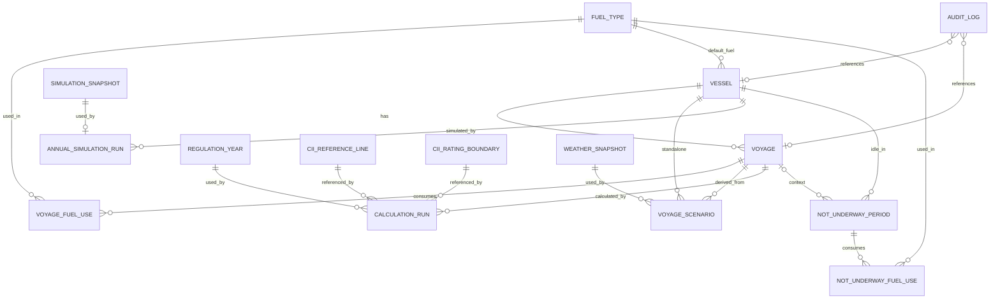

# DB_SCHEMA — BlueLog

| 항목 | 내용 |
|---|---|
| 문서명 | DB_SCHEMA.md |
| 버전 | v1.33 |
| 상태 | Oracle Review + 외부 리뷰 반영 + weather 추적 컬럼 스펙 (#102) + 파라미터 CHECK·FK 자식 인덱스 (#96 #97) + needs_recalc 플립 예외 (#283) + not under way 스키마 (#345) + 운항 상태 2축 (#346) + not under way 이동 거리 (#353) + **CUBRID에서 제약을 어떻게 세우는가 전면 갱신 (#1058)** + **chat_session·chat_message 등재 (#1080)** + **역할 3종 — 관리자 도입 (#1301)** + **vessel.call_sign 호출부호 (#1197)** + **voyage.planned_distance_source 거리 출처 (#1256)** |
| 최종 수정일 | 2026-09-20 |
| 상위 문서 | `PRD.md` v4.4, `TECH_SPEC.md` v1.8, `API_SPEC.md` v1.21 — `AGENTS §4.4` 「마지막으로 대조를 마친 판본」 |
| 후속 문서 | `TEST_PLAN.md` |
| DB 엔진 | **CUBRID 11.4.6** (`#1058` 전환). 이 문서의 DDL·트리거 예시는 아직 PostgreSQL 문법이다 — **문법이 아니라 계약을 읽을 것**이며, CUBRID에서 계약이 어떻게 유지되는지는 `§7.4`에 있다 |

---

## 0. 범위 및 목적

본 문서는 PRD §7 데이터 모델, TECH_SPEC의 기술 명세, API_SPEC의 응답 스키마를 기반으로 데이터베이스 스키마를 정의한다.

### 0.1 설계 원칙

| 원칙 | 설명 |
|---|---|
| 정밀도 우선 | CII 계산 관련 수치는 `NUMERIC(30,6)`. `FLOAT`/`DOUBLE` 사용 금지 (TECH_SPEC §1) |
| 스냅샷 보존 | 계산 결과는 변경 불가 snapshot으로 저장. 원본 데이터 변경 후에도 재현 가능 |
| 감사 추적 | 파라미터 변경, 항차 확정, 계산 실행 로그 저장 (TECH_SPEC §13.1) |
| 논리 삭제 | 비즈니스 데이터는 soft delete. 물리 삭제는 관리자 전용 |
| UUID PK | 모든 테이블 PK는 UUID v4. 자동 증분 정수 사용 안 함 |
| **타임존 정책 [X-6]** | 모든 `TIMESTAMPTZ` 값은 UTC 기준으로 저장된다. 서버 `timezone = UTC` 설정 필수. 클라이언트는 UTC로 전송하고 표시 시 로컬 변환을 수행한다 |

### 0.2 기준 문서 참조

| 문서 | 참조 내용 |
|---|---|
| PRD §7 | 핵심 엔티티 (Vessel, Voyage, VoyageFuelUse, VoyageScenario, CalculationRun) |
| PRD §7.6 | RegulationParameter 테이블 구조 |
| PRD §8.1 | 항차 상태 모델, status × policy 제약 |
| TECH_SPEC §2.2.2 | `rng_metadata` JSON 구조 |
| TECH_SPEC §5.2.1 | `parameters_used` JSON 스키마 |
| TECH_SPEC §9.1 | `a_raw` VARCHAR + `a_decimal` NUMERIC(30,6) 이중 저장 |
| TECH_SPEC §10.1 | `model_version` structured JSON |
| TECH_SPEC §11 | 스냅샷 격리 (`SimulationSnapshot`) |
| TECH_SPEC §13.1 | 감사 로그 필드 |
| API_SPEC §1.7 | 수치 직렬화 정책 (Layer 1 = 문자열) |

---

## 1. ER 다이어그램


```mermaid
erDiagram
    VESSEL ||--o{ VOYAGE : has
    VESSEL ||--o{ VOYAGE_SCENARIO : standalone
    VOYAGE ||--o{ VOYAGE_FUEL_USE : consumes
    VOYAGE ||--o{ VOYAGE_SCENARIO : derived_from
    VOYAGE ||--o{ CALCULATION_RUN : calculated_by
    VESSEL ||--o{ ANNUAL_SIMULATION_RUN : simulated_by
    SIMULATION_SNAPSHOT ||--o| ANNUAL_SIMULATION_RUN : used_by
    REGULATION_YEAR ||--o{ CALCULATION_RUN : used_by
    FUEL_TYPE ||--o{ VOYAGE_FUEL_USE : used_in
    FUEL_TYPE ||--o{ VESSEL : default_fuel
    CII_REFERENCE_LINE ||--o{ CALCULATION_RUN : referenced_by
    CII_RATING_BOUNDARY ||--o{ CALCULATION_RUN : referenced_by
    WEATHER_SNAPSHOT ||--o{ VOYAGE_SCENARIO : used_by
    AUDIT_LOG }o--o| VESSEL : references
    AUDIT_LOG }o--o| VOYAGE : references
    VESSEL ||--o{ NOT_UNDERWAY_PERIOD : idle_in
    VOYAGE |o--o{ NOT_UNDERWAY_PERIOD : context
    NOT_UNDERWAY_PERIOD ||--o{ NOT_UNDERWAY_FUEL_USE : consumes
    FUEL_TYPE ||--o{ NOT_UNDERWAY_FUEL_USE : used_in
```

> **[S-6 수정]** `SIMULATION_SNAPSHOT ||--o| ANNUAL_SIMULATION_RUN` (1:1 또는 1:0..1)으로 변경. 시뮬레이션 실행 1건당 스냅샷 1건이 생성되며, 스냅샷이 부모이다. `AUDIT_LOG`의 카디널리티도 `}o--o|`로 수정 (entity_id가 NULL 허용).

---

## 2. 테이블 정의

> **[C-3 전역 정책]** 모든 FK에 명시적 `ON DELETE` 동작을 지정한다. 상세는 §7.1 "FK ON DELETE 정책" 참조.

### 2.1 `vessel` — 선박

| 컬럼 | 타입 | 제약 | 설명 |
|---|---|---|---|
| `id` | UUID | PK, NOT NULL | 내부 ID |
| `imo_number` | VARCHAR(7) | NOT NULL | IMO 번호 (7자리 숫자). 유일성은 partial unique index로만 보장 (soft delete 호환) |
| `name` | VARCHAR(100) | NOT NULL | 선박명 |
| `ship_type` | VARCHAR(50) | NOT NULL | CII 선종 enum. `cii_reference_line.ship_type`에 존재해야 함 |
| `gross_tonnage` | NUMERIC(12,2) | NULL | GT |
| `deadweight` | NUMERIC(12,2) | NULL | DWT |
| `default_fuel_type` | VARCHAR(30) | NULL, **FK → fuel_type(code) ON UPDATE CASCADE** [S-1] | 기본 연료 코드 |
| `reference_speed_kn` | NUMERIC(6,2) | NULL | 기준 속도 (kn) |
| `reference_daily_foc_ton` | NUMERIC(8,2) | NULL | 기준 일일 연료소모량 (ton/day) |
| `block_coefficient` | NUMERIC(4,3) | NULL, CHECK (0 < CB <= 1) [#966] | 방형계수 — 기상 보정(Townsin–Kwon)의 선형 계수. 선택: 넣으면 실측값, `NULL`이면 선종 기본값 + `CB_ESTIMATED` |
| `call_sign` | VARCHAR(7) | NULL, **트리거 `trg_chk_call_sign_ins`·`_upd`** (`^[A-Z0-9]{4,7}$` · `REGEXP BINARY`) [#1197] | 호출부호(call sign) — **공공데이터 교차 대조의 키**(`PRD §15.1` `[#1197]` 각주). `해양수산부_선박운항정보`가 IMO가 아니라 이 값으로 질의한다. ITU RR No.19.55상 영문 대문자·숫자 4~7자이며 API가 strip · upper로 접어 넣는다(`API_SPEC §2.3`). 선택: `NULL`이면 그 배는 대조 대상이 아닐 뿐 계산은 그대로. **UNIQUE 없음** — 재배정되는 값이다(마이그레이션 058) |

> **[#860] 제원 4컬럼의 정밀도가 곧 API 입력 경계다.** `NUMERIC(12,2)`는 `0.01 ~ 9,999,999,999.99`,
> `(6,2)`는 `0.01 ~ 9,999.99`, `(8,2)`는 `0.01 ~ 999,999.99`만 담는다. 그보다 작은 양수는 `0.00`으로
> 반올림돼 `chk_*_positive`에 걸리고, 큰 값은 정밀도 초과다 — 둘 다 종전에는 **500**이었다.
> API 스키마(`api/schemas/vessel.py` `_storable`)와 화면(`formRules.ts` `STORABLE`)이 이 값에서 경계를 계산하며,
> 정밀도를 바꾸면 세 곳이 함께 바뀌어야 한다 — `tests/test_vessel_spec_bounds.py`·`specBounds.sync.test.ts`가 대조한다.
| `is_cii_applicable_hint` | BOOLEAN | NOT NULL DEFAULT false | GT ≥ 5000 및 선종 기준 자동 산정 |
| `is_deleted` | BOOLEAN | NOT NULL DEFAULT false | Soft delete 플래그 |
| `underway_state` | VARCHAR(20) | NULL, CHECK 허용값 2종 | **계산 축** — `UNDER_WAY`/`NOT_UNDER_WAY` (#346) |
| `detail_status` | VARCHAR(20) | NULL, CHECK 허용값 7종 | **화면 축** — `SAILING`/`IN_PORT`/`AT_ANCHOR`/`DRIFTING`/`STS`/`CANAL_TRANSIT`/`DRYDOCK` |
| `current_lat` | NUMERIC(9,6) | NULL, CHECK −90~90 | 현재 위치 위도 |
| `current_lon` | NUMERIC(9,6) | NULL, CHECK −180~180 | 현재 위치 경도 |
| `position_updated_at` | TIMESTAMPTZ | NULL | 위치 갱신 시각. **위치가 있으면 필수** (UIFLOW 2-8) |
| `created_at` | TIMESTAMPTZ | NOT NULL DEFAULT now() | 생성일 |
| `updated_at` | TIMESTAMPTZ | NOT NULL DEFAULT now() | 수정일 (§7.2 trigger로 자동 갱신) |

**인덱스:**

```sql
-- pg_trgm extension (GIN trigram index에 필요)
CREATE EXTENSION IF NOT EXISTS pg_trgm;
CREATE UNIQUE INDEX idx_vessel_imo ON vessel (imo_number) WHERE is_deleted = false;
CREATE INDEX idx_vessel_ship_type ON vessel (ship_type) WHERE is_deleted = false;
CREATE INDEX idx_vessel_name ON vessel USING gin (name gin_trgm_ops) WHERE is_deleted = false;
```

**검증 제약:**

```sql
ALTER TABLE vessel ADD CONSTRAINT chk_imo_format CHECK (imo_number ~ '^\d{7}$');
ALTER TABLE vessel ADD CONSTRAINT chk_gt_positive CHECK (gross_tonnage IS NULL OR gross_tonnage > 0);
ALTER TABLE vessel ADD CONSTRAINT chk_dwt_positive CHECK (deadweight IS NULL OR deadweight > 0);
ALTER TABLE vessel ADD CONSTRAINT chk_speed_positive CHECK (reference_speed_kn IS NULL OR reference_speed_kn > 0);
-- 058 (#1197): 호출부호 형식. CUBRID에서는 트리거 trg_chk_call_sign_ins/_upd가 REGEXP BINARY로 집행한다 (§7.4).
--   「앞 두 글자가 모두 숫자가 아니다」(RR No.19.50)는 DB가 아니라 API 스키마만 본다 — 배정 관행이 나라마다 달라
--   세부 규칙을 DB에 박으면 실재하는 부호를 거부할 수 있다. 이 칸은 인증서가 아니라 대조 키다.
ALTER TABLE vessel ADD CONSTRAINT chk_call_sign_format CHECK (call_sign IS NULL OR call_sign ~ '^[A-Z0-9]{4,7}$');
-- 026 (#346): 운항 상태 2축 + 위치. 전부 NULL 허용 — 미갱신 선박도 정상 조회.
ALTER TABLE vessel ADD CONSTRAINT chk_underway_state_allowed CHECK (underway_state IS NULL OR underway_state IN ('UNDER_WAY','NOT_UNDER_WAY'));
ALTER TABLE vessel ADD CONSTRAINT chk_detail_status_allowed CHECK (detail_status IS NULL OR detail_status IN ('SAILING','IN_PORT','AT_ANCHOR','DRIFTING','STS','CANAL_TRANSIT','DRYDOCK'));
ALTER TABLE vessel ADD CONSTRAINT chk_vessel_state_pair CHECK (
    (underway_state IS NULL AND detail_status IS NULL)
    OR (underway_state IS NOT NULL AND detail_status IS NOT NULL AND (
        (underway_state = 'UNDER_WAY' AND detail_status = 'SAILING')
        OR (underway_state = 'NOT_UNDER_WAY' AND detail_status IN ('IN_PORT','AT_ANCHOR','DRIFTING','STS','CANAL_TRANSIT','DRYDOCK'))
    ))
);
ALTER TABLE vessel ADD CONSTRAINT chk_vessel_lat_range CHECK (current_lat IS NULL OR current_lat BETWEEN -90 AND 90);
ALTER TABLE vessel ADD CONSTRAINT chk_vessel_lon_range CHECK (current_lon IS NULL OR current_lon BETWEEN -180 AND 180);
ALTER TABLE vessel ADD CONSTRAINT chk_vessel_position_pair CHECK (
    (current_lat IS NULL AND current_lon IS NULL)
    OR (current_lat IS NOT NULL AND current_lon IS NOT NULL AND position_updated_at IS NOT NULL)
);
```

> `gross_tonnage`와 `deadweight`는 PRD §7.2에서 "조건부 필수"이다. CII 계산 시점에 VAL-010으로 검증한다.
>
> **[S-1]** `default_fuel_type`에 FK 제약 추가. `fuel_type.code`를 참조하며 `ON UPDATE CASCADE`로 코드 변경 시 자동 전파.

---

### 2.2 `voyage` — 항차

| 컬럼 | 타입 | 제약 | 설명 |
|---|---|---|---|
| `id` | UUID | PK | 항차 ID |
| `vessel_id` | UUID | NOT NULL, FK → vessel(id) **ON DELETE RESTRICT** [DB-C-3] | 선박 ID |
| `voyage_no` | VARCHAR(100) | NULL | 사용자 입력 항차 번호 |
| `status` | VARCHAR(20) | NOT NULL | DRAFT, PLANNED, IN_PROGRESS, COMPLETED, CONFIRMED, CANCELLED, ARCHIVED |
| `regulation_year` | INTEGER | NULL **[C-1 추가]** | 해당 항차가 포함될 규정연도. `annual_inclusion_policy ≠ EXCLUDE`인 경우 NOT NULL 필수 |
| `departure_port_name` | VARCHAR(200) | NOT NULL | 출발항 |
| `departure_lat` | NUMERIC(9,6) | NULL | 출발항 위도 |
| `departure_lon` | NUMERIC(9,6) | NULL | 출발항 경도 |
| `arrival_port_name` | VARCHAR(200) | NOT NULL | 도착항 |
| `arrival_lat` | NUMERIC(9,6) | NULL | 도착항 위도 |
| `arrival_lon` | NUMERIC(9,6) | NULL | 도착항 경도 |
| `planned_distance_nm` | NUMERIC(12,2) | NOT NULL | 계획 거리 |
| `planned_distance_source` | VARCHAR(30) | NULL, **트리거 `trg_chk_planned_distance_source_ins`·`_upd`** (`USER_INPUT`·`COORDINATE_ESTIMATE`) [#1256] | 계획 거리의 출처 — `USER_INPUT`(직접 입력 · CSV 가져오기) 또는 `COORDINATE_ESTIMATE`(두 좌표의 대권거리 · `PRD §15.2` 「좌표 기반 추정 거리」). **`NULL`은 「모른다」** — 059 이전 행과 출처 없이 거리를 넣은 API 요청·시나리오 채택(`API_SPEC §5.2`)이 여기 든다. 기존 행은 backfill하지 않는다(대권거리와 비슷하다고 추정으로 되채우면 직접 입력한 값에도 「추정」이 붙는다 · `PRD §0.3`). `planned_distance_nm`이 바뀌면 옛 출처는 새 값에 붙지 않는다(`API_SPEC §3.4`). `created_from`이 「항차가 어느 경로로 왔나」라면 이것은 「그 숫자가 추정인가」다(마이그레이션 059) |
| `actual_distance_nm` | NUMERIC(12,2) | NULL | 실제 거리 |
| `planned_speed_kn` | NUMERIC(6,2) | NOT NULL | 예정 평균 속도 |
| `actual_avg_speed_kn` | NUMERIC(6,2) | NULL | 실제 평균 속도 |
| `planned_departure_at` | TIMESTAMPTZ | NULL | 예정 출항 |
| `planned_arrival_at` | TIMESTAMPTZ | NULL | 예정 도착 |
| `actual_departure_at` | TIMESTAMPTZ | NULL | 실제 출항 |
| `actual_arrival_at` | TIMESTAMPTZ | NULL | 실제 도착 |
| `annual_inclusion_policy` | VARCHAR(30) | NOT NULL DEFAULT 'EXCLUDE' | EXCLUDE, INCLUDE_AS_PLAN, INCLUDE_AS_ACTUAL |
| `created_from` | VARCHAR(30) | NOT NULL DEFAULT 'MANUAL' | MANUAL, FEATURE_1, FEATURE_2_ADOPTED, IMPORT, SAMPLE |
| `notes` | TEXT | NULL | 메모 |
| `is_deleted` | BOOLEAN | NOT NULL DEFAULT false | Soft delete |
| `created_at` | TIMESTAMPTZ | NOT NULL DEFAULT now() | 생성일 |
| `updated_at` | TIMESTAMPTZ | NOT NULL DEFAULT now() | 수정일 (§7.2 trigger로 자동 갱신) |

**인덱스:**

```sql
CREATE INDEX idx_voyage_vessel ON voyage (vessel_id, created_at DESC) WHERE is_deleted = false;
CREATE INDEX idx_voyage_status ON voyage (vessel_id, status) WHERE is_deleted = false;
CREATE INDEX idx_voyage_year ON voyage (vessel_id, regulation_year) WHERE is_deleted = false;
```

**검증 제약:**

```sql
ALTER TABLE voyage ADD CONSTRAINT chk_voyage_status
    CHECK (status IN ('DRAFT','PLANNED','IN_PROGRESS','COMPLETED','CONFIRMED','CANCELLED','ARCHIVED'));

ALTER TABLE voyage ADD CONSTRAINT chk_voyage_policy
    CHECK (annual_inclusion_policy IN ('EXCLUDE','INCLUDE_AS_PLAN','INCLUDE_AS_ACTUAL'));

-- status × annual_inclusion_policy 제약 (PRD §8.1.2 ORACLE-R-1)
ALTER TABLE voyage ADD CONSTRAINT chk_status_policy CHECK (
    (status = 'DRAFT' AND annual_inclusion_policy = 'EXCLUDE')
    OR (status IN ('PLANNED','IN_PROGRESS') AND annual_inclusion_policy IN ('EXCLUDE','INCLUDE_AS_PLAN'))
    OR (status IN ('COMPLETED','CONFIRMED') AND annual_inclusion_policy IN ('EXCLUDE','INCLUDE_AS_ACTUAL'))
    OR (status IN ('CANCELLED','ARCHIVED') AND annual_inclusion_policy = 'EXCLUDE')
);

-- regulation_year 범위 및 policy 연관 제약 [DB-C-1]
ALTER TABLE voyage ADD CONSTRAINT chk_regulation_year_range
    CHECK (regulation_year IS NULL OR regulation_year BETWEEN 2019 AND 2050);
ALTER TABLE voyage ADD CONSTRAINT chk_year_policy
    CHECK (annual_inclusion_policy = 'EXCLUDE' OR regulation_year IS NOT NULL);

ALTER TABLE voyage ADD CONSTRAINT chk_distance_positive CHECK (planned_distance_nm > 0);
-- 059 (#1256): 계획 거리 출처. CUBRID에서는 트리거 trg_chk_planned_distance_source_ins/_upd가 집행한다 (§7.4).
--   NULL은 「모른다」— 기존 행을 대권거리 대조로 되채우지 않는다(직접 입력한 값에도 「추정」이 붙는다).
ALTER TABLE voyage ADD CONSTRAINT chk_distance_source
    CHECK (planned_distance_source IS NULL OR planned_distance_source IN ('USER_INPUT','COORDINATE_ESTIMATE'));
ALTER TABLE voyage ADD CONSTRAINT chk_speed_positive CHECK (planned_speed_kn >= 1.0);
ALTER TABLE voyage ADD CONSTRAINT chk_actual_dist_positive
    CHECK (actual_distance_nm IS NULL OR actual_distance_nm > 0);  -- [M-6]
ALTER TABLE voyage ADD CONSTRAINT chk_actual_speed_positive
    CHECK (actual_avg_speed_kn IS NULL OR actual_avg_speed_kn >= 1.0);  -- [M-6]
ALTER TABLE voyage ADD CONSTRAINT chk_dep_lat_range
    CHECK (departure_lat IS NULL OR departure_lat BETWEEN -90 AND 90);
ALTER TABLE voyage ADD CONSTRAINT chk_dep_lon_range
    CHECK (departure_lon IS NULL OR departure_lon BETWEEN -180 AND 180);
ALTER TABLE voyage ADD CONSTRAINT chk_arr_lat_range
    CHECK (arrival_lat IS NULL OR arrival_lat BETWEEN -90 AND 90);  -- [S-3]
ALTER TABLE voyage ADD CONSTRAINT chk_arr_lon_range
    CHECK (arrival_lon IS NULL OR arrival_lon BETWEEN -180 AND 180);  -- [S-3]
```

> **[DB-C-1]** `regulation_year` 컬럼이 누락되어 있었다. 인덱스 `idx_voyage_year`가 이 컬럼을 참조하므로 DDL 실행이 실패했다. 컬럼을 추가하고, `annual_inclusion_policy ≠ EXCLUDE`인 경우 NOT NULL을 강제하는 CHECK 제약도 추가했다.

---

### 2.3 `voyage_fuel_use` — 항차 연료 사용량

| 컬럼 | 타입 | 제약 | 설명 |
|---|---|---|---|
| `id` | UUID | PK | ID |
| `voyage_id` | UUID | NOT NULL, FK → voyage(id) **ON DELETE CASCADE** [DB-C-3] | 항차 ID |
| `fuel_type` | VARCHAR(30) | NOT NULL, **FK → fuel_type(code) ON UPDATE CASCADE** [S-1] | 연료 종류 |
| `planned_fuel_ton` | NUMERIC(12,4) | NULL | 계획 연료 사용량 |
| `actual_fuel_ton` | NUMERIC(12,4) | NULL | 실제 연료 사용량 |
| `cf_used` | NUMERIC(10,6) | NOT NULL | **입력 시점의 CF 기록** — 확정 실적의 계산 근거. 계획 항차 예측은 실행 시점 활성 CF(`fuel_type.cf`)를 쓴다 (`#832`) |
| `source` | VARCHAR(30) | NOT NULL | USER_INPUT, MODEL_ESTIMATE, IMPORT, SAMPLE |
| `created_at` | TIMESTAMPTZ | NOT NULL DEFAULT now() | 생성일 |
| `updated_at` | TIMESTAMPTZ | NOT NULL DEFAULT now() | 수정일 (§7.2 trigger로 자동 갱신) |

**인덱스:**

```sql
-- [S-2] 동일 항차+연료 타입 중복 방지
CREATE UNIQUE INDEX idx_fuel_use_unique ON voyage_fuel_use (voyage_id, fuel_type);
```

**검증 제약:**

```sql
ALTER TABLE voyage_fuel_use ADD CONSTRAINT chk_fuel_source
    CHECK (source IN ('USER_INPUT','MODEL_ESTIMATE','IMPORT','SAMPLE'));

ALTER TABLE voyage_fuel_use ADD CONSTRAINT chk_fuel_positive
    CHECK (planned_fuel_ton IS NULL OR planned_fuel_ton > 0);
ALTER TABLE voyage_fuel_use ADD CONSTRAINT chk_actual_fuel_positive
    CHECK (actual_fuel_ton IS NULL OR actual_fuel_ton > 0);


-- ORACLE-C-4: COMPLETED 상태에서는 최소 1개 actual_fuel_ton > 0 필요
-- 애플리케이션 레벨에서 검증 (DB 트리거 또는 서비스 계층)
```

> **[ORACLE-C-4 제약]** `voyage.status = COMPLETED` 전환 시 최소 1개 `voyage_fuel_use.actual_fuel_ton > 0`이 필요하다. 이는 DB 제약보다 애플리케이션 서비스 계층에서 검증한다. DB 트리거 대안도 가능하나 복잡도가 높다.
>
> **[S-1]** `fuel_type`에 FK 제약 추가. `ON UPDATE CASCADE`로 연료 코드 변경 시 자동 전파.
>
> **[S-2]** `(voyage_id, fuel_type)` UNIQUE 제약 추가. 동일 항차에 동일 연료 타입 레코드가 중복 삽입되는 것을 방지한다. 중복 시 CII 계산에서 CO₂ 배출량이 이중 산정되는 치명적 버그가 발생한다.

---

### 2.4 `voyage_scenario` — 운항 시나리오

| 컬럼 | 타입 | 제약 | 설명 |
|---|---|---|---|
| `id` | UUID | PK | 시나리오 ID |
| `vessel_id` | UUID | NOT NULL, FK → vessel(id) **ON DELETE CASCADE** **[S-8 추가]** | 대상 선박 |
| `voyage_id` | UUID | NULL, FK → voyage(id) **ON DELETE SET NULL** [DB-C-3] | 기존 항차에서 생성된 경우 |
| `scenario_type` | VARCHAR(20) | NOT NULL | DIRECT, DETOUR, SLOW_STEAMING |
| `scenario_name` | VARCHAR(100) | NOT NULL | 표시명 |
| `distance_nm` | NUMERIC(12,2) | NOT NULL | 시나리오 거리 |
| `speed_kn` | NUMERIC(6,2) | NOT NULL | 평균 속도 |
| `duration_hours` | NUMERIC(10,2) | NOT NULL | 예상 소요 시간 |
| `fuel_ton` | NUMERIC(12,4) | NOT NULL | 예상 연료 |
| `weather_factor` | NUMERIC(8,4) | NULL | 기상 보정 계수 |
| `cii_value` | NUMERIC(15,8) | NOT NULL | 항차 CII 추정값. **[M-8]** 목록 조회·정렬용 denormalized numeric cache. canonical Layer 1 값은 반드시 `calculation_run.result_json.attained_cii`를 사용 |
| `estimated_rating` | VARCHAR(1) | NOT NULL | A~E |
| `risk_level` | VARCHAR(10) | NOT NULL | LOW, MEDIUM, HIGH, CRITICAL |
| `is_adopted` | BOOLEAN | NOT NULL DEFAULT false | 사용자 반영 여부 |
| `is_deleted` | BOOLEAN | NOT NULL DEFAULT false | Soft delete **[M-1 추가]** |
| `weather_snapshot_id` | UUID | NULL, FK → weather_snapshot(id) **ON DELETE SET NULL** [DB-C-3] | 사용된 기상 스냅샷 |
| `created_at` | TIMESTAMPTZ | NOT NULL DEFAULT now() | 생성일 |
| `updated_at` | TIMESTAMPTZ | NOT NULL DEFAULT now() | 수정일 (§7.2 trigger로 자동 갱신) |

**검증 제약 [S-4]:**

```sql
ALTER TABLE voyage_scenario ADD CONSTRAINT chk_scenario_type
    CHECK (scenario_type IN ('DIRECT','DETOUR','SLOW_STEAMING'));
ALTER TABLE voyage_scenario ADD CONSTRAINT chk_scenario_rating
    CHECK (estimated_rating IN ('A','B','C','D','E'));
ALTER TABLE voyage_scenario ADD CONSTRAINT chk_scenario_risk
    CHECK (risk_level IN ('LOW','MEDIUM','HIGH','CRITICAL'));
-- [#84] 물리량 양수 검증. speed_kn은 아래 각주 참조(voyage와 통일해 >= 1.0).
ALTER TABLE voyage_scenario ADD CONSTRAINT chk_scenario_distance_positive
    CHECK (distance_nm > 0);
ALTER TABLE voyage_scenario ADD CONSTRAINT chk_scenario_speed_positive
    CHECK (speed_kn >= 1.0);
ALTER TABLE voyage_scenario ADD CONSTRAINT chk_scenario_duration_positive
    CHECK (duration_hours > 0);
ALTER TABLE voyage_scenario ADD CONSTRAINT chk_scenario_fuel_positive
    CHECK (fuel_ton > 0);
```

**인덱스:**

```sql
-- [#97] FK 자식 인덱스 — vessel/voyage 삭제 시 CASCADE·SET NULL 체크가
-- full table scan하지 않게 한다. 목록 조회(WHERE vessel_id ORDER BY created_at DESC)도
-- 함께 서비스한다 (idx_calc_vessel과 같은 복합 형태).
CREATE INDEX idx_scenario_vessel ON voyage_scenario (vessel_id, created_at DESC);
-- voyage_id는 SET NULL 체크 전용 — NULL 허용 컬럼이라 단일 컬럼으로 족하다.
CREATE INDEX idx_scenario_voyage ON voyage_scenario (voyage_id);
```

> **[S-8]** `vessel_id` 컬럼 추가. 기존 항차에서 생성되지 않은 독립 시나리오의 경우 `voyage_id`가 NULL이 되므로, 선박 단위 조회 및 권한 검사를 위해 `vessel_id`가 필수이다.
>
> **[M-1]** `is_deleted` 컬럼 추가. 다른 비즈니스 테이블과 삭제 정책을 통일한다.
>
> **[#84]** `distance_nm`, `speed_kn`, `duration_hours`, `fuel_ton`은 물리량이므로 양수 CHECK를 추가한다. `speed_kn`은 이슈 #84 본문의 `> 0`이 아니라 형제 테이블 `voyage`(§2.2 `chk_speed_positive`)의 `>= 1.0` 기준과 통일한다. 시나리오 채택(#58) 시 이 값이 `voyage.planned_speed_kn`으로 반영되는데, `> 0`으로 두면 `0.7`kn 같은 값이 입력 단계는 통과하나 채택 단계에서 `voyage`의 `>= 1.0`에 뒤늦게 걸리기 때문이다.

---

### 2.5 `calculation_run` — 계산 실행 결과

> **[X-2]** 이 테이블은 immutable이다. §7.3의 가드 트리거로 UPDATE/DELETE를 차단한다. **유일한 예외는 `needs_recalc`의 false→true 플립이다** (마이그레이션 024의 `calc_run_guard` — 나머지 컬럼이 불변일 때만 통과, true→false 되돌림·다른 컬럼 변경·DELETE는 여전히 거부).

| 컬럼 | 타입 | 제약 | 설명 |
|---|---|---|---|
| `id` | UUID | PK | 계산 실행 ID |
| `calculation_type` | VARCHAR(30) | NOT NULL | VOYAGE_ESTIMATE, SCENARIO, ANNUAL_DETERMINISTIC, ANNUAL_MONTE_CARLO |
| `vessel_id` | UUID | NOT NULL, FK → vessel(id) **ON DELETE RESTRICT** [DB-C-3] | 대상 선박 |
| `voyage_id` | UUID | NULL, FK → voyage(id) **ON DELETE RESTRICT** [DB-C-3, #28 정정] | 관련 항차 (있으면). 계산 이력 보존을 위해 항차 물리 삭제를 차단 |
| `weather_snapshot_id` | UUID | NULL, FK → weather_snapshot(id) **ON DELETE RESTRICT** [#102] | 계산에 사용한 기상 스냅샷 (있으면). NONE 모델·fallback 계산은 NULL. **[#904]** 기상 보정을 적용하는 기능②(`SCENARIO`)만 채운다 — 2026-09-12 이전에는 삽입 경로가 `None`으로 고정돼 **보정한 계산도 NULL**이다(아래 `[#102]` 각주). ⚠️ 실물 컬럼·FK는 #103(013 `weather_snapshot`) 생성 후 **016+ 후속 마이그레이션**에서 추가 |
| `input_hash` | VARCHAR(71) | NOT NULL | `sha256:` + 64 hex chars |
| `parameter_hash` | VARCHAR(71) | NOT NULL | `sha256:` + 64 hex chars |
| `model_version` | JSONB | NOT NULL | TECH_SPEC §10.1 structured JSON |
| `result_json` | JSONB | NOT NULL | 결과 snapshot (모든 출력값 포함) |
| `parameters_used` | JSONB | NOT NULL | TECH_SPEC §5.2.1 스키마 |
| `warnings_json` | JSONB | NULL | 경고 목록 배열 |
| `duration_ms` | INTEGER | NULL | 계산 소요 시간 (ms) |
| `needs_recalc` | BOOLEAN | NOT NULL DEFAULT false **[#283]** | 재계산 필요 표시. 선박 제원(DWT/GT · 선종) 변경 시 서비스가 false→true로만 플립한다 (PRD §8.4 · #944) |
| `created_at` | TIMESTAMPTZ | NOT NULL DEFAULT now() | 생성일 |

**인덱스:**

```sql
CREATE INDEX idx_calc_vessel ON calculation_run (vessel_id, created_at DESC);
CREATE INDEX idx_calc_input_hash ON calculation_run (input_hash, parameter_hash);
CREATE INDEX idx_calc_type ON calculation_run (calculation_type, created_at DESC);
-- [#115] FK 자식 인덱스. weather_snapshot 삭제 시 RESTRICT 검사가 full scan이 되지 않도록 한다.
CREATE INDEX idx_calc_weather_snapshot ON calculation_run (weather_snapshot_id);
```

**검증 제약 [S-7]:**

```sql
ALTER TABLE calculation_run ADD CONSTRAINT chk_input_hash_format
    CHECK (input_hash ~ '^sha256:[0-9a-f]{64}$');
ALTER TABLE calculation_run ADD CONSTRAINT chk_param_hash_format
    CHECK (parameter_hash ~ '^sha256:[0-9a-f]{64}$');
-- [#84] calculation_type enum 검증. 4개 허용값 외 임의 문자열 차단.
ALTER TABLE calculation_run ADD CONSTRAINT chk_calculation_type
    CHECK (calculation_type IN
        ('VOYAGE_ESTIMATE','SCENARIO','ANNUAL_DETERMINISTIC','ANNUAL_MONTE_CARLO'));
```

**`result_json` 구조 (계산 타입별):**

> 아래 두 블록은 **각각 유효한 JSON**이다. JSON 표준(RFC 8259)에 주석 문법이 없고 한 문서에 최상위 값이 하나만 올 수 있으므로, 변형별로 블록을 나누고 필드 설명은 블록 밖 표로 둔다. 복사해 파서에 그대로 넣을 수 있어야 재현성 테스트(`TEST_PLAN`)와 픽스처(`#45`)가 이 예시를 기준으로 삼을 수 있다.

**`calculation_type = VOYAGE_ESTIMATE`**

> **[#879] 실제 기록되는 15키 전부다.** 종전 예시는 7키였는데 그중 **실물과 겹치는
> 것이 3키뿐**이었다 — `rating`은 실제 `estimated_rating`, `co2_ton`은
> `co2_emission_ton`이고(`API_SPEC §4.1`과도 어긋났다), `weather_factor`·
> `weather_snapshot_id`는 **`result_json`에 들어가지 않는다**(아래 각주). 라이브
> 덤프로 대조해 교체했다. 값은 `PRD §13.1` Fixture 1 그대로다.

```json
{
  "attained_cii": "4.982400",
  "required_cii": "5.045066",
  "ratio_to_required": "0.98758",
  "estimated_rating": "C",
  "next_worse_boundary_margin": "0.365370",
  "next_worse_boundary_margin_ratio": "0.0724",
  "co2_emission_ton": "249.12",
  "fuel_consumption_ton": "80.00",
  "distance_nm": 1000.0,
  "risk_level": "MEDIUM",
  "transport_capacity": "50000",
  "transport_capacity_basis": "DWT",
  "reference_capacity": "50000",
  "reference_capacity_rule": "DWT",
  "calculation_basis": {
    "ship_type": "BULK_CARRIER",
    "z_factor_percent": "11.0",
    "fuel_cf_details": [
      { "fuel_type": "HFO", "cf": "3.114", "fuel_ton": "80.0" }
    ],
    "a_decimal": "4745",
    "c": "0.622"
  }
}
```

| 필드 | 설명 |
|---|---|
| `distance_nm` | **입력 에코라 JSON 숫자다** — 나머지 수치는 Layer 1 결과라 `API_SPEC §1.7`에 따라 문자열이다. 한 블록 안에 두 타입이 섞이는 것은 의도다 |
| `next_worse_boundary_*` | 등급 E는 악화 방향 경계가 없어 `null`이다 (`#171` · `PRD §9.2`) |
| `reference_capacity_rule` | enum이 아니다 — 파라미터 테이블 값 그대로(`fixed 279000` 등) |
| `weather_snapshot_id` | **[#102]** 계산에 사용한 기상 스냅샷. **`result_json`이 아니라 위 컬럼 표의 실물 컬럼**이다. 없으면 `null`. **[#904]** 채워지는 것은 기상 보정을 적용한 기능②(`SCENARIO`) 행뿐이다 — 아래 `weather_factor` 행 |
| `weather_factor` | **[#102·#879·#904]** 이 블록(`VOYAGE_ESTIMATE`)에는 **없고, 없는 것이 맞다** — 기능①은 연료량을 입력으로 받아 기상 보정이 개입하지 않으므로 인자는 정의상 `1.0`이다(`TECH_SPEC §5.4` 5항). 보정을 적용하는 계산은 기능②뿐이며, 그 인자는 `SCENARIO` 행의 `result_json.scenarios[].weather_factor`에 **이미 기록돼 있다**(개발 DB 실측 252건 전부). `#904`가 「어디에도 기록되지 않는다」로 보고한 것은 이 블록의 행을 본 것이었다. 새 컬럼은 두지 않는다 — 같은 값을 두 곳에 두게 된다 |

**`calculation_type = ANNUAL_MONTE_CARLO`**

```json
{
  "deterministic": { "projected_attained_cii": "5.02", "projected_rating": "C" },
  "monte_carlo": {
    "rng_metadata": {
      "seed_entropy": "0x000000000000000000000000003039",
      "bit_generator": "PCG64DXSM",
      "numpy_version": "2.1.0",
      "python_version": "3.12.4",
      "platform": "Linux-6.5.0-x86_64"
    },
    "runs": 5000,
    "rating_probabilities": {
      "A": "0.0200", "B": "0.2800", "C": "0.5500", "D": "0.1300", "E": "0.0200"
    }
  }
}
```

> **[#879] `rating_probabilities`는 JSON 숫자가 아니라 문자열이다.** 종전 예시는
> `0.02`처럼 적었으나 구현은 `str(value)`로 기록한다 — `API_SPEC §1.7`이 계산 결과를
> 문자열로 직렬화하도록 규정하기 때문이고, float로 내면 **`0.0`·`1.0`으로 자릿수가
> 뭉개진다**(그 회귀가 실제로 있었다). 자릿수는 4자리다.

**`model_version` JSONB 구조:**

```json
{
  "engine": "dual-precision-v1",
  "decimal_precision": 30,
  "decimal_rounding": "ROUND_HALF_UP",
  "rng_algorithm": "PCG64DXSM",
  "numpy_version": "2.1.0",
  "python_version": "3.12.4"
}
```

> **[S-7]** hash 형식 CHECK 제약 추가. `sha256:` prefix + 64 hex chars 형식이 아닌 값의 삽입을 차단한다.
>
> **검증 책임 (parameter_hash vs parameters_used):** `SHA256(canonical_json(parameters_used)) == parameter_hash` 검증은 애플리케이션 서비스 계층 또는 테스트 단계에서 수행한다 (Oracle 추가 관찰 #9).
>
> **[#28 정정]** `voyage_id`의 ON DELETE 정책을 `SET NULL` → `RESTRICT`로 정정했다 (이슈 #28). 근거: `calculation_run`은 immutable(§7.3, `BEFORE UPDATE OR DELETE` 트리거)이다. `SET NULL`은 PostgreSQL 내부적으로 자식 행 UPDATE로 실행되는데, immutable 트리거가 이 UPDATE를 차단하여 부모 `voyage` 삭제 트랜잭션 전체가 롤백된다. 즉 `SET NULL`은 원리적으로 달성 불가능하고 실효 동작이 `RESTRICT`다. 실효 동작에 문서를 맞추고, §7.1의 "immutable 테이블 참조는 RESTRICT" 관례와 대칭을 회복한다. (평소에는 voyage가 soft-delete(§2.2 `is_deleted`)만 되므로 이 경로가 드물어 잠복해 있던 모순이다.)
>
> **[#102] `weather_snapshot_id` 컬럼 (스펙 선행 정의):** 계산에 사용한 기상 스냅샷을 기록하여 재현성 계약(TECH_SPEC §5.4)의 추적성을 보장한다. 이슈 #102 본문의 "행 삭제 시 NULL로 설정"(SET NULL)은 [#28 정정]과 동일한 이유(immutable 트리거가 자식 UPDATE 차단)로 달성 불가능하므로 **RESTRICT로 정정**한다. NULL 허용 근거: `weather_model = NONE`·캐시 만료 fallback(TECH_SPEC §7.3)은 스냅샷 없이 계산하는 정상 경로이며, 컬럼 추가 이전의 기존 행도 backfill이 불가능하다. 실물 컬럼·FK·ORM 모델 반영은 #103(013 `weather_snapshot` 테이블) 완료 후 016 이후의 후속 마이그레이션에서 수행한다(실제로 `016_calc_run_weather_snapshot`이 했다). **[#904] 컬럼은 생겼으나 2026-09-12까지 아무도 채우지 않았다** — 삽입 경로 둘(기능① · 기능②)이 `None`으로 고정돼, 기능②가 스냅샷으로 보정하고 같은 요청의 `voyage_scenario` 3행에 그 스냅샷을 붙여도 계산 이력은 NULL이었다(개발 DB 실측: 스냅샷을 가리키는 시나리오 행 12개 · `SCENARIO` 이력 252건 전부 NULL). 이제 기능②가 보정에 쓴 스냅샷을 적는다. 이전 행은 immutable이라 채울 수 없고, 그 스냅샷은 `result_json.scenarios[].scenario_id` → `voyage_scenario.weather_snapshot_id`로 찾는다 — 시나리오 행은 처음부터 적고 있었다.

---

### 2.6 `annual_simulation_run` — 연간 시뮬레이션 실행

| 컬럼 | 타입 | 제약 | 설명 |
|---|---|---|---|
| `id` | UUID | PK | 시뮬레이션 실행 ID |
| `calculation_run_id` | UUID | NOT NULL, FK → calculation_run(id) **ON DELETE RESTRICT** [DB-C-3] | 계산 실행 참조 |
| `vessel_id` | UUID | NOT NULL, FK → vessel(id) **ON DELETE RESTRICT** [DB-C-3] | 대상 선박 |
| `regulation_year` | INTEGER | NOT NULL | 기준연도 |
| `target_rating` | VARCHAR(1) | NOT NULL | 목표 등급 (A~D, E 불가) |
| `simulation_runs` | INTEGER | NOT NULL | Monte Carlo 반복 횟수 |
| `snapshot_id` | UUID | NOT NULL, FK → simulation_snapshot(id) **ON DELETE RESTRICT** [DB-C-3] | 스냅샷 참조. UNIQUE (1:1) |
| `apply_feedback_factor` | BOOLEAN | NOT NULL DEFAULT false | 실적 보정계수(`PRD §12.2.1`)를 켜고 돌렸는가 [#363 · 마이그레이션 042] |
| `created_at` | TIMESTAMPTZ | NOT NULL DEFAULT now() | 생성일 |

> **[#363] 계수 값은 저장하지 않는다 — 켰는지만 저장한다.** 계수는 같은 행의 `snapshot_id`가 가리키는 스냅샷의 확정 항차에서 **다시 계산해도 같은 값**이라, 따로 적으면 같은 사실이 두 곳에 생긴다. 켜짐 여부는 스냅샷 어디에도 없는 사용자 선택이라 재현(`API_SPEC §6.4`)이 원본 설정을 알려면 저장해야 한다. 기존 행은 `false`로 채웠고 전부 보정 없이 계산됐으므로 사실과 같다. **downgrade는 되돌릴 수 없다**(`IRREVERSIBLE`) — 어느 실행이 켜고 돌았는지가 사라져 그 실행들은 재현할 수 없게 된다.

**검증 제약 [M-4, M-5]:**

```sql
ALTER TABLE annual_simulation_run ADD CONSTRAINT chk_target_rating
    CHECK (target_rating IN ('A','B','C','D'));  -- [M-4] E 불가
ALTER TABLE annual_simulation_run ADD CONSTRAINT chk_sim_runs_positive
    CHECK (simulation_runs > 0);  -- [M-5]

-- [S-6] 1:1 관계 보장
CREATE UNIQUE INDEX idx_sim_snapshot_unique ON annual_simulation_run (snapshot_id);
```

> 🔴 **CUBRID에서는 이 인덱스를 세우려면 `snapshot_id`의 FK를 빼야 한다 (`#1058` · `050`).**
> CUBRID는 FK가 만든 인덱스가 있는 열에 인덱스를 **또** 두는 것을 거부한다 — 실측이다.
>
> ```
> CREATE UNIQUE INDEX idx_sim_snapshot_unique ON annual_simulation_run (snapshot_id)
>   → ERROR: Index "fk_annual_simulation_run_snapshot" already defined for class …
> ALTER TABLE annual_simulation_run DROP FOREIGN KEY fk_annual_simulation_run_snapshot
>   → Execute OK
> CREATE UNIQUE INDEX idx_sim_snapshot_unique ON annual_simulation_run (snapshot_id)
>   → Execute OK
> ```
>
> **FK를 빼도 계약은 그대로다.** 부모 쪽(`ON DELETE RESTRICT`)은 `trg_snapshot_no_delete`가
> 이미 **전면** 차단하므로(`§7.3`) 참조가 없어도 못 지운다 — FK보다 강하다. 자식 쪽(없는
> 스냅샷 참조 금지)은 `trg_annual_sim_snapshot_ref_ins`·`_upd`가 대신한다. `§7.1`의 해당
> 행도 함께 고쳤다.

---

### 2.7 `simulation_snapshot` — 시뮬레이션 스냅샷

> TECH_SPEC §11 구현. 시뮬레이션 시작 시점의 항차 데이터 사본.
>
> **[X-2]** 이 테이블은 immutable이다. §7.3의 가드 트리거(`prevent_mutation()`)로 UPDATE/DELETE를 **예외 없이** 차단한다.
>
> **[#830 정정]** 종전 이 각주는 「유일한 예외는 `needs_recalc`의 false→true 플립」이라고 적었다. `§2.5` `calculation_run` 각주를 통째로 옮겨 온 문장으로, **이 테이블에는 `needs_recalc` 컬럼이 없고** 실제 트리거도 예외 없는 `prevent_mutation()`이다(`§7.3` 본문과 마이그레이션 009). 그대로 두면 스냅샷을 UPDATE할 수 있다고 읽힌다.

| 컬럼 | 타입 | 제약 | 설명 |
|---|---|---|---|
| `id` | UUID | PK | 스냅샷 ID |
| `vessel_id` | UUID | NOT NULL, FK → vessel(id) **ON DELETE RESTRICT** [DB-C-3] | 대상 선박 |
| `regulation_year` | INTEGER | NOT NULL | 기준연도 |
| `voyages_json` | JSONB | NOT NULL | 항차별 완전한 데이터 사본 배열 |
| `vessel_json` | JSONB | NULL 허용 | **선박 제원 사본** (`#493` · 마이그레이션 037). `ship_type`·`deadweight`·`gross_tonnage`·`reference_speed_kn`·`reference_daily_foc_ton`을 **문자열로** 담는다 |
| `input_hash` | VARCHAR(71) | NOT NULL | 스냅샷 시점 input_hash |
| `parameter_hash` | VARCHAR(71) | NOT NULL | 스냅샷 시점 parameter_hash |
| `created_at` | TIMESTAMPTZ | NOT NULL DEFAULT now() | 스냅샷 생성일 |

**검증 제약 [S-7]:**

```sql
ALTER TABLE simulation_snapshot ADD CONSTRAINT chk_snap_input_hash_format
    CHECK (input_hash ~ '^sha256:[0-9a-f]{64}$');
ALTER TABLE simulation_snapshot ADD CONSTRAINT chk_snap_param_hash_format
    CHECK (parameter_hash ~ '^sha256:[0-9a-f]{64}$');
```

**`voyages_json` 구조:**

> **[#879] 이 예시는 「저장된 컬럼 그대로」다.** 종전 예시는 **API 응답(`§6.3`
> `/snapshot-voyages`)의 모양**을 적고 있었다 — `snapshot_voyage_id`·
> `original_voyage_id`·`status_at_snapshot`·`distance_nm`·`fuel_ton`은 전부 응답 쪽
> 이름이고, 저장 컬럼에는 그런 키가 없다. 그 결과 **컬럼의 키 이름을 규정하는 정본이
> 사실상 없었다** — `TECH_SPEC §11.2`는 스냅샷 **대상**만 규정한다. 라이브 덤프로
> 대조해 교체했고, `tests/test_dbschema_json_example_sync.py`가 이 블록을 실제
> 기록 코드와 대조한다.

```json
[
  {
    "voyage_id": "00000000-0000-4000-8000-000000000102",
    "kind": "ACTUAL",
    "voyage_no": "2026-01",
    "status": "COMPLETED",
    "annual_inclusion_policy": "INCLUDE_AS_ACTUAL",
    "planned_distance_nm": "4200.00",
    "actual_distance_nm": "4300.00",
    "planned_speed_kn": "12.00",
    "fuel_uses": [
      {
        "fuel_type": "HFO",
        "planned_fuel_ton": "530.0000",
        "actual_fuel_ton": "620.0000",
        "cf_used": "3.114000"
      }
    ]
  },
  {
    "voyage_id": "00000000-0000-4000-8000-000000000110",
    "kind": "PLAN",
    "voyage_no": "2026-02",
    "status": "IN_PROGRESS",
    "annual_inclusion_policy": "INCLUDE_AS_PLAN",
    "planned_distance_nm": "2300.00",
    "actual_distance_nm": null,
    "planned_speed_kn": "14.00",
    "fuel_uses": [
      {
        "fuel_type": "HFO",
        "planned_fuel_ton": "331.0000",
        "actual_fuel_ton": null,
        "cf_used": "3.114000"
      }
    ]
  }
]
```

| 필드 | 설명 |
|---|---|
| `voyage_id` | 원본 항차의 ID. **사본에는 별도 ID가 없다** — API 응답의 `snapshot_voyage_id`는 조회 시점에 `{snapshot_id}:{voyage_id}`로 만든다 |
| `kind` | **[#879]** `"ACTUAL"` / `"PLAN"`. 스냅샷 시점의 `annual_inclusion_policy`로 정해지며, **코드가 실제로 읽는다**(완료 항차 수 집계·잔여 항차 수·CF 선택). 종전 문서에 없던 키다 |
| `status` | **스냅샷 시점의** 항차 상태. 지금의 상태가 아니다 |
| `planned_*` / `actual_*` | **두 벌을 모두 남긴다.** 계산은 「실적이 있으면 실적, 없으면 계획」(`PRD §8.3`)으로 고르는데, 사본에 한 벌만 두면 **어느 쪽이 쓰였는지**를 나중에 알 수 없다 |
| `fuel_uses[].cf_used` | 그때 쓴 CF다. 지금의 `fuel_type.cf`가 아니다(`#378`). 계획 항차는 **그 실행의 활성 CF**(`#832`), 확정 실적은 입력 시점 값(`#863`) |

> **API 응답과 모양이 다른 것은 의도다.** `voyages_json`은 **계산 입력을 만들기 위한
> 내부 형태**(`kind` · 계획/실적 두 벌)이고, `§6.3` 응답은 **읽는 사람을 위한
> 형태**(`status_at_snapshot` · 실제 쓰인 값 한 벌)다. 투영 규칙은 계산과 같다 —
> **실적이 있으면 실적, 없으면 계획**. 응답 쪽 수치는 JSON **숫자**이고 저장 쪽은
> **문자열**이라는 점도 다르다.

> 스냅샷은 변경 불가(immutable)이다. 한 번 생성되면 수정되지 않는다.

**인덱스:**

```sql
-- [#97] FK 자식 인덱스 — vessel 삭제 시 RESTRICT 체크가 full table scan하지 않게.
CREATE INDEX idx_snapshot_vessel ON simulation_snapshot (vessel_id, created_at DESC);
```

---

### 2.8 `regulation_year` — 규정 연도 Z-factor

| 컬럼 | 타입 | 제약 | 설명 |
|---|---|---|---|
| `id` | UUID | PK | ID |
| `year` | INTEGER | NOT NULL | 연도. 🔴 **전역 UNIQUE는 054가 뺐다** — 활성 행끼리만 유일하다(§2.10의 활성-유니크 트리거와 같은 형태 · `trg_regulation_year_active_unique_*`) |
| `z_factor_percent` | NUMERIC(8,4) | NOT NULL, CHECK (>= 0) [#96] | Z factor (%) |
| `effective_from` | DATE | NOT NULL | 적용 시작일 |
| `source_ref` | VARCHAR(200) | NOT NULL | 출처 — **값이 인쇄된 문서**를 적는다. 참조 지정만 하는 문서가 아니다(의미 정의는 §3.2 각주). 예: `MEPC.400(83)` |
| `version` | VARCHAR(50) | NOT NULL | 파라미터 세트 버전 |
| `is_active` | BOOLEAN | NOT NULL DEFAULT true | 활성 여부 |
| `created_at` | TIMESTAMPTZ | NOT NULL DEFAULT now() | 생성일 |

> **[#98] `updated_at`이 없는 것은 의도적이다.** 파라미터 테이블은 값이 개정되면 행을 고치지 않고 **새 `version` 행을 넣고 `is_active`를 전환**한다 — 기준과 예외(`fuel_type`)는 §7.2를 따른다.
>
> **[#96] `chk_z_factor_nonneg` (마이그레이션 023).** Z-factor reduction은 음수일 수 없다(MEPC.400(83) 0%~). 음수면 required_CII가 reference line보다 커지는 역산이 일어나 계산이 무의미해진다. 2023년의 `0`은 유효값이므로 `> 0`이 아니라 `>= 0`이다.

---

### 2.9 `fuel_type` — 연료 종류

| 컬럼 | 타입 | 제약 | 설명 |
|---|---|---|---|
| `id` | UUID | PK | ID |
| `code` | VARCHAR(30) | NOT NULL, UNIQUE | 연료 코드 (예: HFO, LNG) |
| `display_name` | VARCHAR(100) | NOT NULL | 표시명 |
| `cf` | NUMERIC(10,6) | NOT NULL, CHECK (> 0) [#96] | tCO₂/tFuel 변환계수 |
| `unit` | VARCHAR(30) | NOT NULL DEFAULT 'tCO₂/tFuel' | 단위 |
| `source_ref` | VARCHAR(200) | NOT NULL | 출처 — **값이 인쇄된 문서**를 적는다. 참조 지정만 하는 문서가 아니다(의미 정의는 §3.2 각주) |
| `version` | VARCHAR(50) | NOT NULL DEFAULT '1.0' **[X-3 추가]** | 파라미터 세트 버전 |
| `content_hash` | VARCHAR(71) | NULL **[X-3 추가]** | seed/update 시 산출된 content hash |
| `is_active` | BOOLEAN | NOT NULL DEFAULT true | 활성 여부 |
| `effective_from` | DATE | NULL | 적용 시작일 (OTHER 연료용) |
| `created_at` | TIMESTAMPTZ | NOT NULL DEFAULT now() | 생성일 |
| `updated_at` | TIMESTAMPTZ | NOT NULL DEFAULT now() | 수정일 (§7.2 trigger로 자동 갱신) |

> **[X-3]** `version` 및 `content_hash` 컬럼 추가. TECH_SPEC §5.2의 `parameter_hash = SHA256(canonical_json(all_parameters))` 요구사항을 충족하기 위해, CF 값 변경 시 버전 및 content_hash를 갱신하여 파라미터 세트 변경을 추적 가능하게 한다.
>
> **[#96] `chk_cf_positive` (마이그레이션 023).** CF는 물리적으로 항상 양수다(MEPC.364(79) §2.2.1 기준값). 음수 cf가 들어가면 CO₂ 배출량이 음수가 되는 비상식적 결과가 나온다. `cii_reference_line`의 `chk_a_decimal_positive`·`chk_c_positive`와 같은 물리량 가드로 정합성을 맞춘다(Oracle 재리뷰 F5).

---

### 2.10 `cii_reference_line` — 선종별 CII Reference Line

> TECH_SPEC §9: `a_raw` VARCHAR + `a_decimal` NUMERIC(30,6) 이중 저장.
>
> **[EXT-P0-1]** `capacity_rule`은 **reference CII 공식(CII_ref = a × Capacity^(-c))에만 적용**된다. attained CII의 transport work(W = transport_capacity × Distance)에는 선박의 실제 DWT/GT를 사용한다 (IMO G1 vs G2 분리). `capacity_rule` 컬럼은 reference line 테이블에 속하므로 올바르게 스코프된다.

| 컬럼 | 타입 | 제약 | 설명 |
|---|---|---|---|
| `id` | UUID | PK | ID |
| `ship_type` | VARCHAR(50) | NOT NULL | CII 선종 |
| `condition_expr` | VARCHAR(200) | NOT NULL | 조건식 (예: `DWT >= 279000`, `all`) |
| `capacity_rule` | VARCHAR(50) | NOT NULL | `DWT`, `GT`, `fixed 279000` |
| `a_raw` | VARCHAR(50) | NOT NULL | IMO 원문 표기 (예: `14405E7`) |
| `a_decimal` | NUMERIC(30,6) | NOT NULL | Decimal 변환값 |
| `c` | NUMERIC(10,6) | NOT NULL | 지수 (예: 0.622). LNG_CARRIER DWT ≥ 100000의 경우 0.000000 (고정 CII_ref) |
| `source_ref` | VARCHAR(200) | NOT NULL | 출처 — **값이 인쇄된 문서**를 적는다. 참조 지정만 하는 문서가 아니다(의미 정의는 §3.2 각주) |
| `version` | VARCHAR(50) | NOT NULL DEFAULT '1.0' | 파라미터 세트 버전 **[#673 · 054 추가]** — 이 테이블에는 없어서 §7.2의 개정 정책이 물리적으로 불가능했다 |
| `is_active` | BOOLEAN | NOT NULL DEFAULT true | 활성 여부 **[#673 · 054 추가]** — 개정으로 대체된 행은 이행 행으로 남는다 |
| `created_at` | TIMESTAMPTZ | NOT NULL DEFAULT now() | 생성일 |

**인덱스:**

```sql
-- 🔴 054(#673) — 전역 유니크를 뺐다. 유일성은 활성 행끼리만 트리거가 집행한다
--    (아래). 이행 행이 같은 키로 쌓이는 것이 §7.2 개정 정책의 정상 상태다.
CREATE INDEX idx_refline_ship_type ON cii_reference_line (ship_type);

-- 활성-유니크(집행은 이것이 한다 — CUBRID는 부분 유니크 인덱스가 없다):
CREATE TRIGGER trg_cii_reference_line_active_unique_ins BEFORE INSERT ON cii_reference_line
  IF EXISTS (SELECT 1 FROM cii_reference_line
             WHERE ship_type = new.ship_type AND condition_expr = new.condition_expr
               AND is_active = 1 AND id <> new.id) EXECUTE REJECT;
-- UPDATE에도 같은 조건의 트리거가 하나 더 선다(trg_..._upd).
```

**검증 제약:**

```sql
-- [M-7] 'fixed' 뒤에 숫자만 허용하도록 강화
ALTER TABLE cii_reference_line ADD CONSTRAINT chk_capacity_rule
    CHECK (capacity_rule IN ('DWT','GT') OR capacity_rule ~ '^fixed \d+$');
-- 🔴 CUBRID에서 이 계약을 집행하는 것 (`#1058` · `050`). `~`에 대응하는 것은
--    `REGEXP BINARY`다 — `BINARY`가 없으면 대소문자를 가리지 않아 'FIXED 12'도
--    통과한다(실측). 종전 `LIKE 'fixed %'`는 'fixed abc'까지 통과시켰다.
CREATE TRIGGER trg_chk_capacity_rule_ins BEFORE INSERT ON cii_reference_line
  IF NOT (new.capacity_rule IN ('DWT','GT')
          OR new.capacity_rule REGEXP BINARY '^fixed [0-9]+$') EXECUTE REJECT;

ALTER TABLE cii_reference_line ADD CONSTRAINT chk_a_decimal_positive CHECK (a_decimal > 0);
ALTER TABLE cii_reference_line ADD CONSTRAINT chk_c_positive CHECK (c >= 0);
```

> 애플리케이션 시작 시 `parse_imo_scientific(a_raw) == a_decimal` 검증을 수행한다 (TECH_SPEC §9.3).
>
> **[Oracle 관찰]** `c = 0.000000` for LNG_CARRIER DWT ≥ 100000은 **정상**이다. MEPC.353(78) Table 1에 따라 대형 LNG 캐리어는 고정 CII_ref 값을 사용하며 `CII_ref = 9.827 × Capacity^0 = 9.827`이다.

---

### 2.11 `cii_rating_boundary` — 등급 경계 d-vector

| 컬럼 | 타입 | 제약 | 설명 |
|---|---|---|---|
| `id` | UUID | PK | ID |
| `ship_type` | VARCHAR(50) | NOT NULL | CII 선종 |
| `condition_expr` | VARCHAR(200) | NOT NULL | 조건식 |
| `capacity_basis` | VARCHAR(10) | NOT NULL | DWT 또는 GT |
| `d1` | NUMERIC(6,4) | NOT NULL | superior boundary 계수 |
| `d2` | NUMERIC(6,4) | NOT NULL | lower boundary 계수 |
| `d3` | NUMERIC(6,4) | NOT NULL | upper boundary 계수 |
| `d4` | NUMERIC(6,4) | NOT NULL | inferior boundary 계수 |
| `source_ref` | VARCHAR(200) | NOT NULL | 출처 — **값이 인쇄된 문서**를 적는다. 참조 지정만 하는 문서가 아니다(의미 정의는 §3.2 각주) |
| `version` | VARCHAR(50) | NOT NULL DEFAULT '1.0' | 파라미터 세트 버전 **[#673 · 054 추가]** |
| `is_active` | BOOLEAN | NOT NULL DEFAULT true | 활성 여부 **[#673 · 054 추가]** — §2.10과 같은 이유 |
| `created_at` | TIMESTAMPTZ | NOT NULL DEFAULT now() | 생성일 |

**인덱스:**

```sql
-- 🔴 054(#673) — 전역 유니크를 뺐다. §2.10과 같은 형태의 활성-유니크 트리거가
--    유일성을 집행한다(trg_cii_rating_boundary_active_unique_ins/_upd).
```

**검증 제약 [M-3]:**

```sql
-- d-vector 순서 보장: d1 < d2 < d3 < d4
-- d1/d2는 1.0 미만(양호 등급 경계), d3/d4는 1.0 초과(불량 등급 경계)
ALTER TABLE cii_rating_boundary ADD CONSTRAINT chk_d_order
    CHECK (d1 < d2 AND d2 < d3 AND d3 < d4);
```

---

### 2.12 `weather_model_parameter` — 기상 모델 파라미터

| 컬럼 | 타입 | 제약 | 설명 |
|---|---|---|---|
| `id` | UUID | PK | ID |
| `model_version` | VARCHAR(50) | NOT NULL | NONE, SIMPLE_RULE, TOWNSIN_KWON_ALPHA |
| `key` | VARCHAR(100) | NOT NULL | 파라미터 키 |
| `value` | VARCHAR(200) | NOT NULL | 파라미터 값 |
| `unit` | VARCHAR(30) | NULL | 단위 |
| `source_ref` | VARCHAR(200) | NULL | 출처 — **값이 인쇄된 문서**를 적는다. 참조 지정만 하는 문서가 아니다(의미 정의는 §3.2 각주) |
| `created_at` | TIMESTAMPTZ | NOT NULL DEFAULT now() | 생성일 |

**인덱스 [S-5]:**

```sql
-- (model_version, key) 조합의 유일성 보장
CREATE UNIQUE INDEX idx_weather_param_unique ON weather_model_parameter (model_version, key);
```

---

### 2.13 `weather_snapshot` — 기상 스냅샷

| 컬럼 | 타입 | 제약 | 설명 |
|---|---|---|---|
| `id` | UUID | PK | ID |
| `lat` | NUMERIC(9,6) | NOT NULL | 위도 |
| `lon` | NUMERIC(9,6) | NOT NULL | 경도 |
| `lat_rounded` | NUMERIC(4,1) | NOT NULL | 반올림 위도 (캐시 key용) |
| `lon_rounded` | NUMERIC(5,1) | NOT NULL | 반올림 경도 (캐시 key용) |
| `fetched_at` | TIMESTAMPTZ | NOT NULL | 조회 시각 |
| `wave_height_m` | NUMERIC(6,2) | NULL | 유의파고 |
| `wave_direction_deg` | NUMERIC(6,2) | NULL | 파향 |
| `wave_period_s` | NUMERIC(6,2) | NULL | 파 주기 |
| `wind_speed_ms` | NUMERIC(6,2) | NULL | 풍속 |
| `wind_direction_deg` | NUMERIC(6,2) | NULL | 풍향 |
| `source` | VARCHAR(50) | NOT NULL | 출처. `open_meteo_marine+forecast`(정상 경로 기본값 — 두 엔드포인트를 한 행에 합침) · `open_meteo_marine` · `open_meteo_forecast`(한쪽만 응답) · `sample`(테스트·수동 적재). 값 표의 정본은 `TECH_SPEC §7.1`. **집행 제약 없음** — 아래 `[#968]` |
| `created_at` | TIMESTAMPTZ | NOT NULL DEFAULT now() | 생성일 |

**인덱스:**

```sql
CREATE INDEX idx_weather_cache ON weather_snapshot (lat_rounded, lon_rounded, fetched_at DESC);
```

> 캐시 TTL 24시간. 24시간 초과 스냅샷은 PRD §11.6 기상 API 장애 정책에 따라 fallback 처리된다. **캐시는 외부 조회가 실패했을 때만 본다** — 순서·key·신선도 판정은 `TECH_SPEC §7.3`.
>
> **[#968] `source` 값 목록에 `open_meteo_marine+forecast`를 추가했다.** 어댑터(`weather/open_meteo.py` `SOURCE_MERGED`)가 정상 경로에서 처음부터 이 값을 저장해 왔는데 종전 목록 3값에는 없었다. 이 컬럼에는 **집행 제약이 없다** — `1c444a5c4819`의 CHECK 60개, `046`·`048`·`050`의 트리거 어디에도 `weather_snapshot.source`는 없고 ORM(`models/weather_snapshot.py`)에도 `CheckConstraint`가 없다(자유 `VARCHAR(50)`). 그래서 이 값이 REJECT된 적은 없고 마이그레이션도 필요 없다. 값을 정하는 곳이 어댑터 한 곳이라 코드 상수 ⊆ 이 목록은 `tests/test_weather_source_sync.py`가 지킨다.
>
> **[#102] TTL과 보존의 구분:** TTL 24시간은 **재사용 판단 기준(신선도 창)이지 삭제 스케줄이 아니다.** `calculation_run.weather_snapshot_id`(§2.5 [#102], FK **RESTRICT**)가 참조하는 스냅샷은 TTL 경과와 무관하게 보존되어야 재현성 계약(TECH_SPEC §5.4)의 추적성이 성립한다. 캐시 정리(eviction) 작업은 **참조되지 않는 행만** 삭제해야 하며, 참조 행을 포함한 일괄 DELETE는 RESTRICT에 막혀 트랜잭션 전체가 롤백된다.

---

### 2.14 `audit_log` — 감사 로그

> TECH_SPEC §13.1 요구사항.

| 컬럼 | 타입 | 제약 | 설명 |
|---|---|---|---|
| `id` | UUID | PK | ID |
| `timestamp` | TIMESTAMPTZ | NOT NULL DEFAULT now() | 이벤트 시각 |
| `user_id` | VARCHAR(100) | NULL | 실행 사용자 ID |
| `action` | VARCHAR(50) | NOT NULL | PARAMETER_CHANGE, VOYAGE_CONFIRM, CALCULATION_RUN, VOYAGE_TRANSITION, IMPORT, EXPORT, **LOGIN_SUCCESS, LOGIN_FAILURE, LOGOUT** [#277] · **DB_BACKUP** [#827] · **ROLE_CHANGE** [#672] (`user_id` = 바꾼 사람 · `entity_type` = `app_user` · `entity_id` = 대상 · `details_json` = `role_before`·`role_after`) |
| `entity_type` | VARCHAR(30) | NULL | `vessel`, `voyage`, `calculation_run`, **`regulation_year`**, **`fuel_type`**, **`reference_line`** **[Oracle 관찰 #4]** |
| `entity_id` | UUID | NULL | 대상 엔티티 ID. 모든 파라미터 테이블이 UUID PK를 가지므로 정상 동작 |
| `details_json` | JSONB | NULL | 상세 정보 (변경 전후 값 등) |
| `ip_address` | VARCHAR(45) | NULL | 요청 IP |

**인덱스:**

```sql
CREATE INDEX idx_audit_timestamp ON audit_log (timestamp DESC);
CREATE INDEX idx_audit_entity ON audit_log (entity_type, entity_id);
CREATE INDEX idx_audit_action ON audit_log (action, timestamp DESC);
```

> **[Oracle 관찰 #4]** `entity_type = 'parameter'` 대신 구체적인 테이블명(`regulation_year`, `fuel_type`, `reference_line`)을 사용하여 조회성을 향상시킨다. 모든 파라미터 테이블이 UUID PK를 가지므로 `entity_id` 호환성에 문제가 없다.
>
> **[#277] 인증 이벤트 (LOGIN_SUCCESS · LOGIN_FAILURE · LOGOUT).** `user_id`는 `app_user.id`(§2.15)다. 실패 시 주체를 알 수 없어 `NULL`이며, `details_json`은 사유 코드(`reason`)만 담는다 — **`id_token`·`code`·state·세션 토큰 등 자격 증명 값은 절대 기록하지 않는다.** 스텁 dev-login도 같은 스트림에 남기며 `details_json.dev_login` 플래그로 구분한다. `LOGOUT`은 실제 세션 무효화가 일어난 경우만 기록한다(멱등 재호출 제외).
>
> **[#827] 백업 기록 (DB_BACKUP).** 백업 스크립트(`scripts/db_backup.py backup`)가 덤프를 **읽히는지 확인한 뒤** 남긴다 — CUBRID 전환 뒤에는 `cubrid unloaddb`가 낸 네 파일을 묶은 tar를 열어 표마다 `%class` 머리가 있는지 본다(`#1058`). `user_id`는 `NULL`(운영자 작업)이고, `details_json`은 덤프 파일 이름 · sha256 · 덤프 시점의 alembic 리비전만 담는다 — **경로·자격 증명은 넣지 않는다.** 되돌릴 수 없는 downgrade의 해제 조건(`§8.1.2`)이 이 행을 읽는다.

---

### 2.15 `app_user` — 사용자 (#273)

> `PRD §7.10` 요구사항. **제품이 비밀번호를 직접 관리한다**(#413) — 단, 저장하는 것은 해시뿐이다.

| 컬럼 | 타입 | 제약 | 설명 |
|---|---|---|---|
| `id` | UUID | PK, NOT NULL | 내부 사용자 ID |
| `password_hash` | VARCHAR(255) | NOT NULL | 비밀번호 해시(Argon2id). **평문을 저장하지 않는다** |
| `email_verified_at` | TIMESTAMPTZ | NULL | 이메일 인증 완료 시각. `NULL`이면 미인증 |
| `email` | VARCHAR(320) | NOT NULL | 표시·연락용. **식별자가 아니다** |
| `display_name` | VARCHAR(100) | NULL | 표시 이름 |
| `role` | VARCHAR(10) | NOT NULL DEFAULT 'FIELD', **트리거 `trg_app_user_role_ins`·`_upd` (`OFFICE`·`FIELD`·`ADMIN`)** | 사무직·현장직·관리자 (`#1301` · `PRD §7.10` · 마이그레이션 044 + 057). **기본값이 현장직**이다 — 새 계정은 좁게 시작하고 관리자가 넓혀 준다. 044가 **기존 행은 전부 `OFFICE`**로 채웠고(그전까지 전원이 전 기능을 썼다), 057은 그 값을 다시 채우지 않는다 — **`ADMIN`은 값에만 추가된 것**이라 기존 행은 여전히 `OFFICE`·`FIELD`뿐이다. 값 제약은 CHECK가 아니라 **트리거**다 — CUBRID가 `CHECK`를 구문으로만 받고 검사하지 않아 `#1058`이 옮긴 자리(`§7.4`) |
| `last_login_at` | TIMESTAMPTZ | NULL | 마지막 로그인 시각 |
| `is_deleted` | BOOLEAN | NOT NULL DEFAULT false | Soft delete 플래그 |
| `created_at` | TIMESTAMPTZ | NOT NULL DEFAULT now() | 생성일 |
| `updated_at` | TIMESTAMPTZ | NOT NULL DEFAULT now() | 수정일 (§7.2 trigger로 자동 갱신) |

**인덱스:**

```sql
CREATE UNIQUE INDEX idx_app_user_email ON app_user (email) WHERE is_deleted = false;
```

> **[#413] `email`이 로그인 ID이자 유일 키다.** 종전에는 *"구글 계정의 이메일은 변경될 수 있으므로 unique를 걸지 않는다"* 로 두고 유일성을 `google_sub`에 두었으나, **구글 위임을 그만두면서 그 전제가 사라졌다**(`PRD O-14`). 자체 인증에서 이메일은 사용자가 스스로 정하는 로그인 ID이므로 유일해야 한다.
>
> **`password_hash`는 해시만 담는다.** 평문 비밀번호는 저장·로그·감사 기록 어디에도 남기지 않는다 — `app_session`이 토큰 원문을 저장하지 않는 것(§2.16)과 같은 원칙이다.
>
> **[#1301] `role` 값 제약은 CHECK가 아니라 트리거다.** CUBRID 11.4.6은 `CHECK`를 구문으로 받기만 하고 검사하지 않으므로(`#1058` · `§7.4`), 044부터 `trg_app_user_role_ins`·`trg_app_user_role_upd`(`BEFORE INSERT`·`BEFORE UPDATE`)가 값을 막는다. **마이그레이션 057이 그 두 트리거를 `IN ('OFFICE', 'FIELD')`에서 `IN ('OFFICE', 'FIELD', 'ADMIN')`으로 다시 만든다** — `CREATE OR REPLACE`가 없어 지우고 다시 만드는 방식이다. 057 이전 DB에서 `role = 'ADMIN'`을 넣거나 바꾸면 트리거가 REJECT한다. **downgrade는 데이터를 바꾼다** — 트리거를 좁히기 전에 관리자를 **사무직으로** 내린다(현장직이 아니다: `ADMIN`은 `OFFICE`의 상위집합이라 사무직으로 내리는 것이 「계정 관리만 잃는」 최소 변경이다). 누가 관리자였는지는 그 순간 사라지므로 `IRREVERSIBLE`(`044`와 같은 성질)이지만, `INITIAL_ADMIN_EMAILS`에 든 계정은 다음 로그인에서 다시 관리자가 된다.

### 2.15.1 `user_token` — 일회용 인증 토큰 (#408)

이메일 인증과 비밀번호 재설정에 쓰는 **한 번 쓰고 버리는 증명**이다. 세션(`§2.16`)과 수명주기가 달라 별도 테이블로 둔다 — 세션은 로그인 상태를 유지하고 이 토큰은 단발성이다.

| 컬럼 | 타입 | 제약 | 설명 |
|---|---|---|---|
| `id` | UUID | PK | |
| `user_id` | UUID | NOT NULL, **FK → app_user(id) ON DELETE CASCADE** | 토큰 소유자 |
| `purpose` | VARCHAR(20) | NOT NULL, CHECK IN (`EMAIL_VERIFY`, `PASSWORD_RESET`) | 용도 |
| `token_hash` | VARCHAR(64) | NOT NULL, UNIQUE | 토큰의 SHA-256 hex. **원문을 저장하지 않는다** |
| `expires_at` | TIMESTAMPTZ | NOT NULL | 만료 시각 |
| `used_at` | TIMESTAMPTZ | NULL | 사용 시각. NOT NULL이면 재사용 불가 |
| `created_at` | TIMESTAMPTZ | NOT NULL DEFAULT now() | |

```sql
CREATE UNIQUE INDEX idx_user_token_hash ON user_token (token_hash);
CREATE INDEX idx_user_token_user_purpose ON user_token (user_id, purpose);
```

> **원문 대신 해시만 저장한다.** `app_session.session_token_hash`(§2.16)와 같은 규칙이다 — **DB가 유출돼도 토큰을 되돌릴 수 없어야 한다.** 원문은 메일 본문에만 실린다.
>
> **유효기간** — 이메일 인증 24시간 · 비밀번호 재설정 1시간. 재설정이 짧은 것은 그 토큰이 계정을 통째로 넘기는 힘을 갖기 때문이다.
>
> 실물 테이블 생성은 **`#408`**이 담당한다. 이 절은 계약만 확정한다.

### 2.16 `user_session` — 로그인 세션 (#273)

> API_SPEC §1.2 요구사항. 세션 토큰은 SHA-256 해시만 저장한다.

| 컬럼 | 타입 | 제약 | 설명 |
|---|---|---|---|
| `id` | UUID | PK, NOT NULL | 세션 ID |
| `user_id` | UUID | NOT NULL, **FK → app_user(id) ON DELETE CASCADE** | 세션 소유자 |
| `session_token_hash` | VARCHAR(64) | NOT NULL, UNIQUE | 쿠키 값의 SHA-256 hex. **원문을 저장하지 않는다** |
| `csrf_token_hash` | VARCHAR(64) | NOT NULL | CSRF 토큰의 SHA-256 hex |
| `expires_at` | TIMESTAMPTZ | NOT NULL | 만료 시각 |
| `revoked_at` | TIMESTAMPTZ | NULL | 로그아웃 시각. NOT NULL이면 무효 |
| `user_agent` | VARCHAR(255) | NULL | 요청 User-Agent (감사용) |
| `ip_address` | VARCHAR(45) | NULL | 발급 시 IP |
| `created_at` | TIMESTAMPTZ | NOT NULL DEFAULT now() | 생성일 |

**인덱스:**

```sql
CREATE UNIQUE INDEX idx_session_token ON user_session (session_token_hash);
CREATE INDEX idx_session_user ON user_session (user_id, created_at DESC);
CREATE INDEX idx_session_expiry ON user_session (expires_at) WHERE revoked_at IS NULL;
```

> **세션 토큰 원문을 저장하지 않는다** — DB 유출 시 저장된 값으로 로그인 위조를 막기 위함. 비밀번호를 해시하는 것과 같은 이유.

> **[#287 → #1080] `chat_session`·`chat_message`은 §2.23·§2.24에 정의돼 있다.** 마이그레이션 041로 추가된 뒤 `#1058` CUBRID 전환에서 초기 스키마 `1c444a5c4819`에 흡수됐다. 귀속(`ChatSession.user_id` → **`app_user.id`(§2.15)**)과 보존 정책(90일)은 그 두 절이 소유한다.

---

### 2.17 `not_underway_period` — not under way 구간 (#345)

> 마이그레이션 025. 항해하지 않는 구간(정박·묘박·표류·STS·운하 통과·드라이독)을 기록한다. 현재 연료는 `voyage_fuel_use`로 **항차에만** 매달려 있어 이 구간의 연료를 담을 곳이 없었다. 귀속은 **선박+규제연도** — 정박은 항차 사이에 있어 특정 항차에 속하지 않는다.

| 컬럼 | 타입 | 제약 | 설명 |
|---|---|---|---|
| `id` | UUID | PK, NOT NULL DEFAULT `gen_random_uuid()` | 행 ID |
| `vessel_id` | UUID | NOT NULL, **FK → vessel(id) ON DELETE RESTRICT** | 소유 선박 |
| `regulation_year` | INTEGER | NOT NULL | 규제연도 (YTD·연간 실적 집계 축) |
| `period_type` | VARCHAR(20) | NOT NULL, CHECK 허용값 6종 | `IN_PORT`/`AT_ANCHOR`/`DRIFTING`/`STS`/`CANAL_TRANSIT`/`DRYDOCK` |
| `started_at` | TIMESTAMPTZ | NOT NULL | 구간 시작 |
| `ended_at` | TIMESTAMPTZ | NULL | 구간 종료. NULL이면 진행 중. **CHECK: `ended_at IS NULL OR ended_at > started_at`** |
| `port_name` | VARCHAR(200) | NULL | 항구명 (정박·입항 시) |
| `lat` | NUMERIC(9,6) | NULL | 구간 위치 위도 |
| `lon` | NUMERIC(9,6) | NULL | 구간 위치 경도 |
| `voyage_id` | UUID | NULL, **FK → voyage(id) ON DELETE SET NULL** | 맥락 항차 참조. 항차 삭제 시 링크만 끊긴다 |
| `distance_nm` | NUMERIC(12,2) | NOT NULL DEFAULT 0, **CHECK: `distance_nm >= 0`** | 구간 이동 거리 (nm). **CII 분모 `Dt`에 더해진다** — 마이그레이션 028 (#353) |
| `is_deleted` | BOOLEAN | NOT NULL DEFAULT false | soft delete |
| `created_at` | TIMESTAMPTZ | NOT NULL DEFAULT now() | 생성일 |
| `updated_at` | TIMESTAMPTZ | NOT NULL DEFAULT now() | 수정일 (§7.2 trigger로 자동 갱신) |

**인덱스:**

```sql
CREATE INDEX idx_not_underway_period_vessel_year
    ON not_underway_period (vessel_id, regulation_year)
    WHERE is_deleted = false;
-- 🔴 CUBRID에서는 **필터 열이 키에 있어야** filtered index가 선다. 그리고 UNIQUE와
--    함께 쓸 수 없다 — `047`이 네 조합을 실측해 확인했다 (`#1058` · `050`).
--    CREATE INDEX … (vessel_id, regulation_year, is_deleted) WHERE is_deleted = 0

-- 029 (#376) — #368 시뮬레이션 시계의 구간 겹침 조회 경로.
-- vessel_year는 regulation_year가 선행열이 아니라 started_at 범위 조건이
-- 인덱스로 내려가지 않는다.
CREATE INDEX idx_not_underway_period_vessel_started
    ON not_underway_period (vessel_id, started_at)
    WHERE is_deleted = false;

-- 029 (#376) — fk_not_underway_period_voyage가 ON DELETE SET NULL이라 인덱스가
-- 없으면 voyage 삭제 시 자식 확인이 full scan 한다 (023 idx_scenario_voyage 패턴).
-- FK 확인은 삭제된 행도 봐야 하므로 partial로 두지 않는다.
CREATE INDEX idx_not_underway_period_voyage
    ON not_underway_period (voyage_id);
```

> **`period_type` 6값의 근거** — 「not under way」는 정박보다 넓다. `MEPC.401(83)` 기준으로 EOSP → 다음 FAOP 구간이며 묘박·표류·STS·운하 통과를 포함하고, 드라이독도 idle 배출 범위에 든다. 정박 지속 시 연료(분자 `M`)만 늘고 거리(분모 `W`)는 늘지 않아 등급이 악화된다 — 이것이 규제 계산식이 원래 그렇게 동작하는 것이다(`MEPC 82/6/31`: *"emissions continue to accumulate without corresponding transport work … penalised under the current system"*).

> **✅ 원문 대조 완료 (2026-08-15, #358).** IMO 공식 PDF를 직접 대조했다.
>
> - **`M` — 포함이 맞다.** `MEPC.352(78)` §4.1: *"The total mass of CO₂ is the sum of CO₂ emissions (in grams) from **all the fuel oil consumed on board a ship in a given calendar year**"*. 항해 여부를 가리지 않는다.
> - **`Dt` — 종전 전제가 틀렸다.** `MEPC.412(84)` §4.2(2026-05-01 채택, G1 §4.2를 통째로 교체): *"the total distance travelled **(both under way and not under way)** in a given calendar year"*. **not under way 구간의 이동 거리도 분모에 들어간다.** 그래서 마이그레이션 028이 `distance_nm`을 추가했다.
>
> ⚠️ **구판 `MEPC.352(78)` §4.2에는 이 한정어가 없다**(*"the distance travelled in a given calendar year"*). 한정어가 없어 「under way만」으로 읽었던 것이 종전 전제였다. **구판을 출처로 인용하면 오기가 된다.**
>
> 접안·묘박은 이동이 0이라 분모에 기여하지 않으므로 **「정박 지속 시 등급 악화」는 그대로 성립**한다. 분모를 실제로 늘리는 것은 운하 통과(수에즈 약 104 nm·파나마 약 44 nm)·표류·STS다.

---

### 2.18 `not_underway_fuel_use` — not under way 연료 사용량 (#345)

> 마이그레이션 025. 구간의 소비자별 연료 기록. `voyage ──< voyage_fuel_use` 부모-자식 패턴과 동일하다.

| 컬럼 | 타입 | 제약 | 설명 |
|---|---|---|---|
| `id` | UUID | PK, NOT NULL DEFAULT `gen_random_uuid()` | 행 ID |
| `period_id` | UUID | NOT NULL, **FK → not_underway_period(id) ON DELETE CASCADE** | 소속 구간 |
| `consumer_type` | VARCHAR(20) | NOT NULL, CHECK 허용값 4종 | `MAIN_ENGINE`/`AUX_ENGINE`/`OIL_FIRED_BOILER`/`OTHER` |
| `fuel_type` | VARCHAR(30) | NOT NULL, **FK → fuel_type(code) ON UPDATE CASCADE ON DELETE NO ACTION** | 연료 코드 |
| `fuel_ton` | NUMERIC(12,2) | NOT NULL, CHECK `fuel_ton > 0` | 사용량 (t) |
| `cf_used` | NUMERIC(10,6) | NOT NULL, CHECK `cf_used > 0` | **계산 시점 CF snapshot** (마이그레이션 030 · `#378`) |

> **`cf_used`가 필요한 이유 (`#378`)** — `PRD` §8.4가 「연료 CF 변경: 변경 이후 계산에만 적용. **과거 계산은 snapshot 보존**」을 규정한다. 030 이전에는 이 표에 snapshot 컬럼이 없어 `#353` YTD 집계가 `fuel_type.cf` **현재값**을 조회했고, `voyage_fuel_use`는 `cf_used`를 쓰므로 **같은 연도·같은 선박 안에서 항차 연료는 옛 CF, 정박 연료는 새 CF**로 계산됐다. 같은 실적인데 조회 시점에 따라 YTD가 달라지는 상태였다.
>
> 맞추는 방향은 **스냅샷 쪽**이다. `fuel_type.cf` 현재값으로 통일하면 두 갈래가 일치하지만 `cf_used`의 존재 이유를 무시하고 §8.4를 정면으로 위반하며, 기능①(`voyage_cii`)의 계산 근거와도 어긋난다.
>
> 집계는 `(fuel_type, cf_used)`로 묶는다. CF 개정 후에는 같은 유종에 snapshot이 둘 이상 생기며, 하나로 합쳐 대표 CF를 고르면 그 차이가 사라진다. 계산 엔진은 같은 `fuel_code`가 여러 번 들어와도 배출량을 합산하므로 묶음을 그대로 넘기는 것이 정확하다.
>
> 백필은 무손실이다 — `fuel_type`은 `code`가 PK인 단일 행 테이블이라 CF 이력을 보관하지 않으며, 아직 CF 개정이 일어난 적이 없어 현재값이 곧 기록 시점값이다.

**인덱스:**

```sql
-- 029 (#376) [S-2 패턴] — 구간+소비원+연료 중복 방지.
-- 선행열이 period_id라 FK 자식 조회(CASCADE·조인) 경로도 이 인덱스가 처리한다.
CREATE UNIQUE INDEX idx_not_underway_fuel_use_unique
    ON not_underway_fuel_use (period_id, consumer_type, fuel_type);
```

> **⚠️ 중복 삽입은 CO₂를 이중 산정한다 (`#376`).** `§2.3` **[S-2]**가 `voyage_fuel_use`에서 막아 둔 것과 같은 사안이다. `#353`의 YTD 집계(`sum_fuel_by_type`)가 `Σ(fuel_ton)`을 유종별로 합산하므로, 같은 구간·소비원·연료 행이 두 번 들어가면 분자 `M`이 그만큼 부풀고 **등급이 실제보다 나쁘게** 나온다.
>
> 키가 3열인 이유는 `consumer_type` 축이 있기 때문이다 — `MEPC.385(81)` DCS 보고 단위가 「구간 × 소비원 × 연료」이므로, 한 구간에서 보조엔진과 보일러가 같은 유종을 쓰는 것은 **정상 기록**이며 막으면 안 된다.
>
> 마이그레이션 025의 `idx_not_underway_fuel_use_period (period_id)`는 029에서 **제거했다.** 위 UNIQUE의 선행열이 같아 prefix 조회를 그대로 처리하므로 완전히 중복이며, 선례인 `voyage_fuel_use`(006)도 UNIQUE 인덱스 하나만 둔다.

> **`consumer_type` 4값의 근거** — `MEPC.385(81)`이 MARPOL Annex VI Appendix IX에 추가한 DCS 보고 항목 그대로다. 적용 시작이 **데이터연도 2026년**으로 본 프로젝트 기준연도와 일치한다.

---

### 2.19 `simulation_parameter` — Monte Carlo 분포 파라미터 (#434)

> `PRD §12.4.1` 구현. *"분포 기본값은 `simulation_parameter`로 관리하며 **코드 하드코딩하지 않는다**"* 를 충족한다.
>
> **왜 테이블인가.** 삼각분포의 min/mode/max는 규제값이 아니라 **모델 가정**이다. 운항 데이터가 쌓이면 조정될 값이고, 그때 코드를 고쳐 배포하는 대신 행을 바꿀 수 있어야 한다 — `regulation_year`·`cii_reference_line`을 코드 밖에 둔 것과 같은 이유다.

| 컬럼 | 타입 | 제약 | 설명 |
|---|---|---|---|
| `id` | UUID | PK, DEFAULT `gen_random_uuid()` | 내부 ID |
| `profile` | VARCHAR(30) | NOT NULL | 프로파일명. `PRD §12.2`의 `distribution_profile` 입력값과 같은 어휘 |
| `variable` | VARCHAR(20) | NOT NULL, CHECK | `DISTANCE` · `FUEL` · `SPEED` |
| `distribution` | VARCHAR(20) | NOT NULL, CHECK | `TRIANGULAR` (MVP는 이 하나) |
| `bound_type` | VARCHAR(10) | NOT NULL, CHECK | `FACTOR`(계획값의 배수) · `DELTA`(계획값에 더하는 값) |
| `min_value` | NUMERIC(10,4) | NOT NULL | 삼각분포 좌단 |
| `mode_value` | NUMERIC(10,4) | NOT NULL | 최빈값. 계획값 자체이므로 `FACTOR`면 `1.0`, `DELTA`면 `0.0` |
| `max_value` | NUMERIC(10,4) | NOT NULL | 삼각분포 우단 |
| `floor_value` | NUMERIC(10,4) | NULL | 물리 하한. 속도만 `1.0`(kn)을 갖는다 |
| `source_ref` | VARCHAR(200) | NOT NULL | 출처. `PRD §12.4.1` |
| `version` | VARCHAR(50) | NOT NULL | 파라미터 판본 |
| `is_active` | BOOLEAN | NOT NULL DEFAULT true | 비활성 행은 조회에서 제외 |
| `created_at` | TIMESTAMPTZ | NOT NULL DEFAULT now() | 생성일 |

**`bound_type`이 필요한 이유.** `PRD §12.4.1` 표에서 거리·연료는 계획값의 **배수**(`0.97×plan`)지만 속도는 **덧셈**(`plan − 1kn`)이다. 한 컬럼 집합으로 둘을 담으려면 해석 방식을 행이 스스로 말해야 한다. 배수만 지원하면 속도를 표현할 수 없고, 속도를 위해 별도 테이블을 만들면 같은 개념이 두 곳에 생긴다.

**검증 제약:**

```sql
ALTER TABLE simulation_parameter ADD CONSTRAINT chk_sim_param_variable
  CHECK (variable IN ('DISTANCE','FUEL','SPEED'));
ALTER TABLE simulation_parameter ADD CONSTRAINT chk_sim_param_distribution
  CHECK (distribution IN ('TRIANGULAR'));
ALTER TABLE simulation_parameter ADD CONSTRAINT chk_sim_param_bound_type
  CHECK (bound_type IN ('FACTOR','DELTA'));
-- PRD §12.4.1 [ORACLE 삼각분포 가드] — min ≤ mode ≤ max 불변식.
-- 애플리케이션도 재조정하지만(계산이 파라미터 오타로 죽지 않게), 애초에
-- 위반한 행이 들어오지 않는 편이 낫다.
ALTER TABLE simulation_parameter ADD CONSTRAINT chk_sim_param_bounds_ordered
  CHECK (min_value <= mode_value AND mode_value <= max_value);
ALTER TABLE simulation_parameter ADD CONSTRAINT chk_sim_param_floor_positive
  CHECK (floor_value IS NULL OR floor_value > 0);
```

**인덱스:**

```sql
-- 조회는 언제나 (프로파일, 변수) 단위다. 같은 조합이 둘이면 어느 쪽을 쓸지 알 수 없다.
CREATE UNIQUE INDEX idx_sim_param_unique ON simulation_parameter (profile, variable);
```

**재현성 (`TECH_SPEC §5.4`).** 이 행이 바뀌면 **같은 seed로 다시 돌려도 결과가 달라진다.** 그래서 시뮬레이션 실행은 사용한 프로파일을 `calculation_run.parameters_used`에 함께 기록한다 — `parameter_hash`가 그 내용을 덮으므로 「동일 파라미터 버전」이 해시로 고정된다. 상세는 `TECH_SPEC §5.2.1`.

`voyage_fuel_use.cf_used`가 CF 개정에 대해 하는 일과 같은 처리다(`#378`).

### 2.20 `port_geocode` — 항만명 좌표 조회 캐시 (#768)

**캐시는 선택이 아니라 의무다.** 공개 Nominatim 사용 정책이 *"Results must be cached on your side"*로 요구하고, 같은 질의를 반복하면 차단 대상이 된다(`PRD §22` 참고문헌 11). 이 표는 성능이 아니라 **정책 준수의 실체**다.

| 컬럼 | 타입 | 제약 | 설명 |
|---|---|---|---|
| `id` | UUID | PK, `gen_random_uuid()` | |
| `query` | VARCHAR(200) | NOT NULL, **UNIQUE** | 정규화한 질의(공백 정리 + 대문자). 같은 이름을 두 번 묻지 않는 키 |
| `raw_query` | VARCHAR(200) | NOT NULL | 사용자가 넣은 원문 |
| `display_name` | VARCHAR(500) | NOT NULL | 제공자가 준 표시명. **무엇으로 찾았는지**를 사람이 확인하는 근거 |
| `lat` | NUMERIC(9,6) | NOT NULL | |
| `lon` | NUMERIC(9,6) | NOT NULL | |
| `kind` | VARCHAR(50) | NOT NULL | 항만 판정에 쓴 분류 (`harbour` · `port` · `ferry_terminal` · `anchorage`) |
| `source` | VARCHAR(50) | NOT NULL | 제공자 (`nominatim`) |
| `fetched_at` | TIMESTAMPTZ | NOT NULL | 조회 시각 |
| `created_at` | TIMESTAMPTZ | NOT NULL, `now()` | |

```sql
CREATE TABLE port_geocode (
    id            UUID PRIMARY KEY DEFAULT gen_random_uuid(),
    query         VARCHAR(200)  NOT NULL,
    raw_query     VARCHAR(200)  NOT NULL,
    display_name  VARCHAR(500)  NOT NULL,
    lat           NUMERIC(9,6)  NOT NULL,
    lon           NUMERIC(9,6)  NOT NULL,
    kind          VARCHAR(50)   NOT NULL,
    source        VARCHAR(50)   NOT NULL,
    fetched_at    TIMESTAMPTZ   NOT NULL,
    created_at    TIMESTAMPTZ   NOT NULL DEFAULT now(),
    CONSTRAINT uq_port_geocode_query UNIQUE (query)
);
```

> **샘플 항만(`services/sample_ports.py` 43곳)과 섞지 않는다.** 그쪽은 **NGA World Port Index를 옮긴 고정 목록**이고 코드 상수다(`#760`이 「테이블로 두면 마이그레이션·시드·보존 분류가 따라오는데 얻는 것이 없다」고 판단했다). 이 표는 **사용자 질의로 생긴 외부 조회 결과**다 — 한 표에 담으면 **어느 좌표가 어디서 왔는지 말할 수 없게 된다.**
>
> **FK가 없다.** 항차에는 좌표 **값이 복사돼** 들어가므로(`voyage`의 출발·도착 좌표) 이 행을 지워도 항차는 온전하다. 그래서 캐시를 비우는 것이 안전하다 — 다시 물으면 다시 채워진다.
>
> **보존 분류**: 캐시라 보존 의무가 없다(`§8` 참조). 비워도 잃는 것은 다음 조회의 왕복 한 번뿐이다.

### 2.21 `vessel_position_snapshot` — 선박 위치 이력 (#764)

`vessel.current_lat/lon`(`§2.1` · 026)은 **덮어쓰는 한 칸**이라 새 값이 들어오면 직전 값이 사라진다. 「지금 어디인가」는 알 수 있어도 **「어디를 지나왔는가」는 남지 않는다.** 자동 수집(AIS)은 값을 자주 밀어 넣으므로, 덮어쓰기만 있는 구조 위에 올리면 **수집할수록 잃는 것이 늘어난다.**

| 컬럼 | 타입 | 제약 | 설명 |
|---|---|---|---|
| `id` | UUID | PK, `gen_random_uuid()` | |
| `vessel_id` | UUID | NOT NULL, FK → `vessel(id)` ON DELETE **RESTRICT** | 위치 이력이 있는 선박은 물리 삭제 거부 (`§7.1`) |
| `source` | VARCHAR(20) | NOT NULL, CHECK | `MANUAL`(사람) · `AIS`(자동 수집) · `SIMULATED`(시뮬레이션 시계) |
| `lat` | NUMERIC(9,6) | NOT NULL, CHECK −90~90 | |
| `lon` | NUMERIC(9,6) | NOT NULL, CHECK −180~180 | |
| `sog_kn` | NUMERIC(6,2) | NULL, CHECK ≥ 0 | 대지속력. AIS가 주고 사람 입력에는 없다 |
| `cog_deg` | NUMERIC(6,2) | NULL, CHECK 0 ≤ x < 360 | 대지침로 |
| `nav_status` | SMALLINT | NULL, CHECK 0~15 | ITU-R M.1371 항행 상태 **원본 코드** |
| `observed_at` | TIMESTAMPTZ | NOT NULL | **배가 그 자리에 있던 시각** |
| `received_at` | TIMESTAMPTZ | NOT NULL, `now()` | **우리가 받은 시각** |
| `created_at` | TIMESTAMPTZ | NOT NULL, `now()` | |

```sql
CREATE TABLE vessel_position_snapshot (
    id            UUID PRIMARY KEY DEFAULT gen_random_uuid(),
    vessel_id     UUID          NOT NULL REFERENCES vessel(id) ON DELETE RESTRICT,
    source        VARCHAR(20)   NOT NULL,
    lat           NUMERIC(9,6)  NOT NULL,
    lon           NUMERIC(9,6)  NOT NULL,
    sog_kn        NUMERIC(6,2),
    cog_deg       NUMERIC(6,2),
    nav_status    SMALLINT,
    observed_at   TIMESTAMPTZ   NOT NULL,
    received_at   TIMESTAMPTZ   NOT NULL DEFAULT now(),
    created_at    TIMESTAMPTZ   NOT NULL DEFAULT now(),
    CONSTRAINT chk_vessel_position_snapshot_source
        CHECK (source IN ('MANUAL','AIS','SIMULATED'))
);

CREATE INDEX idx_vessel_position_snapshot_vessel_observed
    ON vessel_position_snapshot (vessel_id, observed_at DESC);
CREATE UNIQUE INDEX uq_vessel_position_snapshot_observation
    ON vessel_position_snapshot (vessel_id, source, observed_at);
```

> **`observed_at`과 `received_at`을 나눈다.** AIS는 지연·재전송이 있어 둘이 벌어진다. 신선도를 `received_at`으로 재면 **「30분 전 위치를 방금 받았다」가 최신으로 읽힌다.**

> **`(vessel_id, source, observed_at)`이 UNIQUE다.** AIS는 **같은 관측을 여러 번 보내는 것이 정상**이다(재전송·구독 중복). 중복을 그대로 쌓으면 항적이 같은 점에서 여러 번 꺾인 것처럼 보이고, 행 수로 수집 상태를 가늠할 수 없게 된다. `voyage_fuel_use`의 `idx_fuel_use_unique`와 같은 성격의 방어다.

> **`nav_status`는 파생 결과가 아니라 원본이다.** `underway_state`·`detail_status`로 옮기는 규칙(`ais/provider.py` `NAV_STATUS_TO_STATE`)이 바뀌어도 **과거 행을 다시 읽을 수 있어야** 한다. 옮길 수 있는 코드는 넷뿐이다(0·8 → `UNDER_WAY`/`SAILING` · 1 → `AT_ANCHOR` · 5 → `IN_PORT`); 나머지는 판정하지 않는다.

> **보존 분류**: 보존 대상이다(`§8`). 지나간 시각의 좌표는 되살릴 방법이 없어 마이그레이션 040을 `IRREVERSIBLE`로 분류했다(`§8.1.2`).

### 2.22 `fleet_reduction_plan` — 함대 감축 계획 (#513)

`UIFLOW 2-10`에서 담당자가 만든 **감축 계획안 한 건**이다(`PRD §12.3.2` ⑺). 경영진에 보고하는 산출물이라 휘발되면 안 된다. 슬라이더를 움직이는 동안은 화면 상태이고 **「저장」한 것만 행이 된다.**

| 컬럼 | 타입 | 제약 | 설명 |
|---|---|---|---|
| `id` | UUID | PK, `gen_random_uuid()` | |
| `name` | VARCHAR(100) | NOT NULL, CHECK 공백 아님 | 계획 이름 |
| `regulation_year` | INTEGER | NOT NULL | |
| `target` | VARCHAR(20) | NOT NULL, CHECK | `NO_AT_RISK` · `ALL_C_OR_BETTER` |
| `adjustments` | JSONB | NOT NULL | `[{vessel_id, speed_reduction_percent}]` — 수치는 **문자열** |
| `prices` | JSONB | NOT NULL | `{charter_usd_per_day: {vessel_id: …}, fuel_usd_per_ton: {fuel_type: …}}` — **이 계획이 가정한 단가(USD)** |
| `result` | JSONB | NOT NULL | 저장 시점에 서버가 낸 결과 전체(`API_SPEC §2.17.1` `data`) |
| `created_by` | UUID | NULL, FK → `app_user(id)` ON DELETE **SET NULL** | 계정이 지워져도 계획은 남는다 |
| `created_at` | TIMESTAMPTZ | NOT NULL, `now()` | |

```sql
CREATE TABLE fleet_reduction_plan (
    id               UUID PRIMARY KEY DEFAULT gen_random_uuid(),
    name             VARCHAR(100) NOT NULL,
    regulation_year  INTEGER      NOT NULL,
    target           VARCHAR(20)  NOT NULL,
    adjustments      JSONB        NOT NULL,
    prices           JSONB        NOT NULL,
    result           JSONB        NOT NULL,
    created_by       UUID REFERENCES app_user(id) ON DELETE SET NULL,
    created_at       TIMESTAMPTZ  NOT NULL DEFAULT now(),
    CONSTRAINT chk_fleet_reduction_plan_target CHECK (target IN ('NO_AT_RISK','ALL_C_OR_BETTER')),
    CONSTRAINT chk_fleet_reduction_plan_name   CHECK (length(trim(name)) > 0)
);
CREATE INDEX idx_fleet_reduction_plan_created ON fleet_reduction_plan (created_at DESC);
```

> **단가를 선박 제원에 두지 않고 계획에 둔다** (2026-09-13 결정 C). 제원에 두면 단가를 고친 순간 **과거 계획의 손익이 조용히 바뀐다** — 보고한 숫자와 다시 연 숫자가 갈린다.

> **`result`는 다시 계산해 채우지 않는다.** 저장 뒤 항차가 바뀌면 다시 낸 값은 그때 보고한 숫자가 아니다. 선박을 지워도(`vessel` soft delete) 계획의 `result`는 그대로다 — FK를 두지 않는 이유가 이것이다(JSONB 안의 `vessel_id`는 참조가 아니라 **기록**이다).

> **보존 분류**: 보존 대상이다. 사람이 만든 계획안이라 되살릴 방법이 없어 마이그레이션 043을 `IRREVERSIBLE`로 분류했다(`§8.1.2`).

---

### 2.23 `chat_session` — 챗봇 대화 세션 (#120 · #1080)

`PRD §7.8`·`UIFLOW 2-7` AI 어시스턴트의 **대화 세션 한 건**이다. 챗봇(O-12)은 실험 기능(`PRD §5.1` MAY)이며 이 표는 사람이 아니라 앱이 만든다 — 세션을 시작한 계정에 귀속된다.

| 컬럼 | 타입 | 제약 | 설명 |
|---|---|---|---|
| `id` | UUID | PK | |
| `user_id` | UUID | NOT NULL, FK → `app_user(id)` ON DELETE **CASCADE** | 계정이 지워지면 대화도 지운다 — 감사 로그에는 해시만 남으므로 삭제 요청을 만족시키려면 본문이 여기만 있어야 한다 |
| `title` | VARCHAR(200) | NULL | 목록에 보일 제목. 없으면 앱이 첫 질문으로 만든다 |
| `vessel_id` | UUID | NULL, FK → `vessel(id)` ON DELETE **SET NULL** [#1242 · 056] | 대화에 귀속된 선박 — `search_vessel`의 고유 일치가 정하거나 화면이 준다. 우선순위는 요청 `vessel_id` > 이 값(`API_SPEC §15.1`). 선박이 지워지면 **대화는 남고 귀속만 푼다**(운영은 soft delete라 이 경로는 향후 대비) |
| `created_at` | TIMESTAMPTZ | NOT NULL, `now()` | |
| `expires_at` | TIMESTAMPTZ | NOT NULL, CHECK `expires_at > created_at` | **생성 + 90일**(`PRD §16.3`). 컬럼으로 두는 이유 — 보존 기간이 바뀌어도 이미 만든 세션의 만료일이 따라 움직이지 않게 한다 |

```sql
CREATE TABLE chat_session (
    id          UUID PRIMARY KEY,
    user_id     UUID NOT NULL REFERENCES app_user(id) ON DELETE CASCADE,
    title       VARCHAR(200),
    created_at  TIMESTAMPTZ NOT NULL DEFAULT now(),
    expires_at  TIMESTAMPTZ NOT NULL,
    CONSTRAINT chk_chat_session_expires CHECK (expires_at > created_at)
);
CREATE INDEX idx_chat_session_expires ON chat_session (expires_at);
CREATE INDEX idx_chat_session_user    ON chat_session (user_id, created_at DESC);
```

> **계산 경로와 격리된다.** `PRD §7.8`이 *"계산·보고 경로와 완전히 격리된 별도 저장소"*를 요구하므로 이 두 표는 `calculation_run`·`voyage`를 **참조하지 않는다.** 챗봇이 인용한 계산은 감사 로그(`CHAT_TOOL_CALL`, §2.14)가 `calculation_run.id`로 가리킨다 — 재현의 원본은 그쪽이고 챗봇 로그는 가리키기만 한다.

> **지우는 표다.** ⚠️ 지우지 않는 `audit_log`와 성격이 정반대라 같은 내용을 두 곳에 넣으면 삭제 요청을 만족시킬 수 없다. 본문(인용값 포함)은 여기에만 있고 감사 로그에는 해시만 남는다. 만료 행은 `scripts/purge_expired.py`가 지운다 — 유예 없이 `expires_at` 그대로(`TEST_PLAN §3.21`). downgrade 분류는 스키마 전체 `IRREVERSIBLE`(`1c444a5c4819`, §8.1.2)에 포함돼 있으나 데이터 성격은 EPHEMERAL이다.

---

### 2.24 `chat_message` — 챗봇 메시지 (#120 · #1080)

세션 안의 **메시지 한 건**(`PRD §7.9`). `role`은 `USER`·`ASSISTANT` 둘뿐이다.

| 컬럼 | 타입 | 제약 | 설명 |
|---|---|---|---|
| `id` | UUID | PK | |
| `session_id` | UUID | NOT NULL, FK → `chat_session(id)` ON DELETE **CASCADE** | 세션이 지워지면 메시지도 지워진다(90일 보존의 실체) |
| `role` | VARCHAR(10) | NOT NULL, CHECK `IN ('USER','ASSISTANT')` | |
| `content` | TEXT | NOT NULL | **본문을 담는다** — 정본이 *"메시지 본문(인용값 포함)"*으로 정했다. 해시만 남기는 것은 도구 호출의 인자이고 그쪽은 감사 로그 소관이다 |
| `sent_at` | TIMESTAMPTZ | NOT NULL, `now()` | |

```sql
CREATE TABLE chat_message (
    id          UUID PRIMARY KEY,
    session_id  UUID NOT NULL REFERENCES chat_session(id) ON DELETE CASCADE,
    role        VARCHAR(10) NOT NULL,
    content     TEXT NOT NULL,
    sent_at     TIMESTAMPTZ NOT NULL DEFAULT now(),
    CONSTRAINT chk_chat_message_role CHECK (role IN ('USER','ASSISTANT'))
);
CREATE INDEX idx_chat_message_session ON chat_message (session_id, sent_at);
```

> ORM 모델 `src/cii_platform/db/models/chat.py`·레포지터리 `src/cii_platform/db/repositories/chat.py`가 이 계약을 구현한다(`RETENTION_DAYS = 90`). 원래 마이그레이션 041로 추가됐고 `#1058` CUBRID 전환에서 `1c444a5c4819`에 흡수됐다.

---

## 3. 시드 데이터

### 3.1 규정 연도 Z-factor

> PRD §3.4.1 기준.

| year | z_factor_percent | source_ref |
|---|---|---|
| 2023 | 5.0000 | MEPC.400(83) |
| 2024 | 7.0000 | MEPC.400(83) |
| 2025 | 9.0000 | MEPC.400(83) |
| 2026 | 11.0000 | MEPC.400(83) |
| 2027 | 13.6250 | MEPC.400(83) |
| 2028 | 16.2500 | MEPC.400(83) |
| 2029 | 18.8750 | MEPC.400(83) |
| 2030 | 21.5000 | MEPC.400(83) |

> **[z-factor 출처 확인 · PR #145]** 위 8개 값은 **MEPC.400(83) Table 1**(MEPC.338(76) G3 개정 — 2027~2030 계수 도입, 2025-04-11 채택)에 인쇄되어 있으며 원문과 전건 일치한다. `source_ref`에는 값이 인쇄된 문서를 적는다(§3.2 각주와 같은 기준).
>
> 2023~2026(5 · 7 · 9 · 11%)은 **MEPC.338(76)이 최초 제정**하고 `MEPC.400(83)`이 재수록한 값이다. 다만 `MEPC.338(76)` Table 1은 **2027~2030이 공란**(`- **`)이므로, 그 문서를 출처로 적으면 8행 중 절반이 검증 불가능해진다. 8행 모두 `MEPC.400(83)`이 맞다.
>
> **원문 대조 확인: sky01170851.**

### 3.2 연료 CF 기본값

> PRD §3.4.2 기준.

| code | display_name | cf | source_ref |
|---|---|---|---|
| DIESEL_GAS_OIL | Diesel/Gas Oil | 3.206000 | MEPC.364(79) |
| LFO | Light Fuel Oil | 3.151000 | MEPC.364(79) |
| HFO | Heavy Fuel Oil | 3.114000 | MEPC.364(79) |
| LPG_PROPANE | LPG Propane | 3.000000 | MEPC.364(79) |
| LPG_BUTANE | LPG Butane | 3.030000 | MEPC.364(79) |
| LNG | Liquefied Natural Gas | 2.750000 | MEPC.364(79) |
| METHANOL | Methanol | 1.375000 | MEPC.364(79) |
| ETHANOL | Ethanol | 1.913000 | MEPC.364(79) |

> **[#87 정정]** `source_ref`에는 **값이 인쇄된 문서**를 적는다(검증·추적 목적 — 문서를 열었을 때 숫자가 실제로 있어야 한다). 위 8개 CF 값은 **MEPC.364(79) §2.2.1 표**(Annex 9, 4~5쪽)에 인쇄되어 있다.
>
> CII 계산에 쓰는 값인데 출처가 EEDI 계산 지침인 이유: **G1(MEPC.352(78)) §4.1이 CF를 이 계열에 참조 지정**하기 때문이다 — *"C_Fj … in line with those specified in the 2018 Guidelines … (resolution MEPC.308(73)), as may be further amended."* 문언상 지목 판본은 `MEPC.308(73)`이나 현행 대체판은 `MEPC.364(79)`다(`322(74)` · `332(76)` 경유 → `364(79)`가 앞의 셋을 폐지·대체, 이후 개정 없음).
>
> 종전 표기 `MEPC.352(78)`은 오류였다. G1에는 CF 표가 존재하지 않는다.
>
> **원문 대조 확인: sky01170851.** 위 판정(`MEPC.364(79)` §2.2.1에 값이 인쇄되어 있음 · `MEPC.352(78)` §4.1이 참조 지정만 함 · 판본 사슬 `308(73)`→`322(74)`·`332(76)`→`364(79)`)은 IMO 원문을 직접 대조해 확인한 결과다. 위 8개 값이 원문과 전건 일치함도 함께 확인됐다.

### 3.3 선종별 Reference Line

> PRD §3.4.3 기준. `a_raw`는 IMO 원문 표기 그대로 저장.

> **[#149] 20행 전수 대조 완료 — 2026-07-30 · 불일치 0건.** 원문 `MEPC.353(78)` Table 1(`MEPC 78/17/Add.1` Annex 15, 인쇄면 4쪽)과 `db/seed.py`의 `SEED_REFERENCE_LINES`를 `ship_type` · `condition_expr` · `capacity_rule` · `a_raw` · `c` **5개 필드 전부** 행 단위로 대조했다. 원문 20행 = seed 20행이고 인쇄 순서도 같다. **최상위 선종은 12종**이며 18·19행이 `Ro-ro passenger ship` 칸 아래 하위 2행이다. 원문 `Capacity` 칸에 숫자가 든 캡 3건(벌크 279,000 · LNG 65,000 · ro-ro 차량운반선 57,700)이 seed의 `fixed N` 3건과 일대일로 대응한다.
>
> **특기 사항** — ⑴ `GENERAL_CARGO_SHIP` `DWT < 20,000`의 `c = 0.3885`는 소수 4자리라 `0.389`로 반올림 전사되기 쉬운 지점인데 seed가 4자리를 보존한다. ⑵ LNG 두 밴드의 `a`(`14479E10` · `14779E10`)는 `AGENTS §2.3`이 오정정 사례로 기록해 둔 값 쌍이며, 원문에서도 서로 다른 값임이 재확인됐다. ⑶ LNG `DWT ≥ 100,000`의 `c = 0.000`은 상수 기준선으로 정상이다(§2.10).
>
> **대조 절차와 재현 명령**(PDF 페이지 인덱스 · 전사 가드 포함)은 `db/seed.py`의 `SEED_REFERENCE_LINES` 주석에 있다. 값 옆에는 결과를, 코드에는 절차를 두어 원문을 다시 받지 않고도 「이 값들은 언제 무엇과 대조됐는가」에 답할 수 있게 한다.
>
> ⚠️ **이 대조는 개발이 수행했다.** `AGENTS §2.1`이 요구하는 **팀원 원문 확인은 아직 없다** — §3.1 · §3.2 각주와 달리 확인자 이름이 비어 있는 이유다.

| ship_type | condition_expr | capacity_rule | a_raw | c |
|---|---|---|---|---|
| BULK_CARRIER | DWT >= 279000 | fixed 279000 | 4745 | 0.622000 |
| BULK_CARRIER | DWT < 279000 | DWT | 4745 | 0.622000 |
| GAS_CARRIER | DWT >= 65000 | DWT | 14405E7 | 2.071000 |
| GAS_CARRIER | DWT < 65000 | DWT | 8104 | 0.639000 |
| TANKER | all | DWT | 5247 | 0.610000 |
| CONTAINER_SHIP | all | DWT | 1984 | 0.489000 |
| GENERAL_CARGO_SHIP | DWT >= 20000 | DWT | 31948 | 0.792000 |
| GENERAL_CARGO_SHIP | DWT < 20000 | DWT | 588 | 0.388500 |
| REFRIGERATED_CARGO_CARRIER | all | DWT | 4600 | 0.557000 |
| COMBINATION_CARRIER | all | DWT | 5119 | 0.622000 |
| LNG_CARRIER | DWT >= 100000 | DWT | 9.827 | 0.000000 |
| LNG_CARRIER | 65000 <= DWT < 100000 | DWT | 14479E10 | 2.673000 |
| LNG_CARRIER | DWT < 65000 | fixed 65000 | **14779E10** | 2.673000 |
| RO_RO_CARGO_VEHICLE | GT >= 57700 | fixed 57700 | 3627 | 0.590000 |
| RO_RO_CARGO_VEHICLE | 30000 <= GT < 57700 | GT | 3627 | 0.590000 |
| RO_RO_CARGO_VEHICLE | GT < 30000 | GT | 330 | 0.329000 |
| RO_RO_CARGO | all | GT | 1967 | 0.485000 |
| RO_RO_PASSENGER | all | GT | 2023 | 0.460000 |
| RO_RO_PASSENGER_HSC | all | GT | 4196 | 0.460000 |
| CRUISE_PASSENGER | all | GT | 930 | 0.383000 |

> **[C-2 정정 철회]** 이전 Oracle 리뷰(C-2)에서 `14779E10`을 `14479E10`의 전치 오류로 보고 정정했으나, MEPC.353(78) Table 1 원문 교차 검증 결과 `14479E10`(65k≤DWT<100k 구간)과 `14779E10`(DWT<65k 구간)은 **서로 다른 구간의 서로 다른 유효한 값**이었다. 따라서 원래 값 `14779E10`으로 복원한다. (AGENTS.md §2.3 참조)

### 3.4 등급 경계 d-vector

> PRD §3.4.4 기준.

| ship_type | condition_expr | d1 | d2 | d3 | d4 |
|---|---|---|---|---|---|
| BULK_CARRIER | all | 0.8600 | 0.9400 | 1.0600 | 1.1800 |
| GAS_CARRIER | DWT >= 65000 | 0.8100 | 0.9100 | 1.1200 | 1.4400 |
| GAS_CARRIER | DWT < 65000 | 0.8500 | 0.9500 | 1.0600 | 1.2500 |
| TANKER | all | 0.8200 | 0.9300 | 1.0800 | 1.2800 |
| CONTAINER_SHIP | all | 0.8300 | 0.9400 | 1.0700 | 1.1900 |
| GENERAL_CARGO_SHIP | all | 0.8300 | 0.9400 | 1.0600 | 1.1900 |
| ... | ... | ... | ... | ... | ... |

> 전체 d-vector 테이블은 PRD §3.4.4 참조.
>
> **[#126]** `§3.3`에는 `RO_RO_PASSENGER_HSC` 행이 있으나 본 표에는 **없다.** MEPC.354(78) 원문에 해당 행이 없기 때문이며, 원문대로다. HSC의 등급 경계는 `RO_RO_PASSENGER` 행을 적용한다 — 근거와 처리 방침은 `PRD §3.4.4` 각주 참조.

---

## 4. 성능 및 인덱스 전략

### 4.1 주요 쿼리 패턴

| 쿼리 | 사용 인덱스 |
|---|---|
| 선박별 항차 목록 (최신순) | `idx_voyage_vessel` |
| 특정 상태 항차 조회 | `idx_voyage_status` |
| 규정연도별 항차 조회 | `idx_voyage_year` |
| 동일 입력 계산 결과 조회 | `idx_calc_input_hash` |
| IMO 번호 검색 | `idx_vessel_imo` |
| 기상 캐시 조회 | `idx_weather_cache` |
| 감사 로그 조회 | `idx_audit_timestamp` |
| 동일 항차 연료 중복 확인 | `idx_fuel_use_unique` |

### 4.2 파티셔닝 (향후 확장)

| 테이블 | 파티셔닝 전략 |
|---|---|
| `calculation_run` | 월별 RANGE 파티셔닝 (created_at 기준) |
| `audit_log` | 월별 RANGE 파티셔닝 (timestamp 기준) |
| `weather_snapshot` | 월별 RANGE 파티셔닝 + 오래된 데이터 자동 삭제 |

#### 착수 조건 — **단일 테이블 1,000만 행** (#775)

| 항목 | 값 |
|---|---|
| 착수 기준 | 위 세 표 중 **어느 하나가 1,000만 행**에 닿을 때 |
| 보조 기준 | 그 전이라도 **계산 이력 조회가 `PRD §16.1` 응답 목표를 넘길 때** |
| 실측 (2026-09-12) | `calculation_run` **751행** · `audit_log` **307행** · `weather_snapshot` **4행** |

> **왜 숫자를 적어 두나.** 「향후 확장」은 **아무도 보지 않으면 잊힌다.** 반대로 지금 나누면 얻는 것 없이 마이그레이션 위험만 진다 — 751행은 파티션 가지치기(partition pruning)가 의미를 갖는 규모가 아니고, PostgreSQL은 인덱스만으로 이 규모를 충분히 다룬다.
>
> **1,000만인 이유**는 이 표들이 **지워지지 않기** 때문이다(`§7.3` immutable). 재계산 정책(`PRD §8.4`)이 *"기존 CalculationRun은 보존"* 이라 **파라미터가 개정될 때마다 배수로 는다.** 선대 200척 × 연 400항차 × 재계산 3회면 연 24만 행이고, 1,000만은 그 규모에서 **수십 년**이다 — 즉 이 제품의 수명 안에서는 닿지 않을 수 있고, 닿는다면 그것은 사용 규모가 설계 전제를 넘어섰다는 신호다.

#### ⚠️ 파티셔닝은 PK와 FK를 함께 바꾼다 (2026-09-12 실측)

착수할 때 **스키마 변경이 이 표들 안에서 끝나지 않는다.**

| 사실 | 귀결 |
|---|---|
| PostgreSQL은 파티션 키가 **UNIQUE 제약에 포함**되기를 요구한다 | `calculation_run`의 PK가 `(id)` → **`(id, created_at)`** 으로 바뀐다 |
| `annual_simulation_run` → `calculation_run` FK가 있다 | 참조 쪽도 **복합 FK**가 되거나, FK를 포기하고 애플리케이션이 무결성을 맡아야 한다 |
| `calculation_run` → `weather_snapshot` FK가 있다 | `weather_snapshot`을 파티셔닝하면 **같은 문제가 한 번 더** 생긴다 |

> **immutable 트리거는 그대로 돈다.** PostgreSQL 13부터 파티션 부모 테이블에 `BEFORE ... FOR EACH ROW` 트리거를 걸 수 있고 파티션마다 복제된다(이 저장소는 PG 16). 오히려 파티션 키(`created_at`)를 바꾸는 UPDATE는 내부적으로 **DELETE + INSERT**라 immutable 트리거가 막는데, 그 표들은 애초에 불변이므로 **막는 것이 맞다.**

> **보존 정책(`§4.3`)과의 관계** — `weather_snapshot`만 유한 보존(30일)이라 파티션 단위 `DROP`의 이득이 있다. `calculation_run`·`audit_log`는 무기한·5년이라 **떨어뜨릴 파티션이 거의 없다** — 이 둘의 파티셔닝 이득은 삭제가 아니라 **조회 시 가지치기**뿐이다.

### 4.3 백업 및 보존

| 데이터 | 보존 기간 |
|---|---|
| `calculation_run` | 무기한 (재현성 보장) |
| `simulation_snapshot` | 무기한 |
| `audit_log` | 최소 5년 |
| `weather_snapshot` | 30일 (TTL 만료 후 삭제) |
| `chat_session` · `chat_message` | 90일 (만료 후 삭제, PRD §16.3 채팅 보존 정책) — §2.23·§2.24 · `scripts/purge_expired.py`가 만료 행을 지운다(유예 없음 · `TEST_PLAN §3.21`) [#287 → #1080] |

---

## 5. 데이터 타입 결정 근거

### 5.1 NUMERIC vs FLOAT

> TECH_SPEC §1의 이중 정밀도 전략에 따른다.

| 필드 | 타입 | 근거 |
|---|---|---|
| `attained_cii`, `required_cii` | JSON 문자열 (result_json 내) | Layer 1 Decimal 결과. DB에 직접 컬럼으로 저장하지 않고 JSONB snapshot으로 보존 |
| `a_decimal` | NUMERIC(30,6) | `14779E10` = 147,790,000,000,000 (15자리). float64 한계 근접 |
| `cf` | NUMERIC(10,6) | CF 값은 소수점 3자리 (3.114)이지만 연산 정밀도를 위해 6자리 확보 |
| `distance_nm`, `fuel_ton` | NUMERIC(12,2) / NUMERIC(12,4) | 사용자 입력값. 표시 정밀도에 맞춤 |
| `z_factor_percent` | NUMERIC(8,4) | 13.625%와 같은 분수 값 처리 |
| `voyage_scenario.cii_value` | NUMERIC(15,8) **[M-8]** | 목록 조회·정렬용 denormalized numeric cache. canonical Layer 1 값은 반드시 `calculation_run.result_json.attained_cii`를 사용 |

### 5.2 JSONB 사용 기준

> **[X-5]** 모든 JSONB 컬럼은 애플리케이션 서비스 계층에서 INSERT 전 구조를 검증한다. DB 계층은 JSONB 타입으로 유효한 JSON임만 보장한다.

| 컬럼 | JSONB 사용 이유 | 검증 계층 |
|---|---|---|
| `result_json` | 계산 타입별로 구조가 다름. 스키마리스 저장이 적합 | Service layer (Pydantic model 검증) |
| `parameters_used` | TECH_SPEC §5.2.1 정의 구조. 해시 검증용 | Service layer + hash 재계산 |
| `model_version` | TECH_SPEC §10.1 structured JSON. 버전 비교용 | Service layer (startup validation) |
| `voyages_json` (snapshot) | 항차 배열 전체 사본. 동적 길이 | Service layer (snapshot builder) |
| `warnings_json` | 경고 코드 배열. 동적 | Service layer (warning aggregator) |
| `details_json` (audit) | action별로 상이한 구조 | Service layer (audit writer) |

---

## 6. 하위 문서 의존성

### 6.1 TEST_PLAN.md 필요 참조

| DB_SCHEMA 섹션 | TEST_PLAN 사용처 |
|---|---|
| §2 테이블 정의 | Fixture 데이터 생성 스크립트 |
| §2.5 `calculation_run` | 재현성 테스트 (result_json 비교) |
| §2.7 `simulation_snapshot` | 스냅샷 격리 테스트 |
| §2.10 `cii_reference_line` | `a_raw/a_decimal` 일치 검증 테스트 |
| §2.14 `audit_log` | 감사 로그 테스트 |
| §3 시드 데이터 | Fixture 1~3 검증 데이터 |
| §7 전역 제약 및 트리거 | 제약 위반 테스트 (CHECK, UNIQUE, FK) |
| §8 마이그레이션 전략 | Fixture DB 초기화 방식 |

---

## 7. 전역 제약 및 트리거

### 7.1 FK ON DELETE 정책 [DB-C-3]

> 모든 FK에 명시적 `ON DELETE` 동작을 지정한다.

> 🔴 **CUBRID의 FK는 `ON UPDATE`를 항상 가지며 기본이 `RESTRICT`다 (`#1058`).** 카탈로그를
> 반영하면 모든 FK가 그렇게 나온다 — 실측이다.
>
> ```
> inspect(engine).get_foreign_keys("annual_simulation_run")
>   → {'ondelete': 'RESTRICT', 'onupdate': 'RESTRICT'}   (세 FK 모두)
> ```
>
> ORM은 `ondelete`만 적고 있어 `compare_metadata`가 FK마다 차이를 냈고(불일치 61건의
> 대부분), **모델이 사실을 적는 쪽**으로 맞췄다 — `db/models/base.py`의 `FK_ON_UPDATE`.
> DDL로 내보내도 CUBRID가 받는다(`ON UPDATE RESTRICT` → OK · `ON UPDATE CASCADE` →
> `Syntax error: unexpected 'CASCADE', expecting NO or RESTRICT or SET`).

| 부모 테이블 | 자식 테이블.컬럼 | ON DELETE | 근거 |
|---|---|---|---|
| `vessel(id)` | `voyage.vessel_id` | **RESTRICT** | 선박은 soft-delete만 허용. 물리 삭제 시 항차가 orphan됨 |
| `vessel(id)` | `voyage_scenario.vessel_id` | **CASCADE** | 시나리오는 선박 종속 데이터 |
| `vessel(id)` | `calculation_run.vessel_id` | **RESTRICT** | 계산 이력 보존 |
| `vessel(id)` | `annual_simulation_run.vessel_id` | **RESTRICT** | 시뮬레이션 이력 보존 |
| `vessel(id)` | `simulation_snapshot.vessel_id` | **RESTRICT** | 스냅샷 보존 |
| `voyage(id)` | `voyage_fuel_use.voyage_id` | **CASCADE** | 연료 기록은 항차 종속 |
| `voyage(id)` | `voyage_scenario.voyage_id` | **SET NULL** | 시나리오는 항차 삭제 후에도 선박 단위로 보존 (`vessel_id` 유지) |
| `voyage(id)` | `calculation_run.voyage_id` | **RESTRICT** [#28 정정] | 계산 이력 보존. calculation_run은 immutable(§7.3)이라 SET NULL(자식 UPDATE)이 트리거로 차단됨 → RESTRICT |
| `calculation_run(id)` | `annual_simulation_run.calculation_run_id` | **RESTRICT** | immutable 테이블 참조 |
| `simulation_snapshot(id)` | `annual_simulation_run.snapshot_id` | **RESTRICT** | immutable 테이블 참조. ⚠️ **CUBRID에서는 FK가 아니라 트리거다** — `§2.6 [S-6]`·`§7.4` (`050`) |
| `weather_snapshot(id)` | `voyage_scenario.weather_snapshot_id` | **SET NULL** | 기상 스냅샷 만료 시 시나리오 보존 |
| `weather_snapshot(id)` | `calculation_run.weather_snapshot_id` | **RESTRICT** [#102] | immutable 테이블 참조(§7.3). SET NULL은 자식 UPDATE라 트리거에 차단됨 → RESTRICT (§2.5 [#102] 참조) |
| `fuel_type(code)` | `vessel.default_fuel_type` | **ON UPDATE CASCADE** (코드 변경 시), ON DELETE NO ACTION (활성 연료 삭제 방지). ⚠️ **CUBRID에서는 FK로 성립하지 않는다** — `§7.4` |
| `fuel_type(code)` | `voyage_fuel_use.fuel_type` | **ON UPDATE CASCADE**, ON DELETE NO ACTION. ⚠️ **CUBRID에서는 FK로 성립하지 않는다** — `§7.4` |

### 7.2 `updated_at` 자동 갱신 트리거 [M-2]

```sql
CREATE OR REPLACE FUNCTION update_timestamp()
RETURNS TRIGGER AS $$
BEGIN
    NEW.updated_at = now();
    RETURN NEW;
END;
$$ LANGUAGE plpgsql;

-- updated_at 컬럼을 가진 모든 테이블에 적용
CREATE TRIGGER trg_vessel_updated   BEFORE UPDATE ON vessel           FOR EACH ROW EXECUTE FUNCTION update_timestamp();
CREATE TRIGGER trg_voyage_updated   BEFORE UPDATE ON voyage           FOR EACH ROW EXECUTE FUNCTION update_timestamp();
CREATE TRIGGER trg_voyage_fuel_use_updated BEFORE UPDATE ON voyage_fuel_use  FOR EACH ROW EXECUTE FUNCTION update_timestamp();
CREATE TRIGGER trg_voyage_scenario_updated BEFORE UPDATE ON voyage_scenario  FOR EACH ROW EXECUTE FUNCTION update_timestamp();
CREATE TRIGGER trg_fuel_type_updated BEFORE UPDATE ON fuel_type       FOR EACH ROW EXECUTE FUNCTION update_timestamp();
```

**[#98] `updated_at`을 두는 기준**

| 구분 | `updated_at` | 근거 |
|---|---|---|
| 운영 데이터 — `vessel` · `voyage` · `voyage_fuel_use` · `voyage_scenario` | **둔다** | 사용자가 행을 제자리에서 수시로 고친다. 마지막 수정 시각이 곧 감사 정보다 |
| 파라미터 테이블 — `regulation_year` · `cii_reference_line` · `cii_rating_boundary` · `weather_model_parameter` | **두지 않는다** | 규제값이 개정되면 **행을 고치지 않고 새 `version` 행을 넣고 `is_active`를 전환**한다. 시점은 `created_at`·`effective_from`이 담는다 |
| 파라미터 테이블 중 `fuel_type` | **예외로 둔다** | `TECH_SPEC §5.2`의 `parameter_hash` 계약이 CF 값의 **제자리 갱신 추적**을 요구한다. 그래서 `content_hash`(§2.9 `[X-3]`)와 함께 `updated_at`을 둔다. **`content_hash`를 가진 파라미터 테이블은 이것뿐이다** |

> **파라미터 테이블에 `updated_at`이 없는 것은 누락이 아니라 정책이다.** 5종 중 `fuel_type`만 가지고 있어 「`regulation_year`에 빠졌다」로 읽히기 쉬우나, 실제 구조는 그 반대다 — **`fuel_type`이 유일한 예외**다.
>
> 이 정책이 성립하려면 **파라미터 값 개정 시 새 `version` 행 + `is_active` 전환으로 운용**해야 한다. 기존 행을 UPDATE로 덮어쓰면 개정 이력이 사라진다. `regulation_year`·`fuel_type`이 `version`·`is_active`를 가진 이유가 이것이다.
>
> 🔴 **2026-09-18까지 이 정책은 문서로만 존재했다 (#673 실측).** `cii_reference_line`·`cii_rating_boundary`에는 `version`·`is_active` **컬럼 자체가 없었고**, 세 테이블의 키에는 **전역 UNIQUE 인덱스**가 걸려 같은 키의 이행 행을 만들 수 없었다 — 쓰는 경로가 없으니 아무도 부딪히지 않았다. `054`가 컬럼을 추가하고 전역 유니크를 **활성-유니크 트리거**로 교체해 이 정책을 집행 가능하게 만들었다. 적재 경로는 `API_SPEC §7.5`다.
>
> ⚠️ `weather_model_parameter`(§2.12)는 `version`·`is_active`가 없어 이 운용을 적용할 수 없다. 외부 규제값이 아니라 모델 파라미터라 성격이 다르며, 필요해지면 별도로 정한다.

### 7.3 Immutable 테이블 보호 트리거 [X-2]

```sql
CREATE OR REPLACE FUNCTION prevent_mutation()
RETURNS TRIGGER AS $$
BEGIN
    RAISE EXCEPTION 'immutable table: % cannot be modified after creation', TG_TABLE_NAME;
END;
$$ LANGUAGE plpgsql;

-- calculation_run: UPDATE/DELETE 차단 — 단 needs_recalc 플립만 허용 (024, #283)
CREATE OR REPLACE FUNCTION calc_run_guard()
RETURNS TRIGGER AS $$
BEGIN
    IF TG_OP = 'DELETE' THEN
        RAISE EXCEPTION
            'immutable table: calculation_run cannot be modified after creation';
    END IF;
    IF NEW.needs_recalc = TRUE AND OLD.needs_recalc = FALSE
       AND (to_jsonb(NEW) - 'needs_recalc')
           IS NOT DISTINCT FROM (to_jsonb(OLD) - 'needs_recalc')
    THEN
        RETURN NEW;
    END IF;
    RAISE EXCEPTION
        'immutable table: calculation_run cannot be modified after creation';
END;
$$ LANGUAGE plpgsql;

CREATE TRIGGER trg_calcrun_immutable
    BEFORE UPDATE OR DELETE ON calculation_run
    FOR EACH ROW EXECUTE FUNCTION calc_run_guard();

-- simulation_snapshot: UPDATE/DELETE 차단
CREATE TRIGGER trg_snapshot_immutable
    BEFORE UPDATE OR DELETE ON simulation_snapshot
    FOR EACH ROW EXECUTE FUNCTION prevent_mutation();
```

> 애플리케이션 버그로 인한 historical data 변조를 DB 계층에서 차단한다.
>
> 🔴 **[#1058 · `051`] CUBRID로 옮긴 가드에 NULL 구멍이 있었다.** `to_jsonb` 차집합이 없어
> 열을 열거하는데(`§7.4` 넷째), nullable 열 비교를 `new.c = obj.c OR (둘 다 NULL)`로 적었다.
> **한쪽만 NULL이면 이 식은 참도 거짓도 아니라 NULL이고, `IF NOT (NULL) EXECUTE REJECT`는
> 거부하지 않는다.** 그래서 `duration_ms`·`warnings_json`이 NULL인 실행(= 갓 저장된 실행의
> 흔한 모양)은 **플립과 함께 값을 채워 넣을 수 있었다.** 여덟 경우를 재 세 경우가 뚫려
> 있음을 확인하고 NULL 갈래를 명시해 막았다.
>
> ⚠️ **`<=>`(NULL-safe 등호)로는 안 된다** — `SELECT`에서는 평가되지만 **트리거 조건에서는
> 못 한다**(`Cannot evaluate 'new.id<=>obj.id'`, errno=-527). 조건 평가가 실패하면 트리거가
> **전부 거부**하므로 `#283`이 쓰는 정상 플립까지 막힌다. 구멍보다 나쁜 상태다.
>
> **[#283] `calc_run_guard` (마이그레이션 024).** calculation_run만 예외를 둔다 — PRD §8.4가 선박 DWT/GT 변경 시 재계산 필요 표시(`needs_recalc` false→true)를 요구하는데, 이는 UPDATE여야만 한다. 가드는 **플립 외 모든 변경을 여전히 거부**한다: 다른 컬럼 동시 변경, true→false 되돌림, DELETE 전부 차단. 컬럼을 열거하지 않고 `to_jsonb` 차집합으로 비교하므로 이후 컬럼 추가도 자동으로 보호된다. 공유 함수 `prevent_mutation()`은 simulation_snapshot이 계속 사용한다.

---

### 7.4 🔴 CUBRID에서는 CHECK가 강제되지 않는다 (`#1058`)

**CUBRID 11.4.6은 `CHECK` 제약을 구문으로 받기만 하고 검사하지 않는다.** 빈 테이블로
재현한 결과다.

```
CREATE TABLE _t2 (n INT, CONSTRAINT chk_n CHECK (n > 0))   → Committed
INSERT INTO _t2 VALUES (-5)                                 → row affected
SELECT n FROM _t2                                           → -5
```

🔴 **더 정확히는 — 선언을 보관조차 하지 않는다 (`#1058` · 2026-09-16 실측).**

```
CREATE TABLE _ck (n INT, CONSTRAINT _chk_n CHECK (n > 0))   → Committed
ALTER TABLE _ck DROP CONSTRAINT _chk_n                       → ERROR: Constraint
                                                               "_chk_n" not found.
```

「받아서 검사하지 않는다」가 아니라 **받고 버린다.** 그래서 마이그레이션·ORM·이 문서에
적힌 `CHECK`는 **문서로만** 존재하며, DB에서 그것을 고치거나 지울 대상도 없다 —
선언을 바꿀 때는 ORM·이 문서·집행 트리거 **셋을** 함께 고쳐야 한다.

그래서 **이 문서와 ORM 모델에 적힌 `CHECK`는 CUBRID 배포에서 아무것도 막지 않는다.**
적혀 있으니 막힐 것이라고 읽으면 안 된다. 모델에 제약이 있는지를 보는 검사도 같은
이유로 무의미하다 — 적혀 있어도 막지 않는다.

**트리거와 FK는 강제된다**(확인함). 그래서 지킬 것은 트리거로 옮긴다.

#### 무엇이 사라졌고 무엇을 되살렸나

전환 분기점(`0f4b062`)의 ORM 모델과 대조하면 **CHECK 6 · FK 3**이 사라졌고, 전환 직후
이 DB의 트리거는 **0개**였다 — `§7.3`의 immutable 보호가 **하나도 남아 있지 않았다.**

마이그레이션 `a7d3e9b14f26`이 그중 **재현성 계약(`TECH_SPEC §5.4`)과 참조 정합에
직결되는 9가지**를 트리거 15개로 되살린다.

| 되살린 것 | 원래 형태 | CUBRID에서 |
|---|---|---|
| 해시 형식 4 | `chk_input_hash_format`·`chk_param_hash_format`(두 표) | `BEFORE INSERT` + `REGEXP` |
| 연료 코드 참조 3 | `fk_vessel_default_fuel_type` 등 FK | 자식 `BEFORE INSERT`·`BEFORE UPDATE` (부모 쪽은 아래) |
| 불변성 2 | `trg_calcrun_immutable`·`trg_snapshot_immutable` | `BEFORE UPDATE`·`BEFORE DELETE` |

#### 🔴 그 뒤로 **CHECK 60개 전부**를 트리거로 옮겼다 (`046`·`048`·`050`)

위 표는 `a7d3e9b14f26` 시점이다. 통합 마이그레이션 `1c444a5c4819`가 적어 둔 CHECK는
**60개**였고 그 전부가 장식이었다 — 그대로 들어가고 있던 값들이다.

| 값 | 무엇이 어긋나는가 |
|---|---|
| `fuel_type.cf = -1` | **CII 배출량이 음수**가 된다 |
| `regulation_year.z_factor_percent = -2` | 요구 CII가 **기준선보다 커진다** |
| `vessel.current_lat = 999` | 지도·거리 계산이 어긋난다 |
| `voyage.planned_distance_nm = -1` | CII 분모가 뒤집힌다 |
| `voyage.status = '아무 문자열'` | 연간 집계가 그 항차를 **어느 갈래로도 세지 못한다** |

| 리비전 | 무엇 |
|---|---|
| `046` | 값 범위 37 + `chk_gt_positive` 1 (ORM은 선언하는데 마이그레이션이 빠뜨렸다 — GT 기준 CII의 분모다) |
| `048` | 열거형·정합 23 |
| `050` | `chk_capacity_rule`을 정본 `[M-7]`에 맞게 좁혔다(`LIKE 'fixed %'` → `REGEXP BINARY`) |

조건은 **기계로 뽑아** 열 참조에만 `new.`를 붙였고, **60건 전부 원문과 일치함을 대조**했다
(불일치 0). 손으로 옮기면 선언과 집행이 갈린다 — `chk_status_policy`처럼 분기가 넷인
조건은 한 갈래를 빠뜨려도 아무도 모른다.

되살렸을 때 **가려져 있던 결함이 그 자리에서 드러났다** — `test_constraint_triggers_db`가
허용값에 없는 `calculation_type = 'VOYAGE_CII'`를 넣고 있었다(코드 어디에도 없는 값이다).

그래서 **지금 되살리지 않은 것은 하나뿐이다.**

- 🔴 **부모 쪽 연료 코드 삭제 금지** — 원래 FK의 `ON DELETE NO ACTION`에 해당한다.
  한 번 트리거로 넣었다가 **뺐다.** `db/seed.py`의 재적재가
  `sqlalchemy_cubrid.dml.replace`(= `REPLACE INTO`)를 쓰는데 **CUBRID의 `REPLACE`는
  DELETE + INSERT로 구현되어** `BEFORE DELETE` 트리거를 깨운다. 같은 `code`가 곧바로
  다시 들어가 고아가 생기지 않는데도 재적재 전체가 막혔다(`tests/test_seed_data.py` 7건이
  fixture 단계에서 죽었다). 트리거는 REPLACE가 부른 DELETE와 사람이 친 DELETE를
  구분하지 못한다.

  **남는 구멍** — `DELETE FROM fuel_type`을 직접 쳐서 참조 중인 코드를 지우면 자식이
  고아가 된다. 자식 쪽 트리거는 **넣는 쪽만** 보므로 이미 들어간 행을 지켜 주지 않는다.
  `tests/test_constraint_triggers_db.py::test_parent_side_delete_is_deliberately_not_guarded`가
  이 구멍이 열려 있다는 사실을 고정한다 — 나중에 막게 되면 그 검사가 실패하고, 그때
  seed 재적재를 함께 봐야 한다.

  ⚠️ `tests/test_voyage_migrations.py`의 검사는 **자식 쪽으로 방향을 바꿨다**
  (`test_voyage_fuel_use_rejects_an_unknown_fuel_code` · `#1058`). 종전 이름
  `test_fuel_type_no_action_delete`는 부모 쪽 삭제가 막히는 것을 보고 있었는데 그 전제가
  사라졌다. **검사를 지우지 않고** §7.1이 지키려던 것(「없는 연료 코드를 참조하는 행이
  생기지 않는다」)을 자식 쪽에서 보게 했다.

#### CUBRID에서 달라지는 것 일곱

1. **FK는 PK만 가리킬 수 있다.** `fuel_type`은 PK가 `id`이고 `code`는 별도 UNIQUE라
   `§7.1` 마지막 두 행(그리고 `not_underway_fuel_use`)은 **FK로 걸 수 없다.**

   ```
   ALTER TABLE vessel ADD CONSTRAINT fk_vessel_default_fuel_type
     FOREIGN KEY (default_fuel_type) REFERENCES fuel_type(code)
   → ERROR: does not include the primary key member 'id'.  (errno=-920)
   ```

2. **`ON UPDATE CASCADE`를 지원하지 않는다.** `§7.1`이 연료 코드 변경 시 전파를
   규정하지만 CUBRID에서는 **전파 대신 막는다.** 여는 쪽이 아니라 닫는 쪽으로 다르다.
3. **트리거 상관명이 `OLD`가 아니라 `obj`다.** `old`를 쓰면
   「Attribute "old" was not found」로 생성 자체가 선다.
4. **`to_jsonb(NEW) - 'needs_recalc'`가 없다.** `§7.3`의 `calc_run_guard()`는 그 연산으로
   「`needs_recalc` 말고는 하나도 안 바뀌었는가」를 한 줄로 적었는데, CUBRID에서는 **열을
   열거**한다. 🔒 **`calculation_run`에 열을 더하면 그 열거도 함께 늘려야 한다** —
   빠뜨리면 **그 열만 조용히 수정 가능해진다.** `tests/test_constraint_triggers_db.py`가
   열거를 스키마와 대조해 잡는다.

5. **`IF NOT (NULL)`은 거부하지 않는다.** CHECK와 같은 의미다. 그래서 조건이 NULL을 낼 수
   있으면 그 자리가 **조용히 뚫린다** — `§7.3`의 NULL 구멍이 정확히 이것이었고, `051`이
   NULL 갈래를 명시해 막았다. 🔒 **새 트리거 조건을 쓸 때는 NULL이 섞이는 경우를 먼저
   따져 본다.**
6. **FK 컬럼에 인덱스를 또 둘 수 없다.** `§2.6 [S-6]`의 유니크 인덱스가 여기 걸려 FK를
   빼고 트리거로 옮겼다(`050`). **filtered index**는 있으나 **UNIQUE와 함께 쓸 수 없고**
   필터 열이 키에 있어야 한다(`047`·`050`).
7. 🔴 **`gen_random_uuid()`가 없다 — `id`의 기본값은 DB가 아니라 ORM이 채운다.**
   이 문서의 표는 `id`를 아홉 곳에서 `DEFAULT gen_random_uuid()`로 적지만, CUBRID 배포에
   그 기본값은 **하나도 없다.**

   ```
   SELECT count(*) FROM db_attribute
    WHERE attr_name = 'id' AND default_value IS NOT NULL   → 0
   ```

   채우는 쪽은 ORM의 `default=uuid.uuid4`(`db/models/*.py`)다. 그래서 **애플리케이션
   경로는 무사하지만**, `id`를 빼고 쓰는 **생 SQL INSERT는 그 자리에서 선다.**

   ```
   INSERT INTO calculation_run (vessel_id, …) SELECT …
   → Missing value for attribute "id" with the NOT NULL constraint.  (errno=-225)
   ```

   🔒 **생 SQL로 행을 넣을 때는 `id`를 직접 적는다.** 표의 `DEFAULT gen_random_uuid()`를
   보고 「DB가 채워 줄 것」이라 읽으면 안 된다 — `§7.4` 머리의 「문법이 아니라 계약을
   읽을 것」이 여기에도 걸린다. 계약은 「`id`는 UUID이고 비어 있을 수 없다」까지이고,
   **누가 채우는가는 CUBRID에서 달라졌다.**

`calculation_run`이 **전면 불변이 아니라는 것**은 `§7.3`·`024` 그대로다 — DELETE는 언제나
거부, UPDATE는 `needs_recalc` 0 → 1 플립이면서 다른 열이 그대로일 때만 통과한다.

#### 지금 DB에 있는 트리거

| 앞머리 | 수 | 무엇 |
|---|---|---|
| `trg_chk_` | 124 | CHECK 60건의 집행 (INSERT·UPDATE 두 벌 + 일부 단일) |
| `trg_uq_` | 4 | 소프트 삭제 뒤 재등록 — 활성 행 안에서만 유일(`047`) |
| 그 밖 | 20 | 해시 형식 4 · 연료 코드 참조 6 · 불변성 4 · 스냅샷 참조 2 · 기타 |
| **합계** | **148** | 전환 직후에는 **0개**였다 |

`trg_chk_`·`trg_uq_` 앞머리는 `db/cubrid_errors.py`가 그 거부를 `IntegrityError`로 옮기는
표식이다 — PostgreSQL에서 같은 위반이 그 갈래였다. **불변성 트리거만 빼며**
(`_no_delete`·`_immutable_`) 「값이 틀렸다」가 아니라 「금지된 연산」이기 때문이다.

## 8. 마이그레이션 전략 [X-1]

### 8.1 도구 선택

| 항목 | 선택 | 근거 |
|---|---|---|
| 마이그레이션 도구 | **Alembic** (Python) | TECH_SPEC의 Python 스택과 일치. SQLAlchemy와 통합 |
| 명명 규칙 | `{revision}_{description}.py` (예: `001_initial_schema.py`) | Alembic 기본 규칙 준수 |
| rollback 정책 | 모든 마이그레이션에 `downgrade()` 구현 필수 · **되돌릴 수 없는 downgrade는 프로덕션에서 막는다** | 프로덕션 안전성 · 아래 §8.1.2 |
| seed 데이터 | **값·로직은 `src/cii_platform/db/seed.py`가 관리. 적재는 Alembic data migration** | 아래 §8.1.1 |

#### 🔴 8.1.0 CUBRID 전환이 리비전 단위의 롤백 검증을 없앴다 (`#1058`)

**전환이 마이그레이션 `001`~`042`를 `1c444a5c4819` 하나로 합쳤다.** 지금 그래프다.

```
base → 1c444a5c4819 → 6c7496c4d122 → a7d3e9b14f26 → 043 → … → 051
```

그래서 `017`과 `018`, `030`과 `031`이 **같은 리비전**이고 「하나만 내린다」가 성립하지
않는다. `db/migration_guard.py`도 같은 이유로 분류를 셋에서 하나로 줄이며 그 사실을 적었다
— 「되돌린다는 것은 스키마 전체를 드롭한다는 뜻이라 나눌 것이 남지 않는다」.

**잃은 커버리지를 여기 명시한다.** 전제가 사라진 검사 둘을 지웠다(건너뛰지 않고 지운
이유는 `tests/test_zz_roundtrip.py`의 주석에 있다).

| 지운 검사 | 무엇을 보던 것 |
|---|---|
| `test_031_downgrade_restores_null_content_hash` | `030`까지 내리면 `fuel_type` 행 8개는 남고 `content_hash`만 NULL이 된다 |
| `test_demo_seed_downgrade_does_not_touch_data` | `018`만 내리면 `017`이 적재한 CF 8행은 남는다 |

**남아 있는 것** — `test_zz_roundtrip.py::test_downgrade_upgrade_roundtrip`이 전체 왕복
(`downgrade base` → `upgrade head`)을 매 실행 그대로 본다. 그래서 **롤백 안전성 자체는
덮여 있고**, 잃은 것은 **리비전 단위의 경계 검증**이다. 그리고 `043` 이후에 새로 붙는
리비전은 각자 구분되므로 같은 검증이 다시 가능하다 — `test_032_downgrade_removes_regulation_parameters`
·`test_seed_downgrade_removes_fuel_type_rows`·`test_partial_downgrade_preserves_immutability`
셋이 그 형태로 남아 있다.

#### 8.1.1 seed의 위치와 적재 경로 [#127]

**계산에 필요한 seed는 `alembic upgrade head` 경로에 들어 있다.** 배포에 별도 스크립트 실행 단계가 없다.

| 대상 | 적재 경로 | 성격 |
|---|---|---|
| `fuel_type` CF 8행 | 017 (`#83`) · `content_hash`는 031 (`#154`) | 필수 |
| `regulation_year` Z-factor 8행 · `cii_reference_line` 20행 · `cii_rating_boundary` d-vector 14행 | **032 (`#127`)** | 필수 |
| 데모용 선박·항차·정박 기록 | **`python -m cii_platform.db.demo_seed`** (`#451`) | 시연·개발 전용 |

> **데모 데이터는 2026-08-17에 마이그레이션에서 분리됐다 (`#451`).** 018·027은 리비전만 남고 무동작이다.
>
> **왜 옮겼는가.** 데모 선박으로 계산을 한 번 돌리면 `calculation_run`이 그 선박을 참조하고, `fk_calculation_run_vessel`(023 신설, `RESTRICT`)이 018의 다운그레이드 DELETE를 막았다. 018 자신은 *"그 컬럼에는 FK가 없어(003) 실제로는 막히지 않는다"* 고 적었으나 **그 전제가 023에서 깨졌다.**
>
> 다른 두 안은 각각 이것을 깬다 — 「참조 행까지 삭제」는 **마이그레이션이 사용자 계산 이력을 지우는 선례**가 되고(`§7.3` immutable 가드가 있는 보존 대상이다), 「참조 있으면 남기고 경고」는 롤백이 절반만 되는 상태를 만든다.
>
> **분리가 이 절의 원칙과도 맞는다** — 「스키마 변경과 seed 데이터 분리」이며, 데모 데이터는 스키마도 아니고 모든 환경에 필요한 값도 아니다.
>
> 제거는 `clear_demo()`가 한다. **계산 이력이 참조하는 항차·선박은 남긴다** — `calculation_run`은 DELETE까지 트리거로 차단된 보존 대상이므로 지울 수 없고, 억지로 지우는 대신 남긴 수를 돌려준다.

**값과 로직은 `src/cii_platform/db/seed.py`에 둔다 — 별도 `seed/` 디렉토리를 만들지 않는다.**

> 이 절은 원래 「별도 `seed/` 디렉토리에서 관리」로 규정했으나, 그 디렉토리는 만들어진 적이 없고 만들 이유도 없다는 것이 확인되어 실제 구조로 고쳤다(#127). 패키지 안에 있어야 **DB 없이 값 검증 테스트가 가능**하다 — 현재 5개 테스트 파일(`test_seed_data.py` · `test_capacity_rules.py` · `test_rating_boundary.py` · `test_hashing.py` · `test_dashboard_seed.py`)이 이 상수를 import해 `PRD §3.4`와 대조한다. `seed/`로 옮기면 그 검증 경로가 끊긴다.

**마이그레이션은 `src/` 상수를 import하지 않는다 🔒**

마이그레이션은 **과거 한 시점의 스냅샷**이다. 상수를 import하면 규제 개정으로 그 상수가 바뀔 때 과거 마이그레이션의 동작이 소급 변경되어, 새 환경의 `upgrade head`가 「그날의 값」이 아니라 「오늘의 값」을 넣는다. 그러면 이후 마이그레이션의 전제가 무너진다. 값은 마이그레이션 파일에 인라인으로 고정한다.

| 주체 | 담는 것 | 성격 |
|---|---|---|
| data migration (017 · 032) | 그날 넣은 값 | **불변** — 신규 환경 부트스트랩 |
| `seed_all()` (upsert) | 지금 옳다고 보는 값 | **가변** — 규제 개정 시 재적재 |

**규제 개정 시 둘이 갈라지는 것이 정상이다.** 다만 그 순간을 모르고 지나가면 안 되므로 `tests/test_seed_migration.py`가 양쪽을 매 실행 대조한다.

**data migration에 upsert를 쓰지 않는다 🔒** — Alembic은 각 마이그레이션을 한 번만 실행하는 모델이고, upsert는 덮어쓴 원래 값을 모르므로 `downgrade()`를 정의할 수 없다. 위 표의 「모든 마이그레이션에 `downgrade()` 구현 필수」와 충돌한다. 재적재가 필요하면 `seed_all()`을 쓴다.

**downgrade는 자기가 넣은 키만 지운다 🔒** — 전체 DELETE는 운영 중 추가된 행까지 지운다.

#### 8.1.2 되돌릴 수 없는 downgrade [#819]

**`downgrade()`가 운영 데이터를 지우고, 다시 `upgrade`해도 그 값을 되살릴 수 없는 리비전은 프로덕션(`APP_ENV=production`)에서 막는다.** 배포 후 롤백은 정상 운영 절차인데, 그 절차 안에 이런 리비전이 섞여 있으면 **한 번의 롤백이 복구 불가능한 손실**이 된다. 경고 문구만으로는 부족하다고 판정했다(`#819` · 2026-09-08).

| 분류 | 예 | 처리 |
|---|---|---|
| **되돌릴 수 없음** | 사용자가 쌓은 테이블의 드롭(선박·항차·계산 이력·계정 …) · **보존 대상 테이블의 열 드롭**(`016`·`024`·`037`) · 행 삭제(`033`) | **막는다** |
| 일시 데이터 | `user_session` · `user_token` | 막지 않는다 — 다시 로그인하거나 메일을 다시 요청하면 된다 |
| 재생성됨 | 규정·시드 테이블(`fuel_type`·`regulation_year` …) · 제약·인덱스 | 막지 않는다 — 다시 `upgrade`하면 같은 값이 돌아온다 |

**보존 대상 테이블의 열 드롭이 가장 조용하다.** `simulation_snapshot`·`calculation_run`은 UPDATE가 트리거로 막혀 있어(§7.3 `[X-2]`) `037`을 되돌렸다 다시 올리면 **열은 생기지만 기존 행은 영원히 NULL**이고, 과거 연간 시뮬레이션이 전부 재현 불가로 끊긴다. 오류도 나지 않는다.

- **목록과 사유는 `src/cii_platform/db/migration_guard.py` 한 곳에 둔다.** 해당 리비전의 `downgrade()`는 **맨 앞에서** `guard_irreversible_downgrade("<리비전>")`을 부른다 — 무엇이든 지우기 전에 끊는다. 가드는 값이 아니라 **지금의 운영 정책**이라 위 「`src/` 상수를 import하지 않는다」의 대상이 아니다(과거 시점으로 고정할 이유가 없다)
- **새 마이그레이션은 분류를 빠뜨릴 수 없다.** `tests/test_migration_guard.py`가 파괴적 연산(`drop_table`·`drop_column`·`DELETE`·Core `delete()`/`update()`)을 가진 모든 `downgrade()`가 세 분류 중 하나에 **사유와 함께** 들어 있는지 검사한다
- **해제는 리비전을 하나씩 명시한다** — `ALLOW_IRREVERSIBLE_DOWNGRADE=037,016 alembic downgrade 035`. 「전부 허용」 값은 없다. **`.env`에 넣지 않고 그 명령 한 번에만 준다** — 남아 있으면 다음 롤백에서 같은 손실이 조용히 재현된다
- **명시만으로는 풀리지 않는다 — 24시간 안의 백업 기록(`audit_log.action = 'DB_BACKUP'` · `§2.14`)이 함께 있어야 한다** (`#827` · 2026-09-11 결정 2-⑤ 「`#827` 백업과 연계」). 백업은 `scripts/db_backup.py backup`이 뜨고 기록한다(`README` 「백업·복구」). 가드는 **마이그레이션이 쓰는 그 연결로** 기록을 찾는다 — 마이그레이션은 앱 컨테이너에서 돌고 덤프는 호스트에 떨어져, 파일 경로로는 서로를 볼 수 없다. 24시간은 하루 한 번 정기 백업의 간격이며, 그래도 **롤백 직전에 한 번 더 뜨는 것**이 절차다 — 정기 백업 이후에 쌓인 데이터는 그 덤프에 없다. 종전(`#819`)에는 「백업을 뜬 뒤」가 오류 문구에만 있어 명시 한 번으로 백업 없이 지울 수 있었다
- **개발·테스트에서는 막지 않는다.** `tests/test_zz_roundtrip.py`가 `downgrade base`로 모든 `downgrade()`가 실행 가능한지 검증하므로, 막으면 그 검증이 사라진다
- PostgreSQL은 DDL도 트랜잭션이라 여러 리비전을 한 번에 내릴 때 가드에서 끊기면 **앞서 실행된 downgrade도 함께 되돌려진다**(`038`→`037`에서 끊긴 뒤 `038` 유지를 실측으로 확인했다)

### 8.2 마이그레이션 워크플로우

```
1. 스키마 변경 필요 발생
2. alembic revision --autogenerate -m "description"
3. 생성된 마이그레이션 파일 검토 (autogenerate 누락 확인)
4. 로컬 DB에서 upgrade → 테스트
5. downgrade → 재테스트 (롤백 검증)
6. PR에 마이그레이션 파일 포함
7. CI에서 자동 upgrade/downgrade 테스트 수행
```

### 8.3 Seed 데이터 버전 관리

| 데이터 | 버전 관리 방식 | 갱신 시기 |
|---|---|---|
| `regulation_year` Z-factor | `version` 컬럼 + Alembic data migration (032) | IMO 새 결의안 채택 시 |
| `fuel_type` CF 값 | `version` + `content_hash` 컬럼 | MEPC 새 지침 발행 시 |
| `cii_reference_line` | `source_ref` 컬럼으로 추적. 적재는 data migration (032) | MEPC 새 지침 발행 시 |
| `cii_rating_boundary` | `source_ref` 컬럼으로 추적. 적재는 data migration (032) | MEPC 새 지침 발행 시 |

> Seed 데이터 변경 시 기존 `calculation_run`의 `parameter_hash`와 새 파라미터의 hash가 달라지므로, 과거 계산 결과는 재현성이 보장된다 (다른 hash = 다른 결과 세트).

#### 8.3.1 `fuel_type.content_hash` 산출 규칙 [#154]

**해싱 단위는 행이다.** 8행 집합이 아니라 각 행이 자기 내용의 해시를 갖는다.

| 항목 | 규칙 |
|---|---|
| 단위 | **행 1개당 해시 1개** |
| 대상 필드 | **`{code, cf}`** — `TECH_SPEC §5.2.1`의 `parameters_used.fuel_types[]` 원소 스키마와 동일 |
| 직렬화 | `TECH_SPEC §5.1.2`의 `canonical_json` — `sort_keys=True` · `separators=(",",":")` · Decimal은 문자열 · float 금지 |
| Decimal 표기 | `normalize()` 후 고정소수점 (`[ORACLE-C-2]`). `3.000000` → `"3"` |
| 해시 | `"sha256:" + SHA-256(canonical.encode("utf-8")).hexdigest()` — 총 71자로 컬럼 폭과 일치 |

```
{"cf":"3.114","code":"HFO"}
  → sha256:fa0bb45993735ee22cde1b56c3af2e08da30b0237a025d33fd9e4041e564d597
```

**행 단위인 이유** — ⑴ 컬럼이 행마다 있으므로 집합 해시면 8행이 전부 같은 값을 갖는다(같은 값의 8중 중복 저장). ⑵ `§2.9`가 `effective_from`을 「OTHER 연료용」으로 정의해 행이 추가될 수 있는데, 집합 해시라면 그때 기존 행을 전부 다시 써야 한다. ⑶ 세트 전체의 추적은 `calculation_run.parameter_hash`가 이미 한다(`TECH_SPEC §5.2`) — 여기까지 집합이면 같은 일을 두 곳에서 한다. ⑷ 행 단위여야 **어느 행이 바뀌었는지** 짚을 수 있으며, `version` 갱신 없이 `cf`만 UPDATE되는 드리프트가 이 컬럼이 잡을 대상이다.

**대상 필드가 `{code, cf}`인 이유** — `TECH_SPEC §5.2.1`이 이미 그렇게 규정한다. 여기서 다른 필드 집합을 쓰면 **같은 엔티티에 canonical 규약이 두 벌** 생긴다. 같은 집합을 쓰면 과거 `calculation_run`이 사용한 CF가 현재 행과 같은지를 해시 대조로 확인할 수 있다.

제외 필드와 사유 — `display_name`·`unit`(표시·고정 기본값이지 규제값이 아님) · `id`·`created_at`·`updated_at`(운영 메타) · `is_active`(운영 상태) · `version`(내용이 아니라 내용 **세트의 라벨**. 위 표가 둘을 나란히 두므로 서로를 포함하면 순환이다).

> **`version`과의 관계** — CF 값이 **바뀔 때** 둘을 함께 갱신한다. 값 변경 없이 비어 있던 추적 컬럼만 채우는 경우(마이그레이션 031)에는 `version`을 올리지 않는다.

> **마이그레이션은 이 값을 리터럴로 담는다.** 마이그레이션이 `src/`의 해시 함수를 import하면 규약이 바뀔 때 과거 마이그레이션의 동작이 소급 변경된다(PR #147 구현 결정 2). 대신 테스트가 `src/`의 살아 있는 규약으로 재계산해 DB 값과 대조하므로, 규약이 바뀌면 테스트가 깨져 드리프트가 드러난다.

---

## 9. 멀티테넌시 고려사항 [X-4]

### 9.1 현재 설계: Single-Tenant-per-Instance

MVP 단계에서는 **단일 회사 per 인스턴스** 모델을 채택한다. 모든 데이터는 하나의 회사에 속하며, `tenant_id` / `company_id` 컬럼이 없다.

### 9.2 향후 다중 회사 지원 시 마이그레이션 경로

다중 회사 지원이 필요한 경우:

1. `company` 테이블 추가 (`id UUID PK`, `name VARCHAR`)
2. `vessel`, `audit_log`에 `company_id UUID NOT NULL, FK → company(id)` 추가
3. `voyage`, `calculation_run`, `annual_simulation_run`, `voyage_scenario`에 `company_id` 추가 (반정규화)
4. PostgreSQL Row-Level Security (RLS) 정책 설정:
   ```sql
   ALTER TABLE vessel ENABLE ROW LEVEL SECURITY;
   CREATE POLICY vessel_tenant_isolation ON vessel
       USING (company_id = current_setting('app.current_company_id')::uuid);
   ```
5. 애플리케이션에서 요청 컨텍스트에 따라 `SET app.current_company_id = ...` 실행

> 이 마이그레이션은 schema 변경뿐 아니라 애플리케이션 로직 전면 수정을 수반하므로, MVP 단계에서는 single-tenant로 시작하고 필요 시 전용 마이그레이션을 수행한다.

#### 착수 조건 — **두 번째 회사** (#775)

| 항목 | 값 |
|---|---|
| 착수 기준 | **실제 두 번째 선사**가 이 시스템을 쓰기로 확정될 때 |
| ⛔ 선행 | **`#672` 어드민 계정·권한 재판정** — 테넌시는 권한 체계 **위에** 선다 |
| 실측 (2026-09-15) | 회사 1곳 · `app_user`는 **사무직·현장직 2종**(`#672` · §2.15 `role`). 회사 소속 컬럼은 없다 — 역할은 행위 권한이지 소속·소유가 아니다(`PRD §7.10`) |

> **고객 수가 조건인 이유.** 행 단위 격리(`org_id`)는 **모든 테이블에 컬럼이 붙고 모든 쿼리에 조건이 붙는다.** 한 회사만 쓰는 동안 그 조건은 **항상 참**이라, 얻는 것 없이 모든 쿼리가 한 겹 무거워지고 조건을 빠뜨린 쿼리가 **조용히 남의 데이터를 보여 줄** 위험만 생긴다.
>
> **권한이 먼저인 이유** — 「누가 어느 회사에 속하는가」는 계정 모델의 문제다. 지금은 역할 구분 자체가 없어(`#808` 확정) **회사를 붙일 자리가 없다.**

#### 격리 방식 — 셋 중 무엇인가 (2026-09-12 판정)

| 방식 | 지금 판정 |
|---|---|
| **인스턴스 분리**(회사마다 DB·앱 한 벌) | **두 번째 회사에서는 이것** — 스키마·코드가 그대로다. 회사 수가 한 자리면 운영 비용이 격리 코드보다 싸다 |
| 스키마 분리(`search_path`) | 회사가 10곳을 넘고 마이그레이션을 한 번에 돌려야 할 때 |
| 행 단위 `org_id` + RLS(`§9.2` 위 경로) | **회사가 수십 곳**이거나 회사 간 합산 조회가 필요할 때. 그때 위 5단계를 밟는다 |

> **`§9.2`의 경로는 지금도 유효하다** — 다만 작성 이후 테이블이 늘었다. 2단계의 「`vessel`·`audit_log`」와 3단계의 반정규화 목록에 **`not_underway_period`·`vessel_position_snapshot`·`port_geocode`**가 빠져 있다. `port_geocode`는 **공용 캐시라 회사에 속하지 않는다**(항만 좌표는 누구에게나 같다) — 나머지 둘은 선박에 딸리므로 `vessel`을 타고 격리된다.

> **`#316`(소유권 검사 부재 · CLOSED)의 판정은 뒤집히지 않는다.** 그 이슈는 「소유권 컬럼이 없다」를 결함이 아니라 **설계 선택**으로 닫았고(`PRD §5.2`), 위 조건에 닿기 전까지 그 선택은 유효하다.

---

## 10. Oracle 리뷰 반영

> DB_SCHEMA.md v1.0에 대한 Oracle 리뷰 결과. 총 25건 (3 Critical + 8 Significant + 8 Minor + 6 Missing).

### 10.1 Critical (3건)

| ID | 제목 | 조치 | 반영 위치 |
|---|---|---|---|
| C-1 | `regulation_year` 컬럼 누락 (DDL 실패) | 컬럼 추가 + CHECK 제약 | §2.2 voyage |
| C-2 | ~~`14779E10` → `14479E10` 오타 정정~~ → **철회**: MEPC.353(78) 원문 확인 결과 14779E10은 DWT<65k 구간의 올바른 값 (AGENTS.md §2.3) | seed 데이터 복원 | §3.3 |
| C-3 | 모든 FK에 ON DELETE 동작 미지정 | 전역 FK 정책 수립 + 각 FK에 명시 | §7.1 + §2 전체 |

### 10.2 Significant (8건)

| ID | 제목 | 조치 | 반영 위치 |
|---|---|---|---|
| S-1 | fuel_type 참조 FK 누락 | FK 제약 추가 (vessel + voyage_fuel_use) | §2.1, §2.3 |
| S-2 | voyage_fuel_use(voyage_id, fuel_type) UNIQUE 누락 | UNIQUE 인덱스 추가 | §2.3 |
| S-3 | 도착항 lat/lon CHECK 누락 | CHECK 제약 추가 | §2.2 |
| S-4 | voyage_scenario enum CHECK 누락 | scenario_type, rating, risk_level CHECK 추가 | §2.4 |
| S-5 | weather_model_parameter UNIQUE 누락 | (model_version, key) UNIQUE 인덱스 추가 | §2.12 |
| S-6 | ER 다이어그램 카디널리티 오류 | SIMULATION_SNAPSHOT ||--o| ANNUAL_SIMULATION_RUN으로 수정 | §1 |
| S-7 | hash 형식 CHECK 제약 누락 | sha256 형식 regex CHECK 추가 | §2.5, §2.7 |
| S-8 | voyage_scenario.vessel_id 누락 | vessel_id NOT NULL 컬럼 추가 | §2.4 |

### 10.3 Minor (8건)

| ID | 제목 | 조치 | 반영 위치 |
|---|---|---|---|
| M-1 | voyage_scenario is_deleted 누락 | is_deleted 컬럼 추가 | §2.4 |
| M-2 | updated_at 자동 갱신 트리거 미정의 | 공유 trigger 함수 + 각 테이블 적용 | §7.2 |
| M-3 | d-vector 순서 제약 누락 | d1 < d2 < d3 < d4 CHECK 추가 | §2.11 |
| M-4 | annual_simulation_run.target_rating CHECK 누락 | A~D만 허용 CHECK 추가 | §2.6 |
| M-5 | simulation_runs 양수 CHECK 누락 | > 0 CHECK 추가 | §2.6 |
| M-6 | actual_distance/speed 양수 CHECK 누락 | CHECK 추가 | §2.2 |
| M-7 | capacity_rule CHECK regex 강화 | `^fixed \d+$` 패턴으로 변경 | §2.10 |
| M-8 | NUMERIC(15,8) 정밀도 문서화 | 의도적 설계로 문서화 | §2.4, §5.1 |

### 10.4 Missing (6건)

| ID | 제목 | 조치 | 반영 위치 |
|---|---|---|---|
| X-1 | 마이그레이션 전략 부재 | §8 "마이그레이션 전략" 섹션 추가 | §8 |
| X-2 | immutable 테이블 보호 부재 | prevent_mutation 트리거 추가 | §7.3 |
| X-3 | fuel_type version/content_hash 부재 | 컬럼 추가 | §2.9 |
| X-4 | 멀티테넌시 설계 부재 | §9 "멀티테넌시 고려사항" 섹션 추가 | §9 |
| X-5 | JSONB 검증 전략 미문서화 | 검증 계층 표 추가 | §5.2 |
| X-6 | 타임존 정책 미문서화 | 설계 원칙에 UTC 정책 추가 | §0.1 |

### 10.5 요약

| 심각도 | 건수 | 상태 |
|---|---|---|
| Critical | 3 | ✅ 전체 반영 |
| Significant | 8 | ✅ 전체 반영 |
| Minor | 8 | ✅ 전체 반영 |
| Missing | 6 | ✅ 전체 반영 |
| **합계** | **25** | **✅ 전체 반영 완료** |

---

## 변경 이력

> git 커밋 기록에서 복원했다(날짜는 커밋 기준). 버전 번호 매핑은 커밋 메시지·헤더 기준의 추정을 포함한다.
>
> **2026-07-23까지가 사후 복원분이다.** 이후 항목은 변경 시점에 직접 기록하며, squash merge로 브랜치 커밋 해시가 재작성되므로 커밋 열에는 **PR 번호**를 적는다.

| 날짜 | 커밋 | 변경 요약 |
|---|---|---|
| 2026-07-03 | `9f8a7eb` | 최초 작성 / 외부 리뷰 반영 (capacity 규칙 분리 등) |
| 2026-07-04 | `0f59999` | 외부 리뷰 P0/P1/P2 전체 반영 + AGENTS.md 추가 |
| 2026-07-04 | `af3b752` | Oracle 리뷰 4건 문서 정합성 수정 |
| 2026-07-04 | `ec1bf23` | Oracle 3차 리뷰 반영 (F-006~F-008) → v1.2 |
| 2026-07-13 | `ccb838e` | calculation_run·simulation_snapshot 반영, voyage_id FK를 SET NULL→RESTRICT로 정정 (#28) |
| 2026-07-14 | `0173105` | annotation 라벨 번호 정규화 (5개 정본 일괄) |
| 2026-07-16 | `e82d9da` | §7.2 트리거명을 마이그레이션 코드와 일치하도록 정정 (#78) |
| 2026-07-16 | `c302d9e` | calculation_type enum + voyage_scenario 양수 CHECK 추가 (#84) |
| 2026-07-21 | `be0dc23` | 변경이력 표 추가 및 최종 수정일 갱신 |
| 2026-07-23 | `3a38d0c` | calculation_run.weather_snapshot_id 컬럼 스펙 + FK 정책 추가, 헤더 v1.3 (#102) |
| 2026-07-29 | `#140` | §3.2 CF 8행 source_ref를 값 인쇄처(MEPC.364(79))로 정정 + 근거 각주 (#87) |
| 2026-07-29 | `#142` | §3.2 각주에 원문 대조 확인자(sky01170851) 명시 + 최종 수정일 정정 |
| 2026-07-29 | `#128` | §2.7에 calculation_run.weather_snapshot_id 자식 인덱스 추가 (#115) |
| 2026-07-29 | `#145` | §3.1에 z-factor 출처 확인 각주 + §3.4에 HSC 부재 각주 추가 (#126) |
| 2026-08-06 | `#188` | §2.5 `result_json` 예시를 계산 타입별 블록으로 분리하고 JSON 비표준 `//` 주석을 표로 이관 — 세 블록 모두 유효 JSON (#111) |
| 2026-08-06 | `#189` | §3.3에 reference line 20행 전수 대조 결과 각주 추가 — 대조 일자·로케이터·특기 사항. 절차와 재현 명령은 `db/seed.py` 주석에 분리 (#149) |
| 2026-08-06 | `#189` | §2.8 · §2.9 · §2.10 · §2.11 · §2.12의 `source_ref` 설명을 「출처」에서 「값이 인쇄된 문서」로 보강하고 §3.2 각주와 연결 (#155) |
| 2026-08-06 | `#98` | §7.2에 `updated_at`을 두는 기준 신설(운영 데이터 / 파라미터 테이블 / `fuel_type` 예외) · §2.8에 생략 근거 참조 추가 (#98) |
| 2026-08-07 | `#196` | 헤더 「상위 문서」 버전 참조 갱신 — `PRD` v3.2 · `TECH_SPEC` v1.3→v1.4(낡은 참조 정정) (#163) |
| 2026-08-14 | `#330` | v1.4: §2.8·§2.9에 파라미터 CHECK 제약(`chk_z_factor_nonneg`·`chk_cf_positive`), §2.4·§2.7에 FK 자식 인덱스(`idx_scenario_vessel`·`idx_scenario_voyage`·`idx_snapshot_vessel`) 신설 — 마이그레이션 023 (#96 #97) |
| 2026-08-14 | `#332` | v1.5: §2.5에 `needs_recalc` 컬럼·§7.3를 `calc_run_guard`(플립만 허용)로 교체 — 마이그레이션 024. PRD §8.4 DWT/GT 변경 시 재계산 필요 표시 (#283) |
| 2026-08-14 | `#333` | §2.16 말미에 `chat_session`·`chat_message` 미정의 각주(`user_id` → `app_user.id` 귀속 확정), §4.3에 채팅 90일 보존 행 추가 (#287) |
| 2026-08-14 | `#335` | §2.14 `action` 열거에 인증 이벤트 3종(LOGIN_SUCCESS·LOGIN_FAILURE·LOGOUT) 추가 + 자격 증명 미기록 규칙 각주 (#277) |
| 2026-08-15 | `#374` | v1.6: §2.17 `not_underway_period`·§2.18 `not_underway_fuel_use` 신설(마이그레이션 025) — ER 다이어그램 3줄 추가, 헤더 상위 문서 `PRD` v4.0 갱신 (#345) |
| 2026-08-15 | `#375` | v1.7: §2.1에 운항 상태 2축·위치 5컬럼 반영(마이그레이션 026) — `chk_vessel_state_pair` 정합 규칙(`SAILING`↔`UNDER_WAY`·6값↔`NOT_UNDER_WAY`, IS NOT NULL 가드)·위경도 범위·위치-시각 페어 (#346) |
| 2026-08-15 | `#377` | v1.8: §2.17에 `distance_nm` 추가(마이그레이션 028) — `MEPC.412(84)` §4.2가 `Dt`를 「both under way and not under way」로 정의해 not under way 이동 거리가 분모에 들어간다. `M`·`Dt` 원문 대조 완료 표기 (#353 · #358) |
| 2026-08-15 | `#381` | v1.9: §2.18에 `idx_not_underway_fuel_use_unique`(`period_id`, `consumer_type`, `fuel_type`) UNIQUE 신설 — §2.3 [S-2]와 같은 CO₂ 이중 산정 차단. 선행열이 같아 중복인 `idx_not_underway_fuel_use_period` 제거. §2.17에 `idx_not_underway_period_vessel_started`(#368 구간 겹침 조회)·`idx_not_underway_period_voyage`(SET NULL 확인 full scan 방지) 신설 — 마이그레이션 029 (#376) |
| 2026-08-16 | `#413` | **v1.13 — 자체 ID/PW 인증 전환.** §2.15 `app_user` 재정의 — `google_sub` 삭제, `password_hash`·`email_verified_at` 추가, **`email`에 UNIQUE 부여**(종전 「unique를 걸지 않는 것은 의도」 각주는 구글 위임 전제가 사라져 정정) · **§2.15.1 `user_token` 테이블 계약 신설**(#408 구현 대상, 원문 대신 해시 저장) (#413) |
| 2026-08-15 | `#382` | v1.10: §2.18에 `cf_used` NUMERIC(10,6) NOT NULL 추가(마이그레이션 030) — `PRD` §8.4의 CF snapshot 보존이 `voyage_fuel_use`에만 적용되고 not under way 연료는 `fuel_type.cf` 현재값을 쓰고 있었다. 집계를 `(fuel_type, cf_used)`로 묶어 개정 전후 행이 각자의 CF로 곱해지게 했다 (#378) |
| 2026-08-15 | `#389` | v1.11: §8.3.1 `fuel_type.content_hash` 산출 규칙 신설 — **행 단위** · 대상 필드 `{code, cf}`(`TECH_SPEC` §5.2.1 `parameters_used.fuel_types[]` 원소 스키마 재사용) · `canonical_json` + `sha256:` 접두사(총 71자, 컬럼 폭 일치). 017이 보류한 값을 마이그레이션 031이 리터럴로 적재하고, 테스트가 `src/` 규약으로 재계산해 대조한다 (#154) |
| 2026-08-15 | `#390` | v1.12: §8.1.1 「seed의 위치와 적재 경로」 신설 — 모든 seed를 `alembic upgrade head` 경로로 일원화(마이그레이션 032, 규제 파라미터 42행). **§8.1의 「별도 `seed/` 디렉토리」 규정을 실제 구조(`src/cii_platform/db/seed.py`)로 정정** — 패키지 안이라야 DB 없이 값 검증이 가능하고 5개 테스트가 그 상수를 쓴다. 「마이그레이션은 `src/` 상수를 import하지 않는다」·「data migration에 upsert 금지」·「downgrade는 넣은 키만 삭제」를 🔒로 명문화(017이 세우고 031·032가 따른 원칙) (#127) |
| 2026-08-15 | `#403` | 변경 이력 표 정리 — 2026-08-15 행 7건을 버전 오름차순으로 재배열(v1.10이 v1.9보다 앞, v1.6·v1.7이 맨 끝이던 상태)하고 **PR 번호 공란 2건을 채움**(v1.9 → #381 · v1.10 → #382). AGENTS §7이 squash merge 환경에서 커밋 열에 PR 번호를 적도록 규정한다. 문서 내용 변경 없음 (#401) |
| 2026-08-17 | PR #436 | **v1.14 — `§2.19 simulation_parameter` 신설 (`#434`).** `PRD §12.4.1`이 「코드 하드코딩하지 않는다」며 이름을 부르는데 **정의도 실체도 없던** 테이블이다. `bound_type`(`FACTOR`·`DELTA`)을 둔 이유는 거리·연료가 계획값의 **배수**인 반면 속도는 **덧셈**이라 한 컬럼 집합으로 둘을 담으려면 해석 방식을 행이 스스로 말해야 하기 때문이다. 재현성은 `TECH_SPEC §5.2.1.1`이 `parameter_hash`로 고정한다 |
| 2026-08-17 | PR #459 | **v1.15 — §8.1.1 데모 seed 분리 (`#451`).** 데모용 선박·항차를 마이그레이션 018·027에서 `cii_platform.db.demo_seed`로 옮겼다. 데모 선박으로 계산을 한 번 돌리면 `fk_calculation_run_vessel`(023, RESTRICT)이 018의 다운그레이드를 막아 **롤백 전체가 실패**했고, 018은 «그 컬럼에는 FK가 없어 막히지 않는다»는 **023에서 깨진 전제**를 적고 있었다. 대안 둘을 기각한 근거(마이그레이션이 계산 이력을 지우는 선례 · 절반만 되는 롤백)와 `clear_demo()`가 계산 이력이 참조하는 행을 남기는 이유를 함께 명시 (#451) |
| 2026-08-17 | `#460` | 헤더 「상위 문서」를 갱신 (`AGENTS §4.4`) — `PRD` v4.0 → **v4.4** · `TECH_SPEC` v1.4 → **v1.7** · `API_SPEC` v1.2 → **v1.18**. 이 문서는 인증 전환(`#413`·033)·`simulation_parameter`(`#434`·035)·데모 seed 분리(`#451`)를 반영했다. 제목을 `DB_SCHEMA — BlueLog`로 통일(`AGENTS §4.5`). 본문 변경 없음 (#460) |
| 2026-08-21 | `#602` | `§N-M` 표기 정리에 따른 참조 갱신 (`AGENTS §4.7` 신설분 반영). 본문 내용 변경 없음. **이 행은 `#641`이 뒤늦게 채웠다** (#602) |
| 2026-08-23 | `#589` | 헤더 「상위 문서」의 `API_SPEC`을 v1.18 → **v1.20**으로 갱신. **그 사이 변경이 본 문서에 영향을 주지 않음을 대조로 확인했다** — v1.19(`§8.2` CSV 가져오기)가 쓰는 `created_from = IMPORT`는 `§2.2`에 이미 있고, v1.20(`§2.8` 선대 응답 필드 2종)의 `is_cii_applicable_hint`·`gross_tonnage`도 `§2.1`에 이미 있다 — **둘 다 응답 계약 확장이지 스키마 변경이 아니다.** `§4.3`상 헤더 정정이라 버전은 올리지 않는다 (#589) |
| 2026-08-23 | `#493` | **v1.16 — §2.7 `simulation_snapshot`에 `vessel_json` 신설** (마이그레이션 037). 계산에 쓰는 선박 제원 사본이며 `TECH_SPEC §11.2` 표 개정에 대응한다. **nullable이다** — 이 테이블은 immutable이라(`trg_snapshot_immutable`) 기존 행에 값을 넣을 수 없고, NOT NULL로 두면 마이그레이션 자체가 실패한다. 값이 없는 행은 재현 경로가 사유를 밝히고 끊는다(`#443` 이전 실행을 끊는 선례와 같다). 수치는 **문자열로** 담는다 — float으로 거치면 `NUMERIC` 원본과 다른 값이 보관된다 (#493) |
| 2026-09-09 | `#832` | §2.3 `voyage_fuel_use.cf_used` 역할 재정의 — 「계산 시점 CF snapshot」에서 **「입력 시점의 CF 기록」**으로. 확정 실적의 계산 근거이며, 계획 항차 예측은 실행 시점 활성 CF(`fuel_type.cf`)를 쓴다. 종전 표기는 계획 항차까지 이 열로 계산해야 하는 것처럼 읽혀 `PRD §8.4`의 「변경 이후 계산에만 적용」과 충돌했다. §2.18 `not_underway_fuel_use.cf_used`는 변경 없음 — 양쪽 다 그때의 기록을 남기는 열이다 (#832) |
| 2026-09-11 | `#944` | v1.17: §2.5 `needs_recalc` 설명에 선종 변경 추가 — `PRD §8.4` v4.6을 따른다 (#944) |
| 2026-09-11 | `#860` | v1.18: §2.1 `vessel`에 제원 4컬럼의 정밀도 = API 입력 경계 각주 신설 (#860) |
| 2026-09-11 | `#819` | **v1.19: §8.1.2 「되돌릴 수 없는 downgrade」 신설 · §8.1 rollback 정책 행 보강.** `037`을 되돌렸다 올리면 보존 대상 테이블이라 `vessel_json`을 영원히 채울 수 없는데 경고조차 없었다. 전 이력(001~038)을 재검토해 **되돌릴 수 없음 18 · 일시 데이터 2 · 재생성됨 13**으로 분류하고, 첫째를 프로덕션에서 막는다. 해제는 리비전 단위로만 한다 (#819) |
| 2026-09-11 | `#758` | §2.5 `weather_snapshot_id` 각주의 **저장소에 없는 문서 인용**(`ROADMAP §4.1`)을 걷고 실제 결과(`016`이 수행)로 바꿨다 — `ROADMAP.md`는 로컬 전용 파일이라 클론한 사람이 그 근거에 닿을 수 없다. `AGENTS §4.3` 「오기 정정」이라 버전은 올리지 않는다 (#758) |
| 2026-09-11 | `#830` | §2.7 `simulation_snapshot` `[X-2]` 각주 정정 — 「유일한 예외는 `needs_recalc` 플립」은 §2.5 `calculation_run` 각주의 **통째 복사**였다. 이 테이블엔 그 컬럼이 없고 트리거는 예외 없는 `prevent_mutation()`이다(§7.3 · 마이그레이션 009). `AGENTS §4.3`상 각주 정정이라 버전은 올리지 않는다 (#830) |
| 2026-09-12 | `#827` | **§8.1.2 해제 조건에 「24시간 안의 백업 기록」 추가** + §2.14 `action`에 `DB_BACKUP` · 각주. 2026-09-11 결정 2-⑤ 「프로덕션에서 특정 리비전 이하 downgrade 차단 + `#827` 백업과 연계」의 뒷부분이다 — `#819`가 차단을 넣었으나 백업은 오류 문구에만 있었고, 백업 수단 자체가 저장소에 없었다(`scripts/`에 `pg_dump` 0건). `scripts/db_backup.py`(백업 · 복구 리허설 · 교체)가 덤프를 검증한 뒤 감사 로그에 남기고, 가드가 마이그레이션 연결로 그 행을 읽는다. 행·각주·항목 추가라 버전은 올리지 않는다 (#827) |
| 2026-09-16 | `#1058` | **v1.27: CUBRID에서 제약을 어떻게 세우는가 전면 갱신.** §7.4를 다시 씀 — CUBRID는 CHECK를 **보관조차 하지 않는다**(실측), 그리고 그 뒤로 **CHECK 60개 전부**를 트리거로 옮겼다(`046`·`048`·`050` · 트리거 148개). §7.1에 「CUBRID FK는 `ON UPDATE RESTRICT`를 항상 갖는다」(ORM 불일치 61건의 원인) 추가 · §2.6 `[S-6]`은 FK를 빼고 UNIQUE + 트리거(`050`) · §2.10 `[M-7]`에 `REGEXP BINARY` 집행 · §7.3에 **불변성 가드의 NULL 구멍**(`051` — nullable 열이 NULL↔값으로 바뀌는 것이 통과하고 있었다) · §8.1.0 신설(리비전 통합으로 잃은 롤백 검증 커버리지 명시) · §2.14 백업 각주를 `unloaddb` 기준으로 정정 (#1058) |
| 2026-09-16 | `#1058` | §7.4 「달라지는 것」에 **일곱째** 추가 — 🔴 **`gen_random_uuid()`가 없다. `id`의 기본값은 DB가 아니라 ORM이 채운다.** 이 문서의 표는 아홉 곳에서 `DEFAULT gen_random_uuid()`로 적는데 CUBRID 배포에는 그 기본값이 하나도 없다(`db_attribute.default_value IS NOT NULL` → **0**). 행을 만드는 쪽이 `default=uuid.uuid4`라 애플리케이션 경로는 무사하지만 **`id`를 빼고 쓰는 생 SQL INSERT는 `Missing value for attribute "id"`(errno=-225)로 선다** — 실제로 검사 2건이 거기서 죽었다. 표의 서술은 그대로 두고 §7.4가 한 자리에서 덮는다(CHECK를 다루는 방식과 같다). 제목의 「넷」이 항목 수와 어긋나 있던 것도 함께 정정했다(넷 → 일곱). `AGENTS §4.3`상 항목 추가·오기 정정이라 버전은 올리지 않는다 (#1058) |
| 2026-09-12 | `#904` | §2.5 `weather_snapshot_id` 컬럼 설명 · `[#102]` 각주 · `VOYAGE_ESTIMATE` 필드 표 `weather_snapshot_id`·`weather_factor` 행 정정. **`weather_factor`는 「어디에도 기록되지 않는다」가 아니었다** — 기상 보정을 적용하는 유일한 계산인 기능②가 `result_json.scenarios[].weather_factor`에 이미 적고 있었고(개발 DB 252건 전부), 보고는 기능① 행을 본 것이었다(기능①은 연료량이 입력이라 인자가 정의상 `1.0`). 정작 빈 곳은 **컬럼**이었다: 삽입 경로가 `None` 고정이라 보정한 계산도 스냅샷을 가리키지 않았다 — 기능②가 쓴 스냅샷을 적도록 고쳤다. 새 `weather_factor` 컬럼은 같은 값을 두 곳에 두게 되어 두지 않았다. 스키마·마이그레이션 변경 없음. `AGENTS §4.3` 「각주 보강·오기 정정」이라 버전은 올리지 않는다 (#904) |
| 2026-09-12 | `#768` | **v1.20 — §2.20 `port_geocode` 신설**(마이그레이션 039). 항만명을 좌표로 바꾸는 경로가 없어 사용자가 개발자도구로 좌표를 찾아야 했다(`PRD §1 COR-5`). 공개 Nominatim 사용 정책이 **결과 캐시를 요구**하므로 이 표는 성능이 아니라 **정책 준수의 실체**다. 샘플 항만 43곳(코드 상수 · NGA WPI)과 **섞지 않는다** — 출처가 다르고, 한 표에 담으면 어느 좌표가 어디서 왔는지 말할 수 없게 된다. FK를 두지 않는다: 항차에는 좌표 값이 복사돼 들어가므로 캐시를 비워도 항차가 온전하다 (#768) |
| 2026-09-12 | `#764` | **v1.21 — §2.21 `vessel_position_snapshot` 신설**(마이그레이션 040). 위치에 **이력이 없었다** — `vessel.current_lat/lon`은 덮어쓰는 한 칸이라 새 값이 들어오면 직전 값이 사라진다. 자동 수집(AIS)은 값을 자주 밀어 넣으므로 **수집할수록 잃는 것이 늘어나는** 구조였다. `observed_at`(배가 그 자리에 있던 시각)과 `received_at`(우리가 받은 시각)을 나눈 이유는 AIS에 지연·재전송이 있어서다 — 수신 시각으로 신선도를 재면 「30분 전 위치를 방금 받았다」가 최신으로 읽힌다. `(vessel_id, source, observed_at)` UNIQUE는 **같은 관측의 재전송**을 한 행으로 접는다(AIS에서는 정상 동작이다). `nav_status`는 **원본 코드**를 적는다 — 운항 상태로 옮기는 규칙이 바뀌어도 과거 행을 다시 읽을 수 있어야 한다. 지나간 시각의 좌표는 되살릴 수 없어 040을 `IRREVERSIBLE`로 분류했다. 절 신설이라 `AGENTS §4.3`에 따라 버전을 올리고 README 문서 구조 표를 함께 갱신했다 (#764) |
| 2026-09-12 | `#775` | **v1.22 — §4.2·§9.2에 착수 조건 소절 신설.** 「향후 확장」은 아무도 보지 않으면 잊히고, 반대로 지금 하면 얻는 것 없이 위험만 진다 — 그래서 **숫자로** 적었다: 파티셔닝은 **단일 테이블 1,000만 행**(실측 2026-09-12 — `calculation_run` 751행), 다중 회사는 **두 번째 선사 확정**(⛔ `#672` 선행). ⚠️ **파티셔닝이 PK와 FK를 함께 바꾼다**는 것을 실측으로 확인해 적었다 — 파티션 키가 UNIQUE에 포함돼야 해 PK가 `(id)` → `(id, created_at)`이 되고, `annual_simulation_run` → `calculation_run` FK가 복합 FK가 되거나 사라진다. immutable 트리거는 PG13+ 파티션 부모에서 그대로 돈다(이 저장소는 PG 16). 격리 방식은 **두 번째 회사에서는 인스턴스 분리**로 판정했다 — 행 단위 `org_id`는 회사가 하나인 동안 조건이 항상 참이라 얻는 것 없이 누락 위험만 만든다. `§9.2` 경로에 빠져 있던 테이블 셋의 처리도 적었다(`port_geocode`는 공용 캐시라 회사에 속하지 않는다). 절 신설이라 `AGENTS §4.3`에 따라 버전을 올린다 (#775) |
| 2026-09-13 | `#363` | **v1.23 — §2.6 `annual_simulation_run.apply_feedback_factor` 컬럼 추가**(마이그레이션 042) + 각주. 실적 보정계수(`PRD §12.2.1`)를 **켰는지만** 저장하고 계수 값은 저장하지 않는다 — 같은 스냅샷에서 다시 계산하면 같은 값이라 두 곳에 두면 갈릴 수 있다. 기존 행은 `false`(사실과 같음). downgrade는 `IRREVERSIBLE`. 컬럼 추가라 `AGENTS §4.3`에 따라 버전을 올린다 (#363) |
| 2026-09-13 | `#513` | **v1.24 — §2.22 `fleet_reduction_plan` 신설**(마이그레이션 043). `UIFLOW 2-10` 함대 감축 계획의 저장본. ⚠️ **단가를 계획에 저장**한다(2026-09-13 결정 C) — 선박 제원에 두면 단가를 고친 순간 과거 계획의 손익이 조용히 바뀐다. `result`는 저장 시점 결과를 그대로 두고 다시 계산하지 않는다. `created_by`는 SET NULL(계정이 지워져도 계획은 남는다). downgrade는 `IRREVERSIBLE`. 테이블 신설이라 `AGENTS §4.3`에 따라 버전을 올린다 (#513) |
| 2026-09-15 | `#672` | **v1.25 — §2.15 `app_user.role` 컬럼 추가**(마이그레이션 044 · CHECK `chk_app_user_role`). 사무직(`OFFICE`)·현장직(`FIELD`) 2종, 기본값 현장직, **기존 행은 전부 사무직**으로 채웠다 — 그전까지 전원이 전 기능을 썼으므로 그래야 아무도 잃지 않는다. §2.14 `action` 열거에 `ROLE_CHANGE` 추가(행위자·대상·전후 값). §9.2 실측 행 갱신(역할 구분이 생겼고 회사 소속은 여전히 없다). downgrade는 열을 지워 지정 기록이 사라지므로 `IRREVERSIBLE`(`migration_guard.py`). 컬럼 추가라 버전을 올린다(`#363`이 042 컬럼 추가에서 올린 선례) (#672) |

| 2026-09-15 | `#1058` | **v1.26 — `§7.4` 신설**: CUBRID는 `CHECK`를 강제하지 않는다. 빈 테이블로 재현했다(`CHECK (n > 0)`에 `-5`가 들어가 조회된다). 이 문서와 ORM에 적힌 CHECK가 **배포에서 아무것도 막지 않는다**는 사실을 적어 두지 않으면 다음 사람이 「적혀 있으니 막힌다」로 읽는다 — 그것이 이 절을 만든 이유다. 전환 분기점(`0f4b062`) 대조로 **CHECK 6 · FK 3**이 사라졌고 **트리거는 0개**였음을 실측했다(`§7.3` immutable 보호가 통째로 없었다). 마이그레이션 `a7d3e9b14f26`이 재현성·참조 정합 9가지를 트리거 15개로 되살린다. `§7.1` 연료 코드 FK 세 행과 `DB 엔진` 줄에 CUBRID 단서를 달았다 — FK가 **PK만** 가리킬 수 있어(`errno=-920`) 그 세 행은 FK로 성립하지 않고, `ON UPDATE CASCADE`도 지원되지 않아 전파 대신 막힌다. 값 범위 CHECK(`chk_gt_positive` 등)와 **부모 쪽 연료 삭제 금지**는 되살리지 않았다 — 뒤엣것은 한 번 넣었다가 뺐다. `REPLACE INTO`가 DELETE + INSERT로 구현돼 seed 재적재가 통째로 막혔고(`test_seed_data.py` 7건이 fixture에서 죽었다), 트리거는 REPLACE의 DELETE와 사람이 친 DELETE를 구분하지 못한다. 남는 구멍을 §7.4에 적고 `test_parent_side_delete_is_deliberately_not_guarded`로 고정했다 (#1058) |
| 2026-09-18 | `#1080` | **v1.28 — §2.23 `chat_session` · §2.24 `chat_message` 신설.** ORM(`models/chat.py`)·마이그레이션에 이미 존재하는데 문서만 「정의돼 있지 않다」고 적어 두고 있었다(#287 각주). 원래 마이그레이션 041로 추가됐고 `#1058` CUBRID 전환에서 `1c444a5c4819` 초기 스키마에 흡수됐다. §2.16 각주를 「§2.23·§2.24에 정의돼 있다」로 정정하고 §4.3 보존 행에서 「테이블 미정의 각주」 참조를 걷었다 — 만료 행은 `scripts/purge_expired.py`가 90일 `expires_at` 그대로 지운다(유예 없음). 계산 경로 격리(`calculation_run`·`voyage` 비참조 · 감사 로그 `CHAT_TOOL_CALL`이 가리킨다)와 「지우는 표」 성격(본문은 여기만, 감사 로그에는 해시)을 각주로 못 박았다. 테이블 신설이라 `AGENTS §4.3`에 따라 버전을 올린다 (#1080) |
| 2026-09-18 | `#673` | **v1.29 — §2.8 `UNIQUE(year)`·§2.10 `idx_refline_unique`·§2.11 `idx_boundary_unique`를 활성-유니크 트리거로 교체 · §2.10·§2.11에 `version`·`is_active` 컬럼 추가 · §7.2 각주에 「정책이 문서로만 존재했다」는 실측 등재.** §7.2가 정한 개정 운용(새 행 + 전환)이 물리적으로 불가능했던 이유가 둘였다 — ⑴ 두 테이블에 컬럼이 없었다 ⑵ 세 키가 전역 유니크라 이행 행을 못 만들었다. `054`가 둘 다 고친다(컬럼 추가 · 트리거 교체 — `050` ⑴ 패턴). 기존 행은 현행이므로 `is_active = 1`이 초깃값이다. 구조 변경이라 `AGENTS §4.3`에 따라 판본을 올린다 (#673) |
| 2026-09-18 | `#966` | **v1.30 — §2.1 `vessel.block_coefficient NUMERIC(4,3)` 추가** (마이그레이션 055 · 결정요청 v9 D-3 「가」). 선택 입력이며 `CHECK(0 < CB <= 1)` — 체적 비율의 물리 범위다. 집행은 046 패턴의 트리거(`trg_chk_block_coefficient_ins/upd`)가 한다. 넣으면 기상 보정이 실측값을 쓰고, `NULL`이면 선종 기본값 + `CB_ESTIMATED`. 실측값이 Cform 범위 밖이면 `CB_OUT_OF_RANGE` 경고. 행 추가라 `AGENTS §4.3`상 버전은 올리지 않는다 (#966) |
| 2026-09-19 | `#1308` | **v1.31 — §2.15 `app_user.role` 값에 관리자(`ADMIN`) 추가**(마이그레이션 057). 044의 `role` 표기를 「CHECK `chk_app_user_role`」에서 **실제 집행 주체인 트리거 `trg_app_user_role_ins`·`_upd`**로 정정했다 — CUBRID가 CHECK를 구문으로만 받고 검사하지 않아 애초에 존재한 적 없는 제약이었다(`#1058` · `§7.4`). 057이 그 두 트리거를 `('OFFICE', 'FIELD')`에서 **`('OFFICE', 'FIELD', 'ADMIN')`**으로 재생성한다(`CREATE OR REPLACE`가 없어 DROP 후 CREATE). 057 이전에는 `role = 'ADMIN'` INSERT·UPDATE가 REJECT된다. **downgrade는 관리자를 사무직으로 내린 뒤 트리거를 좁힌다**(현장직이 아니다 — `ADMIN`이 `OFFICE`의 상위집합이라 사무직으로 내리는 것이 최소 변경이다) — 누가 관리자였는지가 사라져 `IRREVERSIBLE`. 표기 정정 + 값 추가라 `AGENTS §4.3`에 따라 버전을 올린다 (#1301) |
| 2026-09-20 | `#1317` | **v1.32 — §2.1 `vessel.call_sign VARCHAR(7)` 추가**(마이그레이션 058 · #1197 A단계). 공공데이터포털의 해양수산부 계열 선박 데이터는 IMO가 아니라 **호출부호**로 배를 가리키고, `해양수산부_선박운항정보`는 호출부호가 입력 파라미터라 없으면 질의 자체가 안 된다 — 전수 IMO↔호출부호 레지스트리는 공공데이터에 없어(2026-09-17 실측) 사용자가 넣는 칸을 둔다. 형식은 ITU RR No.19.55(영문 대문자·숫자 4~7자)이며 집행은 055 패턴의 트리거 `trg_chk_call_sign_ins/upd`(`REGEXP BINARY` · 050 선례)가 한다. 「앞 두 글자가 모두 숫자가 아니다」(No.19.50)는 API만 본다 — 대조 키이지 인증서가 아니다. **UNIQUE를 걸지 않는다**(재배정되는 값). 컬럼 추가라 #966(v1.30)과 같은 기준으로 버전을 올린다 (#1197) |
| 2026-09-20 | `#1319` | **v1.33 — §2.2 `voyage.planned_distance_source VARCHAR(30)` 추가**(마이그레이션 059 · #1052 ⓷ 후속). `PRD §15.2`는 대권거리를 「좌표 기반 추정 거리」라고 표시하라고 정하는데 저장된 항차에는 그 사실이 남지 않았다 — 화면의 `estimated`는 폼의 임시 상태라 저장하면 사라졌다. 값은 `USER_INPUT`(직접 입력 · CSV 가져오기)·`COORDINATE_ESTIMATE`(두 좌표의 대권거리) 둘이고 **`NULL`은 「모른다」**다. 기존 행은 backfill하지 않는다 — 저장된 거리가 대권거리와 비슷하다고 추정으로 되채우면 같은 값을 직접 입력한 사람에게도 「추정값입니다」가 붙는다(`PRD §0.3`). 거리가 바뀌면 옛 출처를 새 값에 남기지 않는다(`API_SPEC §3.4` · 시나리오 채택도 같다). 집행은 055 패턴의 트리거 `trg_chk_planned_distance_source_ins/upd`가 한다. downgrade는 컬럼·트리거만 지우며 그 결과는 059 이전과 같은 「모른다」라 `REGENERABLE`(계산·등급에 들어가지 않는 표시 값). 컬럼 추가라 #966(v1.30)·#1197(v1.32)과 같은 기준으로 버전을 올린다 (#1256) |
| 2026-09-20 | `#1320` | §2.13 `weather_snapshot.source` 값 목록에 **`open_meteo_marine+forecast`**(정상 경로 기본값 — Marine·Forecast 두 엔드포인트를 한 행에 합침) 추가 · 값 표의 정본을 `TECH_SPEC §7.1`로 가리키고, 이 컬럼에 **집행 제약이 없다**는 실측(`1c444a5c4819` CHECK·`046`·`048`·`050` 트리거·ORM 어디에도 없음 — 자유 `VARCHAR(50)`)을 각주로 적었다. 어댑터 `SOURCE_MERGED`가 처음부터 이 값을 저장해 왔으므로 REJECT된 적 없고 마이그레이션 없음. 캐시 각주에 「외부 조회 실패 시에만 본다」 한 줄(`TECH_SPEC §7.3` v1.14). 값 목록 행 갱신이라 `AGENTS §4.3`상 버전은 올리지 않는다 (#968) |
