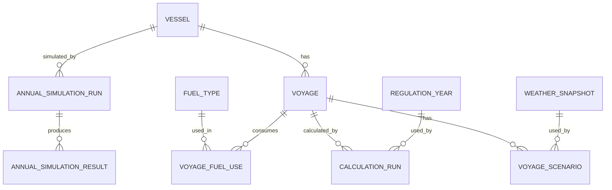
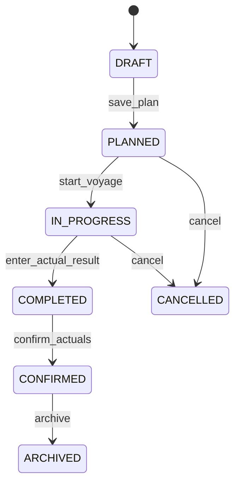
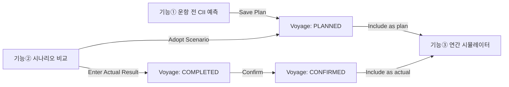

# PRD — 중소선사를 위한 탄소집약도(CII) 예측 및 운항 의사결정 보조 플랫폼

| 항목 | 내용 |
|---|---|
| 문서명 | 구현용 상세 PRD.md |
| 제품명 | 중소선사를 위한 CII 예측 및 운항 의사결정 보조 플랫폼 |
| 버전 | v3.1 Implementation PRD |
| 상태 | MVP 구현 기준 / Oracle Review 반영 |
| 최종 수정일 | 2026-07-03 |
| MVP 개발 기간 | 2026.06 ~ 2026.10 |
| 대상 사용자 | 중소선사 선장·항해사, 육상 운항관리 담당자 |
| 문서 목적 | 개발자가 화면·계산·데이터 흐름·예외 처리·테스트 기준을 구현할 수 있도록 PRD v3.0을 상세화 |
| 후속 문서 | `TECH_SPEC.md`, `API_SPEC.md`, `DB_SCHEMA.md`, `TEST_PLAN.md` |

---

## 0. 문서 사용 규칙

### 0.1 요구사항 강도

본 문서의 요구사항 강도는 다음 기준을 따른다.

| 표현 | 의미 |
|---|---|
| MUST | MVP 구현에 필수이다. 미구현 시 MVP 성공 기준을 충족하지 못한다. |
| SHOULD | MVP에 포함하는 것을 원칙으로 하되, 일정상 조정 가능하다. |
| MAY | 선택 구현 또는 향후 확장이다. |
| OUT OF SCOPE | MVP에서 제외한다. |

### 0.2 문서 간 우선순위

1. 본 `PRD.md`
2. `TECH_SPEC.md`
3. `API_SPEC.md`
4. `DB_SCHEMA.md`
5. `TEST_PLAN.md`
6. 기존 기획서·회의록·화면 요구사항

단, IMO 규정·공식 계산식·규제 파라미터는 최신 IMO 문서 및 승인된 파라미터 파일이 우선한다.

### 0.3 구현 범위에 대한 기본 원칙

본 제품은 **규제 제출용 공식 계산 시스템이 아니라, 운항 의사결정을 보조하는 예측·시뮬레이션 도구**이다. 따라서 제품 내 모든 결과에는 다음 문구 또는 동등한 의미의 안내가 노출되어야 한다.

> 본 결과는 공개 데이터, 사용자 입력값, 추정 모델을 기반으로 한 참고용 예측값입니다. 규제 제출용 공식 CII 계산 결과가 아니며, 최종 운항 판단은 사용자에게 있습니다.

---

## 1. v2.0 대비 주요 수정 사항

기존 PRD에서 구현상 오해를 만들 수 있는 내용을 아래와 같이 수정한다.

| ID | 기존 표현 또는 위험 요소 | 수정 내용 | 적용 위치 |
|---|---|---|---|
| COR-1 | "항차별 CII"가 공식 IMO CII처럼 해석될 수 있음 | IMO CII 등급은 연간 단위가 공식 기준이다. 본 제품의 항차 단위 값은 `항차 CII 추정값` 또는 `항차 CII 기여도`로 표기한다. | 전체 |
| COR-2 | "현재 등급" 표현이 공식 확정 등급으로 오해될 수 있음 | 연중 화면에서는 `현재 누적 기준 예상 등급` 또는 `연말 예상 등급`으로 표기한다. | 기능①·③ |
| COR-3 | "한번 하락한 등급은 해당 연도 내 회복 불가능" | 공식 등급은 연말 운항 실적 기준으로 사후 산정된다. 연중에는 누적 실적이 나빠질수록 남은 항차로 목표 등급 회복이 어려워질 수 있다고 표현한다. | 문제 정의 |
| COR-4 | "Townsin 모델" 단독 표기 | 구현 명칭은 `Townsin–Kwon 계열 경험식 기반 기상 보정 어댑터`로 한다. 실제 수식·계수는 `TECH_SPEC.md`에서 확정한다. | 기능② |
| COR-5 | "실시간"으로 보일 수 있는 표현 | MVP는 AIS·IoT를 연동하지 않는다. 현재 위치·속도는 사용자 입력 또는 개발자도구 기반 수동 좌표 입력을 사용한다. | 기능② |
| COR-6 | IMO 감축계수 미확정 위험 | 2027~2030 Z-factor는 MEPC.400(83) 기준값을 기본 파라미터로 반영한다. 단, 코드 하드코딩 금지. | 계산 원칙 |
| COR-7 | AI 연료 예측의 범위 불명확 | AI 연료 예측은 MVP 핵심 경로에서 제외하고, 데이터가 준비된 경우 `실험 기능`으로만 제공한다. | O-1 |
| COR-8 | 기능①→③ 데이터 이관 방식 미정 | 항차 상태 모델과 `annual_inclusion_policy`를 정의하여 계획·진행·완료·확정 데이터를 연간 시뮬레이션에 반영한다. | 데이터 흐름 |

---

## 2. 제품 정의

### 2.1 제품 개요

본 서비스는 중소선사가 선박별 운항 계획과 누적 실적을 바탕으로 다음을 수행할 수 있도록 지원하는 웹 기반 의사결정 보조 플랫폼이다.

1. 출항 전 항차 조건에 따른 CII 추정값과 연말 예상 등급 확인
2. 운항 중 기상 정보를 반영한 직항·우회·감속 시나리오 비교
3. 누적 실적과 잔여 계획을 기반으로 한 연말 CII 등급 시뮬레이션

본 서비스는 항로를 자동 결정하거나 선박을 자동 제어하지 않는다. 시스템은 선택지별 수치 비교를 제공하고, 최종 운항 판단은 사용자에게 둔다.

### 2.2 MVP 목표

MVP는 다음 사용자 과업을 한 흐름으로 수행할 수 있어야 한다.

```text
선박 등록/선택
→ 출항 전 항차 CII 추정
→ 운항 중 시나리오 비교
→ 항차 결과 저장/확정
→ 연말 CII 등급 예측
→ 목표 등급 달성을 위한 개선 시나리오 비교
```

### 2.3 제품 성공 정의

MVP 성공은 다음 세 가지가 통합 시연 가능한 상태로 정의한다.

| 성공 항목 | 정의 |
|---|---|
| 계산 가능성 | 선박·항차·연료·거리 입력으로 CII 추정값과 등급을 재현 가능하게 산출한다. |
| 비교 가능성 | 동일 선박·동일 기준연도에서 직항·우회·감속 시나리오를 동일 기준으로 비교한다. |
| 관리 가능성 | 누적 실적과 잔여 계획을 합산하여 연말 예상 등급과 목표 등급 달성 확률을 제공한다. |

### 2.4 비목표

다음은 MVP 범위에서 제외한다.

| 항목 | 제외 사유 |
|---|---|
| 규제 제출용 공식 CII 보고서 생성 | 인증기관 검증·G5 보정·공식 DCS 연계가 필요함 |
| 자동 최적항로 추천 | 의사결정 보조 원칙과 안전 책임 이슈 |
| AIS 자동 연동 | MVP 일정·비용 제약 |
| IoT 센서 연동 | MVP 일정·선박별 장비 차이 |
| 선대 통합 모니터링 | 향후 확장 범위 |
| 사용자 권한·조직 관리 고도화 | MVP 이후 확장 |
| 다국어 UI | 한국어 기본, 실무 영문 약어 병기만 허용 |

---

## 3. 규제·계산 기준 요약

### 3.1 공식 CII 적용 대상

MVP의 규정 파라미터는 IMO CII 체계를 기준으로 한다. CII는 일반적으로 MARPOL Annex VI Regulation 28 적용 대상인 5,000 GT 이상 선박을 기준으로 한다.

제품은 MVP에서 공식 제출용이 아니므로, 사용자가 5,000 GT 미만 선박을 입력하더라도 계산 자체는 `샘플/내부 분석용`으로 수행할 수 있다. 다만 화면에는 `공식 CII 적용 대상이 아닐 수 있음`을 표시해야 한다.

### 3.2 공식 CII와 제품 내 추정값의 구분

| 구분 | 공식 IMO CII | 본 제품 MVP |
|---|---|---|
| 기준 기간 | 1월 1일~12월 31일 연간 실적 | 항차 단위 추정, 누적 실적, 연말 예측 |
| 데이터 | 검증된 연료 사용량·거리 등 | 사용자 입력, 샘플 데이터, 공개 API, 추정 모델 |
| 용도 | 규제 준수·등급 산정 | 운항 의사결정 보조 |
| 산출물 | Attained annual operational CII, CII Rating | 예상 CII, 예상 등급, 위험도, 목표 달성 확률 |
| 제출 가능성 | 가능 | 불가 |

### 3.3 MVP 기본 계산식

#### 3.3.1 Attained annual operational CII 형식

공식 CII의 기본 형태는 다음 구조를 따른다.

```text
attained_CII = M / W
```

| 기호 | 의미 | MVP 단위 |
|---|---|---|
| M | CO₂ 배출량 총량 | gCO₂ |
| W | Transport work 또는 transport work proxy | capacity × nautical mile |

#### 3.3.2 CO₂ 배출량

```text
M = Σ(FuelConsumed_j × 1,000,000 × CF_j)
```

| 항목 | 설명 |
|---|---|
| `FuelConsumed_j` | 연료 종류 j의 사용량, ton 기준 |
| `1,000,000` | ton fuel → gram fuel 변환 |
| `CF_j` | 연료 j의 fuel-to-CO₂ conversion factor, tCO₂/tFuel 또는 gCO₂/gFuel과 동일 비율 |

#### 3.3.3 Transport work proxy

```text
W = transport_capacity × Distance_nm
```

| 선박 유형 | Capacity 기준 |
|---|---|
| Bulk carrier, Tanker, Container ship, Gas carrier, LNG carrier, General cargo ship, Refrigerated cargo carrier, Combination carrier | DWT |
| Ro-ro cargo ship, Ro-ro passenger ship, Cruise passenger ship | GT 또는 규정상 해당 capacity 기준 |

> 주의: Container ship의 capacity 처리는 CII G1/G2 기준을 우선한다. EEDI와 혼동하지 않도록 `RegulationParameter.capacity_rule`에 명시한다.
> 
> **[외부 리뷰 P0-1 / Oracle C2 Revert]** IMO G1(MEPC.352(78))과 G2(MEPC.353(78))은 **서로 다른 capacity 개념**을 사용한다.
> - **G1 (attained CII)**: `transport_capacity` = 선박의 **실제** DWT 또는 GT. 예: 300,000 DWT 벌크캐리어 → `W = 300,000 × Distance_nm`
> - **G2 (reference CII)**: `reference_capacity` = G2 표의 capacity rule에 따른 값. `fixed X`인 경우 X를 사용. 예: 300,000 DWT 벌크캐리어 → `CII_ref = 4745 × 279,000^(-0.622)`
>
> 이전 ORACLE-C2 수정(fixed capacity를 W에도 적용)은 **잘못된 것으로 확인되어 취소**한다. IMO G1은 transport work proxy에 항상 실제 capacity를 사용하며, G2의 fixed capacity 값은 reference line 공식에만 적용된다.
>
> **이중 capacity 해결 규칙:**
> 1. `transport_capacity = resolve_transport_capacity(vessel)` — 항상 실제 DWT 또는 GT
> 2. `reference_capacity = resolve_reference_capacity(vessel, reference_line)` — G2 표의 capacity_rule에 따름
> 3. `condition_expr`(예: `DWT ≥ 279,000`)는 선박의 실제 DWT/GT로 평가하여 어느 파라미터 행을 선택할지 결정
>
> **오차 영향**: fixed capacity를 W에 잘못 적용하면 300,000 DWT 벌크캐리어의 attained CII가 +7.5% 과대 산정되며, 50,000 DWT LNG 캐리어의 경우 −23.1% 과소 산정(위험: 실제보다 양호해 보임)된다.

#### 3.3.4 Reference CII

```text
CII_ref = a × Capacity^(-c)
```

`a`, `c`는 선종별 reference line 파라미터이며 코드에 하드코딩하지 않는다.

#### 3.3.5 Required CII

```text
required_CII(year) = CII_ref × (1 - Z_year / 100)
```

#### 3.3.6 Rating boundary

```text
superior_boundary = required_CII × d1
lower_boundary    = required_CII × d2
upper_boundary    = required_CII × d3
inferior_boundary = required_CII × d4
```

등급 판정은 낮은 CII가 더 우수하다는 전제에서 다음 순서로 수행한다.

```text
if attained_CII <= superior_boundary: A
else if attained_CII <= lower_boundary: B
else if attained_CII <= upper_boundary: C
else if attained_CII <= inferior_boundary: D
else: E
```

경계값과 정확히 같은 경우에는 더 우수한 등급으로 판정한다. 예: `attained_CII == lower_boundary`이면 B.

### 3.4 기본 규정 파라미터

#### 3.4.1 CII reduction factor, Z%

다음 값은 MVP 초기 파라미터 seed로 사용한다. 실제 운영 시에는 관리자 또는 배포 스크립트를 통해 갱신 가능해야 한다.

| Year | Z factor relative to 2019 |
|---:|---:|
| 2023 | 5.000% |
| 2024 | 7.000% |
| 2025 | 9.000% |
| 2026 | 11.000% |
| 2027 | 13.625% |
| 2028 | 16.250% |
| 2029 | 18.875% |
| 2030 | 21.500% |

#### 3.4.2 Fuel CF 기본값

| Fuel code | 표시명 | CF, tCO₂/tFuel | MVP 사용 |
|---|---|---:|---|
| DIESEL_GAS_OIL | Diesel/Gas Oil | 3.206 | MUST |
| LFO | Light Fuel Oil | 3.151 | SHOULD |
| HFO | Heavy Fuel Oil | 3.114 | MUST |
| LPG_PROPANE | LPG Propane | 3.000 | MAY |
| LPG_BUTANE | LPG Butane | 3.030 | MAY |
| LNG | Liquefied Natural Gas | 2.750 | SHOULD |
| METHANOL | Methanol | 1.375 | MAY |
| ETHANOL | Ethanol | 1.913 | MAY |
| OTHER | 사용자 정의 연료 | 사용자 입력 | SHOULD |

`OTHER` 연료는 CF 출처 메모와 적용 시작일을 필수로 입력해야 한다.

#### 3.4.3 Ship type reference line 파라미터

MVP는 모든 CII 대상 선종을 파라미터 테이블로 저장할 수 있어야 한다. 단, QA fixture와 데모 검증은 `Bulk carrier`, `Tanker`, `Container ship`, `General cargo ship`을 우선한다.

| Ship type | 조건 | Capacity rule | a | c | MVP 우선순위 |
|---|---|---|---:|---:|---|
| BULK_CARRIER | DWT ≥ 279,000 | fixed 279000 | 4745 | 0.622 | P1 |
| BULK_CARRIER | DWT < 279,000 | DWT | 4745 | 0.622 | P1 |
| GAS_CARRIER | DWT ≥ 65,000 | DWT | 14405E7 | 2.071 | P2 |
| GAS_CARRIER | DWT < 65,000 | DWT | 8104 | 0.639 | P2 |
| TANKER | all | DWT | 5247 | 0.610 | P1 |
| CONTAINER_SHIP | all | DWT | 1984 | 0.489 | P1 |
| GENERAL_CARGO_SHIP | DWT ≥ 20,000 | DWT | 31948 | 0.792 | P1 |
| GENERAL_CARGO_SHIP | DWT < 20,000 | DWT | 588 | 0.3885 | P1 |
| REFRIGERATED_CARGO_CARRIER | all | DWT | 4600 | 0.557 | P2 |
| COMBINATION_CARRIER | all | DWT | 5119 | 0.622 | P2 |
| LNG_CARRIER | DWT ≥ 100,000 | DWT | 9.827 | 0.000 | P2 |
| LNG_CARRIER | 65,000 ≤ DWT < 100,000 | DWT | 14479E10 | 2.673 | P2 |
| LNG_CARRIER | DWT < 65,000 | fixed 65000 | 14779E10 | 2.673 | P2 |
| RO_RO_CARGO_VEHICLE | GT ≥ 57,700 | fixed 57700 | 3627 | 0.590 | P3 |
| RO_RO_CARGO_VEHICLE | 30,000 ≤ GT < 57,700 | GT | 3627 | 0.590 | P3 |
| RO_RO_CARGO_VEHICLE | GT < 30,000 | GT | 330 | 0.329 | P3 |
| RO_RO_CARGO | all | GT | 1967 | 0.485 | P3 |
| RO_RO_PASSENGER | Ro-ro passenger ship | GT | 2023 | 0.460 | P3 |
| RO_RO_PASSENGER_HSC | SOLAS Chapter X HSC | GT | 4196 | 0.460 | P3 |
| CRUISE_PASSENGER | all | GT | 930 | 0.383 | P3 |

> 구현 주의: `14405E7`, `14479E10`, `14779E10`은 IMO 표 원문 표기다. DB 저장 시에는 문자열 원문값과 Decimal 변환값을 모두 저장한다. 예: `14405E7` → `14405 × 10^7`.

#### 3.4.4 d-vector rating boundary 파라미터

| Ship type | 조건 | capacity basis | d1 | d2 | d3 | d4 |
|---|---|---|---:|---:|---:|---:|
| BULK_CARRIER | all | DWT | 0.86 | 0.94 | 1.06 | 1.18 |
| GAS_CARRIER | DWT ≥ 65,000 | DWT | 0.81 | 0.91 | 1.12 | 1.44 |
| GAS_CARRIER | DWT < 65,000 | DWT | 0.85 | 0.95 | 1.06 | 1.25 |
| TANKER | all | DWT | 0.82 | 0.93 | 1.08 | 1.28 |
| CONTAINER_SHIP | all | DWT | 0.83 | 0.94 | 1.07 | 1.19 |
| GENERAL_CARGO_SHIP | all | DWT | 0.83 | 0.94 | 1.06 | 1.19 |
| REFRIGERATED_CARGO_CARRIER | all | DWT | 0.78 | 0.91 | 1.07 | 1.20 |
| COMBINATION_CARRIER | all | DWT | 0.87 | 0.96 | 1.06 | 1.14 |
| LNG_CARRIER | DWT ≥ 100,000 | DWT | 0.89 | 0.98 | 1.06 | 1.13 |
| LNG_CARRIER | DWT < 100,000 | DWT | 0.78 | 0.92 | 1.10 | 1.37 |
| RO_RO_CARGO_VEHICLE | all | GT | 0.86 | 0.94 | 1.06 | 1.16 |
| RO_RO_CARGO | all | GT | 0.76 | 0.89 | 1.08 | 1.27 |
| RO_RO_PASSENGER | all | GT | 0.76 | 0.92 | 1.14 | 1.30 |
| CRUISE_PASSENGER | all | GT | 0.87 | 0.95 | 1.06 | 1.16 |

---

## 4. 사용자 및 주요 과업

### 4.1 페르소나 1 — 선장·항해사

| 항목 | 내용 |
|---|---|
| 사용 맥락 | 운항 전 계획 수립, 운항 중 대안 비교 |
| 기기 | 선상 PC·태블릿, 데스크톱 우선 |
| 주요 Pain Point | 기상·속도·우회가 연료와 CII에 미치는 영향을 즉시 비교하기 어렵다. |
| 핵심 과업 | 항차 CII 추정, 직항·우회·감속 비교, 시나리오 결과 확인 |
| 금지 기대 | 시스템이 최적 항로를 자동 선택하거나 운항 명령을 내리는 것 |

### 4.2 페르소나 2 — 육상 운항관리 담당자

| 항목 | 내용 |
|---|---|
| 사용 맥락 | 선박별 연간 CII 등급 관리, 남은 항차 계획 조정 |
| 기기 | 데스크톱 웹 |
| 주요 Pain Point | 현재 추세로 연말 등급이 어떻게 될지 사전에 보기 어렵다. |
| 핵심 과업 | 누적 실적 확인, 잔여 계획 입력, 연말 예상 등급·목표 달성 확률 확인 |
| 금지 기대 | 공식 DCS 보고서 제출 또는 인증기관 검증 대체 |

### 4.3 보조 이해관계자 — 경영진

| 항목 | 내용 |
|---|---|
| 사용 맥락 | 운항 전략·감속 운항·연료 전환·선박 교체 검토 |
| 핵심 과업 | 목표 등급 달성 가능성, 위험 선박, 개선 시나리오 효과 확인 |
| MVP 접근 | 별도 권한 관리는 MVP 제외. 동일 관리자 화면에서 확인 가능. |

---

## 5. MVP 범위

### 5.1 포함 범위

| 모듈 | 기능 | MVP 포함 |
|---|---|---|
| 선박 관리 | 선박 등록, 샘플 선박 선택, 제원 수동 입력 | MUST |
| 규정 파라미터 | 연도별 Z-factor, 선종별 reference line, d-vector, 연료 CF 관리 | MUST |
| 기능① | 운항 전 항차 CII 추정 | MUST |
| 기능② | 운항 중 직항·우회·감속 시나리오 비교 | MUST |
| 기능③ | 연간 CII 등급 시뮬레이터 | MUST |
| 데이터 흐름 | 기능① 계획 저장 → 기능③ 반영 | MUST |
| 데이터 흐름 | 기능② 시나리오 채택 → 계획 또는 실적 반영 | SHOULD |
| 오류 처리 | 외부 API 장애, 필수 입력 누락, 계산 불가 안내 | MUST |
| 테스트 | 계산 fixture, 경계값 테스트, seed 재현성 테스트 | MUST |
| 내보내기 | CSV 다운로드 | SHOULD |
| AI 연료 예측 | 실험 기능 | MAY |

### 5.2 제외 범위

| 항목 | MVP 제외 여부 | 설명 |
|---|---|---|
| 공식 규제 제출 | OUT OF SCOPE | 인증기관 검증과 공식 DCS 연계 필요 |
| G5 correction factor/voyage adjustment 전체 지원 | OUT OF SCOPE | MVP는 기본 AER/CII 구조 중심. 향후 확장. |
| 자동 최적항로 추천 | OUT OF SCOPE | 비교 정보만 제공 |
| AIS 자동 위치 수집 | OUT OF SCOPE | 위치는 수동 입력 |
| IoT/엔진 센서 연동 | OUT OF SCOPE | 사용자 입력·샘플 데이터 기반 |
| 선대 통합 모니터링 | OUT OF SCOPE | 향후 확장 |
| 권한 관리 고도화 | OUT OF SCOPE | 단일 조직·단일 역할 가정 |

---

## 6. 정보 구조 및 화면 구성

### 6.1 네비게이션

MVP 웹 앱은 다음 메뉴를 제공한다.

```text
Dashboard
Vessels
Voyage CII Estimator
Scenario Comparison
Annual CII Simulator
Parameters
Data Import/Export
```

### 6.2 화면 목록

| Screen ID | 화면명 | 사용자 | 목적 |
|---|---|---|---|
| SCR-001 | Dashboard | 전체 | 선택 선박의 핵심 상태 요약 |
| SCR-002 | Vessel Management | 운항관리자 | 선박 등록·수정·샘플 선택 |
| SCR-003 | Voyage CII Estimator | 선장·항해사·운항관리자 | 운항 전 항차 CII 추정 |
| SCR-004 | Scenario Comparison | 선장·항해사 | 직항·우회·감속 비교 |
| SCR-005 | Annual CII Simulator | 운항관리자·경영진 | 연말 등급 예측·목표 달성 확률 확인 |
| SCR-006 | Parameter Management | 관리자 | 규정·연료·모델 파라미터 조회·수정 |
| SCR-007 | Data Import/Export | 운항관리자 | 샘플/CSV 데이터 입력·출력 |

### 6.3 공통 UX 문구

| 상황 | 표시 문구 |
|---|---|
| 모든 결과 화면 | `참고용 예측값입니다. 규제 제출용 공식 결과가 아닙니다.` |
| 외부 데이터 사용 | `외부 데이터 기준 시각: {synced_at}` |
| 추정값 사용 | `일부 값은 사용자 입력 또는 모델 추정값입니다.` |
| 기상 API 실패 | `최신 기상 데이터를 가져오지 못했습니다. 마지막 동기화 데이터를 사용하거나 계산을 중단합니다.` |
| 공식 적용 대상 아님 | `입력 선박은 공식 CII 적용 대상이 아닐 수 있습니다. 내부 분석용으로만 사용하세요.` |
| 자동 결정 금지 | `시스템은 시나리오별 수치만 비교하며, 최종 운항 판단은 사용자에게 있습니다.` |

---

## 7. 공통 데이터 모델

### 7.1 핵심 엔티티



### 7.2 Vessel

| 필드 | 타입 | 필수 | 설명 | 검증 |
|---|---|---|---|---|
| `id` | UUID | Y | 내부 ID | 자동 생성 |
| `imo_number` | string | Y | IMO 번호 | 7자리 숫자. 가능하면 check digit 검증 |
| `name` | string | Y | 선박명 | 1~100자 |
| `ship_type` | enum | Y | CII 선종 | parameter table에 존재해야 함 |
| `gross_tonnage` | decimal | 조건부 | GT | 0보다 큼 |
| `deadweight` | decimal | 조건부 | DWT | 0보다 큼 |
| `default_fuel_type` | enum | N | 기본 연료 | FuelType 참조 |
| `reference_speed_kn` | decimal | N | 기준 속도 | 0보다 큼 |
| `reference_daily_foc_ton` | decimal | N | 기준 일일 연료소모량 | 0보다 큼 |
| `is_cii_applicable_hint` | boolean | 자동 | 공식 CII 적용 가능성 힌트 | GT ≥ 5000 및 선종 기준 |
| `created_at` | datetime | Y | 생성일 | 자동 |
| `updated_at` | datetime | Y | 수정일 | 자동 |

### 7.3 Voyage

| 필드 | 타입 | 필수 | 설명 |
|---|---|---|---|
| `id` | UUID | Y | 항차 ID |
| `vessel_id` | UUID | Y | 선박 ID |
| `voyage_no` | string | N | 사용자가 입력한 항차 번호 |
| `status` | enum | Y | DRAFT, PLANNED, IN_PROGRESS, COMPLETED, CONFIRMED, CANCELLED |
| `departure_port_name` | string | Y | 출발항 |
| `departure_lat` | decimal | N | 출발항 위도 |
| `departure_lon` | decimal | N | 출발항 경도 |
| `arrival_port_name` | string | Y | 도착항 |
| `arrival_lat` | decimal | N | 도착항 위도 |
| `arrival_lon` | decimal | N | 도착항 경도 |
| `planned_distance_nm` | decimal | Y | 계획 거리 |
| `actual_distance_nm` | decimal | N | 실제 거리 |
| `planned_speed_kn` | decimal | Y | 예정 평균 속도 |
| `actual_avg_speed_kn` | decimal | N | 실제 평균 속도 |
| `planned_departure_at` | datetime | N | 예정 출항 |
| `planned_arrival_at` | datetime | N | 예정 도착 |
| `actual_departure_at` | datetime | N | 실제 출항 |
| `actual_arrival_at` | datetime | N | 실제 도착 |
| `annual_inclusion_policy` | enum | Y | EXCLUDE, INCLUDE_AS_PLAN, INCLUDE_AS_ACTUAL |
| `created_from` | enum | Y | MANUAL, FEATURE_1, FEATURE_2_ADOPTED, IMPORT, SAMPLE |
| `notes` | string | N | 메모 |

### 7.4 VoyageFuelUse

| 필드 | 타입 | 필수 | 설명 |
|---|---|---|---|
| `id` | UUID | Y | ID |
| `voyage_id` | UUID | Y | 항차 ID |
| `fuel_type` | enum | Y | 연료 종류 |
| `planned_fuel_ton` | decimal | N | 계획 연료 사용량 |
| `actual_fuel_ton` | decimal | N | 실제 연료 사용량 |
| `cf_used` | decimal | Y | 계산 시점 CF snapshot |
| `source` | enum | Y | USER_INPUT, MODEL_ESTIMATE, IMPORT, SAMPLE |
> **[ORACLE-C4制約]** `Voyage.status = COMPLETED`로 전환 시, 최소 1개 `VoyageFuelUse.actual_fuel_ton`이 0보다 큰 값으로 입력되어야 한다. `actual_fuel_ton`이 모두 NULL인 COMPLETED 상태를 허용하지 않는다. 실적 입력 없이 완료 처리가 필요한 경우 `IN_PROGRESS` 상태를 유지하거나, 계획값을 임시 실적으로 복사 후 `source = MODEL_ESTIMATE`로 명시한다.

### 7.5 VoyageScenario

| 필드 | 타입 | 필수 | 설명 |
|---|---|---|---|
| `id` | UUID | Y | 시나리오 ID |
| `voyage_id` | UUID | 조건부 | 기존 항차에서 생성된 경우 |
| `scenario_type` | enum | Y | DIRECT, DETOUR, SLOW_STEAMING |
| `scenario_name` | string | Y | 표시명 |
| `distance_nm` | decimal | Y | 시나리오 거리 |
| `speed_kn` | decimal | Y | 평균 속도 |
| `duration_hours` | decimal | Y | 예상 소요 시간 |
| `fuel_ton` | decimal | Y | 예상 연료 |
| `weather_factor` | decimal | N | 기상 보정 계수 |
| `cii_value` | decimal | Y | 항차 CII 추정값 |
| `estimated_rating` | enum | Y | 예상 등급 |
| `risk_level` | enum | Y | LOW, MEDIUM, HIGH, CRITICAL |
| `is_adopted` | boolean | Y | 사용자가 계획에 반영했는지 여부 |

### 7.6 RegulationParameter

규정 파라미터는 코드에 하드코딩하지 않는다. 최소한 다음 테이블 또는 동등한 구조가 필요하다.

| 테이블 | 주요 필드 |
|---|---|
| `regulation_year` | `year`, `z_factor_percent`, `effective_from`, `source_ref`, `version` |
| `fuel_type` | `code`, `display_name`, `cf`, `unit`, `source_ref`, `is_active` |
| `cii_reference_line` | `ship_type`, `condition_expr`, `capacity_rule`, `a_raw`, `a_decimal`, `c`, `source_ref` |
| `cii_rating_boundary` | `ship_type`, `condition_expr`, `capacity_basis`, `d1`, `d2`, `d3`, `d4`, `source_ref` |
| `weather_model_parameter` | `model_version`, `key`, `value`, `unit`, `source_ref` |
> **[ORACLE-R2版本]** 파라미터 버전은 개별 파라미터 단위가 아닌 **파라미터 세트 전체의 content hash**로 관리한다. `parameter_snapshot_hash = SHA256(canonical_json(해당 계산에 사용된 모든 파라미터))`이며, `CalculationRun.result_json` 내 `parameters_used` 필드에 사용된 파라미터 값을 전체 snapshot으로 저장한다. 개별 파라미터 변경 시 hash가 변경되어 자동으로 새 버전으로 인식된다.
> **[ORACLE-R7精度]** `cii_reference_line.a_raw`는 `VARCHAR`로 IMO 원문 표기 그대로 저장하고, `a_decimal`은 `NUMERIC(30,6)`으로 저장한다. 애플리케이션 시작 시 `parse(a_raw) == a_decimal` 검증을 수행한다. `14405E7` = 144,050,000,000은 64-bit float의 정밀도 한계(15~17 유효숫자)에 근접하므로, 계산 과정에서 float 변환을 피하고 Decimal을 사용한다.

### 7.7 CalculationRun

계산 결과는 재현성을 위해 snapshot으로 저장한다.

| 필드 | 타입 | 필수 | 설명 |
|---|---|---|---|
| `id` | UUID | Y | 계산 실행 ID |
| `calculation_type` | enum | Y | VOYAGE_ESTIMATE, SCENARIO, ANNUAL_DETERMINISTIC, ANNUAL_MONTE_CARLO |
| `input_hash` | string | Y | 입력값 hash |
| `parameter_version` | string | Y | 규정 파라미터 버전 |
| `model_version` | string | Y | 계산 모델 버전 |
| `result_json` | json | Y | 결과 snapshot |
| `warnings_json` | json | N | 경고 목록 |
| `created_at` | datetime | Y | 생성일 |
> **[ORACLE-R3 hashing]** `input_hash`는 결정적 직렬화를 보장해야 한다: (a) JSON 키를 알파벳순 정렬, (b) 모든 수치는 Decimal 문자열로 직렬화(float 금지), (c) 포함 필드 목록을 명시적으로 정의, (d) SHA-256 사용. UUID 리스트는 정렬 후 해시한다.
> **[ORACLE-R2 version]** `parameter_version`은 `parameter_snapshot_hash`와 동일한 값으로, 개별 테이블 버전이 아닌 해당 계산에 사용된 전체 파라미터 세트의 hash이다.

---

## 8. 항차 상태 및 데이터 흐름

### 8.1 항차 상태 모델



| 상태 | 의미 | 연간 시뮬레이터 반영 |
|---|---|---|
| DRAFT | 작성 중 | 반영하지 않음 |
| PLANNED | 계획 저장 완료 | `INCLUDE_AS_PLAN`이면 잔여 항차로 반영 |
| IN_PROGRESS | 운항 중 | 계획값 또는 사용자가 업데이트한 예상값으로 반영 |
| COMPLETED | 실적 입력 완료, 미확정 | 실제값 후보로 반영하되 `미확정` 표시 |
| CONFIRMED | 실적 확정 | 실제값으로 반영 |
| CANCELLED | 취소 | 반영하지 않음 |
| ARCHIVED | 보관 | 과거 조회만 허용 |
#### 8.1.1 상태 전환 가드
| 전환 | 가드 조건 | 실패 시 처리 |
|---|---|---|
| IN_PROGRESS → COMPLETED | 최소 1개 `actual_fuel_ton > 0` 존재 | 전환 거부, 실적 입력 요청 |
| COMPLETED → CONFIRMED | 모든 `actual_fuel_ton > 0` 및 `actual_distance_nm > 0` | 전환 거부, 누락 실적 입력 요청 |
| CONFIRMED → COMPLETED | 오류 정정 목적만 허용. audit log 필수 | 재확인 다이얼로그 표시 |

#### 8.1.2 status × annual_inclusion_policy 제약 매트릭스
| status | 허용 policy | 비고 |
|---|---|---|
| DRAFT | EXCLUDE only | 자동 설정 |
| PLANNED | EXCLUDE, INCLUDE_AS_PLAN | |
| IN_PROGRESS | EXCLUDE, INCLUDE_AS_PLAN | |
| COMPLETED | EXCLUDE, INCLUDE_AS_ACTUAL | |
| CONFIRMED | EXCLUDE, INCLUDE_AS_ACTUAL | |
| CANCELLED | EXCLUDE only | 상태 변경 시 자동 설정 |
| ARCHIVED | EXCLUDE only | 상태 변경 시 자동 설정 |

> **[ORACLE-R1整合性]** `status` 변경 시 허용되지 않은 `annual_inclusion_policy` 조합은 자동으로 `EXCLUDE`로 보정하거나 전환을 거부한다.

### 8.2 기능 간 데이터 흐름



### 8.3 값 우선순위

연간 시뮬레이터에서 항차 데이터를 사용할 때 값 우선순위는 다음과 같다.

```text
CONFIRMED actual
> COMPLETED actual
> IN_PROGRESS latest estimate
> PLANNED adopted scenario
> PLANNED initial plan
> SAMPLE default
```
> **[ORACLE-C4 fallback]** `COMPLETED` 상태 항차의 `actual_fuel_ton`이 NULL인 경우(과거 데이터 마이그레이션 등): 계획값을 임시 실적으로 사용하되, 화면에 `실적이 입력되지 않은 완료 항차입니다. 계획값을 임시 사용 중.` 경고를 표시한다. 이 경우 `INCLUDE_AS_ACTUAL` 대신 `INCLUDE_AS_PLAN`으로 강제한다.

### 8.4 재계산 정책

| 이벤트 | 처리 |
|---|---|
| 항차 계획 변경 | 해당 항차 계산 결과 무효화 후 재계산 |
| 실제 연료 사용량 입력 | 계획값과 실제값을 모두 보존하고 실제값 우선 사용 |
| 규정 파라미터 변경 | 기존 CalculationRun은 보존, 화면의 최신 계산은 새 파라미터로 재계산 |
| 선박 DWT/GT 변경 | 해당 선박의 모든 미확정 계산 결과 재계산 필요 표시 |
| 연료 CF 변경 | 변경 이후 계산에만 적용. 과거 계산은 snapshot 보존 |
| **동시성: 시뮬레이션 스냅샷 격리** | 연간 시뮬레이션 시작 시점의 모든 항차 데이터를 스냅샷으로 복사. 시뮬레이션 실행 중 발생하는 상태 변경(예: COMPLETED → CONFIRMED)은 진행 중인 시뮬레이션에 영향을 주지 않는다. |

---

## 9. 기능 요구사항 — 공통

### 9.1 공통 입력 검증

| Rule ID | 규칙 | 오류 문구 |
|---|---|---|
| VAL-001 | 필수값이 비어 있으면 계산 불가 | `{field}을/를 입력하세요.` |
| VAL-002 | 거리, 속도, 연료량, DWT, GT는 0보다 커야 함 | `{field}은/는 0보다 커야 합니다.` |
| VAL-003 | IMO 번호는 7자리 숫자 | `IMO 번호는 7자리 숫자여야 합니다.` |
| VAL-004 | 선종은 파라미터 테이블에 존재해야 함 | `지원하지 않는 선종입니다.` |
| VAL-005 | 기준연도는 regulation_year에 존재해야 함 | `해당 연도의 규정 파라미터가 없습니다.` |
| VAL-006 | 연료 종류는 active fuel_type이어야 함 | `지원하지 않는 연료입니다.` |
| VAL-007 | 위치 좌표는 위도 -90~90, 경도 -180~180 | `좌표 형식이 올바르지 않습니다.` |
| VAL-008 | 계산 결과가 NaN, Infinity, 음수인 경우 계산 불가 | `계산 오류: 입력값을 확인하세요.` |
| VAL-009 | 시나리오 속도는 최소 1.0kn 이상이어야 함 | `속도는 1.0노트 이상이어야 합니다.` |
| VAL-010 | capacity(effective capacity 포함)는 0보다 커야 함 | `선박 용량 정보가 부족합니다.` |

### 9.2 공통 출력 필드

모든 CII 결과 카드에는 최소한 다음 필드를 표시해야 한다.

| 필드 | 표시 예시 | 비고 |
|---|---|---|
| `attained_cii_estimate` | `4.982 gCO₂/dwt·nm` | 항차 또는 누적 추정값 |
| `required_cii` | `5.045 gCO₂/dwt·nm` | 해당 연도·선종·capacity 기준 |
| `ratio_to_required` | `98.8%` | attained / required |
| `estimated_rating` | `C` | A~E |
| `next_worse_boundary_margin` | `0.365 gCO₂/dwt·nm` | 다음 악화 등급 경계까지 여유 |
| `co2_emission_ton` | `249.12 tCO₂` | 표시용 ton 변환 |
| `fuel_consumption_ton` | `80.00 ton` | 연료 종류별 합산 |
| `distance_nm` | `1,000 nm` | 계산 거리 |
| `calculation_basis` | `HFO CF=3.114, Z=11%` | 툴팁 또는 상세 영역 |
| `disclaimer` | 참고용 예측값 | 항상 표시 |

### 9.3 수치 표시·반올림

| 값 | 내부 정밀도 | 화면 표시 |
|---|---:|---:|
| CII | Decimal, 최소 6자리 | 소수점 3자리 |
| 연료 사용량 | Decimal, 최소 4자리 | 소수점 2자리 ton |
| CO₂ 배출량 | Decimal, 최소 4자리 | 소수점 2자리 tCO₂ |
| 거리 | Decimal, 최소 3자리 | 소수점 1자리 nm |
| 시간 | Decimal, 최소 3자리 | 소수점 1자리 hour |
| 확률 | Decimal | 소수점 1자리 % |

내부 계산값은 화면 표시 반올림값을 다시 사용하지 않는다.

#### 9.3.1 이중 정밀도 전략 (Oracle Review 반영)
계산 엔진은 두 계층의 정밀도를 사용한다:

| 계층 | 정밀도 | 대상 | 보장 |
|---|---|---|---|
| Layer 1: 결정론 CII | Decimal (최소 30자리) | attained_CII, required_CII, rating boundary, CO₂ | bit-exact 재현성 |
| Layer 2: Monte Carlo | IEEE 754 double (float64) | 샘플링, 반복, 집계(확률, P10/P50/P90) | seed + RNG 알고리즘 + rounding 정책 = 4 유효숫자 재현 |

> **주의**: Decimal로 Monte Carlo 5,000회를 실행하면 float 대비 약 100배 지연되어 p95 < 3초 목표를 달성할 수 없다. 결정론 표시값만 Decimal을 사용하고, Monte Carlo 내부 루프는 float64를 사용한다. 최종 사용자에게 표시되는 결정론 CII는 항상 Layer 1(Decimal) 결과이다.

### 9.4 위험도 산정

#### 9.4.1 결정론 화면 위험도

기능①·②의 위험도는 `예상 등급`과 `다음 악화 경계까지 여유율`을 함께 사용한다.

```text
margin_ratio = (next_worse_boundary - attained_cii) / required_cii
```

| 조건 | 위험도 |
|---|---|
| 예상 등급 A 또는 B, margin_ratio ≥ 5% | LOW |
| 예상 등급 A 또는 B, margin_ratio < 5% | MEDIUM |
| 예상 등급 C, margin_ratio ≥ 3% | MEDIUM |
| 예상 등급 C, margin_ratio < 3% 또는 예상 등급 D | HIGH |
| 예상 등급 E | CRITICAL |

#### 9.4.2 확률 화면 위험도

기능③의 목표 등급 달성 확률 기준은 다음과 같다.

| 목표 등급 달성 확률 | 위험도 |
|---:|---|
| ≥ 80% | LOW |
| 50% 이상 80% 미만 | MEDIUM |
| 20% 이상 50% 미만 | HIGH |
| < 20% | CRITICAL |

---

## 10. 기능① 운항 전 항차 CII 추정

### 10.1 목적

사용자가 출항 전 항차 조건을 입력하면 항차 단위 CII 추정값, CO₂ 배출량, 예상 등급, 연말 등급 영향도를 확인할 수 있어야 한다.

### 10.2 입력 필드

| 필드 | 필수 | 타입 | 기본값 | 검증 | 설명 |
|---|---|---|---|---|---|
| `vessel_id` | Y | UUID | 선택 선박 | 존재해야 함 | 대상 선박 |
| `regulation_year` | Y | int | 현재 연도 | 파라미터 존재 | 등급 기준연도 |
| `departure_port_name` | Y | string | 없음 | 1~100자 | 출발항 |
| `arrival_port_name` | Y | string | 없음 | 1~100자 | 도착항 |
| `distance_nm` | Y | decimal | 자동/수동 | > 0 | 항차 거리 |
| `planned_speed_kn` | Y | decimal | 선박 기준속도 | > 0 | 평균 예정 속도 |
| `fuel_type` | Y | enum | 선박 기본 연료 | active | 연료 종류 |
| `planned_fuel_ton` | Y | decimal | 사용자 입력 | > 0 | 예상 연료 사용량 |
| `include_in_annual` | Y | boolean | true | - | 연간 시뮬레이터 반영 여부 |
| `notes` | N | string | 없음 | 0~1000자 | 메모 |

### 10.3 처리 로직

1. 선박의 CII capacity를 결정한다.
2. 연료별 CF를 조회한다.
3. `planned_fuel_ton`으로 CO₂ 배출량을 계산한다.
4. `distance_nm`과 capacity로 항차 CII 추정값을 계산한다.
5. 기준연도에 대한 `required_CII`와 rating boundary를 계산한다.
6. 예상 등급과 위험도를 산정한다.
7. `include_in_annual=true`이면 `Voyage.status=PLANNED`, `annual_inclusion_policy=INCLUDE_AS_PLAN`으로 저장할 수 있게 한다.
8. 연간 시뮬레이터에 이미 동일 선박·연도 데이터가 있으면 "이 항차 반영 시 연말 예상 등급 변화"를 미리 계산해 표시한다.

### 10.4 출력

| 출력 | 설명 |
|---|---|
| 항차 CII 추정값 | 공식 연간 CII가 아닌 항차 기여도 |
| CO₂ 배출량 | tCO₂ |
| 예상 등급 | 해당 항차 조건을 연간 기준에 대입한 참고 등급 |
| required CII | 해당 선박·연도 기준 |
| 기준 대비 비율 | attained / required × 100 |
| 다음 악화 등급 경계까지 여유 | gCO₂/capacity·nm 및 % |
| 연간 반영 시 변화 | 기존 연말 예상 등급과 비교 |
| 경고 | 추정값, 공식 제출 불가, 적용 대상 여부 |

### 10.5 사용자 액션

| 액션 | 결과 |
|---|---|
| `계산하기` | 입력값 기반 계산 실행 |
| `계획 저장` | Voyage PLANNED 생성 또는 업데이트 |
| `연간 시뮬레이터에서 보기` | 해당 선박·연도로 기능③ 이동 |
| `CSV 다운로드` | 입력·결과를 CSV로 저장 |

### 10.6 예외 처리

| 상황 | 처리 |
|---|---|
| 필수값 누락 | 계산 버튼 비활성화 및 필드별 오류 표시 |
| 선박 capacity 부족 | DWT/GT 입력 요청 |
| regulation parameter 없음 | 계산 중단, 관리자 파라미터 확인 안내 |
| 연료 CF 없음 | CF 수동 입력 또는 연료 변경 요청 |
| 거리 자동 계산 실패 | 수동 거리 입력 요청 |

### 10.7 수용 기준

| AC ID | Given | When | Then |
|---|---|---|---|
| AC-F1-001 | 필수 입력이 모두 있음 | 계산하기 클릭 | CII, CO₂, 등급, 위험도가 표시된다. |
| AC-F1-002 | 동일 입력값 | 계산을 여러 번 실행 | 동일한 결과가 나온다. |
| AC-F1-003 | 필수값 누락 | 계산하기 클릭 | 계산하지 않고 오류를 표시한다. |
| AC-F1-004 | 경계값과 동일한 attained CII | 등급 판정 | 더 우수한 등급으로 표시한다. |
| AC-F1-005 | 계획 저장 | 저장 완료 | Voyage가 PLANNED로 생성되고 기능③에서 잔여 항차로 반영된다. |

---

## 11. 기능② 운항 중 운항 시나리오 비교

### 11.1 목적

사용자가 운항 중 현재 위치·목적항·속도·연료 조건을 입력하면 직항·우회·감속 시나리오의 예상 연료 사용량, 예상 소요시간, 항차 CII 추정값, 예상 등급, 위험도를 비교할 수 있어야 한다.

### 11.2 시나리오 정의

| 시나리오 | 정의 | MVP 생성 방식 |
|---|---|---|
| DIRECT | 현재 위치에서 목적항까지 기본 경로 | 사용자가 입력한 거리 또는 좌표 기반 대권거리 |
| DETOUR | 기상 회피 또는 운항상 이유로 거리 증가 | 사용자가 우회율 또는 우회 거리 직접 입력. 기본 +5% |
| SLOW_STEAMING | 동일 경로에서 속도 감속 | 현재 속도에서 기본 1 knot 감속. 단, **최소 속도 floor = max(current_speed_kn - 1, 1.0) kn**. floor 도달 시 경고 표시. 사용자가 조정 가능 |

시스템은 `추천 시나리오`를 표시하지 않는다. 대신 각 지표별 최소값을 중립적으로 표시한다.

예:

```text
CII가 가장 낮은 시나리오: SLOW_STEAMING
소요시간이 가장 짧은 시나리오: DIRECT
연료 사용량이 가장 낮은 시나리오: DETOUR
```

### 11.3 입력 필드

| 필드 | 필수 | 타입 | 기본값 | 설명 |
|---|---|---|---|---|
| `vessel_id` | Y | UUID | 선택 선박 | 대상 선박 |
| `regulation_year` | Y | int | 현재 연도 | 등급 기준 |
| `current_lat` | Y | decimal | 없음 | 현재 위도 |
| `current_lon` | Y | decimal | 없음 | 현재 경도 |
| `destination_port_name` | Y | string | 없음 | 목적항 |
| `destination_lat` | 조건부 | decimal | 없음 | 목적항 위도 |
| `destination_lon` | 조건부 | decimal | 없음 | 목적항 경도 |
| `current_speed_kn` | Y | decimal | 없음 | 현재 속도 |
| `fuel_type` | Y | enum | 선박 기본 연료 | 연료 종류 |
| `base_daily_foc_ton` | 조건부 | decimal | 선박 기준값 | 기준속도 일일 연료소모량 |
| `direct_distance_nm` | 조건부 | decimal | 자동 계산 | 직항 거리 |
| `detour_distance_nm` | 조건부 | decimal | direct × 1.05 | 우회 거리 |
| `slow_speed_kn` | Y | decimal | max(current - 1, 1.0) | 감속 시나리오 속도. VAL-009에 의해 최소 1.0kn |

### 11.4 연료 예측 모델

MVP는 다음 우선순위로 연료 사용량을 산정한다.

```text
1. 사용자가 시나리오별 fuel_ton을 직접 입력한 경우 → 사용자 입력값 사용
2. base_daily_foc_ton과 reference_speed가 있는 경우 → cubic speed model 사용
3. 샘플 선박 기본값이 있는 경우 → 샘플 기본값 사용
4. 모두 없으면 계산 불가
```

#### 11.4.1 Cubic speed model

MVP 기본 모델은 다음과 같다.

```text
base_foc_per_day = vessel.reference_daily_foc_ton
speed_factor = (scenario_speed_kn / vessel.reference_speed_kn)^3
weather_factor = get_weather_factor(...)
duration_days = scenario_distance_nm / scenario_speed_kn / 24
fuel_ton = base_foc_per_day × speed_factor × weather_factor × duration_days
```

**[ORACLE-C3 가드]** 분모 0 방지를 위해 다음 조건을 계산 전 검증해야 한다:
- `scenario_speed_kn > 0` (VAL-009로 보장)
- `vessel.reference_speed_kn > 0` (Vessel 검증으로 보장)
- `scenario_distance_nm > 0` (VAL-002로 보장)
- `transport_capacity > 0` (VAL-010으로 보장)

위 조건 중 하나라도 실패하면 계산을 중단하고 사용자에게 구체적 원인을 표시한다. `speed_factor = (0 / ref_speed)^3 = 0`인 경우(시나리오 속도가 0), `fuel_ton = 0`이 되지만 이는 VAL-009로 차단된다.

> **다중 연료 처리**: 항차에서 2종 이상의 연료를 사용하는 경우, 각 연료별로 `fuel_ton`을 독립적으로 산정하고 `M = Σ(fuel_ton_j × 1,000,000 × CF_j)`로 합산한다. cubic speed model은 연료별로 별도로 적용하지 않고, 총 연료 소모량을 산정한 후 비율 배분한다.

#### 11.4.2 Weather factor

| 모델 버전 | MVP 상태 | 설명 |
|---|---|---|
| NONE | MUST | 기상 보정 없음. weather_factor=1.0 |
| SIMPLE_RULE | SHOULD | 파고·풍속 기반 단순 계수. 데모 안정성 확보용 |
| TOWNSIN_KWON_ALPHA | MAY | Townsin–Kwon 계열 경험식 기반 기상 보정. 상세 수식은 TECH_SPEC에서 확정 |

`TOWNSIN_KWON_ALPHA`는 구현되더라도 `실험 모델` 배지를 표시한다.

### 11.5 기상 데이터

MVP 권장 데이터 소스는 다음과 같다.

| 데이터 | 우선 소스 | 대체 소스 | 필수 여부 |
|---|---|---|---|
| 파고 | Open-Meteo Marine API | 샘플 데이터 | SHOULD |
| 파향·주기 | Open-Meteo Marine API | 샘플 데이터 | MAY |
| 풍속·풍향 | Open-Meteo Forecast API | 샘플 데이터 | SHOULD |
| 해류 | MVP 제외 또는 샘플 | 없음 | MAY |

### 11.6 기상 API 장애 정책

| 상황 | 처리 |
|---|---|
| 최신 API 성공 | 최신 데이터 사용, `synced_at` 표시 |
| API 실패 + 6시간 이내 캐시 존재 | 캐시 사용, 경고 표시 |
| API 실패 + 6~24시간 캐시 존재 | 계산 허용, `오래된 기상 데이터` 강한 경고 표시 |
| API 실패 + 캐시 없음 | 기상 보정이 필요한 모델은 비활성화. NONE 모델로 계산할지 사용자 선택 |
| API 응답 일부 누락 | 누락 변수 제외, SIMPLE_RULE fallback |

**[ORACLE-R4 다구간 캐싱]** 기상 캐시는 단일 시점이 아닌 구간별로 관리한다:
- 캐시 key: `(lat_rounded_0.5, lon_rounded_0.5, date, hour_bucket_6h)`
- 신선도는 구간별로 독립 평가
- 일부 구간이 24시간 초과 시 해당 구간만 `weather_factor=1.0`으로 fallback, 다른 구간은 캐시 데이터 사용

### 11.7 출력

각 시나리오 카드는 동일한 레이아웃으로 표시한다.

| 출력 | 설명 |
|---|---|
| 시나리오명 | DIRECT, DETOUR, SLOW_STEAMING |
| 거리 | nm |
| 평균 속도 | knot |
| 예상 소요시간 | hour/day |
| 예상 연료 사용량 | ton |
| CO₂ 배출량 | tCO₂ |
| 항차 CII 추정값 | gCO₂/capacity·nm |
| 예상 등급 | A~E |
| 위험도 | LOW~CRITICAL |
| 기상 보정 여부 | NONE/SIMPLE_RULE/TOWNSIN_KWON_ALPHA |
| 주의사항 | 추정값, 자동 추천 아님 |

### 11.8 사용자 액션

| 액션 | 결과 |
|---|---|
| `비교 계산` | 세 시나리오 결과 산출 |
| `시나리오 채택` | 선택한 시나리오를 Voyage 계획값으로 반영 |
| `실제 결과로 저장` | 운항 완료 후 실제값으로 Voyage COMPLETED 생성 또는 업데이트 |
| `연간 영향 보기` | 해당 시나리오 반영 시 기능③ 결과 미리보기 |

### 11.9 수용 기준

| AC ID | Given | When | Then |
|---|---|---|---|
| AC-F2-001 | 동일 선박·동일 기준연도·동일 입력 | 비교 계산 | 세 시나리오가 동일 기준으로 계산된다. |
| AC-F2-002 | 기상 API 실패 + 유효 캐시 | 비교 계산 | 캐시 데이터로 계산하고 경고를 표시한다. |
| AC-F2-003 | 기상 API 실패 + 캐시 없음 | 비교 계산 | NONE 모델 선택 또는 계산 중단 안내를 제공한다. |
| AC-F2-004 | 시나리오 채택 | 저장 | Voyage 계획값이 채택 시나리오 기준으로 업데이트된다. |
| AC-F2-005 | 결과 화면 | 표시 | 특정 항로를 "추천"하지 않고 지표별 최소값만 표시한다. |

---

## 12. 기능③ 연간 CII 등급 시뮬레이터

### 12.1 목적

누적 운항 실적과 잔여 항차 계획을 기반으로 연말 예상 CII, 예상 등급, 목표 등급 달성 확률, 개선 시나리오 효과를 제공한다.

### 12.2 입력

| 필드 | 필수 | 타입 | 기본값 | 설명 |
|---|---|---|---|---|
| `vessel_id` | Y | UUID | 선택 선박 | 대상 선박 |
| `regulation_year` | Y | int | 현재 연도 | 기준연도 |
| `target_rating` | Y | enum | C | 목표 등급. A~C 권장 |
| `completed_voyages` | 자동 | list | CONFIRMED/COMPLETED | 누적 실적 |
| `remaining_voyages` | 자동/수동 | list | PLANNED/IN_PROGRESS | 잔여 계획 |
| `simulation_runs` | Y | int | 5000 | 1000~10000 |
| `random_seed` | Y | int | 자동 생성 후 저장 | 재현성 |
| `distribution_profile` | Y | enum | DEFAULT | 불확실성 분포 세트 |

### 12.3 결정론 계산

결정론 계산은 난수를 사용하지 않는다.

```text
completed_M = Σ(actual_fuel_ton × CF × 1,000,000)
completed_W = Σ(capacity × actual_distance_nm)
planned_M   = Σ(planned_fuel_ton × CF × 1,000,000)
planned_W   = Σ(capacity × planned_distance_nm)
projected_attained_CII = (completed_M + planned_M) / (completed_W + planned_W)
```

항차별 실제값이 없는 경우에는 상태와 우선순위에 따라 계획값을 사용한다.

### 12.4 확률 시뮬레이션

#### 12.4.1 기본 분포

MVP 기본 분포는 잔여 항차에만 적용한다. 확정 실적은 변하지 않는다.

| 변수 | 기본 분포 | 기본값 | 설명 |
|---|---|---|---|
| 거리 | triangular | min=0.97×plan, mode=plan, max=1.05×plan | 우회·대기 가능성 |
| 연료 사용량 | triangular | min=0.90×plan, mode=plan, max=1.15×plan | 기상·운항 변동 |
| 속도 | triangular | min=plan-1kn, mode=plan, max=plan+1kn | 감속·증속 변동 |
| 잔여 항차 수 | fixed | 계획 목록 기준 | MVP에서는 고정 |
| 연료 종류 | fixed | 계획 연료 기준 | MVP에서는 고정 |

분포 기본값은 `simulation_parameter`로 관리하며 코드 하드코딩하지 않는다.

**[ORACLE 삼각분파 가드]** 삼각분포 bounds의 물리적 타당성을 보장해야 한다:
- 속도: `min = max(plan - 1, 1.0)`. 계획 속도가 1.5kn인 경우 min=0.5kn이 되므로 floor 적용.
- 거리: `min > 0` 보장. `0.97 × plan`이 음수가 될 수 없으나 plan 자체가 0인 경우는 VAL-002로 차단.
- 연료: `min > 0` 보장.
- 모든 bounds에 대해 `min ≤ mode ≤ max` 불변식을 검증. 위반 시 `mode` 값을 중심으로 bounds를 재조정.

#### 12.4.2 시뮬레이션 절차

```text
for i in 1..N:
    sample each remaining voyage distance/fuel/speed
    calculate projected annual attained CII
    calculate rating
    store attained CII, rating
aggregate:
    rating probability A/B/C/D/E
    target rating success probability
    P10/P50/P90 CII
    mean CII
```

#### 12.4.3 Seed 정책

| 정책 | 설명 |
|---|---|
| seed 저장 | 모든 Monte Carlo 실행은 seed를 저장한다. |
| seed 재사용 | 동일 입력·동일 seed·동일 파라미터 버전이면 동일 결과가 나와야 한다. |
| 자동 seed | 사용자가 입력하지 않으면 서버가 생성하고 결과에 표시한다. |
| 결과 재현 버튼 | `이 seed로 다시 실행` 버튼을 제공한다. |

**[ORACLE-C1 RNG 사양]** Monte Carlo 재현성을 위해 다음을 명시적으로 고정한다:

| 항목 | 사양 |
|---|---|
| 난수 생성 알고리즘 | Mersenne Twister (MT19937) 또는 동등한 결정적 알고리즘. 구현체와 버전을 `CalculationRun.model_version`에 명시 |
| 정밀도 | Monte Carlo 내부 루프는 IEEE 754 double (float64). 결정론 표시값은 Decimal (§9.3.1 참조) |
| Rounding 정책 | 최종 집계 시 rating probability와 P10/P50/P90는 소수점 4자리에서 반올림 |
| 라이브러리 버전 저장 | `model_version`에 언어, 라이브러리명, 버전을 포함. 예: `python-numpy-1.26-mt19937` |

> Decimal로는 삼각분포 역CDF 샘플링(`sqrt(U * (b-a) * (c-a))`)과 `Capacity^(-c)` 분수 지수 연산을 동일 플랫폼 외에서 bit-exact 재현할 수 없다. 따라서 Monte Carlo는 float64 기반으로 동작하며, 동일 언어·동일 알고리즘 내에서는 seed 재현성을 보장한다.

### 12.5 목표 등급 달성 확률

목표 등급이 B이면 `A 또는 B`를 달성한 확률을 성공 확률로 본다.

```text
success(target=B) = P(rating in [A, B])
success(target=C) = P(rating in [A, B, C])
```

### 12.6 민감도 분석

SHAP는 사용하지 않는다. MVP는 one-at-a-time 민감도 분석을 사용한다.

| 변수 | 변화량 | 출력 |
|---|---|---|
| 잔여 항차 평균 속도 | -1kn, +1kn | 연말 CII·등급 변화 |
| 잔여 항차 연료 사용량 | -10%, +10% | 목표 달성 확률 변화 |
| 잔여 항차 거리 | -5%, +5% | 등급 변화 |
| 연료 CF | 대체 연료 선택 시 | CO₂ 및 등급 변화 |
| 잔여 항차 1개 취소/추가 | ±1 voyage | 등급 변화 |

### 12.7 출력

| 출력 | 설명 |
|---|---|
| 현재 누적 CII | 확정/완료 항차 기준 |
| 현재 누적 기준 예상 등급 | 공식 등급이 아닌 누적 기준 판정 |
| 연말 예상 CII | 완료 + 잔여 계획 기준 결정론 결과 |
| 연말 예상 등급 | 결정론 결과 |
| 등급별 확률 | A~E 확률 |
| 목표 등급 달성 확률 | A~target까지 확률 합계 |
| P10/P50/P90 | CII 분포 분위수 |
| 위험도 | 목표 달성 확률 기반 |
| 개선 시나리오 | 속도·연료·항차 수 변경 효과 |
| 민감도 분석 | 주요 변수별 영향 설명 |

### 12.8 예외 처리

| 상황 | 처리 |
|---|---|
| 누적 실적 없음 | `누적 실적이 없어 현재 CII는 계산할 수 없습니다. 잔여 계획 기반 예측만 수행할 수 있습니다.` |
| 잔여 항차 없음 | 확정 실적만으로 연말 예상 등급 산출 |
| completed_W + planned_W = 0 | 계산 중단 |
| target_rating이 E | 시뮬레이션 실행 불가. `목표 등급 E는 의미 있는 분석이 아닙니다. A~C를 목표로 설정하세요.` 안내 후 입력 거부 |
| simulation_runs 초과 | 최대값(10000)으로 제한하고 안내 |
| **잔여 항차 수 과다** | 잔여 항차가 100개 초과 시 계산 시간이 길어질 수 있음을 경고. 200개 초과 시 계산 거부 (DoS 방지) |
| **민감도 분석 한계** | one-at-a-time 분석이므로 변수 간 상호작용 효과는 미포함. 화면에 `각 변수의 개별 효과만 표시합니다. 복합 효과는 포함되지 않습니다.` 안내 표시 |
| 분포 파라미터 오류 | DEFAULT profile로 fallback 또는 계산 중단 |

### 12.9 수용 기준

| AC ID | Given | When | Then |
|---|---|---|---|
| AC-F3-001 | 확정 항차와 잔여 계획이 있음 | 연간 계산 | 결정론 연말 CII와 등급이 표시된다. |
| AC-F3-002 | 동일 입력·동일 seed | Monte Carlo 재실행 | 등급별 확률이 동일하게 재현된다. |
| AC-F3-003 | 목표 등급 B | 확률 계산 | A+B 확률을 목표 달성 확률로 표시한다. |
| AC-F3-004 | 잔여 계획 없음 | 계산 | 확정 실적만으로 연말 등급을 산출한다. |
| AC-F3-005 | 데이터 부족 | 계산 | 결과 대신 원인과 필요한 입력값을 안내한다. |
| AC-F3-006 | 민감도 분석 실행 | 결과 표시 | 변수별 등급·확률 변화를 설명한다. |

---

## 13. 계산 검증 fixture

### 13.1 Fixture 1 — Bulk carrier, 2026, HFO

| 항목 | 값 |
|---|---:|
| ship_type | BULK_CARRIER |
| DWT | 50,000 |
| capacity_rule | DWT |
| year | 2026 |
| Z factor | 11% |
| fuel_type | HFO |
| CF | 3.114 |
| fuel_consumed | 80 ton |
| distance | 1,000 nm |

#### 기대 계산

```text
M = 80 × 1,000,000 × 3.114 = 249,120,000 gCO₂
W = 50,000 × 1,000 = 50,000,000 dwt·nm
attained_CII = 249,120,000 / 50,000,000 = 4.9824 gCO₂/dwt·nm
CII_ref = 4745 × 50,000^(-0.622) = 5.6686138567
required_CII_2026 = 5.6686138567 × (1 - 0.11) = 5.0450663325
boundaries:
  A/B superior = 5.0450663325 × 0.86 = 4.3387570460
  B/C lower    = 5.0450663325 × 0.94 = 4.7423623525
  C/D upper    = 5.0450663325 × 1.06 = 5.3477703124
  D/E inferior = 5.0450663325 × 1.18 = 5.9531782723
rating = C
```

화면 표시 기대값:

| 출력 | 기대값 |
|---|---:|
| CO₂ | 249.12 tCO₂ |
| Attained CII | 4.982 gCO₂/dwt·nm |
| Required CII | 5.045 gCO₂/dwt·nm |
| 기준 대비 | 98.8% |
| 예상 등급 | C |

### 13.2 Fixture 2 — 등급 경계값

| 입력 attained CII | 기대 등급 |
|---:|---|
| `superior_boundary`와 동일 | A |
| `lower_boundary`와 동일 | B |
| `upper_boundary`와 동일 | C |
| `inferior_boundary`와 동일 | D |
| `inferior_boundary + 0.000001` | E |

### 13.3 Fixture 3 — Monte Carlo 재현성

| 항목 | 값 |
|---|---:|
| seed | 12345 |
| simulation_runs | 5000 |
| input_hash | 동일 |
| parameter_version | 동일 |

기대 결과:

```text
첫 번째 실행 결과 JSON == 두 번째 실행 결과 JSON
```

단, Monte Carlo 재현성은 다음 이중 정밀도 전략으로 보장한다 (§9.3.1 참조): 결정론 CII 계산은 Decimal을 사용하여 bit-exact 재현성을 보장하고, Monte Carlo 내부 루프는 IEEE 754 double(float64)과 고정된 RNG(MT19937)를 사용하여 동일 언어·동일 알고리즘 내에서 재현성을 보장한다. 최종 집계는 소수점 4자리에서 반올림한다. Decimal을 Monte Carlo에 사용하면 p95 < 3초 성능 목표를 달성할 수 없다.

---

## 14. API 요구사항 초안

실제 상세 API는 `API_SPEC.md`에서 확정한다. MVP 구현을 위해 최소한 다음 API가 필요하다.

### 14.1 Vessel API

```http
GET /api/v1/vessels
POST /api/v1/vessels
GET /api/v1/vessels/{vessel_id}
PATCH /api/v1/vessels/{vessel_id}
DELETE /api/v1/vessels/{vessel_id}
```

### 14.2 Voyage CII calculation API

```http
POST /api/v1/calculations/voyage-cii
```

요청 예시:

```json
{
  "vessel_id": "uuid",
  "regulation_year": 2026,
  "distance_nm": 1000,
  "speed_kn": 12.0,
  "fuel_uses": [
    { "fuel_type": "HFO", "fuel_ton": 80 }
  ]
}
```

응답 예시:

```json
{
  "data": {
    "calculation_run_id": "uuid",
    "attained_cii": "4.982400",
    "required_cii": "5.045066",
    "estimated_rating": "C",
    "ratio_to_required": "0.98758",
    "co2_ton": "249.12",
    "risk_level": "MEDIUM"
  },
  "parameters_used": { ... },
  "model_version": { ... },
  "input_hash": "sha256:...",
  "parameter_hash": "sha256:...",
  "warnings": ["REFERENCE_ONLY"],
  "disclaimer": "참고용 예측값입니다. 규제 제출용 공식 결과가 아닙니다.",
  "meta": { ... }
}
```

> **[외부 리뷰 2.6 수정]** PRD §14 API 예시를 API_SPEC v1.1 포맷(data/meta 구조, Layer 1 문자열 직렬화, REFERENCE_ONLY warning 코드)과 일치시켰다. 상세한 API 스펙은 `API_SPEC.md`를 참조한다.

### 14.3 Scenario comparison API

```http
POST /api/v1/scenarios/compare
POST /api/v1/scenarios/{scenario_id}/adopt
```

### 14.4 Annual simulation API

```http
POST /api/v1/annual-simulations
GET /api/v1/annual-simulations/{simulation_run_id}
```

요청 예시:

```json
{
  "vessel_id": "uuid",
  "regulation_year": 2026,
  "target_rating": "B",
  "simulation_runs": 5000,
  "random_seed": 12345,
  "distribution_profile": "DEFAULT"
}
```

응답 예시:

```json
{
  "simulation_run_id": "uuid",
  "deterministic": {
    "projected_attained_cii": 5.02,
    "projected_rating": "C"
  },
  "monte_carlo": {
    "seed": 12345,
    "runs": 5000,
    "rating_probabilities": {
      "A": 0.02,
      "B": 0.28,
      "C": 0.55,
      "D": 0.13,
      "E": 0.02
    },
    "target_success_probability": 0.30,
    "p10": 4.71,
    "p50": 5.04,
    "p90": 5.42
  },
  "risk_level": "HIGH"
}
```

### 14.5 Parameter API

```http
GET /api/v1/parameters/regulation-years
GET /api/v1/parameters/fuel-types
GET /api/v1/parameters/reference-lines
GET /api/v1/parameters/rating-boundaries
POST /api/v1/parameters/import
```

---

## 15. 외부 데이터 연동 요구사항

### 15.1 Port/좌표 데이터

MVP는 자동 항만 데이터 구매를 전제하지 않는다.

| 방식 | MVP 상태 | 설명 |
|---|---|---|
| 샘플 항만 테이블 | MUST | 데모용 출발항·도착항 좌표 포함 |
| 사용자 수동 좌표 입력 | MUST | 개발자도구 기반 좌표 확보 가능 |
| Nominatim 등 무료 geocoding | MAY | 사용 정책 준수 필요 |
| 상용 항로 거리 API | OUT OF SCOPE | 비용·라이선스 이슈 |

### 15.2 거리 계산

| 방식 | 사용 조건 |
|---|---|
| 사용자 입력 거리 | 최우선. 실제 항로거리 또는 계획거리 입력 가능 |
| 좌표 기반 대권거리 | 거리 미입력 시 fallback |
| waypoint 기반 polyline 거리 | 우회 시나리오에서 사용 가능 |

대권거리는 실제 항로와 다를 수 있으므로 화면에 `좌표 기반 추정 거리`라고 표시한다.

### 15.3 기상 데이터

MVP는 Open-Meteo Marine/Forecast API 또는 동등한 공개 API를 사용할 수 있다. API adapter는 교체 가능하도록 설계한다.

```text
WeatherProvider interface
- fetchMarineWeather(lat, lon, time_range)
- fetchWindWeather(lat, lon, time_range)
- getLastSnapshot(lat, lon)
```

---

## 16. 비기능 요구사항

### 16.1 성능

| 항목 | 목표 |
|---|---:|
| 일반 CII 계산 | p95 < 1초 |
| 기능① 화면 계산 결과 갱신 | p95 < 1초 |
| 기능② 3개 시나리오 비교 | p95 < 5초, 캐시 사용 시 < 2초 |
| 기능③ 결정론 계산 | p95 < 1초 |
| 기능③ Monte Carlo 5,000회 | p95 < 3초 |
| 초기 페이지 로드 | p95 < 3초 |

### 16.2 신뢰성

| 요구사항 | 설명 |
|---|---|
| 계산 재현성 | 동일 입력·동일 파라미터·동일 seed는 동일 결과 |
| 파라미터 snapshot | 계산 실행 시 사용한 규정 파라미터를 결과에 저장 |
| 오류 격리 | 기상 API 실패가 전체 앱 장애로 이어지면 안 됨 |
| 캐시 표시 | 외부 데이터의 마지막 동기화 시각 표시 |
| 계산 실패 원인 | 사용자에게 계산 불가 원인을 구체적으로 표시 |

### 16.3 보안·개인정보

| 요구사항 | 설명 |
|---|---|
| 민감정보 최소화 | MVP는 개인 연락처·선사 기밀 운항 데이터 저장을 최소화 |
| 입력값 검증 | 모든 API 입력 검증 |
| 감사 로그 | 파라미터 변경, 항차 확정, 계산 실행 로그 저장 |
| 삭제 정책 | 샘플 데이터와 사용자 데이터 구분 |

### 16.4 접근성

| 요구사항 | 설명 |
|---|---|
| 색상 단독 금지 | 위험도는 색상과 텍스트를 함께 표시 |
| 키보드 접근 | 주요 버튼·입력 필드 키보드 사용 가능 |
| 대비 | WCAG AA 수준 권장 |
| 표 대체 설명 | 차트·확률분포는 표 요약 제공 |

### 16.5 호환성

| 항목 | 기준 |
|---|---|
| 브라우저 | 최신 Chrome, Edge, Safari |
| 화면 | 데스크톱 우선, 태블릿 대응 |
| 모바일 | 주요 조회 기능 사용 가능. 복잡한 입력은 데스크톱 권장 |

---

## 17. 데이터 품질 및 보정 정책

### 17.1 계획값과 실측값 분리

계획값과 실측값은 절대 덮어쓰지 않는다.

| 값 | 사용처 |
|---|---|
| `planned_*` | 출항 전 예측, 잔여 항차 시뮬레이션 |
| `actual_*` | 운항 완료 후 누적 실적 |
| `confirmed actual` | 연간 확정 계산 우선 사용 |

### 17.2 실적 보정 절차

```text
운항 완료
→ actual_distance_nm, actual_fuel_ton 입력
→ 시스템이 계획 대비 차이를 표시
→ 사용자가 확인
→ CONFIRMED 상태로 전환
→ 연간 시뮬레이터에 실제값 반영
```

### 17.3 데이터 부족 경고

| 조건 | 경고 |
|---|---|
| DWT/GT 없음 | `선박 capacity 정보가 없어 CII를 계산할 수 없습니다.` |
| 연료 사용량 없음 | `연료 사용량을 입력하거나 추정 모델을 선택하세요.` |
| 거리 없음 | `운항 거리를 입력하세요.` |
| CF 없음 | `연료 변환계수 CF가 없습니다.` |
| 기준연도 파라미터 없음 | `해당 연도의 규정 파라미터가 없습니다.` |

---

## 18. 테스트 계획 요약

상세 테스트는 `TEST_PLAN.md`에 작성하되, MVP 필수 테스트는 다음과 같다.

### 18.1 계산 테스트

| TC ID | 테스트 | 기대 결과 |
|---|---|---|
| TC-CALC-001 | Fixture 1 계산 | 기대값과 6자리 이내 일치 |
| TC-CALC-002 | 등급 경계값 | 경계값은 더 우수한 등급 |
| TC-CALC-003 | Z-factor 연도별 변경 | 2026과 2027 required CII가 다르게 계산 |
| TC-CALC-004 | CF 변경 | CO₂와 CII가 변경됨 |
| TC-CALC-005 | 동일 입력 반복 | 동일 결과 |

### 18.2 기능 테스트

| TC ID | 테스트 | 기대 결과 |
|---|---|---|
| TC-F1-001 | 운항 전 CII 계산 | 결과 카드 표시 |
| TC-F1-002 | 계획 저장 | Voyage PLANNED 생성 |
| TC-F2-001 | 세 시나리오 비교 | 동일 레이아웃으로 결과 표시 |
| TC-F2-002 | 시나리오 채택 | 계획값 업데이트 |
| TC-F3-001 | 연간 결정론 계산 | 연말 예상 등급 표시 |
| TC-F3-002 | Monte Carlo seed 재현 | 동일 결과 |

### 18.3 예외 테스트

| TC ID | 테스트 | 기대 결과 |
|---|---|---|
| TC-ERR-001 | 기상 API 실패 | 캐시 또는 fallback 안내 |
| TC-ERR-002 | DWT/GT 누락 | 계산 불가 원인 표시 |
| TC-ERR-003 | 잘못된 IMO 번호 | 입력 오류 표시 |
| TC-ERR-004 | 파라미터 없음 | 관리자 확인 안내 |
| TC-ERR-005 | 음수 입력 | 입력 오류 표시 |

### 18.4 접근성 테스트

| TC ID | 테스트 | 기대 결과 |
|---|---|---|
| TC-A11Y-001 | 위험도 색상 제거 | 텍스트만으로도 이해 가능 |
| TC-A11Y-002 | 키보드 이동 | 주요 액션 접근 가능 |
| TC-A11Y-003 | 차트 대체 표 | 확률 차트에 표 요약 제공 |

---

## 19. 마일스톤

| 시점 | 산출물 | 성공 기준 |
|---|---|---|
| 2026.07 | 계산 모듈·파라미터 seed·Fixture 테스트 | Fixture 1~3 통과 |
| 2026.08 | 기능①·기능② 데모 | 샘플 선박으로 항차 추정·시나리오 비교 가능 |
| 2026.09 | 1차 선종 제출 | 기능①·② 성공 기준 충족, 예외 처리 동작 |
| 2026.10 | 기능③ 통합 시연 | 연간 결정론·확률 시뮬레이션·민감도 분석 가능 |

---

## 20. Open Issue 결정표

기존 Open Issue는 다음과 같이 처리한다.

| ID | 항목 | 결정 | MVP 상태 |
|---|---|---|---|
| O-1 | 연료 소모량 AI 예측 | 핵심 경로 제외, 실험 기능으로만 허용 | MAY |
| O-2 | 기능①→③ 이관 방식 | Voyage PLANNED + `annual_inclusion_policy`로 반영 | CLOSED |
| O-3 | 항차 상태 모델 | DRAFT→PLANNED→IN_PROGRESS→COMPLETED→CONFIRMED | CLOSED |
| O-4 | CII 표시 기준 | Attained, Required, 기준 대비 %, 경계 여유 모두 표시 | CLOSED |
| O-5 | Monte Carlo 입력 분포 | DEFAULT triangular profile 정의 | CLOSED |
| O-6 | 결과 설명 방식 | SHAP 미사용, one-at-a-time 민감도 분석 | CLOSED |
| O-7 | 실적 확정·보정 | planned/actual 분리, CONFIRMED 우선 | CLOSED |
| O-8 | 시나리오 확장 | DIRECT/DETOUR/SLOW_STEAMING만 MVP 포함 | CLOSED |
| O-9 | 외부 API 장애 | 6시간/24시간 캐시 정책 및 NONE fallback | CLOSED |
| O-10 | IMO 규정 반영 | RegulationParameter versioning + import | CLOSED |
| O-11 | IMO 조회 실패 시 수동 입력 | IMO 번호, 선종, DWT/GT, 기준속도, 연료 수동 입력 허용 | CLOSED |

남는 리스크:

| Risk ID | 리스크 | 대응 |
|---|---|---|
| R-1 | 실제 CII 규정 변경 | 파라미터 import 및 버전 관리 |
| R-2 | Townsin–Kwon 모델 구현 난이도 | NONE/SIMPLE_RULE로 MVP 안정성 확보 |
| R-3 | 공개 API 장애 | 캐시·샘플 데이터·수동 입력 경로 제공 |
| R-4 | 공식 계산으로 오인 | 모든 결과에 추정·비공식 안내 표시 |
| R-5 | 샘플 데이터와 실제 운항 차이 | 샘플/실제 데이터 배지 구분 |

---

## 21. 향후 확장

| 기능 | 설명 |
|---|---|
| 선대 모니터링 | 다중 선박 통합 대시보드, 위험 선박 조기 식별 |
| 실제 선사 데이터 연동 | 운항 실적 CSV/ERP/API 연동 |
| AIS 연동 | 위치·항적 자동 수집 |
| 기상 라우팅 고도화 | waypoint 기반 상세 weather routing |
| AI 연료 예측 | 실제 운항 데이터 기반 모델 학습 |
| G5 보정 지원 | correction factor와 voyage adjustment 지원 |
| 공식 보고서 보조 | 검증기관 제출 전 내부 검토용 보고서 |
| 사용자 권한 | 선장, 운항관리자, 관리자 역할 분리 |
| 통계 분석 | 선박별·항로별·연료별 CII 추세 분석 |

---

## 22. 참고 문헌 및 근거 자료

> 아래 자료는 PRD 작성 시 확인한 공개 자료다. 운영 배포 전에는 IMO 최신 문서와 선급/법무 검토를 통해 파라미터를 재확인해야 한다.

1. IMO, "EEXI and CII - ship carbon intensity and rating system"  
   https://www.imo.org/en/mediacentre/hottopics/pages/eexi-cii-faq.aspx

2. IMO Resolution MEPC.352(78), "2022 Guidelines on operational carbon intensity indicators and the calculation methods (CII Guidelines, G1)"  
   https://wwwcdn.imo.org/localresources/en/KnowledgeCentre/IndexofIMOResolutions/MEPCDocuments/MEPC.352%2878%29.pdf

3. IMO Resolution MEPC.353(78), "2022 Guidelines on the reference lines for use with operational carbon intensity indicators (CII Reference Lines Guidelines, G2)"  
   https://wwwcdn.imo.org/localresources/en/KnowledgeCentre/IndexofIMOResolutions/MEPCDocuments/MEPC.353%2878%29.pdf

4. IMO Resolution MEPC.354(78), "2022 Guidelines on the operational carbon intensity rating of ships (CII Rating Guidelines, G4)"  
   https://wwwcdn.imo.org/localresources/en/KnowledgeCentre/IndexofIMOResolutions/MEPCDocuments/MEPC.354%2878%29.pdf

5. IMO Resolution MEPC.400(83), "Amendments to the 2021 Guidelines on the operational carbon intensity reduction factors relative to reference lines (G3)"  
   https://wwwcdn.imo.org/localresources/en/KnowledgeCentre/IndexofIMOResolutions/MEPCDocuments/MEPC.400%2883%29.pdf

6. IMO Resolution MEPC.308(73), "2018 Guidelines on the method of calculation of the attained Energy Efficiency Design Index (EEDI) for new ships"  
   https://wwwcdn.imo.org/localresources/en/KnowledgeCentre/IndexofIMOResolutions/MEPCDocuments/MEPC.308%2873%29.pdf

7. Open-Meteo Marine Weather API documentation  
   https://open-meteo.com/en/docs/marine-weather-api

8. Open-Meteo Weather API documentation  
   https://open-meteo.com/

9. Nominatim Usage Policy  
   https://operations.osmfoundation.org/policies/nominatim/

---

## 23. 부록 — 구현자 체크리스트

### 23.1 개발 착수 전

- [ ] RegulationParameter seed 데이터 입력
- [ ] Fixture 1~3 테스트 코드 작성
- [ ] Vessel logical schema 확정
- [ ] Voyage status transition 구현
- [ ] CalculationRun snapshot 설계
- [ ] 공통 disclaimer 컴포넌트 구현
- [ ] API 실패 fallback 정책 구현

### 23.2 8월 데모 전

- [ ] 샘플 선박 3개 이상 준비
- [ ] 샘플 항만·거리 데이터 준비
- [ ] 기능① 계산·저장 완료
- [ ] 기능② 3개 시나리오 비교 완료
- [ ] 기상 API 실패 시 샘플 fallback 확인
- [ ] AI 예측은 실험 여부만 판단, 핵심 경로 차단

### 23.3 9월 제출 전

- [ ] 기능①·② 수용 기준 통과
- [ ] 경계값 등급 테스트 통과
- [ ] 주요 오류 문구 확인
- [ ] 추정값·비공식 안내 전 화면 표시

### 23.4 10월 통합 시연 전

- [ ] 기능③ 결정론 계산 완료
- [ ] Monte Carlo seed 재현성 완료
- [ ] 등급별 확률·목표 달성 확률 표시
- [ ] 민감도 분석 표시
- [ ] 기능①·②·③ 데이터 흐름 통합

---

## 24. Oracle Review Corrections (v3.1)

> 본 섹션은 Oracle 기술 검토(2026-07-03)에서 식별된 이슈를 기록하고, 각 이슈의 수정 위치와 상태를 추적한다.

### 24.1 Critical Issues (구현 전 반드시 수정)

| ID | 이슈 | 수정 위치 | 상태 |
|---|---|---|---|
| ORACLE-C1 | Monte Carlo 재현성 전략이 Decimal과 RNG 결정성을 혼동. `Capacity^(-0.622)` 분수 지수는 Decimal로 bit-exact 재현 불가. | §9.3.1 이중 정밀도 전략 추가, §12.4.3 RNG 알고리즘 명시, §13.3 수정 | **수정 완료** |
| ORACLE-C2 | ~~`capacity_rule = "fixed X"`를 W(transport work) 계산에도 적용~~ **[REVERTED]** 외부 리뷰 및 Oracle 재검토 결과, IMO G1은 실제 capacity를 W에 사용하고 G2의 fixed 값은 reference line 공식에만 적용. 이전 수정은 잘못됨. | §3.3.3 이중 capacity 규칙으로 정정 (transport_capacity vs reference_capacity) | **수정 취소 → 정정 완료** |
| ORACLE-C3 | 감속 시나리오 기본값 `current_speed - 1`이 음수가 될 수 있어 `duration_days` 분모 0 에러 발생. | §11.2 speed floor 추가, §11.4.1 가드 추가, §9.1 VAL-009 추가 | **수정 완료** |
| ORACLE-C4 | `actual_fuel_ton`이 nullable인데 COMPLETED 전환을 허용하여 값 우선순위 체인이 깨짐. | §7.4 제약 추가, §8.1.1 가드 추가, §8.3 fallback 정의 | **수정 완료** |

### 24.2 Significant Risks (구현 중 해결)

| ID | 이슈 | 수정 위치 | 상태 |
|---|---|---|---|
| ORACLE-R1 | `status` ↔ `annual_inclusion_policy` 의미 충돌 가능 | §8.1.2 제약 매트릭스 추가 | **수정 완료** |
| ORACLE-R2 | `parameter_version` 세분성 미정의 | §7.6 content hash 전략 추가 | **수정 완료** |
| ORACLE-R3 | `input_hash` 비결정성 (JSON 키 순서, float 직렬화) | §7.7 결정적 직렬화 규격 추가 | **수정 완료** |
| ORACLE-R4 | 기상 캐시가 다구간 항해에 부적절 | §11.6 구간별 캐싱 정책 추가 | **수정 완료** |
| ORACLE-R5 | 상태 전환 중 동시 읽기 레이스 컨디션 | §8.4 스냅샷 격리 정책 추가 | **수정 완료** |
| ORACLE-R6 | Decimal + Monte Carlo 5,000회 p95 < 3초 불가 | §9.3.1 이중 정밀도 전략으로 해결 | **수정 완료** |
| ORACLE-R7 | `14405E7` 등 대형 계수 정밀도 | §7.6 NUMERIC(30,6) + VARCHAR 이중 저장 규격 추가 | **수정 완료** |

### 24.3 Minor Concerns

| ID | 이슈 | 수정 위치 | 상태 |
|---|---|---|---|
| ORACLE-M1 | LNG Carrier DWT < 65,000 capacity/boundary mismatch (capacity_rule vs condition_expr) | §3.3.3 ORACLE-C2a 노트로 명시 | **수정 완료** |
| ORACLE-M2 | Rating A/B + margin_ratio < 5% 위험도 정의 누락 | §9.4.1 표에 MEDIUM 행 추가 | **수정 완료** |
| ORACLE-M3 | 민감도 분석 상호작용 효과 미포함 안내 부족 | §12.8 안내 문구 추가 | **수정 완료** |
| ORACLE-M4 | target_rating = E 경고만 있고 실행 차단 없음 | §12.8 실행 거부로 변경 | **수정 완료** |

### 24.4 Missing Requirements (신규 추가)

| ID | 누락 항목 | 추가 위치 | 상태 |
|---|---|---|---|
| ORACLE-G1 | NaN/Infinity 가드 없음 | §9.1 VAL-008 추가 | **수정 완료** |
| ORACLE-G2 | 시뮬레이션 삼각분포 속도 하한이 음수 가능 | §12.4.1 가드 추가 | **수정 완료** |
| ORACLE-G3 | CONFIRMED → COMPLETED 롤백 전환 없음 | §8.1.1 가드 테이블에 추가 | **수정 완료** |
| ORACLE-G4 | 연간 시뮬레이션 최대 항차 수 제한 없음 (DoS 위험) | §12.8 200개 초과 시 계산 거부 추가 | **수정 완료** |
| ORACLE-G5 | 다중 연료 항차의 cubic speed model 처리 누락 | §11.4.1 다중 연료 처리 노트 추가 | **수정 완료** |
| ORACLE-G6 | capacity=0 분모 0 에러 | §9.1 VAL-010 추가 | **수정 완료** |

### 24.5 Architecture Recommendations

| 권장안 | 내용 | 반영 상태 |
|---|---|---|
| 이중 정밀도 엔진 | 결정론 CII는 Decimal, Monte Carlo는 float64 | §9.3.1 반영 |
| 파라미터 버전 = 콘텐츠 해시 | `SHA256(canonical_json(파라미터))` | §7.6 반영 |
| 상태 머신 가드 + 자동 policy | 전환 시 검증 + policy 자동 보정 | §8.1.1, §8.1.2 반영 |
| 구간별 기상 캐싱 | `(lat, lon, time_window)` 튜플 기준 | §11.6 반영 |

### 24.6 검토 요약

- **PRD 품질 평가**: v3 구현 명세로 평균 이상. 비규제 성격, fixture 정의, 대부분의 happy path 처리를 명확히 함.
- **수정 소요**: Critical + Significant 이슈 해결에 약 1~2일 (PRD 수정 기준)
- **구현 타당성**: 5개월 MVP 일정은 이중 정밀도 전략 조기 확정(7월) 및 기상 모델을 NONE + SIMPLE_RULE로 8월 데모까지 제한하는 조건 하에 달성 가능.
