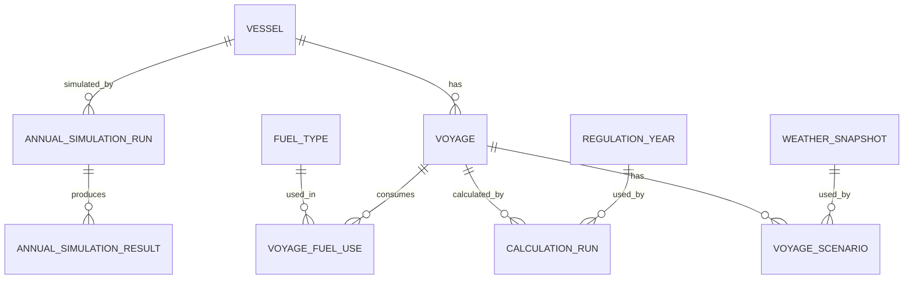
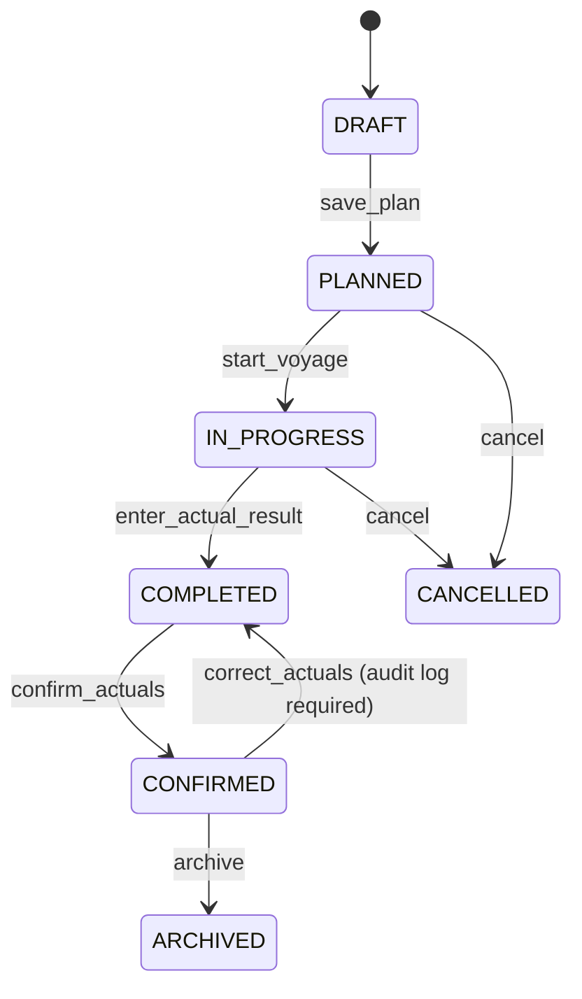
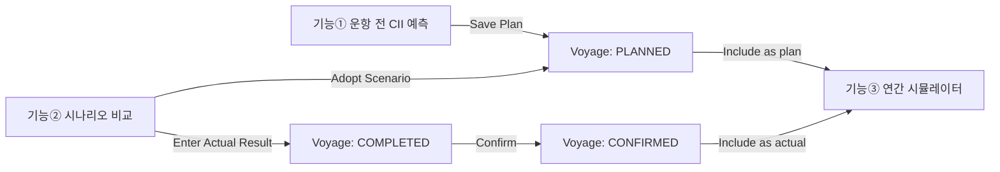

# PRD — 중소선사를 위한 탄소집약도(CII) 예측 및 운항 의사결정 보조 플랫폼

| 항목 | 내용 |
|---|---|
| 문서명 | 구현용 상세 PRD.md |
| 제품명 | 중소선사를 위한 CII 예측 및 운항 의사결정 보조 플랫폼 |
| 버전 | v4.3 Implementation PRD |
| 상태 | MVP 구현 기준 / **자체 ID/PW 인증 전환 (COR-10 · O-14)** / **관리 중심 전환 반영 (제16차 회의)** / 보고서 절 신설 (#360) / 계산식 스코프 원문 대조 완료 (#358) |
| 최종 수정일 | 2026-08-16 |
| MVP 개발 기간 | 2026.06 ~ 2026.10 |
| 대상 사용자 | 중소선사 **선주·경영진**, 육상 운항관리 담당자, 선장·항해사 |
| 문서 목적 | 개발자가 화면·계산·데이터 흐름·예외 처리·테스트 기준을 구현할 수 있도록 PRD v3.0을 상세화 |
| 후속 문서 | `TECH_SPEC.md`, `API_SPEC.md`, `DB_SCHEMA.md`, `TEST_PLAN.md` |

---

## 0. 문서 사용 규칙

### 0.1 요구사항 강도

본 문서의 요구사항 강도는 다음 기준을 따른다.

| 표현 | 의미 |
|---|---|
| MUST | MVP 구현에 필수이다. 미구현 시 MVP 성공 기준을 충족하지 못한다. |
| SHOULD | MVP에 포함하는 것을 원칙으로 하되, 일정상 조정 가능하다. |
| MAY | 선택 구현 또는 향후 확장이다. |
| OUT OF SCOPE | MVP에서 제외한다. |

### 0.2 문서 간 우선순위

1. 본 `PRD.md`
2. `TECH_SPEC.md`
3. `API_SPEC.md`
4. `DB_SCHEMA.md`
5. `TEST_PLAN.md`
6. 기존 기획서·회의록·화면 요구사항

단, IMO 규정·공식 계산식·규제 파라미터는 최신 IMO 문서 및 승인된 파라미터 파일이 우선한다.

### 0.3 구현 범위에 대한 기본 원칙

본 제품은 **규제 제출용 공식 계산 시스템이 아니라, 운항 의사결정을 보조하는 예측·시뮬레이션 도구**이다. 따라서 제품 내 모든 결과에는 다음 문구 또는 동등한 의미의 안내가 노출되어야 한다.

> 본 결과는 공개 데이터, 사용자 입력값, 추정 모델을 기반으로 한 참고용 예측값입니다. 규제 제출용 공식 CII 계산 결과가 아니며, 최종 운항 판단은 사용자에게 있습니다.

---

## 1. v2.0 대비 주요 수정 사항

기존 PRD에서 구현상 오해를 만들 수 있는 내용을 아래와 같이 수정한다.

| ID | 기존 표현 또는 위험 요소 | 수정 내용 | 적용 위치 |
|---|---|---|---|
| COR-1 | "항차별 CII"가 공식 IMO CII처럼 해석될 수 있음 | IMO CII 등급은 연간 단위가 공식 기준이다. 본 제품의 항차 단위 값은 `항차 CII 추정값` 또는 `항차 CII 기여도`로 표기한다. | 전체 |
| COR-2 | "현재 등급" 표현이 공식 확정 등급으로 오해될 수 있음 | 연중 화면에서는 `현재 누적 기준 예상 등급` 또는 `연말 예상 등급`으로 표기한다. | 기능①·③ |
| COR-3 | "한번 하락한 등급은 해당 연도 내 회복 불가능" | 공식 등급은 연말 운항 실적 기준으로 사후 산정된다. 연중에는 누적 실적이 나빠질수록 남은 항차로 목표 등급 회복이 어려워질 수 있다고 표현한다. | 문제 정의 |
| COR-4 | "Townsin 모델" 단독 표기 | 구현 명칭은 `Townsin–Kwon 계열 경험식 기반 기상 보정 어댑터`로 한다. 실제 수식·계수는 `TECH_SPEC.md`에서 확정한다. | 기능② |
| COR-5 | "실시간"으로 보일 수 있는 표현 | MVP는 AIS·IoT를 연동하지 않는다. 현재 위치·속도는 사용자 입력 또는 개발자도구 기반 수동 좌표 입력을 사용한다. | 기능② |
| COR-6 | IMO 감축계수 미확정 위험 | 2027~2030 Z-factor는 MEPC.400(83) 기준값을 기본 파라미터로 반영한다. 단, 코드 하드코딩 금지. | 계산 원칙 |
| COR-7 | AI 연료 예측의 범위 불명확 | AI 연료 예측은 MVP 핵심 경로에서 제외하고, 데이터가 준비된 경우 `실험 기능`으로만 제공한다. | O-1 |
| COR-8 | 기능①→③ 데이터 이관 방식 미정 | 항차 상태 모델과 `annual_inclusion_policy`를 정의하여 계획·진행·완료·확정 데이터를 연간 시뮬레이션에 반영한다. | 데이터 흐름 |
| **COR-9** | **서비스의 중심이 「예측」으로 서술되어 있음** | **제16차 회의 결정에 따라 예측 중심에서 관리 중심으로 전환한다.** 정보 구조를 **선대 → 선박 → 항차** 3계층으로 재편하고, 선대 대시보드를 서비스의 중심 화면으로 둔다. **예측 기능은 배제하지 않고 항차 계층 안에 남긴다.** | §2 · §5 · §6 · §21 |
| **COR-10** | **인증을 구글 OIDC에 위임하도록 서술되어 있음** | **2026-08-16 결정에 따라 구글 OIDC를 완전히 제거하고 자체 이메일·비밀번호 인증으로 전환한다.** 가입 시 이메일 인증과 비밀번호 재설정을 제공한다. 제품이 비밀번호를 보관하게 되므로 저장·전송·재설정 규칙을 명시한다. | §5 · §6 · §7.10 · §20 O-14 |

### 1.1 기능 번호 신구 매핑

기능 번호(①②③)는 **`created_from` enum 값**(`FEATURE_1` · `FEATURE_2_ADOPTED`)·테스트 ID·이슈 제목에 이미 박혀 있어 **재번호하지 않는다.** 아래 매핑으로 대응을 추적한다.

| 신방향 기능 | 종전 대응 | 상태 |
|---|---|---|
| 1. 대시보드 (선대 전체 관리 뷰) | — | **신설** |
| 2. 선박 상세 | — | **신설** |
| 3. 실시간 CII 산출 | 기능①(운항 전 항차 CII 추정) + 기능②(기상 반영) | **재정의 · 흡수** |
| 4. 연도별 운항 기록 관리 | Voyage CRUD + CSV 가져오기·내보내기 | **격상 · 확장** |
| 5. 보고서 | 내부 보고용 내보내기 + 기능②(사후 비교) | **격상 · 흡수** |
| 6. 기타 — 어드민 계정 | §20 O-13(인증 범위) | **부분 재개정** |
| (유지) 연간 CII 등급 시뮬레이터 | 기능③ | **선박 계층으로 이동** |

> **COR-5와의 관계** — COR-5는 「실시간」이라는 표현이 AIS·IoT 연동으로 오해되는 것을 막는 조항이다. 신방향의 「실시간 CII」는 **AIS 연동이 아니라 연초부터 현재까지의 누적값이 시간에 따라 변하는 것**을 뜻한다. 그 정의(3종 값 분리)와 데이터 확보 방식은 **§11.x 실시간 CII 절**에서 확정한다.

---

## 2. 제품 정의

### 2.1 제품 개요

본 서비스는 중소선사가 **보유 선박 전체의 CII 등급을 상시 관리**할 수 있도록 지원하는 웹 기반 플랫폼이다. 정보 구조는 **선대 → 선박 → 항차** 3계층이며, 상위 계층이 하위 계층을 품는다.

| 계층 | 화면 | 사용자가 얻는 것 |
|---|---|---|
| **선대** | 대시보드 | 보유 선박 전체의 현 등급·운항 상태·위치를 한 화면에서 조망하고, 위험 선박을 즉시 식별한다 |
| **선박** | 선박 상세 | 연도별 CII 이력, 올해 누적(YTD) 등급, 현재 위치·상태를 확인한다 |
| **항차** | 실시간 CII · 시나리오 | 항해 중 누적값 변화와 연말 예상 등급을 확인하고, 대안 시나리오를 같은 기준으로 비교한다 |

여기에 세 계층을 조합한 **보고서**(항차 완료 리포트 · 연간 실적 리포트)를 산출물로 제공한다.

> **예측을 배제하지 않는다.** 남은 거리 기반 연말 예상 등급과 기상 기반 구간 조정 권고는 그 자체가 예측이며, 항차 계층 안에 남는다. 바뀐 것은 **예측을 서비스의 중심에 두지 않는다**는 점이다.

본 서비스는 항로를 자동 결정하거나 선박을 자동 제어하지 않는다. 시스템은 선택지별 수치 비교를 제공하고, 최종 운항 판단은 사용자에게 둔다.

### 2.2 MVP 목표

MVP는 다음 사용자 과업을 **계층을 오르내리며** 수행할 수 있어야 한다.

```text
[선대]  대시보드 진입 — 보유 선박 전체 현황 · 위험 선박 경고
   │
   ├─ 위험 선박 선택
   ↓
[선박]  선박 상세 — 연도별 CII 이력 · 올해 누적(YTD) 등급 · 현재 위치·상태
   │
   ├─ 진행 중 항차 선택
   ↓
[항차]  실시간 CII — 항해 중 누적값 · 남은 거리 기반 연말 예상 등급
   │                 정박·묘박 지속 시 등급 하락 반영
   ├─ 대안 검토
   ↓
        시나리오 비교 — 직항·우회·감속을 같은 기준으로
   │
   ↓
[산출물] 보고서 — 항차 완료 리포트 · 연간 실적 리포트
```

### 2.3 제품 성공 정의

MVP 성공은 다음 네 가지가 통합 시연 가능한 상태로 정의한다.

| 성공 항목 | 정의 |
|---|---|
| **관제 가능성** | 보유 선박 전체의 현 등급·운항 상태를 한 화면에서 조망하고, 위험 선박을 식별한다. |
| 계산 가능성 | 선박·항차·연료·거리 입력으로 CII 추정값과 등급을 재현 가능하게 산출한다. |
| 관리 가능성 | 연초부터 현재까지의 누적 실적과 잔여 계획을 합산하여 연말 예상 등급과 목표 등급 달성 확률을 제공한다. |
| 보고 가능성 | 위 결과를 항차 단위·연간 단위 문서로 생성한다. |

> 종전의 **「비교 가능성」**(직항·우회·감속을 동일 기준으로 비교)은 성공 정의에서 빼지 않고 **관리 가능성의 하위 수단**으로 둔다. 시나리오 비교의 쓰임새가 「실행 지시」에서 「사후 설명·보고 근거」로 이동했기 때문이다(§11 · 제16차 회의).

### 2.4 비목표

다음은 MVP 범위에서 제외한다.

| 항목 | 제외 사유 |
|---|---|
| 규제 제출용 공식 CII 보고서 생성 | 인증기관 검증·G5 보정·공식 DCS 연계가 필요함 |
| 자동 최적항로 추천 | 의사결정 보조 원칙과 안전 책임 이슈 |
| AIS·IoT 자동 수집 | MVP 일정·선박별 장비 차이. **선박의 현재 위치·운항 상태는 사용자 입력 또는 시뮬레이션 시계로 확보한다**(COR-5) |
| 사용자 권한·조직 관리 고도화 | MVP 이후 확장 |
| 다국어 UI | 한국어 기본, 실무 영문 약어 병기만 허용 |

> **[COR-9] 「선대 통합 모니터링」 행을 삭제했다.** 제16차 회의에서 선대 대시보드를 서비스의 중심 화면으로 결정했으므로 더 이상 비목표가 아니다. 종전 AIS·IoT 2행은 **자동 수집**만 제외하는 것으로 합쳐 정리했다 — 위치·상태 데이터 자체는 MVP에 필요하다.

---

## 3. 규제·계산 기준 요약

### 3.1 공식 CII 적용 대상

MVP의 규정 파라미터는 IMO CII 체계를 기준으로 한다. CII는 일반적으로 MARPOL Annex VI Regulation 28 적용 대상인 5,000 GT 이상 선박을 기준으로 한다.

제품은 MVP에서 공식 제출용이 아니므로, 사용자가 5,000 GT 미만 선박을 입력하더라도 계산 자체는 `샘플/내부 분석용`으로 수행할 수 있다. 다만 화면에는 `공식 CII 적용 대상이 아닐 수 있음`을 표시해야 한다.

### 3.2 공식 CII와 제품 내 추정값의 구분

| 구분 | 공식 IMO CII | 본 제품 MVP |
|---|---|---|
| 기준 기간 | 1월 1일~12월 31일 연간 실적 | 항차 단위 추정, 누적 실적, 연말 예측 |
| 데이터 | 검증된 연료 사용량·거리 등 | 사용자 입력, 샘플 데이터, 공개 API, 추정 모델 |
| 용도 | 규제 준수·등급 산정 | 운항 의사결정 보조 |
| 산출물 | Attained annual operational CII, CII Rating | 예상 CII, 예상 등급, 위험도, 목표 달성 확률 |
| 제출 가능성 | 가능 | 불가 |

### 3.3 MVP 기본 계산식

> **[#358] 계산식 스코프 4종** — `§3.3.2`·`§3.3.3`의 식은 「어느 기간의, 어떤 범위의」 연료·거리인지를 적지 않으면 해석이 갈린다. 아래 4종을 이 절의 전제로 고정한다. 각 값의 근거는 해당 하위 절에 원문으로 인용한다.
>
> | # | 스코프 | 값 | 근거 |
> |---|---|---|---|
> | ⑴ | **기간** | 역년(calendar year) | `MEPC.352(78)` §4 · `COR-1` |
> | ⑵ | **연료 범위** | 선내에서 소비된 **모든** 연료 — not under way 연료 **포함** | `MEPC.352(78)` §4.1 |
> | ⑶ | **거리 범위** | **under way + not under way 거리 둘 다** | `MEPC.412(84)` §4.2 |
> | ⑷ | **거리 산출 방식** | 항구간 거리를 `Dt`의 **근사**로 사용 — 가정과 오차 방향을 §15.2에 명시 | 본 제품의 구현 결정 |
>
> **원문 대조 확인: 2026-08-15.** IMO 공식 서버의 결의안 PDF를 직접 대조했다(`MEPC.352(78)` = MEPC 78/17/Add.1 Annex 14 · `MEPC.412(84)` = MEPC 84/16/Add.2 Annex 14).

#### 3.3.1 Attained annual operational CII 형식

공식 CII의 기본 형태는 다음 구조를 따른다.

```text
attained_CII = M / W
```

| 기호 | 의미 | MVP 단위 |
|---|---|---|
| M | CO₂ 배출량 총량 | gCO₂ |
| W | Transport work 또는 transport work proxy | capacity × nautical mile |

#### 3.3.2 CO₂ 배출량

```text
M = Σ(FuelConsumed_j × 1,000,000 × CF_j)
```

| 항목 | 설명 |
|---|---|
| `FuelConsumed_j` | 연료 종류 j의 사용량, ton 기준 |
| `1,000,000` | ton fuel → gram fuel 변환 |
| `CF_j` | 연료 j의 fuel-to-CO₂ conversion factor, tCO₂/tFuel 또는 gCO₂/gFuel과 동일 비율 |

> **[#358] 기간과 연료 범위 — `M`은 「모든」 연료다.** `MEPC.352(78) §4.1` 원문:
>
> *"The total mass of CO₂ is the sum of CO₂ emissions (in grams) from **all the fuel oil consumed on board a ship in a given calendar year** … `FC_j` is the total mass (in grams) of consumed fuel oil of type `j` in the calendar year, **as reported under IMO DCS**"*
>
> - **기간**은 역년이다(⑴).
> - **항해 여부를 가리지 않는다**(⑵). 정박·묘박·표류·STS·운하 통과·드라이독 구간에서 태운 연료가 모두 `M`에 들어간다. 이 구간의 기록 위치는 `DB_SCHEMA §2.18 not_underway_fuel_use`다.
> - 따라서 **정박이 길어질수록 `M`만 늘고 `W`는 늘지 않아 등급이 나빠진다.** 이는 본 제품이 만든 규칙이 아니라 규제 계산식의 원래 동작이며, `MEPC 82/6/31`(ICS·라이베리아)이 현행 제도를 그렇게 서술한다 — *"emissions continue to accumulate without corresponding transport work … penalised under the current system"*.
>
> **원문 대조 확인: 2026-08-15.**

#### 3.3.3 Transport work proxy

```text
W = transport_capacity × Distance_nm
```

| 선박 유형 | Capacity 기준 | 지표명 | 표시 단위 |
|---|---|---|---|
| Bulk carrier, Tanker, Container ship, Gas carrier, LNG carrier, General cargo ship, Refrigerated cargo carrier, Combination carrier **(8종)** | DWT | `AER` | `gCO₂/(DWT·nm)` |
| Cruise passenger ship, Ro-ro cargo ship (vehicle carrier), Ro-ro cargo ship, Ro-ro passenger ship **(4종)** | GT | `cgDIST` | `gCO₂/(GT·nm)` |

> **[#163] 지표명은 capacity 축에서 파생된다.** `MEPC.352(78) §2.5` — *"The supply-based CII which uses **DWT** as the capacity is referred to as **AER**, and the supply-based CII which uses **GT** as the capacity is referred to as **cgDIST**."* 이 절은 개정되지 않았다. capacity 축 목록(DWT 8종 · GT 4종)의 근거는 개정 `§4.2`이며, 개정 전후로 축은 바뀌지 않았다.
>
> **`RO_RO_PASSENGER_HSC`(고속 여객선)는 GT 축이다.** `§4.2`가 고속선을 따로 열거하지 않는 것은 `G2 Table 1`이 이를 `Ro-ro passenger ship`의 하위 행으로 두기 때문이며(`#126`), 상위 선종의 축을 그대로 따른다. 따라서 **`ship_type` 13종 전부가 두 축 중 정확히 하나에 속한다.**
>
> **표기 규칙** — 선종이 정해지지 않은 **일반 계산식**에서는 `gCO₂/capacity·nm`으로 쓰고, **사용자에게 표시할 때**는 위 표에 따라 `gCO₂/(DWT·nm)` 또는 `gCO₂/(GT·nm)`로 파생시킨다. **단위 문자열을 화면에 고정값으로 박지 않는다** — 선종이 늘어날 때 GT 축 선박에 DWT 표기가 조용히 표시된다. 분모를 괄호로 묶는 것은 `DWT × nm` 전체가 분모임을 드러내기 위해서다(괄호가 없으면 `gCO₂/DWT`에 `nm`을 곱한 것으로 읽힌다).
>
> **원문 대조 확인: 신하늘(`sky01170851`), 2026-08-06.** `§2.5`(MEPC 78/17/Add.1 Annex 14, 3쪽) · 개정 `§4.2`(같은 Annex 14, 5쪽)를 IMO 원문과 직접 대조해 확인했다.

> 주의: Container ship의 capacity 처리는 CII G1/G2 기준을 우선한다. EEDI와 혼동하지 않도록 `RegulationParameter.capacity_rule`에 명시한다.
> 
> **[EXT-P0-1]** IMO G1(MEPC.352(78), as amended by MEPC.412(84))과 G2(MEPC.353(78))은 **서로 다른 capacity 개녁**을 사용한다.
> - **G1 (attained CII)**: `transport_capacity` = 선박의 **실제** DWT 또는 GT. 예: 300,000 DWT 벌크캐리어 → `W = 300,000 × Distance_nm`
> - **G2 (reference CII)**: `reference_capacity` = G2 표의 capacity rule에 따른 값. `fixed X`인 경우 X를 사용. 예: 300,000 DWT 벌크캐리어 → `CII_ref = 4745 × 279,000^(-0.622)`
>
> 이전 ORACLE-C-2 수정(fixed capacity를 W에도 적용)은 **잘못된 것으로 확인되어 취소**한다. IMO G1은 transport work proxy에 항상 실제 capacity를 사용하며, G2의 fixed capacity 값은 reference line 공식에만 적용된다.
>
> **이중 capacity 해결 규칙:**
> 1. `transport_capacity = resolve_transport_capacity(vessel)` — 항상 실제 DWT 또는 GT
> 2. `reference_capacity = resolve_reference_capacity(vessel, reference_line)` — G2 표의 capacity_rule에 따름
> 3. `condition_expr`(예: `DWT ≥ 279,000`)는 선박의 실제 DWT/GT로 평가하여 어느 파라미터 행을 선택할지 결정
>
> **오차 영향**: fixed capacity를 W에 잘못 적용하면 300,000 DWT 벌크캐리어의 attained CII가 +7.5% 과대 산정되며, 50,000 DWT LNG 캐리어의 경우 −23.1% 과소 산정(위험: 실제보다 양호해 보임)된다.

> **[#358] 거리 범위 — `Dt`는 under way와 not under way를 모두 포함한다.** `MEPC.412(84) §4.2` 원문(G1 `§4.2`를 **통째로 교체**, 2026-05-01 채택):
>
> *"The supply-based transport work (Ws) is defined as the product of a ship's capacity and the total distance travelled **(both under way and not under way)** in a given calendar year, as follows: `Ws = C × Dt` … `Dt` represents the total distance travelled (in nautical miles), **as reported under IMO DCS**."*
>
> ⚠️ **구판 `MEPC.352(78)` `§4.2`에는 이 한정어가 없다** — 원문은 *"the distance travelled in a given calendar year"* 뿐이고 범위를 IMO DCS 정의로 위임한다. **한정어가 없어 「under way 거리만」으로 읽었던 것이 본 제품의 종전 전제였고, 개정본 대조로 정정했다.** 이 문구의 출처를 `MEPC.352(78)`로 적으면 오기가 된다.
>
> **무엇이 분모에 더해지는가.** 대부분의 not under way 구간은 이동이 없어 `0`이다.
>
> | 구간 유형 | 이동 거리 | 분모 기여 |
> |---|---|---|
> | 접안(`IN_PORT`) · 묘박(`AT_ANCHOR`) · 드라이독(`DRYDOCK`) | ≈ 0 | 없음 |
> | **운하 통과(`CANAL_TRANSIT`)** | 수에즈 약 104 nm · 파나마 약 44 nm | **있음** |
> | **표류·예인(`DRIFTING`)** · **STS(`STS`)** | 상황에 따라 발생 | 있음 |
>
> **그래서 「정박 지속 시 등급 하락」은 그대로 성립한다** — 접안·묘박은 `M`만 늘리고 `Dt`에는 기여하지 않기 때문이다. 분모를 실제로 늘리는 것은 이동이 있는 구간뿐이다.
>
> **누락 시 오차 방향**: not under way 이동 거리를 분모에서 빼면 `W`가 과소해져 `CII = M/W`가 **과대**해지고 **등급이 실제보다 나쁘게** 표시된다. 규제 대응에서 과잉 경보 방향이다. 기록 위치는 `DB_SCHEMA §2.17 not_underway_period.distance_nm`이다.
>
> **원문 대조 확인: 2026-08-15.**

#### 3.3.4 Reference CII

```text
CII_ref = a × Capacity^(-c)
```

`a`, `c`는 선종별 reference line 파라미터이며 코드에 하드코딩하지 않는다.

#### 3.3.5 Required CII

```text
required_CII(year) = CII_ref × (1 - Z_year / 100)
```

#### 3.3.6 Rating boundary

```text
superior_boundary = required_CII × d1
lower_boundary    = required_CII × d2
upper_boundary    = required_CII × d3
inferior_boundary = required_CII × d4
```

등급 판정은 낮은 CII가 더 우수하다는 전제에서 다음 순서로 수행한다.

```text
if attained_CII <= superior_boundary: A
else if attained_CII <= lower_boundary: B
else if attained_CII <= upper_boundary: C
else if attained_CII <= inferior_boundary: D
else: E
```

경계값과 정확히 같은 경우에는 더 우수한 등급으로 판정한다. 예: `attained_CII == lower_boundary`이면 B.

#### 3.3.7 등급 하락의 규제상 귀결

> **원문 대조 확인: 신하늘(`sky01170851`), 2026-08-15.** 아래 표의 근거 조문은 MARPOL Annex VI(2021 개정, `MEPC.328(76)`) 인쇄면 14~15쪽(Reg 6.8)·42쪽(Reg 26.3)·44~45쪽(Reg 28)과 `MEPC.395(82)` 인쇄면 22쪽(§9.4)·26쪽(§15)에서 IMO 원문 PDF와 직접 대조했다. 개정 `MEPC.401(83)`·`MEPC.413(84)`은 SEEMP Part II(데이터 수집) 개정이며 본 절의 귀결 체계는 바꾸지 않는다(전문 확인).

**D등급 3년 연속 또는 E등급 1년의 귀결은 운항 제한이 아니라 시정조치계획(corrective action plan) 의무다.**

| 항목 | 내용 | 원문 근거 |
|---|---|---|
| 트리거 | D등급 **3년 연속** 또는 E등급 **1년** | Reg 28.7 |
| 의무 1 | 시정조치계획 수립 — SEEMP **Part III**에 반영 | Reg 28.7·26.3.2, `MEPC.395(82)` §9.4 |
| 의무 2 | 수정 SEEMP을 행정기관(또는 승인기관)에 제출·검증 — attained CII 보고 후 **1개월 이내** | Reg 28.8 |
| 의무 3 | 계획된 시정조치 이행 | Reg 28.9 |
| 미이행의 귀결 | **Statement of Compliance 미발급** | Reg 6.8 |
| 시정조치계획의 목표 | 채택 다음 연도에 **최소 C등급** 회복, 궁극적으로 required CII 달성 | `MEPC.395(82)` §15.4.1 |

> **운항 제한·억류·거래 금지 조항은 확인 범위(Reg 6·26·28, 2024 SEEMP 가이드라인 및 개정 2건)에 존재하지 않는다.** 실질적 압박은 SoC 미발급과 용선주·금융기관·PSC 등 **상업적 경로**로 온다. 본 제품은 이 경계를 그대로 반영한다 — 규제상 귀결을 과장해 표현하지 않는다. 반대로 A·B 등급에 대한 인센티브 권고(Reg 28.10)도 제품 범위 밖 배경 지식으로만 기록한다.

**경고 배너 판정 기준(위험 선박 정의)** — 대시보드 경고 배너는 아래 둘 중 하나에 해당하는 선박을 **위험 선박**으로 센다. 기준은 **연간 누적(YTD) 등급**이다(연말 예상 등급 기준 판정은 Monte Carlo 종속이라 후속 이슈로 연기한다).

1. 올해 YTD 등급이 **E**
2. 직전 2개 규제연도의 확정 등급이 연속 **D**이고, 올해 YTD 등급도 **D** (3년 연속 D 진행)

> YTD 등급은 연중 누적 예측값으로 **공식 등급이 아니다** — 공식 등급은 연말 DCS 보고·검증 후 확정된다. 배너는 사전 경고다. 문구 원문은 §6.3.

#### 3.3.8 「실시간 CII」 — 화면이 표시하는 3종 값 (#358)

**규제상 「실시간 CII」라는 개념은 없다.** `§3.3.2`·`§3.3.3`이 확정하듯 `M`과 `Dt`는 **역년 단위 누계**이므로, attained CII는 연말에야 확정된다(`COR-1`). 따라서 항해 중 화면이 표시하는 값은 「실시간으로 계산되는 공식 CII」가 아니라 **연초부터 조회 시점까지의 누적값과 그로부터의 전망**이다.

화면은 아래 3종을 구분해 표시한다. **등급이 붙는 값은 ⑴ 하나뿐이다.**

| # | 값 | 정의 | 등급 표시 | 화면 표기 |
|---|---|---|---|---|
| ⑴ | **연간 누적 (YTD)** | 연초 ~ 조회 시점의 `M`·`Dt` 누계로 산출한 attained CII | **가능** — `현재 누적 기준 예상 등급` (`COR-2`) | 주 표시값 |
| ⑵ | **항차 구간값** | 특정 항차 구간만의 `M`/`W` | **불가** | `항차 CII 기여도` (`COR-1`) |
| ⑶ | **연말 예상** | ⑴에 남은 기간의 예상 운항을 더해 외삽한 값 | **가능** — `연말 예상 등급` (`COR-2`) | 보조 표시값 |

**⑴ 연간 누적(YTD)의 산출식**

```text
YTD_M  = Σ(항해 중 연료_j × 1,000,000 × CF_j)            ← voyage_fuel_use
       + Σ(not under way 연료_j × 1,000,000 × CF_j)      ← not_underway_fuel_use

YTD_Dt = Σ(항해 거리) + Σ(not under way 이동 거리)        ← §3.3.3 ⑶

YTD_attained_CII = YTD_M / (transport_capacity × YTD_Dt)
```

`§3.3.1`~`§3.3.3`의 식을 그대로 쓰되 **집계 구간을 「연초 ~ 조회 시점」으로 좁힌 것**이다. 새로운 계산식이 아니다.

**집계에 넣는 항차의 범위**는 `§8.1.2` 매트릭스의 판정 결과인 `annual_inclusion_policy`를 따른다.

| `annual_inclusion_policy` | YTD 처리 |
|---|---|
| `INCLUDE_AS_ACTUAL` | **집계에 넣는다** (실적) |
| `INCLUDE_AS_PLAN` | **계획 전량을 넣지 않는다** — 아래 참조 |
| `EXCLUDE` | 넣지 않는다 |

> **`INCLUDE_AS_PLAN`(진행 중 항차)의 계획 전량을 넣지 않는 이유.** 12월에 끝날 예정인 항차의 계획 연료를 1월 조회에 전부 더하면 **아직 발생하지 않은 배출을 이미 발생한 것으로** 계산하게 되어 「누적값」의 정의가 깨진다. `§8.3` 값 우선순위가 진행 중 항차에 요구하는 것도 계획 전량이 아니라 `IN_PROGRESS latest estimate`이며, 그 estimate는 경과 시간으로부터 산출한다.

**⑶ 연말 예상의 성격**

⑶은 남은 기간의 운항 가정에 의존하므로 **가정이 바뀌면 값이 바뀐다.** 화면은 ⑴과 ⑶을 나란히 두되 ⑶에 사용한 가정(잔여 항해일·평균 소비율 등)을 함께 표시한다. ⑶만 단독으로 크게 표시하지 않는다 — 확정값처럼 읽힌다.

**시각 의존과 재현성**

⑴·⑶은 조회 시각에 따라 값이 달라진다. 재현성 계약(`TECH_SPEC §5.4`)을 지키기 위해 **시각을 명시적 입력(`as_of`)으로 승격**시키고, 시각으로부터 누적량을 만드는 계층과 계산 코어를 분리한다 — **계산 코어는 시각을 모른다.** 상세 계약은 `TECH_SPEC`이 정의한다.

> **MVP 범위 표기 의무 (`COR-5`).** MVP는 AIS·IoT를 연동하지 않으므로 ⑴의 진행 중 항차분과 ⑶은 **입력값과 서버 시각에서 파생된 값**이다. 해당 화면에는 `시뮬레이션 데이터` 배지를 표시한다.


### 3.4 기본 규정 파라미터

#### 3.4.1 CII reduction factor, Z%

다음 값은 MVP 초기 파라미터 seed로 사용한다. 실제 운영 시에는 관리자 또는 배포 스크립트를 통해 갱신 가능해야 한다.

| Year | Z factor relative to 2019 |
|---:|---:|
| 2023 | 5.000% |
| 2024 | 7.000% |
| 2025 | 9.000% |
| 2026 | 11.000% |
| 2027 | 13.625% |
| 2028 | 16.250% |
| 2029 | 18.875% |
| 2030 | 21.500% |

#### 3.4.2 Fuel CF 기본값

| Fuel code | 표시명 | CF, tCO₂/tFuel | MVP 사용 |
|---|---|---:|---|
| DIESEL_GAS_OIL | Diesel/Gas Oil | 3.206 | MUST |
| LFO | Light Fuel Oil | 3.151 | SHOULD |
| HFO | Heavy Fuel Oil | 3.114 | MUST |
| LPG_PROPANE | LPG Propane | 3.000 | MAY |
| LPG_BUTANE | LPG Butane | 3.030 | MAY |
| LNG | Liquefied Natural Gas | 2.750 | SHOULD |
| METHANOL | Methanol | 1.375 | MAY |
| ETHANOL | Ethanol | 1.913 | MAY |
| OTHER | 사용자 정의 연료 | 사용자 입력 | SHOULD |

`OTHER` 연료는 CF 출처 메모와 적용 시작일을 필수로 입력해야 한다.

#### 3.4.3 Ship type reference line 파라미터

MVP는 모든 CII 대상 선종을 파라미터 테이블로 저장할 수 있어야 한다. 단, QA fixture와 데모 검증은 `Bulk carrier`, `Tanker`, `Container ship`, `General cargo ship`을 우선한다.

| Ship type | 조건 | Capacity rule | a | c | MVP 우선순위 |
|---|---|---|---:|---:|---|
| BULK_CARRIER | DWT ≥ 279,000 | fixed 279000 | 4745 | 0.622 | P1 |
| BULK_CARRIER | DWT < 279,000 | DWT | 4745 | 0.622 | P1 |
| GAS_CARRIER | DWT ≥ 65,000 | DWT | 14405E7 | 2.071 | P2 |
| GAS_CARRIER | DWT < 65,000 | DWT | 8104 | 0.639 | P2 |
| TANKER | all | DWT | 5247 | 0.610 | P1 |
| CONTAINER_SHIP | all | DWT | 1984 | 0.489 | P1 |
| GENERAL_CARGO_SHIP | DWT ≥ 20,000 | DWT | 31948 | 0.792 | P1 |
| GENERAL_CARGO_SHIP | DWT < 20,000 | DWT | 588 | 0.3885 | P1 |
| REFRIGERATED_CARGO_CARRIER | all | DWT | 4600 | 0.557 | P2 |
| COMBINATION_CARRIER | all | DWT | 5119 | 0.622 | P2 |
| LNG_CARRIER | DWT ≥ 100,000 | DWT | 9.827 | 0.000 | P2 |
| LNG_CARRIER | 65,000 ≤ DWT < 100,000 | DWT | 14479E10 | 2.673 | P2 |
| LNG_CARRIER | DWT < 65,000 | fixed 65000 | 14779E10 | 2.673 | P2 |
| RO_RO_CARGO_VEHICLE | GT ≥ 57,700 | fixed 57700 | 3627 | 0.590 | P3 |
| RO_RO_CARGO_VEHICLE | 30,000 ≤ GT < 57,700 | GT | 3627 | 0.590 | P3 |
| RO_RO_CARGO_VEHICLE | GT < 30,000 | GT | 330 | 0.329 | P3 |
| RO_RO_CARGO | all | GT | 1967 | 0.485 | P3 |
| RO_RO_PASSENGER | Ro-ro passenger ship | GT | 2023 | 0.460 | P3 |
| RO_RO_PASSENGER_HSC | SOLAS Chapter X HSC | GT | 4196 | 0.460 | P3 |
| CRUISE_PASSENGER | all | GT | 930 | 0.383 | P3 |

> 구현 주의: `14405E7`, `14479E10`, `14779E10`은 IMO 표 원문 표기다. DB 저장 시에는 문자열 원문값과 Decimal 변환값을 모두 저장한다. 예: `14405E7` → `14405 × 10^7`.

> **[#148] `Capacity rule`의 `fixed N`은 이 표(G2 reference line) 전용이다.** 벌크 279,000 · LNG 65,000 · ro-ro 차량운반선 57,700 **3건뿐**이며, **attained CII의 분모에는 적용되지 않는다** — 그쪽은 항상 선박의 실제 DWT/GT를 쓴다(§3.3.3 `[EXT-P0-1]`). 축은 두 계산이 같지만 **값은 다르다.**
>
> 이 구분을 놓치면 300,000 DWT 벌크캐리어의 attained CII가 **+7.5% 과대**, 50,000 DWT LNG 캐리어가 **−23.1% 과소**(실제보다 양호해 보임) 산정된다. 실제로 한 번 그렇게 수정됐다가 되돌린 이력이 `[EXT-P0-1]`에 남아 있다. 구현에서 `resolve_transport_capacity()`와 `resolve_reference_capacity()`를 나눈 이유가 이것이다(`TECH_SPEC §1.2.4`). **원문 대조 확인: sky01170851 (2026-07-30)** — G1 `§4.2`(`MEPC 78/17/Add.1` Annex 14, 5쪽)와 G2 Table 1(같은 문서 Annex 15, 4쪽)의 축 일치를 확인한 회신에 근거한다.

#### 3.4.4 d-vector rating boundary 파라미터

| Ship type | 조건 | capacity basis | d1 | d2 | d3 | d4 |
|---|---|---|---:|---:|---:|---:|
| BULK_CARRIER | all | DWT | 0.86 | 0.94 | 1.06 | 1.18 |
| GAS_CARRIER | DWT ≥ 65,000 | DWT | 0.81 | 0.91 | 1.12 | 1.44 |
| GAS_CARRIER | DWT < 65,000 | DWT | 0.85 | 0.95 | 1.06 | 1.25 |
| TANKER | all | DWT | 0.82 | 0.93 | 1.08 | 1.28 |
| CONTAINER_SHIP | all | DWT | 0.83 | 0.94 | 1.07 | 1.19 |
| GENERAL_CARGO_SHIP | all | DWT | 0.83 | 0.94 | 1.06 | 1.19 |
| REFRIGERATED_CARGO_CARRIER | all | DWT | 0.78 | 0.91 | 1.07 | 1.20 |
| COMBINATION_CARRIER | all | DWT | 0.87 | 0.96 | 1.06 | 1.14 |
| LNG_CARRIER | DWT ≥ 100,000 | DWT | 0.89 | 0.98 | 1.06 | 1.13 |
| LNG_CARRIER | DWT < 100,000 | DWT | 0.78 | 0.92 | 1.10 | 1.37 |
| RO_RO_CARGO_VEHICLE | all | GT | 0.86 | 0.94 | 1.06 | 1.16 |
| RO_RO_CARGO | all | GT | 0.76 | 0.89 | 1.08 | 1.27 |
| RO_RO_PASSENGER | all | GT | 0.76 | 0.92 | 1.14 | 1.30 |
| CRUISE_PASSENGER | all | GT | 0.87 | 0.95 | 1.06 | 1.16 |

> **[#126] `RO_RO_PASSENGER_HSC`는 위 표에 행이 없다. 이는 전사 누락이 아니라 원문대로다.** MEPC.354(78) Table 1에 해당 행이 존재하지 않으며, 다른 조항에도 별도 규정이 없다.
>
> **HSC의 등급 경계는 `RO_RO_PASSENGER` 행(0.76 · 0.92 · 1.14 · 1.30)을 적용한다.**
>
> **1. 인지된 부재다.** MEPC.353(78) Table 1은 `Ro-ro passenger ship`을 상위 분류로 두고, 그 아래 `Ro-ro passenger ship`(a=2023)과 `High-speed craft designed to SOLAS chapter X`(a=4196)를 병합 셀로 묶는다. IMO는 HSC를 인지하고 **별도 `a` 값까지 부여**한 상태에서 G4에 행을 만들지 않았다. HSC는 독립 선종이 아니라 Ro-ro passenger ship의 하위 구분이다.
>
> **2. (정황) G2는 두 하위 구분을 같은 capacity 지수로 적합했다.** `c`가 0.460으로 같아 `CII_ref` 비율이 `4196 / 2023 = 2.074147`로 capacity와 무관하게 일정하다. 기준선 적합 단계에서 두 하위 구분을 하나의 모집단으로 다뤘다는 뜻이다.
>
> **3. (정황) G4는 세분이 필요한 선종에 하위 행을 쓴다.** MEPC.354(78) Table 1은 `Gas carrier`(65,000 DWT 기준)와 `LNG carrier`(100,000 DWT 기준)를 용량 구간으로 나누면서 `Ro-ro passenger ship`은 나누지 않았다.
>
> 따라서 `cii_rating_boundary`에는 **행을 추가하지 않는다.** 원문에 없는 값을 규제값 표에 넣으면 `source_ref`가 거짓이 된다(§3.2 각주의 "값이 인쇄된 문서" 기준). 선종 매핑은 등급 판정 구현(#39)에서 처리한다.
>
> **원문 대조 확인: sky01170851.**

---

## 4. 사용자 및 주요 과업

### 4.1 페르소나 1 — 선장·항해사

| 항목 | 내용 |
|---|---|
| 사용 맥락 | 운항 전 계획 수립, 운항 중 대안 비교 |
| 기기 | 선상 PC·태블릿, 데스크톱 우선 |
| 주요 Pain Point | 기상·속도·우회가 연료와 CII에 미치는 영향을 즉시 비교하기 어렵다. |
| 핵심 과업 | 항차 CII 추정, 직항·우회·감속 비교, 시나리오 결과 확인 |
| 금지 기대 | 시스템이 최적 항로를 자동 선택하거나 운항 명령을 내리는 것 |

### 4.2 페르소나 2 — 육상 운항관리 담당자

| 항목 | 내용 |
|---|---|
| 사용 맥락 | 선박별 연간 CII 등급 관리, 남은 항차 계획 조정 |
| 기기 | 데스크톱 웹 |
| 주요 Pain Point | 현재 추세로 연말 등급이 어떻게 될지 사전에 보기 어렵다. |
| 핵심 과업 | 누적 실적 확인, 잔여 계획 입력, 연말 예상 등급·목표 달성 확률 확인 |
| 금지 기대 | 공식 DCS 보고서 제출 또는 인증기관 검증 대체 |

### 4.3 보조 이해관계자 — 경영진

| 항목 | 내용 |
|---|---|
| 사용 맥락 | 운항 전략·감속 운항·연료 전환·선박 교체 검토 |
| 핵심 과업 | 목표 등급 달성 가능성, 위험 선박, 개선 시나리오 효과 확인 |
| MVP 접근 | 별도 권한 관리는 MVP 제외. 동일 관리자 화면에서 확인 가능. |

---

## 5. MVP 범위

### 5.1 포함 범위

| 계층 | 모듈 | 기능 | MVP 포함 |
|---|---|---|---|
| **선대** | 대시보드 | 보유 선박 전체 현황(현 등급·운항 상태·위치) 조망 | **MUST** |
| **선대** | 경고 배너 | 위험 선박 식별·집계 — 판정 기준과 문구는 §6.3 · §9.4 | **MUST** |
| **선박** | 선박 상세 | 연도별 CII 이력 · 올해 누적(YTD) 등급 · 현재 위치·상태 | **MUST** |
| **선박** | 기능③ | 연간 CII 등급 시뮬레이터 | MUST |
| **항차** | 기능③ 실시간 CII | 항해 중 누적값 · 남은 거리 기반 연말 예상 등급 · 정박 지속 시 등급 하락 반영 | **MUST** |
| **항차** | 기능① | 운항 전 항차 CII 추정 — 실시간 산출의 계획 단계 | MUST |
| **항차** | 기능② | 직항·우회·감속 시나리오 비교 — 보고서의 사후 설명 근거 | MUST |
| **항차** | 운항 기록 | 연도별 항차 이력 축적 (CSV 가져오기·내보내기) | MUST |
| **산출물** | 보고서 | 항차 완료 리포트 · 연간 실적 리포트 | **MUST** |
| 공통 | 선박 관리 | 선박 등록, 샘플 선박 선택, 제원 수동 입력 | MUST |
| 공통 | 규정 파라미터 | 연도별 Z-factor, 선종별 reference line, d-vector, 연료 CF 관리 | MUST |
| 공통 | 데이터 흐름 | 기능① 계획 저장 → 기능③ 반영 | MUST |
| 공통 | 데이터 흐름 | 기능② 시나리오 채택 → 계획 또는 실적 반영 | SHOULD |
| 공통 | 오류 처리 | 외부 API 장애, 필수 입력 누락, 계산 불가 안내 | MUST |
| 공통 | 테스트 | 계산 fixture, 경계값 테스트, seed 재현성 테스트 | MUST |
| 공통 | 사용자 인증 | 이메일·비밀번호 회원가입·로그인, 세션 관리 | MUST |
| 공통 | 이메일 인증 | 가입 시 확인 메일 발송·토큰 검증 | MUST |
| 공통 | 비밀번호 재설정 | 재설정 메일 발송·토큰 검증·비밀번호 교체 | MUST |
| 실험 | AI 연료 예측 | 실험 기능 | MAY |
| 실험 | LLM 챗봇 (O-12) | 핵심 경로 제외, 실험 기능으로만 허용 — §20 O-12 · §16.3 참조 | MAY |

> **[COR-9] 변경점** — ⑴ 계층 열을 신설해 각 기능이 어느 계층에 속하는지 드러냈다. ⑵ **대시보드·경고 배너·선박 상세·실시간 CII·보고서 5행을 신설**했다. ⑶ 종전 「내보내기 CSV 다운로드 SHOULD」는 **「운항 기록」 MUST로 승격**했다 — 연도별 이력 축적이 신방향 기능 4의 본체이고, 보고서의 CSV 출력 경로이기도 하다.

### 5.2 제외 범위

| 항목 | MVP 제외 여부 | 설명 |
|---|---|---|
| 공식 규제 제출 | OUT OF SCOPE | 인증기관 검증과 공식 DCS 연계 필요 |
| G5 correction factor/voyage adjustment 전체 지원 | OUT OF SCOPE | MVP는 기본 AER/CII 구조 중심. 향후 확장. |
| 자동 최적항로 추천 | OUT OF SCOPE | 비교 정보만 제공 |
| AIS 자동 위치 수집 | OUT OF SCOPE | **위치·운항 상태 데이터 자체는 MVP에 포함된다.** 자동 수집만 제외하며, 확보 방식은 사용자 입력 또는 시뮬레이션 시계다 |
| IoT/엔진 센서 연동 | OUT OF SCOPE | 사용자 입력·샘플 데이터 기반 |
| 지도 기반 항로 렌더링 | OUT OF SCOPE | 타일 서비스·API 키·비용·오프라인 시연 가능 여부가 미결. 실시간 화면은 지도 없이 성립한다 |
| 권한 관리 고도화 | OUT OF SCOPE | 단일 조직·단일 역할 가정 |
| 사용자별 데이터 격리 | OUT OF SCOPE | 로그인 사용자는 동일한 선박·항차 데이터를 공유한다. 소유권 컬럼을 두지 않는다 |

---

## 6. 정보 구조 및 화면 구성

### 6.1 네비게이션

MVP 웹 앱은 **계층 구조**를 따른다. 종전의 평면 메뉴 나열을 대체한다.

```text
[선대]  대시보드                        ← 기본 진입 경로
   │
   └─[선박]  선박 상세
        │       ├ 연도별 CII 이력
        │       ├ 올해 누적(YTD) 등급
        │       └ 현재 위치·운항 상태
        │
        └─[항차]  실시간 CII
             │       ├ 시나리오 비교
             │       └ 항차 완료 리포트
             │
             └ 연간 실적 리포트

(계층 밖)  선박 등록 · 파라미터 조회 · 데이터 가져오기·내보내기
```

**로그인 직후 진입 경로는 대시보드다.** 등록된 선박이 없으면 선박 등록으로 유도한다(`UIFLOW §1-1`).

### 6.2 화면 목록

| Screen ID | 계층 | 화면명 | 사용자 | 목적 |
|---|---|---|---|---|
| **SCR-001** | **선대** | Fleet Dashboard | 선주·경영진·운항관리자 | **보유 선박 전체 현황 조망 · 위험 선박 경고** |
| **SCR-008** | **선박** | Vessel Detail | 전체 | **연도별 CII 이력 · 올해 누적(YTD) · 현재 위치·상태** |
| **SCR-009** | **항차** | Realtime CII | 선장·항해사·운항관리자 | **항해 중 누적값 · 연말 예상 등급 · 정박 반영** |
| SCR-003 | 항차 | Voyage CII Estimator | 선장·항해사·운항관리자 | 운항 전 항차 CII 추정 (실시간 산출의 계획 단계) |
| SCR-004 | 항차 | Scenario Comparison | 선장·항해사 | 직항·우회·감속 비교 (보고서의 사후 설명 근거) |
| SCR-005 | 선박 | Annual CII Simulator | 운항관리자·경영진 | 연말 등급 예측·목표 달성 확률 확인 |
| **SCR-010** | **산출물** | Reports | 전체 | **항차 완료 리포트 · 연간 실적 리포트 생성·내보내기** |
| **SCR-011** | **계층 밖** | Authentication | 전체 | **회원가입 · 로그인 · 비밀번호 찾기 · 이메일 인증** |
| SCR-002 | 계층 밖 | Vessel Management | 운항관리자 | 선박 등록·수정·샘플 선택 |
| SCR-006 | 계층 밖 | Parameter Management | 관리자 | 규정·연료·모델 파라미터 조회·수정 |
| SCR-007 | 계층 밖 | Data Import/Export | 운항관리자 | 샘플/CSV 데이터 입력·출력 |

> **이 표는 기능 요구사항의 화면 정의 목록이며, 화면 구조의 정본은 아니다.** 화면 목록·계층·흐름·진입 조건은 `UIFLOW.md` §1·§2가 소유한다(`AGENTS §3.2.1`). `UIFLOW`의 3계층 재작성은 본 절 확정 이후에 진행한다(`AGENTS §3.2.3` — MVP 범위 포함 여부는 `PRD §5` 소관).
>
> **[COR-9] 종전 각주의 범위 판정을 뒤집는다.** 종전에는 *"UIFLOW §2의 2-4(선대 모니터링)·2-6(설정)은 MVP 범위 밖"* 이라고 적었으나, **2-4 선대 모니터링은 SCR-001로 MVP 중심에 들어온다.** 2-6 설정은 어드민 범위 확정(§20 O-13 재개정) 결과에 따른다. 이 판정을 내린 근거였던 `§2.4`·`§5.2`의 「선대 통합 모니터링」 행은 본 개정에서 삭제됐다.
>
> **SCR ID는 재번호하지 않는다.** 신설 화면은 `SCR-008` 이후를 쓰고, 종전 `SCR-001 Dashboard`는 성격이 「선택 선박 요약」에서 「선대 전체 조망」으로 바뀌었으므로 **같은 ID를 유지하되 목적을 재정의**했다.

### 6.3 공통 UX 문구

| 상황 | 표시 문구 |
|---|---|
| 모든 결과 화면 | `참고용 예측값입니다. 규제 제출용 공식 결과가 아닙니다.` |
| 외부 데이터 사용 | `외부 데이터 기준 시각: {synced_at}` |
| 추정값 사용 | `일부 값은 사용자 입력 또는 모델 추정값입니다.` |
| 기상 API 실패 | `최신 기상 데이터를 가져오지 못했습니다. 마지막 동기화 데이터를 사용하거나 계산을 중단합니다.` |
| 공식 적용 대상 아님 | `입력 선박은 공식 CII 적용 대상이 아닐 수 있습니다. 내부 분석용으로만 사용하세요.` |
| 자동 결정 금지 | `시스템은 시나리오별 수치만 비교하며, 최종 운항 판단은 사용자에게 있습니다.` |
| 대시보드 경고 배너 — 위험 선박 존재 시 | `시정조치계획 대상 위험 선박 {n}척` |
| 로그인 실패 | `이메일 또는 비밀번호가 올바르지 않습니다.` |
| 회원가입 — 이메일 중복 | `이미 가입된 이메일입니다. 로그인하거나 비밀번호를 찾아 주세요.` |
| 이메일 미인증 배너 | `이메일 인증이 완료되지 않았습니다. 받은 메일의 링크를 눌러 주세요.` |
| 비밀번호 재설정 요청 결과 | `입력하신 주소로 재설정 안내를 보냈습니다. 메일이 오지 않으면 스팸함을 확인해 주세요.` |
| 토큰 만료·사용됨 | `링크가 만료되었거나 이미 사용되었습니다. 다시 요청해 주세요.` |
| 리포트 문서 (PDF · CSV) 본문 | `본 리포트는 참고용 예측값입니다. 규제 제출용 공식 문서가 아닙니다.` |

> **로그인 실패·재설정 요청 문구는 계정 존재 여부를 노출하지 않는다.** 「없는 이메일입니다」와 「비밀번호가 틀렸습니다」를 구분해 내면 **가입자 목록을 캐낼 수 있다.** 재설정 요청도 가입 여부와 무관하게 같은 문구·같은 소요시간으로 응답한다. 반면 **회원가입의 이메일 중복은 알려야 한다** — 알리지 않으면 사용자가 가입에 성공했다고 오해한다. 이 비대칭은 의도된 것이다.

> **경고 배너 문구의 근거 (§3.3.7).** 「시정조치계획 대상」은 MARPOL Annex VI Reg 28.7의 트리거(D 3년 연속·E 1년)를 가리키는 규제 용어다. 종전 명세의 「운항 제한 위험」 표현은 원문에 근거가 없어 폐기한다(#352 원문 대조). 판정 기준은 §3.3.7 — YTD 등급 E, 또는 직전 2년 연속 D + 올해 YTD D. 위험 선박이 없으면 배너를 표시하지 않는다.

---

## 7. 공통 데이터 모델

### 7.1 핵심 엔티티


```mermaid
erDiagram
    VESSEL ||--o{ VOYAGE : has
    VOYAGE ||--o{ VOYAGE_SCENARIO : has
    VOYAGE ||--o{ CALCULATION_RUN : calculated_by
    VESSEL ||--o{ ANNUAL_SIMULATION_RUN : simulated_by
    ANNUAL_SIMULATION_RUN ||--o{ ANNUAL_SIMULATION_RESULT : produces
    REGULATION_YEAR ||--o{ CALCULATION_RUN : used_by
    FUEL_TYPE ||--o{ VOYAGE_FUEL_USE : used_in
    VOYAGE ||--o{ VOYAGE_FUEL_USE : consumes
    WEATHER_SNAPSHOT ||--o{ VOYAGE_SCENARIO : used_by
```

### 7.2 Vessel

| 필드 | 타입 | 필수 | 설명 | 검증 |
|---|---|---|---|---|
| `id` | UUID | Y | 내부 ID | 자동 생성 |
| `imo_number` | string | Y | IMO 번호 | 7자리 숫자. 가능하면 check digit 검증 |
| `name` | string | Y | 선박명 | 1~100자 |
| `ship_type` | enum | Y | CII 선종 | parameter table에 존재해야 함 |
| `gross_tonnage` | decimal | 조건부 | GT | 0보다 큼 |
| `deadweight` | decimal | 조건부 | DWT | 0보다 큼 |
| `default_fuel_type` | enum | N | 기본 연료 | FuelType 참조 |
| `reference_speed_kn` | decimal | N | 기준 속도 | 0보다 큼 |
| `reference_daily_foc_ton` | decimal | N | 기준 일일 연료소모량 | 0보다 큼 |
| `is_cii_applicable_hint` | boolean | 자동 | 공식 CII 적용 가능성 힌트 | GT ≥ 5000 및 선종 기준 |
| `created_at` | datetime | Y | 생성일 | 자동 |
| `updated_at` | datetime | Y | 수정일 | 자동 |

### 7.3 Voyage

| 필드 | 타입 | 필수 | 설명 |
|---|---|---|---|
| `id` | UUID | Y | 항차 ID |
| `vessel_id` | UUID | Y | 선박 ID |
| `voyage_no` | string | N | 사용자가 입력한 항차 번호 |
| `status` | enum | Y | DRAFT, PLANNED, IN_PROGRESS, COMPLETED, CONFIRMED, CANCELLED, ARCHIVED |
| `departure_port_name` | string | Y | 출발항 |
| `departure_lat` | decimal | N | 출발항 위도 |
| `departure_lon` | decimal | N | 출발항 경도 |
| `arrival_port_name` | string | Y | 도착항 |
| `arrival_lat` | decimal | N | 도착항 위도 |
| `arrival_lon` | decimal | N | 도착항 경도 |
| `planned_distance_nm` | decimal | Y | 계획 거리 |
| `actual_distance_nm` | decimal | N | 실제 거리 |
| `planned_speed_kn` | decimal | Y | 예정 평균 속도 |
| `actual_avg_speed_kn` | decimal | N | 실제 평균 속도 |
| `planned_departure_at` | datetime | N | 예정 출항 |
| `planned_arrival_at` | datetime | N | 예정 도착 |
| `actual_departure_at` | datetime | N | 실제 출항 |
| `actual_arrival_at` | datetime | N | 실제 도착 |
| `annual_inclusion_policy` | enum | Y | EXCLUDE, INCLUDE_AS_PLAN, INCLUDE_AS_ACTUAL |
| `regulation_year` | int | N | 연간 집계 기준연도. **`annual_inclusion_policy ≠ EXCLUDE`이면 반드시 있어야 한다**(`DB_SCHEMA` `chk_year_policy`). 설정 경로와 전환 가드는 §8.1.1 · `API_SPEC §3.3` · `§3.5` |
| `created_from` | enum | Y | MANUAL, FEATURE_1, FEATURE_2_ADOPTED, IMPORT, SAMPLE |
| `notes` | string | N | 메모 |

### 7.4 VoyageFuelUse

| 필드 | 타입 | 필수 | 설명 |
|---|---|---|---|
| `id` | UUID | Y | ID |
| `voyage_id` | UUID | Y | 항차 ID |
| `fuel_type` | enum | Y | 연료 종류 |
| `planned_fuel_ton` | decimal | N | 계획 연료 사용량 |
| `actual_fuel_ton` | decimal | N | 실제 연료 사용량 |
| `cf_used` | decimal | Y | 계산 시점 CF snapshot |
| `source` | enum | Y | USER_INPUT, MODEL_ESTIMATE, IMPORT, SAMPLE |
> **[ORACLE-C-4]** `Voyage.status = COMPLETED`로 전환 시, 최소 1개 `VoyageFuelUse.actual_fuel_ton`이 0보다 큰 값으로 입력되어야 한다. `actual_fuel_ton`이 모두 NULL인 COMPLETED 상태를 허용하지 않는다. 실적 입력 없이 완료 처리가 필요한 경우 `IN_PROGRESS` 상태를 유지하거나, 계획값을 임시 실적으로 복사 후 `source = MODEL_ESTIMATE`로 명시한다. 단, 과거 데이터 마이그레이션 등 부듍이하게 NULL actual_fuel_ton으로 COMPLETED가 된 경우는 §8.3 [ORACLE-C-4B] 정책을 따른다.

### 7.5 VoyageScenario

| 필드 | 타입 | 필수 | 설명 |
|---|---|---|---|
| `id` | UUID | Y | 시나리오 ID |
| `voyage_id` | UUID | 조건부 | 기존 항차에서 생성된 경우 |
| `scenario_type` | enum | Y | DIRECT, DETOUR, SLOW_STEAMING |
| `scenario_name` | string | Y | 표시명 |
| `distance_nm` | decimal | Y | 시나리오 거리 |
| `speed_kn` | decimal | Y | 평균 속도 |
| `duration_hours` | decimal | Y | 예상 소요 시간 |
| `fuel_ton` | decimal | Y | 예상 연료 |
| `weather_factor` | decimal | N | 기상 보정 계수 |
| `cii_value` | decimal | Y | 항차 CII 추정값 |
| `estimated_rating` | enum | Y | 예상 등급 |
| `risk_level` | enum | Y | LOW, MEDIUM, HIGH, CRITICAL |
| `is_adopted` | boolean | Y | 사용자가 계획에 반영했는지 여부 |

### 7.6 RegulationParameter

규정 파라미터는 코드에 하드코딩하지 않는다. 최소한 다음 테이블 또는 동등한 구조가 필요하다.

| 테이블 | 주요 필드 |
|---|---|
| `regulation_year` | `year`, `z_factor_percent`, `effective_from`, `source_ref`, `version` |
| `fuel_type` | `code`, `display_name`, `cf`, `unit`, `source_ref`, `is_active` |
| `cii_reference_line` | `ship_type`, `condition_expr`, `capacity_rule`, `a_raw`, `a_decimal`, `c`, `source_ref` |
| `cii_rating_boundary` | `ship_type`, `condition_expr`, `capacity_basis`, `d1`, `d2`, `d3`, `d4`, `source_ref` |
| `weather_model_parameter` | `model_version`, `key`, `value`, `unit`, `source_ref` |
> **[ORACLE-R-2]** 파라미터 버전은 개별 파라미터 단위가 아닌 **파라미터 세트 전체의 content hash**로 관리한다. `parameter_snapshot_hash = SHA256(canonical_json(해당 계산에 사용된 모든 파라미터))`이며, `CalculationRun.result_json` 내 `parameters_used` 필드에 사용된 파라미터 값을 전체 snapshot으로 저장한다. 개별 파라미터 변경 시 hash가 변경되어 자동으로 새 버전으로 인식된다.
> **[ORACLE-R-7]** `cii_reference_line.a_raw`는 `VARCHAR`로 IMO 원문 표기 그대로 저장하고, `a_decimal`은 `NUMERIC(30,6)`으로 저장한다. 애플리케이션 시작 시 `parse(a_raw) == a_decimal` 검증을 수행한다. `14405E7` = 144,050,000,000은 64-bit float의 정밀도 한계(15~17 유효숫자)에 근접하므로, 계산 과정에서 float 변환을 피하고 Decimal을 사용한다.

### 7.7 CalculationRun

계산 결과는 재현성을 위해 snapshot으로 저장한다.

| 필드 | 타입 | 필수 | 설명 |
|---|---|---|---|
| `id` | UUID | Y | 계산 실행 ID |
| `calculation_type` | enum | Y | VOYAGE_ESTIMATE, SCENARIO, ANNUAL_DETERMINISTIC, ANNUAL_MONTE_CARLO |
| `input_hash` | string | Y | 입력값 hash |
| `parameter_version` | string | Y | 규정 파라미터 버전 |
| `model_version` | string | Y | 계산 모델 버전 |
| `result_json` | json | Y | 결과 snapshot |
| `warnings_json` | json | N | 경고 목록 |
| `created_at` | datetime | Y | 생성일 |
> **[ORACLE-R-3]** `input_hash`는 결정적 직렬화를 보장해야 한다: (a) JSON 키를 알파벳순 정렬, (b) 모든 수치는 Decimal 문자열로 직렬화(float 금지), (c) 포함 필드 목록을 명시적으로 정의, (d) SHA-256 사용. UUID 리스트는 정렬 후 해시한다.
> **[ORACLE-R-2]** `parameter_version`은 `parameter_snapshot_hash`와 동일한 값으로, 개별 테이블 버전이 아닌 해당 계산에 사용된 전체 파라미터 세트의 hash이다.

### 7.8 ChatSession

LLM 챗봇(실험 기능, O-12)의 대화 세션이다. 계산·보고 경로와 완전히 격리된 별도 저장소를 사용한다.

| 필드 | 타입 | 필수 | 설명 |
|---|---|---|---|
| `id` | UUID | Y | 세션 ID |
| `user_id` | UUID | Y | 생성 사용자 — `User`(§7.10)의 `id`(`app_user.id`)를 참조한다 (#287) |
| `title` | string | N | 세션 제목 |
| `created_at` | datetime | Y | 생성일 |
| `expires_at` | datetime | Y | 보존 만료일 (생성 + 90일) |

### 7.9 ChatMessage

LLM 챗봇 대화의 개별 메시지다. 외부 LLM 전송은 §16.3의 MUST 수준 전송 통제를 따른다.

| 필드 | 타입 | 필수 | 설명 |
|---|---|---|---|
| `id` | UUID | Y | 메시지 ID |
| `session_id` | UUID | Y | ChatSession 참조 |
| `role` | enum | Y | USER, ASSISTANT |
| `content` | text | Y | 메시지 본문 (인용값 포함) |
| `sent_at` | datetime | Y | 전송 시각 |
> **보존 정책**: ChatMessage 보존 기간 90일, GDPR 유사 삭제 지원 (§16.3 채팅 보존 정책 행).

### 7.10 User

인증 주체를 나타낸다. **제품이 이메일과 비밀번호를 직접 관리한다**(COR-10 · §20 O-14).

| 필드 | 타입 | 필수 | 설명 |
|---|---|---|---|
| `id` | UUID | Y | 내부 사용자 ID |
| `email` | string | Y | **로그인 ID이자 식별 기준. 유일하다** |
| `password_hash` | string | Y | Argon2id 해시. **평문 비밀번호를 저장하지 않는다** |
| `email_verified_at` | datetime | N | 이메일 인증 완료 시각. `NULL`이면 미인증 |
| `display_name` | string | N | 표시 이름 |
| `last_login_at` | datetime | N | 마지막 로그인 시각 |
| `is_deleted` | boolean | Y | Soft delete 플래그 |

> **식별자가 `email`이다.** 종전에는 `google_sub`이었고, *"구글 계정의 이메일은 변경·회수될 수 있으므로 `email`을 키로 쓰지 않는다"* 는 근거가 붙어 있었다. **그 전제는 구글 위임을 그만두면서 사라진다** — 자체 인증에서 이메일은 사용자가 스스로 정하는 로그인 ID이고, 변경은 본인 확인을 거친 명시적 행위다.
>
> **비밀번호는 해시만 저장한다.** 원문을 저장·로그·감사 기록 어디에도 남기지 않는다. 해시 알고리즘은 `TECH_SPEC`이 확정한다.
>
> **미인증 상태에서도 로그인을 허용한다.** `email_verified_at`이 `NULL`이어도 세션을 발급하되 화면에 미인증 배너를 노출한다. 인증을 강제하면 메일이 도착하지 않을 때 **사용자가 아무것도 하지 못하는 상태**가 된다.
>
> 본 제품은 사용자별 데이터 격리를 두지 않으므로(§5.2) `User`는 **어떤 운영 데이터의 소유자도 아니다.** `audit_log.user_id`에 기록되는 감사 주체로만 쓰인다.

---

## 8. 항차 상태 및 데이터 흐름

### 8.1 항차 상태 모델


```mermaid
stateDiagram-v2
    [*] --> DRAFT
    DRAFT --> PLANNED: save_plan
    PLANNED --> IN_PROGRESS: start_voyage
    IN_PROGRESS --> COMPLETED: enter_actual_result
    COMPLETED --> CONFIRMED: confirm_actuals
    PLANNED --> CANCELLED: cancel
    IN_PROGRESS --> CANCELLED: cancel
    CONFIRMED --> ARCHIVED: archive
    CONFIRMED --> COMPLETED: correct_actuals (audit log required)
```

| 상태 | 의미 | 연간 시뮬레이터 반영 |
|---|---|---|
| DRAFT | 작성 중 | 반영하지 않음 |
| PLANNED | 계획 저장 완료 | `INCLUDE_AS_PLAN`이면 잔여 항차로 반영 |
| IN_PROGRESS | 운항 중 | 계획값 또는 사용자가 업데이트한 예상값으로 반영 |
| COMPLETED | 실적 입력 완료, 미확정 | 실제값 후보로 반영하되 `미확정` 표시 |
| CONFIRMED | 실적 확정 | 실제값으로 반영 |
| CANCELLED | 취소 | 반영하지 않음 |
| ARCHIVED | 보관 | 과거 조회만 허용 |
#### 8.1.1 상태 전환 가드
| 전환 | 가드 조건 | 실패 시 처리 |
|---|---|---|
| IN_PROGRESS → COMPLETED | 최소 1개 `actual_fuel_ton > 0` 존재 | 전환 거부, 실적 입력 요청 |
| COMPLETED → CONFIRMED | 모든 `actual_fuel_ton > 0` 및 `actual_distance_nm > 0` | 전환 거부, 누락 실적 입력 요청 |
| CONFIRMED → COMPLETED | 오류 정정 목적만 허용. audit log 필수 | 재확인 다이얼로그 표시 |
| `annual_inclusion_policy`를 `INCLUDE_AS_PLAN` · `INCLUDE_AS_ACTUAL`로 지정하는 모든 전환 | `regulation_year`가 설정되어 있을 것 | 전환 거부, 기준연도 설정 요청 |

> **[#150] 마지막 행은 상태가 아니라 policy에 걸리는 가드다.** `DB_SCHEMA`의 `chk_year_policy`가 `annual_inclusion_policy ≠ EXCLUDE`인 행에 `regulation_year`를 요구하므로, **DB 제약에 도달해 우연히 실패하는 것이 아니라 공개 API가 전환 전에 거부한다.** 값을 채우는 경로는 항차 생성(`API_SPEC §3.3`)과 수정(`§3.4`)이며, 전환 요청 본문에서는 받지 않는다 — `regulation_year`는 전환 명령의 옵션이 아니라 Voyage 도메인 데이터다.

#### 8.1.2 status × annual_inclusion_policy 제약 매트릭스
| status | 허용 policy | 비고 |
|---|---|---|
| DRAFT | EXCLUDE only | 자동 설정 |
| PLANNED | EXCLUDE, INCLUDE_AS_PLAN | |
| IN_PROGRESS | EXCLUDE, INCLUDE_AS_PLAN | |
| COMPLETED | EXCLUDE, INCLUDE_AS_ACTUAL | |
| CONFIRMED | EXCLUDE, INCLUDE_AS_ACTUAL | |
| CANCELLED | EXCLUDE only | 상태 변경 시 자동 설정 |
| ARCHIVED | EXCLUDE only | 상태 변경 시 자동 설정 |

> **[ORACLE-R-1]** `status` 변경 시 허용되지 않은 `annual_inclusion_policy` 조합은 자동으로 `EXCLUDE`로 보정하거나 전환을 거부한다.

### 8.2 기능 간 데이터 흐름


```mermaid
flowchart LR
    A[기능① 운항 전 CII 예측] -->|Save Plan| V[Voyage: PLANNED]
    V -->|Include as plan| Y[기능③ 연간 시뮬레이터]
    B[기능② 시나리오 비교] -->|Adopt Scenario| V
    B -->|Enter Actual Result| C[Voyage: COMPLETED]
    C -->|Confirm| D[Voyage: CONFIRMED]
    D -->|Include as actual| Y
```

### 8.3 값 우선순위

연간 시뮬레이터에서 항차 데이터를 사용할 때 값 우선순위는 다음과 같다.

```text
CONFIRMED actual
> COMPLETED actual
> IN_PROGRESS latest estimate
> PLANNED adopted scenario
> PLANNED initial plan
> SAMPLE default
```
> **[ORACLE-C-4B]** `COMPLETED` 상태 항차의 `actual_fuel_ton`이 NULL인 경우(과거 데이터 마이그레이션 등): 계획값(`planned_fuel_ton`)을 임시 실적으로 대입하고 `annual_inclusion_policy = INCLUDE_AS_ACTUAL`을 유지한다. 화면에 `COMPLETED_NO_FUEL` warning(`실적이 입력되지 않은 완료 항차입니다. 계획값을 임시 사용 중.`)을 표시한다. `INCLUDE_AS_PLAN`으로의 강제 전환은 §8.1.2 매트릭스(COMPLETED + INCLUDE_AS_PLAN은 DB CHECK 위반)와 충돌하므로 적용하지 않는다. TECH_SPEC §12.3의 `COMPLETED_NO_FUEL` warning 코드 참조.

### 8.4 재계산 정책

| 이벤트 | 처리 |
|---|---|
| 항차 계획 변경 | 해당 항차 계산 결과 무효화 후 재계산 |
| 실제 연료 사용량 입력 | 계획값과 실제값을 모두 보존하고 실제값 우선 사용 |
| 규정 파라미터 변경 | 기존 CalculationRun은 보존, 화면의 최신 계산은 새 파라미터로 재계산 |
| 선박 DWT/GT 변경 | 해당 선박의 모든 미확정 계산 결과 재계산 필요 표시 |
| 연료 CF 변경 | 변경 이후 계산에만 적용. 과거 계산은 snapshot 보존 |
| **동시성: 시뮬레이션 스냅샷 격리** | 연간 시뮬레이션 시작 시점의 모든 항차 데이터를 스냅샷으로 복사. 시뮬레이션 실행 중 발생하는 상태 변경(예: COMPLETED → CONFIRMED)은 진행 중인 시뮬레이션에 영향을 주지 않는다. |

---

## 9. 기능 요구사항 — 공통

### 9.1 공통 입력 검증

| Rule ID | 규칙 | 오류 문구 |
|---|---|---|
| VAL-001 | 필수값이 비어 있으면 계산 불가 | `{field}을/를 입력하세요.` |
| VAL-002 | 거리, 연료량, DWT, GT, 선박 기준속도(`reference_speed_kn`)는 0보다 커야 함 | `{field}은/는 0보다 커야 합니다.` |
| VAL-003 | IMO 번호는 7자리 숫자 | `IMO 번호는 7자리 숫자여야 합니다.` |
| VAL-004 | 선종은 파라미터 테이블에 존재해야 함 | `지원하지 않는 선종입니다.` |
| VAL-005 | 기준연도는 regulation_year에 존재해야 함 | `해당 연도의 규정 파라미터가 없습니다.` |
| VAL-006 | 연료 종류는 active fuel_type이어야 함 | `지원하지 않는 연료입니다.` |
| VAL-007 | 위치 좌표는 위도 −90 ~ +90, 경도 −180 ~ +180 | `좌표 형식이 올바르지 않습니다.` |
| VAL-008 | 계산 결과가 NaN, Infinity, 음수인 경우 계산 불가 | `계산 오류: 입력값을 확인하세요.` |
| VAL-009 | 항차·시나리오 운항 속도 입력은 최소 1.0kn 이상이어야 함 | `속도는 1.0노트 이상이어야 합니다.` |
| VAL-010 | capacity(`transport_capacity` · `reference_capacity`)는 0보다 커야 함 | `선박 용량 정보가 부족합니다.` |

### 9.2 공통 출력 필드

모든 CII 결과 카드에는 최소한 다음 필드를 표시해야 한다.

| 필드 | 표시 예시 | 비고 |
|---|---|---|
| `attained_cii_estimate` | `4.982 gCO₂/(DWT·nm)` | 항차 또는 누적 추정값. GT 축 선종은 `gCO₂/(GT·nm)` (§3.3.3) |
| `required_cii` | `5.045 gCO₂/(DWT·nm)` | 해당 연도·선종·capacity 기준 |
| `ratio_to_required` | `98.8%` | attained / required |
| `estimated_rating` | `C` | A~E |
| `next_worse_boundary_margin` | `0.365 gCO₂/(DWT·nm)` | 다음 악화 등급 경계까지 여유. **등급 E는 해당 없음** — 최하위 등급이라 악화 방향 경계가 존재하지 않는다. API는 `null`, 화면 문구는 DESIGN_SYSTEM §2.5 소관 (#171) |
| `co2_emission_ton` | `249.1 tCO₂` | 표시용 ton 변환. 자릿수는 §9.3(DESIGN_SYSTEM §4.2) |
| `fuel_consumption_ton` | `80.0 t` | 연료 종류별 합산. 자릿수는 §9.3(DESIGN_SYSTEM §4.2) |
| `distance_nm` | `1,000 nm` | 계산 거리. 소수점 0자리 |
| `calculation_basis` | `HFO CF=3.114, Z=11%` | 툴팁 또는 상세 영역 |
| `disclaimer` | 참고용 예측값 | 항상 표시 |

### 9.3 수치 표시·반올림

| 값 | 내부 정밀도 | 화면 표시 |
|---|---:|---:|
| CII | Decimal, 최소 6자리 | 소수점 3자리 |
| 연료 사용량 | Decimal, 최소 4자리 | 소수점 1자리 |
| CO₂ 배출량 | Decimal, 최소 4자리 | 소수점 1자리 |
| 거리 | Decimal, 최소 3자리 | 소수점 0자리 |
| 시간 | Decimal, 최소 3자리 | 소수점 1자리 |
| 확률 | Decimal | 백분율 소수점 1자리 |

> **[#185] 화면 표시 형식의 정본은 `DESIGN_SYSTEM.md` §4다** — 자릿수·천단위 구분자·반올림 규칙의 소관이 `AGENTS §3.2.2`에서 그곳으로 확정됐다(#159 · PR #162). 이 표의 「화면 표시」 열은 요약이며 본문(`DESIGN_SYSTEM §4.1·§4.2`)과 어긋나면 §4를 따른다. 연료·CO₂의 **단위 표기**도 `DESIGN_SYSTEM §4.2` 「단위 표기 🔒」가 소유한다 — 연료 `t` · CO₂ `tCO₂`로 확정됐다(#164). 「내부 정밀도」 열은 계산 정밀도 규정(`AGENTS §3.2.3` 1행)으로 그대로 유효하다.

내부 계산값은 화면 표시 반올림값을 다시 사용하지 않는다.

#### 9.3.1 이중 정밀도 전략 (Oracle Review 반영)
계산 엔진은 두 계층의 정밀도를 사용한다:

| 계층 | 정밀도 | 대상 | 보장 |
|---|---|---|---|
| Layer 1: 결정론 CII | Decimal (최소 30자리) | attained_CII, required_CII, rating boundary, CO₂ | bit-exact 재현성 |
| Layer 2: Monte Carlo | IEEE 754 double (float64) | 샘플링, 반복, 집계(확률, P10/P50/P90) | seed + RNG 알고리즘 + rounding 정책 = 4 유효숫자 재현 |

> **주의**: Decimal로 Monte Carlo 5,000회를 실행하면 float 대비 약 100배 지연되어 p95 < 3초 목표를 달성할 수 없다. 결정론 표시값만 Decimal을 사용하고, Monte Carlo 내부 루프는 float64를 사용한다. 최종 사용자에게 표시되는 결정론 CII는 항상 Layer 1(Decimal) 결과이다.

### 9.4 위험도 산정

#### 9.4.1 결정론 화면 위험도

기능①·②의 위험도는 `예상 등급`과 `다음 악화 경계까지 여유율`을 함께 사용한다.

```text
margin_ratio = (next_worse_boundary - attained_cii) / required_cii
```

| 조건 | 위험도 |
|---|---|
| 예상 등급 A 또는 B, margin_ratio ≥ 5% | LOW |
| 예상 등급 A 또는 B, margin_ratio < 5% | MEDIUM |
| 예상 등급 C, margin_ratio ≥ 3% | MEDIUM |
| 예상 등급 C, margin_ratio < 3% 또는 예상 등급 D | HIGH |
| 예상 등급 E | CRITICAL |

#### 9.4.2 확률 화면 위험도

기능③의 목표 등급 달성 확률 기준은 다음과 같다.

| 목표 등급 달성 확률 | 위험도 |
|---:|---|
| ≥ 80% | LOW |
| 50% 이상 80% 미만 | MEDIUM |
| 20% 이상 50% 미만 | HIGH |
| < 20% | CRITICAL |

---

## 10. 기능① 운항 전 항차 CII 추정

> **이 절의 위치가 v4.0에서 재정의됐다 (#448).** 관리 중심 전환(제16차 회의) 이후 기능①은 **「3. 실시간 CII 산출」의 계획 단계**로 흡수됐다 — `§2`의 신방향 대응표와 `§5.1`이 그 위치를 적는다. **기능이 폐기된 것이 아니라 소속이 바뀐 것**이며, `§5.1`은 여전히 **MUST**로 둔다.
>
> 아래 계산 규칙·입력 필드·예외는 그대로 유효하다. **범위 판단은 `§5.1`이 정본이고 이 절은 그 안의 계산 명세다** — 둘이 어긋나 보이면 `§5.1`을 따른다.

### 10.1 목적

사용자가 출항 전 항차 조건을 입력하면 항차 단위 CII 추정값, CO₂ 배출량, 예상 등급, 연말 등급 영향도를 확인할 수 있어야 한다.

### 10.2 입력 필드

기능① 화면이 수집하는 값은 **필요에 따라 최대 세 경로**로 전송된다. 계산만 수행하는 경우 ⑴만 사용한다.

#### ⑴ 계산 — `POST /calculations/voyage-cii` (API_SPEC §4.1)

| 화면 입력 | 필수 | 타입 | 기본값 | 검증 | 계산 API 필드 |
|---|---|---|---|---|---|
| 대상 선박 | Y | UUID | 선택 선박 | 존재 확인 | `vessel_id` |
| 기준연도 | Y | int | 현재 연도 | 파라미터 존재 (VAL-005) | `regulation_year` |
| 항차 거리 | Y | decimal | 자동/수동 | `> 0` (VAL-002) | `distance_nm` |
| 평균 예정 속도 | Y | decimal | 선박 기준속도 | `≥ 1.0` (VAL-009) | `speed_kn` |
| 연료 종류 | Y | enum | 선박 기본 연료 | active (VAL-006) | `fuel_uses[].fuel_type` |
| 예상 연료 사용량 | Y | decimal | 사용자 입력 | `> 0` (VAL-002) | `fuel_uses[].fuel_ton` |

> **화면은 연료를 한 종류만 입력받는다.** 제출 시 어댑터가 길이 1의 `fuel_uses[]` 배열로 변환한다. 배열은 API payload의 구조이며 화면에 행 추가·삭제 UI를 두지 않는다.
>
> 동일 `fuel_type`이 여러 행으로 들어오면 서버가 합산한다 (§3.3.2 `M = Σ(FuelConsumed_j × 1,000,000 × CF_j)`).
>
> **`weather_model`은 화면에서 수집하지 않는다.** 요청에서도 생략하며 서버가 기본값 `NONE`을 적용한다.
>
> `distance_nm`은 사용자 입력값 또는 출발·도착항 좌표 기반 산출값이다(§15.2 — 사용자 입력이 최우선, 미입력 시 좌표 기반 대권거리). 후자를 사용하는 경우 화면은 계산 단계에서도 출발·도착항을 수집하나, 계산 API 요청에는 `distance_nm`만 전송한다.
>
> **`speed_kn`은 Layer 1 CII 계산의 피연산자가 아니다** (§10.3 참조). 항차 조건 표시와 항차 저장 매핑을 위해 수집한다.

#### ⑵ 항차 저장 시 추가 — `POST /vessels/{id}/voyages` (API_SPEC §3.3)

계산 결과를 항차로 저장할 때만 추가로 수집한다. 필드명이 ⑴과 다른 것은 **저장 모델의 계획값 표기**이며 충돌이 아니다.

> 아래는 이 화면이 수집하는 값에 한정한 것이며 `API_SPEC §3.3`의 전체 요청 필드 목록이 아니다. §3.3에는 `voyage_no` · 출발·도착 좌표 · `planned_departure_at` · `planned_arrival_at`도 있다.

| 화면 입력 | 필수 | 저장 API 필드 | 비고 |
|---|---|---|---|
| 항차 거리 | Y | `planned_distance_nm` | ⑴과 같은 값 |
| 평균 예정 속도 | Y | `planned_speed_kn` | ⑴과 같은 값 |
| 연료 종류 | Y | `fuel_uses[].fuel_type` | ⑴과 동일 |
| 예상 연료 사용량 | Y | `fuel_uses[].planned_fuel_ton` | ⑴과 같은 값 |
| 연료 출처 | Y | `fuel_uses[].source` | `USER_INPUT` 등 |
| 출발항 | Y | `departure_port_name` | 1~100자 |
| 도착항 | Y | `arrival_port_name` | 1~100자 |
| 메모 | N | `notes` | 0~1000자 |

> 생성 시 `status = DRAFT`, `annual_inclusion_policy = EXCLUDE`가 자동 설정된다. **`annual_inclusion_policy`는 생성 요청 본문에 넣지 않는다** (API_SPEC §3.3).

#### ⑶ 계획 저장 후 상태 전환 (API_SPEC §3.5)

`계획 저장`(§10.5)은 항차를 `PLANNED`로 만든다. **연간 시뮬레이터 반영 여부는 그와 별개 결정**이며 `annual_inclusion_policy` 값으로 표현된다. `PLANNED` 상태는 `EXCLUDE`와 `INCLUDE_AS_PLAN`을 모두 허용한다(§8.1.2).

| 사용자 동작 | 저장·전환 결과 |
|---|---|
| 계산만 수행 | Voyage API 호출 없음 |
| 계획 저장 + 연간 반영 안 함 | DRAFT 생성 후 `to_status="PLANNED"` · `annual_inclusion_policy="EXCLUDE"` |
| 계획 저장 + 연간 반영함 | DRAFT 생성 후 `to_status="PLANNED"` · `annual_inclusion_policy="INCLUDE_AS_PLAN"` |

`DRAFT` 유지는 별도의 임시 저장 액션을 정의할 때만 사용한다.

#### 매핑 요약

| 층 | 필요 여부 | 내용 |
|---|---|---|
| 계산 API ↔ 저장 API | **불필요** | 서로 다른 계약이다. 공유 DTO를 만들거나 한쪽을 다른 쪽으로 변환해 재사용하지 **않는다** |
| 화면 상태 → 각 API 요청 | **필요** | 화면의 공통 입력값에서 각 endpoint의 정본 DTO를 만드는 어댑터가 필요하다 |

### 10.3 처리 로직

1. 선박 제원과 reference line 규칙에 따라 `transport_capacity`와 `reference_capacity`를 각각 결정한다(§3.3.3).
2. `fuel_uses[]`의 연료 종류별 CF를 조회한다.
3. 각 `fuel_uses[].fuel_ton`에 해당 CF를 적용하여 `M = Σ(FuelConsumed_j × 1,000,000 × CF_j)`로 총 CO₂ 배출량을 계산한다. 동일한 `fuel_type`이 여러 행이면 합산한다.
4. `distance_nm`과 `transport_capacity`로 항차 CII 추정값을 계산한다.
5. `reference_capacity`와 reference line 파라미터로 `CII_ref`를 계산하고, 기준연도 Z-factor로 `required_CII`를 계산한 뒤 해당 d-vector를 적용하여 rating boundary를 계산한다(§3.3.4~§3.3.6).
6. 예상 등급과 위험도를 산정한다.
7. `speed_kn`은 항차 조건 표시와 저장 매핑을 위한 필수 입력이지만 Layer 1 CII 계산의 직접적인 피연산자는 아니다. 선박·기준연도·거리·연료 사용량이 같으면 `speed_kn`만 변경해도 계산 결과는 변하지 않는다.
8. 계산 요청은 계산만 수행하며 Voyage를 생성하지 않는다. 사용자가 `계획 저장`을 선택하면 Voyage API로 DRAFT를 생성한 뒤 PLANNED로 전환하고, 연간 반영 여부는 `annual_inclusion_policy`의 `EXCLUDE` 또는 `INCLUDE_AS_PLAN`으로 표현한다.
9. 연간 시뮬레이터에 이미 동일 선박·연도 데이터가 있으면 "이 항차 반영 시 연말 예상 등급 변화"를 미리 계산해 표시한다.

### 10.4 출력

| 출력 | 설명 |
|---|---|
| 항차 CII 추정값 | 공식 연간 CII가 아닌 항차 기여도 |
| CO₂ 배출량 | tCO₂ |
| 예상 등급 | 해당 항차 조건을 연간 기준에 대입한 참고 등급 |
| required CII | 해당 선박·연도 기준 |
| 기준 대비 비율 | attained / required × 100 |
| 다음 악화 등급 경계까지 여유 | gCO₂/capacity·nm 및 % — 화면 표시는 §3.3.3에 따라 선종별로 파생(`gCO₂/(DWT·nm)` · `gCO₂/(GT·nm)`) |
| 연간 반영 시 변화 | 기존 연말 예상 등급과 비교 |
| 경고 | 추정값, 공식 제출 불가, 적용 대상 여부 |

#### 화면 라벨

| 응답 필드 | 화면 라벨 |
|---|---|
| `attained_cii` | `항차 조건 기준 예상 CII` |
| `estimated_rating` | `참고 등급` |

기능① 화면에는 위 라벨을 사용한다. 이는 항차 단위 값과 비공식 추정 등급임을 표기로 드러내도록 한 COR-1·COR-2의 취지를 따른다.

### 10.5 사용자 액션

| 액션 | 결과 |
|---|---|
| `계산하기` | 입력값 기반 계산 실행 |
| `계획 저장` | Voyage PLANNED 생성 또는 업데이트 |
| `연간 시뮬레이터에서 보기` | 해당 선박·연도로 기능③ 이동 |
| `CSV 다운로드` | 입력·결과를 CSV로 저장 |

### 10.6 예외 처리

| 상황 | 처리 |
|---|---|
| 필수값 누락 | 계산 버튼 비활성화 및 필드별 오류 표시 |
| 선박 capacity 부족 | DWT/GT 입력 요청 |
| regulation parameter 없음 | 계산 중단, 관리자 파라미터 확인 안내 |
| 연료 CF 없음 | CF 수동 입력 또는 연료 변경 요청 |
| 거리 자동 계산 실패 | 수동 거리 입력 요청 |

### 10.7 수용 기준

| AC ID | Given | When | Then |
|---|---|---|---|
| AC-F1-001 | 필수 입력이 모두 있음 | 계산하기 클릭 | CII, CO₂, 등급, 위험도가 표시된다. |
| AC-F1-002 | 동일 입력값 | 계산을 여러 번 실행 | 동일한 결과가 나온다. |
| AC-F1-003 | 필수값 누락 | 계산하기 클릭 | 계산하지 않고 오류를 표시한다. |
| AC-F1-004 | 경계값과 동일한 attained CII | 등급 판정 | 더 우수한 등급으로 표시한다. |
| AC-F1-005 | 계획 저장 | 저장 완료 | Voyage가 PLANNED로 생성되고 기능③에서 잔여 항차로 반영된다. |

---

## 11. 기능② 운항 중 운항 시나리오 비교

> **이 절의 위치가 v4.0에서 재정의됐다 (#448).** 기능②는 **「5. 보고서」의 사후 설명 근거**로 흡수됐다(`§2` 신방향 대응표 · `§5.1`). 종전에는 「운항 중 의사결정 도구」였고 지금은 **「왜 이 결과가 나왔는지 설명하는 근거」**가 주된 쓰임이다 — 같은 계산을 쓰되 보는 시점이 사전에서 사후로 옮겨졌다.
>
> 시나리오 정의·속도 모델·위험도 규칙은 그대로 유효하다. **범위 판단은 `§5.1`이 정본이다.**

### 11.1 목적

사용자가 운항 중 현재 위치·목적항·속도·연료 조건을 입력하면 직항·우회·감속 시나리오의 예상 연료 사용량, 예상 소요시간, 항차 CII 추정값, 예상 등급, 위험도를 비교할 수 있어야 한다.

### 11.2 시나리오 정의

| 시나리오 | 정의 | MVP 생성 방식 |
|---|---|---|
| DIRECT | 현재 위치에서 목적항까지 기본 경로 | 사용자가 입력한 거리 또는 좌표 기반 대권거리 |
| DETOUR | 기상 회피 또는 운항상 이유로 거리 증가 | 사용자가 우회율 또는 우회 거리 직접 입력. 기본 +5% |
| SLOW_STEAMING | 동일 경로에서 속도 감속 | 현재 속도에서 기본 1 knot 감속. 단, **최소 속도 floor = max(current_speed_kn - 1, 1.0) kn**. floor 도달 시 경고 표시. 사용자가 조정 가능 |

시스템은 `추천 시나리오`를 표시하지 않는다. 대신 각 지표별 최소값을 중립적으로 표시한다.

예:

```text
CII가 가장 낮은 시나리오: SLOW_STEAMING
소요시간이 가장 짧은 시나리오: DIRECT
연료 사용량이 가장 낮은 시나리오: DETOUR
```

### 11.3 입력 필드

| 필드 | 필수 | 타입 | 기본값 | 설명 |
|---|---|---|---|---|
| `vessel_id` | Y | UUID | 선택 선박 | 대상 선박 |
| `regulation_year` | Y | int | 현재 연도 | 등급 기준 |
| `current_lat` | Y | decimal | 없음 | 현재 위도 |
| `current_lon` | Y | decimal | 없음 | 현재 경도 |
| `destination_port_name` | Y | string | 없음 | 목적항 |
| `destination_lat` | 조건부 | decimal | 없음 | 목적항 위도 |
| `destination_lon` | 조건부 | decimal | 없음 | 목적항 경도 |
| `current_speed_kn` | Y | decimal | 없음 | 현재 속도 |
| `fuel_type` | Y | enum | 선박 기본 연료 | 연료 종류 |
| `base_daily_foc_ton` | 조건부 | decimal | 선박 기준값 | 기준속도 일일 연료소모량 |
| `direct_distance_nm` | 조건부 | decimal | 자동 계산 | 직항 거리 |
| `detour_distance_nm` | 조건부 | decimal | direct × 1.05 | 우회 거리 |
| `slow_speed_kn` | Y | decimal | max(current - 1, 1.0) | 감속 시나리오 속도. VAL-009에 의해 최소 1.0kn |

### 11.4 연료 예측 모델

MVP는 다음 우선순위로 연료 사용량을 산정한다.

```text
1. 사용자가 시나리오별 fuel_ton을 직접 입력한 경우 → 사용자 입력값 사용
2. base_daily_foc_ton과 reference_speed가 있는 경우 → cubic speed model 사용
3. 샘플 선박 기본값이 있는 경우 → 샘플 기본값 사용
4. 모두 없으면 계산 불가
```

#### 11.4.1 Cubic speed model

MVP 기본 모델은 다음과 같다.

```text
base_foc_per_day = vessel.reference_daily_foc_ton
speed_factor = (scenario_speed_kn / vessel.reference_speed_kn)^3
weather_factor = get_weather_factor(...)
duration_days = scenario_distance_nm / scenario_speed_kn / 24
fuel_ton = base_foc_per_day × speed_factor × weather_factor × duration_days
```

**[ORACLE-C-3]** 분모 0 방지를 위해 다음 조건을 계산 전 검증해야 한다:
- `scenario_speed_kn > 0` (VAL-009로 보장)
- `vessel.reference_speed_kn > 0` (Vessel 검증으로 보장)
- `scenario_distance_nm > 0` (VAL-002로 보장)
- `transport_capacity > 0` (VAL-010으로 보장)

위 조건 중 하나라도 실패하면 계산을 중단하고 사용자에게 구체적 원인을 표시한다. `speed_factor = (0 / ref_speed)^3 = 0`인 경우(시나리오 속도가 0), `fuel_ton = 0`이 되지만 이는 VAL-009로 차단된다.

> **다중 연료 처리**: 항차에서 2종 이상의 연료를 사용하는 경우, 각 연료별로 `fuel_ton`을 독립적으로 산정하고 `M = Σ(fuel_ton_j × 1,000,000 × CF_j)`로 합산한다. cubic speed model은 연료별로 별도로 적용하지 않고, 총 연료 소모량을 산정한 후 비율 배분한다.

#### 11.4.2 Weather factor

| 모델 버전 | MVP 상태 | 설명 |
|---|---|---|
| NONE | MUST | 기상 보정 없음. weather_factor=1.0 |
| SIMPLE_RULE | SHOULD | 파고·풍속 기반 단순 계수. 데모 안정성 확보용 |
| TOWNSIN_KWON_ALPHA | MAY | Townsin–Kwon 계열 경험식 기반 기상 보정. 상세 수식은 TECH_SPEC에서 확정 |

`TOWNSIN_KWON_ALPHA`는 구현되더라도 `실험 모델` 배지를 표시한다.

### 11.5 기상 데이터

MVP 권장 데이터 소스는 다음과 같다.

| 데이터 | 우선 소스 | 대체 소스 | 필수 여부 |
|---|---|---|---|
| 파고 | Open-Meteo Marine API | 샘플 데이터 | SHOULD |
| 파향·주기 | Open-Meteo Marine API | 샘플 데이터 | MAY |
| 풍속·풍향 | Open-Meteo Forecast API | 샘플 데이터 | SHOULD |
| 해류 | MVP 제외 또는 샘플 | 없음 | MAY |

### 11.6 기상 API 장애 정책

| 상황 | 처리 |
|---|---|
| 최신 API 성공 | 최신 데이터 사용, `synced_at` 표시 |
| API 실패 + 6시간 이내 캐시 존재 | 캐시 사용, 경고 표시 |
| API 실패 + 6~24시간 캐시 존재 | 계산 허용, `오래된 기상 데이터` 강한 경고 표시 |
| API 실패 + 캐시 없음 | 기상 보정이 필요한 모델은 비활성화. NONE 모델로 계산할지 사용자 선택 |
| API 응답 일부 누락 | 누락 변수 제외, SIMPLE_RULE fallback |

**[ORACLE-R-4]** 기상 캐시는 단일 시점이 아닌 구간별로 관리한다:
- 캐시 key: `(lat_rounded_0.5, lon_rounded_0.5, date, hour_bucket_6h)`
- 신선도는 구간별로 독립 평가
- 일부 구간이 24시간 초과 시 해당 구간만 `weather_factor=1.0`으로 fallback, 다른 구간은 캐시 데이터 사용

### 11.7 출력

각 시나리오 카드는 동일한 레이아웃으로 표시한다.

| 출력 | 설명 |
|---|---|
| 시나리오명 | DIRECT, DETOUR, SLOW_STEAMING |
| 거리 | nm |
| 평균 속도 | knot |
| 예상 소요시간 | hour/day |
| 예상 연료 사용량 | ton |
| CO₂ 배출량 | tCO₂ |
| 항차 CII 추정값 | gCO₂/capacity·nm — 화면 표시는 §3.3.3에 따라 선종별로 파생 |
| 예상 등급 | A~E |
| 위험도 | LOW~CRITICAL |
| 기상 보정 여부 | NONE/SIMPLE_RULE/TOWNSIN_KWON_ALPHA |
| 주의사항 | 추정값, 자동 추천 아님 |

### 11.8 사용자 액션

| 액션 | 결과 |
|---|---|
| `비교 계산` | 세 시나리오 결과 산출 |
| `시나리오 채택` | 선택한 시나리오를 Voyage 계획값으로 반영 |
| `실제 결과로 저장` | 운항 완료 후 실제값으로 Voyage COMPLETED 생성 또는 업데이트 |
| `연간 영향 보기` | 해당 시나리오 반영 시 기능③ 결과 미리보기 |

### 11.9 수용 기준

| AC ID | Given | When | Then |
|---|---|---|---|
| AC-F2-001 | 동일 선박·동일 기준연도·동일 입력 | 비교 계산 | 세 시나리오가 동일 기준으로 계산된다. |
| AC-F2-002 | 기상 API 실패 + 유효 캐시 | 비교 계산 | 캐시 데이터로 계산하고 경고를 표시한다. |
| AC-F2-003 | 기상 API 실패 + 캐시 없음 | 비교 계산 | NONE 모델 선택 또는 계산 중단 안내를 제공한다. |
| AC-F2-004 | 시나리오 채택 | 저장 | Voyage 계획값이 채택 시나리오 기준으로 업데이트된다. |
| AC-F2-005 | 결과 화면 | 표시 | 특정 항로를 "추천"하지 않고 지표별 최소값만 표시한다. |

---

## 12. 기능③ 연간 CII 등급 시뮬레이터

### 12.1 목적

누적 운항 실적과 잔여 항차 계획을 기반으로 연말 예상 CII, 예상 등급, 목표 등급 달성 확률, 개선 시나리오 효과를 제공한다.

### 12.2 입력

| 필드 | 필수 | 타입 | 기본값 | 설명 |
|---|---|---|---|---|
| `vessel_id` | Y | UUID | 선택 선박 | 대상 선박 |
| `regulation_year` | Y | int | 현재 연도 | 기준연도 |
| `target_rating` | Y | enum | C | 목표 등급. A~C 권장. D 허용(`TARGET_RATING_D` warning). E 거부(§12.8) |
| `completed_voyages` | 자동 | list | CONFIRMED/COMPLETED | 누적 실적 |
| `remaining_voyages` | 자동/수동 | list | PLANNED/IN_PROGRESS | 잔여 계획 |
| `simulation_runs` | Y | int | 5000 | 1000~10000 |
| `random_seed` | Y | int | 자동 생성 후 저장 | 재현성 |
| `distribution_profile` | Y | enum | DEFAULT | 불확실성 분포 세트 |

### 12.3 결정론 계산

결정론 계산은 난수를 사용하지 않는다.

```text
completed_M = Σ(actual_fuel_ton × CF × 1,000,000)
completed_W = Σ(capacity × actual_distance_nm)
planned_M   = Σ(planned_fuel_ton × CF × 1,000,000)
planned_W   = Σ(capacity × planned_distance_nm)
projected_attained_CII = (completed_M + planned_M) / (completed_W + planned_W)
```

항차별 실제값이 없는 경우에는 상태와 우선순위에 따라 계획값을 사용한다.

### 12.4 확률 시뮬레이션

#### 12.4.1 기본 분포

MVP 기본 분포는 잔여 항차에만 적용한다. 확정 실적은 변하지 않는다.

| 변수 | 기본 분포 | 기본값 | 설명 |
|---|---|---|---|
| 거리 | triangular | min=0.97×plan, mode=plan, max=1.05×plan | 우회·대기 가능성 |
| 연료 사용량 | triangular | min=0.90×plan, mode=plan, max=1.15×plan | 기상·운항 변동 |
| 속도 | triangular | min=plan-1kn, mode=plan, max=plan+1kn | 감속·증속 변동 |
| 잔여 항차 수 | fixed | 계획 목록 기준 | MVP에서는 고정 |
| 연료 종류 | fixed | 계획 연료 기준 | MVP에서는 고정 |

분포 기본값은 `simulation_parameter`로 관리하며 코드 하드코딩하지 않는다.

**[ORACLE 삼각분포 가드]** 삼각분포 bounds의 물리적 타당성을 보장해야 한다:
- 속도: `min = max(plan - 1, 1.0)`. 계획 속도가 1.5kn인 경우 min=0.5kn이 되므로 floor 적용.
- 거리: `min > 0` 보장. `0.97 × plan`이 음수가 될 수 없으나 plan 자체가 0인 경우는 VAL-002로 차단.
- 연료: `min > 0` 보장.
- 모든 bounds에 대해 `min ≤ mode ≤ max` 불변식을 검증. 위반 시 `mode` 값을 중심으로 bounds를 재조정.

#### 12.4.2 시뮬레이션 절차

```text
for i in 1..N:
    sample each remaining voyage distance/fuel/speed
    calculate projected annual attained CII
    calculate rating
    store attained CII, rating
aggregate:
    rating probability A/B/C/D/E
    target rating success probability
    P10/P50/P90 CII
    mean CII
```

#### 12.4.3 Seed 정책

| 정책 | 설명 |
|---|---|
| seed 저장 | 모든 Monte Carlo 실행은 seed를 저장한다. |
| seed 재사용 | 동일 입력·동일 seed·동일 파라미터 버전이면 동일 결과가 나와야 한다. |
| 자동 seed | 사용자가 입력하지 않으면 서버가 생성하고 결과에 표시한다. |
| 결과 재현 버튼 | `이 seed로 다시 실행` 버튼을 제공한다. |

**[ORACLE-C-1]** Monte Carlo 재현성을 위해 다음을 명시적으로 고정한다:

| 항목 | 사양 |
|---|---|
| 난수 생성 알고리즘 | PCG64DXSM (NumPy Generator with PCG64DXSM). `numpy.random.Generator(numpy.random.PCG64DXSM(seed))` 사용. `numpy.random.default_rng()` 사용 금지 (TECH_SPEC §2.1 참조) |
| 정밀도 | Monte Carlo 내부 루프는 IEEE 754 double (float64). 결정론 표시값은 Decimal (§9.3.1 참조) |
| Rounding 정책 | 최종 집계 시 rating probability와 P10/P50/P90는 소수점 4자리에서 반올림 |
| 라이브러리 버전 저장 | `model_version`에 언어, 라이브러리명, 버전을 포함. 예: `python-numpy-2.1-pcg64dxsm`. `rng_metadata`에 `numpy_version`, `python_version`, `platform` 포함 |

> Decimal로는 삼각분포 역CDF 샘플링(`sqrt(U * (b-a) * (c-a))`)과 `Capacity^(-c)` 분수 지수 연산을 동일 플랫폼 외에서 bit-exact 재현할 수 없다. 따라서 Monte Carlo는 float64 기반으로 동작하며, 동일 언어·동일 알고리즘 내에서는 seed 재현성을 보장한다.

### 12.5 목표 등급 달성 확률

목표 등급이 B이면 `A 또는 B`를 달성한 확률을 성공 확률로 본다.

```text
success(target=B) = P(rating in [A, B])
success(target=C) = P(rating in [A, B, C])
```

> **[#170] D∪E 확률.** 위험도 표기(`DESIGN_SYSTEM §2.5 (a)`)가 쓰는 값에 이름과 식을
> 둔다 — 새 산출물 정의가 아니라 §12.4 파이프라인의 등급별 확률에서 바로 나오는
> 파생값이다:
>
> ```text
> P(D∪E) = P(rating in [D, E]) = P(D) + P(E) = 1 − success(target=C)
> ```
>
> `success`가 「목표 등급 이상」이므로 여사건 관계는 목표가 C일 때만 성립한다.
> `P(D∪E)` 자체는 목표와 무관하게 `P(D) + P(E)`로 정의되며, 기능③(확률 화면)에서만
> 사용한다. 기능①·②는 결정론 계산이라 확률 분포가 없다.

### 12.6 민감도 분석

SHAP는 사용하지 않는다. MVP는 one-at-a-time 민감도 분석을 사용한다.

| 변수 | 변화량 | 출력 |
|---|---|---|
| 잔여 항차 평균 속도 | -1kn, +1kn | 연말 CII·등급 변화 |
| 잔여 항차 연료 사용량 | -10%, +10% | 목표 달성 확률 변화 |
| 잔여 항차 거리 | -5%, +5% | 등급 변화 |
| 연료 CF | 대체 연료 선택 시 | CO₂ 및 등급 변화 |
| 잔여 항차 1개 취소/추가 | ±1 voyage | 등급 변화 |

### 12.7 출력

| 출력 | 설명 |
|---|---|
| 현재 누적 CII | 확정/완료 항차 기준 |
| 현재 누적 기준 예상 등급 | 공식 등급이 아닌 누적 기준 판정 |
| 연말 예상 CII | 완료 + 잔여 계획 기준 결정론 결과 |
| 연말 예상 등급 | 결정론 결과 |
| 등급별 확률 | A~E 확률 |
| 목표 등급 달성 확률 | A~target까지 확률 합계 |
| P10/P50/P90 | CII 분포 분위수 |
| 위험도 | 목표 달성 확률 기반 |
| 개선 시나리오 | 속도·연료·항차 수 변경 효과 |
| 민감도 분석 | 주요 변수별 영향 설명 |

### 12.8 예외 처리

| 상황 | 처리 |
|---|---|
| 누적 실적 없음 | `누적 실적이 없어 현재 CII는 계산할 수 없습니다. 잔여 계획 기반 예측만 수행할 수 있습니다.` |
| 잔여 항차 없음 | 확정 실적만으로 연말 예상 등급 산출 |
| completed_W + planned_W = 0 | 계산 중단 |
| target_rating이 E | 시뮬레이션 실행 불가. `목표 등급 E는 의미 있는 분석이 아닙니다. A~C를 목표로 설정하세요.` 안내 후 입력 거부 |
| target_rating이 D | `TARGET_RATING_D` warning 표시 후 계산 진행. `목표 등급 D는 위험 구간입니다.` 안내 |
| simulation_runs 초과 | 최대값(10000)으로 제한하고 안내 |
| **잔여 항차 수 과다** | 잔여 항차가 100개 초과 시 계산 시간이 길어질 수 있음을 경고. 200개 초과 시 계산 거부 (DoS 방지) |
| **민감도 분석 한계** | one-at-a-time 분석이므로 변수 간 상호작용 효과는 미포함. 화면에 `각 변수의 개별 효과만 표시합니다. 복합 효과는 포함되지 않습니다.` 안내 표시 |
| 분포 파라미터 오류 | DEFAULT profile로 fallback 또는 계산 중단 |

### 12.9 수용 기준

| AC ID | Given | When | Then |
|---|---|---|---|
| AC-F3-001 | 확정 항차와 잔여 계획이 있음 | 연간 계산 | 결정론 연말 CII와 등급이 표시된다. |
| AC-F3-002 | 동일 입력·동일 seed | Monte Carlo 재실행 | 등급별 확률이 동일하게 재현된다. |
| AC-F3-003 | 목표 등급 B | 확률 계산 | A+B 확률을 목표 달성 확률로 표시한다. |
| AC-F3-004 | 잔여 계획 없음 | 계산 | 확정 실적만으로 연말 등급을 산출한다. |
| AC-F3-005 | 데이터 부족 | 계산 | 결과 대신 원인과 필요한 입력값을 안내한다. |
| AC-F3-006 | 민감도 분석 실행 | 결과 표시 | 변수별 등급·확률 변화를 설명한다. |

---

## 13. 계산 검증 fixture

### 13.1 Fixture 1 — Bulk carrier, 2026, HFO

| 항목 | 값 |
|---|---:|
| ship_type | BULK_CARRIER |
| DWT | 50,000 |
| capacity_rule | DWT |
| year | 2026 |
| Z factor | 11% |
| fuel_type | HFO |
| CF | 3.114 |
| fuel_consumed | 80 ton |
| distance | 1,000 nm |

#### 기대 계산

```text
M = 80 × 1,000,000 × 3.114 = 249,120,000 gCO₂
W = 50,000 × 1,000 = 50,000,000 dwt·nm
attained_CII = 249,120,000 / 50,000,000 = 4.9824 gCO₂/(DWT·nm)
CII_ref = 4745 × 50,000^(-0.622) = 5.668613857
required_CII_2026 = CII_ref × (1 - 0.11) = 5.045066332
boundaries = required_CII × d:
  A/B superior (0.86) = 4.338757046
  B/C lower    (0.94) = 4.742362353
  C/D upper    (1.06) = 5.347770312
  D/E inferior (1.18) = 5.953178272
rating = C
```

> **[EXT-P0-3]** 본 PRD의 fixture 값은 **설명용 표시값**(소수 9자리)이며, 자동 테스트의 기준값은 `tests/fixtures/cii/*.json` 하나뿐이다. CII 계산은 **중간 단계를 정본값 자릿수로 확정하지 않고 끝까지 이어서 수행**하며, 확정은 **공표 시점에 1회**(`ROUND_HALF_UP`)만 한다. **등급 판정은 확정 전 원값으로 한다.** 계산 규칙의 정본은 `TECH_SPEC §1.2.1`이다.
>
> **용어 (#166)** — *"중간에 자르거나 반올림하지 않는다"* 는 `Decimal`에서 충족할 수 없다. **모든 연산이 컨텍스트 정밀도로 반올림**되므로 반올림 자체를 없앨 수 없기 때문이다. 금지 대상은 **정본값 자릿수(30)로 확정해 다음 단계에 넣는 것**이므로 `TECH_SPEC §1.2.1`의 표현으로 맞춘다.
>
> **`tests/fixtures/cii/*.json`은 아직 없다.** 현재 단위 테스트는 기대값을 코드 안에 직접 적고 있으며(`tests/test_cii_engine.py` 등), 픽스처 파일과 생성기는 **`#45`에서 만든다**(`TEST_PLAN §1.7`). 위 문장은 **그때 성립할 상태**를 규정한 것이다.
>
> **정정 (#166)** — 기존 표기는 소수 10자리였고, 각 값이 **앞 단계의 표시값을 다음 단계에 곱해** 얻은 것이었다. 위 규칙에 어긋나므로 소수 9자리 표시값으로 통일한다.
>
> `superior`는 소수 10자리에서 원값(`4.3387570459`)과 표기(`4.3387570460`)가 달랐으나, **소수 9자리로 내리면 양쪽 다 `4.338757046`이라 별도 정정이 필요 없다.** 사실만 남긴다.
>
> 전정밀도 30자리 값은 `TECH_SPEC §1.2.3`에 있다. 값 산출과 대조는 데이터·문서 담당(`sky01170851`)이 수행하고 개발 측이 독립 재계산으로 확인했다(2026-08-05).

화면 표시 기대값:

| 출력 | 기대값 |
|---|---:|
| CO₂ | 249.12 tCO₂ |
| Attained CII | 4.982 gCO₂/(DWT·nm) |
| Required CII | 5.045 gCO₂/(DWT·nm) |
| 기준 대비 | 98.8% |
| 예상 등급 | C |

### 13.2 Fixture 2 — 등급 경계값

| 입력 attained CII | 기대 등급 |
|---:|---|
| `superior_boundary`와 동일 | A |
| `lower_boundary`와 동일 | B |
| `upper_boundary`와 동일 | C |
| `inferior_boundary`와 동일 | D |
| `inferior_boundary + 0.000001` | E |

### 13.3 Fixture 3 — Monte Carlo 재현성

| 항목 | 값 |
|---|---:|
| seed | 12345 |
| simulation_runs | 5000 |
| input_hash | 동일 |
| parameter_version | 동일 |

기대 결과:

```text
첫 번째 실행 결과 JSON == 두 번째 실행 결과 JSON
```

단, Monte Carlo 재현성은 다음 이중 정밀도 전략으로 보장한다 (§9.3.1 참조): 결정론 CII 계산은 Decimal을 사용하여 bit-exact 재현성을 보장하고, Monte Carlo 내부 루프는 IEEE 754 double(float64)과 고정된 RNG(PCG64DXSM, TECH_SPEC §2.1)를 사용하여 동일 언어·동일 알고리즘 내에서 재현성을 보장한다. 최종 집계는 소수점 4자리에서 반올림한다. Decimal을 Monte Carlo에 사용하면 p95 < 3초 성능 목표를 달성할 수 없다.

---

## 14. API 요구사항 초안

실제 상세 API는 `API_SPEC.md`에서 확정한다. MVP 구현을 위해 최소한 다음 API가 필요하다.

### 14.1 Vessel API

```http
GET /api/v1/vessels
POST /api/v1/vessels
GET /api/v1/vessels/{vessel_id}
PATCH /api/v1/vessels/{vessel_id}
DELETE /api/v1/vessels/{vessel_id}
```

### 14.2 Voyage CII calculation API

```http
POST /api/v1/calculations/voyage-cii
```

요청 예시:

```json
{
  "vessel_id": "uuid",
  "regulation_year": 2026,
  "distance_nm": 1000,
  "speed_kn": 12.0,
  "fuel_uses": [
    { "fuel_type": "HFO", "fuel_ton": 80 }
  ]
}
```

응답 예시:

```json
{
  "data": {
    "attained_cii": "4.982400",
    "required_cii": "5.045066",
    "estimated_rating": "C",
    "ratio_to_required": "0.98758",
    "co2_emission_ton": "249.12",
    "risk_level": "MEDIUM"
  },
  "parameters_used": { ... },
  "calculation_run_id": "uuid",
  "model_version": { ... },
  "input_hash": "sha256:...",
  "parameter_hash": "sha256:...",
  "warnings": ["REFERENCE_ONLY"],
  "disclaimer": "참고용 예측값입니다. 규제 제출용 공식 결과가 아닙니다.",
  "meta": { ... }
}
```

> **[EXT-2-6]** PRD §14 API 예시를 API_SPEC v1.1 포맧(data/meta 구조, Layer 1 문자열 직렬화, REFERENCE_ONLY warning 코드)과 일치시켰다. 상세한 API 스펙은 `API_SPEC.md`를 참조한다.

### 14.3 Scenario comparison API

```http
POST /api/v1/scenarios/compare
POST /api/v1/scenarios/{scenario_id}/adopt
```

### 14.4 Annual simulation API

```http
POST /api/v1/annual-simulations
GET /api/v1/annual-simulations/{simulation_run_id}
```

요청 예시:

```json
{
  "vessel_id": "uuid",
  "regulation_year": 2026,
  "target_rating": "B",
  "simulation_runs": 5000,
  "random_seed": 12345,
  "distribution_profile": "DEFAULT"
}
```

응답 예시:

```json
{
  "data": {
    "simulation_run_id": "uuid",
    "deterministic": {
      "projected_attained_cii": "5.020000",
      "projected_rating": "C"
    },
    "monte_carlo": {
      "seed": 12345,
      "runs": 5000,
      "rating_probabilities": {
        "A": 0.02,
        "B": 0.28,
        "C": 0.55,
        "D": 0.13,
        "E": 0.02
      },
      "target_success_probability": 0.30,
      "p10": 4.71,
      "p50": 5.04,
      "p90": 5.42
    },
    "risk_level": "HIGH"
  },
  "parameters_used": { ... },
  "model_version": { ... },
  "input_hash": "sha256:...",
  "parameter_hash": "sha256:...",
  "warnings": ["REFERENCE_ONLY"],
  "disclaimer": "참고용 예측값입니다. 규제 제출용 공식 결과가 아닙니다.",
  "meta": { ... }
}
```

> **[EXT-3-1]** PRD §14.4 API 예시를 §14.2 및 API_SPEC v1.2 포맧(data/meta 구조, Layer 1 deterministic 문자열 직렬화, REFERENCE_ONLY warning 코드)과 일치시켰다.

### 14.5 Parameter API

```http
GET /api/v1/parameters/regulation-years
GET /api/v1/parameters/fuel-types
GET /api/v1/parameters/reference-lines
GET /api/v1/parameters/rating-boundaries
POST /api/v1/parameters/import
```

---

## 15. 외부 데이터 연동 요구사항

### 15.1 Port/좌표 데이터

MVP는 자동 항만 데이터 구매를 전제하지 않는다.

| 방식 | MVP 상태 | 설명 |
|---|---|---|
| 샘플 항만 테이블 | MUST | 데모용 출발항·도착항 좌표 포함 |
| 사용자 수동 좌표 입력 | MUST | 개발자도구 기반 좌표 확보 가능 |
| Nominatim 등 무료 geocoding | MAY | 사용 정책 준수 필요 |
| 상용 항로 거리 API | OUT OF SCOPE | 비용·라이선스 이슈 |

### 15.2 거리 계산

| 방식 | 사용 조건 |
|---|---|
| 사용자 입력 거리 | 최우선. 실제 항로거리 또는 계획거리 입력 가능 |
| 좌표 기반 대권거리 | 거리 미입력 시 fallback |
| waypoint 기반 polyline 거리 | 우회 시나리오에서 사용 가능 |

대권거리는 실제 항로와 다를 수 있으므로 화면에 `좌표 기반 추정 거리`라고 표시한다.

> **[#358] `Dt` 근사 가정과 오차 방향.** `§3.3.3`의 `Dt`는 **IMO DCS에 보고되는 총 항해거리**인데, 본 제품은 항구 좌표만 갖고 있어 그 값을 직접 알 수 없다. 따라서 **항구간 거리를 `Dt`의 근사로 사용한다.** 이 근사는 서로 다른 방향의 오차 3종을 동시에 낳는다.
>
> | # | 오차 원인 | 분모 방향 | 등급 표시 |
> |---|---|---|---|
> | ① | 대권거리 < 실제 항로거리 (우회·기상 회피·교통 분리대) | **과소** | 실제보다 **나쁘게** |
> | ② | not under way 이동 거리 누락 (운하 통과·표류·STS) | **과소** | 실제보다 **나쁘게** |
> | ③ | 항구간 직선에 접안·묘박 대기 구간이 섞임 | **과대** | 실제보다 **좋게** |
>
> ①②는 안전한 방향(과잉 경보)이고 **③이 위험한 방향**이다 — 규제 대응이 필요한 선박이 괜찮아 보인다. 세 오차는 서로 상쇄될 수 있으므로 **합산 오차의 부호를 단정하지 않는다.**
>
> **대응.** ②는 `not_underway_period.distance_nm`을 분모에 더해 제거했다(`§3.3.3`). ①③은 사용자가 실제 항로거리를 입력하면 해소되므로, 위 표의 「사용자 입력 거리」를 **최우선**으로 둔다. 입력이 없을 때만 대권거리로 대체하며, 그 경우 화면에 `좌표 기반 추정 거리` 표기를 유지한다.
>
> **본 제품의 값은 규제 제출용이 아니다**(`§6.3` 면책 문구). 공식 CII는 DCS 보고 실적으로 산정된다.

### 15.3 기상 데이터

MVP는 Open-Meteo Marine/Forecast API 또는 동등한 공개 API를 사용할 수 있다. API adapter는 교체 가능하도록 설계한다.

```text
WeatherProvider interface
- fetchMarineWeather(lat, lon, time_range)
- fetchWindWeather(lat, lon, time_range)
- getLastSnapshot(lat, lon)
```

---

## 16. 비기능 요구사항

### 16.1 성능

| 항목 | 목표 |
|---|---:|
| 일반 CII 계산 | p95 < 1초 |
| 기능① 화면 계산 결과 갱신 | p95 < 1초 |
| 기능② 3개 시나리오 비교 | p95 < 5초, 캐시 사용 시 < 2초 |
| 기능③ 결정론 계산 | p95 < 1초 |
| 기능③ Monte Carlo 5,000회 | p95 < 3초 |
| 초기 페이지 로드 | p95 < 3초 |
| LLM 챗봇 응답 (실험, O-12) | p95 ≤ 2초, 쿼리당 비용 ≤ $0.05 |

### 16.2 신뢰성

| 요구사항 | 설명 |
|---|---|
| 계산 재현성 | 동일 입력·동일 파라미터·동일 seed는 동일 결과 |
| 파라미터 snapshot | 계산 실행 시 사용한 규정 파라미터를 결과에 저장 |
| 오류 격리 | 기상 API 실패가 전체 앱 장애로 이어지면 안 됨 |
| 캐시 표시 | 외부 데이터의 마지막 동기화 시각 표시 |
| 계산 실패 원인 | 사용자에게 계산 불가 원인을 구체적으로 표시 |
| 챗봇 장애 격리 | LLM 챗봇 장애는 계산·보고 기능에 영향 0 — 실험 기능은 별도 경로로 격리 (O-12) |

### 16.3 보안·개인정보

| 요구사항 | 설명 |
|---|---|
| 민감정보 최소화 | MVP는 개인 연락처·선사 기밀 운항 데이터 저장을 최소화 |
| 입력값 검증 | 모든 API 입력 검증 |
| 감사 로그 | 파라미터 변경, 항차 확정, 계산 실행 로그 저장 |
| 삭제 정책 | 샘플 데이터와 사용자 데이터 구분 |
| 외부 LLM 전송 통제 (MUST) | 외부 LLM으로 전송 시 필드 화이트리스트를 강제한다 — 선사 기밀 운항 데이터는 화이트리스트에 미포함 (No-Recall, O-12. §16.3) |
| 채팅 보존 정책 | ChatMessage 보존 기간 90일, GDPR 유사 삭제 요청 지원 |

### 16.4 접근성

| 요구사항 | 설명 |
|---|---|
| 색상 단독 금지 | 위험도는 색상과 텍스트를 함께 표시 |
| 키보드 접근 | 주요 버튼·입력 필드 키보드 사용 가능 |
| 대비 | WCAG AA 수준 권장 |
| 표 대체 설명 | 차트·확률분포는 표 요약 제공 |

### 16.5 호환성

| 항목 | 기준 |
|---|---|
| 브라우저 | 최신 Chrome, Edge, Safari |
| 화면 | 데스크톱 우선, 태블릿 대응 |
| 모바일 | 주요 조회 기능 사용 가능. 복잡한 입력은 데스크톱 권장 |

---

## 17. 데이터 품질 및 보정 정책

### 17.1 계획값과 실측값 분리

계획값과 실측값은 절대 덮어쓰지 않는다.

| 값 | 사용처 |
|---|---|
| `planned_*` | 출항 전 예측, 잔여 항차 시뮬레이션 |
| `actual_*` | 운항 완료 후 누적 실적 |
| `confirmed actual` | 연간 확정 계산 우선 사용 |

### 17.2 실적 보정 절차

```text
운항 완료
→ actual_distance_nm, actual_fuel_ton 입력
→ 시스템이 계획 대비 차이를 표시
→ 사용자가 확인
→ CONFIRMED 상태로 전환
→ 연간 시뮬레이터에 실제값 반영
```

### 17.3 데이터 부족 경고

| 조건 | 경고 |
|---|---|
| DWT/GT 없음 | `선박 capacity 정보가 없어 CII를 계산할 수 없습니다.` |
| 연료 사용량 없음 | `연료 사용량을 입력하거나 추정 모델을 선택하세요.` |
| 거리 없음 | `운항 거리를 입력하세요.` |
| CF 없음 | `연료 변환계수 CF가 없습니다.` |
| 기준연도 파라미터 없음 | `해당 연도의 규정 파라미터가 없습니다.` |

---

## 18. 테스트 계획 요약

상세 테스트는 `TEST_PLAN.md`에 작성하되, MVP 필수 테스트는 다음과 같다.

### 18.1 계산 테스트

| TC ID | 테스트 | 기대 결과 |
|---|---|---|
| TC-CALC-001 | Fixture 1 계산 | 기대값과 6자리 이내 일치 |
| TC-CALC-002 | 등급 경계값 | 경계값은 더 우수한 등급 |
| TC-CALC-003 | Z-factor 연도별 변경 | 2026과 2027 required CII가 다르게 계산 |
| TC-CALC-004 | CF 변경 | CO₂와 CII가 변경됨 |
| TC-CALC-005 | 동일 입력 반복 | 동일 결과 |

### 18.2 기능 테스트

| TC ID | 테스트 | 기대 결과 |
|---|---|---|
| TC-F1-001 | 운항 전 CII 계산 | 결과 카드 표시 |
| TC-F1-002 | 계획 저장 | Voyage PLANNED 생성 |
| TC-F2-001 | 세 시나리오 비교 | 동일 레이아웃으로 결과 표시 |
| TC-F2-002 | 시나리오 채택 | 계획값 업데이트 |
| TC-F3-001 | 연간 결정론 계산 | 연말 예상 등급 표시 |
| TC-F3-002 | Monte Carlo seed 재현 | 동일 결과 |

### 18.3 예외 테스트

| TC ID | 테스트 | 기대 결과 |
|---|---|---|
| TC-ERR-001 | 기상 API 실패 | 캐시 또는 fallback 안내 |
| TC-ERR-002 | DWT/GT 누락 | 계산 불가 원인 표시 |
| TC-ERR-003 | 잘못된 IMO 번호 | 입력 오류 표시 |
| TC-ERR-004 | 파라미터 없음 | 관리자 확인 안내 |
| TC-ERR-005 | 음수 입력 | 입력 오류 표시 |

### 18.4 접근성 테스트

| TC ID | 테스트 | 기대 결과 |
|---|---|---|
| TC-A11Y-001 | 위험도 색상 제거 | 텍스트만으로도 이해 가능 |
| TC-A11Y-002 | 키보드 이동 | 주요 액션 접근 가능 |
| TC-A11Y-003 | 차트 대체 표 | 확률 차트에 표 요약 제공 |

---

## 19. 마일스톤

| 시점 | 산출물 | 성공 기준 |
|---|---|---|
| 2026.07 | 계산 모듈·파라미터 seed·Fixture 테스트 | Fixture 1~3 통과 |
| 2026.08 | 기능①·기능② 데모 | 샘플 선박으로 항차 추정·시나리오 비교 가능 |
| 2026.09 | 1차 선정 제출 | 기능①·② 성공 기준 충족, 예외 처리 동작 |
| 2026.10 | 기능③ 통합 시연 | 연간 결정론·확률 시뮬레이션·민감도 분석 가능 |

---

## 20. Open Issue 결정표

기존 Open Issue는 다음과 같이 처리한다.

| ID | 항목 | 결정 | MVP 상태 |
|---|---|---|---|
| O-1 | 연료 소모량 AI 예측 | 핵심 경로 제외, 실험 기능으로만 허용 | MAY |
| O-2 | 기능①→③ 이관 방식 | Voyage PLANNED + `annual_inclusion_policy`로 반영 | CLOSED |
| O-3 | 항차 상태 모델 | DRAFT→PLANNED→IN_PROGRESS→COMPLETED→CONFIRMED | CLOSED |
| O-4 | CII 표시 기준 | Attained, Required, 기준 대비 %, 경계 여유 모두 표시 | CLOSED |
| O-5 | Monte Carlo 입력 분포 | DEFAULT triangular profile 정의 | CLOSED |
| O-6 | 결과 설명 방식 | SHAP 미사용, one-at-a-time 민감도 분석 | CLOSED |
| O-7 | 실적 확정·보정 | planned/actual 분리, CONFIRMED 우선 | CLOSED |
| O-8 | 시나리오 확장 | DIRECT/DETOUR/SLOW_STEAMING만 MVP 포함 | CLOSED |
| O-9 | 외부 API 장애 | 6시간/24시간 캐시 정책 및 NONE fallback | CLOSED |
| O-10 | IMO 규정 반영 | RegulationParameter versioning + import | CLOSED |
| O-11 | IMO 조회 실패 시 수동 입력 | IMO 번호, 선종, DWT/GT, 기준속도, 연료 수동 입력 허용 | CLOSED |
| O-12 | LLM 챗봇 | 핵심 경로 제외, 실험 기능으로만 허용 — 3대 봉쇄 원칙(아래) 준수 | MAY |
| O-13 | 사용자 인증 범위 | ~~구글 OIDC 인증만 도입.~~ **[O-14로 대체]** 사용자별 데이터 격리·RBAC 제외는 유효 | **정정됨** |
| **O-14** | **사용자 인증 방식** | **자체 이메일·비밀번호 인증을 도입한다.** 가입 시 이메일 인증, 비밀번호 재설정을 제공한다. 구글 OIDC는 완전히 제거한다. 사용자별 데이터 격리·RBAC는 계속 제외한다(O-13에서 승계) | **CLOSED** |

**O-12 상세: 3대 봉쇄 원칙**

LLM 챗봇은 IMO 규제값 계산·등급 산정의 신뢰 경로에 개입하지 않는다. 아래 원칙으로 범위를 제약한다.

- **No-Compute**: 챗봇은 IMO 규제값을 재계산하지 않으며, 기존 계산 결과값만 인용한다.
- **No-Advice**: 리트머스 테스트 — "챗봇 메시지를 제거해도 기존 UI 표에서 동일한 의사결정 품질이 유지되면 허용." 허용: 값·델타·이미 계산된 what-if 결과 인용. 금지: 시나리오 순위화, 비교 표현("더 낫다/최적"), 행동 제안.
- **No-Recall**: 선사 기밀 운항 데이터를 외부 LLM으로 전송하지 않는다 (§16.3 외부 LLM 전송 통제 MUST).

남는 리스크:

| Risk ID | 리스크 | 대응 |
|---|---|---|
| R-1 | 실제 CII 규정 변경 | 파라미터 import 및 버전 관리 |
| R-2 | Townsin–Kwon 모델 구현 난이도 | NONE/SIMPLE_RULE로 MVP 안정성 확보 |
| R-3 | 공개 API 장애 | 캐시·샘플 데이터·수동 입력 경로 제공 |
| R-4 | 공식 계산으로 오인 | 모든 결과에 추정·비공식 안내 표시 |
| R-5 | 샘플 데이터와 실제 운항 차이 | 샘플/실제 데이터 배지 구분 |

---

## 21. 향후 확장

| 기능 | 설명 |
|---|---|
| 실제 선사 데이터 연동 | 운항 실적 CSV/ERP/API 연동 |
| AIS 연동 | 위치·항적 **자동** 수집 (위치 데이터 자체는 MVP 범위) |
| 지도 기반 항로 렌더링 | 타일 서비스·비용·오프라인 시연 결정 후 |
| 기상 라우팅 고도화 | waypoint 기반 상세 weather routing |
| AI 연료 예측 | 실제 운항 데이터 기반 모델 학습 |
| 예측 ↔ 실적 피드백 | 항차 종료 후 예측값과 실적값을 대조해 다음 항차에 반영 |
| G5 보정 지원 | correction factor와 voyage adjustment 지원 |
| 공식 보고서 보조 | 검증기관 제출 전 내부 검토용 보고서 |
| 사용자 권한 | 선장, 운항관리자, 관리자 역할 분리 |
| 통계 분석 | 선박별·항로별·연료별 CII 추세 분석 |

> **[COR-9] 「선대 모니터링」 행을 삭제했다** — MVP 범위로 승격했다(§5.1 · §6.2 SCR-001).

---

## 22. 참고 문헌 및 근거 자료

> 아래 자료는 PRD 작성 시 확인한 공개 자료다. 운영 배포 전에는 IMO 최신 문서와 선급/법무 검토를 통해 파라미터를 재확인해야 한다.

1. IMO, "EEXI and CII - ship carbon intensity and rating system"  
   https://www.imo.org/en/mediacentre/hottopics/pages/eexi-cii-faq.aspx

2. IMO Resolution MEPC.352(78), "2022 Guidelines on operational carbon intensity indicators and the calculation methods (CII Guidelines, G1)", **as amended by** MEPC.412(84)  
   https://wwwcdn.imo.org/localresources/en/KnowledgeCentre/IndexofIMOResolutions/MEPCDocuments/MEPC.352%2878%29.pdf  
   개정(§4.2 Transport work 교체): https://wwwcdn.imo.org/localresources/en/OurWork/Environment/Documents/Annex%2014.pdf

3. IMO Resolution MEPC.353(78), "2022 Guidelines on the reference lines for use with operational carbon intensity indicators (CII Reference Lines Guidelines, G2)"  
   https://wwwcdn.imo.org/localresources/en/KnowledgeCentre/IndexofIMOResolutions/MEPCDocuments/MEPC.353%2878%29.pdf

4. IMO Resolution MEPC.354(78), "2022 Guidelines on the operational carbon intensity rating of ships (CII Rating Guidelines, G4)"  
   https://wwwcdn.imo.org/localresources/en/KnowledgeCentre/IndexofIMOResolutions/MEPCDocuments/MEPC.354%2878%29.pdf

5. IMO Resolution MEPC.400(83), "Amendments to the 2021 Guidelines on the operational carbon intensity reduction factors relative to reference lines (G3)"  
   https://wwwcdn.imo.org/localresources/en/KnowledgeCentre/IndexofIMOResolutions/MEPCDocuments/MEPC.400%2883%29.pdf

6. IMO Resolution MEPC.308(73), "2018 Guidelines on the method of calculation of the attained Energy Efficiency Design Index (EEDI) for new ships"  
   https://wwwcdn.imo.org/localresources/en/KnowledgeCentre/IndexofIMOResolutions/MEPCDocuments/MEPC.308%2873%29.pdf

7. IMO Resolution MEPC.328(76), "Amendments to the Annex of the Protocol of 1997 to amend MARPOL 73/78 (MARPOL Annex VI, 2021 consolidated amendments)" — Reg 6.8·26.3·28(CII 등급·시정조치계획)  
   https://wwwcdn.imo.org/localresources/en/KnowledgeCentre/IndexofIMOResolutions/MEPCDocuments/MEPC.328%2876%29.pdf

8. IMO Resolution MEPC.395(82), "2024 Guidelines for the development of a Ship Energy Efficiency Management Plan (SEEMP)", **as amended by** MEPC.401(83) · MEPC.413(84)  
   https://wwwcdn.imo.org/localresources/en/KnowledgeCentre/IndexofIMOResolutions/MEPCDocuments/MEPC.395%2882%29.pdf  
   개정 1: https://wwwcdn.imo.org/localresources/en/KnowledgeCentre/IndexofIMOResolutions/MEPCDocuments/MEPC.401%2883%29.pdf  
   개정 2: https://wwwcdn.imo.org/localresources/en/KnowledgeCentre/IndexofIMOResolutions/MEPCDocuments/MEPC.413%2884%29.pdf

9. Open-Meteo Marine Weather API documentation  
   https://open-meteo.com/en/docs/marine-weather-api

10. Open-Meteo Weather API documentation  
   https://open-meteo.com/

11. Nominatim Usage Policy  
   https://operations.osmfoundation.org/policies/nominatim/

---

## 23. 부록 — 구현자 체크리스트

### 23.1 개발 착수 전

- [ ] RegulationParameter seed 데이터 입력
- [ ] Fixture 1~3 테스트 코드 작성
- [ ] Vessel logical schema 확정
- [ ] Voyage status transition 구현
- [ ] CalculationRun snapshot 설계
- [ ] 공통 disclaimer 컴포넌트 구현
- [ ] API 실패 fallback 정책 구현

### 23.2 8월 데모 전

- [ ] 샘플 선박 3개 이상 준비
- [ ] 샘플 항만·거리 데이터 준비
- [ ] 기능① 계산·저장 완료
- [ ] 기능② 3개 시나리오 비교 완료
- [ ] 기상 API 실패 시 샘플 fallback 확인
- [ ] AI 예측은 실험 여부만 판단, 핵심 경로 차단

### 23.3 9월 제출 전

- [ ] 기능①·② 수용 기준 통과
- [ ] 경계값 등급 테스트 통과
- [ ] 주요 오류 문구 확인
- [ ] 추정값·비공식 안내 전 화면 표시

### 23.4 10월 통합 시연 전

- [ ] 기능③ 결정론 계산 완료
- [ ] Monte Carlo seed 재현성 완료
- [ ] 등급별 확률·목표 달성 확률 표시
- [ ] 민감도 분석 표시
- [ ] 기능①·②·③ 데이터 흐름 통합

---

## 24. Oracle Review Corrections (v3.1)

> 본 섹션은 Oracle 기술 검토(2026-07-03)에서 식별된 이슈를 기록하고, 각 이슈의 수정 위치와 상태를 추적한다.

### 24.1 Critical Issues (구현 전 반드시 수정)

| ID | 이슈 | 수정 위치 | 상태 |
|---|---|---|---|
| ORACLE-C-1 | Monte Carlo 재현성 전략이 Decimal과 RNG 결정성을 혼동. `Capacity^(-0.622)` 분수 지수는 Decimal로 bit-exact 재현 불가. | §9.3.1 이중 정밀도 전략 추가, §12.4.3 RNG 알고리즘 명시, §13.3 수정 | **수정 완료** |
| ORACLE-C-2 | ~~`capacity_rule = "fixed X"`를 W(transport work) 계산에도 적용~~ **[REVERTED]** 외부 리뷰 및 Oracle 재검토 결과, IMO G1은 실제 capacity를 W에 사용하고 G2의 fixed 값은 reference line 공식에만 적용. 이전 수정은 잘못됨. | §3.3.3 이중 capacity 규칙으로 정정 (transport_capacity vs reference_capacity) | **수정 취소 → 정정 완료** |
| ORACLE-C-3 | 감속 시나리오 기본값 `current_speed - 1`이 음수가 될 수 있어 `duration_days` 분모 0 에러 발생. | §11.2 speed floor 추가, §11.4.1 가드 추가, §9.1 VAL-009 추가 | **수정 완료** |
| ORACLE-C-4 | `actual_fuel_ton`이 nullable인데 COMPLETED 전환을 허용하여 값 우선순위 체인이 깨짐. | §7.4 제약 추가, §8.1.1 가드 추가, §8.3 fallback 정의 | **수정 완료** |

### 24.2 Significant Risks (구현 중 해결)

| ID | 이슈 | 수정 위치 | 상태 |
|---|---|---|---|
| ORACLE-R-1 | `status` ↔ `annual_inclusion_policy` 의미 충돌 가능 | §8.1.2 제약 매트릭스 추가 | **수정 완료** |
| ORACLE-R-2 | `parameter_version` 세분성 미정의 | §7.6 content hash 전략 추가 | **수정 완료** |
| ORACLE-R-3 | `input_hash` 비결정성 (JSON 키 순서, float 직렬화) | §7.7 결정적 직렬화 규격 추가 | **수정 완료** |
| ORACLE-R-4 | 기상 캐시가 다구간 항해에 부적절 | §11.6 구간별 캐싱 정책 추가 | **수정 완료** |
| ORACLE-R-5 | 상태 전환 중 동시 읽기 레이스 컨디션 | §8.4 스냅샷 격리 정책 추가 | **수정 완료** |
| ORACLE-R-6 | Decimal + Monte Carlo 5,000회 p95 < 3초 불가 | §9.3.1 이중 정밀도 전략으로 해결 | **수정 완료** |
| ORACLE-R-7 | `14405E7` 등 대형 계수 정밀도 | §7.6 NUMERIC(30,6) + VARCHAR 이중 저장 규격 추가 | **수정 완료** |

### 24.3 Minor Concerns

| ID | 이슈 | 수정 위치 | 상태 |
|---|---|---|---|
| ORACLE-M-1 | LNG Carrier DWT < 65,000 capacity/boundary mismatch (capacity_rule vs condition_expr) | §3.3.3 [EXT-P0-1] 노트로 명시 | **수정 완료** |
| ORACLE-M-2 | Rating A/B + margin_ratio < 5% 위험도 정의 누락 | §9.4.1 표에 MEDIUM 행 추가 | **수정 완료** |
| ORACLE-M-3 | 민감도 분석 상호작용 효과 미포함 안내 부족 | §12.8 안내 문구 추가 | **수정 완료** |
| ORACLE-M-4 | target_rating = E 경고만 있고 실행 차단 없음 | §12.8 실행 거부로 변경 | **수정 완료** |

### 24.4 Missing Requirements (신규 추가)

| ID | 누락 항목 | 추가 위치 | 상태 |
|---|---|---|---|
| ORACLE-G-1 | NaN/Infinity 가드 없음 | §9.1 VAL-008 추가 | **수정 완료** |
| ORACLE-G-2 | 시뮬레이션 삼각분포 속도 하한이 음수 가능 | §12.4.1 가드 추가 | **수정 완료** |
| ORACLE-G-3 | CONFIRMED → COMPLETED 롤백 전환 없음 | §8.1.1 가드 테이블에 추가 | **수정 완료** |
| ORACLE-G-4 | 연간 시뮬레이션 최대 항차 수 제한 없음 (DoS 위험) | §12.8 200개 초과 시 계산 거부 추가 | **수정 완료** |
| ORACLE-G-5 | 다중 연료 항차의 cubic speed model 처리 누락 | §11.4.1 다중 연료 처리 노트 추가 | **수정 완료** |
| ORACLE-G-6 | capacity=0 분모 0 에러 | §9.1 VAL-010 추가 | **수정 완료** |

### 24.5 Architecture Recommendations

| 권장안 | 내용 | 반영 상태 |
|---|---|---|
| 이중 정밀도 엔진 | 결정론 CII는 Decimal, Monte Carlo는 float64 | §9.3.1 반영 |
| 파라미터 버전 = 콘텐츠 해시 | `SHA256(canonical_json(파라미터))` | §7.6 반영 |
| 상태 머신 가드 + 자동 policy | 전환 시 검증 + policy 자동 보정 | §8.1.1, §8.1.2 반영 |
| 구간별 기상 캐싱 | `(lat, lon, time_window)` 튜플 기준 | §11.6 반영 |

### 24.6 검토 요약

- **PRD 품질 평가**: v3 구현 명세로 평균 이상. 비규제 성격, fixture 정의, 대부분의 happy path 처리를 명확히 함.
- **수정 소요**: Critical + Significant 이슈 해결에 약 1~2일 (PRD 수정 기준)
- **구현 타당성**: 5개월 MVP 일정은 이중 정밀도 전략 조기 확정(7월) 및 기상 모델을 NONE + SIMPLE_RULE로 8월 데모까지 제한하는 조건 하에 달성 가능.

---

## 25. 보고서 (산출물 계층)

> 신방향 명세 5의 보고서 기능을 정의한다 (#360). `UIFLOW §2-5`의 MVP 승격(v2.0, #344)을 정본에 내려받는 절이다.

### 25.1 성격 — 내부 보고용

보고서는 **내부 보고용**이다. `§0.3`의 제품 기본 원칙(*규제 제출용 공식 계산 시스템이 아님*)은 승격 이후에도 그대로 적용된다.

| 구분 | 내용 |
|---|---|
| **한다** | 내부 검토·경영 보고·운항 회고용 문서 생성 (PDF · CSV) |
| **하지 않는다** | 대관 제출용(규제 제출용) 공식 보고서 생성 — `§5.2` OUT OF SCOPE 유지. 인증기관 검증·G5 보정·공식 DCS 연계가 필요하다 |

모든 리포트 문서에는 §6.3의 리포트 면책 문구가 **문서 본문(표지·푸터)에 필수로 노출**된다. 화면 게시만으로는 부족하다 — 문서가 화면 밖으로 반출되므로 면책이 문서에 함께 가야 한다.

### 25.2 항차 완료 리포트

**생성 시점** — 항차가 `COMPLETED`(또는 `CONFIRMED`)로 전환된 뒤 생성한다. 진행 중 항차는 대상이 아니다.

**구성 요소:**

| 항목 | 내용 | 데이터 출처 |
|---|---|---|
| 항차 요약 | 출발·도착, 거리(계획/실적), 속도(계획/실적), 소요 기간 | `voyage` |
| CII 기여도 | 해당 항차의 CO₂ 배출량과 **연간 누적(YTD)에 차지한 비중**. 항차 단위 CII는 공식 등급 지표가 아님을 표기(`COR-1`) | `voyage_fuel_use` + YTD 엔진(#353) |
| 연료 내역 | 유종별 사용량·CF snapshot·배출량 | `voyage_fuel_use`, not under way 연료(#345) |
| **시나리오 사후 비교** | 아래 25.2.1 | 기능② 계산 이력(#57) |

#### 25.2.1 시나리오 사후 비교 (기능② 흡수)

기능②(§11)의 쓰임새는 **「실행 지시」가 아니라 「사후 설명·보고 근거」**다(제16차 회의). 리포트에는 다음 형태로 수록한다:

> *이 항차에서 감속했다면 등급이 어떻게 달라졌는가*

- **직항·우회·감속 3종 시나리오의 연료·CII·소요시간**(중립 비교 — §11의 우선순위 부여 금지 원칙 유지)과 **실적(actual)**을 나란히 표시한다.
- 시나리오 값은 항차 착수 전 저장된 `CalculationRun(SCENARIO)` 이력을 **그대로 인용**한다 — 리포트 생성 시점에 재계산하지 않는다. 재계산하면 파라미터 개정·기상 갱신으로 과거 비교 근거가 바뀐다(`§5.4` 재현성 계약과 같은 이유).
- 시나리오 이력이 없는 항차(비교 없이 완료)는 해당 항목을 **생략**한다. 없는 비교를 만들지 않는다.

### 25.3 연간 실적 리포트

**생성 시점** — 연중 언제든 생성 가능하다. 생성 시점 기준 YTD와 확정 연도 이력을 함께 싣는다.

**구성 요소:**

| 항목 | 내용 | 데이터 출처 |
|---|---|---|
| YTD / 확정 등급 | 올해는 YTD(진행 중 표시), 과거 연도는 확정 등급 — `IN_PROGRESS`/`CONFIRMED` 구분은 연도별 CII 이력(#355)과 같은 축 | 연도별 이력 API(#355) |
| 연도별 추이 | 최근 3년+의 attained/required CII·등급·항차 수·거리·연료 | #355 |
| **not under way 기여** | 정박·묘박·운하 통과 등 구간의 연료(분자 기여)와 이동 거리(분모 기여)를 유형별로 구분 (`MEPC.412(84)` §4.2 스코프) | `not_underway_period`·연료(#345), YTD 엔진(#353) |
| 목표 달성 현황 | 목표 등급 대비 현재 등급·달성 확률(Monte Carlo, §12.5)·위험 선박 여부(§3.3.7 배너 기준) | §12 시뮬레이터, §3.3.7 |

### 25.4 포맷

| 포맷 | 용도 |
|---|---|
| **PDF** | 사람이 읽는 보고 문서 — 배포·인쇄용 |
| **CSV** | 데이터 후처리·내부 시스템 연계용. 수치는 API 직렬화 정책(`API_SPEC §1.7`)을 따른다 |

두 포맷은 **같은 데이터에서 각각 렌더링**한다. PDF용 수치를 별도로 계산하면 포맷마다 값이 갈린다.

---

## 변경 이력

> git 커밋 기록에서 복원했다(날짜는 커밋 기준). 버전 번호 매핑은 커밋 메시지·헤더 기준의 추정을 포함한다.
>
> **2026-07-23까지가 사후 복원분이다.** 이후 항목은 변경 시점에 직접 기록하며, squash merge로 브랜치 커밋 해시가 재작성되므로 커밋 열에는 **PR 번호**를 적는다.

| 날짜 | 커밋 | 변경 요약 |
|---|---|---|
| 2026-06-13 | `25ca736` | 샘플 PRD 최초 추가 |
| 2026-07-03 | `ae6e046` | v3.0 구현용 Implementation PRD로 전면 교체 |
| 2026-07-03 | `9f8a7eb` | 외부 리뷰 반영 (P0-1 capacity 규칙 분리, P0-2~5, P1) |
| 2026-07-04 | `0f59999` | 외부 리뷰 P0/P1/P2 전체 반영 + AGENTS.md 추가 |
| 2026-07-04 | `bee61e9` | v3.1 마감: canonical vector 고정 + 포맷 정리 |
| 2026-07-14 | `0173105` | annotation 라벨 번호 정규화 (5개 정본 일괄) |
| 2026-07-29 | `#142` | 변경이력 기록 방식 전환 주석 보완 |
| 2026-07-29 | `#145` | §3.4.4에 RO_RO_PASSENGER_HSC 등급 경계 처리 각주 추가 (#126) |
| 2026-07-31 | `#152` | 기능① 계산·저장·전환 입력 분리, 처리 로직·검증 규칙(VAL-002·009·010) 정비, 화면 라벨 및 API 예시 정합화 (#132) |
| 2026-08-05 | `#180` | §13.1 Fixture 1 기대값을 소수 10자리 → 9자리로 통일하고 `[EXT-P0-3]`을 계산 규칙 문안으로 교체 — 단계별 표시값 곱셈으로 얻은 값이었음 (#166) |
| 2026-08-06 | `#180` | §13.1 `[EXT-P0-3]` 문구를 `TECH_SPEC §1.2.1` 용어로 정합화(「중간에 자르거나 반올림」 → 「정본값 자릿수로 확정」)하고, `tests/fixtures/cii/*.json`이 `#45`에서 생성될 예정임을 명시 (#166 · PR 리뷰) |
| 2026-08-06 | `#190` | §3.4.3에 기준선 캡(`fixed N`)이 attained 분모에 적용되지 않는다는 각주 추가 (#148) |
| 2026-08-06 | `#187` | §7.3 Voyage에 `regulation_year` 필드 추가, §8.1.1에 `INCLUDE_AS_PLAN` 전환 가드 행 신설 (#150) |
| 2026-08-06 | `#163` | §3.3.3에 선종별 지표명(AER·cgDIST)·표시 단위 열 신설 및 GT 축 4종 원문 정합화, §9.2·§10.4·§12·§13.1 CII 단위 표기를 `gCO₂/(DWT·nm)` 계열로 정리, G1 판본 인용을 현행판으로 갱신 (#163) |
| 2026-08-11 | `#220` | LLM 챗봇(O-12) MAY 범위 명문화 — §20 O-12 행·3대 봉쇄 원칙, §5.1 MAY 행, §16.3 외부 LLM 전송 통제 MUST 행·채팅 보존 정책, §7.8 ChatSession·§7.9 ChatMessage, §16.1 SLO, §16.2 챗봇 장애 격리 (#210) |
| 2026-08-14 | `#333` | §7.8 ChatSession.user_id 귀속 주체를 `User`(§7.10 · `app_user.id`) 참조로 명시 — 인증 주체 모델(#273·#275) 확정에 따름 (#287) |
| 2026-08-14 | `#337` | §6.2에 UIFLOW 화면 대응 각주 추가 — SCR ID ↔ UIFLOW 절 매핑·2-4/2-6 MVP 범위 밖 명시 (#280) |
| 2026-08-14 | `#338` | §9.2 `next_worse_boundary_margin` 행에 등급 E 단서 추가 — API `null`·화면 문구는 DESIGN_SYSTEM §2.5 (#171) |
| 2026-08-14 | `#339` | §12.5에 `P(D∪E)` 정의(이름·식·여사건 조건) 추가 — §12.4 등급별 확률의 파생값으로, DESIGN_SYSTEM §2.5 (a) 위험도 표기가 참조 (#170) |
| 2026-08-14 | `#340` | §9.3 「화면 표시」 열을 DESIGN_SYSTEM §4 참조로 전환(연료 2→1·CO₂ 2→1·거리 1→0) + 소관 각주 · §9.2 예시 자릿수 정정 — 단위 표기는 #164 확정 대기 (#185) |
| 2026-08-15 | `#380` | **v4.2 — 계산식 스코프 정본화.** §3.3 도입부에 스코프 4종 표 신설(기간·연료 범위·거리 범위·거리 산출 방식) · §3.3.2에 `MEPC.352(78)` §4.1 원문 인용으로 **연료 범위 = 모든 연료** 명시 · §3.3.3에 `MEPC.412(84)` §4.2 원문 인용으로 **거리 범위 = under way + not under way** 명시(⚠️ 구판 §4.2에는 한정어가 없어 종전 전제가 틀렸음을 각주로 고정) · **§3.3.8 「실시간 CII」 절 신설** — 화면 3종 값 정의, YTD 산출식, `annual_inclusion_policy` 기준 집계 범위, `as_of` 재현성 · §15.2에 `Dt` 근사 가정과 **오차 방향 3종** 문서화 · ⚠️ **절 번호·버전 재배정** — 작성 당시 `§3.3.7`·`v4.1`을 썼으나 리뷰 대기 중 `#386`이 `§3.3.7`을(등급 하락 귀결), `#406`이 `v4.1`을(보고서 절) 먼저 사용해 `§3.3.8`·`v4.2`로 옮겼다 (#358) |
| 2026-08-16 | `#413` | **v4.3 — 자체 ID/PW 인증 전환.** §1에 COR-10 신설(전환 근거) · §5.1 인증 행을 이메일·비밀번호로 재작성하고 이메일 인증·비밀번호 재설정 2행 추가 · **§5.2에서 「자체 회원가입·비밀번호 관리」 제외 행 삭제** · §6.2에 SCR-011(인증 화면) 신설 · §6.3에 인증 문구 5행 추가 및 「계정 존재 여부를 노출하지 않는다」 근거 명시 · **§7.10 User 재정의** — `google_sub` 삭제, `email`이 식별 기준, `password_hash`·`email_verified_at` 추가 · **§20 O-13을 O-14로 대체**(원문은 취소선으로 보존) (#413) |
| 2026-08-15 | `#364` | **v4.0 — 관리 중심 전환.** §1에 COR-9(전환 근거)·§1.1 기능 번호 신구 매핑표 신설 · §2.1 제품 개요를 선대·선박·항차 3계층으로 재작성 · §2.2 MVP 목표를 계층형 흐름으로 · §2.3 성공 정의에 「관제 가능성」·「보고 가능성」 추가 · §2.4·§5.2에서 「선대 통합 모니터링」 삭제 · §5.1에 계층 열 신설 및 대시보드·경고 배너·선박 상세·실시간 CII·보고서 5행 추가(CSV 내보내기는 「운항 기록」 MUST로 승격) · §6.1 네비게이션을 계층 구조로 · §6.2에 SCR-001 재정의 및 SCR-008~010 신설, §2-4 범위 판정 반전 · §21에서 「선대 모니터링」 삭제 (#343) |
| 2026-08-15 | `#386` | §3.3.7 「등급 하락의 규제상 귀결」 신설 — D 3년 연속·E 1년의 귀결은 시정조치계획 의무·SoC 미발급(MARPOL Annex VI Reg 6.8·26.3.2·28.7~28.9·MEPC.395(82) §9.4·§15.4.1, 원문 대조). §6.3에 경고 배너 문구 `시정조치계획 대상 위험 선박 {n}척` + YTD 판정 기준 신설. §22 참고 문헌 2건 추가·재번호 (#352) |
| 2026-08-15 | `#388` | §9.2 필수 출력 예시의 연료 단위를 `80.0 ton` → `80.0 t`로 정정 · §9.3 소관 각주에서 「단위 표기 #164 확정 중」을 확정 결과(연료 `t` · CO₂ `tCO₂`, `DESIGN_SYSTEM §4.2` 소유)로 갱신 (#164) |
| 2026-08-15 | `#406` | **v4.1: §25 보고서 절 신설** — 항차 완료(§25.2)·연간 실적(§25.3) 리포트 구성·생성 시점·데이터 출처, 기능② 사후 비교 흡수(§25.2.1 — 저장된 SCENARIO 이력 인용·재계산 금지), §6.3에 리포트 문서 면책 문구 추가 (#360) |
| 2026-08-17 | `#445` | 헤더 최종 수정일을 `2026-08-15` → **`2026-08-16`** 으로 정정 — v4.3(`#413` 인증 전환)의 본문 변경일이 08-16이다(`AGENTS §4.2`: 본문이 마지막으로 바뀐 날). 본문 변경 없음 (#445) |
| 2026-08-17 | `#448` | §10·§11 서두에 **재정의 각주** 추가 — 관리 중심 전환(v4.0)으로 기능①은 「실시간 CII 산출의 계획 단계」, 기능②는 「보고서의 사후 설명 근거」로 흡수됐는데 **범위 표(§5.1)에만 적혀 있고 명세 본문에는 그 각주가 없었다.** 본문만 읽는 사람은 전환 이전의 제품을 읽게 된다. 두 기능 모두 **폐기가 아니라 소속 변경**이며 §5.1에서 MUST로 유지된다는 점, 범위 판단의 정본이 §5.1이라는 점을 함께 명시. 각주 보강이므로 `AGENTS §4.3`에 따라 버전은 올리지 않는다 (#448) |
