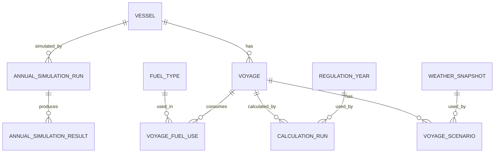
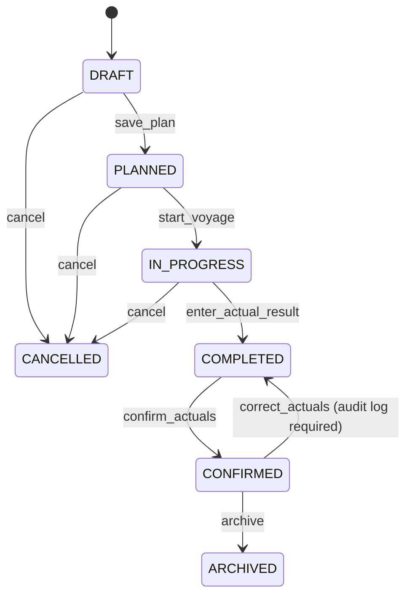
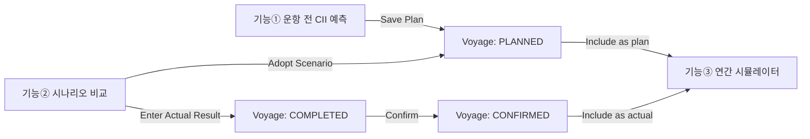

# PRD — BlueLog

| 항목 | 내용 |
|---|---|
| 문서명 | 구현용 상세 PRD.md |
| 제품명 | **BlueLog** (2026-08-04 디자인 담당 확인 · 2026-08-17 확정) |
| 부제 | 중소선사를 위한 CII 예측 및 운항 의사결정 보조 플랫폼 |
| 버전 | v4.16 Implementation PRD |
| 상태 | MVP 구현 기준 / **자체 ID/PW 인증 전환 (COR-10 · O-14)** / **관리 중심 전환 반영 (제16차 회의)** / **역할 3종 — 계정 관리를 관리자로 분리 (#1301)** / 보고서 절 신설 (#360) / 계산식 스코프 원문 대조 완료 (#358) |
| 최종 수정일 | 2026-09-22 |
| MVP 개발 기간 | 2026.06 ~ 2026.10 |
| 대상 사용자 | 중소선사 **선주·경영진**, 육상 운항관리 담당자, 선장·항해사 |
| 문서 목적 | 개발자가 화면·계산·데이터 흐름·예외 처리·테스트 기준을 구현할 수 있도록 제품 요구사항을 상세화 |
| 후속 문서 | `TECH_SPEC.md`, `API_SPEC.md`, `DB_SCHEMA.md`, `TEST_PLAN.md` |

---

## 0. 문서 사용 규칙

### 0.1 요구사항 강도

본 문서의 요구사항 강도는 다음 기준을 따른다.

| 표현 | 의미 |
|---|---|
| MUST | MVP 구현에 필수이다. 미구현 시 MVP 성공 기준을 충족하지 못한다. |
| SHOULD | MVP에 포함하는 것을 원칙으로 하되, 일정상 조정 가능하다. |
| MAY | 선택 구현 또는 향후 확장이다. |
| OUT OF SCOPE | MVP에서 제외한다. |

### 0.2 문서 간 우선순위

1. 본 `PRD.md`
2. `TECH_SPEC.md`
3. `API_SPEC.md`
4. `DB_SCHEMA.md`
5. `TEST_PLAN.md`
6. 기존 기획서·회의록·화면 요구사항

단, IMO 규정·공식 계산식·규제 파라미터는 최신 IMO 문서 및 승인된 파라미터 파일이 우선한다.

### 0.3 구현 범위에 대한 기본 원칙

본 제품은 **규제 제출용 공식 계산 시스템이 아니라, 운항 의사결정을 보조하는 예측·시뮬레이션 도구**이다. 따라서 제품 내 모든 결과에는 다음 문구 또는 동등한 의미의 안내가 노출되어야 한다.

> 본 결과는 공개 데이터, 사용자 입력값, 추정 모델을 기반으로 한 참고용 예측값입니다. 규제 제출용 공식 CII 계산 결과가 아니며, 최종 운항 판단은 사용자에게 있습니다.

---

## 1. v2.0 대비 주요 수정 사항

기존 PRD에서 구현상 오해를 만들 수 있는 내용을 아래와 같이 수정한다.

| ID | 기존 표현 또는 위험 요소 | 수정 내용 | 적용 위치 |
|---|---|---|---|
| COR-1 | "항차별 CII"가 공식 IMO CII처럼 해석될 수 있음 | IMO CII 등급은 연간 단위가 공식 기준이다. 본 제품의 항차 단위 값은 `항차 CII 추정값` 또는 `항차 CII 기여도`로 표기한다. | 전체 |
| COR-2 | "현재 등급" 표현이 공식 확정 등급으로 오해될 수 있음 | 연중 화면에서는 `현재 누적 기준 예상 등급` 또는 `연말 예상 등급`으로 표기한다. | 기능①·③ |
| COR-3 | "한번 하락한 등급은 해당 연도 내 회복 불가능" | 공식 등급은 연말 운항 실적 기준으로 사후 산정된다. 연중에는 누적 실적이 나빠질수록 남은 항차로 목표 등급 회복이 어려워질 수 있다고 표현한다. | 문제 정의 |
| COR-4 | "Townsin 모델" 단독 표기 | 구현 명칭은 `Townsin–Kwon 계열 경험식 기반 기상 보정 어댑터`로 한다. 실제 수식·계수는 `TECH_SPEC.md`에서 확정한다. | 기능② |
| COR-5 | "실시간"으로 보일 수 있는 표현 | MVP는 AIS·IoT를 연동하지 않는다. 현재 위치·속도는 사용자 입력 또는 개발자도구 기반 수동 좌표 입력을 사용한다. | 기능② |
| COR-6 | IMO 감축계수 미확정 위험 | 2027~2030 Z-factor는 MEPC.400(83) 기준값을 기본 파라미터로 반영한다. 단, 코드 하드코딩 금지. | 계산 원칙 |
| COR-7 | AI 연료 예측의 범위 불명확 | AI 연료 예측은 MVP 핵심 경로에서 제외하고, 데이터가 준비된 경우 `실험 기능`으로만 제공한다. | O-1 |
| COR-8 | 기능①→③ 데이터 이관 방식 미정 | 항차 상태 모델과 `annual_inclusion_policy`를 정의하여 계획·진행·완료·확정 데이터를 연간 시뮬레이션에 반영한다. | 데이터 흐름 |
| **COR-9** | **서비스의 중심이 「예측」으로 서술되어 있음** | **제16차 회의 결정에 따라 예측 중심에서 관리 중심으로 전환한다.** 정보 구조를 **선대 → 선박 → 항차** 3계층으로 재편하고, 선대 대시보드를 서비스의 중심 화면으로 둔다. **예측 기능은 배제하지 않고 항차 계층 안에 남긴다.** | §2 · §5 · §6 · §21 |
| **COR-10** | **인증을 구글 OIDC에 위임하도록 서술되어 있음** | **2026-08-16 결정에 따라 구글 OIDC를 완전히 제거하고 자체 이메일·비밀번호 인증으로 전환한다.** 가입 시 이메일 인증과 비밀번호 재설정을 제공한다. 제품이 비밀번호를 보관하게 되므로 저장·전송·재설정 규칙을 명시한다. | §5 · §6 · §7.10 · §20 O-14 |

### 1.1 기능 번호 신구 매핑

기능 번호(①②③)는 **`created_from` enum 값**(`FEATURE_1` · `FEATURE_2_ADOPTED`)·테스트 ID·이슈 제목에 이미 박혀 있어 **재번호하지 않는다.** 아래 매핑으로 대응을 추적한다.

| 신방향 기능 | 종전 대응 | 상태 |
|---|---|---|
| 1. 대시보드 (선대 전체 관리 뷰) | — | **신설** |
| 2. 선박 상세 | — | **신설** |
| 3. 실시간 CII 산출 | 기능①(운항 전 항차 CII 추정) + 기능②(기상 반영) | **재정의 · 흡수** |
| 4. 연도별 운항 기록 관리 | Voyage CRUD + CSV 가져오기·내보내기 | **격상 · 확장** |
| 5. 보고서 | 내부 보고용 내보내기 + 기능②(사후 비교) | **격상 · 흡수** |
| 6. 기타 — 어드민 계정 | §20 O-13(인증 범위) → **O-14** | **역할 3종(사무직·현장직·관리자) — 계정 관리를 사무직에서 관리자로 뗀다** (`#1301` · 2026-09-19 사용자 결정. `#672`의 역할 2종 도입을 대체한다) |
| (유지) 연간 CII 등급 시뮬레이터 | 기능③ | **선박 계층으로 이동** |

> **COR-5와의 관계** — COR-5는 「실시간」이라는 표현이 AIS·IoT 연동으로 오해되는 것을 막는 조항이다. 신방향의 「실시간 CII」는 **AIS 연동이 아니라 연초부터 현재까지의 누적값이 시간에 따라 변하는 것**을 뜻한다. 그 정의(3종 값 분리)와 데이터 확보 방식은 **§11.x 실시간 CII 절**에서 확정한다.

---

## 2. 제품 정의

### 2.1 제품 개요

본 서비스는 중소선사가 **보유 선박 전체의 CII 등급을 상시 관리**할 수 있도록 지원하는 웹 기반 플랫폼이다. 정보 구조는 **선대 → 선박 → 항차** 3계층이며, 상위 계층이 하위 계층을 품는다.

| 계층 | 화면 | 사용자가 얻는 것 |
|---|---|---|
| **선대** | 대시보드 | 보유 선박 전체의 현 등급·운항 상태·위치를 한 화면에서 조망하고, 위험 선박을 즉시 식별한다 |
| **선박** | 선박 상세 | 연도별 CII 이력, 올해 누적(YTD) 등급, 현재 위치·상태를 확인한다 |
| **항차** | 실시간 CII · 시나리오 | 항해 중 누적값 변화와 연말 예상 등급을 확인하고, 대안 시나리오를 같은 기준으로 비교한다 |

여기에 세 계층을 조합한 **보고서**(항차 완료 리포트 · 연간 실적 리포트)를 산출물로 제공한다.

> **예측을 배제하지 않는다.** 남은 거리 기반 연말 예상 등급과 기상 기반 구간 조정 권고는 그 자체가 예측이며, 항차 계층 안에 남는다. 바뀐 것은 **예측을 서비스의 중심에 두지 않는다**는 점이다.

본 서비스는 항로를 자동 결정하거나 선박을 자동 제어하지 않는다. 시스템은 선택지별 수치 비교를 제공하고, 최종 운항 판단은 사용자에게 둔다.

### 2.2 MVP 목표

MVP는 다음 사용자 과업을 **계층을 오르내리며** 수행할 수 있어야 한다.

```text
[선대]  대시보드 진입 — 보유 선박 전체 현황 · 위험 선박 경고
   │
   ├─ 위험 선박 선택
   ↓
[선박]  선박 상세 — 연도별 CII 이력 · 올해 누적(YTD) 등급 · 현재 위치·상태
   │
   ├─ 진행 중 항차 선택
   ↓
[항차]  실시간 CII — 항해 중 누적값 · 남은 거리 기반 연말 예상 등급
   │                 정박·묘박 지속 시 등급 하락 반영
   ├─ 대안 검토
   ↓
        시나리오 비교 — 직항·우회·감속을 같은 기준으로
   │
   ↓
[산출물] 보고서 — 항차 완료 리포트 · 연간 실적 리포트
```

### 2.3 제품 성공 정의

MVP 성공은 다음 네 가지가 통합 시연 가능한 상태로 정의한다.

| 성공 항목 | 정의 |
|---|---|
| **관제 가능성** | 보유 선박 전체의 현 등급·운항 상태를 한 화면에서 조망하고, 위험 선박을 식별한다. |
| 계산 가능성 | 선박·항차·연료·거리 입력으로 CII 추정값과 등급을 재현 가능하게 산출한다. |
| 관리 가능성 | 연초부터 현재까지의 누적 실적과 잔여 계획을 합산하여 연말 예상 등급과 목표 등급 달성 확률을 제공한다. |
| 보고 가능성 | 위 결과를 항차 단위·연간 단위 문서로 생성한다. |

> 종전의 **「비교 가능성」**(직항·우회·감속을 동일 기준으로 비교)은 성공 정의에서 빼지 않고 **관리 가능성의 하위 수단**으로 둔다. 시나리오 비교의 쓰임새가 「실행 지시」에서 「사후 설명·보고 근거」로 이동했기 때문이다(§11 · 제16차 회의).

### 2.4 비목표

다음은 MVP 범위에서 제외한다.

| 항목 | 제외 사유 |
|---|---|
| 규제 제출용 공식 CII 보고서 생성 | 인증기관 검증·G5 보정·공식 DCS 연계가 필요함 |
| 자동 최적항로 추천 | 의사결정 보조 원칙과 안전 책임 이슈 |
| AIS·IoT 자동 수집 | MVP 일정·선박별 장비 차이. **선박의 현재 위치·운항 상태는 사용자 입력 또는 시뮬레이션 시계로 확보한다**(COR-5). **IoT는 AIS와 성격이 달라 따로 다룬다** — 엔진 명명 체계가 표준으로 단일화되지 않아 사실상 선주별 개별 연동이다(`§21` `[#764]` 각주) · **IoT는 하지 않는다**(`§21` `[#1026]` 각주) |
| 사용자 권한·조직 관리 고도화 | MVP 이후 확장 |
| 다국어 UI | 한국어 기본, 실무 영문 약어 병기만 허용 — 화면 언어 전환은 `§5.1` 실험(`#1215`), 약어의 범위와 예외는 `DESIGN_SYSTEM §3` 🔒(`#1452`) |

> **[COR-9] 「선대 통합 모니터링」 행을 삭제했다.** 제16차 회의에서 선대 대시보드를 서비스의 중심 화면으로 결정했으므로 더 이상 비목표가 아니다. 종전 AIS·IoT 2행은 **자동 수집**만 제외하는 것으로 합쳐 정리했다 — 위치·상태 데이터 자체는 MVP에 필요하다.

---

## 3. 규제·계산 기준 요약

### 3.1 공식 CII 적용 대상

MVP의 규정 파라미터는 IMO CII 체계를 기준으로 한다. CII는 일반적으로 MARPOL Annex VI Regulation 28 적용 대상인 5,000 GT 이상 선박을 기준으로 한다.

제품은 MVP에서 공식 제출용이 아니므로, 사용자가 5,000 GT 미만 선박을 입력하더라도 계산 자체는 `샘플/내부 분석용`으로 수행할 수 있다. 다만 화면에는 `공식 CII 적용 대상이 아닐 수 있음`을 표시해야 한다.

### 3.2 공식 CII와 제품 내 추정값의 구분

| 구분 | 공식 IMO CII | 본 제품 MVP |
|---|---|---|
| 기준 기간 | 1월 1일~12월 31일 연간 실적 | 항차 단위 추정, 누적 실적, 연말 예측 |
| 데이터 | 검증된 연료 사용량·거리 등 | 사용자 입력, 샘플 데이터, 공개 API, 추정 모델 |
| 용도 | 규제 준수·등급 산정 | 운항 의사결정 보조 |
| 산출물 | Attained annual operational CII, CII Rating | 예상 CII, 예상 등급, 위험도, 목표 달성 확률 |
| 제출 가능성 | 가능 | 불가 |

### 3.3 MVP 기본 계산식

> **[#358] 계산식 스코프 4종** — `§3.3.2`·`§3.3.3`의 식은 「어느 기간의, 어떤 범위의」 연료·거리인지를 적지 않으면 해석이 갈린다. 아래 4종을 이 절의 전제로 고정한다. 각 값의 근거는 해당 하위 절에 원문으로 인용한다.
>
> | # | 스코프 | 값 | 근거 |
> |---|---|---|---|
> | ⑴ | **기간** | 역년(calendar year) | `MEPC.352(78)` §4 · `COR-1` |
> | ⑵ | **연료 범위** | 선내에서 소비된 **모든** 연료 — not under way 연료 **포함** | `MEPC.352(78)` §4.1 |
> | ⑶ | **거리 범위** | **under way + not under way 거리 둘 다** | `MEPC.412(84)` §4.2 |
> | ⑷ | **거리 산출 방식** | 항구간 거리를 `Dt`의 **근사**로 사용 — 가정과 오차 방향을 §15.2에 명시 | 본 제품의 구현 결정 |
>
> **원문 대조 확인: 2026-08-15.** IMO 공식 서버의 결의안 PDF를 직접 대조했다(`MEPC.352(78)` = MEPC 78/17/Add.1 Annex 14 · `MEPC.412(84)` = MEPC 84/16/Add.2 Annex 14).

#### 3.3.1 Attained annual operational CII 형식

공식 CII의 기본 형태는 다음 구조를 따른다.

```text
attained_CII = M / W
```

| 기호 | 의미 | MVP 단위 |
|---|---|---|
| M | CO₂ 배출량 총량 | gCO₂ |
| W | Transport work 또는 transport work proxy | capacity × nautical mile |

#### 3.3.2 CO₂ 배출량

```text
M = Σ(FuelConsumed_j × 1,000,000 × CF_j)
```

| 항목 | 설명 |
|---|---|
| `FuelConsumed_j` | 연료 종류 j의 사용량, ton 기준 |
| `1,000,000` | ton fuel → gram fuel 변환 |
| `CF_j` | 연료 j의 fuel-to-CO₂ conversion factor, tCO₂/tFuel 또는 gCO₂/gFuel과 동일 비율 |

> **[#358] 기간과 연료 범위 — `M`은 「모든」 연료다.** `MEPC.352(78) §4.1` 원문:
>
> *"The total mass of CO₂ is the sum of CO₂ emissions (in grams) from **all the fuel oil consumed on board a ship in a given calendar year** … `FC_j` is the total mass (in grams) of consumed fuel oil of type `j` in the calendar year, **as reported under IMO DCS**"*
>
> - **기간**은 역년이다(⑴).
> - **항해 여부를 가리지 않는다**(⑵). 정박·묘박·표류·STS·운하 통과·드라이독 구간에서 태운 연료가 모두 `M`에 들어간다. 이 구간의 기록 위치는 `DB_SCHEMA §2.18 not_underway_fuel_use`다.
> - 따라서 **정박이 길어질수록 `M`만 늘고 `W`는 늘지 않아 등급이 나빠진다.** 이는 본 제품이 만든 규칙이 아니라 규제 계산식의 원래 동작이며, `MEPC 82/6/31`(ICS·라이베리아)이 현행 제도를 그렇게 서술한다 — *"emissions continue to accumulate without corresponding transport work … penalised under the current system"*.
>
> **원문 대조 확인: 2026-08-15.**

#### 3.3.3 Transport work proxy

```text
W = transport_capacity × Distance_nm
```

| 선박 유형 | Capacity 기준 | 지표명 | 표시 단위 |
|---|---|---|---|
| Bulk carrier, Tanker, Container ship, Gas carrier, LNG carrier, General cargo ship, Refrigerated cargo carrier, Combination carrier **(8종)** | DWT | `AER` | `gCO₂/(DWT·nm)` |
| Cruise passenger ship, Ro-ro cargo ship (vehicle carrier), Ro-ro cargo ship, Ro-ro passenger ship **(4종)** | GT | `cgDIST` | `gCO₂/(GT·nm)` |

> **[#163] 지표명은 capacity 축에서 파생된다.** `MEPC.352(78) §2.5` — *"The supply-based CII which uses **DWT** as the capacity is referred to as **AER**, and the supply-based CII which uses **GT** as the capacity is referred to as **cgDIST**."* 이 절은 개정되지 않았다. capacity 축 목록(DWT 8종 · GT 4종)의 근거는 개정 `§4.2`이며, 개정 전후로 축은 바뀌지 않았다.
>
> **`RO_RO_PASSENGER_HSC`(고속 여객선)는 GT 축이다.** `§4.2`가 고속선을 따로 열거하지 않는 것은 `G2 Table 1`이 이를 `Ro-ro passenger ship`의 하위 행으로 두기 때문이며(`#126`), 상위 선종의 축을 그대로 따른다. 따라서 **`ship_type` 13종 전부가 두 축 중 정확히 하나에 속한다.**
>
> **표기 규칙** — 선종이 정해지지 않은 **일반 계산식**에서는 `gCO₂/capacity·nm`으로 쓰고, **사용자에게 표시할 때**는 위 표에 따라 `gCO₂/(DWT·nm)` 또는 `gCO₂/(GT·nm)`로 파생시킨다. **단위 문자열을 화면에 고정값으로 박지 않는다** — 선종이 늘어날 때 GT 축 선박에 DWT 표기가 조용히 표시된다. 분모를 괄호로 묶는 것은 `DWT × nm` 전체가 분모임을 드러내기 위해서다(괄호가 없으면 `gCO₂/DWT`에 `nm`을 곱한 것으로 읽힌다).
>
> **원문 대조 확인: 신하늘(`sky01170851`), 2026-08-06.** `§2.5`(MEPC 78/17/Add.1 Annex 14, 3쪽) · 개정 `§4.2`(같은 Annex 14, 5쪽)를 IMO 원문과 직접 대조해 확인했다.

> 주의: Container ship의 capacity 처리는 CII G1/G2 기준을 우선한다. EEDI와 혼동하지 않도록 `RegulationParameter.capacity_rule`에 명시한다.
> 
> **[EXT-P0-1]** IMO G1(MEPC.352(78), as amended by MEPC.412(84))과 G2(MEPC.353(78))은 **서로 다른 capacity 개념**을 사용한다.
> - **G1 (attained CII)**: `transport_capacity` = 선박의 **실제** DWT 또는 GT. 예: 300,000 DWT 벌크캐리어 → `W = 300,000 × Distance_nm`
> - **G2 (reference CII)**: `reference_capacity` = G2 표의 capacity rule에 따른 값. `fixed X`인 경우 X를 사용. 예: 300,000 DWT 벌크캐리어 → `CII_ref = 4745 × 279,000^(-0.622)`
>
> 이전 ORACLE-C-2 수정(fixed capacity를 W에도 적용)은 **잘못된 것으로 확인되어 취소**한다. IMO G1은 transport work proxy에 항상 실제 capacity를 사용하며, G2의 fixed capacity 값은 reference line 공식에만 적용된다.
>
> **이중 capacity 해결 규칙:**
> 1. `transport_capacity = resolve_transport_capacity(vessel)` — 항상 실제 DWT 또는 GT
> 2. `reference_capacity = resolve_reference_capacity(vessel, reference_line)` — G2 표의 capacity_rule에 따름
> 3. `condition_expr`(예: `DWT ≥ 279,000`)는 선박의 실제 DWT/GT로 평가하여 어느 파라미터 행을 선택할지 결정
>
> **오차 영향**: fixed capacity를 W에 잘못 적용하면 300,000 DWT 벌크캐리어의 attained CII가 +7.5% 과대 산정되며, 50,000 DWT LNG 캐리어의 경우 −23.1% 과소 산정(위험: 실제보다 양호해 보임)된다.

> **[#358] 거리 범위 — `Dt`는 under way와 not under way를 모두 포함한다.** `MEPC.412(84) §4.2` 원문(G1 `§4.2`를 **통째로 교체**, 2026-05-01 채택):
>
> *"The supply-based transport work (Ws) is defined as the product of a ship's capacity and the total distance travelled **(both under way and not under way)** in a given calendar year, as follows: `Ws = C × Dt` … `Dt` represents the total distance travelled (in nautical miles), **as reported under IMO DCS**."*
>
> ⚠️ **구판 `MEPC.352(78)` `§4.2`에는 이 한정어가 없다** — 원문은 *"the distance travelled in a given calendar year"* 뿐이고 범위를 IMO DCS 정의로 위임한다. **한정어가 없어 「under way 거리만」으로 읽었던 것이 본 제품의 종전 전제였고, 개정본 대조로 정정했다.** 이 문구의 출처를 `MEPC.352(78)`로 적으면 오기가 된다.
>
> **무엇이 분모에 더해지는가.** 대부분의 not under way 구간은 이동이 없어 `0`이다.
>
> | 구간 유형 | 이동 거리 | 분모 기여 |
> |---|---|---|
> | 접안(`IN_PORT`) · 묘박(`AT_ANCHOR`) · 드라이독(`DRYDOCK`) | ≈ 0 | 없음 |
> | **운하 통과(`CANAL_TRANSIT`)** | 수에즈 약 104 nm · 파나마 약 44 nm | **있음** |
> | **표류·예인(`DRIFTING`)** · **STS(`STS`)** | 상황에 따라 발생 | 있음 |
>
> **그래서 「정박 지속 시 등급 하락」은 그대로 성립한다** — 접안·묘박은 `M`만 늘리고 `Dt`에는 기여하지 않기 때문이다. 분모를 실제로 늘리는 것은 이동이 있는 구간뿐이다.
>
> **누락 시 오차 방향**: not under way 이동 거리를 분모에서 빼면 `W`가 과소해져 `CII = M/W`가 **과대**해지고 **등급이 실제보다 나쁘게** 표시된다. 규제 대응에서 과잉 경보 방향이다. 기록 위치는 `DB_SCHEMA §2.17 not_underway_period.distance_nm`이다.
>
> **원문 대조 확인: 2026-08-15.**

#### 3.3.4 Reference CII

```text
CII_ref = a × Capacity^(-c)
```

`a`, `c`는 선종별 reference line 파라미터이며 코드에 하드코딩하지 않는다.

#### 3.3.5 Required CII

```text
required_CII(year) = CII_ref × (1 - Z_year / 100)
```

#### 3.3.6 Rating boundary

```text
superior_boundary = required_CII × d1
lower_boundary    = required_CII × d2
upper_boundary    = required_CII × d3
inferior_boundary = required_CII × d4
```

등급 판정은 낮은 CII가 더 우수하다는 전제에서 다음 순서로 수행한다.

```text
if attained_CII <= superior_boundary: A
else if attained_CII <= lower_boundary: B
else if attained_CII <= upper_boundary: C
else if attained_CII <= inferior_boundary: D
else: E
```

경계값과 정확히 같은 경우에는 더 우수한 등급으로 판정한다. 예: `attained_CII == lower_boundary`이면 B.

#### 3.3.7 등급 하락의 규제상 귀결

> **원문 대조 확인: 신하늘(`sky01170851`), 2026-08-15.** 아래 표의 근거 조문은 MARPOL Annex VI(2021 개정, `MEPC.328(76)`) 인쇄면 14~15쪽(Reg 6.8)·42쪽(Reg 26.3)·44~45쪽(Reg 28)과 `MEPC.395(82)` 인쇄면 22쪽(§9.4)·26쪽(§15)에서 IMO 원문 PDF와 직접 대조했다. 개정 `MEPC.401(83)`·`MEPC.413(84)`은 SEEMP Part II(데이터 수집) 개정이며 본 절의 귀결 체계는 바꾸지 않는다(전문 확인).

**D등급 3년 연속 또는 E등급 1년의 귀결은 운항 제한이 아니라 시정조치계획(corrective action plan) 의무다.**

| 항목 | 내용 | 원문 근거 |
|---|---|---|
| 트리거 | D등급 **3년 연속** 또는 E등급 **1년** | Reg 28.7 |
| 의무 1 | 시정조치계획 수립 — SEEMP **Part III**에 반영 | Reg 28.7·26.3.2, `MEPC.395(82)` §9.4 |
| 의무 2 | 수정 SEEMP을 행정기관(또는 승인기관)에 제출·검증 — attained CII 보고 후 **1개월 이내** | Reg 28.8 |
| 의무 3 | 계획된 시정조치 이행 | Reg 28.9 |
| 미이행의 귀결 | **Statement of Compliance 미발급** | Reg 6.8 |
| 시정조치계획의 목표 | 채택 다음 연도에 **최소 C등급** 회복, 궁극적으로 required CII 달성 | `MEPC.395(82)` §15.4.1 |

> **운항 제한·억류·거래 금지 조항은 확인 범위(Reg 6·26·28, 2024 SEEMP 가이드라인 및 개정 2건)에 존재하지 않는다.** 실질적 압박은 SoC 미발급과 용선주·금융기관·PSC 등 **상업적 경로**로 온다. 본 제품은 이 경계를 그대로 반영한다 — 규제상 귀결을 과장해 표현하지 않는다. 반대로 A·B 등급에 대한 인센티브 권고(Reg 28.10)도 제품 범위 밖 배경 지식으로만 기록한다.

**경고 배너 판정 기준(위험 선박 정의)** — 대시보드 경고 배너는 아래 둘 중 하나에 해당하는 선박을 **위험 선박**으로 센다. 기준은 **연간 누적(YTD) 등급**이다(연말 예상 등급 기준 판정은 Monte Carlo 종속이라 후속 이슈로 연기한다).

1. 올해 YTD 등급이 **E**
2. 직전 2개 규제연도의 확정 등급이 연속 **D**이고, 올해 YTD 등급도 **D** (3년 연속 D 진행)

> YTD 등급은 연중 누적 예측값으로 **공식 등급이 아니다** — 공식 등급은 연말 DCS 보고·검증 후 확정된다. 배너는 사전 경고다. 문구 원문은 §6.3.

#### 3.3.8 「실시간 CII」 — 화면이 표시하는 3종 값 (#358)

**규제상 「실시간 CII」라는 개념은 없다.** `§3.3.2`·`§3.3.3`이 확정하듯 `M`과 `Dt`는 **역년 단위 누계**이므로, attained CII는 연말에야 확정된다(`COR-1`). 따라서 항해 중 화면이 표시하는 값은 「실시간으로 계산되는 공식 CII」가 아니라 **연초부터 조회 시점까지의 누적값과 그로부터의 전망**이다.

화면은 아래 3종을 구분해 표시한다. **등급이 붙는 값은 ⑴ 하나뿐이다.**

| # | 값 | 정의 | 등급 표시 | 화면 표기 |
|---|---|---|---|---|
| ⑴ | **연간 누적 (YTD)** | 연초 ~ 조회 시점의 `M`·`Dt` 누계로 산출한 attained CII | **가능** — `현재 누적 기준 예상 등급` (`COR-2`) | 주 표시값 |
| ⑵ | **항차 구간값** | 특정 항차 구간만의 `M`/`W` | **불가** | `항차 CII 기여도` (`COR-1`) |
| ⑶ | **연말 예상** | ⑴에 남은 기간의 예상 운항을 더해 외삽한 값 | **가능** — `연말 예상 등급` (`COR-2`) | 보조 표시값 |

**⑴ 연간 누적(YTD)의 산출식**

```text
YTD_M  = Σ(항해 중 연료_j × 1,000,000 × CF_j)            ← voyage_fuel_use
       + Σ(not under way 연료_j × 1,000,000 × CF_j)      ← not_underway_fuel_use

YTD_Dt = Σ(항해 거리) + Σ(not under way 이동 거리)        ← §3.3.3 ⑶

YTD_attained_CII = YTD_M / (transport_capacity × YTD_Dt)
```

`§3.3.1`~`§3.3.3`의 식을 그대로 쓰되 **집계 구간을 「연초 ~ 조회 시점」으로 좁힌 것**이다. 새로운 계산식이 아니다.

**집계에 넣는 항차의 범위**는 `§8.1.2` 매트릭스의 판정 결과인 `annual_inclusion_policy`를 따른다.

| `annual_inclusion_policy` | YTD 처리 |
|---|---|
| `INCLUDE_AS_ACTUAL` | **집계에 넣는다** (실적) |
| `INCLUDE_AS_PLAN` | **계획 전량을 넣지 않는다** — 아래 참조 |
| `EXCLUDE` | 넣지 않는다 |

> **`INCLUDE_AS_PLAN`(진행 중 항차)의 계획 전량을 넣지 않는 이유.** 12월에 끝날 예정인 항차의 계획 연료를 1월 조회에 전부 더하면 **아직 발생하지 않은 배출을 이미 발생한 것으로** 계산하게 되어 「누적값」의 정의가 깨진다. `§8.3` 값 우선순위가 진행 중 항차에 요구하는 것도 계획 전량이 아니라 `IN_PROGRESS latest estimate`이며, 그 estimate는 경과 시간으로부터 산출한다.

> **[#885] 진행 중 항차의 연료는 유종별로 나눈다.** 경과 시간에서 산출한 진행 연료 `F`는
> **총량 하나**다(`reference_daily_foc_ton × 경과시간`). 다유종 항차는 그 항차의 **계획 연료량
> 비율로** 나눠 각 유종의 CF를 곱한다.
>
> ```text
> F_i = F × (planned_fuel_ton_i / Σ planned_fuel_ton)      — 마지막 몫은 F − Σ(나머지)
> 진행분 M = Σ(F_i × 1,000,000 × CF_i)
> ```
>
> 종전에는 연료 기록의 **첫 유종 하나**가 `F` 전량을 받았다 — 사전순 첫 유종이 대표가 될
> 근거는 없었고, HFO 60 t + 가스오일 40 t 계획이면 소수 유종의 CF가 전체를 대표했다. 같은
> 누적의 다른 갈래(항해 중 연료 · not under way 연료)는 이미 유종별로 CF를 곱한다.
> 계획량이 비어 있으면(전부 `NULL`) 첫 유종 하나, 연료 기록이 없으면 선박 기본 연료 하나로
> 내려간다. **단일 유종 항차는 값이 변하지 않는다.** 화면이 표시하는 진행 항차의 유종은
> 계획량이 가장 큰 유종 하나다.

**⑶ 연말 예상의 성격**

⑶은 남은 기간의 운항 가정에 의존하므로 **가정이 바뀌면 값이 바뀐다.** 화면은 ⑴과 ⑶을 나란히 두되 ⑶에 사용한 가정(잔여 항해일·평균 소비율 등)을 함께 표시한다. ⑶만 단독으로 크게 표시하지 않는다 — 확정값처럼 읽힌다.

**시각 의존과 재현성**

⑴·⑶은 조회 시각에 따라 값이 달라진다. 재현성 계약(`TECH_SPEC §5.4`)을 지키기 위해 **시각을 명시적 입력(`as_of`)으로 승격**시키고, 시각으로부터 누적량을 만드는 계층과 계산 코어를 분리한다 — **계산 코어는 시각을 모른다.** 상세 계약은 `TECH_SPEC`이 정의한다.

> **MVP 범위 표기 의무 (`COR-5`).** MVP는 AIS·IoT를 연동하지 않으므로 ⑴의 진행 중 항차분과 ⑶은 **입력값과 서버 시각에서 파생된 값**이다. 해당 화면에는 `시뮬레이션 데이터` 배지를 표시한다.


### 3.4 기본 규정 파라미터

#### 3.4.1 CII reduction factor, Z%

다음 값은 MVP 초기 파라미터 seed로 사용한다. 실제 운영 시에는 관리자 또는 배포 스크립트를 통해 갱신 가능해야 한다.

| Year | Z factor relative to 2019 |
|---:|---:|
| 2023 | 5.000% |
| 2024 | 7.000% |
| 2025 | 9.000% |
| 2026 | 11.000% |
| 2027 | 13.625% |
| 2028 | 16.250% |
| 2029 | 18.875% |
| 2030 | 21.500% |

#### 3.4.2 Fuel CF 기본값

| Fuel code | 표시명 | CF, tCO₂/tFuel | MVP 사용 |
|---|---|---:|---|
| DIESEL_GAS_OIL | Diesel/Gas Oil | 3.206 | MUST |
| LFO | Light Fuel Oil | 3.151 | SHOULD |
| HFO | Heavy Fuel Oil | 3.114 | MUST |
| LPG_PROPANE | LPG Propane | 3.000 | MAY |
| LPG_BUTANE | LPG Butane | 3.030 | MAY |
| LNG | Liquefied Natural Gas | 2.750 | SHOULD |
| METHANOL | Methanol | 1.375 | MAY |
| ETHANOL | Ethanol | 1.913 | MAY |
| OTHER | 사용자 정의 연료 | 사용자 입력 | SHOULD |

`OTHER` 연료는 CF 출처 메모와 적용 시작일을 필수로 입력해야 한다.

> **[#773] 이 표에 알려진 공백이 둘 있다 — 누락이 아니라 판정 대기다.** 종전에는 두 사실이 **이슈 코멘트에만** 있어, 이 표를 읽는 사람이 *「빠뜨린 것인지 일부러 뺀 것인지」*를 알 수 없었다.
>
> | 공백 | 무엇 | 근거 | 대기 중인 판정 |
> |---|---|---|---|
> | `Ethane` (CF `2.927`) | **원문 표에는 있고 이 표에는 없다.** 원문은 연료 8종에 LPG가 Propane/Butane 둘이라 CF가 **9개**인데 우리는 8개다 | 팀원 원문 회신(`#87` 코멘트, 2026-07-29) — 값 인쇄처는 `MEPC.364(79)` §2.2.1. **우리가 가진 8개 값은 전부 일치하며 빠진 것은 이 한 행뿐이다** | 넣을지 (`#773` ⑵). 넣으면 이 표 · `DB_SCHEMA §3.2` · `db/seed.py` · 마이그레이션 4곳 |
> | `OTHER` | **이 표에는 있고 `fuel_type` 시드에는 없다** | CF가 사용자 입력이라 고정 시드 행으로 둘 수 없다. 근거 조항은 `§4.1` 「지침에서 다루지 않는 연료는 공급자 증빙으로 확보」 | ~~시드 포함 여부 (`#83`)~~ **해소 — `#673`이 런타임 생성 경로를 만들었다(2026-09-18).** 시드는 계속 넣지 않는다(CF가 사용자 입력이므로) — `POST /parameters/import`(`API_SPEC §7.5`)의 `fuel_types` CSV로 만들며, 이 표가 요구하는 **출처 메모(`source_ref`)와 적용 시작일(`effective_from`)이 필수**로 걸려 있다 |
>
> ⚠️ **`ETHANOL`(에탄올, `1.913`)과 `Ethane`(에탄, `2.927`)은 다른 연료다.** 이름이 비슷해 「이미 있다」로 오인하기 쉽다 — 실제로 `#87` 검토에서 그 혼동이 지적됐다.
>
> 이 표의 코드와 `fuel_type` 시드는 `tests/test_fuel_table_sync_db.py`가 대조한다. `OTHER`는 위 사유와 함께 예외로 적혀 있고, **채워지면 검사가 깨져 예외를 지우게 한다.**

#### 3.4.3 Ship type reference line 파라미터

MVP는 모든 CII 대상 선종을 파라미터 테이블로 저장할 수 있어야 한다. 단, QA fixture와 데모 검증은 `Bulk carrier`, `Tanker`, `Container ship`, `General cargo ship`을 우선한다.

| Ship type | 조건 | Capacity rule | a | c | MVP 우선순위 |
|---|---|---|---:|---:|---|
| BULK_CARRIER | DWT ≥ 279,000 | fixed 279000 | 4745 | 0.622 | P1 |
| BULK_CARRIER | DWT < 279,000 | DWT | 4745 | 0.622 | P1 |
| GAS_CARRIER | DWT ≥ 65,000 | DWT | 14405E7 | 2.071 | P2 |
| GAS_CARRIER | DWT < 65,000 | DWT | 8104 | 0.639 | P2 |
| TANKER | all | DWT | 5247 | 0.610 | P1 |
| CONTAINER_SHIP | all | DWT | 1984 | 0.489 | P1 |
| GENERAL_CARGO_SHIP | DWT ≥ 20,000 | DWT | 31948 | 0.792 | P1 |
| GENERAL_CARGO_SHIP | DWT < 20,000 | DWT | 588 | 0.3885 | P1 |
| REFRIGERATED_CARGO_CARRIER | all | DWT | 4600 | 0.557 | P2 |
| COMBINATION_CARRIER | all | DWT | 5119 | 0.622 | P2 |
| LNG_CARRIER | DWT ≥ 100,000 | DWT | 9.827 | 0.000 | P2 |
| LNG_CARRIER | 65,000 ≤ DWT < 100,000 | DWT | 14479E10 | 2.673 | P2 |
| LNG_CARRIER | DWT < 65,000 | fixed 65000 | 14779E10 | 2.673 | P2 |
| RO_RO_CARGO_VEHICLE | GT ≥ 57,700 | fixed 57700 | 3627 | 0.590 | P3 |
| RO_RO_CARGO_VEHICLE | 30,000 ≤ GT < 57,700 | GT | 3627 | 0.590 | P3 |
| RO_RO_CARGO_VEHICLE | GT < 30,000 | GT | 330 | 0.329 | P3 |
| RO_RO_CARGO | all | GT | 1967 | 0.485 | P3 |
| RO_RO_PASSENGER | all | GT | 2023 | 0.460 | P3 |
| RO_RO_PASSENGER_HSC | all | GT | 4196 | 0.460 | P3 |
| CRUISE_PASSENGER | all | GT | 930 | 0.383 | P3 |

> **[#759] 조건 열은 조건식이다.** `RO_RO_PASSENGER`·`RO_RO_PASSENGER_HSC` 두 행이 선종 설명(「Ro-ro passenger ship」·「SOLAS Chapter X HSC」)을 이 열에 적고 있었다. 나머지 18행은 `all`·`DWT ≥ N`·`N ≤ GT < M` 형태이고 DB와 `DB_SCHEMA §3.3`도 두 행 다 `all`이며, 설명 문자열은 `calc/capacity.py`의 `evaluate_condition`이 해석하지 못한다. 선종 구분은 `ship_type` 열이 한다 — `RO_RO_PASSENGER_HSC`는 **SOLAS 제X장의 고속선(HSC)**이다(`MEPC.353(78)` G2의 별도 행).

> 구현 주의: `14405E7`, `14479E10`, `14779E10`은 IMO 표 원문 표기다. DB 저장 시에는 문자열 원문값과 Decimal 변환값을 모두 저장한다. 예: `14405E7` → `14405 × 10^7`.

> **[#148] `Capacity rule`의 `fixed N`은 이 표(G2 reference line) 전용이다.** 벌크 279,000 · LNG 65,000 · ro-ro 차량운반선 57,700 **3건뿐**이며, **attained CII의 분모에는 적용되지 않는다** — 그쪽은 항상 선박의 실제 DWT/GT를 쓴다(§3.3.3 `[EXT-P0-1]`). 축은 두 계산이 같지만 **값은 다르다.**
>
> 이 구분을 놓치면 300,000 DWT 벌크캐리어의 attained CII가 **+7.5% 과대**, 50,000 DWT LNG 캐리어가 **−23.1% 과소**(실제보다 양호해 보임) 산정된다. 실제로 한 번 그렇게 수정됐다가 되돌린 이력이 `[EXT-P0-1]`에 남아 있다. 구현에서 `resolve_transport_capacity()`와 `resolve_reference_capacity()`를 나눈 이유가 이것이다(`TECH_SPEC §1.2.4`). **원문 대조 확인: sky01170851 (2026-07-30)** — G1 `§4.2`(`MEPC 78/17/Add.1` Annex 14, 5쪽)와 G2 Table 1(같은 문서 Annex 15, 4쪽)의 축 일치를 확인한 회신에 근거한다.

#### 3.4.4 d-vector rating boundary 파라미터

| Ship type | 조건 | capacity basis | d1 | d2 | d3 | d4 |
|---|---|---|---:|---:|---:|---:|
| BULK_CARRIER | all | DWT | 0.86 | 0.94 | 1.06 | 1.18 |
| GAS_CARRIER | DWT ≥ 65,000 | DWT | 0.81 | 0.91 | 1.12 | 1.44 |
| GAS_CARRIER | DWT < 65,000 | DWT | 0.85 | 0.95 | 1.06 | 1.25 |
| TANKER | all | DWT | 0.82 | 0.93 | 1.08 | 1.28 |
| CONTAINER_SHIP | all | DWT | 0.83 | 0.94 | 1.07 | 1.19 |
| GENERAL_CARGO_SHIP | all | DWT | 0.83 | 0.94 | 1.06 | 1.19 |
| REFRIGERATED_CARGO_CARRIER | all | DWT | 0.78 | 0.91 | 1.07 | 1.20 |
| COMBINATION_CARRIER | all | DWT | 0.87 | 0.96 | 1.06 | 1.14 |
| LNG_CARRIER | DWT ≥ 100,000 | DWT | 0.89 | 0.98 | 1.06 | 1.13 |
| LNG_CARRIER | DWT < 100,000 | DWT | 0.78 | 0.92 | 1.10 | 1.37 |
| RO_RO_CARGO_VEHICLE | all | GT | 0.86 | 0.94 | 1.06 | 1.16 |
| RO_RO_CARGO | all | GT | 0.76 | 0.89 | 1.08 | 1.27 |
| RO_RO_PASSENGER | all | GT | 0.76 | 0.92 | 1.14 | 1.30 |
| CRUISE_PASSENGER | all | GT | 0.87 | 0.95 | 1.06 | 1.16 |

> **[#126] `RO_RO_PASSENGER_HSC`는 위 표에 행이 없다. 이는 전사 누락이 아니라 원문대로다.** MEPC.354(78) Table 1에 해당 행이 존재하지 않으며, 다른 조항에도 별도 규정이 없다.
>
> **HSC의 등급 경계는 `RO_RO_PASSENGER` 행(0.76 · 0.92 · 1.14 · 1.30)을 적용한다.**
>
> **1. 인지된 부재다.** MEPC.353(78) Table 1은 `Ro-ro passenger ship`을 상위 분류로 두고, 그 아래 `Ro-ro passenger ship`(a=2023)과 `High-speed craft designed to SOLAS chapter X`(a=4196)를 병합 셀로 묶는다. IMO는 HSC를 인지하고 **별도 `a` 값까지 부여**한 상태에서 G4에 행을 만들지 않았다. HSC는 독립 선종이 아니라 Ro-ro passenger ship의 하위 구분이다.
>
> **2. (정황) G2는 두 하위 구분을 같은 capacity 지수로 적합했다.** `c`가 0.460으로 같아 `CII_ref` 비율이 `4196 / 2023 = 2.074147`로 capacity와 무관하게 일정하다. 기준선 적합 단계에서 두 하위 구분을 하나의 모집단으로 다뤘다는 뜻이다.
>
> **3. (정황) G4는 세분이 필요한 선종에 하위 행을 쓴다.** MEPC.354(78) Table 1은 `Gas carrier`(65,000 DWT 기준)와 `LNG carrier`(100,000 DWT 기준)를 용량 구간으로 나누면서 `Ro-ro passenger ship`은 나누지 않았다.
>
> 따라서 `cii_rating_boundary`에는 **행을 추가하지 않는다.** 원문에 없는 값을 규제값 표에 넣으면 `source_ref`가 거짓이 된다(§3.2 각주의 "값이 인쇄된 문서" 기준). 선종 매핑은 등급 판정 구현(#39)에서 처리한다.
>
> **원문 대조 확인: sky01170851.**

---

## 4. 사용자 및 주요 과업

### 4.1 페르소나 1 — 선장·항해사

| 항목 | 내용 |
|---|---|
| 사용 맥락 | 운항 전 계획 수립, 운항 중 대안 비교 |
| 기기 | 선상 PC·태블릿, 데스크톱 우선 |
| 주요 Pain Point | 기상·속도·우회가 연료와 CII에 미치는 영향을 즉시 비교하기 어렵다. |
| 핵심 과업 | 항차 CII 추정, 직항·우회·감속 비교, 시나리오 결과 확인 |
| 금지 기대 | 시스템이 최적 항로를 자동 선택하거나 운항 명령을 내리는 것 |

### 4.2 페르소나 2 — 육상 운항관리 담당자

| 항목 | 내용 |
|---|---|
| 사용 맥락 | 선박별 연간 CII 등급 관리, 남은 항차 계획 조정 |
| 기기 | 데스크톱 웹 |
| 주요 Pain Point | 현재 추세로 연말 등급이 어떻게 될지 사전에 보기 어렵다. |
| 핵심 과업 | 누적 실적 확인, 잔여 계획 입력, 연말 예상 등급·목표 달성 확률 확인 |
| 금지 기대 | 공식 DCS 보고서 제출 또는 인증기관 검증 대체 |

### 4.3 보조 이해관계자 — 경영진

| 항목 | 내용 |
|---|---|
| 사용 맥락 | 운항 전략·감속 운항·연료 전환·선박 교체 검토 |
| 핵심 과업 | 목표 등급 달성 가능성, 위험 선박, 개선 시나리오 효과 확인 |
| MVP 접근 | 역할은 **사무직·현장직·관리자 3종**을 둔다(§20 O-14 · `#1301`). 세 역할이 **같은 화면·같은 데이터**를 보며, 사무직 전용 조작(제원·시뮬레이션 실행·채택·보고서·감축 계획)과 **관리자 전용 조작(계정 목록·역할 지정)**만 갈린다 — **관리자는 사무직의 상위집합**이라 사무직 전용 조작도 그대로 한다. 조직·세부 권한 설정은 두지 않는다 |

---

## 5. MVP 범위

### 5.1 포함 범위

| 계층 | 모듈 | 기능 | MVP 포함 |
|---|---|---|---|
| **선대** | 대시보드 | 보유 선박 전체 현황(현 등급·운항 상태·위치) 조망 | **MUST** |
| **선대** | 경고 배너 | 위험 선박 식별·집계 — 판정 기준과 문구는 §6.3 · §9.4 | **MUST** |
| **선대** | 함대 감축 계획 (`UIFLOW 2-10`) | 선박별 감속을 정해 목표 등급 달성 여부 · 추가 항해일 · 비용(용선료 손실 · 연료비 절감 · 순손익)을 함께 보고 계획안을 저장. 계산은 §12.3.2 (`#513`) | MUST |
| **선대** | 데이터 점검 (`UIFLOW 2-11`) | CII 계산에 실측이 아닌 값이 쓰인 항차를 선대 단위로 — 대체 계산 · 계산 불가 · 이상치 · 실적 미입력 · 데이터 완결성. 판정은 §17.4 (`#513`) | MUST |
| **선박** | 선박 상세 | 연도별 CII 이력 · 올해 누적(YTD) 등급 · 현재 위치·상태 · **계산 이력(재계산 필요 표시)** | **MUST** |
| **선박** | 기능③ | 연간 CII 등급 시뮬레이터 · **실행에 쓴 항차 확인** | MUST |
| **항차** | 기능③ 실시간 CII | 항해 중 누적값 · 남은 거리 기반 연말 예상 등급 · 정박 지속 시 등급 하락 반영 | **MUST** |
| **항차** | 기능① | 운항 전 항차 CII 추정 — 실시간 산출의 계획 단계 | MUST |
| **항차** | 기능② | 직항·우회·감속 시나리오 비교 — 보고서의 사후 설명 근거 | MUST |
| **항차** | 운항 기록 | 연도별 항차 이력 축적 (CSV 가져오기·내보내기) | MUST |
| **산출물** | 보고서 | 항차 완료 리포트 · 연간 실적 리포트 | **MUST** |
| 공통 | 선박 관리 | 선박 등록, **샘플 선박 선택**, 제원 수동 입력 | MUST |
| 공통 | 규정 파라미터 | 연도별 Z-factor, 선종별 reference line, d-vector, 연료 CF 관리 | MUST |
| 공통 | 데이터 흐름 | 기능① 계획 저장 → 기능③ 반영 | MUST |
| 공통 | 데이터 흐름 | 기능② 시나리오 채택 → 계획 또는 실적 반영 | SHOULD |
| 공통 | 오류 처리 | 외부 API 장애, 필수 입력 누락, 계산 불가 안내 | MUST |
| 공통 | 테스트 | 계산 fixture, 경계값 테스트, seed 재현성 테스트 | MUST |
| 공통 | 사용자 인증 | 이메일·비밀번호 회원가입·로그인, 세션 관리 | MUST |
| 공통 | 이메일 인증 | 가입 시 확인 메일 발송·토큰 검증 | MUST |
| 공통 | 비밀번호 재설정 | 재설정 메일 발송·토큰 검증·비밀번호 교체 | MUST |
| 공통 | 계정 관리 | 로그인 상태에서 비밀번호·표시 이름 변경, 탈퇴 | MUST |
| 실험 | AI 연료 예측 | 실험 기능 — **하지 않는다**(2026-09-13 `#363` · 학습 범위는 `§12.2.1` 실적 보정계수까지) | MAY |
| 실험 | LLM 챗봇 (O-12) | 핵심 경로 제외, 실험 기능으로만 허용 — §20 O-12 · §16.3 참조 | MAY |
| 실험 | 화면 언어 전환 (한국어·영문) | 셸 문자열의 영문 전환 — i18n 기반(`#1215` · 2026-09-18 사용자 결정). **정본 문구(§6.3·§6.4·경고 배너)는 어느 언어에서도 한국어 원문 그대로다** — 번역하려면 이 문서 개정이 먼저다 | MAY |

> **[COR-9] 변경점** — ⑴ 계층 열을 신설해 각 기능이 어느 계층에 속하는지 드러냈다. ⑵ **대시보드·경고 배너·선박 상세·실시간 CII·보고서 5행을 신설**했다. ⑶ 종전 「내보내기 CSV 다운로드 SHOULD」는 **「운항 기록」 MUST로 승격**했다 — 연도별 이력 축적이 신방향 기능 4의 본체이고, 보고서의 CSV 출력 경로이기도 하다.

### 5.2 제외 범위

| 항목 | MVP 제외 여부 | 설명 |
|---|---|---|
| 공식 규제 제출 | OUT OF SCOPE | 인증기관 검증과 공식 DCS 연계 필요 |
| G5 correction factor/voyage adjustment 전체 지원 | OUT OF SCOPE | **하지 않는다** — 사유 셋은 아래 `[#762]` 각주. 미반영 사실을 연간 실적 리포트의 자체 점검 고지에 적는다(`§25.3`) |
| 자동 최적항로 추천 | OUT OF SCOPE | 비교 정보만 제공 |
| AIS 자동 위치 수집 | OUT OF SCOPE | **위치·운항 상태 데이터 자체는 MVP에 포함된다.** 자동 수집만 제외하며, 확보 방식은 사용자 입력 또는 시뮬레이션 시계다. **수집 경로(테이블·제공자 계약)는 열려 있다** — 붙일 AIS 출처가 아직 없어 자동 수집만 남았다(`§21` `[#764]` 각주). **국내 공공데이터 수집 경로의 첫 칸을 두었다**(`#1197` · `§15.1` `[#1197]` 각주) — A단계로 `vessel`에 **호출부호** 칸을 두었고(`해양수산부_선박운항정보`의 질의 키가 IMO가 아니라 호출부호다 · `SCR-002` · `API_SPEC §2.3`), B단계 제공자 구현은 공공데이터포털 인증키가 온 뒤다. 받는 것은 위치가 아니라 **재항 기록**이며 자동 적재가 아니라 교차 대조다 |
| IoT/엔진 센서 연동 | OUT OF SCOPE | 사용자 입력·샘플 데이터 기반 |
| 지도 기반 항로 렌더링 | **범위 안** (2026-09-12 개정) | 제외 사유 넷이 **PMTiles 로컬 자산으로 전부 해소**됐다 — 타일 서비스 없음(파일 하나) · **키 없음** · 비용 0 · **오프라인 동작**. 선대 대시보드가 지도로 그려지고, 자산이 없으면 개략도로 떨어진다. 아래 `§21` `[#763]` 각주 |
| 권한 관리 고도화 | **부분 포함** (2026-09-19 개정 · `#1301`) | **사무직(`OFFICE`)·현장직(`FIELD`)·관리자(`ADMIN`) 역할 3종은 범위 안**이다 — 현장직은 「넣고 본다」, 사무직은 「정하고 낸다」, **관리자는 사무직의 상위집합에 계정 관리(계정 목록·역할 지정)를 더한 것**이다(§20 O-14 · `API_SPEC §1.2` 역할 표 · `UIFLOW §2.2` 역할 열). 계정 관리 2경로가 사무직에서 관리자로 넘어간 것은 **계정을 관리하는 권한과 업무를 내는 권한이 한 역할에 함께 있어 사무직끼리 서로를 강등할 수 있었기 때문**이다(`#1301`). **역할을 3종보다 더 세분화하는 것 · 화면별 세부 권한 · 조직 설정은 두지 않는다** — 필요해지면 이 행을 먼저 개정한다 |
| 사용자별 데이터 격리 | OUT OF SCOPE | 로그인 사용자는 동일한 선박·항차 데이터를 공유한다. 소유권 컬럼을 두지 않는다. **역할은 행위 권한이지 소유권이 아니다** — 현장직도 사무직이 등록한 선박의 항차를 넣는다(§7.10 · `#672`) |

> **[#762] G5(보정계수·항해 조정 · `MEPC.355(78)`)를 계산에 반영하지 않는 이유 — 셋** (2026-09-17 결정 · `#762`).
>
> ⑴ **대부분은 구조적으로 할 수 없다.** 보정계수 넷 — `f_i`(빙등급 선체) · `f_m`(빙해역 항해) · `f_c`(화물 특성) · `f_i,VSE`(자발적 구조 강화) — 은 G5가 값을 갖지 않고 EEDI 계산 지침을 참조 지정하며, G5 §4.6이 **선박별 EEDI/EEXI Technical File**에 실린 값을 전제한다. 규제값 표가 아니라 선박 문서의 값이라 파라미터 표에 담을 수 없고, 이 제품은 그 파일을 받지 않는다.
>
> ⑵ **G5가 직접 값을 주는 것은 좁다.** STS·셔틀탱커 보정 두 식과 기본값 몇 개뿐이라 대상이 탱커 일부다. 그 계수는 원문 대조가 끝나지 않아(`AGENTS §2.2` `[#762]` 각주 · `#773`) **여기에 숫자를 옮기지 않는다.**
>
> ⑶ **잠정(Interim) 지침이다.** 채택 당시 본문 4항이 2026-01-01까지 재검토 완료를 예정했다. 2026-09-22에 IMO 결의안 목록(MEPC 79~84)을 확인한 결과 **G5를 개정·대체한 결의는 없고**, 재검토는 단기 조치 전반 재검토의 2단계로 넘어갔다(MEPC 84) (정황 — 결의 목록의 제목으로 확인했고 회의 보고서 본문은 대조하지 않았다). 옮겨 적은 값이 곧 낡을 수 있다 — `§0.3`이 「공식 계산이 아니다」로 선을 그은 제품에서 낡을 규제값을 미리 넣는 것은 방향이 반대다.
>
> **닿는 사용자** — 보정 대상 선박(빙등급 선박, 셔틀탱커, STS 작업선, 냉동 컨테이너를 싣는 선박)을 가진 선사의 사무직이다. 보정은 CII를 낮추는 방향이라, 보정 없이 낸 이 제품의 값은 검증기관이 G5를 적용한 값보다 **나쁘게** 나올 수 있다. 그 차이의 이유를 인쇄물에서 읽을 수 있게 연간 실적 리포트의 자체 점검 고지가 이 사실을 적는다(`§25.3`). 다시 여는 조건은 `§21` G5 행에 있다.

> ## ✅ 선대 계층 신설 화면 2종의 범위 판정 — **2026-09-13 둘 다 범위 안으로 옮겼다** (`#513`)
>
> 아래는 2026-08-23 판정 기록이다. 표의 결정이 모두 섰고(2-10 `§12.3.2` · 2-11 `§17.4`) 두 행을 `§5.1`로 옮겼다.
>
> ### (기록) 2026-08-23 판정
>
> `UIFLOW v2.4`가 신설한 `2-10 함대 감축 계획` · `2-11 데이터 점검`을 **1차 심사 범위에서 제외한다.** 두 화면의 MVP 열은 v2.4 이래 「`PRD §5` 판정 대기」였고, `AGENTS §3.2.3`상 그 판정은 본 절의 소관이다.
>
> **기능이 어려워서가 아니라 정하지 않은 것이 남아 있어서다.** 두 화면은 각각 아래 결정을 전제하는데, 그 결정이 **제품·도메인 판단**이라 구현으로 대신할 수 없다.
>
> | 화면 | 정하지 않은 것 | 정하지 않으면 생기는 일 |
> |---|---|---|
> | `2-10` | ~~감축 계획 산식의 범위~~ **→ 2026-09-10 해소**(`§12.3.1` 신설 · `#433`) · ~~선박별 일일 용선료 단가의 입력 경로~~ **→ 2026-09-13 해소 · §5.1로 옮겼다**(`§12.3.2` — 단가는 계획의 가정값 · 사용자 결정) | ~~비용 요약을 계산할 수 없다~~ |
> | `2-11` | ~~이상치 판정 임계값 · `CII 영향` 산출 방법 · 「데이터 완결성」 지표의 정의~~ **→ 2026-09-13 해소 · §5.1로 옮겼다**(`§17.4` 신설 · 사용자 결정) | ~~심각도 4종 중 1종과 목록의 한 열이 빈다~~ |
>
> **일부만 만들어 두지 않는다.** `2-11`은 심각도 4종 중 2종(대체 계산 · 계산 불가)을 서버가 이미 내고 있어 그 둘만으로 화면을 세울 수 있으나, **나머지 둘이 빈 채로 나가면 사용자는 그것을 「해당 없음 0건」으로 읽는다.** 데이터 품질을 보이는 화면이 스스로 불완전한 상태를 감추는 것이므로, 판단이 서기 전에는 열지 않는다.
>
> **되돌리는 조건** — 위 표의 결정이 서면 이 행을 지우고 `§5.1`로 옮긴다. 서버 쪽 재료는 이미 있다: `ytd.substitutions`(`#449` · `API_SPEC §2.14`) · `vessels[].unavailable_reason`(`#419` · `§2.8`)이 그것이며, 「미확정 항차」 판정 조건도 `§8.4`·`API_SPEC §3.5` 전환 가드에 이미 규정돼 있다.
>
> 추적은 `#513`이 이어받는다 (`layer:backlog`).

> ## ✅ 「샘플 선박 선택」 — §5.1로 되돌렸다 (`#982` · 2026-09-11 결정)
>
> 2026-09-09 `#826` M-2 판정으로 이 행을 제외 범위로 옮겼으나, **2026-09-11 사용자 결정(「M-2도 진행」 · 「범위 밖이라는 건 이제 없다」)으로 §5.1 MUST로 되돌렸다.** 종전 판정의 근거(「데모 시드가 그 역할을 대신한다」)는 사실이었으나 범위 판단 자체가 바뀌었다.
>
> **재료는 데모 시드 재사용이다** — 종전 각주가 적은 세 갈래(`vessel.is_sample` 컬럼 · 고정 목록 · 데모 시드 재사용) 중 새 제원 값을 만들지 않는 쪽이다. 정본 픽스처에서 역산해 검증된(`#587`) **합성 샘플 3척**의 제원을 `GET /vessels/samples`(`API_SPEC §2.15`)가 내고, 선박 등록 화면이 그것으로 선종·제원을 채운다. **IMO·선명은 채우지 않는다** — 샘플은 「이런 배라면」의 제원이지 등록할 배의 신원이 아니다. 실존 선박(시드의 2척)은 샘플에 넣지 않는다.
>
> **곁가지** — `§11.4` 연료 산정 3단계(*「샘플 선박 기본값이 있는 경우 → 샘플 기본값 사용」*)는 같은 재료를 쓰지만 **계산 결과가 바뀌는 변경**이라 별도 이슈로 이어서 처리한다(`services/scenario_compare.py`는 요청값 → `vessel.reference_daily_foc_ton` 2단계뿐이다). **→ `#997`로 닫았다** — 3단계는 등록 시점에 실현되며(샘플 값 → 선박 기준값 → 2단계) 계산 결과는 바뀌지 않는다(`§11.4` 각주).

> ✅ **「계산 이력」·「실행에 쓴 항차」 — 화면 연결 (`#992` · 2026-09-11 결정 3-②).** `#556`·`#776`은 `GET /calculations`(`API_SPEC §1.9`)와 `GET /annual-simulations/{id}/snapshot-voyages`(`§6.3`)를 「화면에 연결하지 않는다」로 판정했다 — 근거는 이 절이 그 화면을 규정하지 않았다는 것이었다. **2026-09-11 사용자 결정 「범위 밖이라는 건 이제 없다」로 두 행에 넣었다.**
>
> - **선박 상세 · 계산 이력** — 이 선박으로 실행한 계산을 최신순으로 보이고, `§8.4`가 세우는 「재계산 필요」 표시를 **처음으로 화면에 드러낸다.** 다시 계산하는 버튼은 두지 않는다 — 계산의 입력은 각 화면에만 있다.
> - **기능③ · 실행에 쓴 항차** — 확률·p50이 **어느 항차 목록으로** 나왔는지 보인다. 스냅샷은 실행 시점의 사본이라(`§8.4` 「동시성: 시뮬레이션 스냅샷 격리」) 그 뒤 항차를 고쳐도 바뀌지 않는다.


---

## 6. 정보 구조 및 화면 구성

### 6.1 네비게이션

MVP 웹 앱은 **계층 구조**를 따른다. 종전의 평면 메뉴 나열을 대체한다.

```text
[선대]  대시보드                        ← 기본 진입 경로
   │
   └─[선박]  선박 상세
        │       ├ 연도별 CII 이력
        │       ├ 올해 누적(YTD) 등급
        │       └ 현재 위치·운항 상태
        │
        └─[항차]  실시간 CII
             │       ├ 시나리오 비교
             │       └ 항차 완료 리포트
             │
             └ 연간 실적 리포트

(계층 밖)  선박 등록 · 파라미터 조회 · 데이터 가져오기·내보내기
```

**로그인 직후 진입 경로는 대시보드다.** 등록된 선박이 없으면 선박 등록으로 유도한다(`UIFLOW 1-1`).

### 6.2 화면 목록

| Screen ID | 계층 | 화면명 | 사용자 | 목적 |
|---|---|---|---|---|
| **SCR-001** | **선대** | Fleet Dashboard | 선주·경영진·운항관리자 | **보유 선박 전체 현황 조망 · 위험 선박 경고** |
| **SCR-008** | **선박** | Vessel Detail | 전체 | **연도별 CII 이력 · 올해 누적(YTD) · 현재 위치·상태** |
| **SCR-009** | **항차** | Realtime CII | 선장·항해사·운항관리자 | **항해 중 누적값 · 연말 예상 등급 · 정박 반영** |
| SCR-003 | 항차 | Voyage CII Estimator | 선장·항해사·운항관리자 | 운항 전 항차 CII 추정 (실시간 산출의 계획 단계) |
| SCR-004 | 항차 | Scenario Comparison | 선장·항해사 | 직항·우회·감속 비교 (보고서의 사후 설명 근거) |
| SCR-005 | 선박 | Annual CII Simulator | 운항관리자·경영진 | 연말 등급 예측·목표 달성 확률 확인 |
| **SCR-010** | **산출물** | Reports | 전체 | **항차 완료 리포트 · 연간 실적 리포트 생성·내보내기** |
| **SCR-011** | **계층 밖** | Authentication | 전체 | **회원가입 · 로그인 · 비밀번호 찾기 · 이메일 인증** |
| **SCR-013** | **선대** | Fleet Reduction Plan | 운항관리자·경영진 | **선박별 감속 배분 · 목표 달성 여부 · 비용 요약 · 계획 저장 (`UIFLOW 2-10` · `#513`)** |
| **SCR-012** | **선대** | Data Quality | 운항관리자·경영진 | **CII 계산에 실측이 아닌 값이 쓰인 항차 점검 (`UIFLOW 2-11` · `#513`)** |
| SCR-002 | 계층 밖 | Vessel Management | 운항관리자 | 선박 등록·수정·샘플 선택 |
| SCR-006 | 계층 밖 | Parameter Management | 관리자 | 규정·연료·모델 파라미터 조회·**개정 적재**〔`#1516`〕 |
| SCR-007 | 계층 밖 | Data Import/Export | 운항관리자 | 샘플/CSV 데이터 입력·출력 |

> **이 표는 기능 요구사항의 화면 정의 목록이며, 화면 구조의 정본은 아니다.** 화면 목록·계층·흐름·진입 조건은 `UIFLOW.md` §1·§2가 소유한다(`AGENTS §3.2.1`). `UIFLOW`의 3계층 재작성은 본 절 확정 이후에 진행한다(`AGENTS §3.2.3` — MVP 범위 포함 여부는 `PRD §5` 소관).
>
> **[COR-9] 종전 각주의 범위 판정을 뒤집는다.** 종전에는 *"UIFLOW §2의 2-4(선대 모니터링)·2-6(설정)은 MVP 범위 밖"* 이라고 적었으나, **2-4 선대 모니터링은 SCR-001로 MVP 중심에 들어온다.** 2-6 설정은 어드민 범위 확정(§20 O-13 재개정) 결과에 따른다. 이 판정을 내린 근거였던 `§2.4`·`§5.2`의 「선대 통합 모니터링」 행은 본 개정에서 삭제됐다.
>
> **[#1516] 위 문단은 당시(v4.0) 기록이다 — O-13은 이후 O-14로 대체되며 CLOSED됐다.** 2-6 설정의 범위는 `#359`(어드민 계정 1차 시연 범위 밖) → `#672`(역할 2종 도입) → `#1301`(관리자 분리)을 거쳐 확정됐고, `SCR-006`(규제 파라미터 조회)은 `#1239`·`#1516`으로 그 절 안에 들어왔다(`UIFLOW.md:338` · `UIFLOW 2-6`). 「어드민 범위 확정 결과에 따른다」는 더 이상 미결이 아니다.
>
> **SCR ID는 재번호하지 않는다.** 신설 화면은 `SCR-008` 이후를 쓰고, 종전 `SCR-001 Dashboard`는 성격이 「선택 선박 요약」에서 「선대 전체 조망」으로 바뀌었으므로 **같은 ID를 유지하되 목적을 재정의**했다.
>
> **[#1516] SCR-006은 「조회·수정」이 아니라 「조회·개정 적재」다.** 셀 단위로 값을 고치는 경로는 없다 — 서버는 파라미터 전체를 다시 적재하는 경로뿐이다(`POST /parameters/import` · `API_SPEC §7.5`). 이유는 재현성이다: `services/parameters.py` 모듈 머리말이 *「임의 수정 경로를 열면 과거 계산 이력의 근거가 사라진다」*고 적는다 — 개정 적재는 새 `version` 행을 만들고 `is_active`를 전환할 뿐이며, 과거 `CalculationRun`이 참조한 값은 그대로 남는다(`§8.4` 「기존 CalculationRun은 보존, 화면의 최신 계산은 새 파라미터로 재계산」).

### 6.3 공통 UX 문구

> **[#1326] 「인증 메일 재발송 결과」 행이 없어 재설정 문구를 돌려 쓰고 있었다.** 화면이 서버 문구를 그대로 띄우므로(`VerifyBanner.tsx`), 미인증 배너에서 「인증 메일 다시 받기」를 누르면 **「재설정 안내를 보냈습니다」**가 떴다 — 사용자는 비밀번호 재설정 메일이 온다고 믿는다. **두 흐름은 오는 메일이 다르다.**
>
> 문구는 재설정 행과 **같은 틀**로 두었다 — 「안내」의 종류만 다르고 뒷문장(스팸함 확인)은 사용자가 할 일이 같다. ⚠️ **없는 계정에도 같은 문구가 나간다**(`API_SPEC §1.2`) — 문구가 갈리면 그 자체가 가입 여부 신호다.


| 상황 | 표시 문구 |
|---|---|
| 모든 결과 화면 | `참고용 예측값입니다. 규제 제출용 공식 결과가 아닙니다.` |
| 외부 데이터 사용 | `외부 데이터 기준 시각: {synced_at}` |
| 추정값 사용 | `일부 값은 사용자 입력 또는 모델 추정값입니다.` |
| 기상 API 실패 | `최신 기상 데이터를 가져오지 못했습니다. 마지막 동기화 데이터를 사용하거나 계산을 중단합니다.` |
| 공식 적용 대상 아님 | `입력 선박은 공식 CII 적용 대상이 아닐 수 있습니다. 내부 분석용으로만 사용하세요.` |
| 자동 결정 금지 | `시스템은 시나리오별 수치만 비교하며, 최종 운항 판단은 사용자에게 있습니다.` |
| 대시보드 경고 배너 — 위험 선박 존재 시 | `시정조치계획 대상 위험 선박 {n}척` |
| 로그인 실패 | `이메일 또는 비밀번호가 올바르지 않습니다.` |
| 회원가입 — 이메일 중복 | `이미 가입된 이메일입니다. 로그인하거나 비밀번호를 찾아 주세요.` |
| 회원가입 — 가입 제한 | `가입이 허용되지 않았습니다. 회사 이메일로 가입하거나, 관리자에게 받은 초대 코드를 입력해 주세요.` |
| 회원가입 — 초대 코드 안내 | `회사 이메일이 아니면 관리자에게 받은 초대 코드를 입력해 주세요.` |
| 둘러보기 — 거절 (`422 VALIDATION_ERROR`) [#1486] | `둘러보기 링크가 올바르지 않습니다. 받으신 링크를 다시 확인해 주세요.` |
| 이메일 미인증 배너 | `이메일 인증이 완료되지 않았습니다. 받은 메일의 링크를 눌러 주세요.` |
| 비밀번호 재설정 요청 결과 | `입력하신 주소로 재설정 안내를 보냈습니다. 메일이 오지 않으면 스팸함을 확인해 주세요.` |
| 인증 메일 재발송 결과 [#1326] | `입력하신 주소로 인증 안내를 보냈습니다. 메일이 오지 않으면 스팸함을 확인해 주세요.` |
| 토큰 만료·사용됨 | `링크가 만료되었거나 이미 사용되었습니다. 다시 요청해 주세요.` |
| 회원가입 — 이메일 변경 불가 고지 | `가입 후에는 이메일을 변경할 수 없습니다. 다른 주소를 쓰려면 탈퇴 후 다시 가입해 주세요.` |
| 비밀번호 변경 성공 | `비밀번호가 변경되었습니다. 로그인된 기기 {n}대에서 로그아웃되었습니다.` |
| 탈퇴 확인 | `탈퇴하면 로그인할 수 없습니다. 계산·감사 기록은 규제 대응을 위해 보존되며, 같은 이메일로 다시 가입할 수 있습니다.` |
| 역할 거부 — 사무직 권한 필요 (`403 FORBIDDEN_ROLE`) | `이 작업은 사무직 권한이 있는 계정만 할 수 있습니다.` |
| 역할 거부 — 관리자 권한 필요 (`403 FORBIDDEN_ROLE`) | `이 작업은 관리자 권한이 있는 계정만 할 수 있습니다.` |
| 마지막 관리자 (`409`) | `마지막 관리자 계정은 탈퇴하거나 다른 역할로 바꿀 수 없습니다. 다른 계정을 먼저 관리자로 지정해 주세요.` |
| 역할 설명 (설정 화면) | `현장직은 항차 실적을 넣고 현황을 봅니다. 사무직은 선박 제원·연간 시뮬레이션·보고서·함대 감축 계획을 다룹니다. 관리자는 사무직의 업무에 계정 역할 관리를 더해 맡습니다.` |
| 리포트 문서 (PDF · CSV) 본문 | `본 리포트는 참고용 예측값입니다. 규제 제출용 공식 문서가 아닙니다.` |
| 함대 감축 계획 — 결정론 안내 | `이 화면의 연말 등급은 확률 분포 없이 계획대로 간다고 본 단일값입니다. 연간 등급 관리의 확률 결과와 다르게 보일 수 있습니다.` |
| 대체 연료 지렛대 — 질량 기준 고지 (#756) | `연료량을 그대로 두고 배출계수만 바꿔 계산했습니다. 발열량 차이에 따른 연료량 변화는 반영되지 않았습니다.` |
| 방형계수 적용 범위 밖 (#966) | `이 선박의 방형계수가 기상 보정 계수의 적용 범위 밖입니다. 보정 결과는 참고값입니다.` |
| **챗봇 응답 (실험 · O-12)** | `이 답변은 화면의 계산 결과를 풀어 쓴 것입니다. 규제 판단의 근거가 아니며, 최종 확인은 IMO 규제 원문을 따릅니다.` |

> **[#120] 챗봇 면책은 계산 면책과 다른 말이어야 한다.** 계산 면책(`참고용 예측값입니다`)은 **「이 값은 공식 결과가 아니다」**인데, 챗봇이 만드는 것은 값이 아니라 **말**이다. 챗봇은 값을 만들지 않고(No-Compute) 이미 계산된 값을 **인용해 설명**한다. 그래서 부정해야 할 것도 다르다 — **「이 답변이 규제 판단의 근거가 되지 않는다」**이다.
>
> 이 문구는 **모든 챗봇 응답에 붙는다**(`#120` 완료 기준). 응답이 폐기될 때(`§20 O-12` No-Compute 가드 불일치)에도 오류 문구와 함께 나간다.

> **가입은 회사 메일 도메인 또는 초대 코드가 있어야 된다 (#808 · 2026-09-11 결정 — 사내 도구).** 권한 분리·데이터 격리가 없으므로(§5.2 · §20 O-14) 로그인한 사용자는 모든 선박·항차를 고칠 수 있다. 데이터를 회사별로 가르는 대신 **들어오는 문을 좁힌다.** 거절 문구는 **어느 조건에서 떨어졌는지 말하지 않는다** — 「도메인이 틀렸다」와 「코드가 틀렸다」를 가르면 허용 도메인을 하나씩 캐낼 수 있다(로그인 실패 문구와 같은 이유). 허용 도메인·초대 코드는 운영 설정이며(`API_SPEC §1.2`), 프로덕션에서 둘 다 비어 있으면 서버가 기동하지 않는다.

> **둘러보기 거절 문구는 「꺼져 있음」과 「불일치」를 가르지 않는다 (#1486).** 로그인 화면의 `둘러보기` 버튼은 링크(`/login?tour=<코드>`)에 실린 코드로 관리자 열람 세션을 연다(`UIFLOW 0` · `API_SPEC §1.2`). 코드가 설정돼 있지 않아 거절된 것과 코드가 틀려 거절된 것을 문구로 가르면 **코드 없이도 「지금 둘러보기가 열려 있는가」를 알 수 있다** — 위 가입 제한이 도메인·코드를 가르지 않는 것과 같은 이유다. 서버가 이 문구를 내고 화면이 그대로 띄우므로 **정본 문구**다(`AGENTS §4.6`).

> **로그인 실패·재설정 요청 문구는 계정 존재 여부를 노출하지 않는다.** 「없는 이메일입니다」와 「비밀번호가 틀렸습니다」를 구분해 내면 **가입자 목록을 캐낼 수 있다.** 재설정 요청도 가입 여부와 무관하게 같은 문구로 응답한다. **소요시간까지 같게 맞추는 것은 로그인 하나다**(`#1405`) — 재설정·인증 메일 요청의 시간을 맞추려면 발송을 응답 뒤로 미뤄야 하고, 그러면 **메일이 안 갔을 때 사용자에게 알릴 수 없다.** 그 시간 차가 드러내는 「가입돼 있다」는 아래 회원가입 중복 고지가 이미 알리는 사실이다(`API_SPEC §1.2`). 반면 **회원가입의 이메일 중복은 알려야 한다** — 알리지 않으면 사용자가 가입에 성공했다고 오해한다. 이 비대칭은 의도된 것이다.

> **이메일을 변경할 수 없는 이유 (#506).** 이메일은 로그인 ID이자 `idx_app_user_email`(부분 유일 인덱스)의 키다. 변경 경로를 열면 **새 주소를 잘못 입력했을 때 계정에 접근할 수 없다** — 비밀번호 재설정 메일도 그 잘못된 주소로 간다. 되돌릴 경로가 없으므로 **변경 자체를 두지 않고**, 가입 화면에서 그 사실을 미리 고지한다. 주소를 바꿔야 하면 탈퇴 후 재가입한다 — `idx_app_user_email`이 `WHERE is_deleted = false`인 부분 인덱스라 **탈퇴한 계정의 이메일은 다시 쓸 수 있다.**
>
> **탈퇴해도 남는 것 (#506).** 탈퇴는 `app_user.is_deleted`를 세우는 soft delete이며 행을 지우지 않는다. `calculation_run`은 immutable(`DB_SCHEMA §7.3`)이고 `audit_log`는 보존 대상(`§7.1`)이라 **그 사용자가 남긴 계산·감사 기록은 그대로 남는다.** 규제 대응의 근거가 되는 기록이므로 지우지 않는 것이 옳고, 탈퇴 확인 문구가 그 사실을 미리 알린다.

> **경고 배너 문구의 근거 (§3.3.7).** 「시정조치계획 대상」은 MARPOL Annex VI Reg 28.7의 트리거(D 3년 연속·E 1년)를 가리키는 규제 용어다. 종전 명세의 「운항 제한 위험」 표현은 원문에 근거가 없어 폐기한다(#352 원문 대조). 판정 기준은 §3.3.7 — YTD 등급 E, 또는 직전 2년 연속 D + 올해 YTD D. 위험 선박이 없으면 배너를 표시하지 않는다.


### 6.4 상태 문구 [#931]

로딩 · 빈 상태 · 에러의 **기본 문구와 패턴**이다. 화면마다 대상만 바뀌므로 개별 문자열이 아니라 **패턴**을 등재한다. **`rlatnals4114`의 2026-09-11 확정(B·C)**이며, 아래 「현행 관례」 두 줄만 개발이 코드에서 옮겨 적었다.

| 상태 | 자리 | 문구 · 패턴 | 해당 |
|---|---|---|---|
| 에러 | 페이지 실패 — 제목 | `화면을 불러오지 못했습니다` | 선박 상세 · 실시간 CII가 뜨지 않음 |
| 에러 | 페이지 실패 — 기본 본문 | `잠시 후 다시 시도해 주세요. 문제가 계속되면 관리자에게 문의해 주세요.` | 본문을 따로 주지 않는 페이지 실패 · 로그인 실패 화면 |
| 에러 | 영역 실패 — 조회 | `{대상}을/를 불러오지 못했습니다` | 선박 목록 · 규제연도 목록 · 연료 목록 |
| 에러 | 영역 실패 — 처리 | `{동작}에 실패했습니다` | 계산 · 비교 · 시뮬레이션 · 재현 · **로그인**(`#1053`) |
| 에러 | 한 줄(compact) | 제목 없음 — 한 줄이 곧 제목이자 본문 | 목록 옆 실패 · **폼 컨트롤 안의 선택지 로드 실패** |
| 에러 | 재시도 버튼 | `다시 시도` | 모든 층위 단일 문구 |
| 로딩 | 영역 | `{대상}을/를 불러오는 중입니다…` | 선대 현황 · 선박 목록 · 항차 · 실시간 값 |
| 로딩 | 폼 컨트롤 안 | `{대상}을/를 불러오는 중…` | 선박 목록 · 규제연도 목록 · 연료 목록 |
| 빈 상태 | 목록 | `등록된 {대상}이/가 없습니다.` | 선박 · 항차 |
| 빈 상태 | 선대 대시보드(선박 0척) | `등록된 선박이 없습니다. 선박을 등록하면 이 화면에서 선대 전체의 CII 등급과 위험 선박을 한눈에 확인할 수 있습니다.` | 첫 사용 — 오류가 아니라 정상 상태다 |
| 안내 | 선행 선택 필요 | `{선행 대상}을/를 먼저 선택해 주세요` | 선박을 고르기 전의 연도·연료 목록 · 계산 화면의 미선택 상태 |

**마침표 — 제목에는 찍지 않고 본문에는 찍는다.** `§6.3`의 항목은 모두 본문이라 전부 마침표가 있다.
- 현행 관례 ① **진행 중 문구는 말줄임표(`…`)로 끝낸다** — 끝나지 않은 동작이다
- 현행 관례 ② **폼 컨트롤 안의 한 줄**(셀렉트 자리의 값 · 필드 옆 주석)은 값 자리라 마침표를 찍지 않는다

> **「선행 선택 필요」는 오류가 아니라 안내다 (#1171 ⑶).** 「값이 없다」(빈 상태)와 「아직 물어보지 않았다」를 갈라 쓴다 — `#630`·`#756`과 같은 형태의 결함(미선택 상태에서 「등록된 규제연도가 없습니다」를 보여 준 사례)을 막는다. 검증 오류(`{대상}을/를 선택해 주세요.` — 마침표 있음)는 별개 상태이며 그대로 둔다. 마침표는 현행 관례 ②를 따라 찍지 않는다 — 컨트롤 옆 한 줄로 쓰이는 자리가 대부분이어서다.

> **영역 실패에 기본 제목을 두지 않는다.** 영역 실패는 화면 일부만 실패한 자리라 사용자는 **어느 부분이** 실패했는지를 알아야 한다. 「불러오지 못했습니다」 같은 기본값이 있으면 그 기본값이 쓰이고, 주어를 붙여 두던 자리도 공용 컴포넌트로 옮기며 주어를 잃는다. 그래서 문장이 아니라 **대상 명사 하나**를 받고 조사(을/를)는 컴포넌트가 붙인다(`frontend/src/components/ErrorState.tsx`) — 개발자에게 올바른 쪽이 더 쉬운 길이 된다.
>
> **`§6.3`에 넣지 않은 이유.** `§6.3`은 면책 고지 · 규제 용어 · 계정 존재 노출 금지 · 탈퇴 시 기록 보존처럼 **문구 자체가 법적·제품적 결정**인 것들이고 행마다 근거가 붙어 있다. 기계적인 상태 문구를 섞으면 「모든 행이 의도된 결정」이라는 그 표의 가치가 흐려진다.
>
> **빈 상태 문구도 여기 함께 둔다.** 종전에는 에러뿐 아니라 빈 상태 문구(`#613`이 닫은 것)도 정본에 없었다 — 에러만 등재하면 같은 위반이 빈 상태에 그대로 남는다.

---

## 7. 공통 데이터 모델

### 7.1 핵심 엔티티


```mermaid
erDiagram
    VESSEL ||--o{ VOYAGE : has
    VOYAGE ||--o{ VOYAGE_SCENARIO : has
    VOYAGE ||--o{ CALCULATION_RUN : calculated_by
    VESSEL ||--o{ ANNUAL_SIMULATION_RUN : simulated_by
    ANNUAL_SIMULATION_RUN ||--o{ ANNUAL_SIMULATION_RESULT : produces
    REGULATION_YEAR ||--o{ CALCULATION_RUN : used_by
    FUEL_TYPE ||--o{ VOYAGE_FUEL_USE : used_in
    VOYAGE ||--o{ VOYAGE_FUEL_USE : consumes
    WEATHER_SNAPSHOT ||--o{ VOYAGE_SCENARIO : used_by
```

### 7.2 Vessel

| 필드 | 타입 | 필수 | 설명 | 검증 |
|---|---|---|---|---|
| `id` | UUID | Y | 내부 ID | 자동 생성 |
| `imo_number` | string | Y | IMO 번호 | 7자리 숫자. 가능하면 check digit 검증 |
| `name` | string | Y | 선박명 | 1~100자 |
| `ship_type` | enum | Y | CII 선종 | parameter table에 존재해야 함 |
| `gross_tonnage` | decimal | 조건부 | GT | 0보다 큼 |
| `deadweight` | decimal | 조건부 | DWT | 0보다 큼 |
| `default_fuel_type` | enum | N | 기본 연료 | FuelType 참조 |
| `reference_speed_kn` | decimal | N | 기준 속도 | 0보다 큼 |
| `reference_daily_foc_ton` | decimal | N | 기준 일일 연료소모량 | 0보다 큼 |
| `is_cii_applicable_hint` | boolean | 자동 | 공식 CII 적용 가능성 힌트 | GT ≥ 5000 및 선종 기준 |
| `created_at` | datetime | Y | 생성일 | 자동 |
| `updated_at` | datetime | Y | 수정일 | 자동 |

### 7.3 Voyage

| 필드 | 타입 | 필수 | 설명 |
|---|---|---|---|
| `id` | UUID | Y | 항차 ID |
| `vessel_id` | UUID | Y | 선박 ID |
| `voyage_no` | string | N | 사용자가 입력한 항차 번호 |
| `status` | enum | Y | DRAFT, PLANNED, IN_PROGRESS, COMPLETED, CONFIRMED, CANCELLED, ARCHIVED |
| `departure_port_name` | string | Y | 출발항 |
| `departure_lat` | decimal | N | 출발항 위도 |
| `departure_lon` | decimal | N | 출발항 경도 |
| `arrival_port_name` | string | Y | 도착항 |
| `arrival_lat` | decimal | N | 도착항 위도 |
| `arrival_lon` | decimal | N | 도착항 경도 |
| `planned_distance_nm` | decimal | Y | 계획 거리 |
| `actual_distance_nm` | decimal | N | 실제 거리 |
| `planned_speed_kn` | decimal | Y | 예정 평균 속도 |
| `actual_avg_speed_kn` | decimal | N | 실제 평균 속도 |
| `planned_departure_at` | datetime | N | 예정 출항 |
| `planned_arrival_at` | datetime | N | 예정 도착 |
| `actual_departure_at` | datetime | N | 실제 출항 |
| `actual_arrival_at` | datetime | N | 실제 도착 |
| `annual_inclusion_policy` | enum | Y | EXCLUDE, INCLUDE_AS_PLAN, INCLUDE_AS_ACTUAL |
| `regulation_year` | int | N | 연간 집계 기준연도. **`annual_inclusion_policy ≠ EXCLUDE`이면 반드시 있어야 한다**(`DB_SCHEMA` `chk_year_policy`). 설정 경로와 전환 가드는 §8.1.1 · `API_SPEC §3.3` · `§3.5` |
| `created_from` | enum | Y | MANUAL, FEATURE_1, FEATURE_2_ADOPTED, IMPORT, SAMPLE |
| `notes` | string | N | 메모 |

### 7.4 VoyageFuelUse

| 필드 | 타입 | 필수 | 설명 |
|---|---|---|---|
| `id` | UUID | Y | ID |
| `voyage_id` | UUID | Y | 항차 ID |
| `fuel_type` | enum | Y | 연료 종류 |
| `planned_fuel_ton` | decimal | N | 계획 연료 사용량 |
| `actual_fuel_ton` | decimal | N | 실제 연료 사용량 |
| `cf_used` | decimal | Y | 계산 시점 CF snapshot |
| `source` | enum | Y | USER_INPUT, MODEL_ESTIMATE, IMPORT, SAMPLE |
> **[ORACLE-C-4]** `Voyage.status = COMPLETED`로 전환 시, 최소 1개 `VoyageFuelUse.actual_fuel_ton`이 0보다 큰 값으로 입력되어야 한다. `actual_fuel_ton`이 모두 NULL인 COMPLETED 상태를 허용하지 않는다. 실적 입력 없이 완료 처리가 필요한 경우 `IN_PROGRESS` 상태를 유지하거나, 계획값을 임시 실적으로 복사 후 `source = MODEL_ESTIMATE`로 명시한다. 단, 과거 데이터 마이그레이션 등 부득이하게 NULL actual_fuel_ton으로 COMPLETED가 된 경우는 §8.3 [ORACLE-C-4B] 정책을 따른다.

### 7.5 VoyageScenario

| 필드 | 타입 | 필수 | 설명 |
|---|---|---|---|
| `id` | UUID | Y | 시나리오 ID |
| `voyage_id` | UUID | 조건부 | 기존 항차에서 생성된 경우 |
| `scenario_type` | enum | Y | DIRECT, DETOUR, SLOW_STEAMING |
| `scenario_name` | string | Y | 표시명 |
| `distance_nm` | decimal | Y | 시나리오 거리 |
| `speed_kn` | decimal | Y | 평균 속도 |
| `duration_hours` | decimal | Y | 예상 소요 시간 |
| `fuel_ton` | decimal | Y | 예상 연료 |
| `weather_factor` | decimal | N | 기상 보정 계수 |
| `cii_value` | decimal | Y | 항차 CII 추정값 |
| `estimated_rating` | enum | Y | 예상 등급 |
| `risk_level` | enum | Y | LOW, MEDIUM, HIGH, CRITICAL |
| `is_adopted` | boolean | Y | 사용자가 계획에 반영했는지 여부 |

### 7.6 RegulationParameter

규정 파라미터는 코드에 하드코딩하지 않는다. 최소한 다음 테이블 또는 동등한 구조가 필요하다.

| 테이블 | 주요 필드 |
|---|---|
| `regulation_year` | `year`, `z_factor_percent`, `effective_from`, `source_ref`, `version` |
| `fuel_type` | `code`, `display_name`, `cf`, `unit`, `source_ref`, `is_active` |
| `cii_reference_line` | `ship_type`, `condition_expr`, `capacity_rule`, `a_raw`, `a_decimal`, `c`, `source_ref` |
| `cii_rating_boundary` | `ship_type`, `condition_expr`, `capacity_basis`, `d1`, `d2`, `d3`, `d4`, `source_ref` |
| `weather_model_parameter` | `model_version`, `key`, `value`, `unit`, `source_ref` |
> **[ORACLE-R-2]** 파라미터 버전은 개별 파라미터 단위가 아닌 **파라미터 세트 전체의 content hash**로 관리한다. `parameter_snapshot_hash = SHA256(canonical_json(해당 계산에 사용된 모든 파라미터))`이며, `CalculationRun.result_json` 내 `parameters_used` 필드에 사용된 파라미터 값을 전체 snapshot으로 저장한다. 개별 파라미터 변경 시 hash가 변경되어 자동으로 새 버전으로 인식된다.
> **[ORACLE-R-7]** `cii_reference_line.a_raw`는 `VARCHAR`로 IMO 원문 표기 그대로 저장하고, `a_decimal`은 `NUMERIC(30,6)`으로 저장한다. **두 값은 쓰는 경로에서 맞춘다** — 시드는 넣기 전에 전수 대조하고, 파라미터 적재는 `a_decimal`을 `a_raw`에서 파싱해 만든다(`TECH_SPEC §9.3` · `#1347`). 종전 문장(「애플리케이션 시작 시 `parse(a_raw) == a_decimal` 검증을 수행한다」)이 가리킨 기동 검사는 **존재한 적이 없다.** `14405E7` = 144,050,000,000은 64-bit float의 정밀도 한계(15~17 유효숫자)에 근접하므로, 계산 과정에서 float 변환을 피하고 Decimal을 사용한다.

### 7.7 CalculationRun

계산 결과는 재현성을 위해 snapshot으로 저장한다.

| 필드 | 타입 | 필수 | 설명 |
|---|---|---|---|
| `id` | UUID | Y | 계산 실행 ID |
| `calculation_type` | enum | Y | VOYAGE_ESTIMATE, SCENARIO, ANNUAL_DETERMINISTIC, ANNUAL_MONTE_CARLO |
| `input_hash` | string | Y | 입력값 hash |
| `parameter_version` | string | Y | 규정 파라미터 버전 |
| `model_version` | string | Y | 계산 모델 버전 |
| `result_json` | json | Y | 결과 snapshot |
| `warnings_json` | json | N | 경고 목록 |
| `created_at` | datetime | Y | 생성일 |
> **[ORACLE-R-3]** `input_hash`는 결정적 직렬화를 보장해야 한다: (a) JSON 키를 알파벳순 정렬, (b) 모든 수치는 Decimal 문자열로 직렬화(float 금지), (c) 포함 필드 목록을 명시적으로 정의, (d) SHA-256 사용. UUID 리스트는 정렬 후 해시한다.
> **[ORACLE-R-2]** `parameter_version`은 `parameter_snapshot_hash`와 동일한 값으로, 개별 테이블 버전이 아닌 해당 계산에 사용된 전체 파라미터 세트의 hash이다.

### 7.8 ChatSession

LLM 챗봇(실험 기능, O-12)의 대화 세션이다. 계산·보고 경로와 완전히 격리된 별도 저장소를 사용한다.

| 필드 | 타입 | 필수 | 설명 |
|---|---|---|---|
| `id` | UUID | Y | 세션 ID |
| `user_id` | UUID | Y | 생성 사용자 — `User`(§7.10)의 `id`(`app_user.id`)를 참조한다 (#287) |
| `title` | string | N | 세션 제목 |
| `created_at` | datetime | Y | 생성일 |
| `expires_at` | datetime | Y | 보존 만료일 (생성 + 90일) |

### 7.9 ChatMessage

LLM 챗봇 대화의 개별 메시지다. 외부 LLM 전송은 §16.3의 MUST 수준 전송 통제를 따른다.

| 필드 | 타입 | 필수 | 설명 |
|---|---|---|---|
| `id` | UUID | Y | 메시지 ID |
| `session_id` | UUID | Y | ChatSession 참조 |
| `role` | enum | Y | USER, ASSISTANT |
| `content` | text | Y | 메시지 본문 (인용값 포함) |
| `sent_at` | datetime | Y | 전송 시각 |
> **보존 정책**: ChatMessage 보존 기간 90일, GDPR 유사 삭제 지원 (§16.3 채팅 보존 정책 행 — 경로 셋은 그 각주에 있다 [#1330]).

### 7.10 User

인증 주체를 나타낸다. **제품이 이메일과 비밀번호를 직접 관리한다**(COR-10 · §20 O-14).

| 필드 | 타입 | 필수 | 설명 |
|---|---|---|---|
| `id` | UUID | Y | 내부 사용자 ID |
| `email` | string | Y | **로그인 ID이자 식별 기준. 유일하다** |
| `password_hash` | string | Y | Argon2id 해시. **평문 비밀번호를 저장하지 않는다** |
| `email_verified_at` | datetime | N | 이메일 인증 완료 시각. `NULL`이면 미인증 |
| `display_name` | string | N | 표시 이름 |
| `role` | string | Y | **사무직(`OFFICE`) · 현장직(`FIELD`) · 관리자(`ADMIN`)** (`#1301` · §20 O-14). **관리자는 사무직의 상위집합**이다 — 사무직 업무를 전부 하고, 계정 관리(계정 목록·역할 지정)만 관리자에게 넘어갔다. 새 계정은 여전히 현장직으로 시작한다(가입 화면의 역할 선택은 `#1301` 범위 밖). **행위 권한이지 소유권이 아니다** |
| `last_login_at` | datetime | N | 마지막 로그인 시각 |
| `is_deleted` | boolean | Y | Soft delete 플래그 |

> **식별자가 `email`이다.** 종전에는 `google_sub`이었고, *"구글 계정의 이메일은 변경·회수될 수 있으므로 `email`을 키로 쓰지 않는다"* 는 근거가 붙어 있었다. **그 전제는 구글 위임을 그만두면서 사라진다** — 자체 인증에서 이메일은 사용자가 스스로 정하는 로그인 ID이고, 변경은 본인 확인을 거친 명시적 행위다.
>
> **비밀번호는 해시만 저장한다.** 원문을 저장·로그·감사 기록 어디에도 남기지 않는다. 해시 알고리즘은 위 표의 **Argon2id**이고, 길이 규칙·세션 유효기간은 `API_SPEC §1.2`가 정한다 (#830 정정 — 종전 「`TECH_SPEC`이 확정한다」였으나 `TECH_SPEC`에 그 규정이 없었다).
>
> **미인증 상태에서도 로그인을 허용한다.** `email_verified_at`이 `NULL`이어도 세션을 발급하되 화면에 미인증 배너를 노출한다. 인증을 강제하면 메일이 도착하지 않을 때 **사용자가 아무것도 하지 못하는 상태**가 된다.
>
> 본 제품은 사용자별 데이터 격리를 두지 않으므로(§5.2) `User`는 **어떤 운영 데이터의 소유자도 아니다.** `audit_log.user_id`에 기록되는 감사 주체로만 쓰인다.
>
> **[#672 · #1301] `role`은 「무엇을 할 수 있나」이지 「누구 것인가」가 아니다.** 역할을 두어도(2종에서 3종으로 늘어도) 위 문장은 그대로다 — 현장직이 넣은 항차를 사무직·관리자가 고치고, 사무직이 등록한 선박에 현장직이 실적을 넣는다. `#316`(소유권 검사 부재)의 판정은 이 문장에 기대 있으므로 그대로 유효하다. 최초 관리자·마지막 관리자 규칙은 `API_SPEC §1.2`가 정한다.

---

## 8. 항차 상태 및 데이터 흐름

### 8.1 항차 상태 모델


```mermaid
stateDiagram-v2
    [*] --> DRAFT
    DRAFT --> PLANNED: save_plan
    DRAFT --> CANCELLED: cancel
    PLANNED --> IN_PROGRESS: start_voyage
    IN_PROGRESS --> COMPLETED: enter_actual_result
    COMPLETED --> CONFIRMED: confirm_actuals
    PLANNED --> CANCELLED: cancel
    IN_PROGRESS --> CANCELLED: cancel
    CONFIRMED --> ARCHIVED: archive
    CONFIRMED --> COMPLETED: correct_actuals (audit log required)
```

> **[#1328] `DRAFT → CANCELLED`를 상태도에 넣었다.** 구현(`services/voyage._TRANSITIONS`)과 **화면**(`frontend/src/features/voyage-management/voyageRules.ts`)이 처음부터 이 전환을 열어 두었는데 상태도에만 없었다 — 문서를 보고 만든 클라이언트·검사는 422를 기대한다. **코드에서 닫는 쪽은 성립하지 않는다**: 화면이 이미 제공하는 동작을 없애는 일이다. `§8.2`상 취소된 DRAFT는 hard delete 가능이라 데이터가 남지도 않는다.

| 상태 | 의미 | 연간 시뮬레이터 반영 |
|---|---|---|
| DRAFT | 작성 중 | 반영하지 않음 |
| PLANNED | 계획 저장 완료 | `INCLUDE_AS_PLAN`이면 잔여 항차로 반영 |
| IN_PROGRESS | 운항 중 | 계획값 또는 사용자가 업데이트한 예상값으로 반영 |
| COMPLETED | 실적 입력 완료, 미확정 | 실제값 후보로 반영하되 `미확정` 표시 |
| CONFIRMED | 실적 확정 | 실제값으로 반영 |
| CANCELLED | 취소 | 반영하지 않음 |
| ARCHIVED | 보관 | 과거 조회만 허용 |
#### 8.1.1 상태 전환 가드
| 전환 | 가드 조건 | 실패 시 처리 |
|---|---|---|
| IN_PROGRESS → COMPLETED | 최소 1개 `actual_fuel_ton > 0` 존재 | 전환 거부, 실적 입력 요청 |
| COMPLETED → CONFIRMED | 모든 `actual_fuel_ton > 0` 및 `actual_distance_nm > 0` | 전환 거부, 누락 실적 입력 요청 |
| CONFIRMED → COMPLETED | 오류 정정 목적만 허용. audit log 필수 | 재확인 다이얼로그 표시 |
| `annual_inclusion_policy`를 `INCLUDE_AS_PLAN` · `INCLUDE_AS_ACTUAL`로 지정하는 모든 전환 | `regulation_year`가 설정되어 있을 것 | 전환 거부, 기준연도 설정 요청 |

> **[#150] 마지막 행은 상태가 아니라 policy에 걸리는 가드다.** `DB_SCHEMA`의 `chk_year_policy`가 `annual_inclusion_policy ≠ EXCLUDE`인 행에 `regulation_year`를 요구하므로, **DB 제약에 도달해 우연히 실패하는 것이 아니라 공개 API가 전환 전에 거부한다.** 값을 채우는 경로는 항차 생성(`API_SPEC §3.3`)과 수정(`§3.4`)이며, 전환 요청 본문에서는 받지 않는다 — `regulation_year`는 전환 명령의 옵션이 아니라 Voyage 도메인 데이터다.

#### 8.1.2 status × annual_inclusion_policy 제약 매트릭스
| status | 허용 policy | 비고 |
|---|---|---|
| DRAFT | EXCLUDE only | 자동 설정 |
| PLANNED | EXCLUDE, INCLUDE_AS_PLAN | |
| IN_PROGRESS | EXCLUDE, INCLUDE_AS_PLAN | |
| COMPLETED | EXCLUDE, INCLUDE_AS_ACTUAL | |
| CONFIRMED | EXCLUDE, INCLUDE_AS_ACTUAL | |
| CANCELLED | EXCLUDE only | 상태 변경 시 자동 설정 |
| ARCHIVED | EXCLUDE only | 상태 변경 시 자동 설정 |

> **[ORACLE-R-1]** `status` 변경 시 허용되지 않은 `annual_inclusion_policy` 조합은 자동으로 `EXCLUDE`로 보정하거나 전환을 거부한다.

### 8.2 기능 간 데이터 흐름


```mermaid
flowchart LR
    A[기능① 운항 전 CII 예측] -->|Save Plan| V[Voyage: PLANNED]
    V -->|Include as plan| Y[기능③ 연간 시뮬레이터]
    B[기능② 시나리오 비교] -->|Adopt Scenario| V
    B -->|Enter Actual Result| C[Voyage: COMPLETED]
    C -->|Confirm| D[Voyage: CONFIRMED]
    D -->|Include as actual| Y
```

### 8.3 값 우선순위

연간 시뮬레이터에서 항차 데이터를 사용할 때 값 우선순위는 다음과 같다.

```text
CONFIRMED actual
> COMPLETED actual
> IN_PROGRESS latest estimate
> PLANNED adopted scenario
> PLANNED initial plan
> SAMPLE default
```
> **[ORACLE-C-4B]** `COMPLETED` 상태 항차의 `actual_fuel_ton`이 NULL인 경우(과거 데이터 마이그레이션 등): 계획값(`planned_fuel_ton`)을 임시 실적으로 대입하고 `annual_inclusion_policy = INCLUDE_AS_ACTUAL`을 유지한다. 화면에 `COMPLETED_NO_FUEL` warning(`실적이 입력되지 않은 완료 항차입니다. 계획값을 임시 사용 중.`)을 표시한다. `INCLUDE_AS_PLAN`으로의 강제 전환은 §8.1.2 매트릭스(COMPLETED + INCLUDE_AS_PLAN은 DB CHECK 위반)와 충돌하므로 적용하지 않는다. TECH_SPEC §12.3의 `COMPLETED_NO_FUEL` warning 코드 참조.

### 8.4 재계산 정책

| 이벤트 | 처리 |
|---|---|
| 항차 계획 변경 | 해당 항차 계산 결과 무효화 후 재계산 — **「해당 항차 계산」은 요청이 그 항차를 밝힌 계산이다**(`#817`) |
| 실제 연료 사용량 입력 | 계획값과 실제값을 모두 보존하고 실제값 우선 사용 |
| 규정 파라미터 변경 | 기존 CalculationRun은 보존, 화면의 최신 계산은 새 파라미터로 재계산 |
| 선박 제원 변경 (DWT/GT · **선종**) | 해당 선박의 모든 미확정 계산 결과 재계산 필요 표시 (`#944`) |
| 연료 CF 변경 | 변경 이후 계산에만 적용. 과거 계산은 snapshot 보존. 확정 실적은 기록된 CF 스냅샷을 쓰고, 계획·진행의 계산은 실행 시점의 활성 CF를 쓴다 (`#832`) |
| **외부 기상 데이터의 단위·해석 정정** | **정정 이후 조회분에만 적용. 과거 `weather_snapshot`은 보존** (`#813`) |
> **[#817] 어느 계산이 「해당 항차 계산」인가.** 계산 요청이 항차를 밝힌 경우만이다(`API_SPEC §4.1` `voyage_id`) — 기능① 「계획 저장」(§10.5)이 만든 항차에는 그 계산이 한 번 더 기록되어 붙는다. 항차를 밝히지 않은 가정 계산은 어느 항차에도 붙지 않아 무효화 대상이 아니다. **2026-09-11 이전의 계산 이력은 항차가 비어 있으며 소급하지 않는다** — 계산 이력은 고칠 수 없고(`calc_run_guard()`) 그 가드를 내리는 것은 immutable 계약을 스스로 깨는 일이다.
>
> **[#944 추가] 선종도 제원이다.** 종전 행은 「선박 DWT/GT 변경」으로 적혀 있었다. 선종은
> **DWT/GT보다 영향이 크다** — capacity 축(DWT ↔ GT, `§3.4.3`) · 기준선 계수 `a`·`c` ·
> 등급 경계 `d1`~`d4`를 **전부** 바꾼다. `BULK_CARRIER → TANKER`로 고치면 분모의 단위가
> 달라질 수 있고 등급 판정선이 통째로 이동한다. 구현은 `#818`에서 먼저 고쳐졌고 이 행은
> 그 동작을 문서에 맞춘 것이다.

> **[#813 추가] 과거 기상 스냅샷을 소급해 고치지 않는 이유.** 스냅샷은 **그때 실제로 쓴 값의 기록**이다. 소급해 값을 바꾸면 그 스냅샷을 근거로 저장된 계산 결과가 **자기 근거와 어긋나** 설명할 수 없게 된다 — 「연료 CF 변경」 행이 같은 원칙을 이미 적용하고 있다.
>
> 대신 **정정 사실을 정본에 남긴다.** 정정 이전 스냅샷을 근거로 한 결과는 그 시점의 해석으로 계산된 것이며, 필요하면 새로 조회해 다시 계산한다.

| **동시성: 시뮬레이션 스냅샷 격리** | 연간 시뮬레이션 시작 시점의 모든 항차 데이터를 스냅샷으로 복사. 시뮬레이션 실행 중 발생하는 상태 변경(예: COMPLETED → CONFIRMED)은 진행 중인 시뮬레이션에 영향을 주지 않는다. |

---

## 9. 기능 요구사항 — 공통

### 9.1 공통 입력 검증

| Rule ID | 규칙 | 오류 문구 |
|---|---|---|
| VAL-001 | 필수값이 비어 있으면 계산 불가 | `{라벨}을/를 입력하세요.` |
| VAL-002 | 거리·연료량·DWT·GT·선박 기준속도(`reference_speed_kn`)는 **저장 가능한 최솟값 이상** | `{라벨}은/는 {하한} 이상이어야 합니다.` — 예: `총톤수(GT)는 0.01 이상이어야 합니다.` · `계획 연료량은 0.0001 이상이어야 합니다.` |
| VAL-003 | IMO 번호는 7자리 숫자 | 길이: `IMO 번호는 7자 이상이어야 합니다.` · 형식: `IMO 번호 형식이 올바르지 않습니다.` |
| VAL-004 | 선종은 파라미터 테이블에 존재해야 함 | `알 수 없는 선종입니다: {값}` |
| VAL-005 | 기준연도는 regulation_year에 존재해야 함 | `해당 연도의 규정 파라미터가 없습니다.` (+ 호출부가 `(기준연도 {년})`을 덧붙인다) |
| VAL-006 | 연료 종류는 active fuel_type이어야 함 | `알 수 없는 연료 종류입니다: {값}` · CSV 경로는 `지원하지 않는 연료입니다: {값}` |
| VAL-007 | 위치 좌표는 위도 −90 ~ +90, 경도 −180 ~ +180 | `{라벨}은/는 {경계} 이하여야 합니다.` — 예: `현재 위도는 90 이하여야 합니다.` |
| VAL-008 | 계산 결과가 NaN, Infinity, 음수인 경우 계산 불가 | `계산 오류: 입력값을 확인하세요.` |
| VAL-009 | 항차·시나리오 운항 속도 입력은 최소 1.0kn 이상이어야 함 | `{라벨}은/는 1 이상이어야 합니다.` — 예: `계획 속력은 1 이상이어야 합니다.` |
| VAL-010 | capacity(`transport_capacity` · `reference_capacity`)는 0보다 커야 함 | 어느 축이 비었는지 말한다 — 예: `재화중량톤수(DWT)가 없어 이 선박의 CII를 계산할 수 없습니다. 선박 제원에 재화중량톤수(DWT)를 입력해 주세요.` (`#999`) |

> **[#1329] 이 표는 「문구의 틀」이지 글자 그대로의 문장이 아니다.** `{라벨}`은 `API_SPEC §1.3.2`의 `field_label`이고 `{하한}`·`{경계}`는 그 필드의 실제 값이다 — **한 규칙이 여러 필드에 걸리므로** 문장을 하나로 고정하면 「무엇의 하한인가」를 말할 수 없다.
>
> **종전 표는 실제 응답과 달랐다.** 차이가 난 자리는 전부 **앞선 이슈가 의도적으로 바꾼 것**이고 이 표만 뒤처져 있었다.
>
> | 규칙 | 종전 표 | 왜 달라졌나 |
> |---|---|---|
> | VAL-002 | `0보다 커야 합니다.` | `#860` — `> 0`은 `1e-7`을 통과시켰고 DB가 `0.00`으로 반올림해 **500**이 났다. 하한을 **저장 가능한 최솟값**으로 올렸다 |
> | VAL-003 | 한 문장 | 길이와 형식은 **고치는 방법이 다르다** — 한 문장으로 묶으면 무엇이 틀렸는지 알 수 없다 |
> | VAL-004 · VAL-006 | 값을 말하지 않음 | 어느 값이 거부됐는지 없으면 **여러 개를 보낸 요청에서 고칠 것을 못 찾는다** |
> | VAL-007 | `좌표 형식이 올바르지 않습니다.` | 형식이 아니라 **범위** 위반이고, 위도·경도·출발·도착 중 어느 칸인지 말해야 고친다 |
> | VAL-010 | `선박 용량 정보가 부족합니다.` | `#999` — 「부족하다」만으로는 **무엇을 채워야 하는지** 알 수 없다 |
>
> ⚠️ **CSV 가져오기 경로도 같은 틀을 쓴다** (`#1329`). 종전에는 그 경로가 문구를 따로 들고 있어 **같은 값 오류가 CSV로는 「0보다 커야 합니다」, 화면 입력으로는 「계획 거리는 0.01 이상이어야 합니다」**로 나갔다 — 한 제품에 두 규칙이 있는 것처럼 읽힌다.
>
> 실제 응답과 이 표가 갈리지 않는지는 `tests/test_validation_message_canon_sync.py`가 본다.

### 9.2 공통 출력 필드

모든 CII 결과 카드에는 최소한 다음 필드를 표시해야 한다.

| 필드 | 표시 예시 | 비고 |
|---|---|---|
| `attained_cii_estimate` | `4.982 gCO₂/(DWT·nm)` | 항차 또는 누적 추정값. GT 축 선종은 `gCO₂/(GT·nm)` (§3.3.3) |
| `required_cii` | `5.045 gCO₂/(DWT·nm)` | 해당 연도·선종·capacity 기준 |
| `ratio_to_required` | `98.8%` | attained / required |
| `estimated_rating` | `C` | A~E |
| `next_worse_boundary_margin` | `0.365 gCO₂/(DWT·nm)` | 다음 악화 등급 경계까지 여유. **등급 E는 해당 없음** — 최하위 등급이라 악화 방향 경계가 존재하지 않는다. API는 `null`, 화면 문구는 DESIGN_SYSTEM §2.5 소관 (#171) |
| `co2_emission_ton` | `249.1 tCO₂` | 표시용 ton 변환. 자릿수는 §9.3(DESIGN_SYSTEM §4.2) |
| `fuel_consumption_ton` | `80.0 t` | 연료 종류별 합산. 자릿수는 §9.3(DESIGN_SYSTEM §4.2) |
| `distance_nm` | `1,000 nm` | 계산 거리. 소수점 0자리 |
| `calculation_basis` | `HFO CF=3.114, Z=11%` | 툴팁 또는 상세 영역 |
| `disclaimer` | 참고용 예측값 | 항상 표시 |

### 9.3 수치 표시·반올림

| 값 | 내부 정밀도 | 화면 표시 |
|---|---:|---:|
| CII | Decimal, 최소 6자리 | 소수점 3자리 |
| 연료 사용량 | Decimal, 최소 4자리 | 소수점 1자리 |
| CO₂ 배출량 | Decimal, 최소 4자리 | 소수점 1자리 |
| 거리 | Decimal, 최소 3자리 | 소수점 0자리 |
| 시간 | Decimal, 최소 3자리 | 소수점 1자리 |
| 확률 | Decimal | 백분율 소수점 1자리 |

> **[#185] 화면 표시 형식의 정본은 `DESIGN_SYSTEM.md` §4다** — 자릿수·천단위 구분자·반올림 규칙의 소관이 `AGENTS §3.2.2`에서 그곳으로 확정됐다(#159 · PR #162). 이 표의 「화면 표시」 열은 요약이며 본문(`DESIGN_SYSTEM §4.1·§4.2`)과 어긋나면 §4를 따른다. 연료·CO₂의 **단위 표기**도 `DESIGN_SYSTEM §4.2` 「단위 표기 🔒」가 소유한다 — 연료 `t` · CO₂ `tCO₂`로 확정됐다(#164). 「내부 정밀도」 열은 계산 정밀도 규정(`AGENTS §3.2.3` 1행)으로 그대로 유효하다.

내부 계산값은 화면 표시 반올림값을 다시 사용하지 않는다.

#### 9.3.1 이중 정밀도 전략 (Oracle Review 반영)
계산 엔진은 두 계층의 정밀도를 사용한다:

| 계층 | 정밀도 | 대상 | 보장 |
|---|---|---|---|
| Layer 1: 결정론 CII | Decimal (최소 30자리) | attained_CII, required_CII, rating boundary, CO₂ | bit-exact 재현성 |
| Layer 2: Monte Carlo | IEEE 754 double (float64) | 샘플링, 반복, 집계(확률, P10/P50/P90) | seed + RNG 알고리즘 + rounding 정책 = 4 유효숫자 재현 |

> **주의**: Decimal로 Monte Carlo 5,000회를 실행하면 float 대비 약 100배 지연되어 p95 < 3초 목표를 달성할 수 없다. 결정론 표시값만 Decimal을 사용하고, Monte Carlo 내부 루프는 float64를 사용한다. 최종 사용자에게 표시되는 결정론 CII는 항상 Layer 1(Decimal) 결과이다.

### 9.4 위험도 산정

#### 9.4.1 결정론 화면 위험도

기능①·②의 위험도는 `예상 등급`과 `다음 악화 경계까지 여유율`을 함께 사용한다.

```text
margin_ratio = (next_worse_boundary - attained_cii) / required_cii
```

| 조건 | 위험도 |
|---|---|
| 예상 등급 A 또는 B, margin_ratio ≥ 5% | LOW |
| 예상 등급 A 또는 B, margin_ratio < 5% | MEDIUM |
| 예상 등급 C, margin_ratio ≥ 3% | MEDIUM |
| 예상 등급 C, margin_ratio < 3% 또는 예상 등급 D | HIGH |
| 예상 등급 E | CRITICAL |

#### 9.4.2 확률 화면 위험도

기능③의 목표 등급 달성 확률 기준은 다음과 같다.

| 목표 등급 달성 확률 | 위험도 |
|---:|---|
| ≥ 80% | LOW |
| 50% 이상 80% 미만 | MEDIUM |
| 20% 이상 50% 미만 | HIGH |
| < 20% | CRITICAL |

---

## 10. 기능① 운항 전 항차 CII 추정

> **이 절의 위치가 v4.0에서 재정의됐다 (#448).** 관리 중심 전환(제16차 회의) 이후 기능①은 **「3. 실시간 CII 산출」의 계획 단계**로 흡수됐다 — `§2`의 신방향 대응표와 `§5.1`이 그 위치를 적는다. **기능이 폐기된 것이 아니라 소속이 바뀐 것**이며, `§5.1`은 여전히 **MUST**로 둔다.
>
> **운용 구상 (#448).** 이 기능이 성립하는 근거는 **이항사가 검수받은 항로를 대부분 그대로 운항한다**는 실무 관행이다. 계획 항로가 실제 운항과 크게 다르지 않으므로 **출항 전 계산값이 사후에도 유효한 기준**이 된다. 쓰임은 두 단계다.
>
> 1. **출항 전** — 항로와 예상 연료소모량을 사용자에게서 받아 항차 CII를 계산한다. 그래서 `§10.2`가 「예상 연료 사용량」을 **사용자 입력**으로 두었다. 모델 추정이 아니라 **선박이 실제로 잡은 계획치**를 받는 것이 요점이다.
> 2. **항차 후** — 실측(`PUT /voyages/{id}/actuals`, `API_SPEC §3.6`)과 비교해 **계획 대비 얼마나 벌었나·잃었나**를 본다. 이것이 「여유 있게 관리한다」의 실체이며, 연말 등급이 확정되기 전에 손쓸 여지를 만든다.
>
> 이 구상이 **계획값을 지우면 안 되는 이유**다 — `PRD §8.4`가 「계획값과 실제값을 모두 보존」으로 규정하고, `#440`이 실적 입력에서 `planned_fuel_ton`을 받지 않는 것도 같은 근거다. 계획값을 잃는 순간 ⑵가 영영 불가능해진다. 축적된 비교 결과를 다시 예측에 되먹이는 것은 `#363`이 다룬다.
>
> 아래 계산 규칙·입력 필드·예외는 그대로 유효하다. **범위 판단은 `§5.1`이 정본이고 이 절은 그 안의 계산 명세다** — 둘이 어긋나 보이면 `§5.1`을 따른다.

### 10.1 목적

사용자가 출항 전 항차 조건을 입력하면 항차 단위 CII 추정값, CO₂ 배출량, 예상 등급, 연말 등급 영향도를 확인할 수 있어야 한다.

### 10.2 입력 필드

기능① 화면이 수집하는 값은 **필요에 따라 최대 세 경로**로 전송된다. 계산만 수행하는 경우 ⑴만 사용한다.

#### ⑴ 계산 — `POST /calculations/voyage-cii` (API_SPEC §4.1)

| 화면 입력 | 필수 | 타입 | 기본값 | 검증 | 계산 API 필드 |
|---|---|---|---|---|---|
| 대상 선박 | Y | UUID | 선택 선박 | 존재 확인 | `vessel_id` |
| 기준연도 | Y | int | 현재 연도 | 파라미터 존재 (VAL-005) | `regulation_year` |
| 항차 거리 | Y | decimal | 자동/수동 | `> 0` (VAL-002) | `distance_nm` |
| 평균 예정 속도 | Y | decimal | 선박 기준속도 | `≥ 1.0` (VAL-009) | `speed_kn` |
| 연료 종류 | Y | enum | 선박 기본 연료 | active (VAL-006) | `fuel_uses[].fuel_type` |
| 예상 연료 사용량 | Y | decimal | 사용자 입력 | `> 0` (VAL-002) | `fuel_uses[].fuel_ton` |

> **화면은 연료를 한 종류만 입력받는다.** 제출 시 어댑터가 길이 1의 `fuel_uses[]` 배열로 변환한다. 배열은 API payload의 구조이며 화면에 행 추가·삭제 UI를 두지 않는다.
>
> 동일 `fuel_type`이 여러 행으로 들어오면 서버가 합산한다 (§3.3.2 `M = Σ(FuelConsumed_j × 1,000,000 × CF_j)`).
>
> **`weather_model`은 화면에서 수집하지 않는다.** 요청에서도 생략하며 서버가 기본값 `NONE`을 적용한다.
>
> `distance_nm`은 사용자 입력값 또는 출발·도착항 좌표 기반 산출값이다(§15.2 — 사용자 입력이 최우선, 미입력 시 좌표 기반 대권거리). 후자를 사용하는 경우 화면은 계산 단계에서도 출발·도착항을 수집하나, 계산 API 요청에는 `distance_nm`만 전송한다.
>
> **`speed_kn`은 Layer 1 CII 계산의 피연산자가 아니다** (§10.3 참조). 항차 조건 표시와 항차 저장 매핑을 위해 수집한다.

#### ⑵ 항차 저장 시 추가 — `POST /vessels/{id}/voyages` (API_SPEC §3.3)

계산 결과를 항차로 저장할 때만 추가로 수집한다. 필드명이 ⑴과 다른 것은 **저장 모델의 계획값 표기**이며 충돌이 아니다.

> 아래는 이 화면이 수집하는 값에 한정한 것이며 `API_SPEC §3.3`의 전체 요청 필드 목록이 아니다. §3.3에는 `voyage_no` · 출발·도착 좌표 · `planned_departure_at` · `planned_arrival_at`도 있다.

| 화면 입력 | 필수 | 저장 API 필드 | 비고 |
|---|---|---|---|
| 항차 거리 | Y | `planned_distance_nm` | ⑴과 같은 값 |
| 평균 예정 속도 | Y | `planned_speed_kn` | ⑴과 같은 값 |
| 연료 종류 | Y | `fuel_uses[].fuel_type` | ⑴과 동일 |
| 예상 연료 사용량 | Y | `fuel_uses[].planned_fuel_ton` | ⑴과 같은 값 |
| 연료 출처 | Y | `fuel_uses[].source` | `USER_INPUT` 등 |
| 출발항 | Y | `departure_port_name` | 1~200자 |
| 도착항 | Y | `arrival_port_name` | 1~200자 |
| 메모 | N | `notes` | 0~1000자 |

> 생성 시 `status = DRAFT`, `annual_inclusion_policy = EXCLUDE`가 자동 설정된다. **`annual_inclusion_policy`는 생성 요청 본문에 넣지 않는다** (API_SPEC §3.3).

#### ⑶ 계획 저장 후 상태 전환 (API_SPEC §3.5)

`계획 저장`(§10.5)은 항차를 `PLANNED`로 만든다. **연간 시뮬레이터 반영 여부는 그와 별개 결정**이며 `annual_inclusion_policy` 값으로 표현된다. `PLANNED` 상태는 `EXCLUDE`와 `INCLUDE_AS_PLAN`을 모두 허용한다(§8.1.2).

| 사용자 동작 | 저장·전환 결과 |
|---|---|
| 계산만 수행 | Voyage API 호출 없음 |
| 계획 저장 + 연간 반영 안 함 | DRAFT 생성 후 `to_status="PLANNED"` · `annual_inclusion_policy="EXCLUDE"` |
| 계획 저장 + 연간 반영함 | DRAFT 생성 후 `to_status="PLANNED"` · `annual_inclusion_policy="INCLUDE_AS_PLAN"` |

`DRAFT` 유지는 별도의 임시 저장 액션을 정의할 때만 사용한다.

#### 매핑 요약

| 층 | 필요 여부 | 내용 |
|---|---|---|
| 계산 API ↔ 저장 API | **불필요** | 서로 다른 계약이다. 공유 DTO를 만들거나 한쪽을 다른 쪽으로 변환해 재사용하지 **않는다** |
| 화면 상태 → 각 API 요청 | **필요** | 화면의 공통 입력값에서 각 endpoint의 정본 DTO를 만드는 어댑터가 필요하다 |

### 10.3 처리 로직

1. 선박 제원과 reference line 규칙에 따라 `transport_capacity`와 `reference_capacity`를 각각 결정한다(§3.3.3).
2. `fuel_uses[]`의 연료 종류별 CF를 조회한다.
3. 각 `fuel_uses[].fuel_ton`에 해당 CF를 적용하여 `M = Σ(FuelConsumed_j × 1,000,000 × CF_j)`로 총 CO₂ 배출량을 계산한다. 동일한 `fuel_type`이 여러 행이면 합산한다.
4. `distance_nm`과 `transport_capacity`로 항차 CII 추정값을 계산한다.
5. `reference_capacity`와 reference line 파라미터로 `CII_ref`를 계산하고, 기준연도 Z-factor로 `required_CII`를 계산한 뒤 해당 d-vector를 적용하여 rating boundary를 계산한다(§3.3.4~§3.3.6).
6. 예상 등급과 위험도를 산정한다.
7. `speed_kn`은 항차 조건 표시와 저장 매핑을 위한 필수 입력이지만 Layer 1 CII 계산의 직접적인 피연산자는 아니다. 선박·기준연도·거리·연료 사용량이 같으면 `speed_kn`만 변경해도 계산 결과는 변하지 않는다.
8. 계산 요청은 계산만 수행하며 Voyage를 생성하지 않는다. 사용자가 `계획 저장`을 선택하면 Voyage API로 DRAFT를 생성한 뒤 PLANNED로 전환하고, 연간 반영 여부는 `annual_inclusion_policy`의 `EXCLUDE` 또는 `INCLUDE_AS_PLAN`으로 표현한다.
9. 연간 시뮬레이터에 이미 동일 선박·연도 데이터가 있으면 "이 항차 반영 시 연말 예상 등급 변화"를 미리 계산해 표시한다.

### 10.4 출력

| 출력 | 설명 |
|---|---|
| 항차 CII 추정값 | 공식 연간 CII가 아닌 항차 기여도 |
| CO₂ 배출량 | tCO₂ |
| 예상 등급 | 해당 항차 조건을 연간 기준에 대입한 참고 등급 |
| required CII | 해당 선박·연도 기준 |
| 기준 대비 비율 | attained / required × 100 |
| 다음 악화 등급 경계까지 여유 | gCO₂/capacity·nm 및 % — 화면 표시는 §3.3.3에 따라 선종별로 파생(`gCO₂/(DWT·nm)` · `gCO₂/(GT·nm)`) |
| 연간 반영 시 변화 | 기존 연말 예상 등급과 비교 |
| 경고 | 추정값, 공식 제출 불가, 적용 대상 여부 |

#### 화면 라벨

| 응답 필드 | 화면 라벨 |
|---|---|
| `attained_cii` | `항차 조건 기준 예상 CII` |
| `estimated_rating` | `참고 등급` |

기능① 화면에는 위 라벨을 사용한다. 이는 항차 단위 값과 비공식 추정 등급임을 표기로 드러내도록 한 COR-1·COR-2의 취지를 따른다.

### 10.5 사용자 액션

| 액션 | 결과 |
|---|---|
| `계산하기` | 입력값 기반 계산 실행 |
| `계획 저장` | Voyage PLANNED 생성 또는 업데이트 |
| `연간 시뮬레이터에서 보기` | 해당 선박·연도로 기능③ 이동 |
| `CSV 다운로드` | 입력·결과를 CSV로 저장 |

> **[#891] 세 액션의 구현 규칙** (2026-09-11 · 판단 문서 3-① 「그 외는 추천안」).
>
> - **계획 저장**은 이 계산의 거리·속력·연료로 항차를 만들고 `PLANNED`로 옮긴다. 계산은 **어디서 어디로 언제 떠나는지를 모르므로** 출발항·도착항·출항 예정 시각을 묻는다(기능② 「새 항차로 채택」과 같은 규율 — 원본 값을 몰래 채우지 않는다). 도착 예정 시각은 출항 + 거리 ÷ 속력이다. **연간 반영은 사용자가 고르고 기본은 반영(`INCLUDE_AS_PLAN`)이다** — `API_SPEC §3.3` [#150]이 「계획 저장과 연간 반영은 별개」라 적어 선택으로 두고, §5.1 「기능① 계획 저장 → 기능③ 반영」 MUST를 위해 기본값을 반영으로 둔다.
> - **연간 시뮬레이터에서 보기**는 같은 선박(셸이 들고 있다)·**같은 연도**(주소 `?year=`)로 기능③ 화면에 간다. 그 해가 선택지에 없으면 그 화면의 기본값으로 떨어진다.
> - **CSV 다운로드**는 **이 계산 한 건**을 서버가 만든다(`API_SPEC §8.1` `calculation_run_id`). 화면에서 CSV를 만들지 않는다 — 수식 주입 방어·BOM·CRLF(`TECH_SPEC §19.2`)가 두 벌이 되면 한쪽만 고쳐진다. 열은 `§8.1` `type=calculations`와 같다(연료 종류별 내역은 열이 없다).
> - 결과 카드가 「입력이 바뀌었다」를 표시하는 동안(`#727`)에는 세 액션을 막는다.

### 10.6 예외 처리

| 상황 | 처리 |
|---|---|
| 필수값 누락 | 계산 버튼 비활성화 및 필드별 오류 표시 |
| 선박 capacity 부족 | DWT/GT 입력 요청 |
| regulation parameter 없음 | 계산 중단, 관리자 파라미터 확인 안내 |
| 연료 CF 없음 | CF 수동 입력 또는 연료 변경 요청 |
| 거리 자동 계산 실패 | 수동 거리 입력 요청 |

### 10.7 수용 기준

| AC ID | Given | When | Then |
|---|---|---|---|
| AC-F1-001 | 필수 입력이 모두 있음 | 계산하기 클릭 | CII, CO₂, 등급, 위험도가 표시된다. |
| AC-F1-002 | 동일 입력값 | 계산을 여러 번 실행 | 동일한 결과가 나온다. |
| AC-F1-003 | 필수값 누락 | 계산하기 클릭 | 계산하지 않고 오류를 표시한다. |
| AC-F1-004 | 경계값과 동일한 attained CII | 등급 판정 | 더 우수한 등급으로 표시한다. |
| AC-F1-005 | 계획 저장 | 저장 완료 | Voyage가 PLANNED로 생성되고 기능③에서 잔여 항차로 반영된다. |

---

## 11. 기능② 운항 중 운항 시나리오 비교

> **이 절의 위치가 v4.0에서 재정의됐다 (#448).** 기능②는 **「5. 보고서」의 사후 설명 근거**로 흡수됐다(`§2` 신방향 대응표 · `§5.1`). 종전에는 「운항 중 의사결정 도구」였고 지금은 **「왜 이 결과가 나왔는지 설명하는 근거」**가 주된 쓰임이다 — 같은 계산을 쓰되 보는 시점이 사전에서 사후로 옮겨졌다.
>
> 시나리오 정의·속도 모델·위험도 규칙은 그대로 유효하다. **범위 판단은 `§5.1`이 정본이다.**

### 11.1 목적

사용자가 운항 중 현재 위치·목적항·속도·연료 조건을 입력하면 직항·우회·감속 시나리오의 예상 연료 사용량, 예상 소요시간, 항차 CII 추정값, 예상 등급, 위험도를 비교할 수 있어야 한다.

### 11.2 시나리오 정의

| 시나리오 | 정의 | MVP 생성 방식 |
|---|---|---|
| DIRECT | 현재 위치에서 목적항까지 기본 경로 | 사용자가 입력한 거리 또는 좌표 기반 대권거리 |
| DETOUR | 기상 회피 또는 운항상 이유로 거리 증가 | 사용자가 우회율 또는 우회 거리 직접 입력. 기본 +5% |
| SLOW_STEAMING | 동일 경로에서 속도 감속 | 현재 속도에서 기본 1 knot 감속. 단, **최소 속도 floor = max(current_speed_kn - 1, 1.0) kn**. floor 도달 시 경고 표시. 사용자가 조정 가능 |

시스템은 `추천 시나리오`를 표시하지 않는다. 대신 각 지표별 최소값을 중립적으로 표시한다.

예:

```text
CII가 가장 낮은 시나리오: SLOW_STEAMING
소요시간이 가장 짧은 시나리오: DIRECT
연료 사용량이 가장 낮은 시나리오: SLOW_STEAMING
```

> **[#799 추가] 동률이면 해당 시나리오를 모두 적는다.** 하나를 골라 적지 않는다.
>
> ```text
> CII가 가장 낮은 시나리오: 직항 · 우회 (동률)
> ```
>
> **같은 값 중 하나만 지목하는 것은 그 자체가 추천이다** — 위 문단의 「추천 시나리오를 표시하지 않는다」에 어긋난다. 사용자는 두 시나리오의 CII가 화면에 같게 찍혀 있는데 한쪽만 「가장 낮은」으로 불리는 것을 보고 **그쪽이 낫다고 읽는다.**
>
> **동률은 드문 일이 아니라 정의상 필연인 경우가 있다.** `§11.4.1` cubic speed model에서 연료는 거리에 비례하고 AER은 거리로 나누므로, **같은 속도의 직항과 우회는 `attained_cii`가 정확히 같다**(`#799` 실측: 둘 다 `4.982400`). 자릿수를 늘려도 차이가 0이다.
>
> 비교는 **연료·CO₂·소요시간** 축에서 성립한다(같은 실측에서 우회가 `+9.2 t` · `+28.6 tCO₂` · `+9.6 h`). 화면은 CII가 같은 이유도 함께 밝힌다.

### 11.3 입력 필드

| 필드 | 필수 | 타입 | 기본값 | 설명 |
|---|---|---|---|---|
| `vessel_id` | Y | UUID | 선택 선박 | 대상 선박 |
| `regulation_year` | Y | int | 현재 연도 | 등급 기준 |
| `current_lat` | 조건부 | decimal | 없음 | 현재 위도. `direct_distance_nm`이 없으면 목적항 좌표와 함께 필요하다 (`API_SPEC §5.1` · `#830`) |
| `current_lon` | 조건부 | decimal | 없음 | 현재 경도. 위와 같다 |
| `destination_port_name` | N | string | 없음 | 목적항 **표기용**. 결과·계획에 이름으로 남을 뿐 **계산에 쓰지 않는다** — 거리는 좌표 또는 `direct_distance_nm`이 정한다 (`API_SPEC §5.1` · `#1454`) |
| `destination_lat` | 조건부 | decimal | 없음 | 목적항 위도 |
| `destination_lon` | 조건부 | decimal | 없음 | 목적항 경도 |
| `current_speed_kn` | Y | decimal | 없음 | 현재 속도 |
| `fuel_type` | Y | enum | 선박 기본 연료 | 연료 종류 |
| `base_daily_foc_ton` | 조건부 | decimal | 선박 기준값 | 기준속도 일일 연료소모량 |
| `direct_distance_nm` | 조건부 | decimal | 자동 계산 | 직항 거리 |
| `detour_distance_nm` | 조건부 | decimal | direct × 1.05 | 우회 거리 |
| `slow_speed_kn` | N | decimal | max(current - 1, 1.0) | 감속 시나리오 속도. **미지정이면 서버가 기본값을 계산한다** — 기본값이 있으므로 필수가 아니다. VAL-009에 의해 최소 1.0kn |

### 11.4 연료 예측 모델

MVP는 다음 우선순위로 연료 사용량을 산정한다.

```text
1. 사용자가 시나리오별 fuel_ton을 직접 입력한 경우 → 사용자 입력값 사용
2. base_daily_foc_ton과 reference_speed가 있는 경우 → cubic speed model 사용
3. 샘플 선박 기본값이 있는 경우 → 샘플 기본값 사용
4. 모두 없으면 계산 불가
```

> **[#997] 3단계는 선박 등록 시점에 실현된다 — 계산 경로에 따로 두지 않는다.** 샘플 선박(`§5.1` 「샘플 선박 선택」 · `API_SPEC §2.15`)은 데모 시드의 합성 3척이고 셋 다 기준 일일 연료를 가진다. 선박 등록 화면이 샘플을 고르면 그 값을 **선박의 기준값으로 옮기므로**, 샘플에서 채워 등록한 선박은 **2단계(선박 기준값)**로 계산된다. 등록 뒤에 샘플 값을 따로 찾아 쓰는 3단계는 두지 않는다 — 선박이 어느 샘플에서 왔는지를 기록해 두면 **사용자가 등록 화면에서 일부러 비운 값을 샘플 값이 몰래 채우고**, 선종·크기가 가까운 샘플을 고르면 **다른 배의 연료로 CII를 만든다.** 계산 결과는 바뀌지 않는다.

#### 11.4.1 Cubic speed model

MVP 기본 모델은 다음과 같다.

```text
base_foc_per_day = vessel.reference_daily_foc_ton
speed_factor = (scenario_speed_kn / vessel.reference_speed_kn)^3
weather_factor = get_weather_factor(...)
duration_days = scenario_distance_nm / scenario_speed_kn / 24
fuel_ton = base_foc_per_day × speed_factor × weather_factor × duration_days
```

**[ORACLE-C-3]** 분모 0 방지를 위해 다음 조건을 계산 전 검증해야 한다:
- `scenario_speed_kn > 0` (VAL-009로 보장)
- `vessel.reference_speed_kn > 0` (Vessel 검증으로 보장)
- `scenario_distance_nm > 0` (VAL-002로 보장)
- `transport_capacity > 0` (VAL-010으로 보장)

위 조건 중 하나라도 실패하면 계산을 중단하고 사용자에게 구체적 원인을 표시한다. `speed_factor = (0 / ref_speed)^3 = 0`인 경우(시나리오 속도가 0), `fuel_ton = 0`이 되지만 이는 VAL-009로 차단된다.

> **다중 연료 처리**: 항차에서 2종 이상의 연료를 사용하는 경우, 각 연료별로 `fuel_ton`을 독립적으로 산정하고 `M = Σ(fuel_ton_j × 1,000,000 × CF_j)`로 합산한다. cubic speed model은 연료별로 별도로 적용하지 않고, 총 연료 소모량을 산정한 후 비율 배분한다.

#### 11.4.2 Weather factor

| 모델 버전 | MVP 상태 | 설명 |
|---|---|---|
| NONE | MUST | 기상 보정 없음. weather_factor=1.0 |
| SIMPLE_RULE | SHOULD | 파고·풍속 기반 단순 계수. 데모 안정성 확보용 |
| TOWNSIN_KWON_ALPHA | MAY | Townsin–Kwon 계열 경험식 기반 기상 보정. 상세 수식은 TECH_SPEC에서 확정 |

`TOWNSIN_KWON_ALPHA`는 구현되더라도 `실험 모델` 배지를 표시한다.

### 11.5 기상 데이터

MVP 권장 데이터 소스는 다음과 같다.

| 데이터 | 우선 소스 | 대체 소스 | 필수 여부 |
|---|---|---|---|
| 파고 | Open-Meteo Marine API | 샘플 데이터 | SHOULD |
| 파향·주기 | Open-Meteo Marine API | 샘플 데이터 | MAY |
| 풍속·풍향 | Open-Meteo Forecast API | 샘플 데이터 | SHOULD |
| 해류 | MVP 제외 또는 샘플 | 없음 | MAY |

### 11.6 기상 API 장애 정책

| 상황 | 처리 |
|---|---|
| 최신 API 성공 | 최신 데이터 사용, `synced_at` 표시 |
| API 실패 + 6시간 이내 캐시 존재 | 캐시 사용, 경고 표시 |
| API 실패 + 6~24시간 캐시 존재 | 계산 허용, `오래된 기상 데이터` 강한 경고 표시 |
| API 실패 + 캐시 없음 | 기상 보정이 필요한 모델은 비활성화. NONE 모델로 계산할지 사용자 선택 |
| API 응답 일부 누락 | 누락 변수 제외, SIMPLE_RULE fallback |

**[ORACLE-R-4]** 기상 캐시는 단일 시점이 아닌 구간별로 관리한다:
- 캐시 key: `(lat_rounded_0.5, lon_rounded_0.5, date, hour_bucket_6h)`
- 신선도는 구간별로 독립 평가
- 일부 구간이 24시간 초과 시 해당 구간만 `weather_factor=1.0`으로 fallback, 다른 구간은 캐시 데이터 사용

> **[#968] 이 key는 구현에서 이렇게 실현된다** (`TECH_SPEC §7.3`). 조회 key는 0.5° 격자 **2요소**(`lat_rounded`·`lon_rounded`)이고, `date`·`hour_bucket_6h`는 key가 아니라 스냅샷의 **나이 판정**(6시간 초과 `WEATHER_STALE` · 24시간 초과 폐기)으로 들어간다. 외부 조회가 성공하면 캐시를 보지 않는다(위 표 첫 행). 현 구현의 항로는 구간이 하나라 「구간별 독립 평가」는 그 한 구간의 판정이다 — 다구간은 `#1205`. 요구는 바뀌지 않았고 표기를 구현과 맞춘 정정이다.

### 11.7 출력

각 시나리오 카드는 동일한 레이아웃으로 표시한다.

| 출력 | 설명 |
|---|---|
| 시나리오명 | DIRECT, DETOUR, SLOW_STEAMING |
| 거리 | nm |
| 평균 속도 | knot |
| 예상 소요시간 | hour/day |
| 예상 연료 사용량 | ton |
| CO₂ 배출량 | tCO₂ |
| 항차 CII 추정값 | gCO₂/capacity·nm — 화면 표시는 §3.3.3에 따라 선종별로 파생 |
| 예상 등급 | A~E |
| 위험도 | LOW~CRITICAL |
| 기상 보정 여부 | NONE/SIMPLE_RULE/TOWNSIN_KWON_ALPHA |
| 주의사항 | 추정값, 자동 추천 아님 |

### 11.8 사용자 액션

| 액션 | 결과 |
|---|---|
| `비교 계산` | 세 시나리오 결과 산출 |
| `시나리오 채택` | 선택한 시나리오를 Voyage 계획값으로 반영 |
| `실제 결과로 저장` | 운항 완료 후 실제값으로 Voyage COMPLETED 생성 또는 업데이트 |
| `연간 영향 보기` | 해당 시나리오 반영 시 기능③ 결과 미리보기 |

### 11.9 수용 기준

| AC ID | Given | When | Then |
|---|---|---|---|
| AC-F2-001 | 동일 선박·동일 기준연도·동일 입력 | 비교 계산 | 세 시나리오가 동일 기준으로 계산된다. |
| AC-F2-002 | 기상 API 실패 + 유효 캐시 | 비교 계산 | 캐시 데이터로 계산하고 경고를 표시한다. |
| AC-F2-003 | 기상 API 실패 + 캐시 없음 | 비교 계산 | NONE 모델 선택 또는 계산 중단 안내를 제공한다. |
| AC-F2-004 | 시나리오 채택 | 저장 | Voyage 계획값이 채택 시나리오 기준으로 업데이트된다. |
| AC-F2-005 | 결과 화면 | 표시 | 특정 항로를 "추천"하지 않고 지표별 최소값만 표시한다. |

---

## 12. 기능③ 연간 CII 등급 시뮬레이터

### 12.1 목적

누적 운항 실적과 잔여 항차 계획을 기반으로 연말 예상 CII, 예상 등급, 목표 등급 달성 확률, 개선 시나리오 효과를 제공한다.

### 12.2 입력

| 필드 | 필수 | 타입 | 기본값 | 설명 |
|---|---|---|---|---|
| `vessel_id` | Y | UUID | 선택 선박 | 대상 선박 |
| `regulation_year` | Y | int | 현재 연도 | 기준연도 |
| `target_rating` | Y | enum | C | 목표 등급. A~C 권장. D 허용(`TARGET_RATING_D` warning). E 거부(§12.8) |
| `completed_voyages` | 자동 | list | CONFIRMED/COMPLETED | 누적 실적 |
| `remaining_voyages` | 자동/수동 | list | PLANNED/IN_PROGRESS | 잔여 계획 |
| `simulation_runs` | N | int | 5000 | 1000~10000. 기본값이 있으므로 필수가 아니다 |
| `random_seed` | N | int | 자동 생성 후 저장 | 재현성. 미지정이면 서버가 생성해 저장한다 |
| `distribution_profile` | N | enum | DEFAULT | 불확실성 분포 세트 |
| `apply_feedback_factor` | N | bool | false | 실적 보정계수(`§12.2.1`)를 잔여 계획 연료에 곱한다 [#363] |

#### 12.2.1 실적 보정계수 [#363]

확정 항차의 **계획값과 실적값을 대조해** 잔여 계획에 반영한다. 계획이 늘 실제보다 적게 잡히는
배라면, 그 차이를 모른 채 낸 연말 예상은 **실제보다 좋게** 나온다.

```text
factor = (Σ actual_fuel_ton / Σ actual_distance_nm) ÷ (Σ planned_fuel_ton / Σ planned_distance_nm)
보정된 planned_fuel_ton = planned_fuel_ton × factor        (잔여 계획 항차 각각 · 거리는 그대로)
```

| 항목 | 규칙 |
|---|---|
| 표본 | 기능③ 스냅샷의 **확정 항차 중 계획·실적 연료와 거리가 모두 양수인 항차** |
| 최소 표본 | **3건.** 미만이면 `factor = null` — 켜도 곱하지 않고 `FEEDBACK_FACTOR_UNAVAILABLE` |
| 적용 | 사용자가 켰을 때만(`apply_feedback_factor = true`). **기본은 끔** |
| 표시 | **켜지 않아도 계수를 응답에 싣는다** — 켜기 전에 판단할 수 있어야 한다 |
| 저장 | 계수는 저장하지 않는다. **켰는지만** 실행 기록에 남기고, 재현은 같은 스냅샷에서 계수를 다시 낸다 |

> **왜 보정계수까지이고 ML이 아닌가.** 이 제품의 핵심 계약은 재현성이고(`TECH_SPEC §5.4`), 규제
> 대응 도구라 **설명할 수 있는 근거**가 필요하다. 「이 배는 확정 항차에서 계획보다 연료를 6% 더
> 썼다」는 사용자가 이해하고 반박할 수 있다. 학습 모델은 표본이 쌓이지 않은 중소선사에서 근거를
> 댈 수 없다 — **축적되는 자사 데이터로 계획을 교정하는 것**이 이 기능의 차별점이다.

> **왜 연료 총량의 비가 아니라 강도의 비인가.** 총량 비를 쓰면 **실제로 더 멀리 간 항차**가
> 「연료를 더 썼다」로 잡혀, 거리가 그대로인 잔여 계획의 연료를 부당하게 부풀린다. 거리를 그대로
> 두는 것은 `§12.3.1`(거리 고정)과 같은 축이다.

> **재현성 — 켜지 않은 실행은 종전과 같다.** 켰다는 사실은 `input_hash` 재료에 **켰을 때만**
> 들어간다. 끈 실행의 해시와 결과는 이 항이 생기기 전과 같아, 이미 저장된 실행이 재현 불가로
> 바뀌지 않는다.

### 12.3 결정론 계산

결정론 계산은 난수를 사용하지 않는다.

```text
completed_M = Σ(actual_fuel_ton × CF × 1,000,000)
completed_W = Σ(capacity × actual_distance_nm)
planned_M   = Σ(planned_fuel_ton × CF × 1,000,000)
planned_W   = Σ(capacity × planned_distance_nm)
projected_attained_CII = (completed_M + planned_M) / (completed_W + planned_W)
```

항차별 실제값이 없는 경우에는 상태와 우선순위에 따라 계획값을 사용한다.

#### 12.3.1 필요 감축량 (목표 역산) [#433]

`§12.3`이 「지금 계획대로 가면 연말에 얼마인가」를 낸다면, 본 항은 그 식을 거꾸로 풀어
**「목표 등급을 넘으려면 잔여 기간에 CO₂를 얼마까지만 배출할 수 있는가」**를 낸다.

```text
target_CII    = 목표 등급의 경계값 (§3.3.6)
allowed_M     = target_CII × (completed_W + planned_W) − completed_M
required_cut  = max(0, planned_M − allowed_M)
```

`required_cut`이 **0이면 이미 목표를 넘고 있다.** 양수이면 그 값이 **잔여 계획에서 줄여야
하는 CO₂ 질량**이며, 연료 절감량으로 환산할 때는 `§12.2`가 정한 잔여 계획의 연료 구성비와
각 연료의 `CF`를 그대로 쓴다.

> **왜 「거리 고정」인가 — 해가 유일해야 하기 때문이다.** 위 부등식은 한 줄인데
> `planned_M`과 `planned_W`가 **둘 다 미지수**다. 무엇을 고정할지 정하지 않으면 답이
> 하나로 정해지지 않는다.
>
> **잔여 계획 거리를 고정한다.** `UIFLOW 2-10`이 「감속을 배분한다」로 정의하고 비용
> 요약에 **「추가 항해일」·「용선료 손실」**을 두기 때문이다 — 항차를 취소하면 항해일이
> 줄지 늘지 않으므로, 늘어난 항해일에 용선료가 손실로 잡히는 구조는 **같은 항차를 느리게
> 뛰는 경우에만** 성립한다. 항차 취소는 감축 수단이 아니라 `§12.6`의 민감도 변수
> (`잔여 항차 1개 취소/추가`)로 이미 자리를 잡고 있다.
>
> `planned_W`가 고정되면 미지수가 `planned_M` 하나로 줄어 해가 유일해진다.

> **⚠️ 배분은 하지 않는다.** 본 항은 **선대 전체의 상한 한 값**만 낸다. 그것을 선박별로
> 나누는 규칙(균등 · 개선 여지 우선 · 운항 계획 제약)은 정의하지 않으며, `UIFLOW 2-10`이
> **자동 최적 배분을 범위 밖**으로 두고 사용자가 선박별로 직접 조정하게 한다.
>
> 상한만 내는 이유는, 그것이 없으면 **선박이 여러 척일 때 목표를 맞추는 조합을 사용자가
> 손으로 찾아야** 하기 때문이다. 방향을 주되 답을 대신 고르지는 않는다.

> **재현성** — 감축 계획은 `§12.4` 확률 시뮬레이션을 호출하지 않는다(`UIFLOW 2-10`).
> 다만 같은 화면에서 확률 결과와 나란히 놓이므로, **기능③이 반환한 `snapshot_id`와
> 동일한 스냅샷으로 계산해야 한다.** 데이터를 다시 읽으면 「확률은 78%인데 감축량은 다른
> 전제」가 생긴다 (`#433` 2026-08-17 결정).

#### 12.3.2 함대 감축 계획 — 감속 배분의 계산 [#513]

`UIFLOW 2-10` 함대 감축 계획이 쓰는 계산이다. 사용자가 **선박별 감속률**을 정하면 조정 전/후의 결정론 연말 예상(`§12.3`)과 비용 요약을 낸다. **`§12.4` Monte Carlo를 호출하지 않는다.**

| # | 항목 | 규칙 |
|---|---|---|
| ⑴ | 감속 | 잔여 계획 항차마다 `v' = max(v × (1 − p/100), 1.0kn)` · `p`는 **0~50%** |
| ⑵ | 연료 | `fuel' = fuel × (v'/v)²` — `§11.4.1` cubic speed model(거리 고정). `§12.6` 속력 민감도와 **같은 식·같은 적용 조건**(기준 속력·기준 일일 연료가 없는 항차는 감속을 적용하지 못하고 그 수를 알린다) |
| ⑶ | 추가 항해일 | `Σ(distance/(v'×24) − distance/(v×24))` |
| ⑷ | 비용 | 용선료 손실 = `Σ(선박 추가 항해일 × 그 선박 일일 용선료)` · 연료비 절감 = `Σ(유종별 절감 톤 × 유종 단가)` · 순손익 = 연료비 절감 − 용선료 손실. **통화 USD** |
| ⑸ | 목표 | `전 선박 C 이상` → 선박마다 C · `위험 선박 0척` → 선박마다 D, **직전 2개 연도 확정 D면 C**(`§3.3.7` — 올해도 D면 3년 연속). 조정 후 결정론 등급이 모든 선박에서 목표 이상이면 달성 |
| ⑹ | 필요 감축량 | 조정 **후**에도 목표에 모자라면 `§12.3.1`로 선박별 남은 감축량을 함께 낸다 |
| ⑺ | 저장 | 계획안(목표 · 감속률 · **단가 가정** · 저장 시점 결과)을 저장한다. **저장본은 다시 계산해 채우지 않는다** |

> **단가는 계획의 가정이다** (2026-09-13 결정). 일일 용선료·연료 단가를 선박 제원이나 기간별 표에 두지 않고 **계획과 함께** 저장한다. 제원에 두면 단가를 고친 순간 **과거 계획의 손익이 조용히 달라지고**, 보고한 숫자와 다시 연 숫자가 갈린다. 입력 편의는 직전 계획의 단가를 기본값으로 불러오는 것으로 채운다.

> **단가가 비면 그 칸을 비운다 — 0으로 채우지 않는다.** 0이면 「손익 영향 없음」으로 읽힌다. 감속하지 않은 선박(추가 항해일 0)·절감이 없는 유종은 곱할 것이 없어 단가가 없어도 된다.

> **왜 50%가 상한인가.** 12kn 선박이 6kn다 — 슬로 스티밍의 실무 하한을 이미 넘는다. 상한이 없으면 99%에서 속력이 1kn로 잘려 연료가 거의 0이 되고, 화면이 **운항할 수 없는 답**을 낸다.

> **`2-3` 연간 등급 관리와 값이 달라 보인다** — 이 계산은 결정론 단일값이고 `2-3`의 등급은 확률 분포에서도 나온다. 조정 전 값은 `2-3`의 **결정론 연말 예상과 같다**(같은 입력 조립 · 검사로 잠금).

### 12.4 확률 시뮬레이션

#### 12.4.1 기본 분포

MVP 기본 분포는 잔여 항차에만 적용한다. 확정 실적은 변하지 않는다.

| 변수 | 기본 분포 | 기본값 | 설명 |
|---|---|---|---|
| 거리 | triangular | min=0.97×plan, mode=plan, max=1.05×plan | 우회·대기 가능성 |
| 연료 사용량 | triangular | min=0.90×plan, mode=plan, max=1.15×plan | 기상·운항 변동 |
| 속도 | triangular **(Monte Carlo 미표본 — 아래 각주)** | min=plan-1kn, mode=plan, max=plan+1kn | 감속·증속 변동. 표본추출하지 않고 `§12.6` 민감도로 다룬다 |
| 잔여 항차 수 | fixed | 계획 목록 기준 | MVP에서는 고정 |
| 연료 종류 | fixed | 계획 연료 기준 | MVP에서는 고정 |

분포 기본값은 `simulation_parameter`로 관리하며 코드 하드코딩하지 않는다.

> **[#1346] 속도는 분포를 정의해 두되 Monte Carlo가 표본추출하지 않는다 — `§12.6` 민감도 전용이다.**
>
> `CII = M / (W · Dt)`에 **속도는 들어가지 않는다.** 분자는 연료, 분모는 거리로 정해지므로 속도를 독립으로 뽑아도 **결과가 한 톨도 바뀌지 않는다.** 영향을 주게 하려면 `§11.4.1` cubic model로 속도→연료를 이어야 하는데, 연료는 이미 `0.90~1.15` 삼각분포로 **독립 표본추출**되고 있어 그렇게 하면 **같은 변동을 두 번 세게 된다** — 연료 분포의 설명 「기상·운항 변동」이 속도 변동을 이미 흡수하고 있다.
>
> 그래서 속도는 **one-at-a-time 민감도**(`§12.6` 「잔여 항차 평균 속도 ±1kn」)에서만 cubic model을 통해 움직인다. 그쪽은 변수를 **하나만** 바꾸므로 이중 계상이 생기지 않는다.
>
> ⚠️ **`simulation_parameter`의 `SPEED` 행은 그대로 둔다.** 표본추출에 쓰지 않지만 `parameters_used.simulation_profile`과 `parameter_hash`(`TECH_SPEC §5.2.1.1`)에는 **계속 싣는다** — 빼면 속도를 표본추출하게 되는 날 **옛 실행과 해시가 겹쳐 「재현됐다」가 거짓**이 되고, 두면 값이 같은데 재현이 막히는 **보수적 거부**에 그친다. 두 오차의 방향이 다르다.
>
> ⚠️ **`§12.6`의 ±1kn은 이 행에서 오지 않는다 — 정본이 직접 못박은 값이다.** 연료 ±10%·거리 ±5%와 같은 줄에 있고 응답 키도 `speed_minus_1kn`·`speed_plus_1kn`으로 고정돼 있다(`API_SPEC §6.1`). 이 행을 민감도 폭으로 읽게 만들면 운영자가 2 kn로 바꿨을 때 **키가 거짓말을 한다.**

**[ORACLE 삼각분포 가드]** 삼각분포 bounds의 물리적 타당성을 보장해야 한다:
- 속도: `min = max(plan - 1, 1.0)`. 계획 속도가 1.5kn인 경우 min=0.5kn이 되므로 floor 적용.
- 거리: `min > 0` 보장. `0.97 × plan`이 음수가 될 수 없으나 plan 자체가 0인 경우는 VAL-002로 차단.
- 연료: `min > 0` 보장.
- 모든 bounds에 대해 `min ≤ mode ≤ max` 불변식을 검증. 위반 시 `mode` 값을 중심으로 bounds를 재조정.

#### 12.4.2 시뮬레이션 절차

```text
for i in 1..N:
    sample each remaining voyage distance/fuel   # 속도는 미표본 — §12.4.1 각주
    calculate projected annual attained CII
    calculate rating
    store attained CII, rating
aggregate:
    rating probability A/B/C/D/E
    target rating success probability
    P10/P50/P90 CII
    mean CII
```

#### 12.4.3 Seed 정책

| 정책 | 설명 |
|---|---|
| seed 저장 | 모든 Monte Carlo 실행은 seed를 저장한다. |
| seed 재사용 | 동일 입력·동일 seed·동일 파라미터 버전이면 동일 결과가 나와야 한다. |
| 자동 seed | 사용자가 입력하지 않으면 서버가 생성하고 결과에 표시한다. |
| 결과 재현 버튼 | `이 seed로 다시 실행` 버튼을 제공한다. |

**[ORACLE-C-1]** Monte Carlo 재현성을 위해 다음을 명시적으로 고정한다:

| 항목 | 사양 |
|---|---|
| 난수 생성 알고리즘 | PCG64DXSM (NumPy Generator with PCG64DXSM). `numpy.random.Generator(numpy.random.PCG64DXSM(seed))` 사용. `numpy.random.default_rng()` 사용 금지 (TECH_SPEC §2.1 참조) |
| 정밀도 | Monte Carlo 내부 루프는 IEEE 754 double (float64). 결정론 표시값은 Decimal (§9.3.1 참조) |
| Rounding 정책 | 최종 집계 시 rating probability와 P10/P50/P90는 소수점 4자리에서 반올림 |
| 라이브러리 버전 저장 | `model_version`에 언어, 라이브러리명, 버전을 포함. 예: `python-numpy-2.1-pcg64dxsm`. `rng_metadata`에 `numpy_version`, `python_version`, `platform` 포함 |

> Decimal로는 삼각분포 역CDF 샘플링(`sqrt(U * (b-a) * (c-a))`)과 `Capacity^(-c)` 분수 지수 연산을 동일 플랫폼 외에서 bit-exact 재현할 수 없다. 따라서 Monte Carlo는 float64 기반으로 동작하며, 동일 언어·동일 알고리즘 내에서는 seed 재현성을 보장한다.

### 12.5 목표 등급 달성 확률

목표 등급이 B이면 `A 또는 B`를 달성한 확률을 성공 확률로 본다.

```text
success(target=B) = P(rating in [A, B])
success(target=C) = P(rating in [A, B, C])
```

> **[#170] D∪E 확률.** 위험도 표기(`DESIGN_SYSTEM §2.5 (a)`)가 쓰는 값에 이름과 식을
> 둔다 — 새 산출물 정의가 아니라 §12.4 파이프라인의 등급별 확률에서 바로 나오는
> 파생값이다:
>
> ```text
> P(D∪E) = P(rating in [D, E]) = P(D) + P(E) = 1 − success(target=C)
> ```
>
> `success`가 「목표 등급 이상」이므로 여사건 관계는 목표가 C일 때만 성립한다.
> `P(D∪E)` 자체는 목표와 무관하게 `P(D) + P(E)`로 정의되며, 기능③(확률 화면)에서만
> 사용한다. 기능①·②는 결정론 계산이라 확률 분포가 없다.

### 12.6 민감도 분석

SHAP는 사용하지 않는다. MVP는 one-at-a-time 민감도 분석을 사용한다.

| 변수 | 변화량 | 출력 |
|---|---|---|
| 잔여 항차 평균 속도 | -1kn, +1kn | 연말 CII·등급 변화 |
| 잔여 항차 연료 사용량 | -10%, +10% | 목표 달성 확률 변화 |
| 잔여 항차 거리 | -5%, +5% | 등급 변화 |
| 연료 CF | 대체 연료 선택 시 | CO₂ 및 등급 변화 |
| 잔여 항차 1개 취소/추가 | ±1 voyage | 등급 변화 |

> **[#756] 거리 ±5%는 연료를 같은 비율로 함께 움직인다 — 그래서 이 행이 재는 것은 「거리」가 아니라 「잔여 계획과 확정 실적의 배출 강도 차이」다.** 거리만 늘리면 「같은 연료로 더 갔다」가 되어 CII가 좋아지는 쪽으로만 틀리므로, 거리와 연료를 같은 배율로 바꾼다. 그러면 다음이 성립한다 — 확정분 `(C, Cd)`·잔여분 `(R, Rd)`에 배율 `f`를 잔여에만 적용하면 `CII(f) = (C + fR) / (cap·(Cd + f·Rd))`이고, **두 구간의 강도가 같으면**(`C/Cd = R/Rd = k`) `CII(f) = k/cap`으로 **`f`와 무관하다.** ⚠️ **혼합비와도 무관하다** — 확정분이 아무리 많아도 강도가 같으면 변화는 **정확히 0**이다(실측 2026-09-13: 확정 거리 0·1,000·20,000·200,000 nm 전부 `0.000000000`). 강도가 벌어지면 그때 비로소 움직이며(강도비 1.3에서 0.006~0.036), **크기를 정하는 것이 혼합비**다. 따라서 이 행은 **「효과 없음」이 아니라 「잔여 계획이 지금까지의 실적과 같은 강도로 도는 한 거리는 CII를 바꾸지 않는다」**를 말한다. 실적이 계획에서 벌어지면 이 행도 함께 움직인다. 화면은 그 이유를 표 아래에 적는다. 기능②의 같은 성질(직항과 우회의 CII가 같다 — `§11.2`, `#799`)과 같은 처리다.
> **[#756 ⑴ · 2026-09-17 결정 「나」] 대체 연료는 질량 유지로 계산한다.** 사용자가 요청에서 연료를 고르면 잔여 계획 전체의 CF를 그 연료의 활성 값으로 교체해 연말 값을 다시 낸다 — 연료량(`fuel_ton`)은 그대로 둔다. 발열량 차이에 따른 연료량 변화는 반영하지 않는다(LCV가 정본·저장소에 없어 IMO 원문 대조가 선행한다 — 대조가 끝나면 같은 자리에 에너지 기준을 **더한다**). 확정 실적의 CF는 바꾸지 않는다: 이미 그 계수로 배출했으므로 계산 대상이 아니고, 다른 민감도 변수도 잔여만 움직인다(`§12.4.1`). 근사라는 사실은 `§6.3` 문구로 화면이 말한다.


### 12.7 출력

| 출력 | 설명 |
|---|---|
| 현재 누적 CII | 확정/완료 항차 기준 |
| 현재 누적 기준 예상 등급 | 공식 등급이 아닌 누적 기준 판정 |
| 연말 예상 CII | 완료 + 잔여 계획 기준 결정론 결과 |
| 연말 예상 등급 | 결정론 결과 |
| 등급별 확률 | A~E 확률 |
| 목표 등급 달성 확률 | A~target까지 확률 합계 |
| P10/P50/P90 | CII 분포 분위수 |
| 위험도 | 목표 달성 확률 기반 |
| 개선 시나리오 | 속도·연료·항차 수 변경 효과 |
| **실적 보정계수** | 확정 항차의 계획 대비 실적 연료 강도 비 · 표본 수 · 적용 여부 — `§12.2.1`. 켜지 않아도 싣는다 [#363] |
| **필요 감축량** | **목표 등급을 넘기 위해 잔여 계획에서 줄여야 하는 CO₂ 질량** — `§12.3.1` 역산. 선대 전체의 상한 한 값이며 선박별 배분은 하지 않는다 [#433] |
| 민감도 분석 | 주요 변수별 영향 설명 |

### 12.8 예외 처리

| 상황 | 처리 |
|---|---|
| 누적 실적 없음 | `누적 실적이 없어 현재 CII는 계산할 수 없습니다. 잔여 계획 기반 예측만 수행할 수 있습니다.` |
| 잔여 항차 없음 | 확정 실적만으로 연말 예상 등급 산출 |
| completed_W + planned_W = 0 | 계산 중단 |
| target_rating이 E | 시뮬레이션 실행 불가. `목표 등급 E는 의미 있는 분석이 아닙니다. A~C를 목표로 설정하세요.` 안내 후 입력 거부 |
| target_rating이 D | `TARGET_RATING_D` warning 표시 후 계산 진행. `목표 등급 D는 위험 구간입니다.` 안내 |
| simulation_runs 초과 | 최대값(10000)으로 제한하고 안내 |
| **잔여 항차 수 과다** | 잔여 항차가 100개 초과 시 계산 시간이 길어질 수 있음을 경고. 200개 초과 시 계산 거부 (DoS 방지) |
| **민감도 분석 한계** | one-at-a-time 분석이므로 변수 간 상호작용 효과는 미포함. 화면에 `각 변수의 개별 효과만 표시합니다. 복합 효과는 포함되지 않습니다.` 안내 표시 |
| 분포 파라미터 오류 | DEFAULT profile로 fallback 또는 계산 중단 |

### 12.9 수용 기준

| AC ID | Given | When | Then |
|---|---|---|---|
| AC-F3-001 | 확정 항차와 잔여 계획이 있음 | 연간 계산 | 결정론 연말 CII와 등급이 표시된다. |
| AC-F3-002 | 동일 입력·동일 seed | Monte Carlo 재실행 | 등급별 확률이 동일하게 재현된다. |
| AC-F3-003 | 목표 등급 B | 확률 계산 | A+B 확률을 목표 달성 확률로 표시한다. |
| AC-F3-004 | 잔여 계획 없음 | 계산 | 확정 실적만으로 연말 등급을 산출한다. |
| AC-F3-005 | 데이터 부족 | 계산 | 결과 대신 원인과 필요한 입력값을 안내한다. |
| AC-F3-006 | 민감도 분석 실행 | 결과 표시 | 변수별 등급·확률 변화를 설명한다. |

---

## 13. 계산 검증 fixture

### 13.1 Fixture 1 — Bulk carrier, 2026, HFO

| 항목 | 값 |
|---|---:|
| ship_type | BULK_CARRIER |
| DWT | 50,000 |
| capacity_rule | DWT |
| year | 2026 |
| Z factor | 11% |
| fuel_type | HFO |
| CF | 3.114 |
| fuel_consumed | 80 ton |
| distance | 1,000 nm |

#### 기대 계산

```text
M = 80 × 1,000,000 × 3.114 = 249,120,000 gCO₂
W = 50,000 × 1,000 = 50,000,000 dwt·nm
attained_CII = 249,120,000 / 50,000,000 = 4.9824 gCO₂/(DWT·nm)
CII_ref = 4745 × 50,000^(-0.622) = 5.668613857
required_CII_2026 = CII_ref × (1 - 0.11) = 5.045066332
boundaries = required_CII × d:
  A/B superior (0.86) = 4.338757046
  B/C lower    (0.94) = 4.742362353
  C/D upper    (1.06) = 5.347770312
  D/E inferior (1.18) = 5.953178272
rating = C
```

> **[EXT-P0-3]** 본 PRD의 fixture 값은 **설명용 표시값**(소수 9자리)이며, 자동 테스트의 기준값은 `tests/fixtures/cii/*.json` 하나뿐이다. CII 계산은 **중간 단계를 정본값 자릿수로 확정하지 않고 끝까지 이어서 수행**하며, 확정은 **공표 시점에 1회**(`ROUND_HALF_UP`)만 한다. **등급 판정은 확정 전 원값으로 한다.** 계산 규칙의 정본은 `TECH_SPEC §1.2.1`이다.
>
> **용어 (#166)** — *"중간에 자르거나 반올림하지 않는다"* 는 `Decimal`에서 충족할 수 없다. **모든 연산이 컨텍스트 정밀도로 반올림**되므로 반올림 자체를 없앨 수 없기 때문이다. 금지 대상은 **정본값 자릿수(30)로 확정해 다음 단계에 넣는 것**이므로 `TECH_SPEC §1.2.1`의 표현으로 맞춘다.
>
> **`tests/fixtures/cii/*.json`이 생겼다 (2026-08-22 정정 · `#641`).** `#45`가 픽스처 파일과 생성기를 만들어 닫혔고, 현재 `bulk_50000_hfo_2026.json`·`rating_boundaries_bulk_2026.json` 두 파일이 있다. **위 문장은 이제 성립한다** — 자동 테스트의 기준값은 그 파일들 하나뿐이다.
>
> 종전 이 각주는 *「아직 없다 … 위 문장은 **그때 성립할 상태**를 규정한 것이다」*로 적혀 있었다. 그때가 왔는데 각주가 그대로여서, `#587`이 이 픽스처를 근거로 시드 제원을 역산할 때 **정본은 「없다」고 말하고 있었다.**
>
> **정정 (#166)** — 기존 표기는 소수 10자리였고, 각 값이 **앞 단계의 표시값을 다음 단계에 곱해** 얻은 것이었다. 위 규칙에 어긋나므로 소수 9자리 표시값으로 통일한다.
>
> `superior`는 소수 10자리에서 원값(`4.3387570459`)과 표기(`4.3387570460`)가 달랐으나, **소수 9자리로 내리면 양쪽 다 `4.338757046`이라 별도 정정이 필요 없다.** 사실만 남긴다.
>
> 전정밀도 30자리 값은 `TECH_SPEC §1.2.3`에 있다. 값 산출과 대조는 데이터·문서 담당(`sky01170851`)이 수행하고 개발 측이 독립 재계산으로 확인했다(2026-08-05).

화면 표시 기대값:

| 출력 | 기대값 |
|---|---:|
| CO₂ | 249.12 tCO₂ |
| Attained CII | 4.982 gCO₂/(DWT·nm) |
| Required CII | 5.045 gCO₂/(DWT·nm) |
| 기준 대비 | 98.8% |
| 예상 등급 | C |

### 13.2 Fixture 2 — 등급 경계값

| 입력 attained CII | 기대 등급 |
|---:|---|
| `superior_boundary`와 동일 | A |
| `lower_boundary`와 동일 | B |
| `upper_boundary`와 동일 | C |
| `inferior_boundary`와 동일 | D |
| `inferior_boundary + 0.000001` | E |

### 13.3 Fixture 3 — Monte Carlo 재현성

| 항목 | 값 |
|---|---:|
| seed | 12345 |
| simulation_runs | 5000 |
| input_hash | 동일 |
| parameter_version | 동일 |

기대 결과:

```text
첫 번째 실행 결과 JSON == 두 번째 실행 결과 JSON
```

단, Monte Carlo 재현성은 다음 이중 정밀도 전략으로 보장한다 (§9.3.1 참조): 결정론 CII 계산은 Decimal을 사용하여 bit-exact 재현성을 보장하고, Monte Carlo 내부 루프는 IEEE 754 double(float64)과 고정된 RNG(PCG64DXSM, TECH_SPEC §2.1)를 사용하여 동일 언어·동일 알고리즘 내에서 재현성을 보장한다. 최종 집계는 소수점 4자리에서 반올림한다. Decimal을 Monte Carlo에 사용하면 p95 < 3초 성능 목표를 달성할 수 없다.

---

## 14. API 요구사항 초안

실제 상세 API는 `API_SPEC.md`에서 확정한다. MVP 구현을 위해 최소한 다음 API가 필요하다.

### 14.1 Vessel API

```http
GET /api/v1/vessels
POST /api/v1/vessels
GET /api/v1/vessels/{vessel_id}
PATCH /api/v1/vessels/{vessel_id}
DELETE /api/v1/vessels/{vessel_id}
```

### 14.2 Voyage CII calculation API

```http
POST /api/v1/calculations/voyage-cii
```

요청 예시:

```json
{
  "vessel_id": "uuid",
  "regulation_year": 2026,
  "distance_nm": 1000,
  "speed_kn": 12.0,
  "fuel_uses": [
    { "fuel_type": "HFO", "fuel_ton": 80 }
  ]
}
```

응답 예시:

```json
{
  "data": {
    "attained_cii": "4.982400",
    "required_cii": "5.045066",
    "estimated_rating": "C",
    "ratio_to_required": "0.98758",
    "co2_emission_ton": "249.12",
    "risk_level": "MEDIUM"
  },
  "parameters_used": { ... },
  "calculation_run_id": "uuid",
  "model_version": { ... },
  "input_hash": "sha256:...",
  "parameter_hash": "sha256:...",
  "warnings": ["REFERENCE_ONLY"],
  "disclaimer": "참고용 예측값입니다. 규제 제출용 공식 결과가 아닙니다.",
  "meta": { ... }
}
```

> **[EXT-2-6]** PRD §14 API 예시를 API_SPEC v1.1 포맷(data/meta 구조, Layer 1 문자열 직렬화, REFERENCE_ONLY warning 코드)과 일치시켰다. 상세한 API 스펙은 `API_SPEC.md`를 참조한다.

### 14.3 Scenario comparison API

```http
POST /api/v1/scenarios/compare
POST /api/v1/scenarios/{scenario_id}/adopt
```

### 14.4 Annual simulation API

```http
POST /api/v1/annual-simulations
GET /api/v1/annual-simulations/{simulation_run_id}
```

요청 예시:

```json
{
  "vessel_id": "uuid",
  "regulation_year": 2026,
  "target_rating": "C",
  "simulation_runs": 5000,
  "random_seed": 12345,
  "distribution_profile": "DEFAULT"
}
```

**응답 형태의 정본은 [`API_SPEC §6.1`](./API_SPEC.md)이다 — 여기서 되풀이하지 않는다** (`#1348`).

`§14`는 스스로 *「실제 상세 API는 `API_SPEC.md`에서 확정한다」*고 적는데, 종전에는 **응답 예시 전체를 여기에도 실어** 두 곳이 갈라졌다. 실제로 세 가지가 어긋나 있었다 — 키 이름(`simulation_run_id` → **`simulation_id`**) · seed의 자리(`monte_carlo.seed` → **`monte_carlo.rng_metadata.seed_entropy`**) · 확률의 타입(JSON 숫자 → **문자열**, `API_SPEC §1.7`).

PRD가 이 절에서 **요구하는 것**은 다음 넷이며, 그것만 남긴다.

| 요구 | 어디서 확정하나 |
|---|---|
| 결정론 예측(`projected_attained_cii` · `projected_rating`)을 낸다 | `API_SPEC §6.1` |
| 몬테카를로 등급 확률 분포와 목표 달성 확률을 낸다 | 〃 |
| 재현에 필요한 재료(seed · 입력 해시 · 파라미터 해시 · 모델 판본)를 함께 싣는다 | `TECH_SPEC §5.3` · `§5.4` |
| `REFERENCE_ONLY` warning과 면책 문구(`§6.3`)를 반드시 싣는다 | `API_SPEC §1.6` · `PRD §6.3` |

> **[EXT-3-1]** PRD §14.4 API 예시를 §14.2 및 API_SPEC v1.2 포맷(data/meta 구조, Layer 1 deterministic 문자열 직렬화, REFERENCE_ONLY warning 코드)과 일치시켰다.
>
> ⚠️ **그 예시는 `#1348`에서 지웠다.** 한 번 맞춘 예시가 **다시 갈라졌기 때문**이다 — 맞추는 것으로는 재발을 막지 못한다는 것이 이 각주와 `#1348` 두 번으로 확인됐다. 지금은 `API_SPEC §6.1`을 가리킨다.

### 14.5 Parameter API

```http
GET /api/v1/parameters/regulation-years
GET /api/v1/parameters/fuel-types
GET /api/v1/parameters/reference-lines
GET /api/v1/parameters/rating-boundaries
POST /api/v1/parameters/import
```

---

## 15. 외부 데이터 연동 요구사항

### 15.1 Port/좌표 데이터

MVP는 자동 항만 데이터 구매를 전제하지 않는다.

| 방식 | MVP 상태 | 설명 |
|---|---|---|
| 샘플 항만 테이블 | MUST | 데모 항로 항만 전부 + 주요 교역항 43곳의 이름·좌표(출처 NGA World Port Index · 공개 영역). 고르면 좌표가 채워지고 목록에 없는 항은 자유 입력 (`#760` · `API_SPEC §3.8`) |
| 사용자 수동 좌표 입력 | MUST | 개발자도구 기반 좌표 확보 가능 |
| Nominatim 등 무료 geocoding | **MAY — 2026-09-12 구현** [#768] | 목록 밖 항만의 좌표를 이름으로 찾는다(`API_SPEC §3.10`). **사용 정책이 설계를 정한다** — 자동완성 금지 · 초당 1회 · 결과 캐시 필수. 아래 각주 |
| 상용 항로 거리 API | OUT OF SCOPE | 비용·라이선스 이슈 |
| 공공데이터포털 교차 대조 (해양수산부 선박운항정보 · 울산항만공사 국가중점데이터) | **SHOULD — A단계 2026-09-20 구현 · B단계 인증키 대기** [#1197] | 공적 재항 기록(입출항 일시 · 총톤수 · 출항지·차항지)을 받아 두고 사용자가 넣은 정박 구간·항차·제원과 **교차 대조**한다 — 어긋나면 데이터 점검(`UIFLOW 2-11`)에 띄운다. **자동 적재·덮어쓰기가 아니다**(`§17.2` · 계산과 `input_hash` 불변). 질의 키가 IMO가 아니라 **호출부호**라 `vessel.call_sign`(`SCR-002` · `API_SPEC §2.3`)을 먼저 열었다. 아래 각주 |

> **[#1197] 공공데이터포털 연계 — 무엇을 받고 무엇을 받지 않는가.** 지금 이 제품이 쓰는 외부 공개 데이터는 기상(Open-Meteo) 하나뿐이고 항만 좌표는 NGA WPI 43곳을 코드에 박아 두었다. 울산항만공사 국가중점데이터(「울산항만 시설 운영 정보」·「울산항만 실시간 선박 운항 정보」 등 6종)와 `해양수산부_선박운항정보`(`15006353`) · `해양수산부_해운항만물류정보시스템_선박관제정보`(`15128156`)가 **재항 시간 · 총톤수 · 출항지·차항지**를 준다 — CII의 분자(정박 연료)와 분모(capacity · 거리) 양쪽에 닿는 자리다. 넷 다 무료 · 이용허락범위 제한 없음(2026-09-17 확인).
>
> **받는 것**: 재항 기록(원본 그대로 보관) → 사용자 입력과의 **어긋남**. **받지 않는 것**: 위치·좌표(없다) · 실시간 운항 상태(근거 없음) · 값의 자동 반영(사용자가 「이 값으로 채우기」를 누르기 전에는 아무것도 바뀌지 않는다 — 2단계).
>
> 2026-09-17 확인한 제약 다섯이 설계를 정했다.
>
> | 제약 | 사실 | 설계에 준 것 |
> |---|---|---|
> | ⑴ **좌표가 없다** | 확인한 세 데이터셋 어디에도 위경도 컬럼이 없다. 울산광역시 항만 정보의 「위치」는 텍스트 4행 | 「부두 좌표 자동 적재」는 성립하지 않는다. 시설 API의 좌표 유무는 활용신청 뒤 확인(3단계 조건) |
> | ⑵ **식별자가 다르다** | 이 제품은 IMO 7자리(`DB_SCHEMA §2.1`), 공공데이터는 **호출부호·선박명** 중심. 전수 IMO↔호출부호 레지스트리는 공공데이터에 없다(넷을 합쳐도 2천 행 남짓 · 셋이 1회성 또는 선종 한정) | **`vessel`에 호출부호 칸을 두고 사용자가 넣는다**(A단계 · 마이그레이션 058). 선박명 매핑은 금지 — 선박명은 바뀌고 동명이선이 있다(`services/geocoding.py`의 「부산」 규율과 같다) |
> | ⑶ **우리 데모 선박 대부분을 외부가 모른다** | 시드 5척 중 3척이 합성 IMO(`§21` `[#764]`), 실존 2척(`STAR SKIPPER` 9448839 · `DONGJIN ENDURANCE` 9633862)의 항차도 시드가 만든 것이라 실제 기항과 맞지 않는다 | **대조는 매핑된 배만** — 매핑 못 한 배는 대조 대상이 아닐 뿐 계산은 그대로. 실제로 대조할 선박·기간 확정이 B단계의 선행 조건 |
> | ⑷ **갱신주기가 느리다** | 항목까지 확인된 것은 **연간** 갱신. 「실시간」은 이름뿐이고 실제 주기는 미확인 | 실시간 운항 상태 갱신은 근거가 없다 — `§5.2` AIS 행의 OUT OF SCOPE는 그대로 |
> | ⑸ **단일 항만이다** | 울산항 데이터는 울산항 기항분만 덮는다. 데모 항차는 `SINGAPORE` 등 해외를 포함 | 기항 자체가 없는 항차는 「어긋남」이 아니라 「대조 불가」로 다룬다 |
>
> **단계** — 1단계 교차 대조(데이터 점검에 심각도 1종 · 화면 신설 없음) → 2단계 제안(사용자가 누르면 반영 · 출처를 `source`에 남긴다) → 3단계 항만 좌표 보강(⑴ 확인 뒤). **A단계(2026-09-20)**는 키 없이 할 수 있는 것 — `vessel.call_sign` + `SCR-002` 입력칸 + `API_SPEC §2.3` 필드 + 이 각주. **B단계**는 공공데이터포털 활용신청(공용 계정)으로 인증키·활용가이드를 받은 뒤 응답 필드를 실측하고 제공자 계약(`ais/provider.py` 선례 · 조회 API에 섞지 않는다) → 원본 저장 표 → 대조 규칙 → 데이터 점검 코드 → 출처 표기 순이다. 응답 필드를 모르는 채로 만들면 키가 온 뒤 통째로 다시 쓰므로 A단계에서 제공자를 만들지 않았다. 외부 조회 실패는 계산을 막지 않는다(`§16.2` 오류 격리).

> **[#768] 무료 geocoding을 어떻게 쓰는가.** `MAY`를 구현하되 **공개 Nominatim 사용 정책**(`§22` 참고문헌 11)이 설계를 정했다.
>
> | 정책 | 설계에 준 제약 |
> |---|---|
> | **자동완성 금지** | 입력 중에 부르지 않는다. 사용자가 「좌표 찾기」를 눌렀을 때 **한 번** 부른다 |
> | **초당 1회** | 어댑터가 호출 간격을 **코드로 강제**한다(문서에만 적으면 지켜지지 않는다) |
> | **User-Agent 필수** | 제품과 저장소 주소를 밝힌다. 라이브러리 기본값은 차단 대상 |
> | **결과 캐시 필수** | `DB_SCHEMA §2.20` `port_geocode`에 담는다 — 같은 이름을 두 번 묻지 않는다 |
>
> **항만이 아닌 결과는 버린다.** 「부산」은 도시이기도 하다 — 도시 좌표를 항만으로 저장하면 그 뒤의 거리 추정이 조용히 틀린다. 분류(`harbour`·`port`·`ferry_terminal`·`anchorage`)로 거르고, 걸러지지 않으면 **못 찾은 것**으로 다룬다.
>
> **실패가 항차 입력을 막지 않는다**(`§16.2` 오류 격리). 못 찾으면 화면이 사유를 말하고 사용자는 좌표를 직접 넣거나 좌표 없이 진행한다. 순서는 **샘플 목록 → 캐시 → 외부**이므로, 목록에 있는 항(43곳)은 외부를 부르지 않는다.

> **[#760] 「샘플 항만 테이블」의 범위.** 이 행은 한 줄(「데모용 출발항·도착항 좌표 포함」)뿐이라 범위가 정해지지 않았고, 그래서 구현되지 않았다. 정한 것은 다섯이다.
>
> | 정할 것 | 정한 것 | 안 고른 쪽 |
> |---|---|---|
> | 몇 곳 | 데모 항로 9곳 전부 + 한국·동아시아·유럽·수에즈·북미·벌크 선적항 = **43곳** | 데모 항로만 — 참석자가 자기 항로를 넣으면 곧바로 목록 밖이다 · 공개 데이터 일괄(수천 곳) — 고르기 어렵고 검증할 수 없다 |
> | 출처 | **NGA World Port Index(Pub. 150)** — 미국 정부 저작물(공개 영역) | UN/LOCODE(UNECE) — 데모 항만 중 3곳(가오슝·마닐라·하코다테)에 좌표가 없다 |
> | 라이선스 | 공개 영역이라 재배포 조건이 없다 | — |
> | 자유 입력 | **남긴다**(`§20 O-11` 수동 입력) — 목록은 편의이지 제한이 아니다 | 목록만 — 목록 밖 항로를 넣을 수 없다 |
> | 저장 위치 | **코드 상수 + 조회 API**(`API_SPEC §3.8`) — 규제 파라미터도 사용자 데이터도 아니다 | 테이블 — 마이그레이션·시드·보존 분류가 따라오는데 얻는 것이 없다(샘플 선박 `#982`와 같은 판단) |
>
> 고른 항의 좌표로 계획 거리를 채울 때는 `§15.2`의 대권거리를 쓰고 `좌표 기반 추정 거리`라고 표시한다(`API_SPEC §3.9`).

### 15.2 거리 계산

| 방식 | 사용 조건 |
|---|---|
| 사용자 입력 거리 | 최우선. 실제 항로거리 또는 계획거리 입력 가능 |
| 좌표 기반 대권거리 | 거리 미입력 시 fallback |
| waypoint 기반 polyline 거리 | 우회 시나리오에서 사용 가능 |

대권거리는 실제 항로와 다를 수 있으므로 화면에 `좌표 기반 추정 거리`라고 표시한다.

> **표시하는 자리는 값이 만들어지는 순간이다** 〔**확정** 2026-09-18 · `#1052` ⓷〕 — 좌표로 거리를 채우는 입력 칸과, 좌표로 계산한 결과 화면이다. **저장된 항차의 계획 거리에는 붙이지 않는다.**
>
> 그 값은 사용자가 고칠 수 있고, `voyage`에 **거리 출처 컬럼이 없어** 저장 뒤에는 좌표 추정과 직접 입력을 구분할 수 없다. 구분하는 척 표시하면 **직접 입력한 값에도 「추정」이 붙는다** — 이 문서가 `§0.3`에서 금하는 종류의 거짓말이다.
>
> 저장 뒤에도 밝히려면 출처를 **값으로 갖고 있어야** 하며, 그것은 이 절이 아니라 `§3.3`(항차 스키마)의 개정이다.
>
> **그 개정이 `#1256`(2026-09-20 · 마이그레이션 059)이다.** `voyage.planned_distance_source`(`DB_SCHEMA §2.2`)가 「직접 입력」·「좌표 기반 추정」을 값으로 가지므로 **저장된 항차의 계획 거리에도 출처가 `COORDINATE_ESTIMATE`일 때만** 같은 표시(`ESTIMATED_DISTANCE_HINT`)가 붙는다(`API_SPEC §3.3`·`§3.4`). 위 문단의 「붙이지 않는다」는 **출처를 모르는 항차**(059 이전 행 · 출처 없이 만든 항차 · 시나리오 채택)에 그대로 유효하다 — 그 행은 `null`이고 아무것도 붙이지 않는다. 기존 행을 대권거리 대조로 되채우지 않으며(직접 입력한 값에도 「추정」이 붙는다), 거리를 고치면 옛 출처는 새 값에 남지 않는다.

> **[#358] `Dt` 근사 가정과 오차 방향.** `§3.3.3`의 `Dt`는 **IMO DCS에 보고되는 총 항해거리**인데, 본 제품은 항구 좌표만 갖고 있어 그 값을 직접 알 수 없다. 따라서 **항구간 거리를 `Dt`의 근사로 사용한다.** 이 근사는 서로 다른 방향의 오차 3종을 동시에 낳는다.
>
> | # | 오차 원인 | 분모 방향 | 등급 표시 |
> |---|---|---|---|
> | ① | 대권거리 < 실제 항로거리 (우회·기상 회피·교통 분리대) | **과소** | 실제보다 **나쁘게** |
> | ② | not under way 이동 거리 누락 (운하 통과·표류·STS) | **과소** | 실제보다 **나쁘게** |
> | ③ | 항구간 직선에 접안·묘박 대기 구간이 섞임 | **과대** | 실제보다 **좋게** |
>
> ①②는 안전한 방향(과잉 경보)이고 **③이 위험한 방향**이다 — 규제 대응이 필요한 선박이 괜찮아 보인다. 세 오차는 서로 상쇄될 수 있으므로 **합산 오차의 부호를 단정하지 않는다.**
>
> **대응.** ②는 `not_underway_period.distance_nm`을 분모에 더해 제거했다(`§3.3.3`). ①③은 사용자가 실제 항로거리를 입력하면 해소되므로, 위 표의 「사용자 입력 거리」를 **최우선**으로 둔다. 입력이 없을 때만 대권거리로 대체하며, 그 경우 화면에 `좌표 기반 추정 거리` 표기를 유지한다.
>
> **본 제품의 값은 규제 제출용이 아니다**(`§6.3` 면책 문구). 공식 CII는 DCS 보고 실적으로 산정된다.

### 15.3 기상 데이터

MVP는 Open-Meteo Marine/Forecast API 또는 동등한 공개 API를 사용할 수 있다. API adapter는 교체 가능하도록 설계한다.

```text
WeatherProvider interface
- fetchMarineWeather(lat, lon, time_range)
- fetchWindWeather(lat, lon, time_range)
- getLastSnapshot(lat, lon)
```

> **[#968]** 위 스케치는 **능력 목록**이다 — 구현은 조회 한 메서드 `fetch(lat, lon, at)`(해양·바람을 한 번에)와 저장소의 마지막 스냅샷 조회로 나눴다(`TECH_SPEC §7.1` · 계층 규칙 `§16`).

---

## 16. 비기능 요구사항

### 16.1 성능

| 항목 | 목표 |
|---|---:|
| 일반 CII 계산 | p95 < 1초 |
| 기능① 화면 계산 결과 갱신 | p95 < 1초 |
| 기능② 3개 시나리오 비교 | p95 < 5초, 캐시 사용 시 < 2초 |
| 기능③ 결정론 계산 | p95 < 1초 |
| 기능③ Monte Carlo 5,000회 | p95 < 3초 |
| 초기 페이지 로드 | p95 < 3초 |
| LLM 챗봇 응답 (실험, O-12) | p95 ≤ 2초, 쿼리당 비용 ≤ $0.05 (강제 방법은 아래 각주) |

> **[#989] 「초기 페이지 로드」는 선대 요약(`GET /fleet/summary`)을 포함한다** (2026-09-17 확정). 선대 대시보드(`SCR-001`)가 로그인 직후 진입 화면이므로 이 요약이 「초기 페이지 로드」의 실질이다. 종전에는 이 행이 어느 화면의 로드를 말하는지 침묵해, 200척 선대에서 요약이 10초 넘게 걸려도 이 표 위반으로 읽히지 않았다(#772 실측 · `#989` 재실측 200척 16.4s). `vessels[]` 페이지네이션(`#772`)은 응답 크기만 줄이므로 이 목표의 판정 대상은 **요약 전체 계산**이다.

> **[#120] `$0.05/쿼리`를 코드가 어떻게 막는가.** 종전에는 이 값이 **목표로만** 적혀 있어 무엇으로 지키는지가 없었다. 넷을 함께 두어야 「목표」가 아니라 **가드**가 된다.
>
> | | 가드 | 무엇을 막나 |
> |---|---|---|
> | 1 | 응답 토큰 상한(`max_tokens`) | 한 응답의 출력 비용을 **산수로 고정**한다 |
> | 2 | **도구 호출 횟수 상한** (한 턴 당) | ⚠️ **비용 폭주의 실제 경로다** — 모델이 도구를 잘못 골라 왕복을 반복한다 |
> | 3 | 입력 토큰 상한 (최근 N턴만 전송) | 대화가 길어질수록 입력이 누적되는 것을 끊는다 |
> | 4 | 요청 한도 (`API_SPEC §13.2` `chat` 버킷) | 위 셋이 **한 쿼리**를 막고, 이것이 **시간당 총액**을 막는다 |
>
> 1~3은 쿼리 하나의 상한을, 4는 시간당 총액을 만든다. **넷 중 하나라도 빠지면 나머지가 우회된다.**

### 16.2 신뢰성

| 요구사항 | 설명 |
|---|---|
| 계산 재현성 | 동일 입력·동일 파라미터·동일 seed는 동일 결과 |
| 파라미터 snapshot | 계산 실행 시 사용한 규정 파라미터를 결과에 저장 |
| 오류 격리 | 기상 API 실패가 전체 앱 장애로 이어지면 안 됨 |
| 캐시 표시 | 외부 데이터의 마지막 동기화 시각 표시 |
| 계산 실패 원인 | 사용자에게 계산 불가 원인을 구체적으로 표시 |
| 챗봇 장애 격리 | LLM 챗봇 장애는 계산·보고 기능에 영향 0 — 실험 기능은 별도 경로로 격리 (O-12) |
| **챗봇 계산은 남기지 않는다 [#1334]** | **챗봇 도구가 부른 계산은 `calculation_run`에 저장하지 않는다.** 격리는 「장애가 번지지 않는다」만이 아니라 **「흔적이 섞이지 않는다」**도 포함한다 — 아래 각주 |

> **[#1334] 챗봇 계산을 저장하지 않는 이유.** `services/chat_tools`는 처음부터 *「쓰기 도구를 넣지 않는다」* 를 머리말에 적어 두었는데, **읽기 도구가 쓰고 있었다** — `calc_voyage_cii`·`compare_scenarios`가 부르는 계산 서비스가 `calculation_run`에 행을 남기고 **턴 중간에 `commit`** 까지 했다.
>
> `calculation_run`에는 **출처 열이 없고 삭제 금지 트리거**가 걸려 있다(`DB_SCHEMA §8.1.2`). 그래서 시연 중 「14노트로 1000마일이면?」 한 번마다 **모델이 만든 입력**의 계산 행이 그 선박의 계산 이력과 `§8.1 type=calculations` 내보내기에 **화면 계산과 구별 없이** 쌓이고 지울 수 없다. ⚠️ **답변이 수치 가드에 걸려 폐기돼도 행은 남는다** — 사용자가 보지 못한 계산이 이력에 남는다.
>
> 「저장을 유지하고 출처를 표시한다」는 고르지 않았다. 출처 열을 새로 만들고(마이그레이션) 이력 화면과 내보내기가 그 열을 읽게 해야 하는데, **그러고도 행이 쌓이는 것 자체는 남는다.** 챗봇은 `§20 O-12`의 실험 기능이고 그 계산은 **대화 안에서만 쓰이는 값**이다.
>
> 구현은 계산 서비스의 `persist=False`다 — 계산 자체는 화면 경로와 **같은 함수**를 쓴다. 경로를 따로 만들면 「챗봇이 말하는 값과 화면 값이 다르다」가 생긴다.

### 16.3 보안·개인정보

| 요구사항 | 설명 |
|---|---|
| 민감정보 최소화 | MVP는 개인 연락처·선사 기밀 운항 데이터 저장을 최소화 |
| 입력값 검증 | 모든 API 입력 검증 |
| 감사 로그 | 파라미터 변경, 항차 확정, 계산 실행 로그 저장 |
| **로그인 실패 백오프 (#1203)** | **이메일별 연속 실패 5회까지 즉시 응답, 6회째부터 0.4초에서 2배씩(상한 6.4초) 지연.** 지연의 키는 이메일 문자열뿐 — 있는 계정과 없는 계정이 **시간으로도 구분되지 않는다**(§6.3). 성공 즉시 초기화, 15분 경과로 구제. IP 한도(분 10)와 **함께** 걸린다 — IP 축은 여러 계정 노리기를, 이메일 축은 여러 IP에서 한 계정 노리기를 막는다. 응답은 같은 401·같은 문구로 **늦게** 답할 뿐 429를 내지 않는다 |
| 삭제 정책 | 샘플 데이터와 사용자 데이터 구분 |
| 외부 LLM 전송 통제 (MUST) | 외부 LLM으로 전송 시 필드 화이트리스트를 강제한다 — 선사 기밀 운항 데이터는 화이트리스트에 미포함 (No-Recall, O-12. **목록은 아래 §16.3.1**) |
| 채팅 보존 정책 | ChatMessage 보존 기간 90일, GDPR 유사 삭제 요청 지원 — **경로 둘** [#1330]: 대화 하나는 `DELETE /chat/sessions/{id}`, 계정 전체는 **탈퇴(`DELETE /auth/me`)가 그 사용자의 대화를 함께 지운다.** 90일 만료 일괄 삭제는 `scripts/purge_expired.py`가 cron으로 돈다 — 아래 각주 |
| 챗봇 선박 귀속 (#1242·#1243) | 대화에 귀속된 선박(`chat_session.vessel_id`) — **`search_vessel` 고유 일치만 저장한다**(둘 이상은 화면에서 고르라는 오류). 우선순위는 요청 `vessel_id`(화면) > 세션 귀속이되 **요청값은 세션을 바꾸지 않는다**. **식별자는 모델에게 가지 않는다** — 화면용 `vessel_resolved` 불린만 응답에 싣는다 |

> **[#1330] 「지원」이 무엇인지 적혀 있지 않아 **응할 경로가 없었다.** 지우는 것은 90일 만료 일괄 삭제뿐이었고, 사용자가 「이 대화를 지워 달라」고 하면 **기다리라는 말밖에 할 수 없었다.** 탈퇴해도 그 사용자의 대화 원문이 남았다.
>
> **세 경로를 함께 둔다.** 삭제 요청은 「대화 하나」와 「내 데이터 전부」 둘 다로 오고, 보존 기한은 요청이 없어도 지나간다.
>
> | 언제 | 무엇이 지워지나 | 감사 |
> |---|---|---|
> | `DELETE /chat/sessions/{id}` | 그 대화와 메시지 | `CHAT_DELETE` (대화 id만 — **내용은 남기지 않는다**) |
> | `DELETE /auth/me` (탈퇴) | 그 사용자의 **모든** 대화 | `ACCOUNT_DELETE.details_json.purged_chat_sessions` |
> | `purge_expired.py` (cron) | 만료된 대화 | 스크립트 자체 감사 기록 |
>
> ⚠️ **탈퇴는 soft delete인데 대화만 실제로 지운다.** `app_user.is_deleted`를 세우는 것은 `calculation_run`(immutable · `DB_SCHEMA §7.3`)과 `audit_log`(보존 · `§7.1`)의 **주체를 되짚을 수 있어야** 하기 때문이다. 대화 원문은 그 근거가 아니다 — 규제 대응에 쓰이지 않고 남겨 둘 이유가 **보존 정책 90일뿐**인데, 탈퇴는 그 기간을 앞당기는 요청이다. 플래그만 세우면 **원문이 그대로 남아 「지웠다」가 거짓**이 된다.
>
> ⚠️ **지운 행은 되짚을 수 없으므로 감사 기록이 유일한 근거다.** 삭제 요청에 응했다는 사실을 나중에 증명해야 하는 것이 이 규정의 성질이고, **그 증명은 지워진 대화 안에 있을 수 없다.** 다만 감사에는 **무엇을 지웠는지 내용을 적지 않는다** — 적으면 「지웠다」가 감사 로그에서 거짓이 된다.

#### 16.3.1 외부 LLM 전송 화이트리스트 (MUST) [#120]

> **위 행이 「강제한다」만 적고 무엇을 강제할지는 적지 않았다.** 목록이 없으면 구현이 무엇을 거를지 알 수 없고, MUST가 선언으로만 남는다. 2026-09-13 결정으로 목록을 확정한다.

**보내도 되는 것**

| 분류 | 필드 |
|---|---|
| 사용자 입력 | 사용자가 채팅창에 **직접 친 문장** (필드가 아니라 본인 입력이라 대상 밖) |
| 계산 결과 수치 | `attained_cii` · `required_cii` · `rating` · `risk_level` · `next_boundary_gap` |
| 코드 값 | `warning_code` (경고 코드) · `grade` (등급 문자 A~E) |

**보내지 않는 것**

| 분류 | 필드 |
|---|---|
| 선박 식별 | `vessel_name` · `imo_number` · `vessel_id` |
| 항차 | `departure_port_name` · `arrival_port_name` |
| 연료 | `fuel_ton` · `fuel_type` |
| 조직 | `company_name` · `user_id` |

> **필드 이름으로 적는다 — 한글 서술로 적으면 대조할 수 없다.** 「선박명」이라고만 적으면 코드가 무엇을 막아야 하는지 사람이 매번 해석해야 하고, 해석이 갈리면 MUST가 지켜졌는지 **판정할 방법이 없다.** `tests/test_llm_guard.py`가 이 표를 읽어 코드 상수(`services/llm_guard.py`)와 대조하므로, **한쪽만 고치면 검사가 걸린다.**

> **좁게 시작하는 이유.** 넓히는 것은 상수에 키를 더하는 일이고, 좁히는 것은 **이미 나간 데이터를 되돌리는 일이라 불가능하다.** 되돌릴 수 있는 쪽에서 시작한다.

> **이 목록으로도 기능이 죽지 않는다.** 「화면에서 선박을 고른 뒤 이 결과를 설명해 줘」가 주된 흐름이고(`UIFLOW 2-7` 오버레이 구조), 그 흐름에는 선박명이 나갈 필요가 없다. 사용자가 제원을 직접 치는 경우(「8만 DWT LNG선, 14kn, HFO 80톤」)는 **사용자 본인의 입력**이므로 그대로 나간다.

> ⚠️ **목록에 없는 키는 조용히 빠뜨리지 않고 오류로 만든다.** 떨어뜨리면 나중에 추가된 필드가 아무도 모르게 새어 나간다. 화이트리스트는 **설정 상수**로 두고 전송 직전에 건다.

### 16.4 접근성

| 요구사항 | 설명 |
|---|---|
| 색상 단독 금지 | 위험도는 색상과 텍스트를 함께 표시 |
| 키보드 접근 | 주요 버튼·입력 필드 키보드 사용 가능 |
| 대비 | WCAG AA 수준 권장 |
| 표 대체 설명 | 차트·확률분포는 표 요약 제공 |

### 16.5 호환성

| 항목 | 기준 |
|---|---|
| 브라우저 | 최신 Chrome, Edge, Safari |
| 화면 | 데스크톱 우선, 태블릿 대응 |
| 모바일 | 주요 조회 기능 사용 가능. 복잡한 입력은 데스크톱 권장 |

---

## 17. 데이터 품질 및 보정 정책

### 17.1 계획값과 실측값 분리

계획값과 실측값은 절대 덮어쓰지 않는다.

| 값 | 사용처 |
|---|---|
| `planned_*` | 출항 전 예측, 잔여 항차 시뮬레이션 |
| `actual_*` | 운항 완료 후 누적 실적 |
| `confirmed actual` | 연간 확정 계산 우선 사용 |

### 17.2 실적 보정 절차

```text
운항 완료
→ actual_distance_nm, actual_fuel_ton 입력
→ 시스템이 계획 대비 차이를 표시
→ 사용자가 확인
→ CONFIRMED 상태로 전환
→ 연간 시뮬레이터에 실제값 반영
```

### 17.3 데이터 부족 경고

| 조건 | 어디서 답하는가 | 실제 |
|---|---|---|
| DWT/GT 없음 | `§9.1` VAL-010 | `재화중량톤수(DWT)가 없어 이 선박의 CII를 계산할 수 없습니다. 선박 제원에 재화중량톤수(DWT)를 입력해 주세요.` — **어느 축이 비었는지 말한다** (`#999`) |
| 연료 사용량 없음 | `API_SPEC §1.6` 경고 | 진행 중 항차분은 `SIMULATION_NO_FUEL_RATE`·`SIMULATION_NO_FUEL_TYPE`이 말한다. 입력 단계의 빈 칸은 `§9.1` VAL-001이다 |
| 거리 없음 | `§9.1` VAL-001 | `계획 거리를 입력하세요.` — 라벨이 어느 거리인지 말한다 |
| CF 없음 | `API_SPEC §1.6` 경고 | 연료가 정해지면 서버가 CF를 붙인다(`§8.4` 스냅숏) — **사용자가 CF를 넣는 자리가 없다.** 유종을 모르는 경우가 `SIMULATION_NO_FUEL_TYPE`이다 |
| 기준연도 파라미터 없음 | `§9.1` VAL-005 | `해당 연도의 규정 파라미터가 없습니다.` (+ 호출부가 `(기준연도 {년})`을 덧붙인다) |

> **[#1329] 이 표는 문구를 정하지 않는다 — 어디가 정본인지만 가리킨다.**
>
> 종전 표의 **다섯 문구 중 넷이 코드 어디에도 없었다**(`src/` 전수 grep 0건): `선박 capacity 정보가 없어 CII를 계산할 수 없습니다.` · `연료 사용량을 입력하거나 추정 모델을 선택하세요.` · `운항 거리를 입력하세요.` · `연료 변환계수 CF가 없습니다.` **없는 문구를 정본이 들고 있으면 「문구 대조」 검사가 성립하지 않는다** — 무엇과 맞춰야 하는지가 거짓이기 때문이다.
>
> 그리고 이 다섯은 **두 종류가 섞여 있었다.** 입력을 거부하는 **오류**(`§9.1` VAL-xxx)와 계산은 되지만 알리는 **경고**(`API_SPEC §1.6`)는 사용자가 할 일이 다르다 — 앞은 고쳐야 하고 뒤는 알고 넘어가도 된다. 한 표에 섞으면 화면이 그 구분을 만들 수 없다.
### 17.4 데이터 점검 판정 [#513]

`UIFLOW 2-11` 데이터 점검 화면이 쓰는 판정이다. `§17.3`이 **값이 없는 것**을 다룬다면, 본 절은 **값은 들어갔는데 실측이 아니거나 믿기 어려운 것**을 다룬다. 기준은 2026-09-13 사용자 결정이다.

심각도 넷(`DESIGN_SYSTEM §2.3.1`)의 판정 재료는 다음과 같다.

| 심각도 | 판정 | 근거 |
|---|---|---|
| 대체 계산 | 실적 대신 계획값이 들어갔다 | `§8.3` |
| 계산 불가 | 선박 CII를 낼 수 없다 · 연료 행에 실적도 계획값도 없다 | `§17.3` |
| 이상치 | `§17.4.1` | 본 절 |
| 실적 미입력 | `COMPLETED`에서 `CONFIRMED`로 미전이 | `§8.4` |

**집계는 실적 확정 항차(`INCLUDE_AS_ACTUAL`)만 본다.** 진행 중 항차는 시계가 만든 추정(`§3.3.8`)이라 정의상 실측이 아니고 조회마다 바뀐다.

#### 17.4.1 이상치

**계산에 쓰인 실측값이 서로 맞지 않는 항차**다. 세 검사 중 하나라도 걸리면 이상치다.

| # | 검사 | 이상치 조건 |
|---|---|---|
| ⑴ | 실적 연료 ÷ 모델 기대 연료 | **0.6 미만 또는 1.4 초과** — 기대 연료는 `§11.4.1` cubic speed model(실적 거리 · 기록 속력(없으면 시각으로 낸 속력) · 선박 기준 속력 · 기준 일일 연료) |
| ⑵ | 시각으로 낸 속력(실적 거리 ÷ 실제 출항~도착 시간) | **기준 속력 × 1.5 초과** |
| ⑶ | 기록 평균 속력 vs 시각으로 낸 속력 | 차이가 **기록 속력의 30% 이상** |

- **대체된 값으로 판정하지 않는다.** 연료가 한 유종이라도 계획값으로 대체됐으면 ⑴을 돌리지 않는다 — 계획이 이상한 것을 실적 탓으로 돌리게 된다.
- **판정하지 못한 항차는 따로 센다.** 제원·시각이 없어 세 검사를 하나도 돌리지 못한 항차를 이상치 0건에 섞으면 **데이터가 가장 부실한 선박이 가장 믿을 만해 보인다.**
- **이상치는 계산에서 빼지 않는다**(`§17.1`). 표시만 한다.

> **왜 ±40%인가.** 디자인 명세 검토(2026-08-17)가 제시한 폭이다. 입력 실수(톤↔kg · 자릿수)는 대개 **수배** 차이라 이 폭 밖으로 나가고, 기상·흘수로 인한 정상 편차는 대개 안에 든다. 경계값(정확히 0.6배·1.4배)은 정상이다.

#### 17.4.2 CII 영향

**그 항차를 뺀 선박 누적 CII와의 차이**다.

```text
delta = 누적 attained CII − (그 항차를 제외한 누적 attained CII)
```

양수면 그 항차가 누적 CII를 **높이고(나쁘게)** 있다. 두 값의 등급이 다르면 등급 전이를 함께 보인다(`DESIGN_SYSTEM §8.3`). 그 항차뿐이라 빼면 누적이 없으면 값을 내지 않고 **사유**를 낸다 — 0으로 적으면 「영향 없음」으로 읽힌다.

> **왜 「틀린 만큼」이 아닌가.** 대체값이 맞았을 수도 있다. 참값을 모르는 상태에서 말할 수 있는 것은 **「이 항차가 등급을 얼마나 움직이고 있나」**뿐이다. 계획값 대신 0을 넣은 차이는 거리 0이 분모를 무너뜨려 쓸 수 없다.

#### 17.4.3 데이터 완결성

**선박 누적 CO₂ 중 실측으로 계산된 비율**이다.

```text
완결성 = (대체 계산 · 계산 불가 · 이상치가 없는 항차의 CO₂ + not under way CO₂) ÷ (누적 CO₂)
```

- **실적 미입력은 빼지 않는다** — 확정 전일 뿐 값 자체는 실측이다.
- **배출이 없으면 값을 내지 않는다** — 100%로 적으면 데이터가 없는 선박이 가장 완결돼 보인다.
- 선대 값은 선박들의 분자·분모를 각각 더해 나눈다(선박 비율의 평균이 아니다).

> **왜 항차 수가 아니라 CO₂ 비율인가.** 항차 수로 세면 짧은 항차 10건과 긴 항차 1건이 같게 센다. 등급을 움직이는 것은 배출량이므로 **큰 항차가 무겁게** 반영돼야 한다. 표기는 `DESIGN_SYSTEM §4.2` 백분율 1자리다.

---

## 18. 테스트 계획 요약

상세 테스트는 `TEST_PLAN.md`에 작성하되, MVP 필수 테스트는 다음과 같다.

### 18.1 계산 테스트

| TC ID | 테스트 | 기대 결과 |
|---|---|---|
| TC-CALC-001 | Fixture 1 계산 | 기대값과 6자리 이내 일치 |
| TC-CALC-002 | 등급 경계값 | 경계값은 더 우수한 등급 |
| TC-CALC-003 | Z-factor 연도별 변경 | 2026과 2027 required CII가 다르게 계산 |
| TC-CALC-004 | CF 변경 | CO₂와 CII가 변경됨 |
| TC-CALC-005 | 동일 입력 반복 | 동일 결과 |

### 18.2 기능 테스트

| TC ID | 테스트 | 기대 결과 |
|---|---|---|
| TC-F1-001 | 운항 전 CII 계산 | 결과 카드 표시 |
| TC-F1-002 | 계획 저장 | Voyage PLANNED 생성 |
| TC-F2-001 | 세 시나리오 비교 | 동일 레이아웃으로 결과 표시 |
| TC-F2-002 | 시나리오 채택 | 계획값 업데이트 |
| TC-F3-001 | 연간 결정론 계산 | 연말 예상 등급 표시 |
| TC-F3-002 | Monte Carlo seed 재현 | 동일 결과 |

### 18.3 예외 테스트

| TC ID | 테스트 | 기대 결과 |
|---|---|---|
| TC-ERR-001 | 기상 API 실패 | 캐시 또는 fallback 안내 |
| TC-ERR-002 | DWT/GT 누락 | 계산 불가 원인 표시 |
| TC-ERR-003 | 잘못된 IMO 번호 | 입력 오류 표시 |
| TC-ERR-004 | 파라미터 없음 | 관리자 확인 안내 |
| TC-ERR-005 | 음수 입력 | 입력 오류 표시 |

### 18.4 접근성 테스트

| TC ID | 테스트 | 기대 결과 |
|---|---|---|
| TC-A11Y-001 | 위험도 색상 제거 | 텍스트만으로도 이해 가능 |
| TC-A11Y-002 | 키보드 이동 | 주요 액션 접근 가능 |
| TC-A11Y-003 | 차트 대체 표 | 확률 차트에 표 요약 제공 |

---

## 19. 마일스톤

> **[#759] 이 표는 폐지된 체제의 기록이다.** 기능①②③ 축으로 짠 시간 버킷이며, 관리 중심 전환(`#343`·`#344`) 뒤로 성립하지 않아 **마일스톤 체제를 폐지하고 레이어를 1차 조직 축으로 쓴다**(`README` 「작업 조직 축 — 레이어」). 순서는 이슈 간 선후 관계로 관리한다. 당시의 계획을 되짚는 근거로 남긴다 — 지금 일정을 뜻하지 않는다.

| 시점 | 산출물 | 성공 기준 |
|---|---|---|
| 2026.07 | 계산 모듈·파라미터 seed·Fixture 테스트 | Fixture 1~3 통과 |
| 2026.08 | 기능①·기능② 데모 | 샘플 선박으로 항차 추정·시나리오 비교 가능 |
| 2026.09 | 1차 선정 제출 | 기능①·② 성공 기준 충족, 예외 처리 동작 |
| 2026.10 | 기능③ 통합 시연 | 연간 결정론·확률 시뮬레이션·민감도 분석 가능 |

---

## 20. Open Issue 결정표

기존 Open Issue는 다음과 같이 처리한다.

| ID | 항목 | 결정 | MVP 상태 |
|---|---|---|---|
| O-1 | 연료 소모량 AI 예측 | 핵심 경로 제외, 실험 기능으로만 허용 → **2026-09-13 하지 않기로 판정**(`#363` · `§12.2.1`) | MAY |
| O-2 | 기능①→③ 이관 방식 | Voyage PLANNED + `annual_inclusion_policy`로 반영 | CLOSED |
| O-3 | 항차 상태 모델 | DRAFT→PLANNED→IN_PROGRESS→COMPLETED→CONFIRMED | CLOSED |
| O-4 | CII 표시 기준 | Attained, Required, 기준 대비 %, 경계 여유 모두 표시 | CLOSED |
| O-5 | Monte Carlo 입력 분포 | DEFAULT triangular profile 정의 | CLOSED |
| O-6 | 결과 설명 방식 | SHAP 미사용, one-at-a-time 민감도 분석 | CLOSED |
| O-7 | 실적 확정·보정 | planned/actual 분리, CONFIRMED 우선 | CLOSED |
| O-8 | 시나리오 확장 | DIRECT/DETOUR/SLOW_STEAMING만 MVP 포함 | CLOSED |
| O-9 | 외부 API 장애 | 6시간/24시간 캐시 정책 및 NONE fallback | CLOSED |
| O-10 | IMO 규정 반영 | RegulationParameter versioning + import | CLOSED |
| O-11 | IMO 조회 실패 시 수동 입력 | IMO 번호, 선종, DWT/GT, 기준속도, 연료 수동 입력 허용 | CLOSED |
| O-12 | LLM 챗봇 | 핵심 경로 제외, 실험 기능으로만 허용 — 3대 봉쇄 원칙(아래) 준수 | MAY |
| O-13 | 사용자 인증 범위 | ~~구글 OIDC 인증만 도입.~~ **[O-14로 대체]** 사용자별 데이터 격리·RBAC 제외는 유효 | **정정됨** |
| **O-14** | **사용자 인증 방식** | **자체 이메일·비밀번호 인증을 도입한다.** 가입 시 이메일 인증, 비밀번호 재설정을 제공한다. 구글 OIDC는 완전히 제거한다. 사용자별 데이터 격리는 계속 제외한다(O-13에서 승계). **역할은 사무직·현장직·관리자 3종을 둔다(`#1301` · 2026-09-19 — `#672`의 역할 2종을 대체하고 계정 관리를 관리자로 뗀다. §5.2 · §7.10 · `API_SPEC §1.2`).** **가입은 허용 도메인 또는 초대 코드로 제한한다 — 사내 도구(`#808` · 2026-09-11)** | **CLOSED** |

> **[#1301] 2026-09-19 — 계정 관리를 업무 권한에서 뗀다.** `#672`가 도입한 역할 2종(사무직·현장직)에서는 사무직 하나가 「업무를 낸다」와 「계정을 관리한다」를 함께 쥐고 있어, 사무직끼리 서로를 강등할 수 있었다(보호는 「마지막 한 명」뿐이었다). 관리자(`ADMIN`)를 신설해 **계정 관리 2경로**(`GET /auth/users` · `PATCH /auth/users/{user_id}/role`)만 사무직에서 가져간다 — **관리자는 사무직의 상위집합**이라 나머지 업무 13경로는 그대로 쓴다. 「마지막 사무직」 보호 대상은 「마지막 관리자」로 옮겨간다. 최초 부트스트랩 설정도 `INITIAL_OFFICE_EMAILS` → `INITIAL_ADMIN_EMAILS`로 이름이 바뀌고 부여 역할이 ADMIN이 된다 — **옛 이름이 설정돼 있으면 서버가 기동을 거부한다**, 조용히 무시하면 「적어 뒀는데 아무 일도 없다」가 되어 `#1290`과 같은 실패가 재현되기 때문이다. **가입 화면의 역할 선택은 이번 범위가 아니다** — 새 계정은 여전히 현장직으로 시작한다.
>
> **[#672] 2026-09-15 — 아래 `#359` 판정을 재개해 닫았다: 역할 2종(사무직 `OFFICE` · 현장직 `FIELD`)을 도입한다.** 사용자 결정(「권장안으로 나눠서 적용하고 우리가 조정한다 · 사무직과 현장직으로 구분」). `#359`가 「뒤집으면 연쇄가 크다」로 든 두 가지는 이렇게 닫는다 — ⑴ `#316`의 전제(소유권 없음)는 **§7.10을 유지**해 그대로 둔다(역할은 행위 권한이지 소유권이 아니다) ⑵ 403의 용도 겹침은 **오류 코드로 가른다**(`API_SPEC §1.4` `FORBIDDEN_ROLE` ↔ `CSRF_ERROR`). `#672` 본문의 미결 ①②③은 `API_SPEC §1.2`에 답으로 적었다 — ① 최초 사무직은 `INITIAL_OFFICE_EMAILS` ② 승격은 사무직만 ③ 마지막 사무직은 탈퇴·강등 불가. 아래 `#359` 문단은 판정 기록으로 남긴다.
>
> **[#359] 신방향 명세 6의 「어드민 계정」은 1차 시연 범위 밖이다 — O-14의 RBAC 제외는 그대로 유효하다.** (2026-08-23 결정 · **2026-09-15 `#672`로 대체됨**)
>
> `§2` 신방향 대조표가 「6. 기타 — 어드민 계정」을 **부분 재개정**으로 표시했으나, 요구는 그 다섯 글자뿐이고 **무엇을 누구에게 제한하라는 내용이 없다.** 반면 「권한 없음」은 정본 네 곳이 확정하고 있다 — `§5.2`의 두 행(권한 관리 고도화 · 사용자별 데이터 격리) · `§7.10`(`User`는 어떤 운영 데이터의 소유자도 아니다) · `API_SPEC §1.2`(권한 분리 없음).
>
> **`§6.2` 화면 목록의 「사용자」 열은 페르소나 열이다.** `SCR-006`의 「관리자」는 `SCR-001`의 「선주·경영진·운항관리자」와 같은 층위이며 시스템이 강제하는 역할이 아니다. `§4.3`이 같은 취지를 한 문장에 담고 있다 — *「별도 권한 관리는 MVP 제외. **동일 관리자 화면에서 확인 가능.**」*
>
> **⚠️ [#1516] 위 문단은 2026-08-23 당시 기록이다 — 지금은 다르다.** `#672`·`#1301`이 실제로 역할 체계(사무직·현장직·관리자)를 도입했고, `SCR-006`의 「관리자」는 이제 **시스템이 강제하는 역할**이다(`ADMIN` — `§7.10` `User.role`). 현행 접근은 `UIFLOW §2.2` 각주(`#672`·`#1301`·`#1516`)가 정한다 — **조회는 세 역할 모두, 개정 적재·개정 이력은 사무직 이상**(관리자는 사무직의 상위집합)이다. 「동일 관리자 화면에서 확인 가능」도 더 이상 사실이 아니다 — 조회 화면(`2-6` 규제 기준값 절)은 세 역할이 함께 보고, 계정 목록·역할 지정만 관리자 전용이다.
>
> **뒤집으면 연쇄가 크다.** `#316`(리소스 소유권 인가 검사 부재)이 *「소유권 검사를 넣으면 정본 위반이다」*를 근거로 CLOSED됐고, 권한을 도입하면 그 판정의 전제가 흔들려 선박·항차 소유권이 함께 열린다. 또 `API_SPEC §1.4`에서 **403은 CSRF 오류 전용**이라 권한 403을 추가하면 같은 코드가 두 원인을 가리킨다.
>
> **재개 지점은 `#672`다.** 도입 시 먼저 정해야 할 것 셋(최초 관리자 지정 · 승격 주체 · 관리자 탈퇴 시 처리)과 함께 그 이슈에 남겨 두었다 — 셋을 정하지 않고 `role` 컬럼만 넣으면 **아무도 관리자가 아닌 상태로 배포**되어 지금보다 나빠진다. 규정 개정 적재(`POST /parameters/import`)는 이 결정에 종속되며 `#673`이 추적한다.

**O-12 상세: 3대 봉쇄 원칙**

LLM 챗봇은 IMO 규제값 계산·등급 산정의 신뢰 경로에 개입하지 않는다. 아래 원칙으로 범위를 제약한다.

- **No-Compute**: 챗봇은 IMO 규제값을 재계산하지 않으며, 기존 계산 결과값만 인용한다.
- **No-Advice**: 리트머스 테스트 — "챗봇 메시지를 제거해도 기존 UI 표에서 동일한 의사결정 품질이 유지되면 허용." 허용: 값·델타·이미 계산된 what-if 결과 인용. 금지: 시나리오 순위화, 비교 표현("더 낫다/최적"), 행동 제안.
- **No-Recall**: 선사 기밀 운항 데이터를 외부 LLM으로 전송하지 않는다 (§16.3 외부 LLM 전송 통제 MUST).

남는 리스크:

| Risk ID | 리스크 | 대응 |
|---|---|---|
| R-1 | 실제 CII 규정 변경 | 파라미터 import 및 버전 관리 |
| R-2 | Townsin–Kwon 모델 구현 난이도 | NONE/SIMPLE_RULE로 MVP 안정성 확보 |
| R-3 | 공개 API 장애 | 캐시·샘플 데이터·수동 입력 경로 제공 |
| R-4 | 공식 계산으로 오인 | 모든 결과에 추정·비공식 안내 표시 |
| R-5 | 샘플 데이터와 실제 운항 차이 | 샘플/실제 데이터 배지 구분 |

---

## 21. 향후 확장

| 기능 | 설명 |
|---|---|
| 실제 선사 데이터 연동 | 운항 실적 CSV/ERP/API 연동. **CSV 확장이 1단계 — 2026-09-12 정박 구간 적재 착수** [#765] · 아래 각주 |
| AIS 연동 | 위치·항적 **자동** 수집 (위치 데이터 자체는 MVP 범위). **수집 경로 1단계 — 2026-09-12 위치 이력 테이블·제공자 계약** [#764] · 아래 각주 |
| 지도 기반 항로 렌더링 | **2026-09-12 착수 — PMTiles 로컬 자산** [#763] · 아래 각주. 남은 것은 waypoint 기반 실제 항로 형상(`#766` ⑷) |
| 기상 라우팅 고도화 | waypoint 기반 상세 weather routing |
| 기상 보정 — 해류 항 | 해류가 속력·연료에 주는 영향을 기상 보정 식에 넣는다. **하지 않는다 — 2026-09-21 `#1204` 판정**: 보정 식에 해류가 들어갈 항이 없고, 해류를 포함하는 권위 있는 경험식이 없다 · 아래 각주에 다시 여는 조건 둘 [#1204] |
| IoT 엔진 센서 연동 | 엔진 센서에서 연료 소모를 자동 수집한다. **하지 않는다 — 2026-09-21 `#1026` 판정**: 사실상 선주별 개별 연동이고 연동할 선사 데이터 채널이 없다 · 「시뮬레이션 데이터」 배지를 내릴 수 있는 유일한 경로라 배지의 소유를 아래 각주에 적는다 [#1026] |
| AI 연료 예측 | 실제 운항 데이터 기반 모델 학습. **하지 않는다 — 2026-09-13 `#363` 판정**: 학습 범위는 실적 보정계수(`§12.2.1`)까지다. 재현성 계약(`TECH_SPEC §5.4`)과 설명 가능성, 그리고 학습 표본이 없는 중소선사 환경 때문이다 [#761] |
| 예측 ↔ 실적 피드백 | 항차 종료 후 예측값과 실적값을 대조해 다음 항차에 반영. **2026-09-13 구현 — 연간 시뮬레이션의 실적 보정계수**(`§12.2.1`) · 학습 범위는 보정계수까지(ML 아님) [#363] |
| G5 보정 지원 | correction factor와 voyage adjustment 지원. **하지 않는다 — 2026-09-17 `#762` 판정**: 사유 셋은 `§5.2` `[#762]` 각주. **다시 여는 조건** — IMO가 G5를 확정 지침으로 개정·대체하고, 도입할 값이 원문 대조를 거친다(`AGENTS §2.1`). 그때 재개 여부를 새 이슈로 정한다 [#762] |
| 공식 보고서 보조 | 검증기관 제출 전 내부 검토용 보고서. **2026-09-12 구현 — 연간 실적 리포트의 「제출 전 자체 점검」 절**(`§25.3`) [#770] |
| 사용자 권한 | 선장, 운항관리자, 관리자 역할 분리 |
| 통계 분석 | 선박별·항로별·연료별 CII 추세 분석. **연료축 착수 — 2026-09-12 연도별 CII 이력에 유종별 내역** [#769] · 아래 각주 |

> **[#765] 「연동」을 어떤 형태로 여는가.** 셋 중 하나를 골라야 했다.
>
> | 안 | 왜 지금이 아닌가 / 왜 이것인가 |
> |---|---|
> | A. 수신용 REST API(선사가 밀어 넣는다) | 인증·인가가 선행한다(`#672`). 상대 시스템이 정해지지 않으면 계약을 쓸 수 없다 |
> | B. 스케줄 가져오기(우리가 끌어온다) | 상대가 파일을 어디에 둘지 합의돼야 한다 |
> | **C. CSV 확장** | **파서가 이미 있다.** 실제로 막혀 있던 것(정박 구간을 대량으로 넣을 경로)을 바로 연다 |
>
> **C로 연다.** 1단계로 **정박 구간**(`API_SPEC §8.2` `type=not_underway_periods`)을 열었다 — `§2.9` 각주가 「CSV는 항차만 다룬다」고 적어 둔 자리이고, 정박 연료는 CII의 **분자**에 들어간다. **항차 실적과 선박 제원의 대량 적재는 다음 단계**다: 실적은 확정된 값을 덮는 성격이라 중복 규약을 따로 정해야 하고, 제원은 마스터 데이터라 화면(`§6.2` SCR-002)이 이미 있다.
>
> **규약 둘을 함께 정했다** — ⑴ **부분 성공**(되는 행은 넣고 나머지는 사유를 돌려준다). 규제 파라미터의 「전부 아니면 전무」와 다르다: 항차·정박은 **행끼리 독립**이고 파라미터는 한 벌이 함께 맞아야 한다 ⑵ **중복은 거부**(겹치는 구간은 그 행만). 갱신을 허용하면 **확정된 실적이 파일 한 번으로 조용히 바뀐다.**

> **[#764] AIS — 막고 있는 것은 비용이 아니라 대상이다.** 무계약·무하드웨어로 쓸 수 있는 출처가 실제로 있다(aisstream.io 전 지구·무료·최대 600척 · Digitraffic(FI) · Kystverket(NO); AISHub는 **자체 수신기 운영이 조건**, Datalastic 등은 월 €199부터). 600척은 이 제품의 선대 상한(200척)보다 크므로 규모는 문제가 아니다.
>
> ⚠️ **데모 선박 5척의 IMO는 합성값이라**(마이그레이션 `036`) **어떤 AIS 출처도 이 배들의 위치를 주지 않는다.** 그래서 지금 여는 것은 수집 경로이고, 실제 구독은 **실선박 데이터가 들어온 뒤**다(`§21` 「실제 선사 데이터 연동」 · `#765`).
>
> | 단계 | 내용 | 상태 |
> |---|---|---|
> | 1 | 위치 이력 테이블(`DB_SCHEMA §2.21`) · 제공자 계약(`ais/provider.py`) · 적재 서비스 | **했다** — 사람이 넣는 위치(`MANUAL`)가 지금부터 항적으로 쌓인다 |
> | 2 | 제공자 구현 + 배치 | 실선박 유입 후 |
> | 3 | 화면 표기(신선도) | `DESIGN_SYSTEM §16` 항목 14 확정이 선행 |
>
> **⚠️ 「AIS를 붙이면 `meta.simulated`가 `false`가 된다」는 사실이 아니다.** 그 플래그의 근거는 **연료·거리**이고(`TECH_SPEC §5.4.1` — 시계가 경과 시간에서 파생한다), **AIS는 위치만 준다.** 위치가 실측이 되어도 진행 중 항차의 누적 연료는 여전히 시계 산출이므로 `R-5` 배지는 그대로 남는다. 배지를 내리려면 **엔진 센서(IoT)** 가 필요하고, 그것은 아래 이유로 별건이다.
>
> **IoT는 AIS와 성격이 다르다.** 형식 표준(ISO 19847/19848)은 있고 파서 SDK도 공개돼 있으나, **명명 체계를 표준이 단일화하지 않아** 기관마다 코드북이 갈리고 엔진 대부분이 독자 포맷을 게이트웨이로 번역한다 — 결과적으로 **선주별 커스텀 연동**이다. 한 항목으로 묶어 두면 「하나를 하면 둘 다」로 읽히므로 갈라 적는다 — **별도 이슈 `#1026`으로 분리했다.**
>
> **`as_of` 재현성 계약은 그대로 성립한다.** 수집이 계속 들어와도 `TECH_SPEC §5.4.1` 계약 ⑶(「같은 `as_of`를 다시 보내면 같은 결과」)이 보는 것은 **그 시각까지의 실적**이고, 스냅샷은 **관측 시각으로 잘린다**(`observed_at`). 늦게 도착한 과거 관측이 과거 답을 바꾸는 경우는 남으며, 그것은 실적 입력이 늦는 것과 같은 성질이다.
> **[#769] 세 축 중 연료축부터 연다.** 「선박별·항로별·연료별」이 한 줄에 적혀 있으나 셋의 선행 조건이 다르다.
>
> | 축 | 상태 |
> |---|---|
> | 선박별 | **이미 열려 있다** — 선박 상세의 연도별 CII 이력(`API_SPEC §2.7`)이 선박 × 연도 축이다 |
> | **연료별** | **연다** — `voyage_fuel_use.fuel_type`·`not_underway_fuel_use.fuel_type`에 데이터가 이미 있고 집계 축만 없었다 |
> | 항로별 | ⛔ **항만명이 자유 텍스트라 집계가 성립하지 않는다** — `BUSAN`·`Busan`·`부산`이 서로 다른 항로가 된다. `§15.1`의 항만 조회(`#768`)가 좌표를 붙이는 첫 걸음이나, 집계 축이 되려면 **항만 코드(UN/LOCODE)를 항차에 저장**하는 것이 선행한다 |
>
> **새 화면을 만들지 않았다.** ⑴ 화면 신설은 `AGENTS §3.2.3`상 `§5` 범위 판정이 선행하고, ⑵ **추세는 연도 축이 이미 만들고 있다** — 연료 내역을 그 행 안에 두면 축이 하나 더 생기지 않으며 같은 표에서 연도를 가로질러 읽을 수 있다. 그래서 `§6.2` SCR 목록과 `UIFLOW`는 바뀌지 않는다.
>
> **비중은 CO₂ 기준으로 적는다.** CII의 분자가 배출량이므로(`§3.3.1`), 「어느 연료가 등급을 끌고 있나」를 톤으로 말하면 **CF가 낮은 연료를 많이 쓴 해가 실제보다 나빠 보인다**(`§8.3` CF 표 — LNG 2.75 vs HFO 3.114). 차트가 아니라 **표**로 낸다 — 유종 수가 배마다 달라 쌓은 막대로 그리면 작은 조각이 색으로만 구분되어 `DESIGN_SYSTEM §14`에 걸리고, 표는 `§16.4`(표 대체 요약)를 애초에 만족한다.

> **[#763] 제외 사유 넷이 한 방식으로 함께 풀린다.** `§5.2`가 지도를 제외하며 든 것은 **타일 서비스 · API 키 · 비용 · 오프라인 시연**이었다. 넷 다 「온라인 타일 서비스를 쓴다」는 전제에서 나온다 — 그 전제를 버리면 함께 사라진다.
>
> | 방식 | 키 | 런타임 외부 요청 | 비용 | 오프라인 |
> |---|---|---|---|---|
> | **PMTiles 파일 동봉** | 없음 | **없음**(자기 오리진) | 0 | **됨** |
> | OSM 표준 타일 서버 | 없음 | 있음 | 0 | ⛔ 사전 다운로드를 정책이 **금지** |
> | Stadia · MapTiler · Mapbox | 대부분 필수(브라우저 노출) | 있음 | 무료 한도는 **비상업 전용** | 불가 |
>
> **심사장 인터넷이 보장되지 않는다**(`#791`). 지도가 죽으면 「출시 가능해 보이려고」 넣은 것이 정반대로 보인다.
>
> **무엇을 담았나.** 정확한 줌 범위·용량은 `scripts/fetch_basemap.sh` 머리말이 정본이다(값이 바뀔 때마다 이 문서를 따로 고치지 않도록). **`#985`(2026-09-18)로 항만 43곳의 깊은 층(z7–z10)을 걷어냈다** — 배포처(Cloudflare Pages) 제한이 파일 하나 25 MiB인데 z0–z6(44.9 MB) + 항만 z7–z10(38.0 MB)을 더한 종전 구성은 애초에 올라가지 않았다. 지금은 **전 세계를 z0–z5로 고르게** 담는다(타일 15 MB + 글리프 12 MB = **약 26 MB**). z5보다 확대해도 마지막 층을 늘려 보여 주므로(overzoom) 화면이 비지는 않지만 해안선이 뭉툭해진다.
>
> **저장소에 커밋돼 있다**(`frontend/public/basemap/`, `#985`) — 별도로 내려받을 필요가 없다. 막아 두었던 근거(「이미지가 이미 699 MB」)는 종전 95 MB 구성 기준이었고, 26 MB로 좁힌 뒤에는 clone에 얹는 쪽이 배포 시점 외부 의존(`pmtiles` CLI·네트워크)보다 싸다고 판단이 바뀌었다.
>
> ⚠️ **확대 상한(`MAX_ZOOM`, `frontend/src/features/fleet/basemap.ts` · 현재 `6`)은 둘 중 좁은 이유를 따른다.** 위치 데이터가 z12까지의 정확도를 받치지 못하는 것은 여전하다 — 지금 위치는 사람이 찍은 한 점이라, 그 이상 열면 **한 달 전에 손으로 찍은 점이 부두 하나를 정확히 가리키는 것처럼** 보인다. 여기에 `#985`로 **자산 자체가 z5까지만** 담게 되어 그쪽이 더 좁은 상한이 됐다. AIS(`#764`)가 붙어 관측이 쌓이면 그때 올린다.
>
> **개략도를 지우지 않았다.** 자산이 없으면 `PositionChart`로 떨어진다 — 지우면 자산이 없는 환경에서 위치 화면이 통째로 빈다. 지도 라이브러리(MapLibre · gzip 약 294 KB)도 **자산이 있을 때만** 내려받는다(첫 로드 gzip 141 KB → **158 KB**).
>
> **항로선은 대권선이다** — 「예상 항로」가 아니라 **최단 경로**다. 실제 항해는 해협·수심·기상을 피해 간다. waypoint(`#766` ⑷)가 생기면 그것으로 대체된다. 진행 중 항차가 없는 배는 **점만** 남는다(없는 항로를 지어내지 않는다).

> **[#1204] 기상 보정의 해류 항 — 하지 않는다.** 보정 식은 `ΔV/V(%) = Cβ × CU × Cform`(`TECH_SPEC §3.2`)이다. 파도가 오는 방향 계수, 보퍼트 풍력 계급과 선종에 따른 계수, 선형(방형계수) 계수 셋뿐이라 **해류가 들어갈 항이 없고**, `TECH_SPEC §3.6` 한계표도 「해류 | MVP 제외」로 적는다. 권위 있는 출처 없이 해류 항을 더하면 값을 지어내는 것이 된다(`AGENTS §2.1`). 게다가 화면은 `weather_model`을 보내지 않아(`§10.2`) 서버는 늘 `NONE`(보정 안 함)으로 계산한다 — 해류를 넣어도 오늘 사용자에게 닿는 경로가 없다. 열어 두면 「언젠가 한다」로 읽히므로 닫는다.
>
> **다시 여는 조건은 둘이다.** ⑴ 해류를 포함하는 **권위 있는 경험식**을 확보한다 — 출처와 적용 범위를 원문으로 확인할 수 있어야 한다. ⑵ **화면이 `weather_model`을 보내게 된다** — 기상 보정 자체가 사용자에게 닿기 전에는, 그 다음 층인 해류를 더할 이유가 없다. 둘 다 갖춰져야 연다.

> **[#1026] IoT 엔진 센서 — 하지 않는다.** 전송 형식 표준(ISO 19847/19848)은 있으나 신호 이름을 표준이 단일화하지 않아 **선주별 개별 연동**이 된다(위 `[#764]` 각주). 이 제품은 연동할 선사 데이터 채널을 갖고 있지 않고, 범위는 이미 `§5.2`(OUT OF SCOPE)와 `COR-5`가 정했다. **다시 여는 조건은 선사가 엔진 데이터 채널을 열어 주는 것**이며, 그 앞에 실제 선사 데이터 연동(`#765`)이 있다.
>
> **「시뮬레이션 데이터」 배지는 연료가 실측이 될 때에만 내려간다.** 실시간 CII 화면(`UIFLOW 2-9`)의 배지(`R-5` · `API_SPEC §2.14` `meta.simulated`)의 근거는 **진행 중 항차의 연료·거리가 시계 산출이라는 사실**이다(`TECH_SPEC §5.4.1` — `VoyageProgress.is_simulated`). AIS 연동(`#764`)은 위치만 실측으로 바꾸므로 **`#764`가 끝나도 배지는 내려가지 않는다.** 배지를 내릴 수 있는 것은 연료가 실측으로 들어오는 경로 — 이 엔진 센서 연동 — 하나뿐이다. 이 사실을 적어 두지 않으면 「위치가 실측이 됐으니 배지를 내린다」는 판단이 나오고, 그 순간 현장직은 **시계가 만든 연료를 실측으로 읽는다.**

> **[COR-9] 「선대 모니터링」 행을 삭제했다** — MVP 범위로 승격했다(§5.1 · §6.2 SCR-001).

---

## 22. 참고 문헌 및 근거 자료

> 아래 자료는 PRD 작성 시 확인한 공개 자료다. 운영 배포 전에는 IMO 최신 문서와 선급/법무 검토를 통해 파라미터를 재확인해야 한다.

1. IMO, "EEXI and CII - ship carbon intensity and rating system"  
   https://www.imo.org/en/mediacentre/hottopics/pages/eexi-cii-faq.aspx

2. IMO Resolution MEPC.352(78), "2022 Guidelines on operational carbon intensity indicators and the calculation methods (CII Guidelines, G1)", **as amended by** MEPC.412(84)  
   https://wwwcdn.imo.org/localresources/en/KnowledgeCentre/IndexofIMOResolutions/MEPCDocuments/MEPC.352%2878%29.pdf  
   개정(§4.2 Transport work 교체): https://wwwcdn.imo.org/localresources/en/OurWork/Environment/Documents/Annex%2014.pdf

3. IMO Resolution MEPC.353(78), "2022 Guidelines on the reference lines for use with operational carbon intensity indicators (CII Reference Lines Guidelines, G2)"  
   https://wwwcdn.imo.org/localresources/en/KnowledgeCentre/IndexofIMOResolutions/MEPCDocuments/MEPC.353%2878%29.pdf

4. IMO Resolution MEPC.354(78), "2022 Guidelines on the operational carbon intensity rating of ships (CII Rating Guidelines, G4)"  
   https://wwwcdn.imo.org/localresources/en/KnowledgeCentre/IndexofIMOResolutions/MEPCDocuments/MEPC.354%2878%29.pdf

5. IMO Resolution MEPC.400(83), "Amendments to the 2021 Guidelines on the operational carbon intensity reduction factors relative to reference lines (G3)"  
   https://wwwcdn.imo.org/localresources/en/KnowledgeCentre/IndexofIMOResolutions/MEPCDocuments/MEPC.400%2883%29.pdf

6. IMO Resolution MEPC.308(73), "2018 Guidelines on the method of calculation of the attained Energy Efficiency Design Index (EEDI) for new ships"  
   https://wwwcdn.imo.org/localresources/en/KnowledgeCentre/IndexofIMOResolutions/MEPCDocuments/MEPC.308%2873%29.pdf

7. IMO Resolution MEPC.328(76), "Amendments to the Annex of the Protocol of 1997 to amend MARPOL 73/78 (MARPOL Annex VI, 2021 consolidated amendments)" — Reg 6.8·26.3·28(CII 등급·시정조치계획)  
   https://wwwcdn.imo.org/localresources/en/KnowledgeCentre/IndexofIMOResolutions/MEPCDocuments/MEPC.328%2876%29.pdf

8. IMO Resolution MEPC.395(82), "2024 Guidelines for the development of a Ship Energy Efficiency Management Plan (SEEMP)", **as amended by** MEPC.401(83) · MEPC.413(84)  
   https://wwwcdn.imo.org/localresources/en/KnowledgeCentre/IndexofIMOResolutions/MEPCDocuments/MEPC.395%2882%29.pdf  
   개정 1: https://wwwcdn.imo.org/localresources/en/KnowledgeCentre/IndexofIMOResolutions/MEPCDocuments/MEPC.401%2883%29.pdf  
   개정 2: https://wwwcdn.imo.org/localresources/en/KnowledgeCentre/IndexofIMOResolutions/MEPCDocuments/MEPC.413%2884%29.pdf

9. Open-Meteo Marine Weather API documentation  
   https://open-meteo.com/en/docs/marine-weather-api

10. Open-Meteo Weather API documentation  
   https://open-meteo.com/

11. Nominatim Usage Policy  
   https://operations.osmfoundation.org/policies/nominatim/

---

## 23. 부록 — 구현자 체크리스트

> **[#759] 아래 23.2~23.4의 「8월 데모 전」·「9월 제출 전」·「10월 통합 시연 전」은 `§19` 마일스톤 체제의 구분이다.** 그 체제는 폐지됐고(`§19` 각주), 항목의 진행은 이 체크박스가 아니라 이슈로 추적한다. 체크박스가 비어 있는 것은 「안 했다」가 아니라 **이 목록을 더 갱신하지 않는다**는 뜻이다.

### 23.1 개발 착수 전

- [ ] RegulationParameter seed 데이터 입력
- [ ] Fixture 1~3 테스트 코드 작성
- [ ] Vessel logical schema 확정
- [ ] Voyage status transition 구현
- [ ] CalculationRun snapshot 설계
- [ ] 공통 disclaimer 컴포넌트 구현
- [ ] API 실패 fallback 정책 구현

### 23.2 8월 데모 전

- [ ] 샘플 선박 3개 이상 준비
- [ ] 샘플 항만·거리 데이터 준비
- [ ] 기능① 계산·저장 완료
- [ ] 기능② 3개 시나리오 비교 완료
- [ ] 기상 API 실패 시 샘플 fallback 확인
- [ ] AI 예측은 실험 여부만 판단, 핵심 경로 차단

### 23.3 9월 제출 전

- [ ] 기능①·② 수용 기준 통과
- [ ] 경계값 등급 테스트 통과
- [ ] 주요 오류 문구 확인
- [ ] 추정값·비공식 안내 전 화면 표시

### 23.4 10월 통합 시연 전

- [ ] 기능③ 결정론 계산 완료
- [ ] Monte Carlo seed 재현성 완료
- [ ] 등급별 확률·목표 달성 확률 표시
- [ ] 민감도 분석 표시
- [ ] 기능①·②·③ 데이터 흐름 통합

---

## 24. Oracle Review Corrections (v3.1)

> 본 섹션은 Oracle 기술 검토(2026-07-03)에서 식별된 이슈를 기록하고, 각 이슈의 수정 위치와 상태를 추적한다.

### 24.1 Critical Issues (구현 전 반드시 수정)

| ID | 이슈 | 수정 위치 | 상태 |
|---|---|---|---|
| ORACLE-C-1 | Monte Carlo 재현성 전략이 Decimal과 RNG 결정성을 혼동. `Capacity^(-0.622)` 분수 지수는 Decimal로 bit-exact 재현 불가. | §9.3.1 이중 정밀도 전략 추가, §12.4.3 RNG 알고리즘 명시, §13.3 수정 | **수정 완료** |
| ORACLE-C-2 | ~~`capacity_rule = "fixed X"`를 W(transport work) 계산에도 적용~~ **[REVERTED]** 외부 리뷰 및 Oracle 재검토 결과, IMO G1은 실제 capacity를 W에 사용하고 G2의 fixed 값은 reference line 공식에만 적용. 이전 수정은 잘못됨. | §3.3.3 이중 capacity 규칙으로 정정 (transport_capacity vs reference_capacity) | **수정 취소 → 정정 완료** |
| ORACLE-C-3 | 감속 시나리오 기본값 `current_speed - 1`이 음수가 될 수 있어 `duration_days` 분모 0 에러 발생. | §11.2 speed floor 추가, §11.4.1 가드 추가, §9.1 VAL-009 추가 | **수정 완료** |
| ORACLE-C-4 | `actual_fuel_ton`이 nullable인데 COMPLETED 전환을 허용하여 값 우선순위 체인이 깨짐. | §7.4 제약 추가, §8.1.1 가드 추가, §8.3 fallback 정의 | **수정 완료** |

### 24.2 Significant Risks (구현 중 해결)

| ID | 이슈 | 수정 위치 | 상태 |
|---|---|---|---|
| ORACLE-R-1 | `status` ↔ `annual_inclusion_policy` 의미 충돌 가능 | §8.1.2 제약 매트릭스 추가 | **수정 완료** |
| ORACLE-R-2 | `parameter_version` 세분성 미정의 | §7.6 content hash 전략 추가 | **수정 완료** |
| ORACLE-R-3 | `input_hash` 비결정성 (JSON 키 순서, float 직렬화) | §7.7 결정적 직렬화 규격 추가 | **수정 완료** |
| ORACLE-R-4 | 기상 캐시가 다구간 항해에 부적절 | §11.6 구간별 캐싱 정책 추가 | **수정 완료** |
| ORACLE-R-5 | 상태 전환 중 동시 읽기 레이스 컨디션 | §8.4 스냅샷 격리 정책 추가 | **수정 완료** |
| ORACLE-R-6 | Decimal + Monte Carlo 5,000회 p95 < 3초 불가 | §9.3.1 이중 정밀도 전략으로 해결 | **수정 완료** |
| ORACLE-R-7 | `14405E7` 등 대형 계수 정밀도 | §7.6 NUMERIC(30,6) + VARCHAR 이중 저장 규격 추가 | **수정 완료** |

### 24.3 Minor Concerns

| ID | 이슈 | 수정 위치 | 상태 |
|---|---|---|---|
| ORACLE-M-1 | LNG Carrier DWT < 65,000 capacity/boundary mismatch (capacity_rule vs condition_expr) | §3.3.3 [EXT-P0-1] 노트로 명시 | **수정 완료** |
| ORACLE-M-2 | Rating A/B + margin_ratio < 5% 위험도 정의 누락 | §9.4.1 표에 MEDIUM 행 추가 | **수정 완료** |
| ORACLE-M-3 | 민감도 분석 상호작용 효과 미포함 안내 부족 | §12.8 안내 문구 추가 | **수정 완료** |
| ORACLE-M-4 | target_rating = E 경고만 있고 실행 차단 없음 | §12.8 실행 거부로 변경 | **수정 완료** |

### 24.4 Missing Requirements (신규 추가)

| ID | 누락 항목 | 추가 위치 | 상태 |
|---|---|---|---|
| ORACLE-G-1 | NaN/Infinity 가드 없음 | §9.1 VAL-008 추가 | **수정 완료** |
| ORACLE-G-2 | 시뮬레이션 삼각분포 속도 하한이 음수 가능 | §12.4.1 가드 추가 | **수정 완료** |
| ORACLE-G-3 | CONFIRMED → COMPLETED 롤백 전환 없음 | §8.1.1 가드 테이블에 추가 | **수정 완료** |
| ORACLE-G-4 | 연간 시뮬레이션 최대 항차 수 제한 없음 (DoS 위험) | §12.8 200개 초과 시 계산 거부 추가 | **수정 완료** |
| ORACLE-G-5 | 다중 연료 항차의 cubic speed model 처리 누락 | §11.4.1 다중 연료 처리 노트 추가 | **수정 완료** |
| ORACLE-G-6 | capacity=0 분모 0 에러 | §9.1 VAL-010 추가 | **수정 완료** |

### 24.5 Architecture Recommendations

| 권장안 | 내용 | 반영 상태 |
|---|---|---|
| 이중 정밀도 엔진 | 결정론 CII는 Decimal, Monte Carlo는 float64 | §9.3.1 반영 |
| 파라미터 버전 = 콘텐츠 해시 | `SHA256(canonical_json(파라미터))` | §7.6 반영 |
| 상태 머신 가드 + 자동 policy | 전환 시 검증 + policy 자동 보정 | §8.1.1, §8.1.2 반영 |
| 구간별 기상 캐싱 | `(lat, lon, time_window)` 튜플 기준 | §11.6 반영 |

### 24.6 검토 요약

- **PRD 품질 평가**: v3 구현 명세로 평균 이상. 비규제 성격, fixture 정의, 대부분의 happy path 처리를 명확히 함.
- **수정 소요**: Critical + Significant 이슈 해결에 약 1~2일 (PRD 수정 기준)
- **구현 타당성**: 5개월 MVP 일정은 이중 정밀도 전략 조기 확정(7월) 및 기상 모델을 NONE + SIMPLE_RULE로 8월 데모까지 제한하는 조건 하에 달성 가능.

---

## 25. 보고서 (산출물 계층)

> 신방향 명세 5의 보고서 기능을 정의한다 (#360). `UIFLOW 2-5`의 MVP 승격(v2.0, #344)을 정본에 내려받는 절이다.

### 25.1 성격 — 내부 보고용

보고서는 **내부 보고용**이다. `§0.3`의 제품 기본 원칙(*규제 제출용 공식 계산 시스템이 아님*)은 승격 이후에도 그대로 적용된다.

| 구분 | 내용 |
|---|---|
| **한다** | 내부 검토·경영 보고·운항 회고용 문서 생성 (PDF · CSV) |
| **하지 않는다** | 대관 제출용(규제 제출용) 공식 보고서 생성 — `§5.2` OUT OF SCOPE 유지. 인증기관 검증·G5 보정·공식 DCS 연계가 필요하다 |

모든 리포트 문서에는 §6.3의 리포트 면책 문구가 **문서 본문(표지·푸터)에 필수로 노출**된다. 화면 게시만으로는 부족하다 — 문서가 화면 밖으로 반출되므로 면책이 문서에 함께 가야 한다.

### 25.2 항차 완료 리포트

**생성 시점** — 항차가 `COMPLETED`(또는 `CONFIRMED`)로 전환된 뒤 생성한다. 진행 중 항차는 대상이 아니다.

**구성 요소:**

| 항목 | 내용 | 데이터 출처 |
|---|---|---|
| 항차 요약 | 출발·도착, 거리(계획/실적), 속도(계획/실적), 소요 기간 | `voyage` |
| CII 기여도 | 해당 항차의 CO₂ 배출량과 **연간 누적(YTD)에 차지한 비중**. 항차 단위 CII는 공식 등급 지표가 아님을 표기(`COR-1`) | `voyage_fuel_use` + YTD 엔진(#353) |
| 연료 내역 | 유종별 사용량·CF snapshot·배출량 | `voyage_fuel_use`, not under way 연료(#345) |
| **시나리오 사후 비교** | 아래 25.2.1 | 기능② 계산 이력(#57) |

#### 25.2.1 시나리오 사후 비교 (기능② 흡수)

기능②(§11)의 쓰임새는 **「실행 지시」가 아니라 「사후 설명·보고 근거」**다(제16차 회의). 리포트에는 다음 형태로 수록한다:

> *이 항차에서 감속했다면 등급이 어떻게 달라졌는가*

- **직항·우회·감속 3종 시나리오의 연료·CII·소요시간**(중립 비교 — §11의 우선순위 부여 금지 원칙 유지)과 **실적(actual)**을 나란히 표시한다.
- 시나리오 값은 항차 착수 전 저장된 `CalculationRun(SCENARIO)` 이력을 **그대로 인용**한다 — 리포트 생성 시점에 재계산하지 않는다. 재계산하면 파라미터 개정·기상 갱신으로 과거 비교 근거가 바뀐다(`§5.4` 재현성 계약과 같은 이유).
- 시나리오 이력이 없는 항차(비교 없이 완료)는 해당 항목을 **생략**한다. 없는 비교를 만들지 않는다.

### 25.3 연간 실적 리포트

**생성 시점** — 연중 언제든 생성 가능하다. 생성 시점 기준 YTD와 확정 연도 이력을 함께 싣는다.

**구성 요소:**

| 항목 | 내용 | 데이터 출처 |
|---|---|---|
| YTD / 확정 등급 | 올해는 YTD(진행 중 표시), 과거 연도는 확정 등급 — `IN_PROGRESS`/`CONFIRMED` 구분은 연도별 CII 이력(#355)과 같은 축 | 연도별 이력 API(#355) |
| 연도별 추이 | 최근 3년+의 attained/required CII·등급·항차 수·거리·연료 | #355 |
| **not under way 기여** | 정박·묘박·운하 통과 등 구간의 연료(분자 기여)와 이동 거리(분모 기여)를 유형별로 구분 (`MEPC.412(84)` §4.2 스코프) | `not_underway_period`·연료(#345), YTD 엔진(#353) |
| 목표 달성 현황 | 목표 등급 대비 현재 등급·달성 확률(Monte Carlo, §12.5)·위험 선박 여부(§3.3.7 배너 기준) | §12 시뮬레이터, §3.3.7 |
| **제출 전 자체 점검** [#770] | 대체 계산 건수(연료·거리) · 실적 미입력(진행 중) 건수와 그 뜻. **용도 고지를 함께 싣는다** — G5 미반영 고지 포함(`#762`) | `§2.14` `ytd.substitutions`(#449) |

> **[#770] 「공식 보고서 보조」는 새 리포트가 아니라 이 리포트의 절이다.** `§21`이 적어 둔 「검증기관 제출 전 내부 검토용」을 **연간 실적 리포트 안의 「제출 전 자체 점검」 절**로 넣는다.
>
> **별도 문서로 만들지 않는 이유** — 「제출 전 검토용」이라는 제목의 문서가 따로 있으면 `§25.1`의 「대관 제출용 공식 보고서 생성은 **하지 않는다**」와 경계가 흐려진다. 받는 사람은 제목으로 용도를 읽는다. 리포트가 셋이 되면 셋을 함께 유지해야 하는 비용도 든다.
>
> **적는 것은 「우리가 가진 값이 어떤 상태인가」**다 — 대체 계산이 몇 건인지(축으로 나눈다: 연료와 거리는 고칠 곳이 다르다), 확정 전 항차가 몇 건 섞여 있는지. **DCS 보고 양식을 흉내 내지 않는다**(`§21`의 「보조」).
>
> **판정 두 말은 「확인 필요」·「해당 없음」이다** 〔**확정** 2026-09-18 · `#1052` ⓶〕. 종전 0건은 「이상 없음」이었고, 그래서 고지가 *「이 표의 「이상 없음」은 규제 적합 판정이 아닙니다」*라고 **자기 말을 부인**해야 했다 — 부인이 필요하다는 것 자체가 단어가 과했다는 증거다. 「해당 없음」은 건수가 0이라는 사실만 말하므로 적합을 주장하지 않는다.
>
> **용도 고지가 절에 실린다** — *「제출용 문서가 아닙니다. … 이 표의 판정은 규제 적합 판정이 아닙니다.」* `§0.3`의 기본 원칙과 `§25.1`의 「하지 않는다」는 그대로다.
>
> **G5 미반영도 고지에 적는다** 〔`#762` · 2026-09-22〕 — 원문: *「G5 보정계수·항해 조정(MEPC.355(78))은 반영하지 않았습니다. 보정 대상 선박(빙등급·셔틀탱커·STS 작업·냉동 컨테이너)은 검증기관 값보다 CII가 높게 나올 수 있습니다.」* 검증기관 공식값과 대조하는 사무직이 **차이의 이유**를 이 문서에서 읽어야 한다. 문서 전체 면책(「규제 제출용 공식 문서가 아닙니다」)은 「공식이 아니다」만 말하고 **무엇이 빠졌는지**는 말하지 않는다. **표의 행이 아니라 고지 문장으로 둔다** — 건수가 없어 늘 같은 값이 찍히는 칸은 아래 제원 결측과 같은 죽은 칸이다.
>
> **제원 결측은 이 표에 없다.** 용량 축이 비면 YTD 계산이 서지 않아 **리포트 생성 자체가 422로 막힌다** — 행을 두면 늘 「확인」만 찍히는 죽은 칸이 된다.
>
> `#513`(2-11 데이터 점검 화면)과 재료가 같다. **나누는 기준은 매체다** — 화면은 고치러 들어가는 자리이고, 이 절은 인쇄물에 남기는 요약이다.

### 25.4 포맷

| 포맷 | 용도 |
|---|---|
| **PDF** | 사람이 읽는 보고 문서 — 배포·인쇄용 |
| **CSV** | 데이터 후처리·내부 시스템 연계용. 수치는 API 직렬화 정책(`API_SPEC §1.7`)을 따른다 |

두 포맷은 **같은 데이터에서 각각 렌더링**한다. PDF용 수치를 별도로 계산하면 포맷마다 값이 갈린다.

---

## 변경 이력

> git 커밋 기록에서 복원했다(날짜는 커밋 기준). 버전 번호 매핑은 커밋 메시지·헤더 기준의 추정을 포함한다.
>
> **2026-07-23까지가 사후 복원분이다.** 이후 항목은 변경 시점에 직접 기록하며, squash merge로 브랜치 커밋 해시가 재작성되므로 커밋 열에는 **PR 번호**를 적는다.

| 날짜 | 커밋 | 변경 요약 |
|---|---|---|
| 2026-06-13 | `25ca736` | 샘플 PRD 최초 추가 |
| 2026-07-03 | `ae6e046` | v3.0 구현용 Implementation PRD로 전면 교체 |
| 2026-07-03 | `9f8a7eb` | 외부 리뷰 반영 (P0-1 capacity 규칙 분리, P0-2~5, P1) |
| 2026-07-04 | `0f59999` | 외부 리뷰 P0/P1/P2 전체 반영 + AGENTS.md 추가 |
| 2026-07-04 | `bee61e9` | v3.1 마감: canonical vector 고정 + 포맷 정리 |
| 2026-07-14 | `0173105` | annotation 라벨 번호 정규화 (5개 정본 일괄) |
| 2026-07-29 | `#142` | 변경이력 기록 방식 전환 주석 보완 |
| 2026-07-29 | `#145` | §3.4.4에 RO_RO_PASSENGER_HSC 등급 경계 처리 각주 추가 (#126) |
| 2026-07-31 | `#152` | 기능① 계산·저장·전환 입력 분리, 처리 로직·검증 규칙(VAL-002·009·010) 정비, 화면 라벨 및 API 예시 정합화 (#132) |
| 2026-08-05 | `#180` | §13.1 Fixture 1 기대값을 소수 10자리 → 9자리로 통일하고 `[EXT-P0-3]`을 계산 규칙 문안으로 교체 — 단계별 표시값 곱셈으로 얻은 값이었음 (#166) |
| 2026-08-06 | `#180` | §13.1 `[EXT-P0-3]` 문구를 `TECH_SPEC §1.2.1` 용어로 정합화(「중간에 자르거나 반올림」 → 「정본값 자릿수로 확정」)하고, `tests/fixtures/cii/*.json`이 `#45`에서 생성될 예정임을 명시 (#166 · PR 리뷰) |
| 2026-08-06 | `#190` | §3.4.3에 기준선 캡(`fixed N`)이 attained 분모에 적용되지 않는다는 각주 추가 (#148) |
| 2026-08-06 | `#187` | §7.3 Voyage에 `regulation_year` 필드 추가, §8.1.1에 `INCLUDE_AS_PLAN` 전환 가드 행 신설 (#150) |
| 2026-08-06 | `#163` | §3.3.3에 선종별 지표명(AER·cgDIST)·표시 단위 열 신설 및 GT 축 4종 원문 정합화, §9.2·§10.4·§12·§13.1 CII 단위 표기를 `gCO₂/(DWT·nm)` 계열로 정리, G1 판본 인용을 현행판으로 갱신 (#163) |
| 2026-08-11 | `#220` | LLM 챗봇(O-12) MAY 범위 명문화 — §20 O-12 행·3대 봉쇄 원칙, §5.1 MAY 행, §16.3 외부 LLM 전송 통제 MUST 행·채팅 보존 정책, §7.8 ChatSession·§7.9 ChatMessage, §16.1 SLO, §16.2 챗봇 장애 격리 (#210) |
| 2026-08-14 | `#333` | §7.8 ChatSession.user_id 귀속 주체를 `User`(§7.10 · `app_user.id`) 참조로 명시 — 인증 주체 모델(#273·#275) 확정에 따름 (#287) |
| 2026-08-14 | `#337` | §6.2에 UIFLOW 화면 대응 각주 추가 — SCR ID ↔ UIFLOW 절 매핑·2-4/2-6 MVP 범위 밖 명시 (#280) |
| 2026-08-14 | `#338` | §9.2 `next_worse_boundary_margin` 행에 등급 E 단서 추가 — API `null`·화면 문구는 DESIGN_SYSTEM §2.5 (#171) |
| 2026-08-14 | `#339` | §12.5에 `P(D∪E)` 정의(이름·식·여사건 조건) 추가 — §12.4 등급별 확률의 파생값으로, DESIGN_SYSTEM §2.5 (a) 위험도 표기가 참조 (#170) |
| 2026-08-14 | `#340` | §9.3 「화면 표시」 열을 DESIGN_SYSTEM §4 참조로 전환(연료 2→1·CO₂ 2→1·거리 1→0) + 소관 각주 · §9.2 예시 자릿수 정정 — 단위 표기는 #164 확정 대기 (#185) |
| 2026-08-15 | `#380` | **v4.2 — 계산식 스코프 정본화.** §3.3 도입부에 스코프 4종 표 신설(기간·연료 범위·거리 범위·거리 산출 방식) · §3.3.2에 `MEPC.352(78)` §4.1 원문 인용으로 **연료 범위 = 모든 연료** 명시 · §3.3.3에 `MEPC.412(84)` §4.2 원문 인용으로 **거리 범위 = under way + not under way** 명시(⚠️ 구판 §4.2에는 한정어가 없어 종전 전제가 틀렸음을 각주로 고정) · **§3.3.8 「실시간 CII」 절 신설** — 화면 3종 값 정의, YTD 산출식, `annual_inclusion_policy` 기준 집계 범위, `as_of` 재현성 · §15.2에 `Dt` 근사 가정과 **오차 방향 3종** 문서화 · ⚠️ **절 번호·버전 재배정** — 작성 당시 `§3.3.7`·`v4.1`을 썼으나 리뷰 대기 중 `#386`이 `§3.3.7`을(등급 하락 귀결), `#406`이 `v4.1`을(보고서 절) 먼저 사용해 `§3.3.8`·`v4.2`로 옮겼다 (#358) |
| 2026-08-16 | `#413` | **v4.3 — 자체 ID/PW 인증 전환.** §1에 COR-10 신설(전환 근거) · §5.1 인증 행을 이메일·비밀번호로 재작성하고 이메일 인증·비밀번호 재설정 2행 추가 · **§5.2에서 「자체 회원가입·비밀번호 관리」 제외 행 삭제** · §6.2에 SCR-011(인증 화면) 신설 · §6.3에 인증 문구 5행 추가 및 「계정 존재 여부를 노출하지 않는다」 근거 명시 · **§7.10 User 재정의** — `google_sub` 삭제, `email`이 식별 기준, `password_hash`·`email_verified_at` 추가 · **§20 O-13을 O-14로 대체**(원문은 취소선으로 보존) (#413) |
| 2026-08-15 | `#364` | **v4.0 — 관리 중심 전환.** §1에 COR-9(전환 근거)·§1.1 기능 번호 신구 매핑표 신설 · §2.1 제품 개요를 선대·선박·항차 3계층으로 재작성 · §2.2 MVP 목표를 계층형 흐름으로 · §2.3 성공 정의에 「관제 가능성」·「보고 가능성」 추가 · §2.4·§5.2에서 「선대 통합 모니터링」 삭제 · §5.1에 계층 열 신설 및 대시보드·경고 배너·선박 상세·실시간 CII·보고서 5행 추가(CSV 내보내기는 「운항 기록」 MUST로 승격) · §6.1 네비게이션을 계층 구조로 · §6.2에 SCR-001 재정의 및 SCR-008~010 신설, 2-4 범위 판정 반전 · §21에서 「선대 모니터링」 삭제 (#343) |
| 2026-08-15 | `#386` | §3.3.7 「등급 하락의 규제상 귀결」 신설 — D 3년 연속·E 1년의 귀결은 시정조치계획 의무·SoC 미발급(MARPOL Annex VI Reg 6.8·26.3.2·28.7~28.9·MEPC.395(82) §9.4·§15.4.1, 원문 대조). §6.3에 경고 배너 문구 `시정조치계획 대상 위험 선박 {n}척` + YTD 판정 기준 신설. §22 참고 문헌 2건 추가·재번호 (#352) |
| 2026-08-15 | `#388` | §9.2 필수 출력 예시의 연료 단위를 `80.0 ton` → `80.0 t`로 정정 · §9.3 소관 각주에서 「단위 표기 #164 확정 중」을 확정 결과(연료 `t` · CO₂ `tCO₂`, `DESIGN_SYSTEM §4.2` 소유)로 갱신 (#164) |
| 2026-08-15 | `#406` | **v4.1: §25 보고서 절 신설** — 항차 완료(§25.2)·연간 실적(§25.3) 리포트 구성·생성 시점·데이터 출처, 기능② 사후 비교 흡수(§25.2.1 — 저장된 SCENARIO 이력 인용·재계산 금지), §6.3에 리포트 문서 면책 문구 추가 (#360) |
| 2026-08-17 | `#445` | 헤더 최종 수정일을 `2026-08-15` → **`2026-08-16`** 으로 정정 — v4.3(`#413` 인증 전환)의 본문 변경일이 08-16이다(`AGENTS §4.2`: 본문이 마지막으로 바뀐 날). 본문 변경 없음 (#445) |
| 2026-08-17 | `#448` | §10·§11 서두에 **재정의 각주** 추가 — 관리 중심 전환(v4.0)으로 기능①은 「실시간 CII 산출의 계획 단계」, 기능②는 「보고서의 사후 설명 근거」로 흡수됐는데 **범위 표(§5.1)에만 적혀 있고 명세 본문에는 그 각주가 없었다.** 본문만 읽는 사람은 전환 이전의 제품을 읽게 된다. 두 기능 모두 **폐기가 아니라 소속 변경**이며 §5.1에서 MUST로 유지된다는 점, 범위 판단의 정본이 §5.1이라는 점을 함께 명시. §10 각주에는 **운용 구상**도 함께 적었다 — 이항사가 검수받은 항로를 대부분 그대로 운항하므로 출항 전 계산이 사후에도 유효한 기준이 되고, 항차 후 실측과 비교해 여유를 관리한다. 이것이 `§10.2`가 「예상 연료 사용량」을 사용자 입력으로 둔 이유이자, `§8.4`가 계획값 보존을 요구하는 이유다. 각주 보강이므로 `AGENTS §4.3`에 따라 버전은 올리지 않는다 (#448) |
| 2026-08-17 | PR #461 | **v4.4 — 헤더 정체성 정정 (`#460`).** 제품명을 **BlueLog**로 명시하고 종전 표기(「중소선사를 위한 CII 예측 및 운항 의사결정 보조 플랫폼」)를 부제로 내렸다 — 화면(`AppShell.tsx`)과 `MAIL_FROM`은 2026-08-04부터 이 이름을 쓰는데 **문서 9종 어디에도 없었다.** 「문서 목적」의 «PRD v3.0을 상세화»도 정정했다(현재 v4.4). 본문 변경 없음 (#460) |
| 2026-08-21 | `#602` | `§N-M` 표기 정리에 따른 참조 갱신 (`AGENTS §4.7` 신설분 반영). 본문 내용 변경 없음. **이 행은 `#641`이 뒤늦게 채웠다** — `AGENTS §4.1`이 요구하는 「변경 시점 기록」이 빠져 있었다 (#602) |
| 2026-08-22 | `#641` | §13.1 Fixture 1 각주 정정 — 「`tests/fixtures/cii/*.json`은 **아직 없다**」가 사실과 달랐다. `#45`가 파일 2종을 만들어 닫혔고, 그 각주가 예고한 「그때」가 이미 왔다. `#587`이 이 픽스처를 근거로 시드 제원을 역산할 때 정본은 「없다」고 말하고 있었다. `§4.3`상 각주 보강이라 버전은 올리지 않는다 (#641) |
| 2026-08-23 | `#359` | **§20 O-14에 어드민 계정 범위 판정 각주 신설 · §2 대조표 6행 판정 반영.** 신방향 명세 6의 「어드민 계정」을 **1차 시연 범위 밖(post-MVP)**으로 확정하고 O-14의 RBAC 제외가 유효함을 재확인했다. 판정 근거는 ① 요구가 다섯 글자뿐이고 무엇을 제한하라는 내용이 없다 ② 「권한 없음」은 정본 네 곳이 확정하고 있다 ③ `§6.2`의 「사용자」 열은 **페르소나 열**이며 `§4.3`이 「별도 권한 관리는 MVP 제외 · 동일 관리자 화면에서 확인 가능」으로 같은 취지를 적고 있다 ④ 뒤집으면 `#316`(소유권 검사 부재)의 CLOSED 근거가 흔들리고 `API_SPEC §1.4`의 403 용도가 겹친다. **재개 지점을 `#672`로, 종속 항목(`POST /parameters/import`)을 `#673`으로 등재했다**(`AGENTS §6.1`). `§4.3`상 각주 보강이라 버전은 올리지 않는다 (#359) |
| 2026-08-23 | `#513` | **§5.2 제외 범위에 선대 계층 신설 화면 2종 등재** — `UIFLOW 2-10 함대 감축 계획` · `2-11 데이터 점검`을 **1차 심사 범위 밖**으로 판정했다. 두 화면의 MVP 열은 `UIFLOW v2.4`(2026-08-18) 이래 「`PRD §5` 판정 대기」였고 `AGENTS §3.2.3`상 그 판정은 본 절 소관이다. **기능이 어려워서가 아니라 정하지 않은 것이 남아서다** — `2-10`은 감축 산식 범위(`#433` 검토 중)와 용선료 단가 입력 경로가, `2-11`은 이상치 임계값·`CII 영향` 산출법·「데이터 완결성」 정의가 미정이며 셋 다 제품·도메인 판단이다. ⚠️ **일부만 만들어 두지 않는다**는 판단을 함께 적었다 — `2-11`은 심각도 4종 중 2종을 서버가 이미 내고 있어 그 둘만으로 화면이 서지만, **나머지 둘이 빈 채로 나가면 사용자는 「해당 없음 0건」으로 읽는다.** 데이터 품질을 보이는 화면이 자기 불완전을 감추는 셈이 된다. 되돌리는 조건과 이미 확보된 서버 재료를 각주에 남겼다 (#513) |
| 2026-09-08 | `#799` | **§11.2에 동률 표시 규칙 추가.** 지표별 최소값이 동률일 때 해당 시나리오를 **모두** 적는다 — 하나를 골라 적지 않는다. **같은 값 중 하나만 지목하는 것은 그 자체가 추천**이고, 같은 절의 「추천 시나리오를 표시하지 않는다」에 어긋난다. 사용자는 두 시나리오의 CII가 화면에 같게 찍혀 있는데 한쪽만 「가장 낮은」으로 불리는 것을 보고 그쪽이 낫다고 읽는다. 동률은 드문 일이 아니라 **정의상 필연**인 경우가 있다: `§11.4.1` cubic speed model에서 연료는 거리에 비례하고 AER은 거리로 나누므로 **같은 속도의 직항과 우회는 `attained_cii`가 정확히 같다**(`#799` 실측 — 둘 다 `4.982400`, 자릿수를 늘려도 차이가 0). 비교는 연료·CO₂·소요시간 축에서 성립한다(같은 실측에서 우회가 `+9.2 t` · `+28.6 tCO₂` · `+9.6 h`). §11.2 예시의 「연료 사용량이 가장 낮은 시나리오: DETOUR」도 실제 계산과 어긋나 `SLOW_STEAMING`으로 정정했다 — 우회는 거리가 늘어 연료가 늘고, 감속이 큐빅으로 가장 적게 쓴다 (#799) |
| 2026-09-08 | `#813` | **§8.4 재계산 정책에 「외부 기상 데이터의 단위·해석 정정」 행 신설.** 정정 이후 조회분에만 적용하고 **과거 `weather_snapshot`은 보존**한다. 스냅샷은 그때 실제로 쓴 값의 기록이라, 소급해 값을 바꾸면 그 스냅샷을 근거로 저장된 계산 결과가 **자기 근거와 어긋나** 설명할 수 없게 된다 — 바로 위의 「연료 CF 변경」 행이 같은 원칙을 이미 적용하고 있다. 계기는 `#813`(Open-Meteo 풍속이 km/h인데 m/s로 저장)이며, 착수 시점 실측으로 **저장된 `weather_snapshot` 0건**·`calculation_run.weather_snapshot_id`는 삽입 경로 둘 다 `None` 고정임을 확인해 마이그레이션은 만들지 않았다. 기상 조회는 `weather_model`이 `NONE`이 아닐 때만 일어나고 화면은 그 값을 보내지 않는다 (#813) |
| 2026-09-09 | `#832` | **§8.4 「연료 CF 변경」 행에 CF 적용 시점을 명시.** 확정 실적은 기록된 CF 스냅샷을 쓰고, 계획·진행의 계산은 실행 시점의 활성 CF를 쓴다. 종전 구현은 CF를 항차 생성 시점에 행에 박아 두어 개정 뒤 새로 실행한 연말 예상조차 옛 계수로 나왔다 — 「변경 이후 계산에만 적용」이 계산 단위가 아니라 항차 단위로 읽히고 있었다(`#863`이 확정한 실적 스냅샷 보존과 나란히 성립하도록 두 층을 구분해 적었다) (#832) |
| 2026-09-09 | `#826` | **§5.1 「선박 관리」 행에서 「샘플 선박 선택」을 §5.2 제외 범위로 옮김** — 판정 각주 신설(`#513` 선례). 같은 행의 **선박 등록·제원 수동 입력은 MUST로 유지**한다. `#826`이 지목한 미구현 MUST 다섯 중 넷(CSV 내보내기·기능① 액션 3종·기능② 입력 7종·기상 보정)은 **서버가 완비돼 있고 화면 배선만 없어** `#890`·`#891`·`#892`로 갈라 착수했고, 샘플 선박만 `is_sample`류 컬럼·`UIFLOW` 언급·프론트 코드가 **전부 0건**이라 처음부터 만들어야 하는 유일한 항목이었다. 데모 시드가 선박 4척·항차 11건으로 이미 그 자리를 채우고 있으며, 「빈 계정으로 시작한 사용자가 무엇을 볼 것인가」는 `#808`(가입 정책·데이터 격리)이 시연 계정 처리 방식을 정하면서 답해진다 — 사용자별 데이터 격리가 이미 §5.2 OUT OF SCOPE이므로 로그인 사용자는 같은 선박을 공유한다. 되돌리는 조건과 필요한 재료 3안(`vessel.is_sample` 컬럼·고정 목록·데모 시드 재사용)을 각주에 남겼다. 곁가지로 §11 연료 산정 우선순위 3단계(「샘플 선박 기본값」)도 구현이 없음을 확인해(`services/scenario_compare.py:448-450`은 요청값 → `vessel.reference_daily_foc_ton` 2단계) 각주에 함께 적었다. `AGENTS §4.3`상 버전은 올리지 않는다(`#513`이 같은 성격의 §5.2 등재에서 올리지 않은 선례) (#826) |
| 2026-09-10 | `#433` | **v4.5 — §12.3.1 「필요 감축량(목표 역산)」 신설 · §12.7 출력 표에 같은 행 추가.** `§12`는 「목표 달성 **확률**」까지만 정의했고 **「목표에서 역산한 필요 감축량」은 출력 목록에 없었다** — `UIFLOW 2-10`이 요구하는 값의 정의가 정본에 없는 상태였다. ⚠️ **부등식의 미지수가 둘이라 무엇을 고정할지가 곧 산출물을 정한다.** 잔여 계획 **거리를 고정**했다 — `UIFLOW 2-10`의 비용 요약이 「추가 항해일」·「용선료 손실」을 두는데, **항차를 취소하면 항해일이 줄지 늘지 않으므로** 그 구조는 같은 항차를 느리게 뛰는 경우에만 성립한다. 항차 취소는 이미 `§12.6` 민감도 변수다. **배분 규칙은 정의하지 않는다** — `UIFLOW 2-10`이 자동 최적 배분을 범위 밖으로 두고 사용자가 선박별로 조정한다. **§5.2 각주의 `2-10` 조건 둘 중 하나가 해소**됐고, 용선료 단가 입력 경로는 남는다 (#433 · #513) |
| 2026-09-11 | `#944` | **v4.6 — §8.4 「선박 DWT/GT 변경」 행을 「선박 제원 변경 (DWT/GT · 선종)」으로 확장.** 선종은 capacity 축·기준선 `a`/`c`·등급 경계 `d1~d4`를 전부 바꿔 DWT/GT보다 영향이 큰데 행에서 빠져 있었다. **구현(`#818`)이 먼저 고쳐져 코드가 문서보다 넓게 보호하던 상태**를 문서에 맞췄다. 하위 문서의 「상위 문서」 필드는 `AGENTS §4.4`에 따라 올리지 않았다 (#944) |
| 2026-09-11 | `#885` | **v4.7 — §3.3.8에 진행 중 항차의 유종별 연료 배분 규칙 신설.** 진행 연료 총량을 **계획 연료량 비율로** 나눠 각 유종의 CF를 곱한다. 종전에는 연료 기록의 첫 유종 하나가 전량을 받았는데 정본에 그 규칙이 없었다(`#867` 처리 중 PRD·TECH_SPEC·API_SPEC·DB_SCHEMA grep 0건). 같은 누적의 다른 갈래(`#863` · `030`)가 이미 유종별이던 원칙을 진행분에 맞췄다. 단일 유종은 값이 변하지 않는다 (#885) |
| 2026-09-11 | `#756` | **§12.6에 거리 지렛대 각주 추가** — 거리 ±5%는 연료를 함께 움직여 CII가 거의 변하지 않는다는 모델의 성질을 적었다. 구현(`_shift_distance`)은 처음부터 그랬는데 정본에 근거가 없어, 화면에서 그 행이 「효과 없음」으로 읽혔다. 기능② `#799`와 같은 처리(화면이 이유를 말한다). 「연료 CF 대체 연료」 행은 판정 대기로 남는다. `AGENTS §4.3` 「각주 보강」이라 버전은 올리지 않는다 (#756) |
| 2026-09-11 | `#759` | **정본 드리프트 정정** — ⑴ §3.4.3 `RO_RO_PASSENGER`·`_HSC` 두 행의 조건 열을 `all`로(선종 설명이 조건식 자리에 있어 `evaluate_condition`이 해석하지 못했다 · DB·`DB_SCHEMA §3.3`과 일치) + 각주 ⑵ §19 마일스톤 표·§23 부록 체크리스트가 **폐지된 체제의 기록**임을 각주로 명시 ⑶ 오탈자 4곳(개녁 · 부듍이하게 · 포맧 ×2). `AGENTS §4.3` 「오기·값 정정·각주 보강」이라 버전은 올리지 않는다 (#759) |
| 2026-09-11 | `#830` | §7.10 각주 「해시 알고리즘은 `TECH_SPEC`이 확정한다」 정정 — `TECH_SPEC`에 그 규정이 없었고 같은 절 표가 이미 **Argon2id**를 적고 있었다. 길이 규칙·세션 유효기간은 `API_SPEC §1.2`로 안내. `AGENTS §4.3`상 각주 정정이라 버전은 올리지 않는다 (#830) |
| 2026-09-11 | `#931` | **v4.8 — §6.4 「상태 문구」 신설.** ⚠️ **`rlatnals4114`의 2026-09-11 확정(B·C)이며 개발이 정한 것이 아니다**(`AGENTS §7.3`) — 「현행 관례」 두 줄(진행 중 문구의 말줄임표 · 폼 컨트롤 안 한 줄의 마침표 생략)만 개발이 코드에서 옮겨 적었다. 로딩 · 빈 상태 · 에러의 기본 문구와 **패턴**을 한 표로 등재했다. 에러 기본 제목이 컴포넌트 안에만 있어 `DESIGN_SYSTEM §13`의 「문구 원문은 PRD에 있다」 밖이었고(`#931`), 확인해 보니 **빈 상태 문구도 정본에 없었다.** 영역 실패는 기본 제목을 두지 않고 대상 명사를 받는다(조회 `{대상}을/를 불러오지 못했습니다` · 처리 `{동작}에 실패했습니다`) · 페이지 실패는 고정 제목과 기본 본문 · 마침표는 제목 없음 · 본문 있음. `§6.3`과 나눈 이유는 절 각주에 적었다. 절 신설이라 `AGENTS §4.3`에 따라 버전을 올린다 (#931) |
| 2026-09-11 | `#808` | **사내 도구로 확정 — 가입 게이트.** §20 O-14 행에 「가입은 허용 도메인 또는 초대 코드로 제한」 추가 · §6.3 문구 표에 「회원가입 — 가입 제한」·「초대 코드 안내」 2행과 근거 각주 신설. 정본은 이미 단일 조직·권한 없음·데이터 격리 없음(§5.2 · O-14)을 적고 있었는데 **가입문이 공개**라 미인증 신규 계정이 남의 선박을 고칠 수 있었다(`#808` 실측). 2026-09-08에 다중 선사(ⓑ)로 기울었던 판단을 **2026-09-11 사용자 결정으로 ⓐ(사내 도구)로 확정**했다 — ⓑ는 6개 테이블 마이그레이션과 전 저장소 인가가 필요한 별도 프로젝트 규모이고, ⓐ의 게이트는 나중에 ⓑ로 가도 버리는 코드가 아니다. 관리자 승인 방식은 역할 제외(O-14)와 충돌해 두지 않았다. 행·각주 추가라 `AGENTS §4.3`상 버전은 올리지 않는다 (#808) |
| 2026-09-11 | `#982` | **§5.1 「선박 관리」 행에 「샘플 선박 선택」 복원 · §5.2 행 삭제 · 판정 각주를 복원 각주로 교체.** 2026-09-09 `#826` M-2 판정을 **2026-09-11 사용자 결정으로 되돌렸다**(「M-2도 진행」). 재료는 데모 시드의 합성 샘플 3척 재사용이며 `GET /vessels/samples`(`API_SPEC §2.15`)가 제원을 내고 선박 등록 화면이 채운다 — IMO·선명은 채우지 않는다. `§11.4` 3단계(샘플 기본값으로 연료 산정)는 계산 결과가 바뀌는 변경이라 별도 이슈로 잇는다. 행 복원·각주 교체라 `AGENTS §4.3`상 버전은 올리지 않는다 (#982) |
| 2026-09-11 | `#891` | **§10.5에 세 액션의 구현 규칙 각주 신설** — 계획 저장(출발·도착·출항 시각을 묻고 도착은 거리÷속력 · 연간 반영은 사용자 선택, 기본 `INCLUDE_AS_PLAN`) · 연간 시뮬레이터로(선박은 셸, 연도는 `?year=`) · CSV(이 계산 한 건을 서버 내보내기로). 판단 문서 3-①의 「그 외는 추천안」에 따랐다. 연간 반영을 **선택으로** 둔 것은 `API_SPEC §3.3` [#150]의 「계획 저장과 연간 반영은 별개」 때문이고, 기본값을 반영으로 둔 것은 §5.1 MUST 「기능① 계획 저장 → 기능③ 반영」 때문이다. 각주 보강이라 `AGENTS §4.3`상 버전은 올리지 않는다 (#891) |
| 2026-09-11 | `#817` | **§8.4 「항차 계획 변경」 행에 「해당 항차 계산 = 요청이 그 항차를 밝힌 계산」 명시 · 각주 신설.** 결정 2-③. 종전에는 계산 이력이 항차에 붙는 경로가 없어 이 행이 동작하지 않았다. 과거 이력은 소급하지 않는다는 한계도 적었다. 행 보강·각주라 `AGENTS §4.3`상 버전은 올리지 않는다 (#817) |
| 2026-09-11 | `#992` | **§5.1 「선박 상세」 행에 「계산 이력(재계산 필요 표시)」, 「기능③」 행에 「실행에 쓴 항차 확인」 추가** + §5.2 끝 각주. `#556`·`#776`이 두 조회 엔드포인트를 「화면에 연결하지 않는다」로 판정한 근거가 이 절의 부재였으므로, 2026-09-11 사용자 결정 3-② 「범위 밖이라는 건 이제 없다」에 따라 범위 판정의 소관(`AGENTS §3.2.3`)인 이 절에 먼저 넣었다. 행·각주 추가라 버전은 올리지 않는다 (#992) |
| 2026-09-12 | `#997` | **§11.4 연료 산정 3단계에 각주** — 「샘플 선박 기본값」은 선박 등록 시점에 선박 기준값으로 옮겨져 **2단계로 계산된다.** 등록 뒤에 샘플 값을 따로 찾는 3단계를 두지 않는 이유(일부러 비운 값을 샘플이 몰래 채움 · 가까운 샘플의 연료로 다른 배의 CII를 만듦)를 적었다. `§5.2` 끝 `#982` 각주의 「별도 이슈로 이어서 처리」를 이 이슈로 닫는다. 계산 결과는 바뀌지 않는다. 각주라 버전은 올리지 않는다 (#997) |
| 2026-09-12 | `#760` | **§15.1 「샘플 항만 테이블」 행에 범위를 적고 각주로 다섯 결정(개수 43곳 · 출처 World Port Index · 공개 영역 · 자유 입력 유지 · 코드 상수+조회 API)을 남겼다.** 종전 행은 「데모용 좌표 포함」 한 줄이라 범위가 없었고 구현되지 않았다 — 시연 참석자가 첫 항차에 항만 좌표를 직접 찾아 넣어야 했다. 행·각주 추가라 버전은 올리지 않는다 (#760) |
| 2026-09-12 | `#768` | §15.1 「Nominatim 등 무료 geocoding」 행을 **MAY — 구현**으로 확정하고 각주 신설. 목록 밖 항만의 좌표를 이름으로 찾는 경로다(`API_SPEC §3.10` · `DB_SCHEMA §2.20`). **사용 정책이 설계를 정했다** — 자동완성 금지라 입력 중이 아니라 버튼을 눌렀을 때 한 번 부르고, 초당 1회를 코드로 강제하며, 결과를 캐시한다(정책이 요구). 항만이 아닌 결과는 버린다(「부산」은 도시이기도 하다). 실패해도 항차 입력을 막지 않는다(`§16.2`). `AGENTS §4.3` 「행·각주」라 버전은 올리지 않는다 (#768) |
| 2026-09-12 | `#765` | §21 「실제 선사 데이터 연동」 행에 **CSV 확장을 1단계로** 적고 각주 신설. 수신 API(A)는 인가가 선행하고(`#672`) 스케줄 가져오기(B)는 상대 합의가 선행한다 — **C는 파서가 이미 있고 실제로 막혀 있던 것을 바로 연다.** 1단계로 정박 구간 적재를 열었다(`API_SPEC §8.2` `type=not_underway_periods`): `§2.9` 각주가 「CSV는 항차만 다룬다」고 적어 둔 자리이고, 정박 연료는 CII의 분자에 들어간다. 항차 실적·선박 제원은 다음 단계로 남겼다(실적은 확정값을 덮는 성격이라 중복 규약이 따로, 제원은 화면이 이미 있다). 규약 둘을 함께 적었다 — **부분 성공**(행끼리 독립)과 **중복 거부**(확정된 실적이 조용히 바뀌지 않게). `AGENTS §4.3` 「행·각주」라 버전은 올리지 않는다 (#765) |
| 2026-09-12 | `#764` | §21 「AIS 연동」 행에 **수집 경로 1단계 착수**를 적고 각주 신설 · §5.2·§2.4 행 보강. 막고 있는 것은 **비용이 아니라 대상**이다 — 무계약으로 쓸 수 있는 출처가 실제로 있으나(aisstream.io 전 지구·무료·600척) **데모 선박 5척의 IMO가 합성값이라**(`036`) 어떤 출처도 이 배들의 위치를 주지 않는다. 그래서 테이블(`DB_SCHEMA §2.21`)·제공자 계약·적재 서비스만 열고 구독은 실선박 유입 후로 남겼다. ⚠️ **「AIS를 붙이면 `meta.simulated`가 `false`가 된다」는 사실이 아니다** — 그 플래그의 근거는 연료·거리이고 AIS는 위치만 준다. 배지를 내리려면 엔진 센서가 필요하다. **IoT를 갈라 적고 `#1026`으로 분리했다**: 형식 표준(ISO 19847/19848)은 있으나 명명 체계가 단일화되지 않아 사실상 선주별 커스텀 연동이라 AIS와 성격이 다르다. `AGENTS §4.3` 「행·각주」라 버전은 올리지 않는다 (#764) |
| 2026-09-13 | `#120` | **§16.3.1 외부 LLM 전송 화이트리스트 신설** · §6.3 챗봇 면책 행 + 각주 · §16.1 비용 가드 4종 각주. 셋 다 **정본이 「강제한다」·「≤ $0.05」라고만 적고 무엇을·어떻게는 적지 않은 자리**였다 — 화이트리스트는 목록이 0건이라 구현이 무엇을 거를지 알 수 없었고, 쿼리당 비용 상한은 강제 방법이 없어 목표로만 남아 있었다. 화이트리스트는 **좁게 시작한다**(넓히는 것은 상수에 키를 더하는 일이지만 좁히는 것은 이미 나간 데이터를 되돌리는 일이라 불가능하다). ⚠️ **목록에 없는 키는 조용히 빠뜨리지 않고 오류로 만든다** — 떨어뜨리면 나중에 추가된 필드가 새어 나간다. 챗봇 면책을 계산 면책과 따로 둔 이유는 **부정할 대상이 다르기** 때문이다 — 계산은 「이 값은 공식 결과가 아니다」이고 챗봇은 「이 답변은 규제 판단의 근거가 아니다」다. 비용 가드는 넷이 함께여야 성립한다(⚠️ **2번 도구 호출 횟수 상한이 비용 폭주의 실제 경로**다). `AGENTS §4.3` 「행·각주」라 버전은 올리지 않는다 (#120) |
| 2026-09-12 | `#763` | **§5.2 「지도 기반 항로 렌더링」을 제외 범위에서 범위 안으로** 옮기고 §21 행·각주 신설. 제외 사유 넷(타일 서비스·API 키·비용·오프라인 시연)은 전부 **「온라인 타일 서비스를 쓴다」는 전제**에서 나온 것이라, PMTiles 파일 하나를 우리 오리진에서 서빙하면 함께 사라진다 — 키 없음·외부 요청 없음·비용 0·오프라인 동작. 담은 것은 **전 세계 z0–z6 44.9 MB + 항만 43곳 z7–z10 38.0 MB + 글리프 12.0 MB = 약 95 MB**(실측). ⚠️ **z10 상한은 용량이 아니라 데이터 때문이다** — 지금 위치는 사람이 찍은 한 점이라 더 확대하면 없는 정확도를 있는 것처럼 보인다. 개략도(`PositionChart`)를 **폴백으로 남겼고**, 지도 라이브러리도 자산이 있을 때만 내려받는다. `AGENTS §4.3` 「행·각주」라 버전은 올리지 않는다 (#763) |
| 2026-09-12 | `#769` | §21 「통계 분석」 행에 **연료축 착수**를 적고 각주 신설. 「선박별·항로별·연료별」 셋의 **선행 조건이 다르다** — 선박별은 `API_SPEC §2.7`이 이미 열고 있고, 항로별은 **항만명이 자유 텍스트라 집계가 성립하지 않으며**(`BUSAN`·`Busan`·`부산`이 서로 다른 항로가 된다) 항차에 항만 코드를 저장하는 것이 선행한다. 연료별은 `voyage_fuel_use`·`not_underway_fuel_use`에 데이터가 이미 있고 **집계 축만 없었다.** **새 화면을 만들지 않아 `§6.2`·`UIFLOW`는 그대로다** — 화면 신설은 `AGENTS §3.2.3`상 `§5` 판정이 선행하고, 추세는 연도 축이 이미 만들고 있다. 비중은 **CO₂ 기준**으로 적는다(톤 기준이면 CF가 낮은 연료를 많이 쓴 해가 실제보다 나빠 보인다). 차트가 아니라 표로 낸다 — 유종 수가 배마다 달라 쌓은 막대는 작은 조각이 색으로만 구분되어 `DESIGN_SYSTEM §14`에 걸린다. `AGENTS §4.3` 「행·각주」라 버전은 올리지 않는다 (#769) |
| 2026-09-12 | `#770` | §25.3 구성 요소에 **「제출 전 자체 점검」 행 신설** + 각주 · §21 「공식 보고서 보조」 행을 구현으로 확정. **새 리포트를 만들지 않고 연간 실적 리포트의 절로** 넣었다 — 「제출 전 검토용」이라는 제목의 별도 문서가 있으면 `§25.1`의 「대관 제출용은 하지 않는다」와 경계가 흐려지고, 받는 사람은 제목으로 용도를 읽는다. 적는 것은 대체 계산 건수(연료·거리 축으로 나눔)와 실적 미입력 건수이며 **용도 고지를 절에 싣는다**. **제원 결측은 넣지 않았다** — 용량 축이 비면 리포트 생성 자체가 422로 막혀 늘 「확인」만 찍히는 죽은 칸이 된다(처음에 두었다가 검사에서 드러나 뺐다). `AGENTS §4.3` 「행·각주」라 버전은 올리지 않는다 (#770) |
| 2026-09-13 | `#756` | **§12.6 거리 지렛대 각주 정정** — 종전 각주는 「확정 실적과 **섞인 비율**만큼만 움직인다」로 적었는데 **메커니즘이 틀렸다.** 실측하면 결정하는 것은 혼합비가 아니라 **두 구간의 배출 강도 차이**다: 강도가 같으면 확정 거리가 0이든 200,000 nm이든 변화가 **정확히 0**이고(`0.000000000` 4건), 강도비 1.3에서야 0.006~0.036으로 움직인다. 혼합비는 **존재 여부가 아니라 크기**를 정한다. 대수적으로도 `C/Cd = R/Rd`이면 `CII(f)`가 `f`에 무관하다. ⚠️ **이 차이가 화면 문구를 틀리게 만들고 있었다** — 「거의 변하지 않습니다」는 조건부 사실인데 무조건으로 적혀 있어, 실적이 계획에서 벌어져 그 행이 실제로 움직이면 화면이 사실과 다른 말을 한다. `AGENTS §4.3` 「각주 정정」이라 버전은 올리지 않는다 (#756) |
| 2026-09-13 | `#773` | **§3.4.2에 「알려진 공백 둘」 각주 신설.** ⚠️ **두 사실이 이슈 코멘트에만 있어, 표를 읽는 사람이 「빠뜨린 것인지 일부러 뺀 것인지」를 알 수 없었다** — 이 저장소가 반복해서 만나는 형태다(`#630`·`#756`·`#829`의 「값이 없다」 vs 「아직 물어보지 않았다」와 같은 성질이며, 여기서는 **정본이 독자에게** 그렇다). `Ethane`(CF `2.927`)은 **원문 표에 있고 우리 표에 없다**(팀원 원문 회신 `#87`, 값 인쇄처 `MEPC.364(79)` §2.2.1) — **우리가 가진 8개 값은 전부 일치하며 빠진 것은 이 한 행뿐이다.** `OTHER`는 반대로 이 표에만 있고 시드에 없다(CF가 사용자 입력이라 고정 행으로 둘 수 없다). ⚠️ **`ETHANOL`(에탄올)과 `Ethane`(에탄)은 다른 연료**이며 `#87` 검토에서 실제로 그 혼동이 지적됐다. **값을 정하지 않았다** — 넣을지는 `AGENTS §2.1`상 팀원 확인을 거친 판정 사항이고, 이 각주는 **공백을 드러내기만** 한다. `AGENTS §4.3` 「각주 추가」라 버전은 올리지 않는다 (#773) |
| 2026-09-13 | `#363` | **v4.9 — §12.2.1 「실적 보정계수」 신설** · §12.2 입력 표에 `apply_feedback_factor` · §12.7 출력 표에 같은 행 · §21 「예측 ↔ 실적 피드백」 행을 구현으로 확정 · **§5.1 · §20 O-1 · §21 「AI 연료 예측」을 「하지 않는다」로 판정**(`#761`). **학습 범위를 보정계수까지로 정했다(ML 아님)** — 재현성 계약과 규제 도구의 설명 가능성 때문이다. 계수는 **연료 강도의 비**다 — 총량 비는 더 멀리 간 항차를 「더 썼다」로 잡는다. 최소 표본 3건, 기본은 끔, 켜지 않아도 계수를 싣는다. 계수를 저장하지 않고 켰는지만 남겨 **재현은 같은 스냅샷에서 다시 낸다.** 켠 사실은 `input_hash` 재료에 켰을 때만 들어가 **기존 실행의 해시가 바뀌지 않는다.** 절 신설이라 `AGENTS §4.3`에 따라 버전을 올린다 (#363) |
| 2026-09-13 | `#513` | **v4.10 — §17.4 「데이터 점검 판정」 신설 · §5.1에 「데이터 점검」 행 추가 · §5.2 제외 행 삭제 · 판정 각주의 `2-11` 행 해소 · §6.2에 `SCR-012 Data Quality` 등재.** `2-11`을 막던 결정 셋을 2026-09-13 사용자 결정으로 정했다 — ⑴ **이상치 = 모델 대비 연료 ±40% + 속력 상한**(기준 × 1.5 · 기록 대비 30%) ⑵ **CII 영향 = 그 항차를 뺀 누적 CII와의 차이** ⑶ **데이터 완결성 = 실측 CO₂ 비율.** 안 고른 쪽: 계획 대비 실적 비교(계획이 틀린 것과 실적이 틀린 것을 못 가른다) · 과거 통계 2σ(중소선사는 표본이 없다) · 항차 수 비율(짧은 항차와 긴 항차를 같게 센다). **판정하지 못한 이상치를 0건과 섞지 않고** 배출 없음을 100%로 적지 않는다. `2-10`은 비용 단가 결정(2026-09-13 · 계획별 가정값)이 났으나 구현 전이라 §5.2에 남긴다. 절 신설이라 `AGENTS §4.3`에 따라 버전을 올린다 (#513) |
| 2026-09-13 | `#513` | **v4.11 — §12.3.2 「함대 감축 계획 — 감속 배분의 계산」 신설.** `UIFLOW 2-10`이 요구하는 선박별 감속·추가 항해일·비용 요약·목표 판정의 식을 적었다. ⚠️ **단가는 계획의 가정으로 저장**한다(2026-09-13 결정 C) — 안 고른 쪽: 선박 제원·기간별 표(단가를 고치면 과거 계획의 손익이 조용히 바뀐다) · 비용 요약 빼기(화면의 핵심이 빠진다). 연료는 `§12.6` 속력 민감도와 같은 cubic 식이고, 목표 「위험 선박 0척」은 `§3.3.7` 경고 배너 규칙을 연말 결정론 등급에 적용한다. 감속률 상한 50% · 단가가 비면 0이 아니라 빈칸. 절 신설이라 `AGENTS §4.3`에 따라 버전을 올린다 (#513) |
| 2026-09-13 | `#513` | **v4.12 — `2-10` 함대 감축 계획을 범위 안으로 옮겼다** · §5.1 행 추가 · §5.2 제외 행 삭제 · 범위 판정 각주를 「둘 다 옮겼다」로 교체(판정 기록은 남김) · §6.2 `SCR-013` · **§6.3 「함대 감축 계획 — 결정론 안내」 문구 신설.** 마지막 조건이던 용선료 단가 입력 경로가 `§12.3.2`(단가는 계획의 가정값)로 섰다. 안내 문구는 `UIFLOW 2-10`이 요구한 것 — **이 화면은 결정론 단일값이라 연간 등급 관리의 확률 결과와 달라 보인다**는 사실을 적지 않으면 사용자는 두 화면 중 하나가 틀렸다고 읽는다. ⚠️ 문구는 개발 임시안이며 디자인 확정 대상이다. 범위 개정·문구 신설이라 `AGENTS §4.3`에 따라 버전을 올린다 (#513) |
| 2026-09-15 | `#672` | **v4.13 — 역할 2종(사무직·현장직) 도입.** `#359`가 「1차 시연 범위 밖」으로 미뤄 둔 어드민 계정 판정을 사용자 결정으로 재개해 닫았다. §4.3 「별도 권한 관리는 MVP 제외」 → 역할 2종 · §5.2 「권한 관리 고도화」 행을 **부분 포함**으로 재판정(셋 이상의 역할·세부 권한·조직 설정은 계속 제외) · 「사용자별 데이터 격리」 행은 유지하고 「역할은 행위 권한이지 소유권이 아니다」 명시 · §7.10 `User`에 `role` 행 추가 + `#316` 판정이 그대로 유효한 이유 각주 · §20 O-14 「RBAC 계속 제외」 → 역할 2종 · §2 대조표 6행 갱신 · §6.3에 「역할 거부」·「마지막 사무직」·「역할 설명」 3행. 경로별 배정은 `API_SPEC §1.2`, 화면별 배정은 `UIFLOW §2.2`가 정한다. ⚠️ **`.env.example`에는 `INITIAL_OFFICE_EMAILS` 행을 넣지 못했다**(이 세션의 도구 권한이 env 파일을 막았다) — 배포 절차에서 직접 적는다. 범위 판정 변경이라 버전을 올린다 (#672) |
| 2026-09-17 | `#1053` | **§6.4 「영역 실패 — 처리」 해당에 「로그인」 추가.** ⚠️ **`rlatnals4114`의 확정이며 개발이 정한 것이 아니다**(`AGENTS §7.3`). 2026-09-11 확정 C ⑶은 로그인 실패 화면을 **A층위(페이지 실패)** 이관 대상으로 두었으나, A층위 제목은 확정 B에 따라 **고정** 「화면을 불러오지 못했습니다」다. 이 화면은 **화면이 안 뜬 것이 아니라 로그인이 실패한 것**이고 `ErrorState`의 층위 정의(「`page` — 화면 전체가 뜨지 않았다」)와도 어긋나, **A층위에 제목 예외를 만드는 대신 영역 실패의 「처리」 갈래**로 둔다 — `{동작}에 실패했습니다`가 「로그인에 실패했습니다」를 만들므로 새 규격도 예외도 필요 없다. 확정 C ⑶을 이 범위에서 정정한 것이다. 제목 자리는 `AuthShell`의 `<h1>`이 이미 가지므로 `size="compact"`를 쓴다. 해당 열 한 칸 추가라 `AGENTS §4.3`상 버전(v4.13)은 올리지 않는다 (#1053) |
| 2026-09-18 | `#1171` ⑶ | **v4.14 — §6.4에 「선행 선택 필요(안내)」 패턴 행 신설.** 「값이 없다」(빈 상태)와 「아직 물어보지 않았다」(선행 미선택)가 구분돼 있지 않아 화면마다 문구가 갈렸다 — `field-note` 「선박을 먼저 선택해 주세요」(마침표 없음)와 검증 오류 「선박을 선택해 주세요.」(마침표 있음)가 같은 상태로 쓰였고, `#829`에서는 미선택 상태가 「등록된 규제연도가 없습니다」로 나온 실물 결함이 있었다(`#630`·`#756`과 같은 형태). 패턴은 `{선행 대상}을/를 먼저 선택해 주세요` — 마침표 규칙은 현행 관례 ②(값 자리 한 줄)를 따른다. 검증 오류 문구와는 별개 상태임을 각주로 못 박았다. 신규 패턴 등재라 `AGENTS §4.3`에 따라 버전을 올린다 (#1171) |
| 2026-09-18 | `#1215` | **v4.15 — §5.1 실험에 「화면 언어 전환(한국어·영문)」 행 신설.** i18n 기반 구조의 범위 근거다(2026-09-18 사용자 결정). 경계를 같이 못 박는다 — **정본 문구(§6.3 면책 · §6.4 상태 문구 · 경고 배너)는 어느 언어에서도 한국어 원문 그대로**다. 번역하려면 이 문서의 개정이 먼저다(`AGENTS §4.6`). 기본 언어는 한국어고 전환은 선택이다 — 기존 화면·테스트 경로가 그대로다. 행 추가라 `AGENTS §4.3`상 범위 판정 변경으로 버전을 올린다 (#1215) |
| 2026-09-18 | `#756` | **§6.3 대체 연료 질량 기준 고지 문구 등재 · §12.6 대체 연료 각주(질량 유지 확정).** 결정요청 v9 회신 「나」 — 연료량 고정·CF만 교체로 먼저 내고, 발열량 차이는 반영하지 않는다는 것을 화면이 말하게 한다(문구는 이 표가 정본). LCV 원문 대조(#773) 뒤 같은 자리에 에너지 기준을 더한다. 각주 추가·행 1개라 `AGENTS §4.3`상 버전은 올리지 않는다 (#756) |
| 2026-09-18 | `#673` | **§3.4.2 `OTHER` 연료의 판정 대기(`#83`)를 해소로 바꿨다.** 시드는 계속 넣지 않되(CF가 사용자 입력이므로) **런타임 생성 경로가 생겼다** — `POST /parameters/import`(`API_SPEC §7.5` · 결정요청 v9 회신 「가」)의 `fuel_types` CSV. 이 표가 요구하는 출처 메모·적용 시작일이 그 경로에서 필수로 걸린다. 각주 한 칸 갱신이라 `AGENTS §4.3`상 버전은 올리지 않는다 (#673) |
| 2026-09-18 | `#966` | **§6.3 「방형계수 적용 범위 밖」 문구 등재** (결정요청 v9 D-3 확정 문구). `vessel.block_coefficient`(선택)가 Cform 성립 범위 밖일 때 계산은 하되 참고값임을 알린다. 행 1개 추가라 `AGENTS §4.3`상 버전은 올리지 않는다 (#966) |
| 2026-09-18 | `#1052` | **§25.4 판정 문구 「이상 없음」 → 「해당 없음」 · §15.2에 추정 거리 표시 자리 명시.** ⚠️ **`rlatnals4114`의 2026-09-18 확정이며 개발이 정한 것이 아니다**(`AGENTS §7.3`). ⓶ 「이상 없음」은 적합을 주장하는 말이라 같은 절의 고지가 그것을 **부인**해야 했다 — 부인이 필요하다는 것 자체가 단어가 과했다는 증거다. 「해당 없음」은 건수 0이라는 사실만 말한다. ⓷ §15.2가 「화면에 표시한다」고만 적어 **어디에인지가 비어 있었다**. 값이 만들어지는 순간(입력 칸·결과 화면)으로 명시한다 — 저장된 항차에는 거리 출처 컬럼이 없어 구분할 수 없고, 구분하는 척 표시하면 직접 입력한 값에도 「추정」이 붙는다. 저장 뒤에도 밝히려면 §3.3 개정이 선행된다. 문구 정정·명확화라 버전은 올리지 않는다(`AGENTS §4.3`) (#1052) |
| 2026-09-18 | `#989` | **§16.1 「초기 페이지 로드」에 선대 요약 포함을 명시** (2026-09-17 결정). 이 행이 어느 화면의 로드를 말하는지 침묵해 200척 선대에서 `GET /fleet/summary`가 10초 넘게 걸려도 위반으로 읽히지 않았다(#772 실측 · `#989` 재실측 200척 16.4s — CUBRID). 선대 대시보드가 로그인 직후 진입 화면이므로 이 요약이 「초기 페이지 로드」의 실질이다. 판정 대상은 `vessels[]` 페이지네이션과 무관한 **요약 전체 계산**이다. 각주 보강이라 `AGENTS §4.3`상 버전은 올리지 않는다 (#989) |
| 2026-09-19 | `#1308` | **v4.16 — 관리자(`ADMIN`)를 더해 역할 3종으로 — 계정 관리를 업무 권한에서 뗀다.** `#672`의 역할 2종(사무직·현장직)에서는 사무직 하나가 「업무를 낸다」와 「계정을 관리한다」를 함께 쥐고 있어 사무직끼리 서로를 강등할 수 있었다(보호는 마지막 한 명뿐). **§5.2 「권한 관리 고도화」 행을 역할 3종 기준으로 재판정**(화면별 세부 권한·조직 설정은 계속 제외 · 이 행이 이 작업의 전제조건이었다) · **§4.3에 관리자 전용 조작 명시** · **§7.10 `User.role`을 3종으로, 새 계정은 여전히 현장직**(가입 화면 역할 선택은 범위 밖) · **§20 O-14를 역할 3종으로 대체하고 결정 각주 신설** · §2 대조표 6행 갱신 · **§6.3에서 역할 거부 문구를 사무직/관리자 2행으로 가르고(FORBIDDEN_ROLE 코드는 공용), 「마지막 사무직」을 「마지막 관리자」로, 「역할 설명」에 관리자를 추가**. 경로별 배정은 `API_SPEC §1.2`(계정 관리 2경로가 사무직에서 관리자로 이동 · 설정 `INITIAL_ADMIN_EMAILS`로 개명), 화면별 배정은 `UIFLOW §2.2`가 정한다. 범위 판정 변경이라 버전을 올린다 (#1301) |
| 2026-09-20 | `#1317` | **§15.1 공공데이터포털 교차 대조 행 1개 + `[#1197]` 각주(제약 ⑴~⑸) · §5.2 AIS 행에 「국내 공공데이터 수집 경로의 첫 칸을 두었다」**(#1197 A단계). 지금 외부 공개 데이터는 기상(Open-Meteo)뿐이고 항만 좌표는 미국 정부 데이터 43곳을 코드에 박아 두었는데, 울산항만공사 국가중점데이터·해양수산부 선박운항정보가 재항 기록(입출항 일시·총톤수·출항지·차항지)을 준다. **자동 적재가 아니라 교차 대조**다(`§17.2` 덮어쓰지 않는다 · `TECH_SPEC §5.4` 계산·`input_hash` 불변). A단계로 `vessel`에 호출부호 칸을 열었고(질의 키가 IMO가 아니다) B단계 제공자 구현은 인증키가 온 뒤다. 행·각주 추가라 `AGENTS §4.3`상 버전은 올리지 않는다 (#1197) |
| 2026-09-20 | `#1319` | **§15.2 「표시하는 자리」 각주에 `#1256` 후속 문단** — `#1052` ⓷이 「저장 뒤에도 밝히려면 §3.3 개정이 선행된다」고 미뤄 둔 자리를 마이그레이션 059(`voyage.planned_distance_source`)가 받았다. 저장된 항차의 계획 거리에도 **출처가 좌표 추정일 때만** 같은 표시가 붙고, 출처를 모르는 행(`null`)에는 종전대로 붙이지 않는다 — 기존 행을 대권거리 대조로 되채우지 않는다(직접 입력한 값에도 「추정」이 붙는 `§0.3`의 거짓말). 각주 보강이라 `AGENTS §4.3`상 버전은 올리지 않는다 (#1256) |
| 2026-09-20 | `#1320` | **§11.6 `[ORACLE-R-4]` 뒤 · §15.3 `WeatherProvider` 스케치 뒤에 `[#968]` 각주 2개** — 기상 조회 계층의 실현 방식(`TECH_SPEC §7.1`·`§7.3` v1.14)을 가리킨다. 캐시 key는 0.5° 격자 2요소이고 `date`·`hour_bucket_6h`는 key가 아니라 스냅샷 나이 판정(6h `WEATHER_STALE` · 24h 폐기)으로 들어가며, 스케치의 세 메서드는 능력 목록이라 구현은 `fetch` 한 메서드와 저장소 조회로 나눴다. 요구(최신 조회 우선 · 6h·24h 기준)는 바뀌지 않았고 표기를 구현과 맞춘 정정이라 버전은 올리지 않는다(`AGENTS §4.3`) (#968) |
| 2026-09-20 | `#1360` | **§21 지도 자산 각주 정정 — 사실 정정이며 범위 판단이 아니다.** `#985`(2026-09-18)가 항만 43곳의 깊은 층(z7–z10)을 걷어내고 전 세계 z0–z5(26 MB)로 좁혔는데, 이 절이 여전히 종전 구성(z0–z6+z7–z10 · 95 MB · 「저장소에 넣지 않는다」)을 적고 있었다. 실측값으로 고치고, 정확한 수치는 `scripts/fetch_basemap.sh`를, 확대 상한은 `basemap.ts`의 `MAX_ZOOM`을 가리키도록 해 값이 다시 벌어지지 않게 했다. 자산이 저장소에 커밋돼 있다는 사실(`git ls-files`로 확인)도 반영했다. `2702`행(`#763` 변경 이력)은 2026-09-12 당시 기록이라 그대로 둔다. `AGENTS §4.3` 「오기·값 정정」이라 버전은 올리지 않는다 (#1340) |
| 2026-09-20 | `#1394` | **§11.3 · §12.2 필수 표기 정정 · §10.2 길이 정정 · §14.4 응답 예시 삭제.** 네 곳 모두 **요구가 바뀐 것이 아니라 PRD가 뒤처졌던 것**이다 (`#1348`). ⑴ `§11.3` `current_lat`·`current_lon`을 **조건부**로, `slow_speed_kn`을 **N**으로 — `#830`이 이미 정정했고 `API_SPEC §5.1`·`schemas/scenario_compare.py`가 그 값이다. ⑵ `§12.2` `simulation_runs`·`random_seed`·`distribution_profile`을 **N**으로 — **셋 다 기본값이 있다.** ⑶ `§10.2` 항만명을 **1~200자**로 — DB 컬럼·API 계약·기존 데이터가 전부 200이라, 100으로 좁히면 **이미 저장된 값이 수정 불가**가 된다. ⚠️ **메모 1000자는 반대 방향이다** — PRD만 값을 갖고 아무도 구현하지 않았으므로 `AGENTS §3.1`대로 **코드가 PRD를 따른다**(`NOTES_MAX_LENGTH`). ⑷ `§14.4` 응답 예시를 지우고 `API_SPEC §6.1`을 가리킨다 — `[EXT-3-1]` 각주가 *「일치시켰다」*고 적는데 **다시 갈라졌다**(키 이름·seed의 자리·확률의 타입 셋). 맞추는 것으로 재발을 막지 못한다는 것이 두 번으로 확인됐고, `§14`가 스스로 *「상세는 `API_SPEC.md`에서 확정한다」*고 적는다. PRD가 요구하는 넷만 표로 남겼다. `AGENTS §4.3`상 값 정정이라 버전은 올리지 않는다 (#1348) |
| 2026-09-20 | `#1398` | **§7.6 `[ORACLE-R-7]` 「애플리케이션 시작 시 `parse(a_raw) == a_decimal` 검증」 삭제** — 그 검사는 **존재한 적이 없다** (`#1347`). 넣지 않기로 한 사유는 `TECH_SPEC §9.3`에 적었다: ⑴ 어긋날 경로가 이미 없다(쓰기 둘 다 `a_raw`에서 `a_decimal`을 파생한다) ⑵ `api/main.py`의 `lifespan`은 **DB 연결을 하나도 열지 않는데** 전수 검사를 넣으면 **기동이 DB 가용성에 묶여** OCI 분리 토폴로지에서 크래시 루프가 된다. 대신 **실제 보증**(시드 상수 전수 대조 · 적재 경로의 파생)을 적었다. `AGENTS §4.3`상 값 정정이라 버전은 올리지 않는다 (#1347) |
| 2026-09-20 | `#1403` | **§8.1 상태도에 `DRAFT → CANCELLED` 추가** (`#1328`). 구현(`services/voyage._TRANSITIONS`)과 **화면**(`frontend/src/features/voyage-management/voyageRules.ts`)이 처음부터 이 전환을 열어 두었는데 상태도에만 없어, **문서를 보고 만든 클라이언트·검사는 422를 기대**했다. **코드에서 닫는 쪽은 성립하지 않는다** — 화면이 이미 제공하는 동작을 없애는 일이다(감사는 이것을 「의존할 수 있음」으로 **추정**했고 실측으로 확인했다). `§8.2`상 취소된 DRAFT는 hard delete 가능이라 데이터가 남지도 않는다. 가드는 `tests/test_voyage_transition_canon_sync.py`가 갖는다 — 코드 ↔ 이 상태도 ↔ `API_SPEC §3.5` 표 셋을 대조한다. `AGENTS §4.3`상 행 추가라 버전은 올리지 않는다 (#1328) |
| 2026-09-20 | `#1404` | **§9.1 VAL 문구 표를 실제 응답에 맞추고 「틀」로 다시 씀 · §17.3 전면 개정** (`#1329`). ⑴ 일곱 규칙이 실제 422와 달랐고 차이는 **전부 앞선 결정**이었다 — `#860`(하한을 저장 가능한 최솟값으로 올림: `> 0`이 `1e-7`을 통과시켜 DB 반올림으로 **500**이 났다) · `#999`(용량 축 안내) 등. 표만 뒤처져 **「문구 대조」 검사 자체가 성립하지 않았다.** 이제 `{라벨}`·`{하한}` 틀로 적는다 — **한 규칙이 여러 필드에 걸리므로** 문장을 하나로 고정하면 「무엇의 하한인가」를 말할 수 없다. 규칙별 사유를 대조표로 함께 남겼다. ⑵ `§17.3`은 **다섯 문구 중 넷이 `src/` grep 0건**이었고(감사는 셋으로 봤다) **오류와 경고가 한 표에 섞여** 있었다 — 앞은 고쳐야 하고 뒤는 알고 넘어가도 되는데 섞으면 화면이 그 구분을 만들 수 없다. 문구를 정하지 않고 **어디가 정본인지만** 가리키게 바꿨다. 가드는 `tests/test_validation_message_canon_sync.py`가 갖는다. `AGENTS §4.3`상 값 정정이라 버전은 올리지 않는다 (#1329) |
| 2026-09-20 | `#1406` | **§6.3에 「인증 메일 재발송 결과」 행 신설** (`#1326`). 행이 없어 코드가 **비밀번호 재설정 문구를 돌려 쓰고** 있었고, 화면이 서버 문구를 그대로 띄우므로(`VerifyBanner.tsx`) 「인증 메일 다시 받기」를 누르면 **「재설정 안내를 보냈습니다」**가 떴다 — 사용자는 **비밀번호 재설정 메일이 온다고 믿는다**(시연에서 바로 보이는 자리). 문구는 재설정 행과 **같은 틀**로 두었다: 「안내」의 종류만 다르고 뒷문장(스팸함 확인)은 **사용자가 할 일이 같다**. ⚠️ **없는 계정에도 같은 문구가 나간다**(`API_SPEC §1.2`) — 문구가 갈리면 그 자체가 가입 여부 신호다. 가드는 `tests/test_auth_token_copy_sync.py`가 갖는다(문구를 이 표에서 **읽어서** 대조한다). `AGENTS §4.3`상 행 추가라 버전은 올리지 않는다 (#1326) |
| 2026-09-20 | `#1410` | **§12.4.1 속도 행을 「Monte Carlo 미표본」으로 확정하고 각주 신설 · §12.4.2 의사코드에서 `speed` 제거** (`#1346`). 거리·연료·**속도** 셋을 나란히 삼각분포로 적었으나 엔진은 **거리·연료만** 뽑고, 코드가 그 사실을 docstring에 적은 채 「정본 정정이 필요한 지점이며, 임의로 식을 만들지 않았다」로 남겨 두었다. ⚠️ **`parameters_used`를 보는 사람은 속도 변동이 확률 분포에 들어갔다고 읽는다** — `simulation_profile.parameters`에 `SPEED` 행이 실리기 때문이다. **구현 쪽으로 정리한다**: `CII = M / (W · Dt)`에 속도가 없어 독립으로 뽑아도 결과가 바뀌지 않고, `§11.4.1` cubic model로 이으면 **이미 독립 표본추출된 연료와 같은 변동을 두 번 센다**. 반대 방향(cubic 연결)은 문서가 아니라 **저장된 모든 시뮬레이션의 P10/P50/P90·등급확률이 바뀌는** 계산 의미 변경이라 되돌릴 수 없다. ⚠️ **`simulation_parameter`의 `SPEED` 행은 지우지 않는다** — 빼면 속도를 표본추출하게 되는 날 **옛 실행과 해시가 겹쳐 「재현됐다」가 거짓**이 되고, 두면 값이 같은데 재현이 막히는 **보수적 거부**에 그친다. ⚠️ **`§12.6`의 ±1kn은 이 행에서 오지 않는다** — 정본이 직접 못박았고 응답 키도 `speed_minus_1kn`으로 고정이다(`API_SPEC §6.1`). **의사코드도 함께 고쳤다** — 구현하는 사람은 의사코드를 구현한다. `AGENTS §4.3`상 각주 보강·값 정정이라 버전은 올리지 않는다 (#1346) |
| 2026-09-20 | `#1412` | **§16.2에 「챗봇 계산은 남기지 않는다」 행과 각주 신설** (`#1334` ⑷). `services/chat_tools`는 처음부터 *「쓰기 도구를 넣지 않는다」* 를 머리말에 적어 두었는데 **읽기 도구가 쓰고 있었다** — 계산 서비스가 `calculation_run`에 행을 남기고 **턴 중간에 `commit`** 까지 했다. 그 표는 **출처 열이 없고 삭제 금지 트리거**가 걸려 있어, 시연 중 질문 한 번마다 **모델이 만든 입력**의 계산 행이 계산 이력과 `§8.1 type=calculations` 내보내기에 **화면 계산과 구별 없이** 쌓이고 지울 수 없다. ⚠️ **답변이 수치 가드에 걸려 폐기돼도 행은 남는다.** 「저장 유지 + 출처 표시」는 고르지 않았다 — 출처 열 신설·이력 화면·내보내기를 모두 고쳐야 하는데 **행이 쌓이는 것 자체는 남는다**. 격리를 「장애가 번지지 않는다」에서 **「흔적이 섞이지 않는다」**까지 넓혔다. `AGENTS §4.3`상 행 추가·각주 보강이라 버전은 올리지 않는다 (#1334) |
| 2026-09-20 | `#1413` | **§16.3 채팅 보존 정책 행에 삭제 경로 셋을 명시하고 각주 신설 · §7.9 참조 보강** (`#1330`). 「GDPR 유사 삭제 요청 **지원**」이 **무엇인지 적혀 있지 않아 응할 경로가 없었다** — 지우는 것은 90일 만료 일괄 삭제뿐이었고, 사용자가 「이 대화를 지워 달라」고 하면 **기다리라는 말밖에 할 수 없었으며**, **탈퇴해도 대화 원문이 남았다**. 삭제 요청은 「대화 하나」와 「내 데이터 전부」 **둘 다로** 오고 보존 기한은 요청이 없어도 지나가므로 **세 경로를 함께** 적었다 — `DELETE /chat/sessions/{id}` · 탈퇴 동반 삭제 · `purge_expired.py`. ⚠️ **탈퇴는 soft delete인데 대화만 실제로 지운다**: `is_deleted`는 `calculation_run`(immutable)·`audit_log`(보존)의 **주체를 되짚기** 위한 것인데 대화 원문은 그 근거가 아니고, 남겨 둘 이유가 **보존 90일뿐**인데 탈퇴는 그 기간을 앞당기는 요청이다. ⚠️ **지운 행은 되짚을 수 없어 감사가 유일한 근거**이므로 지운 수(`purged_chat_sessions`)를 남기되 **내용은 적지 않는다** — 적으면 「지웠다」가 감사 로그에서 거짓이 된다. `AGENTS §4.3`상 각주 보강이라 버전은 올리지 않는다 (#1330) |
| 2026-09-21 | `#1491` | **§6.3에 「둘러보기 — 거절」 행 신설 + 각주 추가** (`#1486`). 로그인 화면의 둘러보기 버튼(링크 코드로 여는 관리자 열람 세션 · `UIFLOW 0` · `API_SPEC §1.2`)이 거절될 때의 문구다. **코드가 꺼져 있음과 불일치를 가르지 않는다** — 가르면 코드 없이도 「지금 둘러보기가 열려 있는가」를 알 수 있고, 가입 제한(`#808`)이 도메인·코드를 가르지 않는 것과 같은 이유다. 서버가 문구를 내고 화면이 그대로 띄우므로 **정본 문구**다(`AGENTS §4.6`). 행 신설이라 `AGENTS §4.3`상 버전은 올리지 않는다 (#1486) |
| 2026-09-21 | `#1506` | **§11.3 `destination_port_name` 필수 Y → N** (`#1454`). 서버 스키마(`str \| None = None`) · 화면(「선택 입력」) · `API_SPEC §5.1`이 모두 선택이었고 PRD만 필수였다. 서버 서비스가 「표기용 필드라 계산에 쓰지 않는다」고 적는 필드라, 필수로 두면 좌표만 알고 항구명을 모르는 경우(투묘지·해상 인수 지점) 사용자가 값을 지어낸다. 설명 칸에 「표기용 — 계산에 쓰지 않는다」를 적어 다음에 다시 필수로 올리지 않게 한다. 값 정정이라 `AGENTS §4.3`상 버전은 올리지 않는다. ⚠️ **이 행은 `#1506`이 머지된 뒤에 적었다** — 그 PR의 마지막 푸시에 들어가지 못했다(`AGENTS §4.1`). `#1484`→`#1487` 선례대로 다음 PR(`#1417`)이 함께 싣는다. (#1454) |
| 2026-09-21 | `#1509` | **§14.4 연간 시뮬레이션 요청 예시의 `target_rating` `"B"` → `"C"`** (`#1453`) — `§12.2` 입력 표의 기본값 `C`와 맞췄다. 화면 기본값 상수(`TARGET_DEFAULT`)와 `targetDefault.sync.test.ts`가 이 표·예시를 읽는다. **이 행은 `#1522`가 늦게 싣는다** — 그때 행을 「다음 PR이 싣는다」고 미뤘고 다음 PR(`#1510`)은 `TEST_PLAN` 행만 실었다 |
| 2026-09-21 | `#1519` | **§6.2 `SCR-006` 행 「조회·수정」 → 「조회·개정 적재」 정정 + 각주 신설 · §20 O-14 문단(구 `#359`)에 현행 각주 추가.** `#1239`(설정 「규제 기준값」 절 결정요청)에 따른 정본 정합이다. ⑴ 셀 단위 수정 경로가 없다 — 서버는 `POST /parameters/import`(재적재)뿐이고, 재현성이 이유다(`services/parameters.py` 머리말 「임의 수정 경로를 열면 과거 계산 이력의 근거가 사라진다」 · `§8.4`). ⑵ `§6.2` 각주(COR-9)의 「2-6 설정은 어드민 범위 확정(§20 O-13 재개정) 결과에 따른다」는 O-13이 O-14로 대체·CLOSED되며 더 이상 미결이 아니라고 후속 각주로 명시했다 — `#359`→`#672`→`#1301`을 거쳐 확정됐고 `SCR-006`은 `#1516`으로 `UIFLOW 2-6`에 들어왔다. ⑶ §20 O-14의 `#359` 판정 기록(「`SCR-006`의 「관리자」는 시스템이 강제하는 역할이 아니다」)은 **판정 기록으로 그대로 두고**, 그 뒤에 현행 각주를 달았다 — 지금은 `ADMIN`이 실재하는 역할이고 접근은 **조회 세 역할 모두 · 개정 적재·개정 이력 사무직 이상**이다(`UIFLOW §2.2` 각주). 옛 기록을 지우지 않고 뒤에 현행을 붙이는 것은 `AGENTS §3.2.3`의 각주 방식과 같다. 화면 쪽 반영은 `UIFLOW.md` v2.15(같은 결정)가 맡는다. `AGENTS §4.3`상 값 정정·각주 보강이라 버전은 올리지 않는다. **PR 번호 확정 전** — 병합 시 이 행의 커밋 열을 실제 PR 번호로 교체한다(`AGENTS §4.1`) (#1239 · #1516) |
| 2026-09-21 | `#1521` | **§2.4 비목표 「다국어 UI」 행에 참조 두 개.** 이 행은 「영문 약어 병기만 허용」인데 `§5.1` 실험에 화면 언어 전환(`#1215`)이 생겨 **같은 문서 안에서 서로 모순으로 읽혔다.** 전환은 실험 범위이고, 병기의 범위와 예외는 `DESIGN_SYSTEM §3` 🔒(v2.17)이 정한다는 참조를 붙였다. 판정 · 범위는 바뀌지 않아 버전은 올리지 않는다(`AGENTS §4.3`) ⚠️ **이 행은 `#1521`이 머지된 뒤 `#1538` PR이 싣는다** (#1452) |
| 2026-09-22 | `#1582` | **§6.3 재설정 요청 문장에서 「같은 소요시간」을 뺐다** (`#1405`). 소요시간까지 맞추는 것은 로그인 하나이며, 재설정·인증 메일 요청의 시간을 맞추려면 발송을 응답 뒤로 미뤄 **메일이 안 갔을 때 알릴 수 없게 된다.** 드러나는 사실은 회원가입 중복 고지가 이미 알리는 것이다(`API_SPEC §1.2`). `§4.3`상 정정이라 버전은 올리지 않는다 |
| 2026-09-22 | `#1585` | **§21 표에 「기상 보정 — 해류 항」·「IoT 엔진 센서 연동」 두 행 + 각주 `[#1204]`·`[#1026]` · §1 비목표 행에 `[#1026]` 참조** (`#1204` · `#1026`). 둘 다 **「하지 않는다」**로 닫는다 — 해류는 보정 식에 들어갈 항과 권위 있는 경험식이 없고 화면이 기상 모델을 보내지 않아 닿는 사용자가 없다. IoT는 선주별 개별 연동이고 선사 데이터 채널이 없다. 각각 다시 여는 조건을 남겼다. 함께 **「시뮬레이션 데이터」 배지는 연료가 실측이 될 때에만 내려간다**를 적었다 — AIS(`#764`)가 끝나도 배지가 남는다는 사실이 적혀 있지 않으면 「위치가 실측이니 배지를 내린다」는 판단이 나온다. `§4.3`상 행 추가·각주 보강이라 버전은 올리지 않는다 |
| 2026-09-22 | `#1588` | **§5.2 G5 행 「하지 않는다」 + 각주 `[#762]` 사유 셋 · §21 G5 행 다시 여는 조건 · §25.3 자체 점검 고지에 G5 미반영 문장** (`#762`). 09-17 결정(범위 밖 유지)이 이슈 코멘트에만 있어 정본으로 옮겼다. 사유 — ⑴ 보정계수 넷은 선박별 기술 파일의 값이라 파라미터 표에 담을 수 없다 ⑵ G5가 직접 주는 값은 탱커 일부이고 원문 대조가 끝나지 않아 숫자를 옮기지 않는다 ⑶ 잠정 지침이다(2026-09-22 IMO 결의 목록 확인 — 개정·대체 결의 없음, 정황). §25.3 고지는 **정본 문구**이며 행이 아니라 문장이다(건수가 없는 칸은 죽은 칸). `§4.3`상 각주 보강·행 추가라 버전은 올리지 않는다 |
| 2026-09-22 | `#1591` | 변경 이력 표에 빠진 **`#1509` 행**을 실었다(`#1522`) — 본문 변경 없음. 행은 그 PR 자신이 싣는다(`AGENTS §4.1`) |
